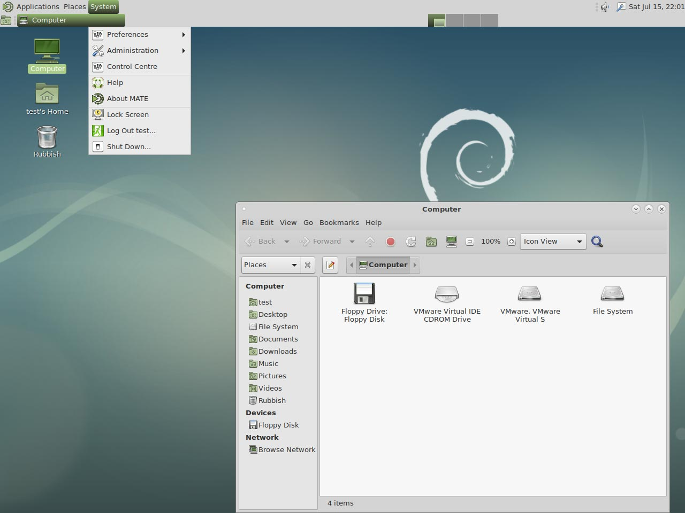
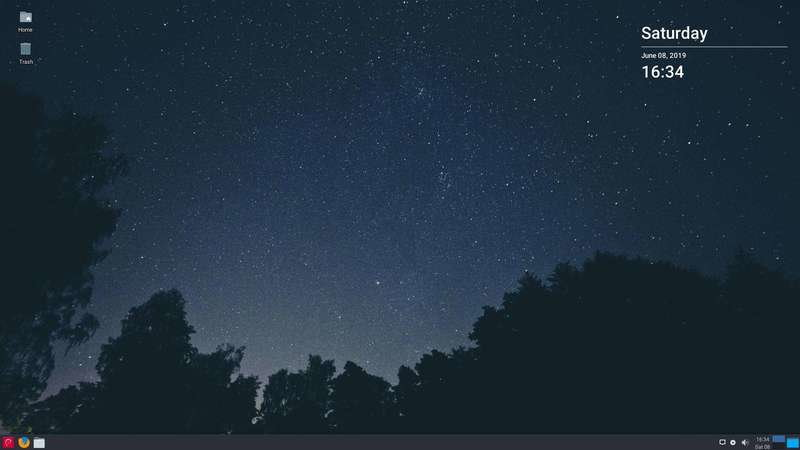
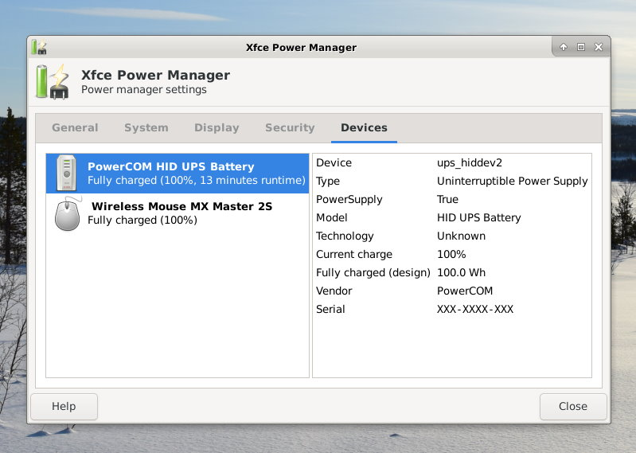

# Desktop environments & utilities

## Desktops
- [LXDE - Highly optimized ultra lightweight desktop](#lxde-ultra-lightweight-desktop)
- [LXQt - Slick and optimized lightweight desktop](#lxqt-optimized-lightweight-desktop)
- [MATE - Popular Gnome 2 desktop](#mate-popular-gnome2-desktop)
- [Xfce - Lightweight desktop](#mate-popular-gnome2-desktop)
- [GnuStep - Alternative/unique desktop](#gnustep-alternativeunique-desktop)

### [Desktop Utilities](#desktop-utilities_1)
- [Chromium - Web browser](#chromium-web-browser)
- [GIMP - Image editor](#gimp-image-editor)
- [QuiteRSS - RSS and Atom news feeds reader](#quiterss-atom-news-feeds-reader)
- [Xfce4 Power - Power manager with brightness](#xfce4-power-power-manager-with-brightness)

[Return to the **Optimised Software list**](../user-optimised-software)

??? info "How do I run **DietPi-Software** and install **Optimised software** ?" 
    To install any of the **DietPi Optimised Software** listed below run from the command line: 
    ```
    dietpi-launcher 
    ```
    and selected _DietPi-Software_. or launch directly the tool: 
    ```
    dietpi-software 
    ```
    
    Choose **Software optimised** and select one or more items. Finally click on `Install`. DietPi will do all the necessary steps to install and start these software items.

    

    To see all the DietPi configurations options, review [DietPi Tools](../user-guide_tools) section.

!!! warning "Documentation in progress..." 
    The **Optimised Software** links marked in **bold** have a more detailed description. The other links redirect to the old documentation (available on [DietPi.com Forum](https://dietpi.com/phpbb/viewtopic.php?f=8&t=5))  


## LXDE - ultra lightweight desktop
LXDE is highly optimized and ultra lightweight desktop. It works well with computers on the low end of the performance spectrum such as new generation netbooks and small computers, or older resource-constrained machines.

=== "Quick start"
    After installation, desktop can be run by typing 
    ```
    startx
    ```

=== "Enable autostart"
    To start different programs when the SBC starts, run from the command line the main DietPi tool: 
    ```
    dietpi-launcher 
    ```
    or directly. 
    ```
    dietpi-autostart 
    ```
    To see all the DietPi configurations options, review [DietPi Tools](../user-guide_tools) section.

=== "Official documentation"
    [LXDE Website](https://www.lxde.org) - [LXDE Wiki](https://wiki.lxde.org/en/Main_Page)


## LXQt - Optimized lightweight desktop
Optimized lightweight desktop without the bloatware. Slick and fluid GUI, however, more resource heavy than LXDE.

=== "Quick start"
    After installation, desktop can be run by typing 
    ```
    startx
    ```

=== "Enable autostart"
    Using `dietpi-autostart` you can have DietPi boot directly to the desktop

=== "Official documentation"
    [LXQt Wiki](https://wiki.debian.org/LXQt)


## MATE - Popular Gnome2 desktop.
Popular Gnome2 based desktop environment.

=== "Quick start"
    After installation, desktop can be run by typing 
    ```
    startx
    ```

=== "Enable autostart"
    Using `dietpi-autostart` you can have DietPi boot directly to the desktop

=== "Official documentation"
    [MATE Desktop website](https://mate-desktop.org/)



## Xfce - Lightweight desktop

=== "Quick start"
    After installation, desktop can be run by typing 
    ```
    startx
    ```

=== "Enable autostart"
    Using `dietpi-autostart` you can have DietPi boot directly to the desktop

=== "Official documentation"
    [Xfce website](https://wiki.debian.org/Xfce)



## GnuStep - Alternative/unique desktop

=== "Quick start"
    After installation, desktop can be run by typing 
    ```
    startx
    ```

=== "Enable autostart"
    Using `dietpi-autostart` you can have DietPi boot directly to the desktop

=== "Official documentation"
    [GNUstep website](http://gnustep.org/)


## Desktop utilities

### Chromium - Web browser

**Does my device support GPU acceleration ?** 

Not all devices support GPU acceleration with Chromium.
- RPis supports native OpenGL and will be configured during installation.
- Odroids support OpenGLES and will be configured during installation.
- Other devices will most likely be limited to software rendering.

**Where can I check the status of GPU acceleration ?**
Once Chromium is running, simply go to the following address:
    chrome://gpu

**Enable support for Widevine DRM protected content on RPi:**

 - Manually: [https://blog.vpetkov.net/2019/07/12/net ... -chromium/](https://blog.vpetkov.net/2019/07/12/netflix-and-spotify-on-a-raspberry-pi-4-with-latest-default-chromium/)
 - with scripts: [https://blog.vpetkov.net/2020/03/30/ras ... ny-others/](https://blog.vpetkov.net/2020/03/30/raspberry-pi-netflix-one-line-easy-install-along-with-hulu-amazon-prime-disney-plus-hbo-spotify-pandora-and-many-others/)


### GIMP - Image editor

MS Paint on steroids. If you need to edit pixels with a vast number of tools, GIMP is the only program you'll need. 


https://www.gimp.org/

### QuiteRSS - Atom news feeds reader
QuiteRSS is a open-source cross-platform RSS / Atom news feeds reader, with the main idea to be fast and comfortable to the end-user.


### Xfce4 Power - Power manager with brightness

Enables laptop users to set up a power profile for two different modes `on battery power` and `on AC Power` while still allowing desktop users to at least change the DPMS settings and CPU frequency using the settings dialogue.


