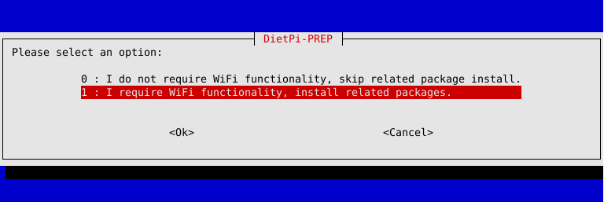
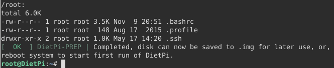

# Supported Single Board Computers (SBCs)

## Raspberry Pi

The Raspberry Pi has sold more than 31 million units since it launched in 2012. Any Raspberry Pi can serve as a secondary computer for email and web surfing. The real fun starts when you use your Pi for projects, which can range from robots to retro arcade machines to home media servers, security cameras and so on.

You can install DietPi by following the step by step [Starting guide](../user-guide_installation/).

DietPi runs very well on latest model **Raspberry Pi 4 Model B** (launched in 2019 / 2020)


as well as on one of the first models **Raspberry Pi 1** (launched in 2012)


and even on the compact form **Raspberry Pi Zero W**


Quick intro:

<iframe width="560" height="315" src="https://www.youtube-nocookie.com/embed/sajBySPeYH0" frameborder="0" allow="accelerometer; autoplay; encrypted-media; gyroscope" allowfullscreen></iframe>

<div class="md-typeset__table">
    <table>
        <thead>
            <tr>
                <th align="left"><strong>Product</strong></th>
                <th align="left"><strong>Description</strong></th>
            </tr>
        </thead>
        <tbody>
        <tr>
            <td align="left"><a class="table"><strong>Raspberry Pi - ALL models</strong></a></td>
            <td align="left">
                <strong>Unique DietPi image available for ALL Raspberry Pi models: Raspberry Pi 4 Model B, Raspberry Pi 3 Model A+ / B / B+, Raspberry Pi 2 Model B, Raspberry Pi 1 Model A+ / B+, Raspberry Pi Zero W</strong>: <a href="https://dietpi.com/downloads/images/DietPi_RPi-ARMv6-Buster.7z">Download image</a></li>
            </td>
        </tr>
        </tbody>
    </table>
</div>

## Odroid

ODROID single board computers are powerful, stable, and fast performing. They can function as a home theater set-top box, a general purpose computer for web browsing, gaming and socializing, a compact tool for college or office work, a prototyping device for hardware tinkering, a controller for home automation, a workstation for software development, and much more. For more details visit <a target="_blank" rel="noopener" href="https://www.hardkernel.com/">Hardkernel.com</a>

ODROID-N2 is one of the supported boards.


It is a new generation single board computer that is more powerful, more stable, and faster performing than N1. The main CPU of the N2 is based on big. Thanks to the modern 12nm silicon technology, the A73 cores runs at 1.8 GHz without thermal throttling using the stock metal-housing heat sink allowing a robust and quiet computer.

<div class="md-typeset__table">
    <table>
        <thead>
            <tr>
                <th align="left"><strong>Product</strong></th>
                <th align="left"><strong>Description</strong></th>
            </tr>
        </thead>
        <tbody>
            <tr>
                <td align="left"><a class="table" href=""><strong>Odroid C1</strong></a></td>
                <td align="left">
                   <strong>Download</strong>: <a href="https://dietpi.com/downloads/images/DietPi_OdroidC1-ARMv7-Buster.7z">DietPi image</a></li>
                </td>
            </tr>
            <tr>
                <td align="left"><a class="table" href=""><strong>Odroid C2</strong></a></td>
                <td align="left">
                   <strong>Download</strong>: <a href="https://dietpi.com/downloads/images/DietPi_OdroidC2-ARMv8-Buster.7z">DietPi image</a></li>
                </td>
            </tr>
            <tr>
                <td align="left"><a class="table" href=""><strong>Odroid N1</strong></a></td>
                <td align="left">
                   <strong>Download</strong>: <a href="https://dietpi.com/downloads/images/DietPi_OdroidN1-ARMv8-Buster.7z">DietPi image</a></li>
                </td>
            </tr>
            <tr>
                <td align="left"><a class="table" href=""><strong>Odroid N2</strong></a></td>
                <td align="left">
                   <strong>Download</strong>: <a href="https://dietpi.com/downloads/images/DietPi_OdroidN2-ARMv8-Buster.7z">DietPi image</a></li>
                </td>
            </tr>
            <tr>
                <td align="left"><a class="table" href=""><strong>Odroid XU3 / XU4 / MC1 / HC1 / HC2</strong></a></td>
                <td align="left">
                   <strong>Download</strong>: <a href="https://dietpi.com/downloads/images/DietPi_OdroidXU4-ARMv7-Buster.7z">DietPi image</a></li>
                </td>
            </tr>
        </tbody>
    </table>
</div>

## PINE64

This is where PINE64 journey began. The PINE A64 is their first Single Board Computer powered by Allwinner's A64 Quad-Core ARM Cortex A53 64-Bit SOC. For more details visit <a target="_blank" rel="noopener" href="https://www.pine64.org/">PINE64.org</a>

The ROCKPro64 is the most powerful single board computer offered by PINE64.


It features a Rockchip RK3399 hexa-core SOC and up-to 4 GiB of dual-channel LPDDR4 system memory. Moreover, the board comes packed with features, including: an USB 3.0 and USB type C with DP1.2 port, a full PCIe x4 as well as eMMC module socket. You also get a 40pin header with I2C, SPI, UART and GPIO.

The board is backwards compatible with many of the existing PINE64 peripherals, including the WiFi/Bluetooth module, camera module and LCD panel but an array of new peripherals specific for the board is also available. All this in the exact same model “A” dimension as the original PINE A64.

The ROCKPro64 4 GiB board is designated as LTS (Long-term support) which means that PINE64 is committed to provide support for at least 5 years – until year 2023 and beyond.

<div class="md-typeset__table">
    <table>
        <thead>
            <tr>
                <th align="left"><strong>Product</strong></th>
                <th align="left"><strong>Description</strong></th>
            </tr>
        </thead>
        <tbody>
            <tr>
                <td align="left"><a class="table" href=""><strong>PINE A64</strong></a></td>
                <td align="left">
                   <strong>Download</strong>: <a href="https://dietpi.com/downloads/images/DietPi_PINEA64-ARMv8-Buster.7z">DietPi image</a></li>
                </td>
            </tr>
            <tr>
                <td align="left"><a class="table" href=""><strong>PINE H64</strong></a></td>
                <td align="left">
                   <strong>Download</strong>: <a href="https://dietpi.com/downloads/images/DietPi_PINEH64-ARMv8-Buster.7z">DietPi image</a></li>
                </td>
            </tr>
            <tr>
                <td align="left"><a class="table" href=""><strong>Pinebook</strong></a></td>
                <td align="left">
                   <strong>Download</strong>: <a href="https://dietpi.com/downloads/images/DietPi_Pinebook-ARMv8-Buster.7z">DietPi image</a></li>
                </td>
            </tr>
            <tr>
                <td align="left"><a class="table" href=""><strong>ROCK64</strong></a></td>
                <td align="left">
                   <strong>Download</strong>: <a href="https://dietpi.com/downloads/images/DietPi_ROCK64-ARMv8-Buster.7z">DietPi image</a></li>
                </td>
            </tr>
            <tr>
                <td align="left"><a class="table" href=""><strong>ROCKPro64</strong></a></td>
                <td align="left">
                   <strong>Download</strong>: <a href="https://dietpi.com/downloads/images/DietPi_ROCKPro64-ARMv8-Buster.7z">DietPi image</a></li>
                </td>
            </tr>
        </tbody>
    </table>
</div>

## ROCK Pi

**Maker Friendly, IoT connectivity** enabled. Radxa ROCK Pi features maker friendly expansion options, including a 40-pin GPIO interface that allow for interfacing with a range inputs from buttons, switches, sensors, LEDs, and much more. It also features a Gbit LAN for network, with dedicated bus and controller, it works without latency under heavy load network applications.
For more details visit the [**Radxa ROCK Pi**](https://rockpi.org/) website.

One of the supported boards is ROCK Pi 4.


ROCK Pi 4 is a Single Board Computer (SBC) in an ultra-small form factor that offers class-leading performance while leveraging outstanding mechanical compatibility. The ROCK Pi 4 offers makers, IoT enthusiasts, hobbyists, PC DIY enthusiasts and others a reliable and extremely capable platform for building and tinkering their ideas into reality.

<div class="md-typeset__table">
    <table>
        <thead>
            <tr>
                <th align="left"><strong>Product</strong></th>
                <th align="left"><strong>Description</strong></th>
            </tr>
        </thead>
        <tbody>
            <tr>
                <td align="left"><a class="table" href=""><strong>ROCK Pi 4</strong></a></td>
                <td align="left">
                   <strong>Download</strong>: <a href="https://dietpi.com/downloads/images/DietPi_ROCKPi4-ARMv8-Buster.7z">DietPi image</a></li>
                </td>
            </tr>
            <tr>
                <td align="left"><a class="table" href=""><strong>ROCK Pi S</strong></a></td>
                <td align="left">
                   <strong>Download</strong>: <a href="https://dietpi.com/downloads/images/DietPi_ROCKPiS-ARMv8-Buster.7z">DietPi image</a></li>
                </td>
            </tr>
        </tbody>
    </table>
</div>

## Firefly

**Six-core 64-bit High Performance Open Source Platform**. For more details visit [**Firefly RK3399**](https://en.t-firefly.com/product/rk3399.html) website.


<div class="md-typeset__table">
    <table>
        <thead>
            <tr>
                <th align="left"><strong>Product</strong></th>
                <th align="left"><strong>Description</strong></th>
            </tr>
        </thead>
        <tbody>
            <tr>
                <td align="left"><a class="table" href=""><strong>Firefly RK3399</strong></a></td>
                <td align="left">
                   <strong>Download</strong>: <a href="https://dietpi.com/downloads/images/DietPi_FireflyRK3399-ARMv8-Buster.7z">DietPi image</a></li>
                </td>
            </tr>
        </tbody>
    </table>
</div>

## Allo Sparky SBC

Sparky Single Board Computer (SBC) is a credit card-sized board that can be used as a standalone computer, in electronics projects, games, and also in many other applications. A true open hardware, community-supported embedded computer for developers and hobbyists. The Sparky SBC has all the functionality of a basic computer. For more details visit the [**Allo Sparky SBC**](https://www.allo.com/sparky/sparky-sbc.html) website.


<div class="md-typeset__table">
    <table>
        <thead>
            <tr>
                <th align="left"><strong>Product</strong></th>
                <th align="left"><strong>Description</strong></th>
            </tr>
        </thead>
        <tbody>
            <tr>
                <td align="left"><a class="table" href=""><strong>Sparky SBC</strong></a></td>
                <td align="left">
                   <strong>Download</strong>: <a href="https://dietpi.com/downloads/images/DietPi_SparkySBC-ARMv7-Buster.7z">DietPi image</a></li>
                </td>
            </tr>
        </tbody>
    </table>
</div>

## ASUS Tinker Board

Tinker Board is a Single Board Computer (SBC) in an ultra-small form factor that offers class-leading performance while leveraging outstanding mechanical compatibility. The Tinker Board offers makers, IoT enthusiasts, hobbyists, PC DIY enthusiasts and others a reliable and extremely capable platform for building and tinkering their ideas into reality. For more details visit the [**ASUS Tinker Board**](https://tinker-board.asus.com/index.html) website.

Tinker Board features standard maker connectivity options, including a 40-pin GPIO interface that allow for interfacing with a range inputs from buttons, switches, sensors, LEDs, and much more.


Tinker Board is equipped with one DSI MIPI connection for displays and touchscreens. The secondary CSI MIPI connection is for connection to compatible cameras allowing for computer vision, and much more.

Careful consideration went into the design and development of the Tinker Board to ensure that it provides a superior user experience for first-time builders or for seasoned hobbyists. Builders appreciate the color-coded GPIO header, which makes it easy to recognize respective pin headers.

<div class="md-typeset__table">
    <table>
        <thead>
            <tr>
                <th align="left"><strong>Product</strong></th>
                <th align="left"><strong>Description</strong></th>
            </tr>
        </thead>
        <tbody>
            <tr>
                <td align="left"><a class="table" href=""><strong>ASUS Tinker Board</strong></a></td>
                <td align="left">
                   <strong>Download</strong>: <a href="https://dietpi.com/downloads/images/DietPi_ASUSTB-ARMv7-Buster.7z">DietPi image</a></li>
                </td>
            </tr>
        </tbody>
    </table>
</div>

## NanoPi Series (FriendlyARM)

**FriendlyARM's next generation SBC** - One of the fastest ARM SBC (RK3399) on the market today, with 2 x 1.8 GHz A72 cores and 4 x 1.4 GHz A53 cores. One of the smallest RK3399 SBCs available, a great addition to your SBC lineup that provides next gen SBC performance.

For more details visit the [**FriendlyARM**](https://www.friendlyarm.com/) website.


**NanoPi K2** supports DVFS and it can smooth play high-definition video streams, and it is very well suited for applications such as advertisement machines, TV boxes, home entertainment appliances or multimedia devices.

<div class="md-typeset__table">
    <table>
        <thead>
            <tr>
                <th align="left"><strong>Product</strong></th>
                <th align="left"><strong>Description</strong></th>
            </tr>
        </thead>
        <tbody>
            <tr>
                <td align="left"><a class="table" href=""><strong>NanoPi NEO</strong></a></td>
                <td align="left">
                   <strong>Download</strong>: <a href="https://dietpi.com/downloads/images/DietPi_NanoPiNEO-ARMv7-Buster.7z">DietPi image</a></li>
                </td>
            </tr>
            <tr>
                <td align="left"><a class="table" href=""><strong>NanoPi NEO Plus2</strong></a></td>
                <td align="left">
                   <strong>Download</strong>: <a href="https://dietpi.com/downloads/images/DietPi_NanoPiNEOPlus2-ARMv8-Buster.7z">DietPi image</a></li>
                </td>
            </tr>
            <tr>
                <td align="left"><a class="table" href=""><strong>NanoPi NEO2</strong></a></td>
                <td align="left">
                   <strong>Download</strong>: <a href="https://dietpi.com/downloads/images/DietPi_NanoPiNEO2-ARMv8-Buster.7z">DietPi image</a></li>
                </td>
            </tr>
            <tr>
                <td align="left"><a class="table" href=""><strong>NanoPi NEO2 Black</strong></a></td>
                <td align="left">
                   <strong>Download</strong>: <a href="https://github.com/MichaIng/DietPi/issues/3333">DietPi image</a></li>
                </td>
            </tr>
            <tr>
                <td align="left"><a class="table" href=""><strong>NanoPi NEO3</strong></a></td>
                <td align="left">
                   <strong>Download</strong>: <a href="https://dietpi.com/downloads/images/DietPi_NanoPiNEO3-ARMv8-Buster.7z">DietPi image</a></li>
                </td>
            </tr>
            <tr>
                <td align="left"><a class="table" href=""><strong>NanoPi NEO4</strong></a></td>
                <td align="left">
                   <strong>Download</strong>: <a href="https://dietpi.com/downloads/images/DietPi_NanoPCT4-ARMv8-Buster.7z">DietPi image</a></li>
                </td>
            </tr>
            <tr>
                <td align="left"><a class="table" href=""><strong>NanoPi K1 Plus</strong></a></td>
                <td align="left">
                   <strong>Download</strong>: <a href="https://dietpi.com/downloads/images/DietPi_NanoPiK1Plus-ARMv8-Buster.7z">DietPi image</a></li>
                </td>
            </tr>
            <tr>
                <td align="left"><a class="table" href=""><strong>NanoPi K2</strong></a></td>
                <td align="left">
                   <strong>Download</strong>: <a href="https://dietpi.com/downloads/images/DietPi_NanoPiK2-ARMv8-Buster.7z">DietPi image</a></li>
                </td>
            </tr>
            <tr>
                <td align="left"><a class="table" href=""><strong>NanoPi M1 Plus</strong></a></td>
                <td align="left">
                   <strong>Download</strong>: <a href="https://dietpi.com/downloads/images/DietPi_NanoPiM1Plus-ARMv7-Buster.7z">DietPi image</a></li>
                </td>
            </tr>
            <tr>
                <td align="left"><a class="table" href=""><strong>NanoPi M1/T1</strong></a></td>
                <td align="left">
                   <strong>Download</strong>: <a href="https://dietpi.com/downloads/images/DietPi_NanoPiM1-ARMv7-Buster.7z">DietPi image</a></li>
                </td>
            </tr>
            <tr>
                <td align="left"><a class="table" href=""><strong>NanoPi M2/T2</strong></a></td>
                <td align="left">
                   <strong>Download</strong>: <a href="https://dietpi.com/downloads/images/DietPi_NanoPiM2-ARMv7-Buster.7z">DietPi image</a></li>
                </td>
            </tr>
            <tr>
                <td align="left"><a class="table" href=""><strong>NanoPi M3/T3</strong></a></td>
                <td align="left">
                   <strong>Download</strong>: <a href="https://dietpi.com/downloads/images/DietPi_NanoPiM3-ARMv8-Buster.7z">DietPi image</a></li>
                </td>
            </tr>
            <tr>
                <td align="left"><a class="table" href=""><strong>NanoPi M4V2</strong></a></td>
                <td align="left">
                   <strong>Download</strong>: <a href="https://dietpi.com/downloads/images/DietPi_NanoPiM4V2-ARMv8-Buster.7z">DietPi image</a></li>
                </td>
            </tr>
            <tr>
                <td align="left"><a class="table" href=""><strong>NanoPC T4</strong></a></td>
                <td align="left">
                   <strong>Download</strong>: <a href="https://dietpi.com/downloads/images/DietPi_NanoPCT4-ARMv8-Buster.7z">DietPi image</a></li>
                </td>
            </tr>
            <tr>
                <td align="left"><a class="table" href=""><strong>NanoPC M4</strong></a></td>
                <td align="left">
                   <strong>Download</strong>: <a href="https://dietpi.com/downloads/images/DietPi_NanoPCT4-ARMv8-Buster.7z">DietPi image</a></li>
                </td>
            </tr>
            <tr>
                <td align="left"><a class="table" href=""><strong>NanoPi Fire3</strong></a></td>
                <td align="left">
                   <strong>Download</strong>: <a href="https://dietpi.com/downloads/images/DietPi_NanoPiFire3-ARMv8-Buster.7z">DietPi image</a></li>
                </td>
            </tr>
            <tr>
                <td align="left"><a class="table" href=""><strong>NanoPi R2S</strong></a></td>
                <td align="left">
                   <strong>Download</strong>: <a href="https://dietpi.com/downloads/images/DietPi_NanoPiR2S-ARMv8-Buster.7z">DietPi image</a></li>
                </td>
            </tr>
            <tr>
                <td align="left"><a class="table" href=""><strong>ZeroPi</strong></a></td>
                <td align="left">
                   <strong>Download</strong>: <a href="https://dietpi.com/downloads/images/DietPi_NanoPiZeroPi-ARMv7-Buster.7z">DietPi image</a></li>
                </td>
            </tr>
        </tbody>
    </table>
</div>

## Native PC & Virtual Machines

### Native PC images

The Native PC images are great for those occasions where SBC performance just isn't enough. Run one of these on any x86_64 PC/server and still get the same great DietPi features and experience. This image is for motherboards with UEFI boot support and onboard eMMC (e.g.: Z83-II, Beelink AP32 and other Intel NUC/SBC devices with onboard eMMC).

### VMware

The VMware virtual machine is great for those occasions where SBC performance just isn't enough. Run one of these on any x86_64 PC/server and still get the same great DietPi features and experience.

### VirtualBox


VirtualBox is a general-purpose full virtualiser for x86 hardware, targeted at server, desktop and embedded use.

The VirtualBox virtual machine is great for those occasions where SBC performance just isn't enough. Run one of these on any x86_64 PC/server and still get the same great DietPi features and experience.

### Hyper-V (community image)

The Hyper-V virtual machine is great for those occasions where SBC performance just isn't enough. Run one of these on any x86_64 PC/server and still get the same great DietPi features and experience.

<div class="md-typeset__table">
    <table>
        <thead>
            <tr>
                <th align="left"><strong>Product</strong></th>
                <th align="left"><strong>Description</strong></th>
            </tr>
        </thead>
        <tbody>
            <tr>
                <td align="left"><a class="table" href=""><strong>Native PC for BIOS/CSM</strong></a></td>
                <td align="left">
                   <strong>Download</strong>: <a href="https://dietpi.com/downloads/images/DietPi_NativePC-BIOS-x86_64-Buster.7z">DietPi image</a></li>
                </td>
            </tr>
            <tr>
                <td align="left"><a class="table" href=""><strong>Native PC UEFI</strong></a></td>
                <td align="left">
                   <strong>Download</strong>: <a href="https://dietpi.com/downloads/images/DietPi_NativePC-UEFI-x86_64-Buster.7z">DietPi image</a></li>
                </td>
            </tr>
            <tr>
                <td align="left"><a class="table" href=""><strong>VMware</strong></a></td>
                <td align="left">
                   <strong>Download</strong>: <a href="https://dietpi.com/downloads/images/DietPi_VMware-x86_64-Buster.7z">DietPi image</a></li>
                </td>
            </tr>
            <tr>
                <td align="left"><a class="table" href=""><strong>VirtualBox</strong></a></td>
                <td align="left">
                   <strong>Download</strong>: <a href="https://dietpi.com/downloads/images/DietPi_VirtualBox-x86_64-Buster.7z">DietPi image</a></li>
                </td>
            </tr>
            <tr>
                <td align="left"><a class="table" href=""><strong>Hyper-V</strong></a></td>
                <td align="left">
                   <strong>Download</strong>: <a target="_blank" rel="noopener" href="https://github.com/yumiris/DietPi.Hyper-V/blob/master/README.md">DietPi image</a></li>
                </td>
            </tr>
        </tbody>
    </table>
</div>

## Make your own distribution

Unable to find an available image for your device?  
Don't worry, DietPi contains a script which can be used to generate an image for your device.

!!! attention "Advanced Linux knowledge required"
    To generate your own SBC support, an advanced Linux knowledge is required.  
    There is no guarantee that this will work for every SBC. Use the DietPi image generation script at your own risk!

!!! info "Limited end user support"
    End user support will be limited to issues that are DietPi specific (which excludes Kernel, GPU, onboard Bluetooth, WiFi, Audio, etc. from our support). GPU features are disabled for other devices (e.g.: Kodi, Desktop), ideal for server usage.  
    Generally in case of troubles it may be necessary that you search the root cause of problems by your own due to non existent SBCs at the DietPi team.

!!! tip "Use an extra SD card to test the DietPi image generation"
    It may be a good idea not to use your "productive and working SD card" to execute the DietPi image generation script.  
    You should use an own SD card and may copy it before via the `dd` command to a SD card for your tests.

### Basic information

The image generation is based on a shell script (**PREP_SYSTEM_FOR_DIETPI.sh**, located on [GitHub DietPi share](https://github.com/MichaIng/DietPi/)):

- **The script will** convert any 'bloated' Debian/Raspbian installation into a lightweight DietPi system.  
- **The script will NOT** support converting existing installed software (e.g. Nextcloud, Plex Media Server) over to the DietPi system.
- **All existing software (APT) and user data will be deleted.**

The script has to be executed on the target system which you want to convert to a lightweight DietPi system.  
Basically there are three options for the image generation:

- based on the `master` branch of DietPi
- based on the `beta` branch of DietPi
- based on the `dev` branch of DietPi

It is recommended using the `master` or `dev` branch. Using the `dev` branch helps hardening the upcoming DietPi release, so this is appreciated.

### Prerequisites

**Requirement 1:** Ensure a Debian/Raspbian OS is running on the system:

- For best results, we recommend a fresh/clean minimal Debian/Raspbian installation
- Native PC users: Please install Debian stable before hand: <https://www.debian.org/distrib/netinst>
- Desktop images should work, however, the minimal the image, the quicker the installation, as less packages will need to be removed.  
  Remark: We do not support Ubuntu, or have any plans to do so.

**Requirement 2:** Packages which have to be installed in advance:

- Needed packages should already exist on most systems, however pure minimal images may require the following installations:

    ```sh
    apt update
    apt install -y systemd-sysv ca-certificates sudo wget locales --reinstall
    ```

### Script execution

!!! important "Needed: Run script within SSH command or local term"
    Do not run the script within any desktop environment, because the desktop is uninstalled during the script execution.  
    That will "pull the ground from under your feet".

!!! important "Needed: Root rights"
    Ensure you have elevated privileges (e.g.: login as `root`, or use `sudo` resp. `su`).

The following procedure is explained with the use of the `dev` branch. Unless otherwise noted, the procedure is identical to the `beta` and the `master` branches.

Execute the following shell command to get the script (`dev` branch):

```sh
wget https://raw.githubusercontent.com/MichaIng/DietPi/dev/PREP_SYSTEM_FOR_DIETPI.sh -O PREP_SYSTEM_FOR_DIETPI.sh
```

In case of using the `beta` branch execute:

```sh
wget https://raw.githubusercontent.com/MichaIng/DietPi/beta/PREP_SYSTEM_FOR_DIETPI.sh -O PREP_SYSTEM_FOR_DIETPI.sh
```

In case of using the `master` branch execute:

```sh
wget https://raw.githubusercontent.com/MichaIng/DietPi/master/PREP_SYSTEM_FOR_DIETPI.sh -O PREP_SYSTEM_FOR_DIETPI.sh
```

As the next step, execute

```sh
chmod +x PREP_SYSTEM_FOR_DIETPI.sh
./PREP_SYSTEM_FOR_DIETPI.sh
```

In the following dialog you have to select the DietPi installer branch. Choose the same branch as the DietPi `PREP_SYSTEM_FOR_DIETPI.sh` script:

{: style="width:550px"}

In the following dialogs enter your name and afterwards the actual image base and the device (SBC or PC) the system is running on:

{: style="width:550px"}

{: style="width:550px"}

Depending on whether you want to use the WiFi feature later on, you have to select the option to keep or purge the WiFi package. To keep the package could be the case if your hardware has an onboard WiFi or you add the WiFi e.g. via an USB WiFi adapter.

{: style="width:550px"}

The last selection is the target Debian version (the actual **Buster** or the upcoming **Bullseye**).  
For the older version **Jessie** you need to use a different branch (branch `jessie` instead of `master`, `beta`, or `dev`).  
After this, the script runs a couple of minutes, finally the following message occurs:

{: style="width:550px"}

If you did not use branch `master` the last step is to edit file `/boot/dietpi.txt` and edit the entry  
`DEV_GITBRANCH=master`  
which is near the end of the file.

After this you can restart your system (`reboot`), alternatively you can copy the SC card (via `dd`) to an image (`.img`) to duplicate your base installation.

A further step can be to generate a compressed DietPi image via the `dietpi-imager` script (located in the `.meta` subdirectory in the [GitHub DietPi share](https://github.com/MichaIng/DietPi/) or via  
`sudo bash -c "$(curl -s https://raw.githubusercontent.com/MichaIng/DietPi/dev/.meta/dietpi-imager)"`).
