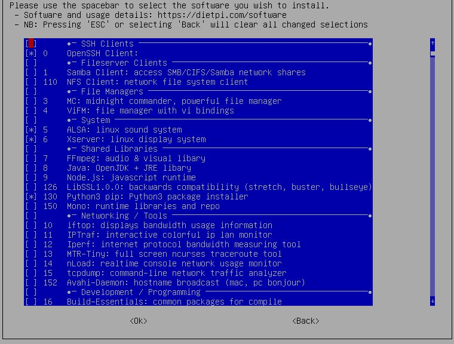
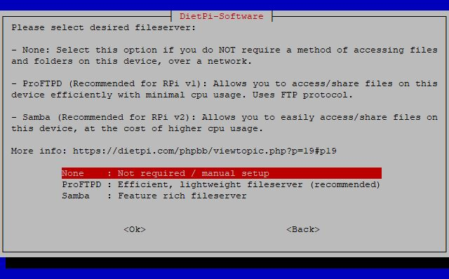
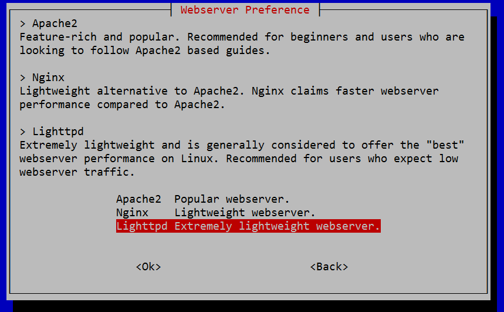
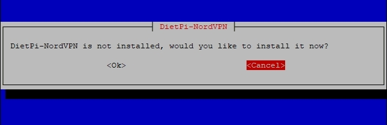
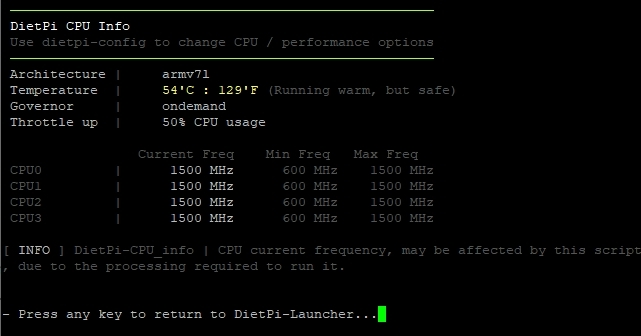

# DietPi Tools

## DietPi-Launcher

It provides an easy access to all DietPi OS tools, and it could be accessed by running next command:

``` bash
dietpi-launcher
```


## DietPi software

**dietpi-software** will be automatically displayed on the first login after the installation. It can be accessed at any time running next command:

``` bash
dietpi-software
```

It is one of the core tools, enabling you to install or uninstall one or more [**DietPi optimised software**](../dietpi_optimised_software/) titles.


### Software overview

=== "Software Optimised"

    - Begin by selecting **Software Optimized** in the main menu list and hit Enter.

    - Scroll through the list of available software - for more details check [DietPi Optimised Software](../dietpi_optimised_software/).

    The list of optimised software is long. You either browse the list or use the option **Search**.

    - To install software on your DietPi, select it in the list and press the **space bar** to add it to the installation list. If you change your mind, hit space again to remove it.

    - Once you’ve selected the software you wish to install, press the tab key on your keyboard to switch to the confirmation options at the bottom. Select **OK**, then hit enter on your keyboard to confirm.

    - To begin installing your software, select **Install** from the main menu list, then hit the Enter key. DietPi will ask you to confirm your choice(s). Select **OK**, then hit enter to begin the installation.

    The software you selected will begin to install at this point. Once the process is completed, you may be asked to restart your device. Press **OK** to confirm.

    

=== "Software Additional"

    This section provides:

    - software packages that are often used and installed via `apt install <package>`, without additional optimisation from DietPi team.
    - _or_ packages not directly required, but pulled as a dependency, like: build tools, libraries or runtime systems. E.g. packages like *Python3*, *pip*, *tcpdump* or *midnight commander* can be installed using the dialog.

    {: style="width:640px"}

=== "Search"

You can return to the **DietPi-Software** tool to make further changes at any time by typing `dietpi-software` at the terminal, or enter `dietpi-launcher` and select **DietPi-Software** tool.

=== "SSH Server"

    This lets you select your preferred SSH server. Also you can uninstall any SSH server to save memory and to exclude any external ssh based access.

    {: style="width:550px"}

=== "File Server"

    DietPi-Software allows you to easily choose a method of **accessing the files** on your DietPi system.
    Installing one of DietPi's file server choices will allow you to access and share files on your DietPi system.

    DietPi will then automatically install and setup the file server for you. DietPi will also clean and remove any previous file server from your system.

    The **default destination** directory for file servers is ***/mnt/dietpi_userdata***.

    The reasons for choosing **ProFTPD** over **Samba** may be:

    - ProFTPD outperforms Samba in all aspects of performance.
    - ProFTPD can max out the RPi 100 Mbit connection with minimal CPU usage.
    - Samba server on a RPi v1 will hit 100% CPU usage at 40 Mbit transfer rate.

    {: style="width:550px"}

    See [file servers overview](../software/file_servers/) for further information.

=== "Log System"

    Various logging methods can be selected from lightweight to full.
    If you don’t require log files, get a performance boost. If you need full system logging features, DietPi can do that too.

    The Log System can be changed at any time by selecting a different “Log System” from the menu.

    {: style="width:550px"}

    See also <https://dietpi.com/docs/software/log_system/>.

=== "Webserver Preference"

    The DietPi **Webserver Preference** system allows you to choose your favourite webserver for use in DietPi installations. When you select any software for installation that requires a webserver (e.g. Pi-hole, Nextcloud, Webmin, installed via *Software Optimized*), DietPi will automatically install, configure and optimize your chosen *Webserver Preference*.  
    Basically, you will never need to manually select/install a webserver stack again. DietPi will do it all for you.

    {: style="width:550px"}

=== "User Data Location"

    In DietPi, we class user data as:

    - **Data storage for applications**. Some examples are ownCloud/Nextcloud data store, BitTorrent downloads and SQL data store (v142+).
    - The location where your **file server** choice will point to, if you install one (e.g.: Samba Server, ProFTPD).
    - The location where you can upload and store your **media content**, for other applications to use (e.g.: Kodi, Emby, Plex etc).

    For all software you install in dietpi-software, you can access your user data with ***/mnt/dietpi_userdata***. Regardless of where the data is physically stored, a symlink will automatically be created for you if needed.  
    To check where the physical location is, you can run the following command:  
    `readlink -f /mnt/dietpi_userdata`

    You can **move your user data** to another location (e.g. USB drive). Simply run `dietpi-software` and enter the *User data location* menu option:

    - If you need to setup a new external drive, select *Drive Manager* to launch *DietPi-Drive Manager*.
    - Use the *List* option to select from a list of mounted drives, or, select *Manual* for a custom location.

    DietPi will automatically move your existing user data to your new location.

    {: style="width:550px"}

### Install or remove software

=== "Install"

    Install selected software item(s), and these could come both from **optimised software** list or **additional software** items.

=== "Uninstall"

    Select one or more software items which you would like to be removed from your DietPi installation.

=== "Command line based installation"

    Beside the interactive software installation via `dietpi-software` with checking wanted software packages and installing them, there is the option of installing the software packages via the shell command line.  
    The usage of `dietpi-software` is:

    ```bash
    Usage: dietpi-software [<command> [<software_id>...]]
    Available commands:
      <empty>     Interactive menu to install or uninstall software
      install     <software_id>...	Install each software given by space-separated list of IDs
      reinstall   <software_id>...	Reinstall each software given by space-separated list of IDs
      uninstall   <software_id>...	Uninstall each software given by space-separated list of IDs
      list        Print a list with IDs and info for all available software titles
      free        Print an unused software ID, free for a new software implementation
    ```

    The <software_id\> which has to be given is the one which is present in the software list within the `dietpi-software` dialogs:

    {: style="width:400px"}

    E.g. to install Chromium, LXQt and GIMP you have to execute:

    ```bash
    dietpi-software install 113 173 174
    ```

## Configuration

=== "DietPi configuration"

    Configure various system settings, from display / audio / network to _auto start_ options.  
    Run `dietpi-config`.

    

    **Display Settings**

    - Set your screen resolution, or go headless to save additional resources
    - Control your GPU memory splits
    - Enable/disable the RPi camera

    **Audio Options**

    - Change sound cards with ease (e.g.: HiFiBerry / Odroid HiFi shield)

    **Performance Options**

    - Overclock your system with a vast selection of overclocking profiles for your device
    - Change the CPU governor and tweak your ARM temperature limits

    **Advanced Settings**

    - Configure swap file size
    - Update device firmware
    - Toggle serial console
    - Toggle Bluetooth

    **Security Options**

    - Change password and hostname

    **Regional / Language Options**

    - Set timezone, locale and keyboard options. Everything you'll need to make it feel like home

    **Networking Options: Adapters**

    - Scan and connect to your WiFi router with ease
    - Change to a static IP address on your network
    - Configure your proxy settings
    - Test internet connection
    - Toggle IPv6 support

    **Networking Options: NAS/Misc**

    - Samba client utility allows you to quickly and easily connect to Windows Shares
    - FTP client utility allows you to quickly and easily connect to FTP servers as a filesystem mount
    - No-IP client utility. Allows you to quickly and easily setup your website address for your Pi, using a No-IP account

    **AutoStart Options**

    - Quickly and easily change what software runs after boot. Kodi, Desktop, console and many more

    **Tools**

    - Filesystem and memory benchmarks
    - CPU/IO/RAM/DISK Stress tests

=== "DietPi drive manager"

    Feature-rich drive management utility.  
    Run `dietpi-drive_manager`.

    

=== "DietPi autostart"

    Defines software packages to start when the DietPi OS boots up. Example, boot into the desktop with Kodi running.  
    Run `dietpi-autostart`.

    

=== "DietPi services"

    Provides service control, priority level tweaks and status print.  
    Run `dietpi-services`.

    

=== "DietPi Led control"

    Run `dietpi-led_control`.

    

=== "DietPi cron"

    Modify the start times of specific cron job groups.  
    Run `dietpi-cron`.

    

=== "DietPi JustBoom"

    Change the audio settings.  
    Run `dietpi-justboom`.

    

=== "DietPi sync"

    Sync or duplicate a directory to another.  
    Run `dietpi-sync`.

    

## Update & Backup

=== "DietPi update"

    Update DietPi OS version to the latest version available.  
    Run `dietpi-update`.

=== "DietPi backup"

    Fully backups DietPi setup. It also includes the restore capability from an already made DietPi backup.  
    Run `dietpi-backup`.

## Let's Encrypt SSL & NordVPN support

=== "DietPi LetsEncrypt"

    Access the frontend for the `Let's Encrypt` integration.  
    Run `dietpi-letsencrypt`.

    

=== "DietPi NordVPN"

    Run `dietpi-nordvpn`.

    

## Miscellaneous

=== "DietPi CPU info"

    Displays CPU temperature, processor frequency, throttle level etc.  
    Run `dietpi-cpuinfo`.

    

=== "DietPi survey"

    Run `dietpi-survey`.

    

=== "DietPi bug report"

    Run `dietpi-bugreport`.

    

=== "DietPi morse code"

    It converts a text file into morse code.  
    Run `dietpi-morsecode`.

## Maintenance

=== "DietPi file explorer"

    Lightweight file manager and explorer.  
    Run `dietpi-explorer`.

    

=== "DietPi cleaner"

    Clean up not necessary files from the operating system and free up valuable disk space.  
    Run `dietpi-cleaner`.

    

=== "DietPi log clear"

    Clear log files in /var/log/.  
    Run `dietpi-logclear`.

    
