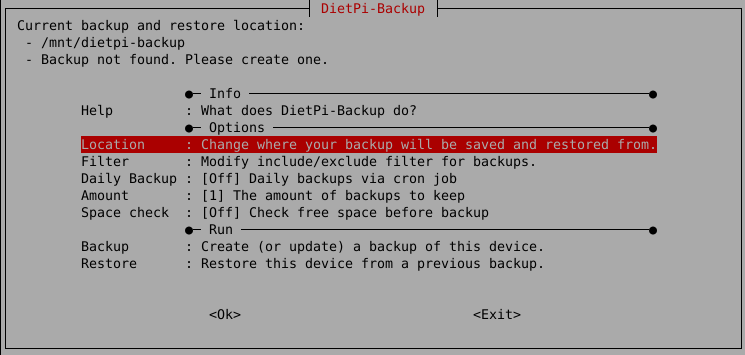

# DietPi Tools

## DietPi launcher

It provides an easy access to all DietPi OS tools, and it could be accessed by running next command:

```sh
dietpi-launcher
```

{: width="642" height="398" loading="lazy"}

---

## Software installation

### DietPi software

`dietpi-software` will be automatically displayed on the first login after the installation. It can be accessed at any time running next command:

```sh
dietpi-software
```

It is one of the core tools, enabling you to install or uninstall one or more [**DietPi optimised software**](../software/) titles.

{: width="640" height="306" loading="lazy"}

#### Software overview

=== "Browse Software"

    - Begin by selecting **Browse Software** in the main menu list and hit ++enter++.

    - Scroll through the list of available software - for more details check the [DietPi software list](../software/).

    The list of optimised software is long. You either browse the list or use the option **Search Software**.

    - To install software on your DietPi, select it in the list and press ++space++ to add it to the installation list. If you change your mind, hit ++space++ again to remove it.

    - Once you’ve selected the software you wish to install, press ++tab++ to switch to the confirmation options at the bottom. Select **OK**, then hit ++enter++ to confirm.

    - To begin installing your software, select **Install** from the main menu list, then hit ++enter++. DietPi will ask you to confirm your choice(s). Select **OK**, then hit ++enter++ to begin the installation.

    The software you selected will begin to install at this point. Once the process is completed, you may be asked to restart your device. Press **OK** to confirm.

    {: width="643" height="365" loading="lazy"}

=== "Search Software"

    DietPi supports a large number of software titles. Instead of scrolling through the **Browse Software** list to find a specific software title, you may use the **Search Software** option. Type in the software ID or any keyword from its title or description and you'll get a list filtered by matching results.

    {: with="752" height="321" loading="lazy"}

---

#### Quick selections

=== "SSH Server"

    This lets you select your preferred SSH server. Also you can uninstall any SSH server to save memory and to exclude any external ssh based access.

    {: width="550" height="320" loading="lazy"}

=== "Log System"

    Various logging methods can be selected from lightweight to full.
    If you don’t require log files, get a performance boost. If you need full system logging features, DietPi can do that too.

    The Log System can be changed at any time by selecting a different “Log System” from the menu.

    {: width="550" height="370" loading="lazy"}

    See [log system choices](../software/log_system/) for further details.

=== "User Data Location"

    In DietPi, we class user data as:

    - **Data storage for applications**. Some examples are ownCloud/Nextcloud data store, BitTorrent downloads and SQL data store.
    - The location where your **File Server** choice will point to, if you install one, like Samba Server or ProFTPD.
    - The location where you can upload and store your **media content**, for other applications to use, like Kodi, Emby or Plex.

    For all software you install in dietpi-software, you can access your user data with `/mnt/dietpi_userdata`. Regardless of where the data is physically stored, a symlink will automatically be created for you if needed.  
    To check where the physical location is, you can run the following command:  

    ```sh
    readlink -f /mnt/dietpi_userdata
    ```

    You can **move your user data** to another location (e.g. USB drive). Simply run `dietpi-software` and enter the *User data location* menu option:

    - If you need to setup a new external drive, select *Drive Manager* to launch *DietPi-Drive Manager*.
    - Use the *List* option to select from a list of mounted drives, or, select *Manual* for a custom location.

    DietPi will automatically move your existing user data to your new location.

    {: width="550" height="287" loading="lazy"}

---

#### Install or remove software

=== "Install"

    Install software item(s) which have been selected via **Browse Software** list, via **Search Software**, or via the **SSH Server**, **File Server** or **Log System** choices.

=== "Uninstall"

    Select one or more software items which you would like to be removed from your DietPi system.

=== "Command line based installation"

    Beside the interactive software installation via `dietpi-software` with checking wanted software packages and installing them, there is the option of installing the software packages via the shell command line.  
    The usage of `dietpi-software` is:

    ```bash
    Usage: dietpi-software [<command> [<software_id>...]]
    Available commands:
      <empty>     Interactive menu to install or uninstall software
      install     <software_id>...  Install each software given by space-separated list of IDs
      reinstall   <software_id>...  Reinstall each software given by space-separated list of IDs
      uninstall   <software_id>...  Uninstall each software given by space-separated list of IDs
      list        Print a list with IDs and info for all available software titles
      free        Print an unused software ID, free for a new software implementation
    ```

    The `<software_id>` which has to be given is the one which is present in the software list within the `dietpi-software` dialogues:

    {: width="454" height="129" loading="lazy"}

    E.g. to install Chromium, LXQt and GIMP you have to run next command in the terminal:

    ```sh
    dietpi-software install 113 173 174
    ```

---

### DietPi LetsEncrypt

Access the frontend for the `Let's Encrypt` integration by running

```sh
dietpi-letsencrypt
```

In case of a non installed Certbot package it is installed at first:

{: width="642" height="216" loading="lazy"}

In the installation dialog some entries have to be made which are needed for the certificate (domain, Email), the other entries are configuration options. It is recommended to leave the key size at 4096 bits.

{: width="642" height="279" loading="lazy"}

When you execute the certificate installation it also installs it for your selected web server, i.e. you do not have to edit your web server configuration files, the installation routine does all for you.

!!! info "Port forwarding on your router"
    To be accessible from the internet, typically your router needs a port forwarding configuration to route incoming HTTP and HTTPS accesses to your DietPi system.  
    Although you only need a HTTPS protocol forwarding (typically port 433), you also need to forward the HTTP protocol (typically port 80) to your DietPi system, otherwise the certification renewal procedure will fail (due to the fact that the certification renewal procedure takes place several months later you may have forgotten this issue).

---

### DietPi VPN

DietPi-VPN is a combination of OpenVPN installation and DietPi front end GUI. Allowing all VPN users to quickly and easily connect to any NordVPN, ProtonVPN, or any other server that uses OpenVPN in TCP or UDP, using only open source software. To start DietPi-VPN, use the following command:

```sh
dietpi-vpn
```

{: width="642" height="300" loading="lazy"}

=== "Requires VPN Subscription"

    Although we enable forced encryption on all our BitTorrent clients, if you wish to ensure complete privacy and piece of mind for all your downloaded content, using a VPN is critical.  
    You can use any VPN provider you want, but DietPi-VPN specifically supports ProtonVPN and NordVPN.

=== "Usage"

    Simply run `dietpi-vpn` to use the GUI, allowing you to setup your connection and provider.  
    DietPi will also automatically start and connect the VPN during system boot if you select autostart.

=== "Killswitch"

    DietPi-VPN comes with an optional killswitch that will shut off your internet in the case of you losing your connection to the VPN sever.
    This will still allow access from your LAN and allow you to fix any problems using SSH, if needed.

{: width="200" height="58" loading="lazy"}

---

### DietPi DDNS

DietPi-DDNS is a generic Dynamic DNS (DDNS) client. It can be used to setup a cron job which updates your dynamically changing public IP address every defined amount of minutes against a DDNS provider, so that your public domain stays valid. It supports No-IP and replaces the No-IP client, which was available as install option on previous DietPi versions. To start DietPi-DDNS, use the following command:

```sh
dietpi-ddns
```

{: width="656" height="256" loading="lazy"}

=== "Supported providers"

    - DuckDNS: <https://www.duckdns.org/>
    - No-IP: <https://www.noip.com/>
    - Dynu: <https://www.dynu.com/>
    - FreeDNS: <https://freedns.afraid.org/>
    - OVH: <https://docs.ovh.com/gb/en/domains/hosting_dynhost/>
    - Alternatively you may use any other provider which has an API URL for updating your dynamic IP address.

=== "CLI"

    Type `dietpi-ddns -h` to get an overview of supported CLI commands and options:

    - If no argument is given, the interactive menu is started.
    - Use `dietpi-ddns <options> apply <provider>` to apply a cron job for the given provider and use the following options set details:
        - `<provider>` is either the name of a supported provider, or any custom update URL.
        - Use `-d <domains>` to add one or a comma-separated list of multiple domains, which should point to the public IP address of this system.
        - Use `-u <username>` to set a username or identifier. This is not required for all providers, in case of a custom provider, it is used as username for HTTP authentication.
        - Use `-p <password>` to set a password or token. This is not required for all providers, in case of a custom provider, it is used as username for HTTP authentication.
        - Use `-t <timespan>` to set an update interval in minutes, which is purely optional and defaults to 10 minutes.
        - If you did already setup DietPi-DDNS before, the `apply` command can also be used to change one of the above settings. All other options are optional then.
    - Use `dietpi-ddns remove` to remove any cron job that was setup before.

---

## System configuration

### DietPi configuration

Configure various system settings, from display / audio / network to *auto start* options. To start the system configuration, use the following command:

```sh
dietpi-config
```

{: width="643" height="335" loading="lazy"}

=== "Display Options"

    The display options are used to

    - Set your screen resolution, or go headless to save additional resources.  
    - Control your GPU memory splits.  
    - Enable/disable the RPi camera.

=== "Audio Options"

    The audio options are used to

    - Change sound cards with ease (e.g.: HiFiBerry / Odroid HiFi shield).

=== "Performance Options"

    The performance options are used to

    - Overclock your system with a vast selection of overclocking profiles for your device.
    - Change the CPU governor and tweak your ARM temperature limits.

=== "Advanced Options"

    The advanced options are used to

    - Configure swap file size
    - Configure time synchronization and real time clock source
    - Update device firmware
    - Toggle serial console
    - Toggle Bluetooth

=== "Security Options"

    The security options are used to

    - Change password and hostname

=== "Language/Regional Options"

    The language/regional options are used to

    - Set timezone, locale and keyboard options. Everything you will need to make it feel like home

=== "Network Options: Adapters"

    The network options are used to

    - Scan and connect to your WiFi router with ease
    - Change to a static IP address on your network
    - Configure your proxy settings
    - Test internet connection
    - Toggle IPv6 support

=== "Network Options: Misc"

    The miscellaneous network options options are used to

    - Select an **APT mirror** to connect to the Debian (or Raspbian) APT repository.
    - Select an **NTP mirror** to synchronise your system time.
    - Choose timeouts for network and URL connection tests.
    - **Network Drives** redirects you to the **DietPi-Drive_Manager** which allows you to mount Samba and NFS shares on your DietPi system.
    - **No-IP** is a [dynamic DNS](https://wikipedia.org/wiki/Dynamic_DNS) provider which allows you to access your home network/server with a static domain name. The client is required to inform No-IP of your current dynamic external IP on a regular basis.

=== "AutoStart Options"

    The autostart options are used to

    - Quickly and easily change what software runs after boot. Kodi, Desktop, console and many more

=== "Tools"

    The tools options are used to

    - Perform CPU, RAM, filesystem and network **benchmarks**, optionally upload your results and review statistics at: <https://dietpi.com/survey/#benchmark>
    - Perform CPU/IO/RAM/DISK **stress tests** to test the stability of your system, e.g. after applying some overclocking.

---

### DietPi drive manager

Feature-rich drive management utility. It is a lightweight program that allows you to:

- Manage drives: Mount, format external drives
- Maintenance drives: Check and repair drives, resize (expand) filesystem, change reserved blocks count
- Set drive attributes: Set read only filesystems, set idle spindown time
- Move DietPi User data
- Transfer RootFS to external drive (Raspberry Pi and some ODROID boards only)
- Disable swap file, change swap file size
- Run benchmarks on drives
- Mount network drives (NFS and Samba)

To start DietPi-Drive_Manager, use the following command:

```sh
dietpi-drive_manager
```

{: width="643" height="327" loading="lazy"}

=== "Setup a dedicated drive for DietPi"

    To use an additional drive (example USB drive) the following steps have to be done:

    1. Run `dietpi-drive_manager` to bring up the main menu.
    1. Plug in the drive you wish to use.
    1. Select `Refresh` from the menu (if it doesn't show up straight away, give it a few seconds for system to update, then try again).
    1. Select the drive you wish to use from the list, then press ++enter++.

        {: width="600" height="297" loading="lazy"}

        If needed, format the drive before usage selecting the `Format` option (filesystem type description see below).  
        Remark: Formatting drives can only be done unmounted.

        If needed, mount the drive via the `Mount` selection. If mounted, commands `Unmount`, `Benchmark`, `User data`, `Swapfile` and `Read only` are present.

        {: width="600" height="395" loading="lazy"}

=== "Move the location of user data and swap file"

    You can move the location of the DietPi user data (default `/mnt/dietpi_userdata`) or the swap file to a different location on a target drive. This may be useful if your filesystem containing the DietPi user data resp. swap file has only little space left.
    Therefore execute the following steps (example user data, swap file is quite similar):

    1. Run `dietpi-drive_manager` to bring up the main menu.
    1. Have the target drive connected and mounted (see description above).
    1. Select the target drive and press ++enter++.
    1. In the drives menu select `User data` resp. `Swapfile` and follow the instructions.

        - Move user data:

        {: width="500" height="139" loading="lazy"}

        - Change swap file size:

        {: width="500" height="188" loading="lazy"}

=== "Format filesystem types"

    Formatting filesystems lead you to these dialogues:

    {: width="500" height="137" loading="lazy"}
    {: width="500" height="326" loading="lazy"}

    In the latter dialog you have to choose the filesystem type. The following selections may be chosen:

    - `ext4` (Default)  
      Recommended for users who plan to use this drive solely on Linux systems (e.g. dedicated drive).  
      `+` The standard for Linux filesystems  
      `-` Not compatible on a Windows system

    - `NTFS`  
      Recommended for users who plan to use this drive on a Windows system.  
      `+` Compatible on a Windows system  
      `-` Only emulated support for UNIX permissions  
      `-` Does support symbolic links (creation)  
      `-` High CPU usage during transfers (spawns a process)

    - `FAT32`  
      Recommended for users who want high compatibility across multiples operating systems.  
      `+` Highly compatible with all OS  
      `-` 4 GiB file size limit  
      `-` 2 TiB drive size limit  
      `-` Does not support UNIX permissions  
      `-` Does not support symbolic links

    - `exFAT`  
      Windows filesystem, intended for external drives, e.g. USB flash drives or SD cards.  
      `+` Flash-Friendly File System: <https://en.m.wikipedia.org/wiki/ExFAT>  
      `+` Compatible on a Windows system  
      `-` Does not support UNIX permissions  
      `-` Does not support symbolic links

    - `HFS+`  
      Recommended for users who plan to use this drive on a macOS system.  
      `+` macOS filesystem  
      `-` Not compatible on a Windows system

    - `Btrfs`  
      A modern Linux filesystem.  
      `+` Advantages were described in [this DietPi issue](https://github.com/MichaIng/DietPi/issues/271#issuecomment-247173250)  
      `-` Compatible with Windows only via additional windows driver [WinBtrfs](https://github.com/maharmstone/btrfs)

    - `F2FS`  
      Linux filesystem designed for flash/NAND based drives.  
      `+` Flash-Friendly File System: <https://en.wikipedia.org/wiki/F2FS>  
      `-` Not compatible on a Windows system

    - `XFS`  
      A modern Linux filesystem.  
      `+` Well accepted for large files (typically in a file server use)  
      `-` Not compatible on a Windows system

=== "Move DietPi system to a larger SD card"

    If you want to extend your DietPi SD card space by moving the system to a larger memory card, this can be achieved by the following steps:

    1. Shutdown your system and put the SD card into a card reader of a different systems.
    1. Copy the SD card contents to the new (larger) SD card. This can e.g. be done using
        - the `dd` command (command line option)
        - [balenaEtcher](https://etcher.io/) or [Rufus](https://rufus.ie/) (graphical user interface option)
        - `gnome-disks` (graphical user interface option)
    1. Boot the system with the copied memory card.
    1. Run `dietpi-drive_manager` to bring up the main menu.
    1. Select the disk containing the root (`/`) partition and press ++enter++.
    1. Select `Resize` and press ++enter++.

        {: width="500" height="138" loading="lazy"}

    1. Reboot your system to expand the root filesystem to use the whole space of the new memory card.

    A similar procedure may be used when moving the SD card contents to a smaller SD card. During this procedure you typically need to shrink the partition size (e.g. with `parted` or `gparted`) before copying the partition image to a different memory card. Also, do the resize to use the full space on the new card.

=== "Mount network drive"

    If you want to mount a NFS drive or a Samba share, you can do this by:

    1. Run `dietpi-drive_manager` to bring up the main menu.
    1. Select `Add network drive`.
    1. Select the type of network drive that you have.
    1. Follow the prompts.

    !!! info "Mounting a macOS Samba share"
        To mount a macOS Samba share enabled in `Sharing`, you need to (in the server) go to `Sharing > File Sharing > Options > Windows File Sharing` and select your username.

---

### DietPi autostart

Defines software packages to start when the DietPi OS boots up. Example, boot into the desktop with Kodi running. To start DietPi-Autostart, use the following command:

```sh
dietpi-autostart
```

{: width="640" height="458" loading="lazy"}

!!! info "Autostart option in `dietpi.txt` (first initial boot)"
    When booting the DietPi system the first time, the autostart option can also be set via the file `dietpi.txt`. See option  
    `AUTO_SETUP_AUTOSTART_TARGET_INDEX=`  
    for further information.  
    The numbers shown on the left in the `dietpi-autostart` command correspond to the values in `dietpi.txt`.

---

### DietPi services

Provides service control, priority level tweaks and status print. To start DietPi-Services, use the following command:

```sh
dietpi-services
```

{: width="644" height="341" loading="lazy"}

The dialog to tweak a service is entered by highlighting the service (keys ++arrow-up++ and ++arrow-down++) and pressing ++enter++. The configuration dialog (example: cron service) looks like this:

{: width="644" height="461" loading="lazy"}

!!! caution "Be careful at tweaking the services."

---

### DietPi LED control

Change triggers for the status LEDs on your SBC/motherboard. To start DietPi-LED_Control, use the following command:

```sh
dietpi-led_control
```

{: width="643" height="269" loading="lazy"}

Depending on your used hardware, the number of entries in the dialog will change.

---

### DietPi cron

Modify the start times of specific cron job groups. To start DietPi-Cron, use the following command:

```sh
dietpi-cron
```

{: width="643" height="357" loading="lazy"}

---

### DietPi JustBoom

Change the audio settings. To start DietPi-JustBoom, use the following command:

```sh
dietpi-justboom
```

If the sound output is configured, the following dialog appears:

{: width="642" height="223" loading="lazy"}

If no sound output is configured, the following dialog appears:

{: width="642" height="228" loading="lazy"}

In this case you have to e.g. install a sound program package via `dietpi-software` or configure the sound output e.g. via `dietpi-config`.

---

### DietPi survey

DietPi Survey allows the DietPi project to obtain general information regarding your system and installed software. To start DietPi-Survey, use the following command:

```sh
dietpi-survey
```

???+ important "Privacy and goals"

    The following privacy rules and goals are considered:

    - No private data is sent. No one can identify you. No IP address is obtained.
    - DietPi Survey is an ***Opt-in*** system, which means that it won't send any data without your explicit interactive permission.
    - On your first interactive login on a fresh DietPi system, you will be asked once for the *Opt-in*/*Opt-out* mode.
    - The transmitted data allows the DietPi project team to achieve the best future possible experience for everyone to
        - focus and improve especially popular areas,
        - ensure the most common devices and software titles will receive support and improvements,
        - keep up support for software and hardware that you use.

    **In short words:** By selecting ***Opt IN***, you are supporting the DietPi project with no impact to your system or private data.

{: width="645" height="368" loading="lazy"}

=== "Data transmission events"

    The DietPi Survey data file is sent when you install software with `dietpi-software` and update DietPi with `dietpi-update`.

=== "Uploaded amount of data"

    The uploaded data is tiny (about 1 KB) and will not affect your internet bandwidth or system performance.

=== "Transmitted data contents"

    Within the command line program `dietpi-survey` the exact copy of the transmitted data can be viewed. The transmitted file is written in bash code to allow us faster report page creation (e.g. done for <https://dietpi.com/survey>).

    Following is an example how this file may look like:

    ```sh
    #!/bin/bash
    ((aDIETPI_VERSION[6.34]++))
    ((aGIT_BRANCH[MichaIng/master]++))
    ((aDEVICE_NAME[Virtual Machine (x86_64)]++))
    ((aCPU_ARCH[x86_64]++))
    ((aCPU_COUNT[2]++))
    ((aDISTRO_VERSION[buster]++))
    ((aAUTOSTART_OPTION[${aAUTOSTART_NAME[0]:=0}]++))
    ((aAUTO_SETUP_AUTOMATED[0]++))
    ((aNETWORK_INTERFACE[eth0]++))
    # -------------------------
    # DietPi-Software installs
    # -------------------------
    ((aSOFTWARE[${aSOFTWARE_NAME6_34[103]:=103}]++))
    ((aSOFTWARE[${aSOFTWARE_NAME6_34[104]:=104}]++))
    ```

    The tail of the file lists installed software packages by their IDs. The example above shows a very basic system, so only two software packages (`#103`: DietPi-RAMlog, `#104`: Dropbear) are installed.
    To find out the names of the installed software package IDs installed via `dietpi-software` you can execute

    ```sh
    dietpi-software list | grep ' =2'
    ```

    This gives the IDs, names and info of software. The above example would show

    ```sh
    # dietpi-software list | grep ' =2'
    id 103 | =2 | dietpi-ramlog: minimal, optimised logging | | https://dietpi.com/docs/software/log_system/#dietpi-ramlog
    id 104 | =2 | dropbear: lightweight ssh server | | https://dietpi.com/docs/software/ssh/#dropbear
    ```

=== "Selecting Opt-in or Opt-out"

    You can select ***Opt-in*** or ***Opt-out*** of DietPi Survey by running the following command and follow the instructions:

    ```sh
    dietpi-survey
    ```

    This may also be achieved by setting `SURVEY_OPTED_IN=0` (*Opt-out*) or `SURVEY_OPTED_IN=1` (*Opt-in*) in `/boot/dietpi.txt` before the first system boot.

    To check the actual status, `dietpi-survey` may be called. The current mode will be pre-selected and highlighted.  
    Alternatively you can use

    ```sh
    grep 'SURVEY_OPTED_IN' /boot/dietpi.txt
    ```

    which displays the status like

    ```
    # grep 'SURVEY_OPTED_IN' /boot/dietpi.txt
    SURVEY_OPTED_IN=1
    ```

---

## System maintenance

### DietPi update

Update DietPi OS version to the latest version available and informs when updates for `apt upgrade` are available. To start DietPi-Update, use the following command:

```sh
dietpi-update
```

---

### DietPi cleaner

Clean up not necessary files from the operating system and free up valuable disk space.  
Think of it as lightweight CCleaner for DietPi and Linux. To start DietPi-Cleaner, use the following command:

```sh
dietpi-cleaner
```

{: width="644" height="284" loading="lazy"}

By simulating the cleaner process (via menu entry `Test`) you get a preview of the deletions the cleaner does before you start the cleaning process (via menu entry `Run`).

#### Cleaner Types

DietPi-Cleaner uses modules which you can be switched on or off before running the cleaning process. Select them via the main menu entry `Cleaners`.

{: width="644" height="242" loading="lazy"}

#### Files cleaner

The files cleaner allows you to customize a list of filenames to search and remove, during the cleaning process. Select them via the main menu entry `Files`.

{: width="644" height="388" loading="lazy"}

---

### DietPi log clear

Clear log files in `/var/log/`. To start DietPi-LogClear, use the following command:

```sh
dietpi-logclear
```

{: width="643" height="198" loading="lazy"}

---

### DietPi backup (backup/restore)

`DietPi-Backup` allows you to backup and restore your DietPi system, similar to *Windows system restore*. It creates a snapshot of the system that can be restored at any time.  
`DietPi-Backup` provides the following features:

- Selection of the **target directory** (also remote mounted shares are possible)
- Customization which **files and directories** are **included** and **excluded**
- Activation of **automatic daily backups**
- Setting of an **amount of backups to be kept**  

From the console, run the following command:

```sh
dietpi-backup
```

{: width="643" height="306" loading="lazy"}

=== "Automatic daily backup"

    `Dietpi-Backup` gives the option of an automatic daily backup function (controlled via the Linux `cron` mechanism).

    It contains these options (see screenshot above):

    - "Daily Backup": Activates the daily backup
    - "Amount": Sets the number of backups to be kept. Backups are rotated automatically, if the maximum amount has been reached, the oldest backup is used as basis for the incremental new backup sync

    **Daily backup execution time**

    The automatic daily backup (activated via option "Daily Backup", see screenshot above) is controlled via the Linux `cron` mechanism. Setting a different starting time can be an option, e.g. if you have several backup clients backing up to the same storage (backup server): Shifting the backup starting time of these systems may reduce temporary overload of the backup server by avoiding concurrent access to the storage.

    The starting time is basically defined via the file `/etc/crontab` (which calls the backup/restore function via the `/etc/cron.daily/dietpi` script). It can be changed via the entry `cron.daily` within [`dietpi-cron`](#dietpi-cron). It is executed by running the following command

    ```sh
    dietpi-cron
    ```

    Please keep in mind that all other daily `cron` based procedures are also started at this changed time.

=== "Backup file selection (Filter)"

    The definition which files are used for the backup procedure is defined via the option "Filter" (see screenshot above). This opens `nano` to edit the include/exclude definitions for the backup.  
    The filter definition syntax is described within the file itself.

    {: width="681" height="330" loading="lazy"}

    The file containing the filter definitions is `/boot/dietpi/.dietpi-backup_inc_exc`.

=== "Space check"

    A space check on the target location prior to the backup process can be enabled/disabled. This might be an option if there is surely enough disk space available.  
    Enabling the space check makes the backup a bit more safe, disabling it speeds it up.

=== "Logging"

    Logging information about the backup procedure is given within the files `.dietpi-backup_stats` and `.dietpi-backup.log` which are located in the backup target directory ("Location" option):

    - `.dietpi-backup_stats` gives a list of completed operations with time and date
    - `.dietpi-backup.log` gives a list of every processed file

=== "Settings files"

    Generally, the settings of the DietPi-Backup are changed via the `dietpi-backup` command menu entries.

    The system stores these settings in the files `/boot/dietpi/.dietpi-backup_settings` and `/boot/dietpi/.dietpi-backup_inc_exc`, which are generated from `dietpi-backup` automatically. Therefore, the files do not need to be changed manually by the user.

!!! info "DietPi userdata may not be included"

    If DietPi userdata have been moved to an external drive, i.e. `/mnt/dietpi_userdata` is a symlink, its content is excluded from backup and restore by default. You can change this with the `Filter` option.

!!! info "DietPi-Backup is purely based on `Rsync`"

    In the case that the `rsync` package is not installed, this is done automatically once you start a backup or restore.

!!! attention "Reduced system operation while DietPi-Backup runs"

    During the run of `dietpi-backup`, all services are stopped. This has to be taken into account e.g. if scheduling backups.

    - For example, a webserver based application (e.g. Nextcloud or many of the media servers, like Plex, Navidrome, etc.) will not run, because the webserver based UI is stopped.
    - Also, many of the according backend services are stopped as well as basic services like the Samba or NFS service.

---

### DietPi file explorer

Lightweight file manager and explorer. To start DietPi-Explorer, use the following command:

```sh
dietpi-explorer
```

{: width="646" height="355" loading="lazy"}

---

### DietPi sync

DietPi-Sync allows you to duplicate a directory from one location (*Source Location*) to another (*Target Location*). To start DietPi-Sync, use the following command:

```sh
dietpi-sync
```

{: width="646" height="322" loading="lazy"}

Example: If you want to duplicate (sync) the data on your external USB HDD to another location, you simply select the USB HDD as the source, then, select a target location. The target location can be anything from a networked samba file server, or even an FTP server.  
Each sync includes a leading dry run, after which you can check the expected result before deciding if you want to continue with the actual sync.

---

## Misc tools

### Useful DietPi shell functions

There are a couple of general commands which have a shortcut in DietPi:

- `G_OBTAIN_CPU_TEMP` - Prints integer format CPU temp in degree Celsius, for monitoring probably better than full `cpu` output
- `G_OBTAIN_CPU_USAGE` - Prints CPU usage in percent in [x]x.x format
- `G_TREESIZE` - Shows current directory/file sizes, recursively

The following commands are non-interactive, but error-handled wrappers for `apt-get` commands, useful for scripts which shall run non-interactive but allow interactive repeat and solution attempts:

- `G_AGI` - `apt-get install`
- `G_AGP` - `apt-get purge`
- `G_AGA` - `apt-get autoremove --purge`
- `G_AGUP` - `apt-get update`
- `G_AGUG` - `apt-get upgrade`
- `G_AGDUG` - `apt-get dist-upgrade`

---

### DietPi Banner

Enables the configuration of the initial banner, displayed on logon. To start DietPi-Banner, use the following command:

```sh
dietpi-banner
```

{: width="640" height="368" loading="lazy"}

Using these settings you can configure the information displayed initially, choosing the details displayed initially. See below an example where 4 options are selected:

{: width="636" height="359" loading="lazy"}

---

### DietPi CPU info

Displays CPU temperature, processor frequency, throttle level etc. via the command line command

```sh
cpu
```

{: width="741" height="299" loading="lazy"}

---

### DietPi morse code

It converts a text file into morse code. To start DietPi morse code, use the following command:

```sh
dietpi-morsecode
```

---

### DietPi bug report

To start DietPi bug report, use the following command:

```sh
dietpi-bugreport
```

{: width="646" height="352" loading="lazy"}
