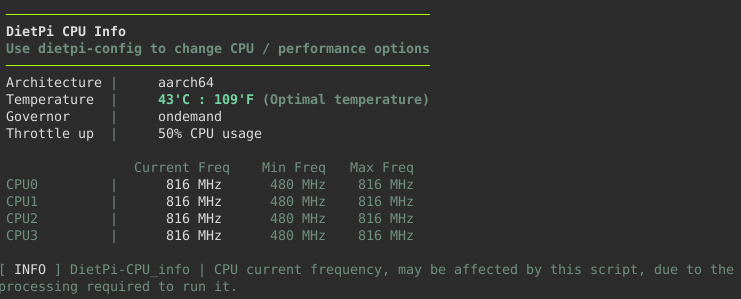
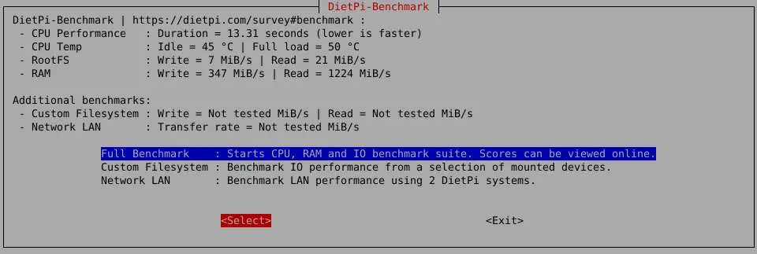
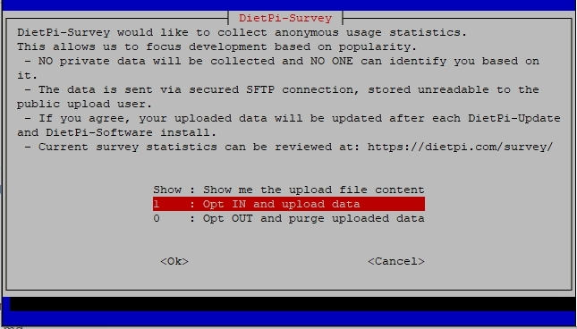
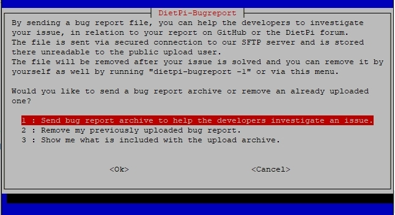

# Misc tools

## DietPi CPU info

Displays CPU temperature, processor frequency, throttle level etc. via the command line command

```sh
cpu
```

{: width="741" height="299" loading="lazy"}

---

## DietPi Benchmark

DietPi Benchmark executes benchmark and system load functions. Some of the evaluated data can be uploaded to our survey report (DietPi survey). To start DietPi-Survey, use the following command:

```sh
dietpi-benchmark
```

{: width="960" height="323" loading="lazy"}

### Software overview

The benchmark covers

- CPU performance, CPU temperature
- Root filesystem speed, RAM speed
- Custom filesystem speed
- LAN network speed

### DietPi benchmark - Command line usage

Beside the interactive setting via `dietpi-benchmark`, there is the option of the shell command line:

```console
Usage: dietpi-benchmark [<command>]
Available commands:

  <empty>  Interactive menu with all benchmark types
  1        Custom filesystem benchmark
           FP_BENCHFILE=<path> to set the filesystem path (else a menu is shown)
           BENCH_FILESIZE=<MiB> to set the file size (else a prompt is shown)
  2        Full benchmark suite: CPU, RAM and RootFS
  3        Network LAN benchmark server
  4        Network LAN benchmark client
```

---

## DietPi survey

DietPi Survey allows the DietPi project to obtain general information regarding your system and installed software. To start DietPi-Survey, use the following command:

```sh
dietpi-survey
```

???+ important "Privacy and goals"

    The following privacy rules and goals are considered:

    - No private data is sent. No one can identify you. No IP address is obtained.
    - DietPi Survey is an ***Opt-in*** system, which means that it won't send any data without your explicit interactive permission.
    - On your first interactive login on a fresh DietPi system, you will be asked once for the *Opt-in*/*Opt-out* mode.
    - The transmitted data allows the DietPi project team to achieve the best future possible experience for everyone to
        - focus and improve especially popular areas,
        - ensure the most common devices and software titles will receive support and improvements,
        - keep up support for software and hardware that you use.

    **In short words:** By selecting ***Opt IN***, you are supporting the DietPi project with no impact to your system or private data.

{: width="645" height="368" loading="lazy"}

### Software overview

=== "Data transmission events"

    The DietPi Survey data file is sent when you install software with `dietpi-software` and update DietPi with `dietpi-update`.

=== "Uploaded amount of data"

    The uploaded data is tiny (about 1 KB) and will not affect your internet bandwidth or system performance.

=== "Transmitted data contents"

    Within the command line program `dietpi-survey` the exact copy of the transmitted data can be viewed. The transmitted file is written in bash code to allow us faster report page creation (e.g. done for <https://dietpi.com/survey>).

    Following is an example how this file may look like:

    ```bash
    #!/bin/bash
    ((aDIETPI_VERSION[6.34]++))
    ((aGIT_BRANCH[MichaIng/master]++))
    ((aDEVICE_NAME[Virtual Machine (x86_64)]++))
    ((aCPU_ARCH[x86_64]++))
    ((aCPU_COUNT[2]++))
    ((aDISTRO_VERSION[buster]++))
    ((aAUTOSTART_OPTION[${aAUTOSTART_NAME[0]:=0}]++))
    ((aAUTO_SETUP_AUTOMATED[0]++))
    ((aNETWORK_INTERFACE[eth0]++))
    # -------------------------
    # DietPi-Software installs
    # -------------------------
    ((aSOFTWARE[${aSOFTWARE_NAME6_34[103]:=103}]++))
    ((aSOFTWARE[${aSOFTWARE_NAME6_34[104]:=104}]++))
    ```

    The tail of the file lists installed software packages by their IDs. The example above shows a very basic system, so only two software packages (`#103`: DietPi-RAMlog, `#104`: Dropbear) are installed.
    To find out the names of the installed software package IDs installed via `dietpi-software` you can execute

    ```sh
    dietpi-software list | grep ' =2'
    ```

    This gives the IDs, names and info of software. The above example would show

    ```text
    # dietpi-software list | grep ' =2'
    id 103 | =2 | dietpi-ramlog: minimal, optimised logging | | https://dietpi.com/docs/software/log_system/#dietpi-ramlog
    id 104 | =2 | dropbear: lightweight ssh server | | https://dietpi.com/docs/software/ssh/#dropbear
    ```

=== "Selecting Opt-in or Opt-out"

    You can select ***Opt-in*** or ***Opt-out*** of DietPi Survey by running the following command and follow the instructions:

    ```sh
    dietpi-survey
    ```

    This may also be achieved by setting `SURVEY_OPTED_IN=0` (*Opt-out*) or `SURVEY_OPTED_IN=1` (*Opt-in*) in `/boot/dietpi.txt` before the first system boot.

    To check the actual status, `dietpi-survey` may be called. The current mode will be pre-selected and highlighted.  
    Alternatively you can use

    ```sh
    grep 'SURVEY_OPTED_IN' /boot/dietpi.txt
    ```

    which displays the status like

    ```text
    # grep 'SURVEY_OPTED_IN' /boot/dietpi.txt
    SURVEY_OPTED_IN=1
    ```

### DietPi survey - Command line usage

Beside the interactive setting via `dietpi-survey`, there is the option of the shell command line:

```console
Usage: dietpi-survey [<command>]
Available commands:
    <empty>     Interactive menu to opt in or out
    1           Send survey data or empty file, based on previous user choice
```

---

## DietPi bug report

To start DietPi bug report, use the following command:

```sh
dietpi-bugreport
```

{: width="646" height="352" loading="lazy"}

### DietPi bug report - Command line usage

Beside the interactive managing via `dietpi-bugreport`, there is the option of the shell command line:

```console
Usage: dietpi-bugreport [<command>]
Available commands:
  <empty>     Interactive manage bug reporting
  1           Send a bug report noninteractively
  -1          Remove an already uploaded bug report noninteractively
```

---

## DietPi Servarr to RAM

It moves Sonarr, Radarr, Lidarr and Prowlarr database files to RAM, leaving symlinks on disk. This reduces disk I/O and enhances database I/O performance.  
The script first creates a backup and automatically restores from backup on next start in case of a system crash.

To start DietPi Servarr to RAM, use the following command:

```sh
dietpi-servarr_to_ram
```

### DietPi Servarr to RAM - Command line usage

Beside the interactive managing via `dietpi-servarr_to_ram`, there is the option of the shell command line:

```console
Usage: dietpi-servarr_to_ram <command> [<program>]
Available commands:
  1 [<program>]	    Link (program) database(s) to RAM
  2 [<program>]	    Update (program) database backup(s)
  0 [<program>]	    Store (program) database(s) back to disk
  enable            Enable Link to RAM on boot
  disable           Disable Link to RAM on boot
Supported programs:
  <empty>       Apply to all supported and installed programs
  sonarr        Apply to Sonarr database only
  radarr        Apply to Radarr database only
  lidarr        Apply to Lidarr database only
  prowlarr      Apply to Prowlarr database only
```

---

## DietPi morse code

It converts a text file into morse code. To start DietPi morse code, use the following command:

```sh
dietpi-morsecode
```

---

## Useful DietPi shell functions

There are a couple of general commands which have a shortcut in DietPi:

- `G_OBTAIN_CPU_TEMP` - Prints integer format CPU temp in degree Celsius, for monitoring probably better than full `cpu` output
- `G_OBTAIN_CPU_USAGE` - Prints CPU usage in percent in [x]x.x format
- `G_TREESIZE` - Shows current directory/file sizes, recursively

The following commands are non-interactive, but error-handled wrappers for `apt-get` commands, useful for scripts which shall run non-interactive but allow interactive repeat and solution attempts:

- `G_AGI` - `apt-get install`
- `G_AGP` - `apt-get purge`
- `G_AGA` - `apt-get autoremove --purge`
- `G_AGUP` - `apt-get update`
- `G_AGUG` - `apt-get upgrade`
- `G_AGDUG` - `apt-get dist-upgrade`

---
