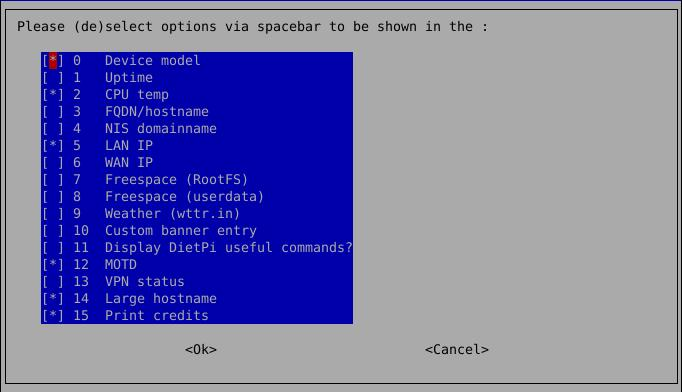

# Misc tools

## Useful DietPi shell functions

There are a couple of general commands which have a shortcut in DietPi:

- `G_OBTAIN_CPU_TEMP` - Prints integer format CPU temp in degree Celsius, for monitoring probably better than full `cpu` output
- `G_OBTAIN_CPU_USAGE` - Prints CPU usage in percent in [x]x.x format
- `G_TREESIZE` - Shows current directory/file sizes, recursively

The following commands are non-interactive, but error-handled wrappers for `apt-get` commands, useful for scripts which shall run non-interactive but allow interactive repeat and solution attempts:

- `G_AGI` - `apt-get install`
- `G_AGP` - `apt-get purge`
- `G_AGA` - `apt-get autoremove --purge`
- `G_AGUP` - `apt-get update`
- `G_AGUG` - `apt-get upgrade`
- `G_AGDUG` - `apt-get dist-upgrade`

---

## DietPi Banner

Enables the configuration of the initial banner, displayed on logon. To start DietPi-Banner, use the following command:

```sh
dietpi-banner
```

{: width="640" height="368" loading="lazy"}

Using these settings you can configure the information displayed initially, choosing the details displayed initially. See below an example where 4 options are selected:

{: width="636" height="359" loading="lazy"}

---

## DietPi CPU info

Displays CPU temperature, processor frequency, throttle level etc. via the command line command

```sh
cpu
```

{: width="741" height="299" loading="lazy"}

---

## DietPi morse code

It converts a text file into morse code. To start DietPi morse code, use the following command:

```sh
dietpi-morsecode
```

---

## DietPi bug report

To start DietPi bug report, use the following command:

```sh
dietpi-bugreport
```

{: width="646" height="352" loading="lazy"}

---
