# Software installation

## DietPi software

`dietpi-software` will be automatically displayed on the first login after the installation. It can be accessed at any time running next command:

```sh
dietpi-software
```

It is one of the core tools, enabling you to install or uninstall one or more [**DietPi optimised software**](../software.md) titles.

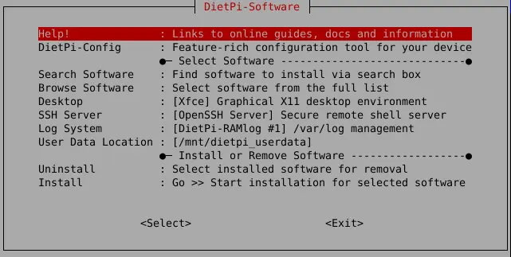{: width="641" height="323" loading="lazy"}

### Software package selection

Software packages which shall be installed have to be selected prior to the installation via "Install" at the bottom of the dialog.

=== "Display Options"

    - Begin by selecting **Browse Software** in the main menu list and hit ++enter++.

    - Scroll through the list of available software - for more details check the [DietPi software list](../software.md).

    The list of optimised software is long. You either browse the list or use the option **Search Software**.

    - To install software on your DietPi, select it in the list and press ++space++ to add it to the installation list. If you change your mind, hit ++space++ again to remove it.

    - Once you’ve selected the software you wish to install, press ++tab++ to switch to the confirmation options at the bottom. Select **OK**, then hit ++enter++ to confirm.

    - To begin installing your software, select **Install** from the main menu list, then hit ++enter++. DietPi will ask you to confirm your choice(s). Select **OK**, then hit ++enter++ to begin the installation.

    The software you selected will begin to install at this point. Once the process is completed, you may be asked to restart your device. Press **OK** to confirm.

    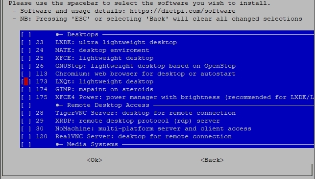{: width="643" height="365" loading="lazy"}

=== "Search Software"

    DietPi supports a large number of software titles. Instead of scrolling through the **Browse Software** list to find a specific software title, you may use the **Search Software** option. Type in the software ID or any keyword from its title or description and you'll get a list filtered by matching results.

    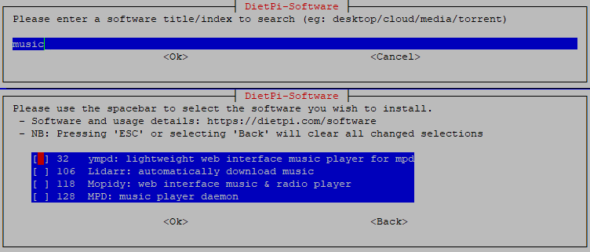{: with="752" height="321" loading="lazy"}

### Desktop selection

This lets you enable a graphical desktop installation and to select the desktop (e.g. LXQt, MATE, XFCE). Choosing `None` initiates the removal of an installed desktop.

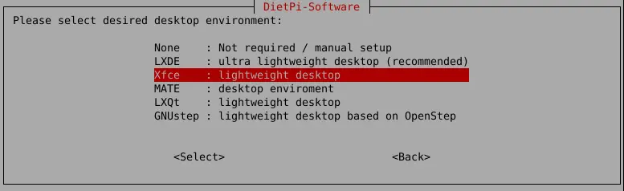{: width="550" height="168" loading="lazy"}

!!! tip "Uninstall desktop via console (and not within a running graphical desktop)"
    When uninstalling a graphical desktop (option `None`), it is good practice to do so via console or SSH login, and not with a terminal emulator (e.g. `xterm`) within its running X11 session. In the latter case, it's like the running desktop pulls the rug out from under its own feet, which might lead to a dead black screen.

### SSH server selection

This lets you select your preferred SSH server. Also you can uninstall any SSH server to save memory and to exclude any external ssh based access.

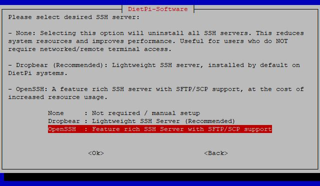{: width="550" height="320" loading="lazy"}

### Log system selection

Various logging methods can be selected from lightweight to full.
If you don’t require log files, get a performance boost. If you need full system logging features, DietPi can do that too.

The Log System can be changed at any time by selecting a different “Log System” from the menu.

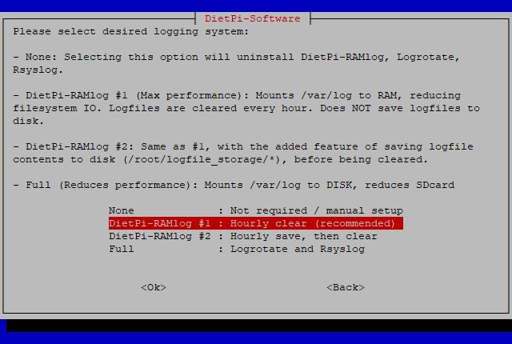{: width="550" height="370" loading="lazy"}

DietPi uses systemd as system and service manager, which includes the `systemd-journald` logging daemon.
An additional syslog daemon, like `rsyslog`, is not required and hence not pre-installed on DietPi. The basic command to access `systemd-journald` logs is

```sh
journalctl [options]
```

=== "Logging basic output"

    Using simply `journalctl` prints out all logging messages stored in the system.  
    Each line shows:  
    `<timestamp\> <hostname\> <process name\>[PID]: <log message\>`

    The following screenshot shows the logging of the boot process (of a DietPi virtual machine). You can see the various fields (timestamp, hostname, etc.) in the log entries:

    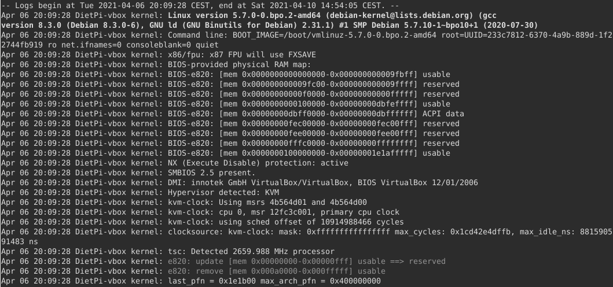{: width="640" height="300" loading="lazy"}

=== "Logging output filtering options"

    Some of the options are described in the following table.  
    More detailed options may be studied in the [man pages of `journalctl`](https://man7.org/linux/man-pages/man1/journalctl.1.html).

    | Command | Remark |
    | - | - |
    | `journalctl -u UNITNAME` <br>(`--unit UNITNAME`) | Displays messages of the given unit |
    | `journalctl -PID=<process_id>` | Displays messages of process with PID equals to <process_id\> |
    | `journalctl -r` (`--reverse`) | Displays list in reverse order, i.e. newest messages first |
    | `journalctl -f` (`--follow`) | Displays the tail of the log message list and shows new entries *live* |
    | `journalctl -b` (`--boot`) | Displays messages since the last boot (i.e. no older messages). See also option `--list-boots` |
    | `journalctl -k` (`--dmesg`) | Displays kernel messages |
    | `journalctl -p PRIORITY` (`--priority PRIORITY`) | Displays messages with the given priority. PRIORITY may be `merg`, `alert`, `crit`, `err`, `warning`, `notice`, `info` and `debug`. Also numbers as PRIORITY are possible |
    | `journalctl -o verbose` | Displays additional meta data |
    | `journalctl --disk-usage` | Displays the amount of disk space used by the logging messages |
    | `journalctl --no-pager  |  grep <filter>` | Filters log messages (filtering with `grep`) |

    In the software package descriptions, sometimes there is a tab called "View Logs". This gives a `jounalctl -u UNITNAME` command example how to filter the logging messages of a given software package.  
    Example: See [tab "View logs"](../software/dns_servers.md#unbound) of *Unbound*. It gives: `journalctl -u unbound`.

=== "Logging options"

    As described in the chapter [Log system choices](../software/log_system.md), DietPi has several options how the logging system operates. Especially the log history, the memory consumption and the frequency of SD card write accesses varies.  
    Find and set the options which fit to your demands, it is also an option to change the logging to examine some problems.

    | Log option | location | log depth | log persistence |
    | - | - | - | - |
    | DietPi-RAMlog #1 | RAM | last hour | volatile, i.e. not saved to disk |
    | DietPi-RAMlog #2 | RAM | long term | stored, i.e. hourly saved to disk |
    | Full logging | disk | long term | stored, i.e. immediately saved to disk <br>(with Rsyslog and Logrotate) |

    See [log system choices](../software/log_system.md) for further details.

### User data location selection

In DietPi, we class user data as:

- **Data storage for applications**. Some examples are ownCloud/Nextcloud data store, BitTorrent downloads and SQL data store.
- The location where your **File Server** choice will point to, if you install one, like Samba Server or ProFTPD.
- The location where you can upload and store your **media content**, for other applications to use, like Kodi, Emby or Plex.

For all software you install in dietpi-software, you can access your user data with `/mnt/dietpi_userdata`. Regardless of where the data is physically stored, a symlink will automatically be created for you if needed.  
To check where the physical location is, you can run the following command:  

```sh
readlink -f /mnt/dietpi_userdata
```

You can **move your user data** to another location (e.g. USB drive). Simply run `dietpi-software` and enter the *User data location* menu option:

- If you need to setup a new external drive, select *Drive Manager* to launch *DietPi-Drive Manager*.
- Use the *List* option to select from a list of mounted drives, or, select *Manual* for a custom location.

DietPi will automatically move your existing user data to your new location.

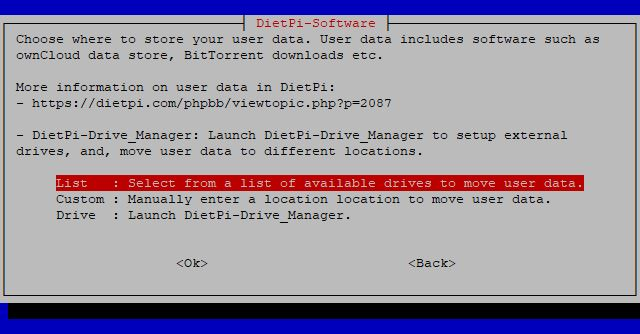{: width="550" height="287" loading="lazy"}

### Install or remove software

=== "Install"

    Install software item(s) which have been selected via **Browse Software** list, via **Search Software**, or via the **SSH Server**, **File Server** or **Log System** choices.

=== "Uninstall"

    Select one or more software items which you would like to be removed from your DietPi system.

### DietPi Software - Command line usage

Beside the interactive software installation via `dietpi-software` with checking wanted software packages and installing them, there is the option of installing the software packages via the shell command line:

```console
Usage: dietpi-software [<command> [<software_id>...]]
Available commands:
    <empty>     Interactive menu
    install     <software_id>...  Install each software given by space-separated list of IDs
    reinstall   <software_id>...  Reinstall each software given by space-separated list of IDs
    uninstall   <software_id>...  Uninstall each software given by space-separated list of IDs
    list[--machine-readable]      Print a list with IDs and info for all available software titles
    free                          Print an unused software ID, free for a new software implementation
```

The `<software_id>` which has to be given is the one which is present in the software list within the `dietpi-software` dialogues:

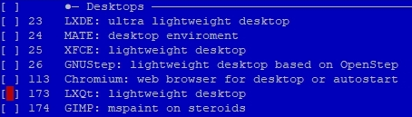{: width="454" height="129" loading="lazy"}

E.g. to install Chromium, LXQt and GIMP you have to run next command in the terminal:

```sh
dietpi-software install 113 173 174
```

---

## DietPi LetsEncrypt

Access the frontend for the `Let's Encrypt` integration by running

```sh
dietpi-letsencrypt
```

### Feature overview

In case of a non installed Certbot package it is installed at first:

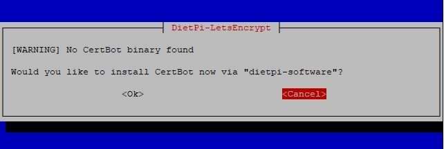{: width="642" height="216" loading="lazy"}

In the installation dialog some entries have to be made which are needed for the certificate (domain, Email), the other entries are configuration options. It is recommended to leave the key size at 4096 bits.

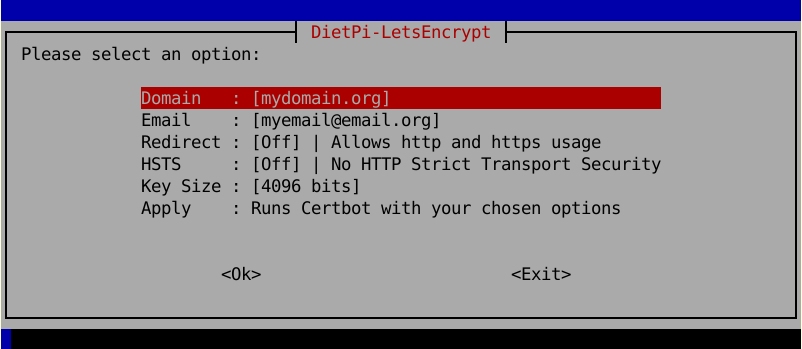{: width="642" height="279" loading="lazy"}

When you execute the certificate installation it also installs it for your selected web server, i.e. you do not have to edit your web server configuration files, the installation routine does all for you.

### DietPi LetsEncrypt - Command line usage

Beside the interactive LetsEncrypt installation via `dietpi-letsencrypt`, there is the option of the shell command line:

```console
Usage: dietpi-letsencrypt [<command>]
Available commands:
    <empty>     Interactive menu
    1           Create/Renew/Apply certificates non-interactively
```

!!! info "Port forwarding on your router"
    To be accessible from the Internet, typically your router needs a port forwarding configuration to route incoming HTTP and HTTPS accesses to your DietPi system.  
    Although you only need a HTTPS protocol forwarding (typically port 443), you also need to forward the HTTP protocol (typically port 80) to your DietPi system, otherwise the certification renewal procedure will fail (due to the fact that the certification renewal procedure takes place several months later you may have forgotten this issue).

---

## DietPi VPN

DietPi-VPN is a combination of OpenVPN installation and DietPi front end GUI. Allowing all VPN users to quickly and easily connect to any NordVPN, ProtonVPN, or any other server that uses OpenVPN in TCP or UDP, using only open source software. To start DietPi-VPN, use the following command:

```sh
dietpi-vpn
```

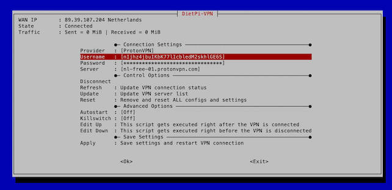{: width="642" height="300" loading="lazy"}

{: width="200" height="58" loading="lazy"}

### Feature overview

=== "Requires VPN Subscription"

    Although we enable forced encryption on all our BitTorrent clients, if you wish to ensure complete privacy and piece of mind for all your downloaded content, using a VPN is critical.  
    You can use any VPN provider you want, but DietPi-VPN specifically supports ProtonVPN and NordVPN.

=== "Usage"

    Simply run `dietpi-vpn` to use the GUI, allowing you to setup your connection and provider.  
    DietPi will also automatically start and connect the VPN during system boot if you select autostart.

=== "Killswitch"

    DietPi-VPN comes with an optional killswitch that will shut off your Internet in the case of you losing your connection to the VPN sever.
    This will still allow access from your LAN and allow you to fix any problems using SSH, if needed.

### DietPi VPN - Command line usage

Beside the interactive VPN installation via `dietpi-vpn`, there is the option of the shell command line:

```console
Usage: dietpi-vpn [<command>]
Available commands:
    <empty>     Interactive menu to control VPN settings and connection
    status      Print VPN connection status

```

---

## DietPi WireGuard

DietPi-WireGuard helps you to run your own WireGuard VPN server. You can create the server and add your devices as clients. A QR code lets you set up a phone within seconds. To start DietPi-WireGuard, use the following command:

```sh
dietpi-wireguard
```

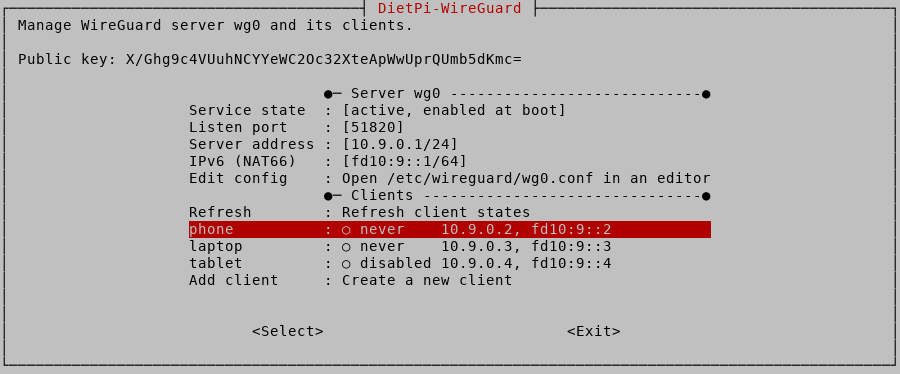{: width="900" height="374" loading="lazy"}

Missing packages are installed on first start. A WireGuard server which already exists is found automatically, also if you did not create it with DietPi. The [WireGuard](../software/vpn.md#wireguard) software option of DietPi-Software uses this tool to create its server.

### Feature overview {: id="dietpi-wireguard-features" }

=== "Server"

    If no server exists yet, select **Create server**.

    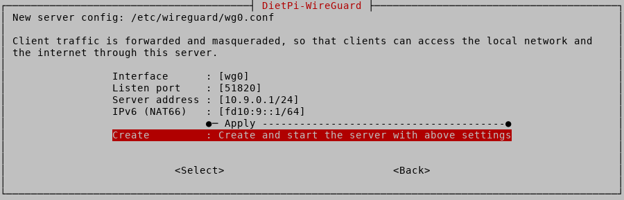{: width="900" height="289" loading="lazy"}

    The defaults are fine for most users. The server gets the name `wg0` and uses the UDP port `51820`. Its VPN IPv4 address is `10.9.0.1`, and it gets a local IPv6 address `fd10:9::1`, if IPv6 is enabled on the host. When you select **Create**, the server starts. It also starts automatically after a reboot.

    If your DietPi system is behind a router, forward the UDP port to it.

    The main menu shows the server settings. You can change them directly:

    - **Service state**: Start, stop or restart the server. You can also turn the start at boot on or off.
    - **Listen port**: Change the UDP port.
    - **Server address**: Change the VPN address of the server. The clients are updated automatically.
    - **IPv6 (NAT66)**: Turn IPv6 for the VPN on or off, see the "IPv6" tab for details.
    - **Edit config**: Edit the config file by hand. Wrong settings are detected and not applied.

    You can run more than one server. The menu then shows a **Server interface** entry to switch between them. Further servers are created with the command line, see the "CLI" tab.

=== "Clients"

    Each device which connects to your server is a client. The clients are listed below the server settings with their state:

    - **active**: The client can connect.
    - **disabled**: The client is blocked for now. Its config is kept, so that you can enable it again.
    - **unused**: A config file exists, but the server does not know it. You can add it again or delete it.

    Select **Add client** and enter a name, e.g. the name of the device.

    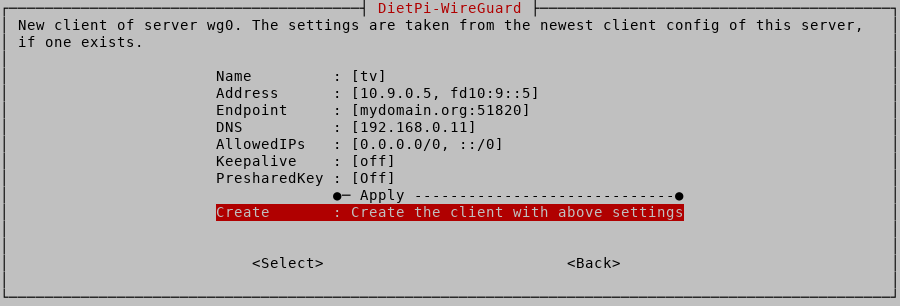{: width="900" height="306" loading="lazy"}

    The settings are fine for most users. You can change them if needed:

    - **Address**: The VPN address of the client. The next free address is used.
    - **Endpoint**: The address of your server on the Internet, followed by the port. Enter your domain name or public IP address here. For the first client, the public domain name from `SOFTWARE_PUBLIC_DOMAIN_NAME` in `/boot/dietpi.txt` is used by default, otherwise the hostname of your system.
    - **DNS**: The DNS server which the client uses while connected.
    - **AllowedIPs**: The traffic which goes through the VPN. **Full tunnel** sends everything through it. **Server LAN** only sends the traffic to your home network.
    - **Keepalive**: Keeps the connection open, e.g. when the client is behind a router. A common value is 25 seconds.
    - **PresharedKey**: An optional extra key for more security.

    New clients use the settings of the newest client by default. This saves you time when you add several devices.

    When the client is created, you can show its QR code. Open the WireGuard app on your phone, add a new tunnel and scan the code.

    To manage a client, select it in the main menu. You can show its QR code and config, rename it, change its settings, disable, enable or remove it.

    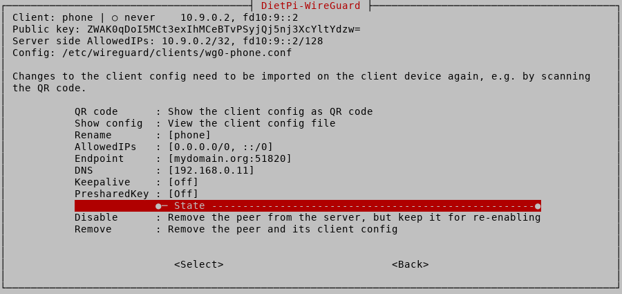{: width="900" height="425" loading="lazy"}

    After you change a client, the device needs its new config. Scan the QR code again or copy the config file. The config files are stored in `/etc/wireguard/clients/`.

    Clients which were created by older DietPi versions or by hand are found automatically. Their old key files (`server_*.key` and `client_*.key`) are not needed anymore. Remove them with the **Old key files** entry in the menu.

=== "IPv6"

    New servers also get an IPv6 address range, e.g. `fd10:9::/64`. Every client gets an address from it, which ends like its IPv4 address. For example, `10.9.0.2` gets `fd10:9::2`. The menu calls this **IPv6 (NAT66)**.

    This lets your clients use IPv6 websites and services through the VPN. Without it, connections to IPv6 services can hang or fail.

    Use the **IPv6 (NAT66)** entry in the menu to turn IPv6 on or off. Your clients then need their new config.

    A WireGuard server with IPv6 cannot start if IPv6 is disabled on your system. If you disable IPv6 with `dietpi-network`, DietPi therefore offers to turn it off for your VPN first. Without questions, e.g. in scripts, this happens automatically.

    If you enable IPv6 again later, DietPi-WireGuard reminds you to turn it on for your VPN.

    !!! info "IPv6 leaks are prevented in any case"
        Even without IPv6 enabled for the VPN or on its host system, clients with "Full tunnel" are configured to send all IPv6 requests through the VPN. Most typical client software falls back to IPv4 quickly, if an IPv6 request does not get an answer. So usually, users won't recognize whether IPv6 is supported by the VPN or not, and their privacy is assured in any case.

=== "CLI"

    Everything in the menu is also available via command-line interface, e.g. for scripts. The commands only manage the config files. To see which clients are connected right now, use `wg`.

    Create a client and show its QR code:

    ```sh
    dietpi-wireguard add phone
    dietpi-wireguard qr phone
    ```

    Show all clients, and disable, enable or remove one:

    ```sh
    dietpi-wireguard list
    dietpi-wireguard disable phone
    dietpi-wireguard enable phone
    dietpi-wireguard remove phone
    ```

    Change settings of a client or of the server:

    ```sh
    dietpi-wireguard set phone dns=192.168.0.100
    dietpi-wireguard server port=51821
    ```

    Turn IPv6 for the VPN on or off:

    ```sh
    dietpi-wireguard server ipv6=on
    dietpi-wireguard server ipv6=off
    ```

    Create a further server, and remove old key files:

    ```sh
    dietpi-wireguard init wg1 port=51821 address=10.10.0.1/24
    dietpi-wireguard cleanup
    ```

    Here is an overview of all available commands:

    ```console
    Usage: dietpi-wireguard [<command>] [<options>]
    Available commands:
        <empty>                         Open the interactive menu
        init [<interface>] [<key>=<value>...]
                                        Create a server config with defaults and start it, if no server config exists yet: port, address, ipv6
                                        The interface defaults to the first free wg0, wg1, ...
        list [<interface>]              List clients with address, state and config file
        add <name> [<options>]          Create a new client and add it as peer to the server
        remove <name>                   Remove a client: its server peer and its client config, after confirmation
        disable <name>                  Disable a client: remove its server peer, but keep it for re-enabling
        enable <name>                   Enable a disabled client again
        qr <name>                       Print the client config as QR code, without comments
        rename <name> <new name>        Rename a client config
        set <name> <key>=<value>...     Change client settings: dns, allowedips, endpoint, keepalive, psk=on|off
                                        An empty dns or keepalive value removes the setting.
        server [<interface>] <key>=<value>...
                                        Change server settings: port, address, ipv6
        cleanup                         Remove unused client configs and key files which are not needed anymore, after confirmation
    Server address:
        address=<IPv4 address>/<prefix> The IPv4 address of the server, e.g. "10.9.0.1/24", whose subnet is used for the clients
        ipv6=on|off|<address>/<prefix>  The IPv6 (NAT66) address of this server, e.g. "fd10:9::1/64", "on" for the default fd10:<n>::1/64,
                                        whose subnet is used for the clients, with the same host part as their IPv4 address.
                                        Without it, clients cannot use IPv6 through the VPN, so that connections to IPv6 hosts hang until
                                        they fall back to IPv4, or fail. Defaults to "on" for new servers.
                                        Changing the subnet and toggling IPv6 requires clients to import their config again.
    Available options:
        -i <interface>                  Server interface, required only if more than one server config exists
        -y                              Do not ask for confirmation
        --ip <address>                  Client VPN IPv4 address, defaults to the next free one
        --dns <servers>                 Client DNS servers, comma-separated, empty for none
        --allowed-ips <networks>        Client AllowedIPs, comma-separated
        --endpoint <host>[:<port>]      Server endpoint for the client, port defaults to the server ListenPort
        --keepalive <seconds>           Client PersistentKeepalive, 0 for none
        --psk                           Add a PresharedKey
    Defaults for "add" are taken from the newest client config of the same server.
    <name> can also be the public key of a peer without local client config.
    ```

---

## DietPi DDNS

DietPi-DDNS is a generic Dynamic DNS (DDNS) client. It can be used to setup a cron job which updates your dynamically changing public IP address every defined amount of minutes against a DDNS provider, so that your public domain stays valid. It supports No-IP and replaces the No-IP client, which was available as install option on previous DietPi versions. To start DietPi-DDNS, use the following command:

```sh
dietpi-ddns
```

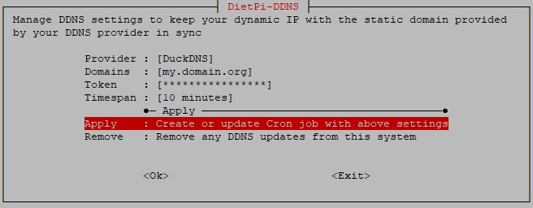{: width="656" height="256" loading="lazy"}

### Supported providers

- DuckDNS: <https://www.duckdns.org/>
- No-IP: <https://www.noip.com/>
- Dynu: <https://www.dynu.com/>
- FreeDNS: <https://freedns.afraid.org/>
- OVH: <https://docs.ovh.com/gb/en/domains/hosting_dynhost/>
- YDNS: <https://ydns.io/>
- Alternatively you may use any other provider which has an API URL for updating your dynamic IP address.

### DietPi DDNS - Command line usage

Beside the interactive DDNS installation via `dietpi-ddns`, there is the option of the shell command line:

```console
Usage: dietpi-ddns [[<options>...] <command> [<provider>]]
Available commands:
    <empty>             Interactive menu to setup dynamic DNS updates
    apply <provider>    Apply or update DDNS updates for <provider>, using
                        <options> for setup details
    remove              Remove any DDNS updates from this system

Available options:
    -d <domains>        Comma-separated list of domains that shall point 
                        to this system
    -u <username>       Username or identifier, depending on provider
                        In combination with a custom provider, this is used 
                        for HTTP authentication.
    -p <password>       Password or token, depending on provider
                        In combination with a custom provider, this is used 
                        for HTTP authentication.
    -t <timespan>       Duration between DDNS updates in minutes 
                        (optional, defaults to 10 minutes)
    -4and6              Update IPv4 and IPv6 addresses for your DDNS 
                        (optional, the default)
    -4                  Update only the IPv4 address for your DDNS (optional)
    -6                  Update only the IPv6 address for your DDNS (optional)
    -h                  Get an overview of supported CLI commands and options

Available providers:
    <custom>            Full URL to update against a custom DDNS provider
                        Use the "-u" and "-p" options if HTTP authentication 
                        is required.
    DuckDNS             Read more: https://www.duckdns.org/about.jsp
                        Use the "-d" and "-p" options to set domains and 
                        account token.
    No-IP               Read more: https://www.noip.com/about
                        Use the "-d", "-u" and "-p" options to set domains, 
                        username and password.
    Dynu                Read more: https://www.dynu.com/DynamicDNS
                        Use the "-d" and "-p" options to set domains and 
                        account password.
    FreeDNS             Read more: https://freedns.afraid.org/
                        Use the "-p" option to set the account token.
    OVH                 Read more: https://docs.ovh.com/gb/en/domains/hosting_dynhost/
                        Use the "-d", "-u" and "-p" options to set domains, 
                        username and password.
    YDNS                Read More https://ydns.io
                        Use the "-d", "-u" and "-p" options to set the domain, 
                        username and password.
```

Explanation:

- Use `dietpi-ddns <options> apply <provider>` to apply a cron job for the given provider and given options
    - `<provider>` is either the name of a supported provider, or any custom update URL.
    - If you did already setup DietPi-DDNS before, the `apply` command can also be used to change one of the above settings. All other options are optional then.
- Use `dietpi-ddns remove` to remove any cron job that was setup before.

---
