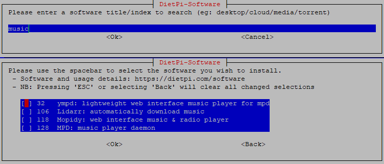
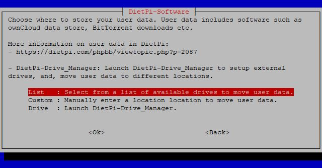
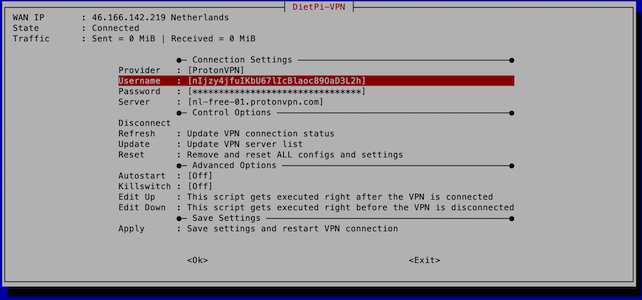

# Software installation

## DietPi software

`dietpi-software` will be automatically displayed on the first login after the installation. It can be accessed at any time running next command:

```sh
dietpi-software
```

It is one of the core tools, enabling you to install or uninstall one or more [**DietPi optimised software**](../software.md) titles.

{: width="640" height="306" loading="lazy"}

### Software overview

#### Browse Software

- Begin by selecting **Browse Software** in the main menu list and hit ++enter++.

- Scroll through the list of available software - for more details check the [DietPi software list](../software.md).

The list of optimised software is long. You either browse the list or use the option **Search Software**.

- To install software on your DietPi, select it in the list and press ++space++ to add it to the installation list. If you change your mind, hit ++space++ again to remove it.

- Once you’ve selected the software you wish to install, press ++tab++ to switch to the confirmation options at the bottom. Select **OK**, then hit ++enter++ to confirm.

- To begin installing your software, select **Install** from the main menu list, then hit ++enter++. DietPi will ask you to confirm your choice(s). Select **OK**, then hit ++enter++ to begin the installation.

The software you selected will begin to install at this point. Once the process is completed, you may be asked to restart your device. Press **OK** to confirm.

{: width="643" height="365" loading="lazy"}

#### Search Software

DietPi supports a large number of software titles. Instead of scrolling through the **Browse Software** list to find a specific software title, you may use the **Search Software** option. Type in the software ID or any keyword from its title or description and you'll get a list filtered by matching results.

{: with="752" height="321" loading="lazy"}

---

### Quick selections

#### SSH Server

This lets you select your preferred SSH server. Also you can uninstall any SSH server to save memory and to exclude any external ssh based access.

{: width="550" height="320" loading="lazy"}

#### Log System

Various logging methods can be selected from lightweight to full.
If you don’t require log files, get a performance boost. If you need full system logging features, DietPi can do that too.

The Log System can be changed at any time by selecting a different “Log System” from the menu.

{: width="550" height="370" loading="lazy"}

See [log system choices](../software/log_system.md) for further details.

#### User Data Location

In DietPi, we class user data as:

- **Data storage for applications**. Some examples are ownCloud/Nextcloud data store, BitTorrent downloads and SQL data store.
- The location where your **File Server** choice will point to, if you install one, like Samba Server or ProFTPD.
- The location where you can upload and store your **media content**, for other applications to use, like Kodi, Emby or Plex.

For all software you install in dietpi-software, you can access your user data with `/mnt/dietpi_userdata`. Regardless of where the data is physically stored, a symlink will automatically be created for you if needed.  
To check where the physical location is, you can run the following command:  

```sh
readlink -f /mnt/dietpi_userdata
```

You can **move your user data** to another location (e.g. USB drive). Simply run `dietpi-software` and enter the *User data location* menu option:

- If you need to setup a new external drive, select *Drive Manager* to launch *DietPi-Drive Manager*.
- Use the *List* option to select from a list of mounted drives, or, select *Manual* for a custom location.

DietPi will automatically move your existing user data to your new location.

{: width="550" height="287" loading="lazy"}

---

### Install or remove software

#### Install

Install software item(s) which have been selected via **Browse Software** list, via **Search Software**, or via the **SSH Server**, **File Server** or **Log System** choices.

#### Uninstall

Select one or more software items which you would like to be removed from your DietPi system.

#### Command line based installation

Beside the interactive software installation via `dietpi-software` with checking wanted software packages and installing them, there is the option of installing the software packages via the shell command line.  
The usage of `dietpi-software` is:

```bash
Usage: dietpi-software [<command> [<software_id>...]]
Available commands:
    <empty>     Interactive menu to install or uninstall software
    install     <software_id>...  Install each software given by space-separated list of IDs
    reinstall   <software_id>...  Reinstall each software given by space-separated list of IDs
    uninstall   <software_id>...  Uninstall each software given by space-separated list of IDs
    list        Print a list with IDs and info for all available software titles
    free        Print an unused software ID, free for a new software implementation
```

The `<software_id>` which has to be given is the one which is present in the software list within the `dietpi-software` dialogues:

{: width="454" height="129" loading="lazy"}

E.g. to install Chromium, LXQt and GIMP you have to run next command in the terminal:

```sh
dietpi-software install 113 173 174
```

---

## DietPi LetsEncrypt

Access the frontend for the `Let's Encrypt` integration by running

```sh
dietpi-letsencrypt
```

In case of a non installed Certbot package it is installed at first:

{: width="642" height="216" loading="lazy"}

In the installation dialog some entries have to be made which are needed for the certificate (domain, Email), the other entries are configuration options. It is recommended to leave the key size at 4096 bits.

{: width="642" height="279" loading="lazy"}

When you execute the certificate installation it also installs it for your selected web server, i.e. you do not have to edit your web server configuration files, the installation routine does all for you.

!!! info "Port forwarding on your router"
    To be accessible from the internet, typically your router needs a port forwarding configuration to route incoming HTTP and HTTPS accesses to your DietPi system.  
    Although you only need a HTTPS protocol forwarding (typically port 443), you also need to forward the HTTP protocol (typically port 80) to your DietPi system, otherwise the certification renewal procedure will fail (due to the fact that the certification renewal procedure takes place several months later you may have forgotten this issue).

---

## DietPi VPN

DietPi-VPN is a combination of OpenVPN installation and DietPi front end GUI. Allowing all VPN users to quickly and easily connect to any NordVPN, ProtonVPN, or any other server that uses OpenVPN in TCP or UDP, using only open source software. To start DietPi-VPN, use the following command:

```sh
dietpi-vpn
```

{: width="642" height="300" loading="lazy"}

### Requires VPN Subscription

Although we enable forced encryption on all our BitTorrent clients, if you wish to ensure complete privacy and piece of mind for all your downloaded content, using a VPN is critical.  
You can use any VPN provider you want, but DietPi-VPN specifically supports ProtonVPN and NordVPN.

### Usage

Simply run `dietpi-vpn` to use the GUI, allowing you to setup your connection and provider.  
DietPi will also automatically start and connect the VPN during system boot if you select autostart.

### Killswitch

DietPi-VPN comes with an optional killswitch that will shut off your internet in the case of you losing your connection to the VPN sever.
This will still allow access from your LAN and allow you to fix any problems using SSH, if needed.

{: width="200" height="58" loading="lazy"}

---

## DietPi DDNS

DietPi-DDNS is a generic Dynamic DNS (DDNS) client. It can be used to setup a cron job which updates your dynamically changing public IP address every defined amount of minutes against a DDNS provider, so that your public domain stays valid. It supports No-IP and replaces the No-IP client, which was available as install option on previous DietPi versions. To start DietPi-DDNS, use the following command:

```sh
dietpi-ddns
```

{: width="656" height="256" loading="lazy"}

### Supported providers

- DuckDNS: <https://www.duckdns.org/>
- No-IP: <https://www.noip.com/>
- Dynu: <https://www.dynu.com/>
- FreeDNS: <https://freedns.afraid.org/>
- OVH: <https://docs.ovh.com/gb/en/domains/hosting_dynhost/>
- YDNS: <https://ydns.io/>
- Alternatively you may use any other provider which has an API URL for updating your dynamic IP address.

### CLI

Type `dietpi-ddns -h` to get an overview of supported CLI commands and options:

- If no argument is given, the interactive menu is started.
- Use `dietpi-ddns <options> apply <provider>` to apply a cron job for the given provider and use the following options set details:
    - `<provider>` is either the name of a supported provider, or any custom update URL.
    - Use `-d <domains>` to add one or a comma-separated list of multiple domains, which should point to the public IP address of this system.
    - Use `-u <username>` to set a username or identifier. This is not required for all providers, in case of a custom provider, it is used as username for HTTP authentication.
    - Use `-p <password>` to set a password or token. This is not required for all providers, in case of a custom provider, it is used as username for HTTP authentication.
    - Use `-t <timespan>` to set an update interval in minutes, which is purely optional and defaults to 10 minutes.
    - If you did already setup DietPi-DDNS before, the `apply` command can also be used to change one of the above settings. All other options are optional then.
- Use `dietpi-ddns remove` to remove any cron job that was setup before.

---
