# System configuration

## DietPi-Config

Configure various system settings, from display / audio / network to *auto start* options. To start the system configuration, use the following command:

```sh
dietpi-config
```

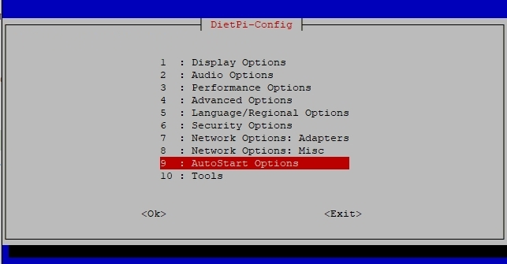{: width="643" height="335" loading="lazy"}

### Feature overview

=== "Display Options"

    The display options are used to

    - Set the screen resolution, or go headless to save additional resources.  
    - Control the GPU memory splits.  
    - Enable/disable the RPi camera.

=== "Audio Options"

    The audio options are used to

    - Change sound cards with ease (e.g.: HiFiBerry / Odroid HiFi shield).

=== "Performance Options"

    The performance options are used to

    - Overclock the system with a vast selection of overclocking profiles for the device.
    - Change the CPU governor and tweak the ARM temperature limits.
    - Change the source for the CPU temperature value.

=== "Advanced Options"

    The advanced options are used to

    - Configure swap file size
    - Set APT cache handling
    - Configure time synchronization and real time clock source
    - Toggle serial console
    - Toggle Bluetooth

=== "Security Options"

    The security options are used to

    - Change password and hostname

=== "Language/Regional Options"

    The language/regional options are used to

    - Set timezone, locale and keyboard options. Everything which will be needed to make it feel like home

=== "Network Options: Adapters"

    The network adapter options open [DietPi-Network](#dietpi-network). They are used to

    - Scan and connect to a WiFi router with ease
    - Change to a static IP address on the network
    - Configure proxy settings
    - Test Internet connection
    - Toggle IPv6 support

=== "Network Options: Misc"

    The miscellaneous network options options are used to

    - Select an **APT mirror** to connect to the Debian (or Raspbian) APT repository.
    - Select an **NTP mirror** to synchronise the system time.
    - Choose these options for the **network and URL connection tests**:
        - Set Network test connection timeout and number of connection test tries.
        - Set IPv4 and IPv6 addresses used for the connection test.
        - Set the domain used for the domain name resolution test.
    - **Network Drives** redirects to the **DietPi-Drive_Manager** which allows to mount Samba and NFS shares on the DietPi system.
    - Select one of several **Dynamic DNS** ([**DDNS**](https://wikipedia.org/wiki/Dynamic_DNS)) providers which allows to access a home network/server with a static domain name. The client is required to inform the DDNS of a current dynamic external IP on a regular basis.

=== "AutoStart Options"

    The autostart options are used to

    - Quickly and easily change what software runs after boot. Kodi, Desktop, console and many more

=== "Tools"

    The tools options are used to

    - Perform CPU, RAM, filesystem and network **benchmarks**, optionally upload the results and review statistics at: <https://dietpi.com/survey/#benchmark>
    - Perform CPU/IO/RAM/DISK **stress tests** to test the stability of the system, e.g. after applying some overclocking.

### DietPi-Config - Command line usage

Beside the interactive configuration via `dietpi-config`, there is the option of the shell command line:

```console
Usage: dietpi-config [<targetmenu_id>]
Available values for <targetmenu_id>:
    1           Open menu "Display Options"
    2           Open menu "Display Options" -> "Display Resolution"
    3           Open menu "Advanced Options"
    4           Open menu "Performance Options"
    5           Open menu "Security Options"
    6           Open menu "Display Options" -> "GPU Memory Options xxx"
    7           Open menu "Language/Regional Options"
    8           Open menu "Network Options: Adapters"
    9           Open menu "Netword Options: Adapters" -> "Ethernet"
    10          Open menu "Netword Options: Adapters" -> "WiFi"
    11          Open menu "Tools"
    12          Open menu "Tools" -> "Benchmarks"
    13          Open menu "Advanced Options" -> Overclocking xxx"
    14          Open menu "Audio Options"
    15          Open menu "Tools" -> "Stress test"
    16          Open menu "Network Options: Misc"
    17          Open menu "Network Options: Adapters" -> "Proxy"
    18          Open menu "Advanced Options" -> "Serial/UART"
    19          Open menu "Advanced Options" -> "APT"
    20          Open menu "Network Options: Misc" -> "Test IPv4 address"
    21          Open menu "Network Options: Misc" -> "Test IPv6 address"
    22          Open menu "Network Options: Misc" -> "Test domain name"

```

---

## DietPi Network

DietPi-Network sets up your network connections: Ethernet and WiFi, with automatic (DHCP) or fixed (static) IP address. Every network adapter of your device is listed and can be configured on its own. This is helpful, if your device has more than one network port, e.g. a NanoPi R5S with the ports WAN, LAN1 and LAN2. To start DietPi-Network, use the following command:

```sh
dietpi-network
```

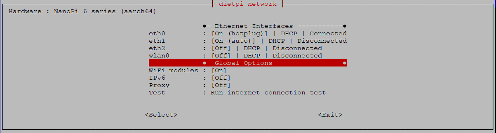{: width="900" height="323" loading="lazy"}

The same menu is opened by **Network Options: Adapters** in [DietPi-Config](#dietpi-config).

### Feature overview {: id="dietpi-network-features" }

=== "Main menu"

    The menu lists all Ethernet and WiFi adapters which were found, with their state, e.g. `[On (hotplug)] | DHCP | Connected`. Select an adapter to change its settings. Below, the **Global Options** are found:

    - **WiFi modules**: Turn WiFi support on or off for the whole system. When you turn it off, you can also remove the WiFi packages.
    - **Onboard WiFi**: Turn the WiFi chip on your board on or off. This entry only shows up, if your board has WiFi onboard.
    - **IPv6**: Turn IPv6 on or off.
    - **Proxy**: Set up a proxy server, see the "Proxy" tab.
    - **Test**: Enter a web address, e.g. `https://dietpi.com`, to test whether your Internet connection works.

=== "Ethernet"

    Select your Ethernet adapter, e.g. `eth0`, in the main menu.

    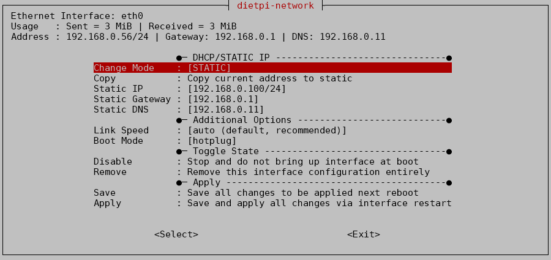{: width="900" height="425" loading="lazy"}

    - **Change Mode**: Switch between **DHCP** and **STATIC**. With DHCP, your router gives the IP address to your device. This is the best choice for most users. With STATIC, you choose the address yourself, and the following entries show up.
    - **Copy**: Take over the current address, gateway and DNS server as static values. This is a good start, if you want to keep the current address.
    - **Static IP**: The IP address of your device, e.g. `192.168.0.100`. Optionally, add the netmask like `192.168.0.100/24`. Without it, `/24` (`255.255.255.0`) is used, which fits to most home networks.
    - **Static Gateway**: The address of your router, e.g. `192.168.0.1`. It is used to reach the Internet. Leave it empty, if this adapter shall **not** be used for Internet access, see the "Several adapters" tab.
    - **Static DNS**: The DNS server which translates domain names. Your router or a public DNS provider can be selected from a list.
    - **Link Speed**: The connection speed. Leave it at **auto** unless you know that you need a fixed speed.
    - **Boot Mode**: **hotplug** brings the adapter up as soon as it is detected. This is recommended. **auto** brings it up during early boot, which can fail if the adapter starts slowly.
    - **Disable** / **Enable**: Turn the adapter off or on.
    - **Remove**: Delete the settings of this adapter completely.
    - **Save**: Save the settings. They are used from the next reboot.
    - **Apply**: Save the settings and use them right now. Only this adapter is restarted.

    !!! warning "Take care with a remote connection"
        If you are connected via SSH, a wrong address or gateway can cut your connection when you select **Apply**. Make sure that the values are correct, and that you can reach your device otherwise, e.g. with a keyboard and monitor.

=== "WiFi"

    Select your WiFi adapter, e.g. `wlan0`, in the main menu. WiFi has to be turned on with **WiFi modules** before.

    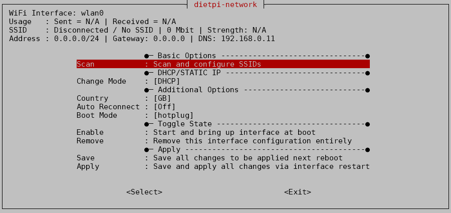{: width="900" height="425" loading="lazy"}

    - **Scan**: Search for WiFi networks, select yours and enter the password.
    - **Change Mode**, **Static IP**, **Static Gateway**, **Static DNS**, **Boot Mode**, **Disable** / **Enable**, **Remove**, **Save** and **Apply**: Work like for Ethernet, see the "Ethernet" tab.
    - **Country**: Select your country. This is required to use the WiFi channels and power which are allowed in your region.
    - **Auto Reconnect**: Reconnects automatically, if the WiFi connection is lost.

    If you have installed the [WiFi HotSpot](../software/advanced_networking.md#wifi-hotspot) software, the WiFi adapter of the hotspot shows the hotspot settings instead: **SSID** (name), **Key** (password, at least 8 characters), **Frequency** (2.4 or 5 GHz), **Channel** and the WiFi standards **802.11n/ac/ax** (WiFi 4/5/6). With **State**, you can turn the hotspot on or off.

=== "Several adapters"

    With more than one network adapter, think about what each one shall do:

    - **One adapter for the Internet**: This adapter needs a gateway. With DHCP, this is done by your router. With a static address, set **Static Gateway** to your router address.
    - **Further adapters**: Usually, they get a static address and **no gateway**. Your device can then reach another local network with a different address range, e.g. a NAS or development board which is connected directly to your device. Or other devices from that network can reach your DietPi. Each adapter needs its own address range, e.g. `192.168.0.x` and `192.168.1.x`. DietPi-Network warns you, if two adapters would use the same range or if there would be two gateways.

    !!! info "What DietPi-Network does not do"
        DietPi-Network only sets up the adapters of your device itself. It does not forward traffic from one adapter to another, so it cannot be used for bridges or routers, and it does not provide a fallback Internet connection if one adapter fails. It also does not set up a hotspot from LAN to LAN, WiFi to LAN or WiFi to WiFi. Use the [WiFi HotSpot](../software/advanced_networking.md#wifi-hotspot) software for a hotspot with Internet access from your Ethernet connection.

=== "Proxy"

    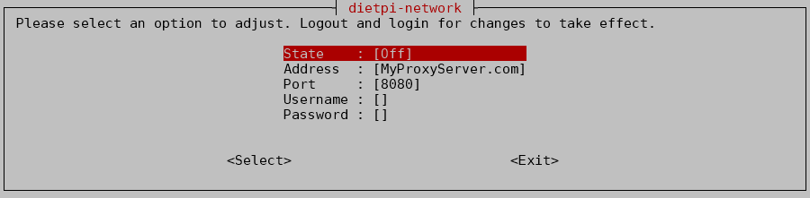{: width="900" height="221" loading="lazy"}

    If you need a proxy server to reach the Internet, e.g. in a company network, enter its **Address**, **Port** and, if needed, **Username** and **Password**. Then switch **State** to on. Log out and in again, so that the settings take effect.

=== "CLI"

    All menus can be opened directly, and all settings can be changed without the menu, e.g. for scripts. Open the settings of one adapter, the proxy or the WiFi country directly:

    ```sh
    dietpi-network eth0
    dietpi-network proxy
    dietpi-network country
    ```

    Set a static address on `eth0`, and go back to DHCP:

    ```sh
    dietpi-network apply eth0 --static --ip 192.168.0.100/24 --gateway 192.168.0.1 --dns "192.168.0.1"
    dietpi-network apply eth0 --dhcp
    ```

    Set up a second adapter without gateway, so that it is not used for the Internet:

    ```sh
    dietpi-network apply eth1 --static --ip 192.168.1.10/24
    ```

    Change the proxy:

    ```sh
    dietpi-network proxy address proxy.example.com
    dietpi-network proxy port 8080
    dietpi-network proxy enable
    ```

    Here is an overview of all available commands:

    ```console
    Usage: dietpi-network [<command>]
    Available commands:
      <empty>, main                       Open the interactive top-level menu to control network settings
      <ifname>                            Open the interactive submenu for network interface <ifname>
      country                             Open the interactive WiFi country code submenu
      proxy                               Open the interactive proxy submenu
      apply <ifname> [<options>...]       Apply interface config for <ifname> and reconnect only that interface
      remove <ifname>                     Remove the DietPi drop-in config for <ifname> and ifdown the interface
      proxy enable|disable                Enable or disable the configured proxy globally
      proxy address|port|username|password <value>
                                          Apply <value> to the specified proxy setting
    Available options for "apply" command:
      --enable|--disable                  Enable or disable the interface
      --dhcp|--static                     Select DHCP or static IPv4 mode
      --ip <address>[/<cidr>]             Static IPv4 address with optional CIDR netmask, else /24
      --gateway <address>                 Static IPv4 gateway
      --dns "<ip> [<ip>...]"              Static DNS server list
      --copy-current                      Copy current live IPv4/DNS values into static settings before applying
      --hotplug|--auto                    Bring up interface once detected/plugged (hotplug) or during early boot (auto)
                                          The hotplug mode is the recommended default on all systems but container guests.
                                          The auto mode can fail if the adapter is not initializing fast enough.
      --client|--hotspot                  WiFi client or hotspot mode, which defaults to client for new interfaces
      --ssid <name>                       WiFi hotspot SSID
      --key <passphrase>                  WiFi hotspot WPA passphrase
      --freq 2.4|5                        WiFi hotspot frequency band
      --channel <channel>                 WiFi hotspot channel for the selected frequency band
      --wifi4 0|1                         Enable or disable WiFi 4 / 802.11n support for hotspot mode
      --wifi5 0|1                         Enable or disable WiFi 5 / 802.11ac support for hotspot mode
      --wifi6 0|1                         Enable or disable WiFi 6 / 802.11ax support for hotspot mode
      --no-restart                        Write config only, do not reconnect the interface now
      --force                             Proceed even if a network conflict (same subnet/duplicate default route) with
                                          another enabled interface is detected, or if the interface does not exist at all.
    ```

---

## DietPi drive manager

Feature-rich drive management utility. It is a lightweight program that allows to:

- Manage drives: Mount (manual and automatic), format external drives
- Maintenance drives: Check and repair drives, resize (expand) filesystem, change reserved blocks count
- Set drive attributes: Set read only filesystems, set idle spindown time
- Move DietPi User data
- Transfer RootFS to external drive (Raspberry Pi and some ODROID boards only)
- Disable swap file, change swap file size
- Run benchmarks on drives
- Mount network drives (NFS and Samba)

To start DietPi-Drive_Manager, the following command is used:

```sh
dietpi-drive_manager
```

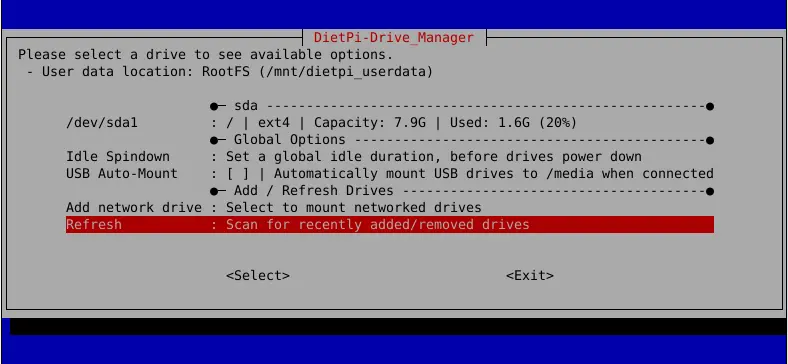{: width="640" height="296" loading="lazy"}

### Feature overview

#### Setup a dedicated drive for DietPi

To use an additional drive (example USB drive) the following steps have to be done:

1. Run `dietpi-drive_manager` to bring up the main menu.
1. Plug in the drive which shall be used.
1. Select `Refresh` from the menu (if it doesn't show up straight away, give it a few seconds for system to update, then try again).
1. Select the drive which shall be used from the list, then press ++enter++.

    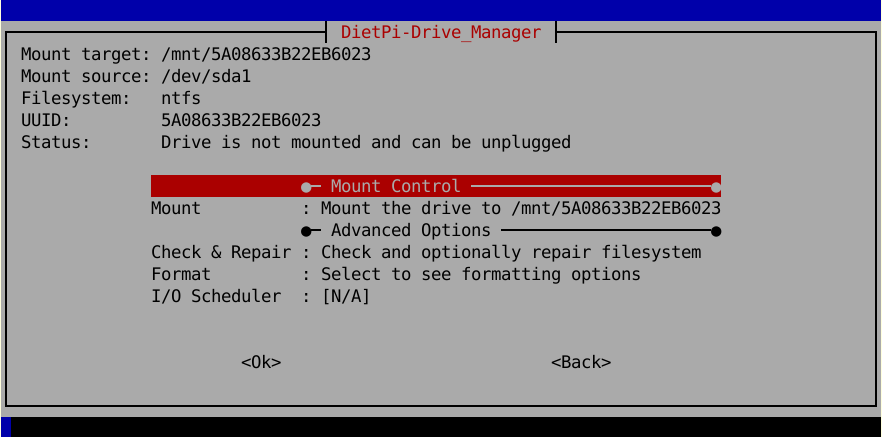{: width="600" height="297" loading="lazy"}

    If needed, format the drive before usage selecting the `Format` option (filesystem type description see below).  
    Remark: Formatting drives can only be done unmounted.

    If needed, mount the drive via the `Mount` selection. If mounted, commands `Unmount`, `Benchmark`, `User data`, `Swapfile` and `Read only` are present.

    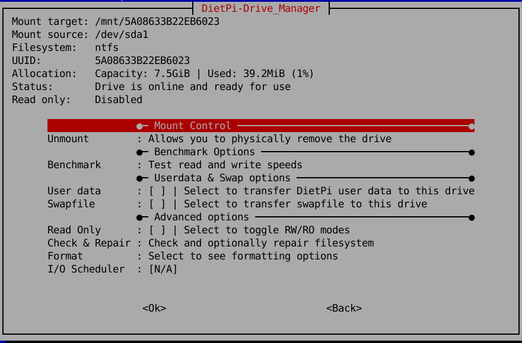{: width="600" height="395" loading="lazy"}

#### Move the location of user data and swap file

The location of the DietPi user data (default `/mnt/dietpi_userdata`) or the swap file can be moved to a different location on a target drive. This may be useful if the filesystem containing the DietPi user data resp. swap file has only little space left.
Therefore execute the following steps (example user data, swap file is quite similar):

1. Run `dietpi-drive_manager` to bring up the main menu.
1. Have the target drive connected and mounted (see description above).
1. Select the target drive and press ++enter++.
1. In the drives menu select `User data` resp. `Swapfile` and follow the instructions.

- Move user data:

    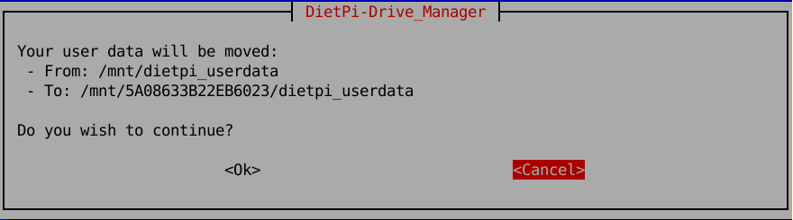{: width="500" height="139" loading="lazy"}

- Change swap file size:

    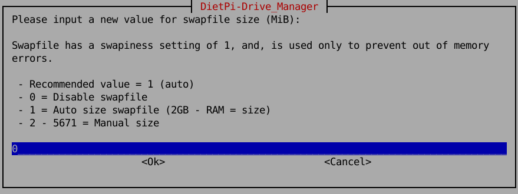{: width="500" height="188" loading="lazy"}

#### Format filesystem types

Formatting filesystems leads to these dialogues:

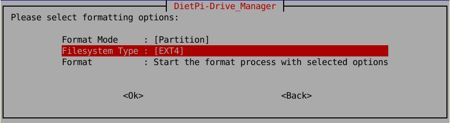{: width="500" height="137" loading="lazy"}
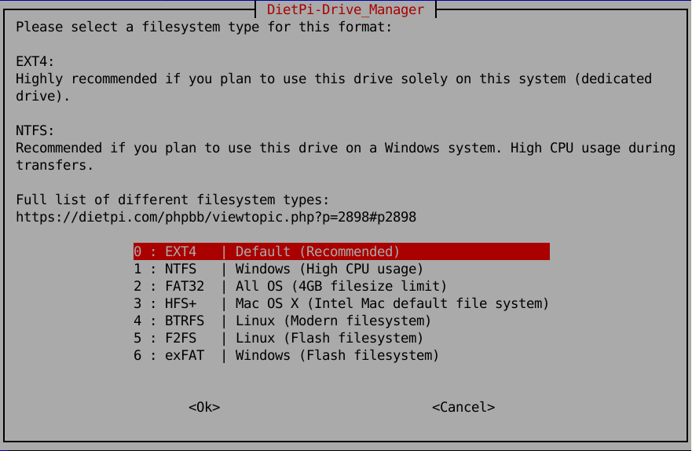{: width="500" height="326" loading="lazy"}

In the latter dialog the filesystem type has to be selected. The following options may be chosen:

=== "ext4 (Default)"

    Recommended for users who plan to use this drive solely on Linux systems (e.g. dedicated drive).  
    `+` The standard for Linux filesystems  
    `-` Not compatible on a Windows system

=== "NTFS"

    Recommended for users who plan to use this drive on a Windows system.  
    `+` Compatible on a Windows system  
    `-` Only emulated support for UNIX permissions  
    `-` Does support symbolic links (creation)  
    `-` High CPU usage during transfers (spawns a process)

=== "FAT32"

    Recommended for users who want high compatibility across multiples operating systems.  
    `+` Highly compatible with all OS  
    `-` 4 GiB file size limit  
    `-` 2 TiB drive size limit  
    `-` Does not support UNIX permissions  
    `-` Does not support symbolic links

=== "exFAT"

    Windows filesystem, intended for external drives, e.g. USB flash drives or SD cards.  
    `+` Flash-Friendly File System: <https://en.m.wikipedia.org/wiki/ExFAT>  
    `+` Compatible on a Windows system  
    `-` Does not support UNIX permissions  
    `-` Does not support symbolic links

=== "HFS+"

    Recommended for users who plan to use this drive on a macOS system.  
    `+` macOS filesystem  
    `-` Not compatible on a Windows system

=== "Btrfs"

    A modern Linux filesystem.  
    `+` Advantages were described in [this DietPi issue](https://github.com/MichaIng/DietPi/issues/271#issuecomment-247173250)  
    `-` Compatible with Windows only via additional windows driver [WinBtrfs](https://github.com/maharmstone/btrfs)

=== "F2FS"

    Linux filesystem designed for flash/NAND based drives.  
    `+` Flash-Friendly File System: <https://en.wikipedia.org/wiki/F2FS>  
    `-` Not compatible on a Windows system

=== "XFS"

    A modern Linux filesystem.  
    `+` Well accepted for large files (typically in a file server use)  
    `-` Not compatible on a Windows system

#### Move DietPi system to a larger SD card

If the DietPi SD card space shall be expanded by moving the system to a larger memory card, this can be achieved by the following steps:

1. Shutdown the system and put the SD card into a card reader of a different systems.
1. Copy the SD card contents to the new (larger) SD card. This can e.g. be done using
    - the `dd` command (command line option)
    - [balenaEtcher](https://etcher.balena.io/) or [Rufus](https://rufus.ie/) (graphical user interface option)
    - `gnome-disks` (graphical user interface option)
1. Boot the system with the copied memory card.
1. Run `dietpi-drive_manager` to bring up the main menu.
1. Select the disk containing the root (`/`) partition and press ++enter++.
1. Select `Resize` and press ++enter++.

    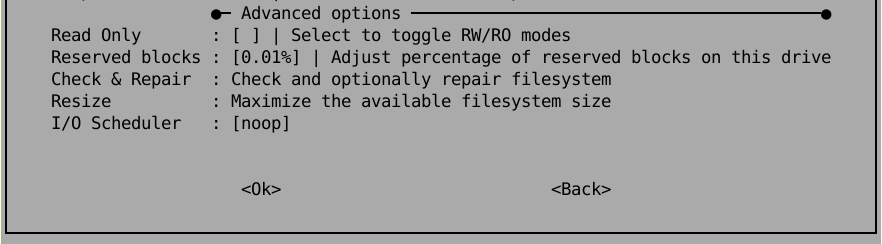{: width="500" height="138" loading="lazy"}

1. Reboot the system to expand the root filesystem to use the whole space of the new memory card.

A similar procedure may be used when moving the SD card contents to a smaller SD card. During this procedure typically a shrink of the partition size (e.g. with `parted` or `gparted`) is necessary before copying the partition image to a different memory card. Also, do the resize to use the full space on the new card.

#### Auto-mount of local USB drives

`DietPi-Drive_Manager` has the option to auto-mount local USB devices to `/media/<uuid>` when they are plugged in. On removal they are automatically unmounted.

- In case of a deselected auto-mount option the following output is given  
  (example with `/dev/sdb` with two partitions `sdb1` and `sdb2`):

    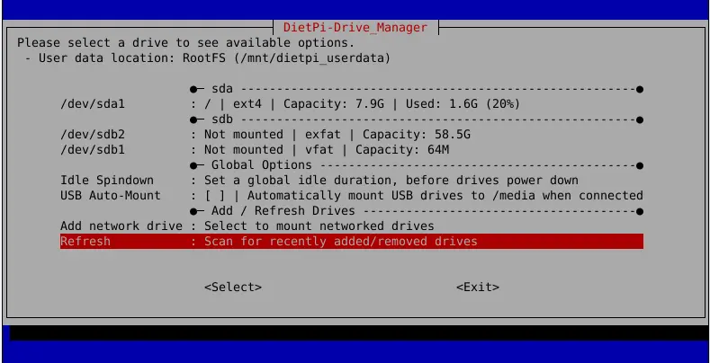{: width="600" height="307" loading="lazy"}

- With selected auto-mount option the following output results:

    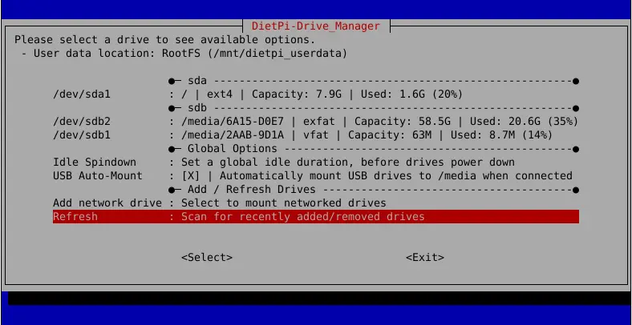{: width="600" height="309" loading="lazy"}

    The mount point will be `/media/<uuid>` with `<uuid>` as the UUID of the drive partitions.  
    The UUID can also be retrieved via the command `blkid` (example `blkid` output: `/dev/sdb1: UUID="2AAB-9D1A" ...` resp. `/dev/sdb2: UUID="6A15-D0E7" ...`).

#### Mount network drive

Mounting a NFS drive or a Samba share can be done this by:

1. Run `dietpi-drive_manager` to bring up the main menu.
1. Select `Add network drive`.
1. Select the type of network drive that shall be mounted.
1. Follow the prompts.

!!! info "Mounting a macOS Samba share"
    To mount a macOS Samba share enabled in `Sharing`, it is needed to (in the server) go to `Sharing > File Sharing > Options > Windows File Sharing` and select the appropriate username.

### DietPi drive manager - Command line usage

Beside the interactive drive management via `dietpi-drive_manager`, there is the option of the shell command line:

```console
Usage: dietpi-drive_manager [<command>]
Available commands:
  <empty>       Interactive menu
  1             Select an available drive mount which is then saved to: 
                /tmp/dietpi-drive_manager_selmnt
  3             Scan for new drives and re-create fstab non-interactively, 
                then exit
  4             Reset /etc/fstab with currently attached local drives 
                and /tmp + /var/log tmpfs mount 
                (command shall only used internally by DietPi-Installer)
```

---

## DietPi autostart

Defines software packages to start when the DietPi OS boots up. Example, boot into the desktop with Kodi running. To start DietPi-Autostart, use the following command:

```sh
dietpi-autostart
```

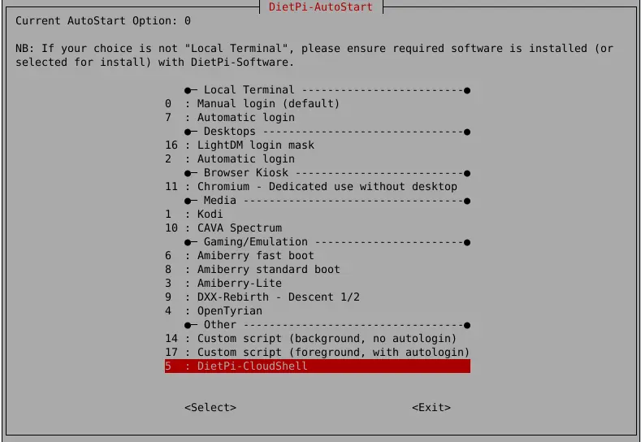{: width="640" height="441" loading="lazy"}

### DietPi autostart - Command line usage

Beside the interactive autostart selection via `dietpi-autostart`, there is the option of the shell command line:

```console
Usage: dietpi-autostart [<index>]
Available values of <index>:
    <empty>     Interactive menu
    <not empty> Apply autostart <index> non-interactively
```

See the screenshot above for values of `<index>` left in the menu lines (`0`, `7`, `16`,...).

!!! info "Autostart option in `dietpi.txt` (first initial boot)"
    When booting the DietPi system the first time, the autostart option can also be set via the file `dietpi.txt`. See option  
    `AUTO_SETUP_AUTOSTART_TARGET_INDEX=`  
    for further information.  
    The numbers shown on the left in the `dietpi-autostart` command correspond to the values in `dietpi.txt`.

---

## DietPi services

Provides service control, priority level tweaks and status print. To start DietPi-Services, use the following command:

```sh
dietpi-services
```

### Feature overview

If DietPi services are called via the command line without arguments, an interactive menu to apply service modes and settings comes up:

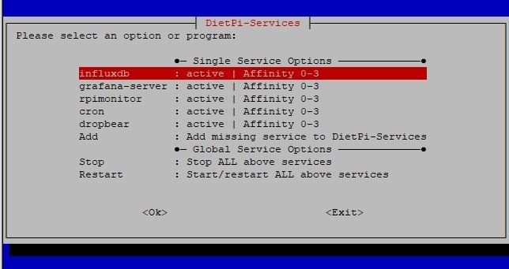{: width="644" height="341" loading="lazy"}

The dialog to tweak a service is entered by highlighting the service (keys ++arrow-up++ and ++arrow-down++) and pressing ++enter++. The configuration dialog (example: cron service) looks like this:

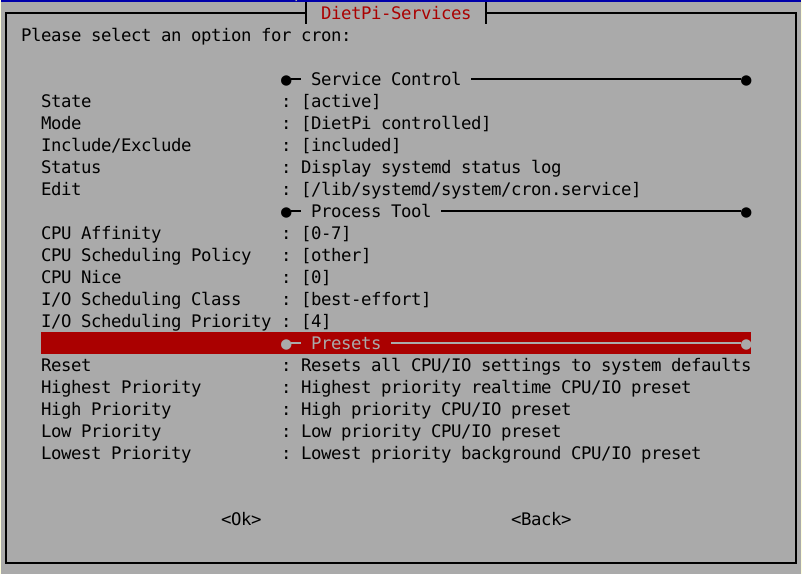{: width="644" height="461" loading="lazy"}

!!! caution "Be careful at tweaking the services."

### DietPi services - Command line usage

Beside the interactive handling via `dietpi-services`, there is the option of the shell command line:

```console
Usage: dietpi-services [<command> [<service_name>]]
Available commands:
    <empty>     Interactive menu
    status      Print service status info
    start       Start service <service_name>
    stop        Stop service <service_name>
    restart     Restart service <service_name>
    enable      Autostart service on boot <service_name>
    disable     Do not autostart service on boot <service_name>
    mask        Mask service to prevent its usage entirely <service_name>
    unmask      Unmask service to allow its usage <service_name>

Available service_names:
    <name>      Apply command to a single available systemd or sysvinit
                service <name> (e.g. "cron")
    <empty>     Apply command to all available services known to DietPi
                - Masked services are skipped unless command is "unmask".
                - Disabled services are skipped if command is "restart".
                - Services required for network or shell sessions are skipped.
                - You can include/exclude services by editing the following file:
                  /boot/dietpi/.dietpi-services_include_exclude
```

Example:

```console
root@dietpi:~# dietpi-services status

 DietPi-Services
─────────────────────────────────────────────────────
 Mode: status 

[  OK  ] DietPi-Services | cron                 active (running) since Mon 2025-02-10 05:06:57 CET; 7h ago
[  OK  ] DietPi-Services | ssh                  active (running) since Fri 2025-01-17 15:03:59 CET; 3 weeks 2 days ago
[ INFO ] DietPi-Services | dietpi-vpn           inactive (dead)
[ INFO ] DietPi-Services | dietpi-cloudshell    inactive (dead)
[  OK  ] DietPi-Services | dietpi-ramlog        active (exited) since Fri 2025-01-17 15:04:00 CET; 3 weeks 2 days ago
[  OK  ] DietPi-Services | dietpi-preboot       active (exited) since Fri 2025-01-17 15:04:00 CET; 3 weeks 2 days ago
[  OK  ] DietPi-Services | dietpi-postboot      active (exited) since Fri 2025-01-17 15:03:59 CET; 3 weeks 2 days ago
[ INFO ] DietPi-Services | dietpi-wifi-monitor  inactive (dead)
root@dietpi:~#
```

---

## DietPi display

DietPi Display allows the configuration of console display modes and rotation via KMS/DRM (Kernel Mode Setting, Direct Rendering Manager). This is e.g. valid for a local display of the Raspberry Pi and the NanoPi M6:

```sh
dietpi-display
```

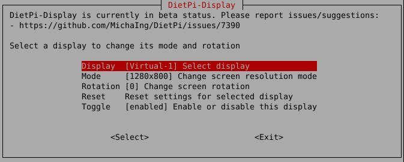{: width="640" height="258" loading="lazy"}

---

## DietPi LED control

Change triggers for the status LEDs on the SBC/motherboard. To start DietPi-LED_Control, use the following command:

```sh
dietpi-led_control
```

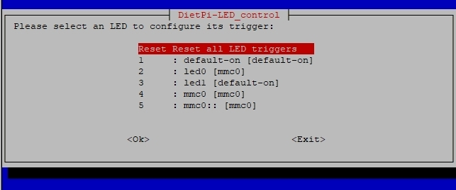{: width="643" height="269" loading="lazy"}

Depending on the used hardware, the number of entries in the dialog will change.

---

## DietPi cron

Modify the start times of specific cron job groups. To start DietPi-Cron, use the following command:

```sh
dietpi-cron
```

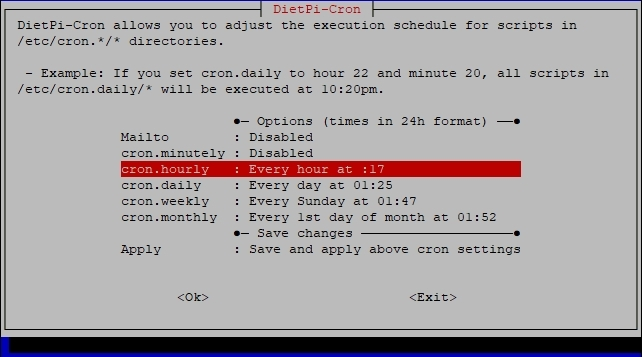{: width="643" height="357" loading="lazy"}

---

## DietPi JustBoom

Change the audio settings. To start DietPi-JustBoom, use the following command:

```sh
dietpi-justboom
```

If the sound output is configured, the following dialog appears:

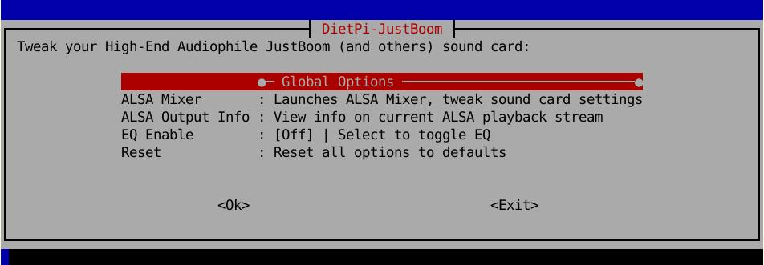{: width="642" height="223" loading="lazy"}

If no sound output is configured, the following dialog appears:

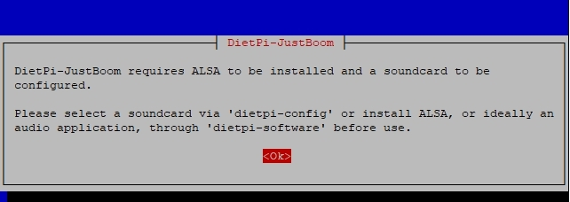{: width="642" height="228" loading="lazy"}

In this case e.g. a sound program package via `dietpi-software` has to be installed or the sound output e.g. via `dietpi-config` has to be configured.

---

## DietPi Banner

Enables the configuration of the initial banner, displayed on logon. To start DietPi-Banner, use the following command:

```sh
dietpi-banner
```

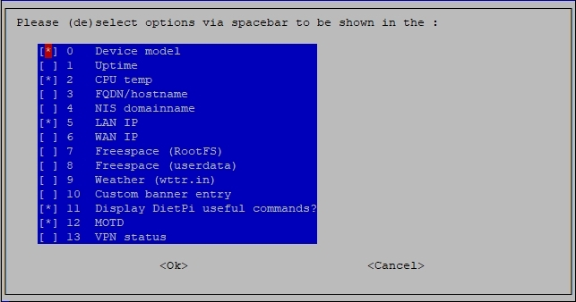{: width="640" height="368" loading="lazy"}

### Feature overview

Using these settings the information displayed initially can be configured, choosing the details displayed initially. See below an example where 4 options are selected:

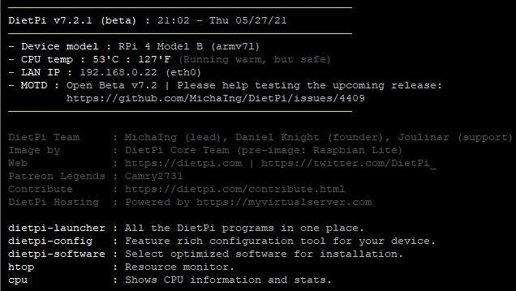{: width="636" height="359" loading="lazy"}

### DietPi banner - Command line usage

Beside the interactive setting via `dietpi-banner`, there is the option of the shell command line:

```console
Usage: dietpi-banner [<command>]
Available commands:
    <empty>     Interactive menu to select banner entries
    0           Top section + LAN IP
    1           Clear terminal + top section + chosen entries
```

---
