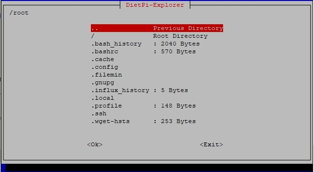
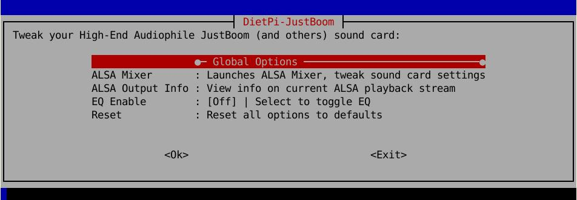

# System configuration

## DietPi-Config

Configure various system settings, from display / audio / network to *auto start* options. To start the system configuration, use the following command:

```sh
dietpi-config
```

{: width="643" height="335" loading="lazy"}

=== "Display Options"

    The display options are used to

    - Set your screen resolution, or go headless to save additional resources.  
    - Control your GPU memory splits.  
    - Enable/disable the RPi camera.

=== "Audio Options"

    The audio options are used to

    - Change sound cards with ease (e.g.: HiFiBerry / Odroid HiFi shield).

=== "Performance Options"

    The performance options are used to

    - Overclock your system with a vast selection of overclocking profiles for your device.
    - Change the CPU governor and tweak your ARM temperature limits.

=== "Advanced Options"

    The advanced options are used to

    - Configure swap file size
    - Set APT cache handling
    - Configure time synchronization and real time clock source
    - Toggle serial console
    - Toggle Bluetooth

=== "Security Options"

    The security options are used to

    - Change password and hostname

=== "Language/Regional Options"

    The language/regional options are used to

    - Set timezone, locale and keyboard options. Everything you will need to make it feel like home

=== "Network Options: Adapters"

    The network options are used to

    - Scan and connect to your WiFi router with ease
    - Change to a static IP address on your network
    - Configure your proxy settings
    - Test internet connection
    - Toggle IPv6 support

=== "Network Options: Misc"

    The miscellaneous network options options are used to

    - Select an **APT mirror** to connect to the Debian (or Raspbian) APT repository.
    - Select an **NTP mirror** to synchronise your system time.
    - Choose these options for the **network and URL connection tests**:
        - Set Network test connection timeout and number of connection test tries.
        - Set IPv4 and IPv6 addresses used for the connection test.
        - Set the domain used for the domain name resolution test.
    - **Network Drives** redirects you to the **DietPi-Drive_Manager** which allows you to mount Samba and NFS shares on your DietPi system.
    - Select one of several **Dynamic DNS** ([**DDNS**](https://wikipedia.org/wiki/Dynamic_DNS)) providers which allows you to access your home network/server with a static domain name. The client is required to inform the DDNS of your current dynamic external IP on a regular basis.

=== "AutoStart Options"

    The autostart options are used to

    - Quickly and easily change what software runs after boot. Kodi, Desktop, console and many more

=== "Tools"

    The tools options are used to

    - Perform CPU, RAM, filesystem and network **benchmarks**, optionally upload your results and review statistics at: <https://dietpi.com/survey/#benchmark>
    - Perform CPU/IO/RAM/DISK **stress tests** to test the stability of your system, e.g. after applying some overclocking.

---

## DietPi drive manager

Feature-rich drive management utility. It is a lightweight program that allows you to:

- Manage drives: Mount, format external drives
- Maintenance drives: Check and repair drives, resize (expand) filesystem, change reserved blocks count
- Set drive attributes: Set read only filesystems, set idle spindown time
- Move DietPi User data
- Transfer RootFS to external drive (Raspberry Pi and some ODROID boards only)
- Disable swap file, change swap file size
- Run benchmarks on drives
- Mount network drives (NFS and Samba)

To start DietPi-Drive_Manager, use the following command:

```sh
dietpi-drive_manager
```

{: width="643" height="327" loading="lazy"}

### Setup a dedicated drive for DietPi

To use an additional drive (example USB drive) the following steps have to be done:

1. Run `dietpi-drive_manager` to bring up the main menu.
1. Plug in the drive you wish to use.
1. Select `Refresh` from the menu (if it doesn't show up straight away, give it a few seconds for system to update, then try again).
1. Select the drive you wish to use from the list, then press ++enter++.

    {: width="600" height="297" loading="lazy"}

    If needed, format the drive before usage selecting the `Format` option (filesystem type description see below).  
    Remark: Formatting drives can only be done unmounted.

    If needed, mount the drive via the `Mount` selection. If mounted, commands `Unmount`, `Benchmark`, `User data`, `Swapfile` and `Read only` are present.

    {: width="600" height="395" loading="lazy"}

### Move the location of user data and swap file

You can move the location of the DietPi user data (default `/mnt/dietpi_userdata`) or the swap file to a different location on a target drive. This may be useful if your filesystem containing the DietPi user data resp. swap file has only little space left.
Therefore execute the following steps (example user data, swap file is quite similar):

1. Run `dietpi-drive_manager` to bring up the main menu.
1. Have the target drive connected and mounted (see description above).
1. Select the target drive and press ++enter++.
1. In the drives menu select `User data` resp. `Swapfile` and follow the instructions.

- Move user data:

{: width="500" height="139" loading="lazy"}

- Change swap file size:

{: width="500" height="188" loading="lazy"}

### Format filesystem types

Formatting filesystems lead you to these dialogues:

{: width="500" height="137" loading="lazy"}
{: width="500" height="326" loading="lazy"}

In the latter dialog you have to choose the filesystem type. The following selections may be chosen:

=== "ext4 (Default)"

    Recommended for users who plan to use this drive solely on Linux systems (e.g. dedicated drive).  
    `+` The standard for Linux filesystems  
    `-` Not compatible on a Windows system

=== "NTFS"

    Recommended for users who plan to use this drive on a Windows system.  
    `+` Compatible on a Windows system  
    `-` Only emulated support for UNIX permissions  
    `-` Does support symbolic links (creation)  
    `-` High CPU usage during transfers (spawns a process)

=== "FAT32"

    Recommended for users who want high compatibility across multiples operating systems.  
    `+` Highly compatible with all OS  
    `-` 4 GiB file size limit  
    `-` 2 TiB drive size limit  
    `-` Does not support UNIX permissions  
    `-` Does not support symbolic links

=== "exFAT"

    Windows filesystem, intended for external drives, e.g. USB flash drives or SD cards.  
    `+` Flash-Friendly File System: <https://en.m.wikipedia.org/wiki/ExFAT>  
    `+` Compatible on a Windows system  
    `-` Does not support UNIX permissions  
    `-` Does not support symbolic links

=== "HFS+"

    Recommended for users who plan to use this drive on a macOS system.  
    `+` macOS filesystem  
    `-` Not compatible on a Windows system

=== "Btrfs"

    A modern Linux filesystem.  
    `+` Advantages were described in [this DietPi issue](https://github.com/MichaIng/DietPi/issues/271#issuecomment-247173250)  
    `-` Compatible with Windows only via additional windows driver [WinBtrfs](https://github.com/maharmstone/btrfs)

=== "F2FS"

    Linux filesystem designed for flash/NAND based drives.  
    `+` Flash-Friendly File System: <https://en.wikipedia.org/wiki/F2FS>  
    `-` Not compatible on a Windows system

=== "XFS"

    A modern Linux filesystem.  
    `+` Well accepted for large files (typically in a file server use)  
    `-` Not compatible on a Windows system

### Move DietPi system to a larger SD card

If you want to extend your DietPi SD card space by moving the system to a larger memory card, this can be achieved by the following steps:

1. Shutdown your system and put the SD card into a card reader of a different systems.
1. Copy the SD card contents to the new (larger) SD card. This can e.g. be done using
    - the `dd` command (command line option)
    - [balenaEtcher](https://etcher.io/) or [Rufus](https://rufus.ie/) (graphical user interface option)
    - `gnome-disks` (graphical user interface option)
1. Boot the system with the copied memory card.
1. Run `dietpi-drive_manager` to bring up the main menu.
1. Select the disk containing the root (`/`) partition and press ++enter++.
1. Select `Resize` and press ++enter++.

    {: width="500" height="138" loading="lazy"}

1. Reboot your system to expand the root filesystem to use the whole space of the new memory card.

A similar procedure may be used when moving the SD card contents to a smaller SD card. During this procedure you typically need to shrink the partition size (e.g. with `parted` or `gparted`) before copying the partition image to a different memory card. Also, do the resize to use the full space on the new card.

### Mount network drive

If you want to mount a NFS drive or a Samba share, you can do this by:

1. Run `dietpi-drive_manager` to bring up the main menu.
1. Select `Add network drive`.
1. Select the type of network drive that you have.
1. Follow the prompts.

!!! info "Mounting a macOS Samba share"
    To mount a macOS Samba share enabled in `Sharing`, you need to (in the server) go to `Sharing > File Sharing > Options > Windows File Sharing` and select your username.

---

## DietPi file explorer

Lightweight file manager and explorer. To start DietPi-Explorer, use the following command:

```sh
dietpi-explorer
```

{: width="646" height="355" loading="lazy"}

---

## DietPi autostart

Defines software packages to start when the DietPi OS boots up. Example, boot into the desktop with Kodi running. To start DietPi-Autostart, use the following command:

```sh
dietpi-autostart
```

{: width="640" height="458" loading="lazy"}

!!! info "Autostart option in `dietpi.txt` (first initial boot)"
    When booting the DietPi system the first time, the autostart option can also be set via the file `dietpi.txt`. See option  
    `AUTO_SETUP_AUTOSTART_TARGET_INDEX=`  
    for further information.  
    The numbers shown on the left in the `dietpi-autostart` command correspond to the values in `dietpi.txt`.

---

## DietPi services

Provides service control, priority level tweaks and status print. To start DietPi-Services, use the following command:

```sh
dietpi-services
```

{: width="644" height="341" loading="lazy"}

The dialog to tweak a service is entered by highlighting the service (keys ++arrow-up++ and ++arrow-down++) and pressing ++enter++. The configuration dialog (example: cron service) looks like this:

{: width="644" height="461" loading="lazy"}

!!! caution "Be careful at tweaking the services."

---

## DietPi LED control

Change triggers for the status LEDs on your SBC/motherboard. To start DietPi-LED_Control, use the following command:

```sh
dietpi-led_control
```

{: width="643" height="269" loading="lazy"}

Depending on your used hardware, the number of entries in the dialog will change.

---

## DietPi cron

Modify the start times of specific cron job groups. To start DietPi-Cron, use the following command:

```sh
dietpi-cron
```

{: width="643" height="357" loading="lazy"}

---

## DietPi JustBoom

Change the audio settings. To start DietPi-JustBoom, use the following command:

```sh
dietpi-justboom
```

If the sound output is configured, the following dialog appears:

{: width="642" height="223" loading="lazy"}

If no sound output is configured, the following dialog appears:

{: width="642" height="228" loading="lazy"}

In this case you have to e.g. install a sound program package via `dietpi-software` or configure the sound output e.g. via `dietpi-config`.

---

## DietPi survey

DietPi Survey allows the DietPi project to obtain general information regarding your system and installed software. To start DietPi-Survey, use the following command:

```sh
dietpi-survey
```

???+ important "Privacy and goals"

    The following privacy rules and goals are considered:

    - No private data is sent. No one can identify you. No IP address is obtained.
    - DietPi Survey is an ***Opt-in*** system, which means that it won't send any data without your explicit interactive permission.
    - On your first interactive login on a fresh DietPi system, you will be asked once for the *Opt-in*/*Opt-out* mode.
    - The transmitted data allows the DietPi project team to achieve the best future possible experience for everyone to
        - focus and improve especially popular areas,
        - ensure the most common devices and software titles will receive support and improvements,
        - keep up support for software and hardware that you use.

    **In short words:** By selecting ***Opt IN***, you are supporting the DietPi project with no impact to your system or private data.

{: width="645" height="368" loading="lazy"}

=== "Data transmission events"

    The DietPi Survey data file is sent when you install software with `dietpi-software` and update DietPi with `dietpi-update`.

=== "Uploaded amount of data"

    The uploaded data is tiny (about 1 KB) and will not affect your internet bandwidth or system performance.

=== "Transmitted data contents"

    Within the command line program `dietpi-survey` the exact copy of the transmitted data can be viewed. The transmitted file is written in bash code to allow us faster report page creation (e.g. done for <https://dietpi.com/survey>).

    Following is an example how this file may look like:

    ```bash
    #!/bin/bash
    ((aDIETPI_VERSION[6.34]++))
    ((aGIT_BRANCH[MichaIng/master]++))
    ((aDEVICE_NAME[Virtual Machine (x86_64)]++))
    ((aCPU_ARCH[x86_64]++))
    ((aCPU_COUNT[2]++))
    ((aDISTRO_VERSION[buster]++))
    ((aAUTOSTART_OPTION[${aAUTOSTART_NAME[0]:=0}]++))
    ((aAUTO_SETUP_AUTOMATED[0]++))
    ((aNETWORK_INTERFACE[eth0]++))
    # -------------------------
    # DietPi-Software installs
    # -------------------------
    ((aSOFTWARE[${aSOFTWARE_NAME6_34[103]:=103}]++))
    ((aSOFTWARE[${aSOFTWARE_NAME6_34[104]:=104}]++))
    ```

    The tail of the file lists installed software packages by their IDs. The example above shows a very basic system, so only two software packages (`#103`: DietPi-RAMlog, `#104`: Dropbear) are installed.
    To find out the names of the installed software package IDs installed via `dietpi-software` you can execute

    ```sh
    dietpi-software list | grep ' =2'
    ```

    This gives the IDs, names and info of software. The above example would show

    ```text
    # dietpi-software list | grep ' =2'
    id 103 | =2 | dietpi-ramlog: minimal, optimised logging | | https://dietpi.com/docs/software/log_system/#dietpi-ramlog
    id 104 | =2 | dropbear: lightweight ssh server | | https://dietpi.com/docs/software/ssh/#dropbear
    ```

=== "Selecting Opt-in or Opt-out"

    You can select ***Opt-in*** or ***Opt-out*** of DietPi Survey by running the following command and follow the instructions:

    ```sh
    dietpi-survey
    ```

    This may also be achieved by setting `SURVEY_OPTED_IN=0` (*Opt-out*) or `SURVEY_OPTED_IN=1` (*Opt-in*) in `/boot/dietpi.txt` before the first system boot.

    To check the actual status, `dietpi-survey` may be called. The current mode will be pre-selected and highlighted.  
    Alternatively you can use

    ```sh
    grep 'SURVEY_OPTED_IN' /boot/dietpi.txt
    ```

    which displays the status like

    ```text
    # grep 'SURVEY_OPTED_IN' /boot/dietpi.txt
    SURVEY_OPTED_IN=1
    ```

---
