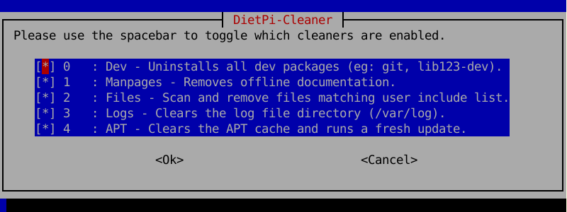
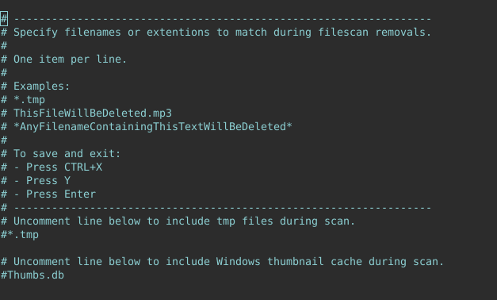
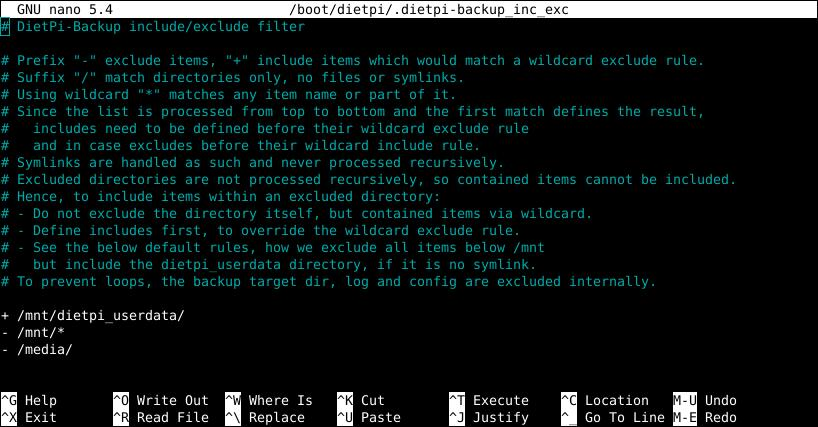
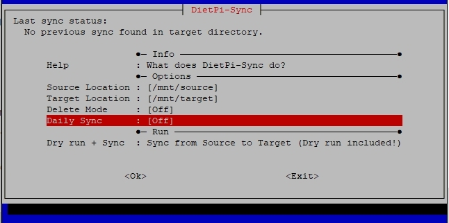

# System maintenance

## DietPi update

Update DietPi OS version to the latest version available and informs when updates for `apt upgrade` are available. To start DietPi-Update, use the following command:

```sh
dietpi-update
```

---

## DietPi cleaner

Clean up not necessary files from the operating system and free up valuable disk space.  
Think of it as lightweight CCleaner for DietPi and Linux. To start DietPi-Cleaner, use the following command:

```sh
dietpi-cleaner
```

{: width="644" height="284" loading="lazy"}

By simulating the cleaner process (via menu entry `Test`) you get a preview of the deletions the cleaner does before you start the cleaning process (via menu entry `Run`).

### Cleaner Types

DietPi-Cleaner uses modules which you can be switched on or off before running the cleaning process. Select them via the main menu entry `Cleaners`.

{: width="644" height="242" loading="lazy"}

### Files cleaner

The files cleaner allows you to customize a list of filenames to search and remove, during the cleaning process. Select them via the main menu entry `Files`.

{: width="644" height="388" loading="lazy"}

---

## DietPi log clear

Clear log files in `/var/log/`. To start DietPi-LogClear, use the following command:

```sh
dietpi-logclear
```

{: width="643" height="198" loading="lazy"}

---

## DietPi backup (backup/restore)

`DietPi-Backup` allows you to backup and restore your DietPi system, similar to *Windows system restore*. It creates a snapshot of the system that can be restored at any time.  
`DietPi-Backup` provides the following features:

- Selection of the **target directory** (also remote mounted shares are possible)
- Customization which **files and directories** are **included** and **excluded**
- Activation of **automatic daily backups**
- Setting of an **amount of backups to be kept**  

From the console, run the following command:

```sh
dietpi-backup
```

{: width="643" height="306" loading="lazy"}

=== "Settings files"

    Generally, the settings of the DietPi-Backup are changed via the `dietpi-backup` command menu entries.

    The system stores these settings in the files `/boot/dietpi/.dietpi-backup_settings` and `/boot/dietpi/.dietpi-backup_inc_exc`, which are generated from `dietpi-backup` automatically. Therefore, the files do not need to be changed manually by the user.

=== "Backup file selection (Filter)"

    The definition which files are used for the backup procedure is defined via the option "Filter" (see screenshot above). This opens `nano` to edit the include/exclude definitions for the backup.  
    The filter definition syntax is described within the file itself.

    {: width="681" height="330" loading="lazy"}

     Every (otherwise excluded) parent directory of an included directory needs to be included as well:

     E.g. to backup Home Assistant user data while having all other user data excluded:

    ```diff
    + /mnt/dietpi_userdata/
    + /mnt/dietpi_userdata/homeassistant/
    - /mnt/dietpi_userdata/*

    - /mnt/*
    - /media/
    ```

    If the user data location `/mnt/dietpi_userdata` has been moved to another drive:

    ```diff
    + /mnt/USBdrive/
    + /mnt/USBdrive/dietpi_userdata/
    + /mnt/USBdrive/dietpi_userdata/homeassistant/
    - /mnt/USBdrive/dietpi_userdata/*
    - /mnt/USBdrive/*

    - /mnt/*
    - /media/
    ```

    The file containing the filter definitions is `/boot/dietpi/.dietpi-backup_inc_exc`.

=== "Backup location"

    The backup target directory can be set to any directory which is not part of the backup itself. Especially, these options are typical:

    - Backup to/Restore from a connected USB stick or USB disk
    - Backup to/Restore from a network drive

=== "Amount"

    Sets the number of backups to be kept.  
    Backups are rotated automatically, if the maximum amount has been reached, the oldest backup is used as basis for the incremental new backup sync.

=== "Space check"

    A space check on the target location prior to the backup process can be enabled/disabled. This might be an option if there is surely enough disk space available.  
    Enabling the space check makes the backup a bit more safe, disabling it speeds it up, especially when using a network drive.

=== "Logging"

    Logging information about the backup procedure is given within the files `.dietpi-backup_stats` and `.dietpi-backup.log` which are located in the backup target directory ("Location" option):

    - `.dietpi-backup_stats` gives a list of completed operations with time and date
    - `.dietpi-backup.log` gives a list of every processed file

### Important DietPi-Backup hints

!!! note "File system type of the backup directory: Linux filesystem needed!"

    DietPi-Backup is purely based on `Rsync`, i.e., DietPi-Backup uses a backup on a file by file basis and is not based on an archive algorithm. This leads to the fact that file permissions/attributes are only preserved correctly in case of a Linux file system as the target directory.   
    In other cases (e.g. a Samba share), file permissions are not saved in the right manner and DietPi-Backup will not work appropriate.

    **Therefore, DietPi-Backup should only be used to/from a directory which handles Linux file attributes (e.g. NFS mounts or ext4 file systems).**

!!! info "DietPi userdata may not be included"

    If DietPi userdata have been moved to an external drive, i.e. `/mnt/dietpi_userdata` is a symlink, its content is excluded from backup and restore by default. You can change this with the `Filter` option.

!!! attention "Reduced system operation while DietPi-Backup runs"

    During the run of `dietpi-backup`, all services are stopped. This has to be taken into account e.g. if scheduling backups.

    - For example, a webserver based application (e.g. Nextcloud or many of the media servers, like Plex, Navidrome, etc.) will not run, because the webserver based UI is stopped.
    - Also, many of the according backend services are stopped as well as basic services like the Samba or NFS service.

### Automatic daily backup

`Dietpi-Backup` gives the option of an automatic daily backup function (controlled via the Linux `cron` mechanism).

It contains these options (see screenshot above):

- "Daily Backup": Activates the daily backup
- "Amount": Sets the number of backups to be kept

#### Daily backup execution time

The automatic daily backup (activated via option "Daily Backup", see screenshot above) is controlled via the Linux `cron` mechanism. Setting a different starting time can be an option, e.g. if you have several backup clients backing up to the same storage (backup server): Shifting the backup starting time of these systems may reduce temporary overload of the backup server by avoiding concurrent access to the storage.

The starting time is basically defined via the file `/etc/crontab` (which calls the backup/restore function via the `/etc/cron.daily/dietpi` script). It can be changed via the entry `cron.daily` within [`dietpi-cron`](system_configuration.md#dietpi-cron). It is executed by running the following command

```sh
dietpi-cron
```

Please keep in mind that all other daily `cron` based procedures are also started at this changed time.

### Scripted run

DietPi-Backup can be run from the command line or from scripts without user interaction by calling it via

```sh
dietpi-backup 1
```

A similar restore procedure is not recommended to avoid accidentally system overwrites. But to skip navigating through the menu, it can be done as well via

```sh
dietpi-backup -1
```

### Automated restore at the system's first run setup

DietPi-Backup contains an option of restoring a backup automatically during the first run setup of the system (this is run once when DietPi boots the first time).  
Therefore, a previous backup is needed on any storage device (USB stick, SSD, HDD, SD card, ...) and auto-restore needs to be activated via the file `/boot/dietpi.txt`.

This procedure is achieved with these steps (example: SD card is the boot media):

  1. Preparing the SD card:
    - Downloading an DietPi image
    - Flashing the image to the SD card
  2. Adjusting file `dietpi.txt`
    - Placing the SD card back to the computer so that an access to the boot file system is possible: In many cases this can be done directly in the PC, in other cases a mounting within a Linux system is needed.
    - Editing the file `/boot/dietpi.txt` in the boot file system
    - Activating the restore option by setting `AUTO_SETUP_BACKUP_RESTORE=1`

        ```sh
        # Restore a DietPi-Backup on first boot: 0 => disable | 1 => interactive restore (show list of found backups) | 2 => non-interactive restore (restore first found backup)
        # - Simply attach the drive/disk/stick with contains the backup. All attached drives will be mounted temporarily and searched automatically.
        AUTO_SETUP_BACKUP_RESTORE=1
        ```

  3. Booting the new DietPi system with the mass storage attached
    - This will scan all drives on first boot and provide a list of backups found. The appropriate backup then can be selected
    - The restore process is then executed automatically

  4. As a final step a reboot is needed to start up with the restored DietPi environment.

For further options regarding the file `/boot/dietpi.txt` refer to the usage hints [How to do an automatic base installation at first boot (DietPi-Automation)](../usage.md#how-to-do-an-automatic-base-installation-at-first-boot-dietpi-automation).

---

## DietPi sync

DietPi-Sync allows you to duplicate a directory (structure) from one location (*Source Location*) to another (*Target Location*). To start DietPi-Sync, use the following command:

```sh
dietpi-sync
```

{: width="646" height="322" loading="lazy"}

Example: If you want to duplicate (sync) the data on your external USB HDD to another location, you simply select the USB HDD as the source, then select a target location. The target location can be anything from a networked samba file server, or even an FTP server.

In comparison to `DietPi-Backup` it is more a simple copy mechanism instead a system backup/restore functionality. `DietPi-Sync` shall impress with its simplicity.

### Delete mode

This setting gives these options:

- "Off": In this case all synchronized files are copied from the source to the target directory keeping all files previously existing in the target directory
- "On": In this case all files previously existing in the target directory which do not exist in the source directory will be deleted to achieve an exact copy of your source directory

### Automatic daily sync

`Dietpi-Sync` gives the option of an automatic daily sync operation (controlled via the Linux `cron` mechanism) by enabling the "Daily Sync" option.

#### Daily sync execution time

The automatic daily sync is controlled via the Linux `cron` mechanism. Setting a different starting time can be an option, e.g. if you have several sync clients syncing up to the same storage (data server): Shifting the synchronization starting time of these systems may reduce temporary overload of the data server by avoiding concurrent access to the storage.

The starting time is basically defined via the file `/etc/crontab` (which calls the sync function via the `/etc/cron.daily/dietpi` script). It can be changed via the entry `cron.daily` within [`dietpi-cron`](system_configuration.md#dietpi-cron). It is executed by running the following command

```sh
dietpi-cron
```

Please keep in mind that all other daily `cron` based procedures are also started at this changed time.

### Sync file selection (Filter)

The definition which files are used for the synchronization procedure is defined via the file

```text
/boot/dietpi/.dietpi-sync_inc_exc
```

This file can be edited to set further include/exclude definitions for the synchronization. The filter definition syntax is described within the file itself.

The file structure definition is identical to the DietPi backup/restore file `/boot/dietpi/.dietpi-backup_inc_exc` where it is explained more in detail.

### Logging

Logging information about the synchronization procedure is given within the file

```text
.dietpi-sync.log
```

which is written to the sync target directory. It gives a list of every processed file.

The execution status of a previous synchronization process is given in the "Last sync status" entry at the top of the `dietpi-sync` dialog.

### Settings file

Generally, the settings of the DietPi-Sync are changed via the `dietpi-sync` command menu entries.

The system stores these settings in the file `/boot/dietpi/.dietpi-sync_settings`, which is generated from `dietpi-sync` automatically. Therefore, the file do not need to be changed manually by the user.  
An example settings file is:

```text
FP_SOURCE='/mnt/source'
FP_TARGET='/mnt/target'
SYNC_DELETE_MODE=0
SYNC_CRONDAILY=0
```

### Scripted run

DietPi-Sync can be run from the command line or from scripts without user interaction by calling it via

```sh
dietpi-sync 1
```

### Dry run

Each sync includes a leading dry run, after which you can check the expected result before deciding if you want to continue with the actual sync:

{: width="500" height="213" loading="lazy"}

!!! info "DietPi-Sync is purely based on `Rsync`"

    In the case that the `rsync` package is not installed, this is done automatically once you start a synchronization process.

---
