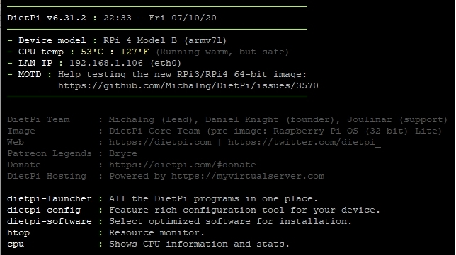

# Getting started

## Overview

Once you have done the [DietPi Installation](../install/) you can choose to install one or more [DietPi optimized software items](../software/) or run one of the [DietPi tools](../dietpi_tools/).

## Initial start

This will be the first screen displayed.

{: width="644" height="361" loading="lazy"}

## DietPi-Launcher

Run `dietpi-launcher` to see all available DietPi tools. It provides a quick way to run any of the [DietPi tools](../dietpi_tools/): From installing [**DietPi optimized software items**](../software/) to simple [configure](../dietpi_tools/#dietpi-configuration) your device, from enabling services to start to backup your installation and so on.

{: width="642" height="366" loading="lazy"}

## DietPi-Software -- Choose the software you need

The base installation of DietPi is minimal **by design**, allowing you to choose what software you want to install and use. If you are unsure what software to install, checkout the [DietPi optimised software items](../software/) page for more details.  

The list of DietPi optimised software includes:

- Desktop environments
- Remote Desktops
- Media Systems/Players
- Torrents/Downloading (Transmission)
- Cloud/Backup
- Gaming
- Social
- Hotspots
- System Stats
- Hardware Projects
- Webserver Stacks (LAMP/LEMP etc.)
- File Servers
- Home Automation
- Printing
- and [much more...](../software/).

To install and configure them use the `dietpi-software` tool - [click for more details](../dietpi_tools/#dietpi-software).

{: width="643" height="365" loading="lazy"}

## Supported SBC

See the list of [Supported Single Board Computers (SBCs)](../hardware/)
