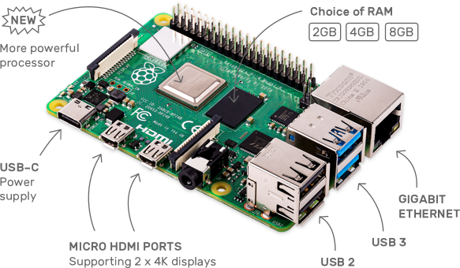

# Supported Single Board Computers (SBCs)

## Raspberry Pi
The Raspberry Pi has sold more than 31 million units since it launched in 2012. Any Raspberry Pi can serve as a secondary computer for email and web surfing. The real fun starts when you use your Pi for projects, which can range from robots to retro arcade machines to home media servers, security cameras and so on.

You can install DietPi by following the step by step [Starting guide](../user-guide_install/). 

    <table>
        <thead>
            <tr>
                <th align="left" ><strong>Product</strong></th>
                <th align="left"><strong>Description</strong></th>
            </tr>
        </thead>
        <tbody>
        <tr>
            <td align="left"><a class="table"><strong>Rasberry Pi - ALL models</strong></a></td>
            <td align="left">
                <strong>Unique DietPi image available for ALL Raspberry Pi models: Raspberry Pi 4 Model B, Raspberry Pi 3 Model A+ / B / B+, Raspberry Pi 2 Model B, Raspberry Pi 1 Model A+ / B+, Raspberry Pi Zero W</strong>: <a target="_blank" href="https://dietpi.com/downloads/images/DietPi_RPi-ARMv6-Buster.7z">Download image</a></li>
            </td>
        </tr>
        </tbody>
    </table>

DietPi runs very well on latest model **Raspberry Pi 4 Model B** (launched in 2019 / 2020)

as well as on one of the first models **Raspberry Pi 1** (launched in 2012)

and even on the compact form **Raspberry Pi Zero W**

Quick intro:

<iframe width="560" height="315" src="https://www.youtube-nocookie.com/embed/sajBySPeYH0" frameborder="0" allow="accelerometer; autoplay; encrypted-media; gyroscope" allowfullscreen></iframe>

## Odroid

ODROID single board computers are powerful, stable, and fast performing. They can function as a home theater set-top box, a general purpose computer for web browsing, gaming and socializing, a compact tool for college or office work, a prototyping device for hardware tinkering, a controller for home automation, a workstation for software development, and much more. For more details visit <a target="_blank" href="https://www.hardkernel.com">Hardkernel.com</a>

    <table>
        <thead>
            <tr>
                <th align="left"><strong>Product</strong></th>
                <th align="left"><strong>Description</strong></th>
            </tr>
        </thead>
        <tbody>
            <tr>
                <td align="left"><a class="table" target="_blank" href=""><strong>Odroid C1</strong></a></td>
                <td align="left">
                   <strong>Download</strong>: <a target="_blank" href="https://dietpi.com/downloads/images/DietPi_OdroidC1-ARMv7-Buster.7z">DietPi image</a></li>
                </td>
            </tr>
            <tr>
                <td align="left"><a class="table" target="_blank" href=""><strong>Odroid C2</strong></a></td>
                <td align="left">
                   <strong>Download</strong>: <a target="_blank" href="https://dietpi.com/downloads/images/DietPi_OdroidC2-ARMv8-Buster.7z">DietPi image</a></li>
                </td>
            </tr>
            <tr>
                <td align="left"><a class="table" target="_blank" href=""><strong>Odroid N1</strong></a></td>
                <td align="left">
                   <strong>Download</strong>: <a target="_blank" href="https://dietpi.com/downloads/images/DietPi_OdroidN1-ARMv8-Buster.7z">DietPi image</a></li>
                </td>
            </tr>
            <tr>
                <td align="left"><a class="table" target="_blank" href=""><strong>Odroid N2</strong></a></td>
                <td align="left">
                   <strong>Download</strong>: <a target="_blank" href="https://dietpi.com/downloads/images/DietPi_OdroidN2-ARMv8-Buster.7z">DietPi image</a></li>
                </td>
            </tr>
            <tr>
                <td align="left"><a class="table" target="_blank" href=""><strong>Odroid XU3 / XU4 / MC1 / HC1 / HC2</strong></a></td>
                <td align="left">
                   <strong>Download</strong>: <a target="_blank" href="https://dietpi.com/downloads/images/DietPi_OdroidXU4-ARMv7-Buster.7z">DietPi image</a></li>
                </td>
            </tr>
        </tbody>
    </table>

## PINE64

This is where PINE64 journey began. The PINE A64 is their first Single Board Computer powered by Allwinner’s A64 Quad-Core ARM Cortex A53 64-Bit SOC. For more details visit <a target="_blank" href="https://www.pine64.org">PINE64.org</a>

    <table>
        <thead>
            <tr>
                <th align="left" ><strong>Product</strong></th>
                <th align="left"><strong>Description</strong></th>
            </tr>
        </thead>
        <tbody>
            <tr>
                <td align="left"><a class="table" target="_blank" href=""><strong>PINE A64</strong></a></td>
                <td align="left">
                   <strong>Download</strong>: <a target="_blank" href="https://dietpi.com/downloads/images/DietPi_PineA64-ARMv8-Buster.7z">DietPi image</a></li>
                </td>
            </tr>
            <tr>
                <td align="left"><a class="table" target="_blank" href=""><strong>PINE H64</strong></a></td>
                <td align="left">
                   <strong>Download</strong>: <a target="_blank" href="https://dietpi.com/downloads/images/testing/DietPi_PineH64-ARMv8-Buster.7z">DietPi image</a></li>
                </td>
            </tr>
            <tr>
                <td align="left"><a class="table" target="_blank" href=""><strong>Pinebook</strong></a></td>
                <td align="left">
                   <strong>Download</strong>: <a target="_blank" href="https://dietpi.com/downloads/images/DietPi_Pinebook-ARMv8-Buster.7z">DietPi image</a></li>
                </td>
            </tr>
            <tr>
                <td align="left"><a class="table" target="_blank" href=""><strong>ROCK64</strong></a></td>
                <td align="left">
                   <strong>Download</strong>: <a target="_blank" href="https://dietpi.com/downloads/images/DietPi_Rock64-ARMv8-Buster.7z">DietPi image</a></li>
                </td>
            </tr>
            <tr>
                <td align="left"><a class="table" target="_blank" href=""><strong>ROCKPro64</strong></a></td>
                <td align="left">
                   <strong>Download</strong>: <a target="_blank" href="https://dietpi.com/downloads/images/DietPi_RockPro64-ARMv8-Buster.7z">DietPi image</a></li>
                </td>
            </tr>
        </tbody>
    </table>

## Radxa ROCK Pi

**Maker Friendly, IoT connectivity** enabled. ROCK Pi features maker friendly expansion options, including a 40-pin GPIO interface that allow for interfacing with a range inputs from buttons, switches, sensors, LEDs, and much more. It also features a Gbit LAN for network, with dedicated bus and controller, it works without latency under heavy load network applications. On board 802.11 ac wifi offers 2.4G & 5G WLAN connectivity. With Bluetooh 5.0, ROCK Pi benefits improved Bluetooth speed and greater range. For more details visit [ROCK Pi](http://rockpi.org/) website.

    <table>
        <thead>
            <tr>
                <th align="left" ><strong>Product</strong></th>
                <th align="left"><strong>Description</strong></th>
            </tr>
        </thead>
        <tbody>
            <tr>
                <td align="left"><a class="table" target="_blank" href=""><strong>ROCK Pi 4</strong></a></td>
                <td align="left">
                   <strong>Download</strong>: <a target="_blank" href="https://dietpi.com/downloads/images/DietPi_ROCKPi4-ARMv8-Buster.7z">DietPi image</a></li>
                </td>
            </tr>
            <tr>
                <td align="left"><a class="table" target="_blank" href=""><strong>ROCK Pi S</strong></a></td>
                <td align="left">
                   <strong>Download</strong>: <a target="_blank" href="https://dietpi.com/downloads/images/testing/DietPi_ROCKPiS-ARMv8-Buster.7z">DietPi image</a></li>
                </td>
            </tr>
        </tbody>
    </table>

