# Supported hardware

## Raspberry Pi

The Raspberry Pi has sold more than 31 million units since it launched in 2012. Any Raspberry Pi can serve as a secondary computer for email and web surfing. The real fun starts when you use your Pi for projects, which can range from robots to retro arcade machines to home media servers, security cameras and so on.

You can install DietPi by following the step by step [Starting guide](../install/).

DietPi runs on the full range of Raspberry Pi boards and computers. This includes the newly launched [Raspberry Pi 400](https://www.raspberrypi.org/products/raspberry-pi-400/?resellerType=home),

{: width="800" height="571" loading="lazy"}

or the most recent **Raspberry Pi 4 Model B** boards, launched in 2019, as well as in 2020.

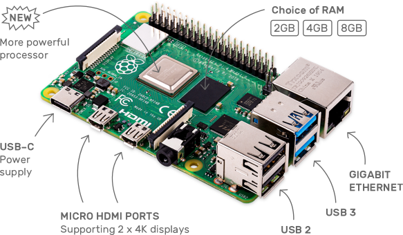{: width="500" height="292" loading="lazy"}

DietPi runs also on one of the first models **Raspberry Pi 1**, launched in 2012

{: width="500" height="242" loading="lazy"}

and even on the compact form **Raspberry Pi Zero**, both **Zero W / WH** and **Zero 2 W**

{: width="500" height="333" loading="lazy"}

<div class="md-typeset__table">
    <table>
        <thead>
            <tr>
                <th><strong>Product</strong></th>
                <th><strong>Description</strong></th>
            </tr>
        </thead>
        <tbody>
            <tr>
                <td><a class="table"><strong>Raspberry Pi - ALL models</strong><br>Single board computer (SBC)<br>Compute Module (CM)</a></td>
                <td>
                    <strong>DietPi image for ALL Raspberry Pi models</strong>: <a href="https://dietpi.com/downloads/images/DietPi_RPi-ARMv6-Bullseye.7z">Download image</a>
                    <strong>
                        <ul>
                            <li>Raspberry Pi Zero 2 W</li>
                            <li>Raspberry Pi 400</li>
                            <li>Raspberry Pi 4 Model B<br>Compute Module 4</li>
                            <li>Raspberry Pi 3 Model A+ / B / B+<br>Compute Module 3 / 3+</li>
                            <li>Raspberry Pi 2 Model B v1.1 / B v1.2</li>
                            <li>Raspberry Pi 1 Model A / A+ / B / B+<br>Compute Module 1</li>
                            <li>Raspberry Pi Zero / Zero W / Zero WH</li>
                        </ul>
                    </strong>
                </td>
            </tr>
            <tr>
                <td><a class="table"><strong>Raspberry Pi - ARMv7</strong><br>Single board computer (SBC)<br>Compute Module (CM)</a></td>
                <td>
                    <strong>DietPi image for Raspberry Pi with ARMv7 CPU or above</strong>: <a href="https://dietpi.com/downloads/images/DietPi_RPi-ARMv7-Bullseye.7z">Download image</a>
                    <strong>
                        <ul>
                            <li>Raspberry Pi Zero 2 W</li>
                            <li>Raspberry Pi 400</li>
                            <li>Raspberry Pi 4 Model B<br>Compute Module 4</li>
                            <li>Raspberry Pi 3 Model A+ / B / B+<br>Compute Module 3 / 3+</li>
                            <li>Raspberry Pi 2 Model B v1.1 / B v1.2</li>
                        </ul>
                    </strong>
                </td>
            </tr>
            <tr>
                <td><a class="table"><strong>Raspberry Pi - ARMv8</strong><br>Single board computer (SBC)<br>Compute Module (CM)</a></td>
                <td>
                    <strong>DietPi image for Raspberry Pi with ARMv8/64-bit CPU</strong>: <a href="https://dietpi.com/downloads/images/DietPi_RPi-ARMv8-Bullseye.7z">Download image</a>
                    <strong>
                        <ul>
                            <li>Raspberry Pi Zero 2 W</li>
                            <li>Raspberry Pi 400</li>
                            <li>Raspberry Pi 4 Model B<br>Compute Module 4</li>
                            <li>Raspberry Pi 3 Model A+ / B / B+<br>Compute Module 3 / 3+</li>
                            <li>Raspberry Pi 2 Model B v1.2</li>
                        </ul>
                    </strong>
                </td>
            </tr>
        </tbody>
    </table>
</div>

## Odroid

ODROID single board computers are powerful, stable, and fast performing. They can function as a home theater set-top box, a general purpose computer for web browsing, gaming and socializing, a compact tool for college or office work, a prototyping device for hardware tinkering, a controller for home automation, a workstation for software development, and much more. For more details visit <a target="_blank" rel="noopener" href="https://www.hardkernel.com/">Hardkernel.com</a>

ODROID-N2 is one of the supported boards.

{: width="500" height="353" loading="lazy"}

It is a new generation single-board computer based on the Amlogic S922X SoC and the [fastest](https://dietpi.com/survey/#benchmark) we measured until time of writing. The main CPU of the N2 consists of a big.LITTLE quad-core Cortex-A73 + dual-core Cortex-A53 combination. Thanks to the modern 12nm silicon technology, the A73 cores run at up to 1.8 GHz (N2) respectively 2.4 GHz (N2+) without thermal throttling using the stock metal-housing heat sink allowing a robust and quiet computer.

<div class="md-typeset__table">
    <table>
        <thead>
            <tr>
                <th><strong>Product</strong></th>
                <th><strong>Description</strong></th>
            </tr>
        </thead>
        <tbody>
            <tr>
                <td><a class="table" href=""><strong>Odroid C1</strong></a></td>
                <td>
                   <strong>Download</strong>: <a href="https://dietpi.com/downloads/images/DietPi_OdroidC1-ARMv7-Bullseye.7z">DietPi image</a>
                </td>
            </tr>
            <tr>
                <td><a class="table" href=""><strong>Odroid C2</strong></a></td>
                <td>
                   <strong>Download</strong>: <a href="https://dietpi.com/downloads/images/DietPi_OdroidC2-ARMv8-Bullseye.7z">DietPi image</a>
                </td>
            </tr>
            <tr>
                <td><a class="table" href=""><strong>Odroid C4 / HC4</strong></a></td>
                <td>
                   <strong>Download</strong>: <a href="https://dietpi.com/downloads/images/DietPi_OdroidC4-ARMv8-Bullseye.7z">DietPi image</a>
                </td>
            </tr>
            <tr>
                <td><a class="table" href=""><strong>Odroid N2</strong></a></td>
                <td>
                   <strong>Download</strong>: <a href="https://dietpi.com/downloads/images/DietPi_OdroidN2-ARMv8-Bullseye.7z">DietPi image</a>
                </td>
            </tr>
            <tr>
                <td><a class="table" href=""><strong>Odroid XU3 / XU4 / MC1 / HC1 / HC2</strong></a></td>
                <td>
                   <strong>Download</strong>: <a href="https://dietpi.com/downloads/images/DietPi_OdroidXU4-ARMv7-Bullseye.7z">DietPi image</a>
                </td>
            </tr>
        </tbody>
    </table>
</div>

## PINE64

This is where PINE64 journey began. The PINE A64 is their first Single Board Computer powered by Allwinner's A64 Quad-Core ARM Cortex A53 64-Bit SOC. For more details visit <a target="_blank" rel="noopener" href="https://www.pine64.org/">PINE64.org</a>

The ROCKPro64 is the most powerful single board computer offered by PINE64.

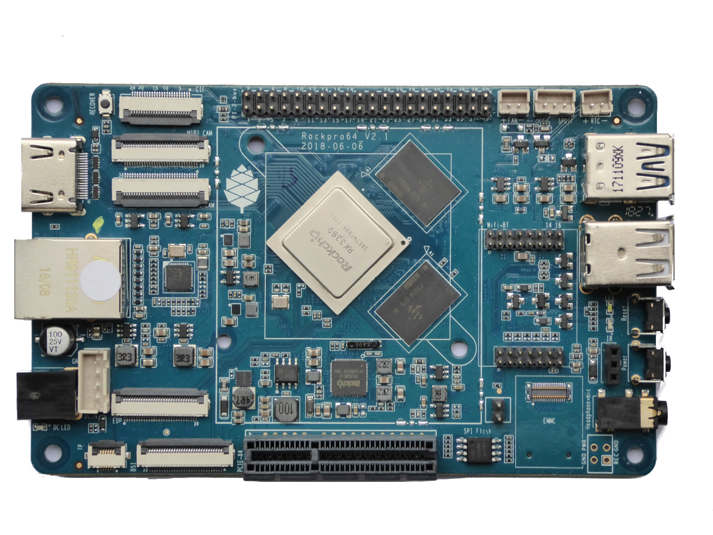{: width="500" height="375" loading="lazy"}

It features a Rockchip RK3399 hexa-core SOC and up-to 4 GiB of dual-channel LPDDR4 system memory. Moreover, the board comes packed with features, including: an USB 3.0 and USB type C with DP1.2 port, a full PCIe x4 as well as eMMC module socket. You also get a 40pin header with I2C, SPI, UART and GPIO.

The board is backwards compatible with many of the existing PINE64 peripherals, including the WiFi/Bluetooth module, camera module and LCD panel but an array of new peripherals specific for the board is also available. All this in the exact same model “A” dimension as the original PINE A64.

The ROCKPro64 4 GiB board is designated as LTS (Long-term support) which means that PINE64 is committed to provide support for at least 5 years – until year 2023 and beyond.

The PINE64 family also contains the newer members Quartz64 and SOQuartz compute module.

<div class="md-typeset__table">
    <table>
        <thead>
            <tr>
                <th><strong>Product</strong></th>
                <th><strong>Description</strong></th>
            </tr>
        </thead>
        <tbody>
            <tr>
                <td><a class="table" href=""><strong>PINE A64</strong></a></td>
                <td>
                   <strong>Download</strong>: <a href="https://dietpi.com/downloads/images/DietPi_PINEA64-ARMv8-Bullseye.7z">DietPi image</a>
                </td>
            </tr>
            <tr>
                <td><a class="table" href=""><strong>PINE H64</strong></a></td>
                <td>
                   <strong>Download</strong>: <a href="https://dietpi.com/downloads/images/DietPi_PINEH64-ARMv8-Bullseye.7z">DietPi image</a>
                </td>
            </tr>
            <tr>
                <td><a class="table" href=""><strong>Pinebook</strong></a></td>
                <td>
                   <strong>Download</strong>: <a href="https://dietpi.com/downloads/images/DietPi_Pinebook-ARMv8-Bullseye.7z">DietPi image</a>
                </td>
            </tr>
            <tr>
                <td><a class="table" href=""><strong>Pinebook Pro</strong></a></td>
                <td>
                   <strong>Download</strong>: <a href="https://dietpi.com/downloads/images/DietPi_PinebookPro-ARMv8-Bullseye.7z">DietPi image</a>
                </td>
            </tr>
            <tr>
                <td><a class="table" href=""><strong>ROCK64</strong></a></td>
                <td>
                   <strong>Download</strong>: <a href="https://dietpi.com/downloads/images/DietPi_ROCK64-ARMv8-Bullseye.7z">DietPi image</a>
                </td>
            </tr>
            <tr>
                <td><a class="table" href=""><strong>ROCKPro64</strong></a></td>
                <td>
                   <strong>Download</strong>: <a href="https://dietpi.com/downloads/images/DietPi_ROCKPro64-ARMv8-Bullseye.7z">DietPi image</a>
                </td>
            </tr>
            <tr>
                <td><a class="table" href=""><strong>Quartz64 Model A </strong></a></td>
                <td>
                   <strong>Download</strong>: <a href="https://dietpi.com/downloads/images/DietPi_Quartz64A-ARMv8-Bullseye.7z">DietPi image</a>
                </td>
            </tr>
            <tr>
                <td><a class="table" href=""><strong>Quartz64 Model B</strong></a></td>
                <td>
                   <strong>Download</strong>: <a href="https://dietpi.com/downloads/images/DietPi_Quartz64B-ARMv8-Bullseye.7z">DietPi image</a>
                </td>
            </tr>
            <tr>
                <td><a class="table" href=""><strong>SOQuartz Compute Module</strong></a></td>
                <td>
                   <strong>Download</strong>: <a href="https://dietpi.com/downloads/images/DietPi_SOQuartz-ARMv8-Bullseye.7z">DietPi image</a>
                </td>
            </tr>
        </tbody>
    </table>
</div>

## Radxa

**Maker Friendly, IoT connectivity** enabled.

**Radxa ROCK Pi and Radxa Zero** features maker friendly expansion options, including a 40-pin GPIO interface that allow for interfacing with a range inputs from buttons, switches, sensors, LEDs, and much more.
For more details visit the [**Radxa ROCK Pi**](https://rockpi.org/) resp. the [**Radxa Wiki**](https://wiki.radxa.com/Home) website.

One of the supported boards is ROCK Pi 4.

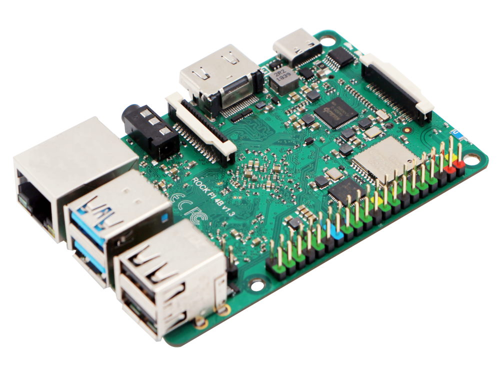{: width="500" height="375" loading="lazy"}

**ROCK Pi 4** is a Single Board Computer (SBC) in an ultra-small form factor that offers class-leading performance while leveraging outstanding mechanical compatibility. The ROCK Pi 4 offers makers, IoT enthusiasts, hobbyists, PC DIY enthusiasts and others a reliable and extremely capable platform for building and tinkering their ideas into reality.
It also features a Gbit LAN for network, with dedicated bus and controller, it works without latency under heavy load network applications.

**Radxa Zero** is an ultra thin SBC in small form factor with powerful performance based on Amlogic S905Y2. Radxa Zero features a Quad Core 64 ARM processor, 32bit LPDDR4, up to 4K@60 HDMI, 802.11 ac WIFI, Bluetooth 5.0, USB 3.0, 40-pin GPIO header. Radxa Zero supports USB 2.0 and power via one USB-C port.

{: width="500" loading="lazy"}

<div class="md-typeset__table">
    <table>
        <thead>
            <tr>
                <th><strong>Product</strong></th>
                <th><strong>Description</strong></th>
            </tr>
        </thead>
        <tbody>
            <tr>
                <td><a class="table" href=""><strong>ROCK Pi 4</strong></a></td>
                <td>
                   <strong>Download</strong>: <a href="https://dietpi.com/downloads/images/DietPi_ROCKPi4-ARMv8-Bullseye.7z">DietPi image</a>
                </td>
            </tr>
            <tr>
                <td><a class="table" href=""><strong>ROCK Pi S</strong></a></td>
                <td>
                   <strong>Download</strong>: <a href="https://dietpi.com/downloads/images/DietPi_ROCKPiS-ARMv8-Bullseye.7z">DietPi image</a>
                </td>
            </tr>
            <tr>
                <td><a class="table" href=""><strong>Radxa Zero</strong></a></td>
                <td>
                   <strong>Download</strong>: <a href="https://dietpi.com/downloads/images/DietPi_RadxaZero-ARMv8-Bullseye.7z">DietPi image</a>
                </td>
            </tr>
            <tr>
                <td><a class="table" href=""><strong>ROCK 3A</strong></a></td>
                <td>
                   <strong>Download</strong>: <a href="https://dietpi.com/downloads/images/DietPi_ROCK3A-ARMv8-Bullseye.7z">DietPi image</a>
                </td>
            </tr>
            <tr>
                <td><a class="table" href=""><strong>ROCK 5B</strong></a></td>
                <td>
                   <strong>Download</strong>: <a href="https://dietpi.com/downloads/images/DietPi_ROCK5B-ARMv8-Bullseye.7z">DietPi image</a>
                </td>
            </tr>
        </tbody>
    </table>
</div>

## Allo Sparky SBC

Sparky Single Board Computer (SBC) is a credit card-sized board that can be used as a standalone computer, in electronics projects, games, and also in many other applications. A true open hardware, community-supported embedded computer for developers and hobbyists. The Sparky SBC has all the functionality of a basic computer. For more details visit the [**Allo Sparky SBC**](https://www.allo.com/sparky/sparky-sbc.html) website.

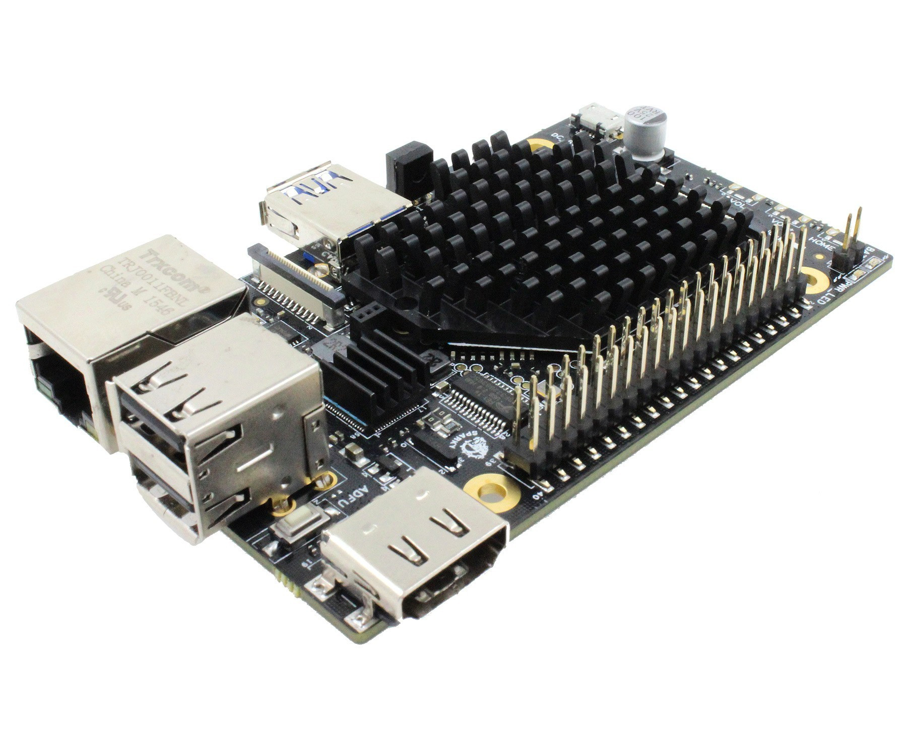{: width="500" height="412" loading="lazy"}

<div class="md-typeset__table">
    <table>
        <thead>
            <tr>
                <th><strong>Product</strong></th>
                <th><strong>Description</strong></th>
            </tr>
        </thead>
        <tbody>
            <tr>
                <td><a class="table" href=""><strong>Sparky SBC</strong></a></td>
                <td>
                   <strong>Download</strong>: <a href="https://dietpi.com/downloads/images/DietPi_SparkySBC-ARMv7-Bullseye.7z">DietPi image</a>
                </td>
            </tr>
        </tbody>
    </table>
</div>

## ASUS Tinker Board

Tinker Board is a Single Board Computer (SBC) in an ultra-small form factor that offers class-leading performance while leveraging outstanding mechanical compatibility. The Tinker Board offers makers, IoT enthusiasts, hobbyists, PC DIY enthusiasts and others a reliable and extremely capable platform for building and tinkering their ideas into reality. For more details visit the [**ASUS Tinker Board**](https://tinker-board.asus.com/index.html) website.

Tinker Board features standard maker connectivity options, including a 40-pin GPIO interface that allow for interfacing with a range inputs from buttons, switches, sensors, LEDs, and much more.

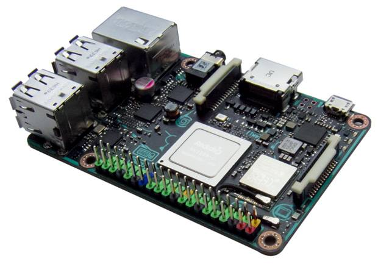{: width="500" height="353" loading="lazy"}

Tinker Board is equipped with one DSI MIPI connection for displays and touchscreens. The secondary CSI MIPI connection is for connection to compatible cameras allowing for computer vision, and much more.

Careful consideration went into the design and development of the Tinker Board to ensure that it provides a superior user experience for first-time builders or for seasoned hobbyists. Builders appreciate the color-coded GPIO header, which makes it easy to recognize respective pin headers.

<div class="md-typeset__table">
    <table>
        <thead>
            <tr>
                <th><strong>Product</strong></th>
                <th><strong>Description</strong></th>
            </tr>
        </thead>
        <tbody>
            <tr>
                <td><a class="table" href=""><strong>ASUS Tinker Board</strong></a></td>
                <td>
                   <strong>Download</strong>: <a href="https://dietpi.com/downloads/images/DietPi_ASUSTB-ARMv7-Bullseye.7z">DietPi image</a>
                </td>
            </tr>
        </tbody>
    </table>
</div>

## NanoPi Series (FriendlyELEC)

**FriendlyELEC's next generation SBC** - One of the fastest ARM SBC (RK3399) on the market today, with 2 x 1.8 GHz A72 cores and 4 x 1.4 GHz A53 cores. One of the smallest RK3399 SBCs available, a great addition to your SBC lineup that provides next gen SBC performance.

For more details visit the [**FriendlyELEC**](https://www.friendlyelec.com/) website.

{: width="500" height="350" loading="lazy"}

**NanoPi K2** supports DVFS and it can smooth play high-definition video streams, and it is very well suited for applications such as advertisement machines, TV boxes, home entertainment appliances or multimedia devices.

<div class="md-typeset__table">
    <table>
        <thead>
            <tr>
                <th><strong>Product</strong></th>
                <th><strong>Description</strong></th>
            </tr>
        </thead>
        <tbody>
            <tr>
                <td><a class="table" href=""><strong>NanoPi NEO</strong></a></td>
                <td>
                   <strong>Download</strong>: <a href="https://dietpi.com/downloads/images/DietPi_NanoPiNEO-ARMv7-Bullseye.7z">DietPi image</a>
                </td>
            </tr>
            <tr>
                <td><a class="table" href=""><strong>NanoPi NEO Plus2</strong></a></td>
                <td>
                   <strong>Download</strong>: <a href="https://dietpi.com/downloads/images/DietPi_NanoPiNEOPlus2-ARMv8-Bullseye.7z">DietPi image</a>
                </td>
            </tr>
            <tr>
                <td><a class="table" href=""><strong>NanoPi NEO2</strong></a></td>
                <td>
                   <strong>Download</strong>: <a href="https://dietpi.com/downloads/images/DietPi_NanoPiNEO2-ARMv8-Bullseye.7z">DietPi image</a>
                </td>
            </tr>
            <tr>
                <td><a class="table" href=""><strong>NanoPi NEO2 Black</strong></a></td>
                <td>
                   <strong>Download</strong>: <a href="https://dietpi.com/downloads/images/DietPi_NanoPiNEO2Black-ARMv8-Bullseye.7z">DietPi image</a>
                </td>
            </tr>
            <tr>
                <td><a class="table" href=""><strong>NanoPi NEO3</strong></a></td>
                <td>
                   <strong>Download</strong>: <a href="https://dietpi.com/downloads/images/DietPi_NanoPiNEO3-ARMv8-Bullseye.7z">DietPi image</a>
                </td>
            </tr>
            <tr>
                <td><a class="table" href=""><strong>NanoPi NEO4</strong></a></td>
                <td>
                   <strong>Download</strong>: <a href="https://dietpi.com/downloads/images/DietPi_NanoPiNEO4-ARMv8-Bullseye.7z">DietPi image</a>
                </td>
            </tr>
            <tr>
                <td><a class="table" href=""><strong>NanoPi K1 Plus</strong></a></td>
                <td>
                   <strong>Download</strong>: <a href="https://dietpi.com/downloads/images/DietPi_NanoPiK1Plus-ARMv8-Bullseye.7z">DietPi image</a>
                </td>
            </tr>
            <tr>
                <td><a class="table" href=""><strong>NanoPi K2</strong></a></td>
                <td>
                   <strong>Download</strong>: <a href="https://dietpi.com/downloads/images/DietPi_NanoPiK2-ARMv8-Bullseye.7z">DietPi image</a>
                </td>
            </tr>
            <tr>
                <td><a class="table" href=""><strong>NanoPi M1 Plus</strong></a></td>
                <td>
                   <strong>Download</strong>: <a href="https://dietpi.com/downloads/images/DietPi_NanoPiM1Plus-ARMv7-Bullseye.7z">DietPi image</a>
                </td>
            </tr>
            <tr>
                <td><a class="table" href=""><strong>NanoPi M1/T1</strong></a></td>
                <td>
                   <strong>Download</strong>: <a href="https://dietpi.com/downloads/images/DietPi_NanoPiM1-ARMv7-Bullseye.7z">DietPi image</a>
                </td>
            </tr>
            <tr>
                <td><a class="table" href=""><strong>NanoPi M2/T2</strong></a></td>
                <td>
                   <strong>Download</strong>: <a href="https://dietpi.com/downloads/images/DietPi_NanoPiM2-ARMv7-Bullseye.7z">DietPi image</a>
                </td>
            </tr>
            <tr>
                <td><a class="table" href=""><strong>NanoPi M3/T3</strong></a></td>
                <td>
                   <strong>Download</strong>: <a href="https://dietpi.com/downloads/images/DietPi_NanoPiM3-ARMv8-Bullseye.7z">DietPi image</a>
                </td>
            </tr>
            <tr>
                <td><a class="table" href=""><strong>NanoPi M4V2</strong></a></td>
                <td>
                   <strong>Download</strong>: <a href="https://dietpi.com/downloads/images/DietPi_NanoPiM4V2-ARMv8-Bullseye.7z">DietPi image</a>
                </td>
            </tr>
            <tr>
                <td><a class="table" href=""><strong>NanoPC T4</strong></a></td>
                <td>
                   <strong>Download</strong>: <a href="https://dietpi.com/downloads/images/DietPi_NanoPCT4-ARMv8-Bullseye.7z">DietPi image</a>
                </td>
            </tr>
            <tr>
                <td><a class="table" href=""><strong>NanoPi M4</strong></a></td>
                <td>
                   <strong>Download</strong>: <a href="https://dietpi.com/downloads/images/DietPi_NanoPiM4-ARMv8-Bullseye.7z">DietPi image</a>
                </td>
            </tr>
            <tr>
                <td><a class="table" href=""><strong>NanoPi Fire3</strong></a></td>
                <td>
                   <strong>Download</strong>: <a href="https://dietpi.com/downloads/images/DietPi_NanoPiFire3-ARMv8-Bullseye.7z">DietPi image</a>
                </td>
            </tr>
            <tr>
                <td><a class="table" href=""><strong>NanoPi R1</strong></a></td>
                <td>
                   <strong>Download</strong>: <a href="https://dietpi.com/downloads/images/DietPi_NanoPiR1-ARMv7-Bullseye.7z">DietPi image</a>
                </td>
            </tr>
            <tr>
                <td><a class="table" href=""><strong>NanoPi R2S</strong></a></td>
                <td>
                   <strong>Download</strong>: <a href="https://dietpi.com/downloads/images/DietPi_NanoPiR2S-ARMv8-Bullseye.7z">DietPi image</a>
                </td>
            </tr>
            <tr>
                <td><a class="table" href=""><strong>NanoPi R4S</strong></a></td>
                <td>
                   <strong>Download</strong>: <a href="https://dietpi.com/downloads/images/DietPi_NanoPiR4S-ARMv8-Bullseye.7z">DietPi image</a>
                </td>
            </tr>
            <tr>
                <td><a class="table" href=""><strong>NanoPi R5S</strong></a></td>
                <td>
                   <strong>Download</strong>: <a href="https://dietpi.com/downloads/images/DietPi_NanoPiR5S-ARMv8-Bullseye.7z">DietPi image</a>
                </td>
            </tr>
            <tr>
                <td><a class="table" href=""><strong>NanoPi R6S</strong></a></td>
                <td>
                   <strong>Download</strong>: <a href="https://dietpi.com/downloads/images/DietPi_NanoPiR6S-ARMv8-Bullseye.7z">DietPi image</a>
                </td>
            </tr>
            <tr>
                <td><a class="table" href=""><strong>ZeroPi</strong></a></td>
                <td>
                   <strong>Download</strong>: <a href="https://dietpi.com/downloads/images/DietPi_ZeroPi-ARMv7-Bullseye.7z">DietPi image</a>
                </td>
            </tr>
        </tbody>
    </table>
</div>

## Native PC & Virtual Machines

### Native PC images

The Native PC images are great for those occasions where SBC performance just isn't enough. Run one of these on any x86_64 PC/server and still get the same great DietPi features and experience. This image is for motherboards with UEFI boot support and onboard eMMC (e.g.: Z83-II, Beelink AP32 and other Intel NUC/SBC devices with onboard eMMC).

### VMware

{: width="200" height="45" loading="lazy"}

The VMware virtual machine (e.g. [VMware Workstation Player](https://www.vmware.com/products/workstation-player.html/), [VMware Workstation Pro](https://www.vmware.com/content/vmware/vmware-published-sites/us/products/workstation-pro.html/), [VMware Fusion](https://www.vmware.com/products/fusion.html/)) is great for those occasions where SBC performance just isn't enough. Run one of these on any x86_64 PC/server (Windows, Linux, macOS) and still get the same great DietPi features and experience.

The [VMware ESXi Hypervisor](https://www.vmware.com/products/esxi-and-esx.html/), described as a "Bare Metal Hypervisor" aka [Type-1 hypervisor](https://en.wikipedia.org/wiki/Hypervisor), is part of e.g. the [VMware vSphere Hypervisor platform](https://www.vmware.com/products/vsphere-hypervisor.html/) ("appliance server"). It allows to run and manage multiple virtual machines on one x86_64 machine. That way it can be compared to the [Proxmox](#proxmox) appliance server.

### VirtualBox

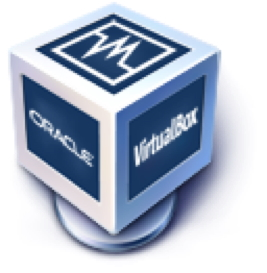{: width="100" height="103" loading="lazy"}

VirtualBox is a general-purpose full virtualiser for x86 hardware, targeted at server, desktop and embedded use.

The VirtualBox virtual machine is great for those occasions where SBC performance just isn't enough. Run one of these on any x86_64 PC/server and still get the same great DietPi features and experience.

### Proxmox

{: width="400" height="65" loading="lazy"}

[Proxmox](https://www.proxmox.com/) is a virtual machine and container platform, based on [QEMU](https://www.qemu.org/) and [KVM](https://www.linux-kvm.org/). It allows to run and manage multiple virtual machines and containers on a Linux OS via CLI and web interface, similar to how VMware's vSphere and ESXi works.

### Parallels

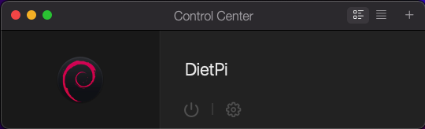{: width="270" height="82" loading="lazy"}

The [Parallels Desktop virtual machine](https://www.parallels.com/products/desktop/) is great for those occasions where SBC performance just isn't enough. Run one of these e.g. on any x86_64 macOS system (e.g. Mac mini 2011/2012/2014/2018) and still get the same great DietPi features and experience.

### UTM

{: width="80" height="80" loading="lazy"}

The [UTM virtual machine](https://mac.getutm.app/) is great for those occasions where SBC performance just isn't enough. Run one of these on any macOS system (e.g. Mac mini 2011/2012/2014/2018 and M1 Apple Silicon) and still get the same great DietPi features and experience.

{: width="270" height="221" loading="lazy"}

!!! info "Emulation feature of UTM"
    The emulation feature is an option of the virtualization technique to run x86 code on a M1 Mac system and vice versa an M1 Mac code on a x86 Mac system.  
    This might be a good choice e.g. for testing purposes, but typically there will be a performance drawback using the emulation instead of running native x86 images on a x86 system resp. native `aarch64` images on an M1 system.

### Hyper-V

The Hyper-V virtual machine is great for those occasions where SBC performance just isn't enough. Run one of these on any x86_64 PC/server and still get the same great DietPi features and experience.

<div class="md-typeset__table">
    <table>
        <thead>
            <tr>
                <th><strong>Product</strong></th>
                <th><strong>Description</strong></th>
            </tr>
        </thead>
        <tbody>
            <tr>
                <td><a class="table" href=""><strong>Native PC for BIOS/CSM</strong></a></td>
                <td>
                   <strong>Download</strong>: <a href="https://dietpi.com/downloads/images/DietPi_NativePC-BIOS-x86_64-Bullseye.7z">DietPi image</a>
                   <br><strong>Download</strong>: <a href="https://dietpi.com/downloads/images/DietPi_NativePC-BIOS-x86_64-Bullseye_Installer.7z">DietPi installer image</a>
                </td>
            </tr>
            <tr>
                <td><a class="table" href=""><strong>Native PC for UEFI</strong></a></td>
                <td>
                   <strong>Download</strong>: <a href="https://dietpi.com/downloads/images/DietPi_NativePC-UEFI-x86_64-Bullseye_Installer.7z">DietPi installer image</a>
                </td>
            </tr>
            <tr>
                <td><a class="table" href=""><strong>VMware Player / Fusion</strong></a></td>
                <td>
                   <strong>Download</strong>: <a href="https://dietpi.com/downloads/images/DietPi_VMware-x86_64-Bullseye.7z">DietPi VMX appliance</a>
                </td>
            </tr>
            <tr>
                <td><a class="table" href=""><strong>VMware ESXi Hypervisor</strong></a></td>
                <td>
                   <strong>Download</strong>: <a href="https://dietpi.com/downloads/images/DietPi_ESXi-x86_64-Bullseye.7z">DietPi OVA appliance</a>
                </td>
            </tr>
            <tr>
                <td><a class="table" href=""><strong>VirtualBox</strong></a></td>
                <td>
                   <strong>Download</strong>: <a href="https://dietpi.com/downloads/images/DietPi_VirtualBox-x86_64-Bullseye.7z">DietPi OVA appliance</a>
                </td>
            </tr>
            <tr>
                <td><a class="table" href=""><strong>Proxmox</strong></a></td>
                <td>
                   <strong>Download</strong>: <a href="https://dietpi.com/downloads/images/DietPi_Proxmox-x86_64-Bullseye.7z">DietPi QCOW2 image</a>
                </td>
            </tr>
            <tr>
                <td><a class="table" href=""><strong>Parallels</strong></a></td>
                <td>
                   <strong>Download</strong>: <a href="https://dietpi.com/downloads/images/DietPi_Parallels-x86_64-Bullseye.7z">DietPi PVM appliance</a>
                </td>
            </tr>
            <tr>
                <td><a class="table" href=""><strong>UTM</strong></a></td>
                <td>
                   <strong>Download</strong>: <a href="https://dietpi.com/downloads/images/DietPi_UTM-x86_64-Bullseye.7z">DietPi UTM appliance</a>
                </td>
            </tr>
            <tr>
                <td><a class="table" href=""><strong>Hyper-V</strong></a></td>
                <td>
                   <strong>Download</strong>: <a href="https://dietpi.com/downloads/images/DietPi_Hyper-V-x86_64-Bullseye.7z">DietPi VHDX image</a>
                </td>
            </tr>
        </tbody>
    </table>
</div>

## Make your own distribution

Unable to find an available image for your device?  
Don't worry, DietPi contains a script which can be used to turn an installed Debian-based OS into DietPi.

!!! attention "Advanced Linux knowledge required"
    To generate your own SBC support, an advanced Linux knowledge is required.  
    There is no guarantee that this will work for every system. Use the DietPi image generation script at your own risk!

!!! info "Limited end user support"
    End user support will be limited to issues that are DietPi specific (which excludes Kernel, GPU, onboard Bluetooth, WiFi, Audio, etc. from our support). GPU features are disabled for other devices (e.g.: Kodi, Desktop), ideal for server usage.  
    Generally in case of troubles it may be necessary that you search the root cause of problems by your own due to non existent SBCs at the DietPi team.

!!! tip "Use an extra SD card to test the DietPi image generation"
    It may be a good idea not to use your "productive and working SD card" to execute the DietPi image generation script.  
    You should use an own SD card and may copy it before via the `dd` command to a SD card for your tests.

### Basic information

The image generation is based on a shell script [`dietpi-installer`](https://github.com/MichaIng/DietPi/blob/master/.build/images/dietpi-installer):

- **The script will** convert any 'bloated' Debian/Raspbian installation into a lightweight DietPi system.  
- **The script will NOT** support converting existing installed software (e.g. Nextcloud, Plex Media Server) over to the DietPi system.
- **All existing software (APT) and user data will be deleted.**

The script has to be executed on the running target system which you want to convert to a lightweight DietPi system, or when booting the original image as a container.

### Prerequisites

**Requirement 1:** Ensure a Debian/Raspbian OS is running on the system:

- For best results, we recommend a fresh/clean minimal Debian/Raspbian installation.
- Native PC users: Please install Debian stable before hand: <https://www.debian.org/distrib/netinst>
- Desktop images should work, however, the minimal the image, the quicker the installation, as less packages will need to be removed.  
  Remark: We do not support Ubuntu, or have any plans to do so.

**Requirement 2:** Packages which have to be installed in advance:

- Needed packages should already exist on most systems, however pure minimal images may require the following installations:

    ```sh
    apt update
    apt install -y curl ca-certificates systemd-sysv
    ```

### Script execution

!!! important "Needed: Run script within SSH command or local term"
    Do not run the script within any desktop environment, because the desktop is uninstalled during the script execution.  
    That will "pull the ground from under your feet".

!!! important "Needed: Root rights"
    Ensure you have elevated privileges (e.g.: login as `root`, or use `sudo`).

Execute the following shell command to download and execute the script:

```sh
bash -c "$(curl -sSfL 'https://raw.githubusercontent.com/MichaIng/DietPi/master/.build/images/dietpi-installer')"
```

In the following dialog you have to select the DietPi installer branch. Generally use `master` as long as you do not want to create a development image:

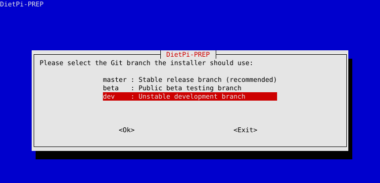{: width="550" height="266" loading="lazy"}

In the following dialogues enter your name and afterwards the actual image base and the device (SBC or PC) the system is running on:

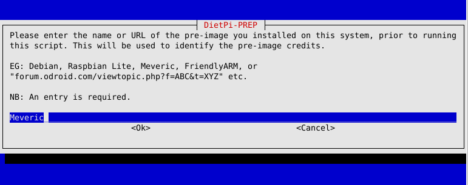{: width="550" height="218" loading="lazy"}

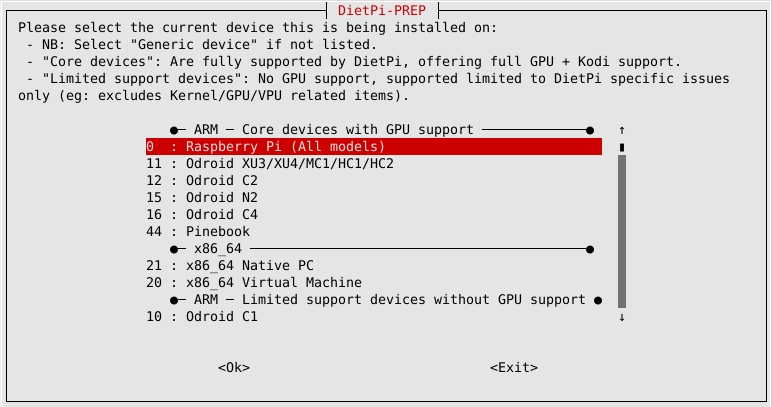{: width="550" height="290" loading="lazy"}

Depending on whether you want to use the WiFi feature later on, you have to select the option to keep or purge the WiFi package. To keep the package could be the case if your hardware has an onboard WiFi or you add the WiFi e.g. via an USB WiFi adapter.

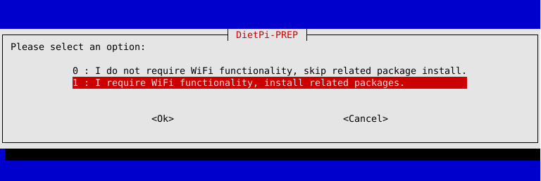{: width="550" height="184" loading="lazy"}

The last selection is the target Debian version (the old **Buster**, current stable **Bullseye**, or next testing **Bookworm**).  
After this, the script runs a couple of minutes, finally the following message occurs:

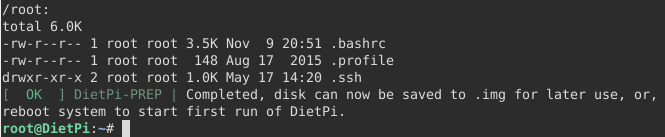{: width="550" height="113" loading="lazy"}

After this you can restart your system (`reboot`), alternatively you can copy the SC card (via `dd`) to an image (`.img`) to duplicate your base installation.

A further step can be to generate a compressed DietPi image via the [`dietpi-imager`](https://github.com/MichaIng/DietPi/blob/master/.build/images/dietpi-imager) script:

```sh
bash -c "$(curl -sSfL 'https://raw.githubusercontent.com/MichaIng/DietPi/master/.build/images/dietpi-imager')"
```
