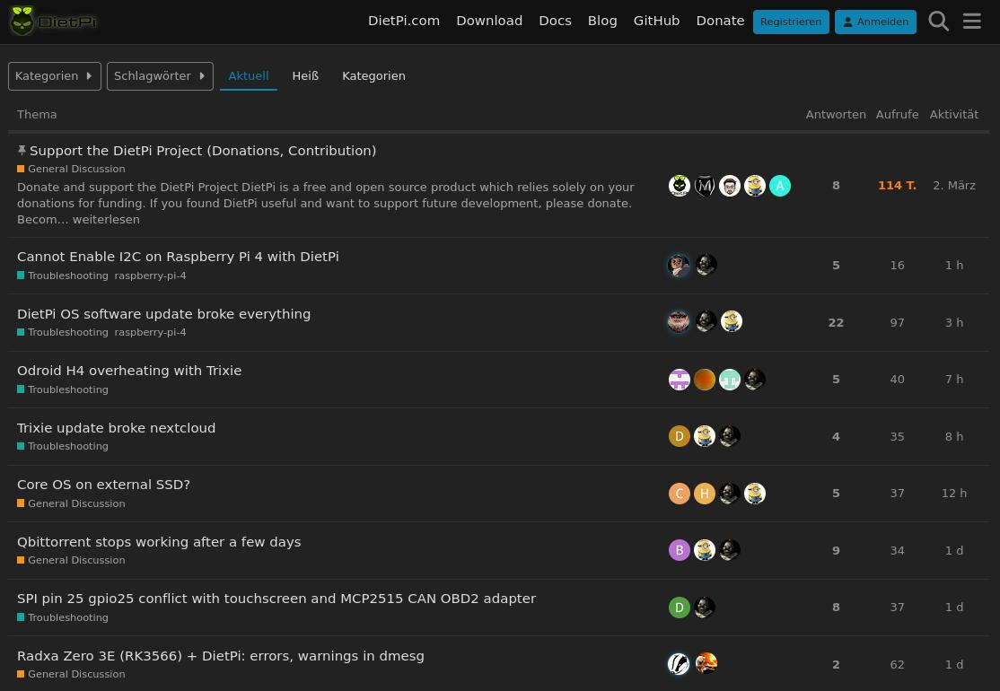

[{: width="180" height="180" loading="lazy"}](https://dietpi.com/)

#### DietPi | Minimal image at its core

#### Optimised | Simplified | For everyone

# Welcome to the DietPi Documentation

## What is DietPi?

DietPi is a **highly optimised & minimal Debian-based Linux distribution**. DietPi is extremely lightweight at its core, and also extremely easy to install and use.

Setting up a single board computer (SBC) or even a computer, for both regular or server use, takes time and skill. DietPi provides an **easy way to install and run favourite software you choose**.

!!! quote
    "Just wanted to say thank you for DietPi. As someone who's intermediate at best with Linux and SBCs in general, its made everything so much more accessible. I don't have that much time to tinker and I need things to generally work out of the box with little fuss. DietPi has made it possible for me to be running Nextcloud, Pi-hole, NZBGet and more on a Raspberry Pi 4 with minimal effort. Sure Docker could do the same but there is something about running things natively that I like.

    Automation features like DietPi-Backup and Drive Manager are just the icing on the cake to a great ecosystem.

    Thank you for DietPi."
    Reds, DietPi Forum

## Getting started

If you are **new to DietPi**, the [_Install_](install/) provides a tutorial for everything you need to get DietPi running.

If you **need help**, and have read through [_Getting Started_](getting_started/), check out [_Troubleshooting_](https://dietpi.com/forum/c/troubleshooting/10).

For more details visit the [_DietPi Community Forum_](https://dietpi.com/forum/).

## Easy to install popular software

You can **quickly and easily install popular software** ! All of them are **READY TO RUN** and optimised for your system. The list of available apps is long , and for the full list checkout [_DietPi Optimised Software_](software/) page. Here are few highlights:

- Desktops (MATE/Xfce)
- Remote Desktop (VNC/NoMachine)
- Media Systems/Players (Kodi/Plex/Murmur)
- Torrents/Downloading (Transmission/Sonarr/Radarr)
- Cloud/Backup (Nextcloud/Syncthing)
- Gaming (Amiberry/MineOS)
- Social, Surveillance, Hotspots, System Stats, Hardware Projects, Stacks (LAMP/LEMP), Pi-hole, VPN, File Servers, Home Automation and Printing
and [much more...](software/)

DietPi does everything for you, giving you more time to enjoy the software you need.

## What is supported?

Check [_Supported SBCs_](hardware/) page for recently supported list.

**_Note:_** “Supported” is not a guarantee. “Supported” implies a particular SBC is at a high level of software maturity, but has no intention to support all possible SBC functions.

## Community

Have some feedback, questions, suggestions, or just fancy a chat? Visit our [community](https://dietpi.com/forum/)!

{: width="1024" height="530" loading="lazy"}

## Collaborate on the project

**How ?**

1. Fork the project [https://github.com/MichaIng/DietPi](https://github.com/MichaIng/DietPi/blob/dev/CONTRIBUTING.md) or the documentation [https://github.com/MichaIng/DietPi-Docs](https://github.com/MichaIng/DietPi-Docs).
2. Make one or more well commented and clean commits to the repository.
3. Perform a pull request in GitHub’s web interface.
4. If it is a new feature request, don’t start the coding first. Remember to open a GitHub [issue](https://github.com/MichaIng/DietPi/issues) to discuss the new enhancement.

## If you find our project useful

We would really appreciate it if you would consider contributing to the project however you can.

Donating is the easiest way to help us via [PayPal](https://www.paypal.com/cgi-bin/webscr?cmd=_s-xclick&hosted_button_id=6DVBECXRW3TAA) or become a [Patron](https://www.patreon.com/bePatron?u=12464530).

Thank you !
