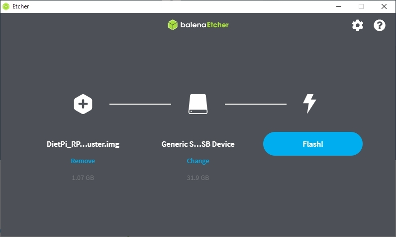
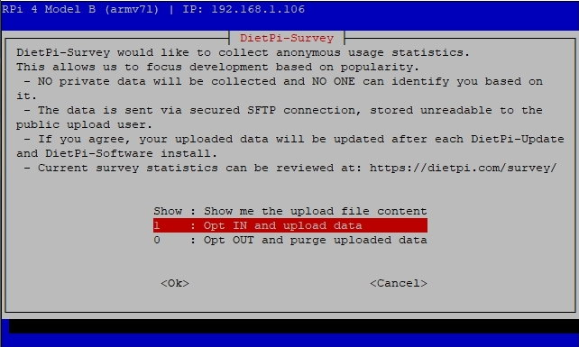

# How to install DietPi

The installation of DietPi consists of few steps:

- Provide an installation media (e.g. SD card for single board computer or USB stick for PC)
- Get the DietPi image (and put it on the installation media)
- Boot up the DietPi device and go through one time installation steps

Following these steps you will be able to initially setup DietPi and install additional software packages you would like to use, using [`dietpi-software`](../dietpi_tools/#dietpi-software).

Select the following tabs for the installation description of your target.

=== "Install on SBC"

    ## Introduction

    Single board computers (SBCs) based on the well known Raspberry PI ARM based architecture gained more and more friends in the last years. The low cost in combination with the power and hardware flexibility makes these SBCs optimal for embedded systems, like e.g. home automation or cloud applications.

    {: width="300px"}

    ## Prerequisites

    To follow this tutorial, you will need the next hardware list:

    - A Raspberry Pi, Odroid or other SBC - open [the list of all supported SBC](../hardware/)
    - An SD card of at least 4 GiB, and a way to write it on your computer (integrated slot or external SD card reader)
    - Optional: Ethernet (network) cable

    _Note_: Following this guide you could run the installation directly (from a console) or via network. If you choose an installation via network you will not need a monitor or keyboard connected to your SBC or virtualised environment.

    ## 1. Download and extract the DietPi disk image

    Open [`dietpi.com`](https://dietpi.com/#download) and select “Download”. Various supported devices will be displayed. Choose the preferred SBC and click on the **Download**. The disk image will be downloaded locally.

    _Example:_
    

    **Unzip the downloaded file to a local folder.**

    It is a _7z_ archive format so you will need to install either [7zip for Windows](https://www.7-zip.org/) or [The Unarchiver (Macintosh)](https://wakaba.c3.cx/s/apps/unarchiver.html). Both are free of charge and have been tested to unzip the image correctly.

    Linux users will need to download and install `p7zip` (the terminal version of `7zip`).

    ??? hint "How do I extract DietPi image on Linux"
        On Debian and Ubuntu-based systems, open a terminal and type:
        ```
        sudo apt install p7zip
        ```

        Once p7zip is installed, type the following at the terminal to extract the file:
        ```
        7zr e DietPi-Image.7z
        ```

        Replace **DietPi-Image.7z** with the correct name of your compressed DietPi file, example: **DietPi_RPi-ARMv6-Buster.7z**. This will extract the DietPi image file for you to use.

    ## 2. Flash the DietPi image

    At first, download and install [balenaEtcher](https://etcher.io/). This application flashes OS images to SD cards & USB drives, safely and easily on Windows, macOS, Linux.  

    !!! note ""
        You may also use [Rufus](https://rufus.ie/) to flash the SD card. In the same page, click on **Install on native PC (UEFI)** tab to see an example of using Rufus.

    Start balenaEtcher and make sure you have your SD card inserted into your computer. Locate and select the DietPi image.

    

    Next, ensure that the SD card selected is the correct one.

    !!! warning "All data on the SD card will be erased!"
        The flash procedure will wipe the drive clean, so if you choose the wrong one, you may risk losing data.


    

    Once you have confirmed all the details are correct, proceed to flash the SD card. This process may take a while.

    

    ??? info "Click here if you want to pre-configure WiFi network "
        To setup the WiFi, open the SD card folder, and update next two files using a text editor of your choice:

        1.  Open the file named `dietpi.txt`. Find `AUTO_SETUP_NET_WIFI_ENABLED` and set to value 1.
        2.  Open the file `dietpi-wifi.txt` and set `aWIFI_SSID[0]` to the name of your WiFi network.
        3.  In the same file `dietpi-wifi.txt`, set `aWIFI_KEY[0]` to the password of your WiFi network.
        4.  Save and close the files

    ## 3. Prepare the first boot

    Remove the SD card from the PC and insert it into your SBC device, preparing to boot for the first time.  
    Power on the SBC to login and execute the first boot procedure.  

    ???+ hint "Initial boot duration"
        Due to a resize of the SD card filesystem this initial boot takes a longer time than further system booting sequences. It may last up to a couple of minutes, depending on the SD card size, SD card speed and system speed.

=== "Install in VirtualBox"

    <font size="+2">Introduction</font>

    Virtual machine images are great for those occasions where you want to set up a DietPi system very quickly and test things. Also it may be used as a Debian based Linux system with a small footprint for development purposes, e.g. with the X11 window system. The small footprint makes it optimally usable on PCs without a huge built in RAM. Also several VMs may be run for different applications.

    One big advantage of such a VM is that it needs only a couple of minutes coming to a running DietPi system.

    One of the options of a virtual machine is [__Oracle VirtualBox__](https://www.oracle.com/virtualization/virtualbox/).

    

    <font size="+2">Prerequisites</font>

    As a starting point you need a **PC with a running VirtualBox software** on which the DietPi system will run.  
    On this PC a free harddisk space of about  

    - 1.2 GiB for a minimal running system  
    - 5 - 10 GiB for a typical running system with X11  

    is needed. A recommended size is at least a free space of 10 GiB.

    <font size="+2">1. Download and extract the DietPi disk image</font>

    Download the **DietPi VirtualBox file** "DietPi_VirtualBox-x86_64-Buster.7z" from [`dietpi.com`](https://dietpi.com/#download) and   
    unzip the downloaded file to a local folder. It is a _7z_ archive format so you will need to install either [7zip for Windows](https://www.7-zip.org/) or other alternative tools.

    

    The zip file contains a couple of files, the important one is the .ova file which has to be imported into VirtualBox.

    

    <font size="+2">2. Import of the .ova file in VirtualBox</font>

    As next, the VirtualBox virtual machine has to be setup by importing the .ova file (via \File\Import Appliance):

    

    In the following dialog the user has to choose DietPi_VirtualBox-x86_64-Buster.ova as the file which shall be imported.

    

    Keep the settings in the next dialog and klick “Import”.

    After the importing has finished the DietPi VirtualBox virtual machine is present:

    

    <font size="+2">3. First boot of the new VirtualBox image</font>

    Press the start button (green arrow) to 'boot up' your system based on the DietPi image.
    If you do not have a wired LAN connection you have to change the network settings matching to your environment (files `\boot\dietpi.txt` and `\boot\dietpi-wifi.txt`).

=== "Install in VMware Player"

    <font size="+2">Introduction</font>

    Virtual machine images are great for those occasions where you want to set up a DietPi system very quickly and test things. Also it may be used as a Debian based Linux system with a small footprint for development purposes, e.g. with the X11 window system. The small footprint makes it optimally usable on PCs without a huge built in RAM. Also several VMs may be run for different applications.

    One big advantage of such a VM is that it needs only a couple of minutes coming to a running DietPi system.

    One of the options of a virtual machine is [__VMware Workstation Player__](https://www.vmware.com/de/products/workstation-player/workstation-player-evaluation.html).

    

    !!! info "Tested with Windows 10"
        This description relates to VMware Workstation 16 Player on a Microsoft Windows system.  
        ***VMware Workstation Pro*** as well as ***VMware Fusion for MAC*** were not tested but should work also.

    <font size="+2">Prerequisites</font>

    As a starting point you need a **PC with a running VMware Workstation Player software** on which the DietPi system will run.

    On this PC a free harddisk space of about  

    - 3 GiB for a minimal running system (1.5 GiB in switched off state)
    - 5 - 10 GiB for a typical running system with X11  

    is needed. A recommended size is at least a free space of 10 GiB.

    <font size="+2">1. Download and extract the DietPi disk image</font>

    Download the **DietPi VMware file** "DietPi_VMware-x86_64-Buster.7z" from [`dietpi.com`](https://dietpi.com/#download) and   
    unzip the downloaded file to a local folder. It is a _7z_ archive format so you will need to install either [7zip for Windows](https://www.7-zip.org/) or other alternative tools.

    

    The zip file contains a couple of files, the important two are the `.vmx` and `.vmdk` file which have to be copied to a VMware machine folder (The folder can be located anywhere on the PCs harddisk).

    

    <font size="+2">2. Add the files in VMware</font>

    As next, the VMware virtual machine is setup by just opening the `.vmx` file (via ***Open a Virtual Machine***):

    

    In the following dialog the user has to navigate to the directory where the `.vmx` and `.vmdk` file were stored. Then choose DietPi_VMware-x86_64-Buster(`.vmx`) as the file which shall be opened.  
    After this the DietPi VMware virtual machine is present and can be started:

    

    <font size="+2">3. First boot of the new VMware image</font>

    Press the ***Play virtual machine*** (green arrow) to 'boot up' your system based on the DietPi image. Possibly you have to acknowledge in an appearing dialog "I Copied it" and go on.
    If you do not have a wired LAN connection you have to change the network settings matching to your environment (files `\boot\dietpi.txt` and `\boot\dietpi-wifi.txt`).

=== "Install on native PC"

    <font size="+2">Introduction</font>

    The Native PC images are great for those occasions where SBC performance is just not enough. One example could be [Intel NUC Kit](https://www.intel.com/content/www/us/en/products/boards-kits/nuc/kits.html?page=2). It is a small, versatile, upgradable, and affordable desktop PC with the same basic feature set as that of a much larger machine.

    {: width="300px"}

    It could be also a great way to make use of an old computer that’s not capable of running the latest version of Windows or macOS.

    !!! question "**UEFI** or **BIOS**?"
        First, you have to find out whether your PC contains **UEFI** ([Unified Extensible Firmware Interface](https://wikipedia.org/wiki/Unified_Extensible_Firmware_Interface)) or **BIOS** ([Basic Input/Output System](https://wikipedia.org/wiki/BIOS)):

        - In case of an UEFI based PC see the "**UEFI Installer image**" tab.
        - In case of a BIOS based PC see the "**BIOS Installer image**" tab or "**BIOS direct write image**" tab.

    !!! question ""**BIOS Installer image**" or "**BIOS direct write image**"?"
        The "**BIOS installer image**" is used to boot from and install the DietPi system on a different target boot drive (storage medium). In contrary to that the "**BIOS direct write image**" is used to be write the image directly to the target DietPi boot drive.

    === "UEFI installer image"

        <font size="+2">Prerequisites</font>

        You would need the next:

        - one **working PC with internet access**, helping to write the boot media
        - one **bootable USB drive** (e.g. flash disk, at least 2 GiB), to hold the DietPi installer image and to boot the target PC
        - **target PC** to be installed

        <font size="+2">1. Download and extract the DietPi installer image</font>

        Download the **UEFI installer image** `DietPi_NativePC-UEFI-x86_64-Buster_Installer.7z` from [`dietpi.com`](https://dietpi.com/#download) and
        unzip the downloaded file to a local folder. It is a _7z_ archive format so you will need to install either [7zip for Windows](https://www.7-zip.org/) or other alternative tools.

        

        Download [Rufus](https://rufus.ie/) and run the application. There is a portable version of Rufus available which doesn't require any local installation.

        !!! warning "Be careful if you run alternative applications!"
            While [Balena Etcher](https://www.balena.io/etcher/) is recommended for installing DietPi on SBCs, it does not provide good results for UEFI images. The same also with win32diskimager, which does not work as an alternative.

        <font size="+2">2. Write image to USB drive</font>

        Start [Rufus](https://rufus.ie/) application and make sure you have your USB drive inserted into your computer. Follow the next steps:

        1. Select the USB device
        2. Select the downloaded **DietPi** image
        3. Select **GPT** as partition scheme
        4. Select **UEFI** as target system
        5. Click on **Start** button

        Ensure that the selected USB medium is the correct one.

        !!! warning "All data on the USB medium and later on the target PCs harddisk will be erased!"
            Before starting the installation first make a backup of the data available on the target PC and USB drive if you need it later again!

        

        <font size="+2">3. Boot the target PC and install the image on the local disk</font>

        Boot the **target PC** from the USB image and install the image on the local disk / harddisk. Put the USB stick into the target PC and boot from this USB stick.  

        !!! note "BIOS settings"
            It may be necessary to change BIOS settings to enable the UEFI boot. This action is not described here.

        During the initial boot, the following dialog may appear to boot from the USB stick:

        

        After booting the graphics selection dialog appears:

        

        You can select the default settings. In case of problems, please select "Safe graphic settings".

        Once this step is completed, you will able to select a different keyboard. If necessary, change your keyboard settings and go through the appropriate dialogues.

        Then the installation process begins with the help of the wonderful Clonezilla tool.

        Select the image file to be installed on the target PCs harddisk. Normally you should only see one single option:

        

        After this, you have to select the target PCs harddisk where your DietPi shall be installed. In this example there is only one harddisk present:

        

        After this, the installation process starts with several steps, e.g. showing the process of the image copying:

        

        These steps take some time, be patient! Otherwise buy an SSD. :-)  
        At the end the system executes a shutdown.

        For the first boot up of your PC disconnect your USB stick from the target PC and power on the PC to login and execute the first boot procedure.

    === "BIOS installer image"

        <font size="+2">Prerequisites</font>

        You would need the next:

        - one **working PC with internet access**, helping to write the boot media
        - one **bootable USB drive** (e.g. flash disk, at least 2 GiB), to hold the DietPi installer image and to boot the target PC
        - **target PC** to be installed

        Remark: If your PC is not able to boot from a USB drive you can do a similar installation by burning the installer image onto a DVD and boot from the DVD. The same installation procedure will take place. Do not forget to eject your DVD before the installed DietPi shall boot from the hard disc for the first time.

        <font size="+2">1. Download and extract the DietPi installer image</font>

        Download the **BIOS installer image** `DietPi_NativePC-BIOS-x86_64-Buster_Installer.7z` from [`dietpi.com`](https://dietpi.com/#download) and
        unzip the downloaded file to a local folder. It is a _7z_ archive format so you will need to install either [7zip for Windows](https://www.7-zip.org/) or other alternative tools.

        

        Download [Rufus](https://rufus.ie/) and run the application. There is a portable version of Rufus available which doesn't require any local installation.

        <font size="+2">2. Write image to USB drive</font>

        Start [Rufus](https://rufus.ie/) application and make sure you have your USB drive inserted into your computer. Follow the next steps:

        1. Select the USB device
        2. Select the downloaded **DietPi** image
        3. Select **MBR** as partition scheme and **BIOS or UEFI** as target system
        4. Click on **Start** button

        Ensure that the selected USB medium is the correct one.

        !!! warning "All data on the USB medium and later on the target PCs harddisk will be erased!"
            Before starting the installation first make a backup of the data available on the target PC and USB drive if you need it later again!

        

        <font size="+2">3. Boot the target PC and install the image on the local disk</font>

        Boot the **target PC** from the USB image and install the image on the local disk / harddisk. Put the USB stick into the target PC and boot from this USB stick.  

        !!! note "BIOS settings"
            It may be necessary to change BIOS settings to enable the boot from the USB stick. This action is not described here.

        After booting the graphics selection dialog appears:

        

        You can select the default settings. In case of problems, please select "Safe graphic settings".

        Once this step is completed, you will able to select a different keyboard. If necessary, change your keyboard settings and go through the appropriate dialogues.

        Then the installation process begins with the help of the wonderful Clonezilla tool.

        Select the image file to be installed on the target PCs harddisk. Normally you should only see one single option:

        

        After this, you have to select the target PCs harddisk where your DietPi shall be installed. In this example there is only one harddisk present:

        

        After this, the installation process starts with several steps, e.g. showing the process of the image copying:

        

        These steps take some time, be patient! Otherwise buy an SSD. :-)  
        At the end the system executes a shutdown.

        For the first boot up of your PC disconnect your USB stick from the target PC and power on the PC to login and execute the first boot procedure.

    === "BIOS direct write image"

        <font size="+2">Prerequisites</font>

        You would need the next:

        - one **working PC with internet access**, helping to write the boot media
        - one **disc drive**, to hold the DietPi system. It is written with the direct write image and will be the disk drive in the DietPi system.
        - **target PC** to be installed

        <font size="+2">1. Download and extract the DietPi direct write image</font>

        Download the **BIOS direct write image** `DietPi_NativePC-BIOS-x86_64-Buster.7z` from [`dietpi.com`](https://dietpi.com/#download) and
        unzip the downloaded file to a local folder. It is a _7z_ archive format so you will need to install either [7zip for Windows](https://www.7-zip.org/) or other alternative tools.

        

        Download [Rufus](https://rufus.ie/) and run the application. There is a portable version of Rufus available which doesn't require any local installation.

        <font size="+2">2. Write image to disc drive</font>

        Start [Rufus](https://rufus.ie/) application and make sure you have your disc drive connected into your computer. This may e.g. be done using an USB to SATA controller if you use a SATA disc drive. Follow the next steps:

        1. Show advanced drive properties and select **List USB hard drives**  
          (in case that you have connected your disc drive via a USB adapter)
        2. Select the disc drive device
        3. Select the downloaded **DietPi** image
        4. Click on **Start** button

        Ensure that the selected disc drive is the correct one.

        !!! warning "All data on the disc drive will be erased!"
            Before starting the installation first make a backup of the data available on the disc drive if you need it later again!

        

        <font size="+2">3. Boot the target PC </font>

        For the first boot up of your PC disconnect your disc drive from your working PC and connect it to the target PC. Then power on the target PC to login and execute the first boot procedure.

## 4. First logon on DietPi

After the system has booted up, you can continue following the instructions on the screen, or connect via network:

- If you have a keyboard and a monitor connected to your system you login via this console.
- If you have a headless system (e.g. an SBC without keyboard resp. monitor) you have to use a terminal program (e.g. `putty`) to connect to the system via an ssh connection.

A login prompt will appear. Use the initial credentials:

- login: `root`
- password: `dietpi`

??? hint "Click here if you want to connect via network (running a _headless install_)"

    **WARNING**

    On first login DietPi will immediately upgrade system and packages. If your network connection is not stable it is recommended to perform this step locally instead.

    **IP Scanning tool**

    For the following steps we require an IP Scanning tool to determine the IP address of the Raspberry Pi.

    - For Windows, you could try `Advanced IP Scanner`. Download the tool from [here](https://www.advanced-ip-scanner.com).

    - For Linux, you can use `nmap` command:
    ```
    sudo apt-get install nmap # for installing Nmap
    ```  
    ```
    sudo nmap -sn 192.168.1.0/24 #For scanning IP address
    ```

    Alternatively you may also determine the IP address in the DHCP status page of your DHCP server (often included in a router).

    **Connect to DietPi via SSH**

    - A popular SSH Client for Windows is PUTTY. You can download putty from [here](https://www.chiark.greenend.org.uk/~sgtatham/putty/latest.html). Enter in the `Host Name` field the IP address found during the scanning, select `SSH` and then click on _Open_ button.
    

    - Most Linux distributions come packaged with an ssh client. Type in your Terminal next command (replace the sample IP address `192.168.1.20` with the one found via scanning the network):  
    ```
    ssh root@192.168.1.20
    ```

To further proceed you’ll need to accept the DietPi GPL license. Hit the ++enter++ key on your keyboard to do this.


DietPi will then immediately begin to search for and install updated software packages, which will take some time to complete.

Once the packages have been updated, DietPi will ask you to confirm whether you would like to enable user analytics.

!!! info "DietPi Survey"
    DietPi Survey is **optional, and not enabled by default**. It is anonymous, secured and requires a minimal data transfer. ALL the shared details are published on the [`dietpi.com/survey`](https://dietpi.com/survey/) page. Checkout and see how DietPi is used!



The default DietPi password is public, so you’ll be asked to change this at the next stage for both the `root` and `dietpi` user accounts. Select OK and hit ++enter++, then provide your password (twice) to confirm.

You can change the password again later by typing `passwd` at the terminal or also via the command line script `dietpi-config` (within the "Security options").


## 5. Further steps

The base installation of DietPi is minimal **by design**, allowing you to choose what software you want to install and use: Just run `dietpi-software` and install [**DietPi Optimised Software**](../software/).  
You can return to the **DietPi-Software** tool to make further changes at any time by typing `dietpi-software` at the terminal, or enter `dietpi-launcher` and select **DietPi-Software** tool.

If you want to make further changes to your DietPi configuration, you can run `dietpi-launcher` at the terminal to view all the available DietPi tools, including **DietPi-Update** to update your device and **DietPi-Backup** to back up your device.

For more details, check [DietPi Tools](../dietpi_tools) section.

## YouTube tutorials (made by community)

A video tutorial on _How to install and initially configure DietPi_ made by Roberto Jorge.

<iframe width="560" height="315" src="https://www.youtube-nocookie.com/embed/Me0PfuNLl-Q?rel=0" frameborder="0" allow="accelerometer; autoplay; encrypted-media; gyroscope" allowfullscreen></iframe>

Further videos:

- YouTube video #1: [`Installing DietPi : Fast Linux For Any Raspberry Pi!!!`](https://www.youtube.com/watch?v=U-UXenzA2m8)
- YouTube video #2: [`How Install Diet Pi Raspberry Pi 4 Or Any SBC - Install Set Up Configure`](https://www.youtube.com/watch?v=qH0YsFNIyFo)
- YouTube video #3: [`Headless install of Dietpi | No Monitor, No LAN, No router login | Pre Configure WiFi`](https://www.youtube.com/watch?v=vlMpn9u0Y4o)
- YouTube video #4: [`Installing DietPi on Raspberry Pi, First Boot and Configuration`](https://www.youtube.com/watch?v=LzJpAUufyy0)
- YouTube video #5 (German language): [`Raspberry Pi 4 & DietPi - die schnelle Alternative - Grundinstallation einfach erklärt`](https://www.youtube.com/watch?v=J5yPeJFLSO0&list=PLQIL7cyHMGboXtOzwAcX4hGPW6ECbVinp&index=7)
