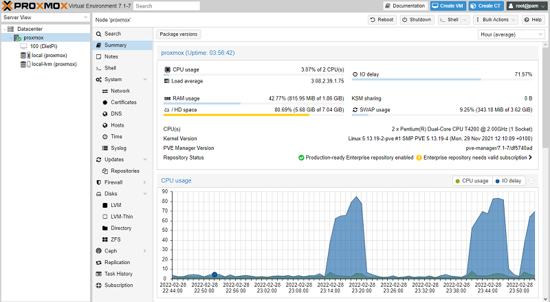

# How to install DietPi

The installation of DietPi consists of few steps:

- Provide an installation media (e.g. SD card for single board computer or USB stick for PC)
- Get the DietPi image (and put it on the installation media)
- Boot up the DietPi device and go through one time installation steps

Following these steps you will be able to initially setup DietPi and install additional software packages you would like to use, using [dietpi-software](../dietpi_tools/#dietpi-software){: class="nospellcheck"}.

Select the following tabs for the installation description of your target.

=== "Raspberry Pi and other SBCs"

    ## Introduction

    Single board computers (SBCs) based on the well known Raspberry PI ARM based architecture gained more and more friends in the last years. The low cost in combination with the power and hardware flexibility makes these SBCs optimal for embedded systems, like e.g. home automation or cloud applications.

    {: width="400" height="200" loading="lazy"}

    ## Prerequisites

    To follow this tutorial, you will need the next hardware list:

    - A Raspberry Pi, Odroid or other SBC - open [the list of all supported SBC](../hardware/)
    - An SD card, USB flash drive or eMMC of at least 4 GiB size, and a way to write it
    - Optional: Ethernet (network) cable

    _Note_: Following this guide you could run the installation directly from a console via keyboard and screen, via SSH client or serial console.

    ## 1. Download and extract the DietPi disk image

    Open [dietpi.com](https://dietpi.com/#download){: class="nospellcheck"}, select your SBC and click on **Download**. The disk image will be downloaded locally.

    _Example:_
    {: width="1186" height="561" loading="lazy"}

    **Unzip the downloaded file to a local folder.**

    It is a _7z_ archive format so you will need to install either [7zip for Windows](https://www.7-zip.org/) or [The Unarchiver (Macintosh)](https://wakaba.c3.cx/s/apps/unarchiver.html). Both are free of charge and have been tested to unzip the image correctly.

    Linux users will need to download and install `p7zip` (the terminal version of `7zip`).

    ??? hint "How do I extract DietPi image on Linux"
        On Debian and Ubuntu-based systems, open a terminal and type:

        ```sh
        sudo apt install p7zip
        ```

        Once p7zip is installed, type the following at the terminal to extract the file:

        ```sh
        7zr x DietPi-Image.7z
        ```

        Replace **DietPi-Image.7z** with the correct name of the downloaded archive, e.g. **DietPi_RPi-ARMv6-Bullseye.7z**. This will extract the DietPi image file for you to use.

    ## 2. Flash the DietPi image

    At first, download and install [balenaEtcher](https://www.balena.io/etcher/). This application flashes OS images to SD cards and USB drives, safely and easily on Windows, macOS, Linux.  

    !!! note "On Windows you may also use [Rufus](https://rufus.ie/) to flash the image."
        Click on the **Install on native PC** tab above to see an example of using Rufus. In case of SBC images, all options are greyed out, which is correct, so after selecting the image and the target drive, you only need to hit **START**.

    Start balenaEtcher and make sure you have your drive or SD card inserted into your computer. Locate and select the DietPi image.

    {: width="795" height="529" loading="lazy"}

    Next, ensure that the selected device is the correct one.

    !!! warning "All data on the drive will be erased!"
        The flash procedure will wipe the drive clean, so if you choose the wrong one, you may risk losing data.


    {: width="796" height="478" loading="lazy"}

    Once you have confirmed all the details are correct, proceed to flash the SD card. This process may take a while.

    {: width="796" height="478" loading="lazy"}

    ??? info "Click here if you want to use a WiFi connection"
        To setup the WiFi, open the SD card folder, and update next two files using a text editor of your choice:

        1.  Open the file named `dietpi.txt`. Find `AUTO_SETUP_NET_WIFI_ENABLED` and set to value 1.
        2.  Open the file `dietpi-wifi.txt` and set `aWIFI_SSID[0]` to the name of your WiFi network.
        3.  In the same file `dietpi-wifi.txt`, set `aWIFI_KEY[0]` to the password of your WiFi network.
        4.  Save and close the files

    ## 3. Prepare the first boot

    Remove the drive resp. SD card from the PC and insert it into your SBC device, preparing to boot for the first time.  
    Power on the SBC to login and execute the first boot procedure.  

    ??? info "Option: Automatic base installation at first boot (running an _unattended base installation_)"

        DietPi offers the option for an automatic first boot installation. See section ["How to do an automatic base installation at first boot"](../usage/#how-to-do-an-automatic-base-installation-at-first-boot-dietpi-automation) for details.

    ???+ hint "Initial boot duration"
        Due to an automated resize of the root filesystem and basic setup steps, this initial boot takes a longer time than further system booting sequences. It may last up to a couple of minutes, depending on the system drive and hardware.

=== "VirtualBox"

    <h2>Introduction</h2>

    Virtual machine images are great for those occasions where you want to set up a DietPi system very quickly and test things. Also it may be used as a Debian based Linux system with a small footprint for development purposes, e.g. with the X11 window system. The small footprint makes it optimally usable on PCs without a huge built in RAM. Also several VMs may be run for different applications.

    One big advantage of such a VM is that it needs only a couple of minutes coming to a running DietPi system.

    One of the options of a virtual machine is [__Oracle VirtualBox__](https://www.oracle.com/virtualization/virtualbox/).

    {: width="1593" height="814" loading="lazy"}

    <h2>Prerequisites</h2>

    As a starting point you need a **PC with a running VirtualBox software** on which the DietPi system will run.  
    On this PC a free harddisk space of about

    - 1.2 GiB for a minimal running system
    - 5 - 10 GiB for a typical running system with X11

    is needed. A recommended size is at least a free space of 10 GiB.

    ??? important "Installation of VirtualBox with VirtualBox extension pack ("Guest additions")"
        If you plan to install the VirtualBox extension pack, some things have to be taken into account to achieve a working time synchronization. In general:

        - The VirtualBox expansion pack contains an own time sync functionality, which can keep the VM system time in sync with the host system time.
          The time sync mode in `dietpi-config` should hence be switched to **Custom** to avoid conflicts or timeouts during the boot process.
        - VirtualBox without the extension pack requires a network time sync solution, e.g. one of the `dietpi-config` configurable time sync modes (which are based on `systemd-timesyncd`).

        The needed additional installation steps (use of the extension pack) are described here (installation steps on the host system) and below (installation steps within the DietPi guest system).  
        The installation on the host system contains the base VirtualBox installation and the installation of the extension pack. The VirtualBox host installation is described in the case of a Linux based host system (the description assumes a root user, otherwise add `sudo` appropriate).

        1. Installation of VirtualBox on a Linux host system  
           Following is the description of a manual installation (you need to change this depending on the actual VirtualBox release):

             ```sh
             mkdir ~/Downloads
             cd ~/Downloads
             curl -LO 'https://download.virtualbox.org/virtualbox/6.1.32/virtualbox-6.1_6.1.32-149290~Debian~bullseye_amd64.deb'
             apt install ./virtualbox-6.1_6.1.32-149290~Debian~bullseye_amd64.deb
             ```

        2. Installation of the VirtualBox extension pack on a Linux host system  
           Following is the description of a manual installation (you need to change this depending on the actual VirtualBox release):

             ```sh
             cd ~/Downloads
             curl -LO 'https://download.virtualbox.org/virtualbox/6.1.32/Oracle_VM_VirtualBox_Extension_Pack-6.1.32-149290.vbox-extpack'
             VBoxManage extpack install Oracle_VM_VirtualBox_Extension_Pack-6.1.32-149290.vbox-extpack
             ```

        After these two steps the host installation of the VirtualBox extension pack is completed. Further installation steps on the guest system are described below.

    <h2>1. Download and extract the DietPi disk image</h2>

    Download the **DietPi VirtualBox** image from [dietpi.com](https://dietpi.com/#download){: class="nospellcheck"} and unzip the downloaded file to a local folder. It is a _7z_ archive format so you will need to install either [7zip for Windows](https://www.7-zip.org/) or other alternative tools.

    {: width="1152" height="733" loading="lazy"}

    The zip file contains a couple of files, the important one is the .ova file which has to be imported into VirtualBox.

    {: width="533" height="83" loading="lazy"}

    <h2>2. Import of the .ova file in VirtualBox</h2>

    As next, the VirtualBox virtual machine has to be setup by importing the .ova file (via \File\Import Appliance):

    {: width="483" height="308" loading="lazy"}

    In the following dialog the user has to choose the `.ova` file which shall be imported.

    {: width="971" height="775" loading="lazy"}

    Keep the settings in the next dialog and klick “Import”.

    After the importing has finished the DietPi VirtualBox virtual machine is present:

    {: width="245" height="55" loading="lazy"}

    <h2>3. First boot of the new VirtualBox image</h2>

    Press the start button (green arrow) to 'boot up' your system based on the DietPi image.

    ??? attention "You must disable IPv6 when the host uses WiFi"
        Sometimes the VM has difficulties to connect to the internet. This is reported in a network bridged mode and when the host connects to the internet via WiFi: In these cases the IPv6 routing between the VM and the internet fails (e.g. see [there](https://communities.vmware.com/t5/VMware-Fusion-Discussions/IPv6-Bridged-Wireless/td-p/2038235)).  
        A typical result is, that the system does not find the update server (e.g. at the very first update run). This is then signaled during the "apt update" procedure of the first boot startup.  
        To overcome this, open a subshell (or an additional ssh window), start `dietpi-config` and disable **IPv6** within the Network options.

        {: width="500" height="225" loading="lazy"}

        Then exit `dietpi-config`. After this the first time installer procedure should run again from the start.

    ??? important "Installation steps within the DietPi guest system when using the VirtualBox extension pack"
        If you use the VirtualBox extension pack, after the DietPi base installation (done during the very first boot of the DietPi system), further installation steps within the DietPi guest system have to be done to achieve a working time synchronization. In general you have to use the following **Time sync mode** options set via the `dietpi-config` command (in the **Advanced Options**):

        - VirtualBox without extension pack: The time synchronisation has to use options 1..4 ("Boot only", "Boot + Daily", "Boot + Hourly", "Daemon + Drift"). No further installation steps are necessary.
        - VirtualBox with extension pack: The time synchronisation must use option 0 ("Custom"). Further installation steps are necessary, see below.

            {: width="600" height="328" loading="lazy"}

        Additional installation steps in case of the use of the extension pack (the description assumes a root user, otherwise add `sudo` appropriate):

        1. Check whether an optical disc with the VirtualBox extensions (`.iso`) is present:

            ```sh
            lsblk
            ```

            If you do not see a `/dev/sr0` optical drive, you need to add this in the virtual machine settings (in the shutdown state of the VM) `\Machine->Settings->Storage`: Add an optical storage which is linked to the guest additions (`.iso`).

        2. Install the kernel headers and the extension pack:

            ```sh
            apt -y install build-essential dkms linux-headers-amd64
            mkdir /root/mnt
            mount /dev/sr0 /root/mnt
            cd /root/mnt
            ./VBoxLinuxAdditions.run
            ```

            If you see an error message ***"VirtualBox Guest Additions: Kernel headers not found for target kernel"*** then the kernel headers are not installed properly (execute `apt -y install linux-headers-amd64` and afterwards try `./VBoxLinuxAdditions.run` again).

        3. Reboot and check service  
           Check a running VirtualBox extension pack service with

             ```sh
             systemctl status vboxadd-service
             ```

             The `vboxadd-service` should be in state *active*.

        4. Settings in the host system  
            To assure that the guest VM syncs the time with the host at boot and when restoring from saved state, run the following three commands on the **host system** (not the DietPi guest system):

            ```sh
            VBoxManage guestproperty set "<vm_name>" --timesync-set-start
            VBoxManage guestproperty set "<vm_name>" --timesync-set-on-restore 1
            VBoxManage guestproperty set "<vm_name>" "/VirtualBox/GuestAdd/VBoxService/--timesync-set-threshold" 10000
            ```

            Replace `<vm_name>` with the name of your virtual machine, shown in the VM VirtualBox Manager UI, e.g. `DietPi_VirtualBox-x86_64-Bullseye` if you import the VM without changing its name.

        With all these setup steps the time synchronization with the usage of the extension pack should work. Sometimes it needs a couple of minutes until the time is synchronized, so be somehow patient.

=== "VMware Player / Fusion"

    <h2>Introduction</h2>

    Virtual machine images are great for those occasions where you want to set up a DietPi system very quickly and test things. Also it may be used as a Debian based Linux system with a small footprint for development purposes, e.g. with the X11 window system. The small footprint makes it optimally usable on PCs without a huge built in RAM. Also several VMs may be run for different applications.

    One big advantage of such a VM is that it needs only a couple of minutes coming to a running DietPi system.

    One of the options of a virtual machine is [__VMware Workstation Player__](https://www.vmware.com/de/products/workstation-player/workstation-player-evaluation.html) resp. [__VMware Fusion__](https://www.vmware.com/de/products/fusion/fusion-evaluation.html) (macOS).

    {: width="769" height="588" loading="lazy"}

    !!! info "Tested with Windows 10"
        This description relates to VMware Workstation 16 Player on a Microsoft Windows system.  
        ***VMware Workstation Pro*** as well as ***VMware Fusion for MAC*** were not tested but should work also.

    <h2>Prerequisites</h2>

    As a starting point you need a **PC with a running VMware Workstation Player software** on which the DietPi system will run.  
    On this PC a free harddisk space of about

    - 3 GiB for a minimal running system (1.5 GiB in switched off state)
    - 5 - 10 GiB for a typical running system with X11

    is needed. A recommended size is at least a free space of 10 GiB.

    <h2>1. Download and extract the DietPi disk image</h2>

    Download the **DietPi VMware** image from [dietpi.com](https://dietpi.com/#download){: class="nospellcheck"} and unzip the downloaded file to a local folder. It is a _7z_ archive format so you will need to install either [7zip for Windows](https://www.7-zip.org/) or other alternative tools.

    {: width="1223" height="749" loading="lazy"}

    The zip file contains a couple of files, the important two are the `.vmx` and `.vmdk` files which have to be copied to a VMware machine folder (The folder can be located anywhere on the PCs harddisk).

    {: width="525" height="104" loading="lazy"}

    <h2>2. Add the files in VMware</h2>

    As next, the VMware virtual machine is setup by just opening the `.vmx` file (via ***Open a Virtual Machine***):

    {: width="715" height="585" loading="lazy"}

    In the following dialog the user has to navigate to the directory where the `.vmx` and `.vmdk` files were stored. Choose the `.vmx` file to open.  
    After this the DietPi VMware virtual machine is present and can be started:

    {: width="714" height="588" loading="lazy"}

    <h2>3. First boot of the new VMware image</h2>

    Press the ***Play virtual machine*** (green arrow) to 'boot up' your system based on the DietPi image. Possibly you have to acknowledge in an appearing dialog "I Copied it" and go on.
    If you want to use a WiFi connection you have to change the network settings matching your environment (files `\boot\dietpi.txt` and `\boot\dietpi-wifi.txt`).

    ??? attention "You must disable IPv6 when the host uses WiFi"
        Sometimes the VM has difficulties to connect to the internet. This is reported in a network bridged mode and when the host connects to the internet via WiFi: In these cases the IPv6 routing between the VM and the internet fails (e.g. see [there](https://communities.vmware.com/t5/VMware-Fusion-Discussions/IPv6-Bridged-Wireless/td-p/2038235)).  
        A typical result is, that the system does not find the update server (e.g. at the very first update run). This is then signaled during the "apt update" procedure of the first boot startup.  
        To overcome this, open a subshell (or an additional ssh window), start `dietpi-config` and disable **IPv6** within the Network options.

        {: width="500" height="225" loading="lazy"}

        Then exit `dietpi-config`. After this the first time installer procedure should run again from the start.

    <h2>Additional information</h2>

    For information about running DietPi in an VMware ESXi environment, you can read this article: [Running the DietPi VMware image on ESXi 6.7](https://ccie.tv/running-dietpi-vmware-image-on-esxi-6-7).

=== "VMware ESXi"

    <h2>Introduction</h2>

    Virtual machine images are great for those occasions where you want to set up a DietPi system very quickly and test things. Also it may be used as a Debian based Linux system with a small footprint for development purposes, e.g. with the X11 window system. The small footprint makes it optimally usable on PCs without a huge built in RAM. Also several VMs may be run for different applications.

    One big advantage of such a VM is that it needs only a couple of minutes coming to a running DietPi system.

    One of the options of a virtual machine appliance server is the freely available [__VMware vSphere Hypervisor__](https://www.vmware.com/products/vsphere-hypervisor.html/) which contains the [VMware ESXi Hypervisor](https://www.vmware.com/products/esxi-and-esx.html/).

    {: width="1918" height="1010" loading="lazy"}

    <h2>Prerequisites</h2>

    As a starting point you need a **PC with a running VMware ESXi Hypervisor software** on which the DietPi system will run.

    <h2>1. Download and extract the DietPi appliance image</h2>

    Download the **DietPi ESXi** appliance image from [dietpi.com](https://dietpi.com/#download){:class="nospellcheck"} and unzip the downloaded file to a local folder. It is a _7z_ archive format so you will need to install either [7zip for Windows](https://www.7-zip.org/) or other alternative tools.

    The archive contains a couple of files, the important one is `DietPi_ESXi-x86_64-Bullseye.ova`, which has to be uploaded to the ESXi server.

    <h2>2. Create the Virtual Machine</h2>

    The first step is to select the Virtual Machine management tab on the left to create the DietPi VM:

    {: width="1178" height="275" loading="lazy"}

    As next, enter the following in the VM creation dialog:

    1. Tab **Select creation type**: Choose *Deploy a virtual machine from an OVF or OVA file*. Then click **Next**.
    1. Tab **Select OVF and VMDK files**: Enter the name of your VM and drop or select the extracted `.ova` file. Then click **Next**.

        {: width="942" height="556" loading="lazy"}

    1. Tab **Select storage**: Choose the location where the VM shall reside. Then click **Next**.
    1. Tab **Deployment options**: Set options according to your preferences and click **Next**.
    1. Tab **Ready to complete**: Check dialog and click **Finish**.

    <h2>3. First boot of the new VMware image</h2>

    Depending on your settings the VM automatically starts up and is shown in the VM management dialog. Otherwise click on the VM name.

    {: width="1669" height="859" loading="lazy"}

    You can open a console of your VM just by clicking on the small VM screen output to open a console window. Klick into the new console window to redirect your keyboard to this console.

    !!! info "Install VM tools"

        To install VM tools in your ESXi machine, it is an option to do it with the `open-vm-tools` via:

        ```sh
        apt install open-vm-tools
        ```

=== "Proxmox"

    <h2>Introduction</h2>

    Virtual machine images are great for those occasions where you want to set up a DietPi system very quickly and test things. Also it may be used as a Debian based Linux system with a small footprint for development purposes, e.g. with the X11 window system. The small footprint makes it optimally usable on PCs without a huge built in RAM. Also several VMs may be run for different applications.

    One big advantage of such a VM is that it needs only a couple of minutes coming to a running DietPi system.

    One of the options to run and manage virtual machines is [__Proxmox__](https://www.proxmox.com/).

    {: width="800" height="439" loading="lazy"}

    <h2>Prerequisites</h2>

    Proxmox runs on any `x86_64` system. ISO images for the Virtual Environment server can be found here: <https://www.proxmox.com/de/downloads/category/iso-images-pve>  
    Aside of the Proxmox server's [system requirements](https://www.proxmox.com/en/proxmox-ve/requirements), a DietPi VM additionally requires:

    - 1.2 GiB for a minimal DietPi system
    - 5 - 10 GiB for a typical running system with X11

    <h2>1. Generate a new Proxmox VM</h2>

    1. Access the Proxmox web interface via HTTPS on TCP port **8006**:
        - URL: `https://<your.IP>:8006`
        - Username: `root`
        - Password: `<root user password you entered during Proxmox VE install>`
    1. Tab **General**: Select the **Create VM** button at the top right corner. Choose a **Node** , a **VM ID** and a **Name**, then click **Next**.

        {: width="722" height="314" loading="lazy"}

        Remember the VM ID, you need it later.

    1. Tab **OS**: Select "**Do not use any media** ", for the **Guest OS** assure that **Linux** and version "**5.x - 2.6 Kernel**" is selected, then click **Next**.
    1. Tab **System**: As **Machine** you can select `q35`, but the older default will work as well. We recommend the para-virtualised **VirtIO SCSI** controller, which should be the default. Click **Next**.
    1. Tab **Disks**: Delete the default `scsi0` disk with the red trash bin button, then click **Next**.
    1. Tab **CPU**: Adjust CPU details as required, we recommend to use the default `kvm64` type. Then click **Next**.
    1. Tab **Memory**: While DietPi runs with less, depending on the software you want to install and run within the VM, we recommend at least 1024 MiB memory size, 2048 MiB allows the DietPi system to setup itself without a swap file by default. When done, click **Next**.

        ??? info "Dynamic memory allocation via ballooning device"
            The [ballooning device](https://wikipedia.org/wiki/Memory_ballooning) allows Proxmox to dynamically allocate memory from the host system based on actual memory usage within the VM. I.e. you are able to run VMs with a higher overall memory size than the host system has, as long as all VMs do not fully use their memory at the same time.

    1. Tab **Network**: Using a network bridge allows the VM to show up as dedicated system in your LAN, which simplifies SSH and network application access. We recommend to use the default para-virtualised **VirtIO** adapter model. When done, click **Next**.
    1. Tab **Confirm**: Start the VM creation by clicking **Finish**.

    <h2>2. Download, extract and import the DietPi image</h2>

    !!! info "Transferring a disk image to Proxmox"
        A DietPi disk image can be transferred to the Proxmox server via e.g. USB flash drive or by uploading it as CD/DVD ISO image. Since the import needs to be done via console (accessible via web interface and SSH), we guide you through the path of downloading it directly on the Proxmox server.

    1. Select the Proxmox node, then click the **Shell** button at the top right corner. Alternatively connect via SSH to the Proxmox server, using the same login credentials you used for the Proxmox web interface.
    1. In the console window, enter the following commands to download the DietPi image, extract it via `p7zip`, import it as disk to your new VM (using the **VM ID** you chose during creation) and make it the boot drive.  
        _If not done yet, we recommend to upgrade all APT packages to the latest version._

        ```sh
        apt update
        apt full-upgrade
        apt install p7zip
        curl -O https://dietpi.com/downloads/images/DietPi_Proxmox-x86_64-Bullseye.7z
        7zr x DietPi_Proxmox-x86_64-Bullseye.7z
        ```

        Optionally verify the SHA256 hash of the downloaded file via:

        ```sh
        sha256sum -c < <(mawk '/SHA256/{print $2"  DietPi_Proxmox-x86_64-Bullseye.qcow2"}' hash.txt)
        ```

        As next, the disk image is imported.  
        **Note**: Replace `100` below with the **VM ID** entered during VM creation.

        ```sh
        ID=100
        qm importdisk "$ID" DietPi_Proxmox-x86_64-Bullseye.qcow2 local-lvm
        qm set "$ID" --scsi0 "local-lvm:vm-$ID-disk-0"
        qm set "$ID" --boot order=scsi0
        ```

    1. Finally, you can remove the downloaded and extracted files and close the console:

        ```sh
        rm DietPi_Proxmox-x86_64-Bullseye.* hash.txt README.md
        ```

    The VM can now be started, select it via left side navigation of the Proxmox web interface, then the **Start** button at the top right side, finally the **Console** button to watch and finish the DietPi first run setup.  
    Alternatively you can connect to the VM via SSH, after giving it some time to finish initial setup steps and obtaining its IP with your router or IP scanner.

    {: width="1024" height="590" loading="lazy"}

=== "Parallels"

    <h2>Introduction</h2>

    Virtual machine images are great for those occasions where you want to set up a DietPi system very quickly and test things. Also it may be used as a Debian based Linux system with a small footprint for development purposes, e.g. with the X11 window system. The small footprint makes it optimally usable on PCs without a huge built in RAM. Also several VMs may be run for different applications.

    One big advantage of such a VM is that it needs only a couple of minutes coming to a running DietPi system.

    One of the options of a virtual machine is [__Parallels Desktop__](https://www.parallels.com/products/desktop/).

    {: width="896" height="504" loading="lazy"}

    <h2>Prerequisites</h2>

    As a starting point you can use an **Apple Mac with a running Parallels Desktop software** on which the DietPi system will run (x86 system, e.g. Mac mini 2011/2012/2014/2018).  
    On this Mac a free harddisk space of about

    - 1.2 GiB for a minimal running system
    - 5 - 10 GiB for a typical running system with X11

    is needed. A recommended size is at least a free space of 10 GiB.

    <h2>1. Download and extract the DietPi disk image</h2>

    Download the **DietPi Parallels** image from [dietpi.com](https://dietpi.com/#download){: class="nospellcheck"}.

    Double click on the downloaded file to extract it (or via option "Open in Finder"). Copy/Move the contained `.pvm` file to the Parallels directory (typically directory "Parallels" within your home directory).

    <h2>2. Open the virtual machine in Parallels Desktop</h2>

    As next, the Parallels virtual machine is opened by just double click the `.pvm` file. Then the machine starts up.

    {: width="640" height="273" loading="lazy"}

=== "UTM"

    <h2>Introduction</h2>

    Virtual machine images are great for those occasions where you want to set up a DietPi system very quickly and test things. Also it may be used as a Debian based Linux system with a small footprint for development purposes, e.g. with the X11 window system. The small footprint makes it optimally usable on PCs without a huge built in RAM. Also several VMs may be run for different applications.

    One big advantage of such a VM is that it needs only a couple of minutes coming to a running DietPi system.

    One of the options of a virtual machine is [__UTM__](https://mac.getutm.app/).

    {: width="900" height="506" loading="lazy"}

    <h2>Prerequisites</h2>

    As a starting point you can use an **Apple Mac with macOS 11 Big Sur or higher running the UTM software** (x86 system, e.g. Mac mini 2011/2012/2014/2018 as well as M1 Apple silicon).  
    On this Mac a free harddisk space of about

    - 1.2 GiB for a minimal running system
    - 5 - 10 GiB for a typical running system with X11

    is needed. A recommended size is at least a free space of 10 GiB.

    !!! info "Emulation feature of UTM"
        The emulation feature is an option of the virtualization technique to run x86 code on a M1 Mac system and vice versa an M1 Mac code on a x86 Mac system.  
        This might be a good choice e.g. for testing purposes, but typically there will be a performance drawback using the emulation instead of running native x86 images on a x86 system resp. native `aarch64` images on an M1 system.

    !!! info "UTM machine for M1 (Apple silicon)"
        The available DietPi UTM image is an image which is x86 based. On a M1 Mac it will run with lower performance because it uses the slower emulation and not the faster virtualization technique.  
        If you plan to run DietPi on an M1 Mac with UTM, it is a good choice to create a native `aarch64` DietPi image for getting the best performance. This can be achieved by adding a new UTM VM via the `+` option in the UTM program. Then a new VM can be generated by using a standard Debian image for the `arm64` architecture Native PCs (e.g. with the `mini.iso` image) and afterwards executing the scripts described in [Make your own distribution](https://dietpi.com/docs/hardware/#make-your-own-distribution).  

    <h2>1. Download and extract the DietPi disk image</h2>

    Download the **DietPi UTM** image from [dietpi.com](https://dietpi.com/#download){: class="nospellcheck"}.

    Double click on the downloaded file to extract it (or via option "Open in Finder"). Copy/Move the contained `.utm` file to the UTM virtual machine directory. This is typically located within the (hidden) user subdirectory `.../Library/Containers/com.utmapp.UTM/Data/Documents`.

    <h2>2. Import the virtual machine in UTM</h2>

    As next, start resp. restart the UTM program. The imported DietPi virtual machine should be visible there.

    {: width="350" height="283" loading="lazy"}

    Then select the imported machine to start it up.

    {: width="640" height="265" loading="lazy"}

=== "Hyper-V"

    <h2>Introduction</h2>

    Virtual machine images are great for those occasions where you want to set up a DietPi system very quickly and test things. Also it may be used as a Debian based Linux system with a small footprint for development purposes, e.g. with the X11 window system. The small footprint makes it optimally usable on PCs without a huge built in RAM. Also several VMs may be run for different applications.

    One big advantage of such a VM is that it needs only a couple of minutes coming to a running DietPi system.

    One of the options of a virtual machine is [__Microsoft Hyper-V__](https://docs.microsoft.com/en-us/windows-server/virtualization/hyper-v/hyper-v-technology-overview).

    {: width="722" height="450" loading="lazy"}

    !!! info "Tested with Windows 10"
        This description relates to Hyper-V on a Microsoft Windows system.

    <h2>Prerequisites</h2>

    As a starting point you need a **PC with a activated Hyper-V** on which the DietPi system will run.

    ??? info "Hyper-V activation within Windows"
        Hyper-V needs to be activated within Windows (e.g. [see there](https://docs.microsoft.com/en-us/virtualization/hyper-v-on-windows/quick-start/enable-hyper-v)). The activation is done by enabling all Hyper-V features in the ***Turn Windows features on or off*** within the ***Apps and Features*** area in the Windows settings.

        {: width="367" height="328" loading="lazy"}

    On this PC a free harddisk space of about

    - 3 GiB for a minimal running system (1.5 GiB in switched off state)
    - 8 - 10 GiB for a typical running system with X11

    is needed. A recommended size is at least a free space of 10 GiB.

    <h2>1. Download and extract the DietPi disk image</h2>

    Download the **DietPi Hyper-V** image from [dietpi.com](https://dietpi.com/#download){: class="nospellcheck"} and unzip the downloaded file to a local folder. It is a _7z_ archive format so you will need to install either [7zip for Windows](https://www.7-zip.org/) or other alternative tools.

    {: width="722" height="463" loading="lazy"}

    The archive contains the DietPi `README.md`, the `.vhdx` virtual disk image and a `hash.txt`, which contains hashes to check the integrity of the virtual disk image. Move the `.vhdx` file to the desired virtual machine folder on your harddisk.

    <h2>2. Add a Hyper-V virtual machine</h2>

    Next, a Hyper-V machine needs to be created. Start the Hyper-V-Manager, right click on your PCs node in the left tree and open the dialog wizard for the machine generation ("New" -> "Virtual Machine"):

    {: width="450" height="364" loading="lazy"}

    In the following wizard you have to set the following:

    1. Give your machine a name ("Specify Name and Location")
    2. Select the Hyper-V Generation: Select **Generation 1** ("Specify Generation")
    3. Choose your RAM size (e.g. 2048 MB)
    4. If you have already configured a network, select your network. Otherwise let it "Not connected" and change it afterwards
    5. Choose to use the extracted `.vhdx` Hyper-V disc file (see above)

    If you have not set up any network connection, go on with the **Virtual Switch Manager** and add a network. Select that network in your virtual machine settings afterwards.  

    {: width="250" height="284" loading="lazy"}

    <h2>3. First boot of the new Hyper-V machine</h2>

    First, click on ***Connect*** to open a window of the virtual machine:

    {: width="450" height="205" loading="lazy"}

    Then press ***Start*** to boot up the machine:

    {: width="550" height="420" loading="lazy"}

    After this, your machine should boot up.

    ??? attention "You must disable IPv6 when the host uses WiFi"
        Sometimes the VM has difficulties to connect to the internet. This is reported in a network bridged mode and when the host connects to the internet via WiFi: In these cases the IPv6 routing between the VM and the internet fails (e.g. see [there](https://communities.vmware.com/t5/VMware-Fusion-Discussions/IPv6-Bridged-Wireless/td-p/2038235)).  
        A typical result is, that the system does not find the update server (e.g. at the very first update run). This is then signaled during the "apt update" procedure of the first boot startup.  
        To overcome this, open a subshell (or an additional ssh window), start `dietpi-config` and disable **IPv6** within the Network options.

        {: width="500" height="225" loading="lazy"}

        Then exit `dietpi-config`. After this the first time installer procedure should run again from the start.

    <h2>Additional information / troubleshooting</h2>

    <h3>Network connection not found</h3>

    In the case that you did not setup your network configuration properly, the booting procedure will not find a network connection and may respond with this boot console output:

    {: width="722" height="164" loading="lazy"}

    Then you have to check and repair your network configuration within the **Virtual Switch Manager**.

    <h3>Generate a Hyper-V Generation 2 machine</h3>

    An option to get a Hyper-V Generation 2 machine is to generate your own Hyper-V image via a **Debian network installation** (booting the Hyper-V machine from a Debian `netinst.iso` installer like you would do it on a PC). Install a minimal Debian machine (i.e. no X11 desktops, etc.). Afterwards run the procedure described in section ["Make your own distribution"](../hardware/#make-your-own-distribution). Generation 2 machines support (and require) to boot in UEFI mode, support [Secure Boot](https://en.wikipedia.org/wiki/Unified_Extensible_Firmware_Interface#Secure_Boot), [TPM](https://en.wikipedia.org/wiki/Trusted_Platform_Module), use modern SCSI controllers and have higher hardware limits. For use as a home server, however, you will not need any of these functions.

=== "Native PC"

    <h2>Introduction</h2>

    The Native PC images are great for those occasions where SBC performance is just not enough. One example could be [Intel NUC Kit](https://www.intel.com/content/www/us/en/products/boards-kits/nuc/kits.html?page=2). It is a small, versatile, upgradable, and affordable desktop PC with the same basic feature set as that of a much larger machine.

    {: width="300" height="200" loading="lazy"}

    It could be also a great way to make use of an old computer that’s not capable of running the latest version of Windows or macOS.

    !!! question "**UEFI** or **BIOS**?"
        First, you have to find out whether your PC contains **UEFI** ([Unified Extensible Firmware Interface](https://wikipedia.org/wiki/Unified_Extensible_Firmware_Interface)) or **BIOS** ([Basic Input/Output System](https://wikipedia.org/wiki/BIOS)):

        - In case of an UEFI based PC see the "**UEFI Installer image**" tab.
        - In case of a BIOS based PC see the "**BIOS Installer image**" tab or "**BIOS direct write image**" tab.

    !!! question ""**BIOS Installer image**" or "**BIOS direct write image**"?"
        The "**BIOS installer image**" is used to boot from and install the DietPi system on a different target boot drive (storage medium). In contrary to that the "**BIOS direct write image**" is used to be write the image directly to the target DietPi boot drive.

    === "UEFI installer image"

        <h2>Prerequisites</h2>

        You would need the next:

        - one **working PC with internet access**, helping to write the boot media
        - one **bootable USB drive** (e.g. flash disk, at least 2 GiB), to hold the DietPi installer image and to boot the target PC
        - **target PC** to be installed

        <h2>1. Download and extract the DietPi installer image</h2>

        Download the **Native PC for UEFI** > **Installer Image** from [dietpi.com](https://dietpi.com/#download){: class="nospellcheck"} and
        extract the downloaded file to a local folder. It is a _7z_ archive format so you will need to install either [7zip for Windows](https://www.7-zip.org/) or other alternative tools.

        {: width="722" height="211" loading="lazy"}

        Download [Rufus](https://rufus.ie/) and run the application. There is a portable version of Rufus available which doesn't require any local installation.

        !!! warning "Be careful if you run alternative applications!"
            While [Balena Etcher](https://www.balena.io/etcher/) is recommended for installing DietPi on SBCs, it does not provide good results for UEFI images. The same also with win32diskimager, which does not work as an alternative.

        <h2>2. Write image to USB drive</h2>

        Start [Rufus](https://rufus.ie/) application and make sure you have your USB drive inserted into your computer. Follow the next steps:

        1. Select the USB device
        2. Select the downloaded **DietPi** image
        3. Select **GPT** as partition scheme
        4. Select **UEFI** as target system
        5. Click on **Start** button

        Ensure that the selected USB medium is the correct one.

        !!! warning "All data on the USB medium and later on the target PCs harddisk will be erased!"
            Before starting the installation first make a backup of the data available on the target PC and USB drive if you need it later again!

        {: width="473" height="579" loading="lazy"}

        <h2>3. Boot the target PC and install the image on the local disk</h2>

        Boot the **target PC** from the USB image and install the image on the local disk / harddisk. Put the USB stick into the target PC and boot from this USB stick.  

        !!! note "BIOS settings"
            It may be necessary to change BIOS settings to enable the UEFI boot. This action is not described here.

        During the initial boot, the following dialog may appear to boot from the USB stick:

        {: width="483" height="230" loading="lazy"}

        After booting the graphics selection dialog appears:

        {: width="834" height="394" loading="lazy"}

        You can select the default settings. In case of problems, please select "Safe graphic settings".

        Once this step is completed, you will able to select a different keyboard. If necessary, change your keyboard settings and go through the appropriate dialogues.

        Then the installation process begins with the help of the wonderful Clonezilla tool.

        Select the image file to be installed on the target PCs harddisk. Normally you should only see one single option:

        {: width="656" height="198" loading="lazy"}

        After this, you have to select the target PCs harddisk where your DietPi shall be installed. In this example there is only one harddisk present:

        {: width="853" height="181" loading="lazy"}

        After this, the installation process starts with several steps, e.g. showing the process of the image copying:

        {: width="500" height="350" loading="lazy"}

        These steps take some time, be patient! Otherwise buy an SSD. :-)  
        At the end the system executes a shutdown.

        ??? info "Click here if you want to use a WiFi connection"
            To setup the WiFi, you have to change the network settings matching to your environment:

            1.  Open the file `dietpi-wifi.txt` and set `aWIFI_SSID[0]` to the name of your WiFi network.
            2.  In the same file `dietpi-wifi.txt`, set `aWIFI_KEY[0]` to the password of your WiFi network.
            3.  Save and close the files

            You need to set these values before you boot up the PC for the first time (initial boot).

        For the first boot up of your PC disconnect your USB stick from the target PC and power on the PC to login and execute the first boot procedure.

    === "BIOS installer image"

        <h2>Prerequisites</h2>

        You would need the next:

        - one **working PC with internet access**, helping to write the boot media
        - one **bootable USB drive** (e.g. flash disk, at least 2 GiB), to hold the DietPi installer image and to boot the target PC
        - **target PC** to be installed

        Remark: If your PC is not able to boot from a USB drive you can do a similar installation by burning the installer image onto a DVD and boot from the DVD. The same installation procedure will take place. Do not forget to eject your DVD before the installed DietPi shall boot from the hard disc for the first time.

        <h2>1. Download and extract the DietPi installer image</h2>

        Download the **Native PC for BIOS/CSM** > **Installer Image** from [dietpi.com](https://dietpi.com/#download){: class="nospellcheck"} and
        extract the downloaded file to a local folder. It is a _7z_ archive format so you will need to install either [7zip for Windows](https://www.7-zip.org/) or other alternative tools.

        {: width="722" height="218" loading="lazy"}

        Download [Rufus](https://rufus.ie/) and run the application. There is a portable version of Rufus available which doesn't require any local installation.

        <h2>2. Write image to USB drive</h2>

        Start [Rufus](https://rufus.ie/) application and make sure you have your USB drive inserted into your computer. Follow the next steps:

        1. Select the USB device
        2. Select the downloaded **DietPi** image
        3. Select **MBR** as partition scheme and **BIOS or UEFI** as target system
        4. Click on **Start** button

        Ensure that the selected USB medium is the correct one.

        !!! warning "All data on the USB medium and later on the target PCs harddisk will be erased!"
            Before starting the installation first make a backup of the data available on the target PC and USB drive if you need it later again!

        {: width="474" height="580" loading="lazy"}

        <h2>3. Boot the target PC and install the image on the local disk</h2>

        Boot the **target PC** from the USB image and install the image on the local disk / harddisk. Put the USB stick into the target PC and boot from this USB stick.  

        !!! note "BIOS settings"
            It may be necessary to change BIOS settings to enable the boot from the USB stick. This action is not described here.

        After booting the graphics selection dialog appears:

        {: width="834" height="394" loading="lazy"}

        You can select the default settings. In case of problems, please select "Safe graphic settings".

        Once this step is completed, you will able to select a different keyboard. If necessary, change your keyboard settings and go through the appropriate dialogues.

        Then the installation process begins with the help of the wonderful Clonezilla tool.

        Select the image file to be installed on the target PCs harddisk. Normally you should only see one single option:

        {: width="656" height="198" loading="lazy"}

        After this, you have to select the target PCs harddisk where your DietPi shall be installed. In this example there is only one harddisk present:

        {: width="853" height="181" loading="lazy"}

        After this, the installation process starts with several steps, e.g. showing the process of the image copying:

        {: width="500" height="350" loading="lazy"}

        These steps take some time, be patient! Otherwise buy an SSD. :-)  
        At the end the system executes a shutdown.

        ??? info "Click here if you want to use a WiFi connection"
            To setup the WiFi, you have to change the network settings matching to your environment:

            1.  Open the file `dietpi-wifi.txt` and set `aWIFI_SSID[0]` to the name of your WiFi network.
            2.  In the same file `dietpi-wifi.txt`, set `aWIFI_KEY[0]` to the password of your WiFi network.
            3.  Save and close the files

            You need to set these values before you boot up the PC for the first time (initial boot).

        For the first boot up of your PC disconnect your USB stick from the target PC and power on the PC to login and execute the first boot procedure.

    === "BIOS direct write image"

        <h2>Prerequisites</h2>

        You would need the next:

        - one **working PC with internet access**, helping to write the boot media
        - one **disc drive**, to hold the DietPi system. It is written with the direct write image and will be the disk drive in the DietPi system.
        - **target PC** to be installed

        <h2>1. Download and extract the DietPi direct write image</h2>

        Download the **Native PC for BIOS/CSM** > **Direct write Image** from [dietpi.com](https://dietpi.com/#download){: class="nospellcheck"} and
        extract the downloaded file to a local folder. It is a _7z_ archive format so you will need to install either [7zip for Windows](https://www.7-zip.org/) or other alternative tools.

        {: width="722" height="218" loading="lazy"}

        Download [Rufus](https://rufus.ie/) and run the application. There is a portable version of Rufus available which doesn't require any local installation.

        <h2>2. Write image to disc drive</h2>

        Start [Rufus](https://rufus.ie/) application and make sure you have your disc drive connected into your computer. This may e.g. be done using an USB to SATA controller if you use a SATA disc drive. Follow the next steps:

        1. Show advanced drive properties and select **List USB hard drives**  
          (in case that you have connected your disc drive via a USB adapter)
        2. Select the disc drive device
        3. Select the downloaded **DietPi** image
        4. Click on **Start** button

        Ensure that the selected disc drive is the correct one.

        !!! warning "All data on the disc drive will be erased!"
            Before starting the installation first make a backup of the data available on the disc drive if you need it later again!

        {: width="474" height="607" loading="lazy"}

        <h2>3. Boot the target PC</h2>

        ??? info "Click here if you want to use a WiFi connection"
            To setup the WiFi, you have to change the network settings matching to your environment:

            1.  Open the file `dietpi-wifi.txt` and set `aWIFI_SSID[0]` to the name of your WiFi network.
            2.  In the same file `dietpi-wifi.txt`, set `aWIFI_KEY[0]` to the password of your WiFi network.
            3.  Save and close the files

            You need to set these values before you boot up the PC for the first time (initial boot).

        For the first boot up of your PC disconnect your disc drive from your working PC and connect it to the target PC. Then power on the target PC to login and execute the first boot procedure.

        ??? info "Option: Automatic base installation at first boot (running an _unattended base installation_)"

            DietPi offers the option for an automatic first boot installation. See section ["How to do an automatic base installation at first boot"](../usage/#how-to-do-an-automatic-base-installation-at-first-boot) for details.

## 4. First logon on DietPi

The hostname of the system will be: **DietPi**.  
You might change the name before the first boot within the configuration file `dietpi.txt`.

After the system has booted up, you can continue following the instructions on the screen, or connect via network:

- If you have a keyboard and a monitor connected to your system you login via this console.
- If you have a headless system without keyboard and monitor attached, you can use an **SSH** client like [PuTTY](https://www.chiark.greenend.org.uk/~sgtatham/putty/latest.html) to connect from a remote system. The SSH server [Dropbear](../software/ssh/#dropbear) is installed and enabled by default on DietPi.
- Most SBCs alternatively allow to connect a serial console via **UART**, which is by default enabled on DietPi as well.

A login prompt will appear. Use the initial credentials:

- login: `root`
- password: `dietpi` (resp. the one you set via `dietpi.txt`)

??? hint "Click here if you want to connect via SSH (running a _headless install_)"

    !!! warning "On first login DietPi will immediately upgrade system and packages. If your network connection is not stable it is recommended to perform this step locally instead."

    **IP Scanning tool**

    For the following steps we require an IP Scanning tool to determine the IP address of the Raspberry Pi.

    - For Windows, you could try `Advanced IP Scanner`. Download the tool from [here](https://www.advanced-ip-scanner.com).
    - For Linux, you can use the `nmap` command:

        ```sh
        sudo apt-get install nmap # for installing Nmap
        sudo nmap -sn 192.168.1.0/24 # for scanning IP address in the eange 192.168.1.0 - 192.168.1.255
        ```

    Alternatively you may also determine the IP address in the DHCP status page of your DHCP server (often included in a router): Search for the hostname **DietPi** and obtain the IP address.

    **Connect to DietPi via SSH**

    A popular SSH Client for Windows is PuTTY. You can download PuTTY from [here](https://www.chiark.greenend.org.uk/~sgtatham/putty/latest.html). Enter in the `Host Name` field the IP address found during the scanning, select `SSH` and then click on _Open_ button.  
    Depending on your DHCP configuration, also just `dietpi` may be sufficient as the hostname.  
    Sometimes it needs to be followed by your router's domain (e.g. `dietpi.fritz.box`).

    

    Most Linux distributions come packaged with an ssh client. Type in your Terminal next command (replace the sample IP address `192.168.1.20` with the one found via scanning the network):

    ```sh
    ssh root@192.168.1.20
    ```

    resp.

    ```sh
    ssh root@dietpi
    ```

DietPi will then immediately begin to search for and install updated software packages, which will take some time to complete.

Once the packages have been updated, DietPi will ask you to confirm whether you would like to enable user analytics.

!!! info "DietPi Survey"
    DietPi Survey is **optional, and not enabled by default**. It is anonymous, secured and requires a minimal data transfer. ALL the shared details are published on the [dietpi.com/survey](https://dietpi.com/survey/){: class="nospellcheck"} page. Checkout and see how DietPi is used!

{: width="642" height="385" loading="lazy"}

The default DietPi password is public, so you’ll be asked to change this at the next stage for both the `root` and `dietpi` user accounts. Select OK and hit ++enter++, then provide your password (twice) to confirm.

You can change the password again later by typing `passwd` at the terminal or also via the command line script `dietpi-config` (within the "Security options").

{: width="643" height="386" loading="lazy"}

## 5. Further steps

The base installation of DietPi is minimal **by design**, allowing you to choose what software you want to install and use: Just run `dietpi-software` and install [**DietPi Optimised Software**](../software/).  
You can return to the **DietPi-Software** tool to make further changes at any time by typing `dietpi-software` at the terminal, or enter `dietpi-launcher` and select **DietPi-Software** tool.

If you want to make further changes to your DietPi configuration, you can run `dietpi-launcher` at the terminal to view all the available DietPi tools, including **DietPi-Update** to update your device and **DietPi-Backup** to back up your device.

For more details, check [DietPi Tools](../dietpi_tools/) section.

## YouTube tutorials (made by community)

- YouTube video #1: [DietPi - HOW To Install & Initial Configuration on the Raspberry Pi 4](https://www.youtube.com/watch?v=Me0PfuNLl-Q)
- YouTube video #2: [Installing DietPi : Fast Linux For Any Raspberry Pi!!!](https://www.youtube.com/watch?v=U-UXenzA2m8){: class="nospellcheck"}
- YouTube video #3: [How Install Diet Pi Raspberry Pi 4 Or Any SBC - Install Set Up Configure](https://www.youtube.com/watch?v=qH0YsFNIyFo){: class="nospellcheck"}
- YouTube video #4: [Headless install of Dietpi | No Monitor, No LAN, No router login | Pre Configure WiFi](https://www.youtube.com/watch?v=vlMpn9u0Y4o){: class="nospellcheck"}
- YouTube video #5: [Installing DietPi on Raspberry Pi, First Boot and Configuration](https://www.youtube.com/watch?v=LzJpAUufyy0){: class="nospellcheck"}
- YouTube video #6 (German language): [Raspberry Pi 4 & DietPi - die schnelle Alternative - Grundinstallation einfach erklärt](https://www.youtube.com/watch?v=J5yPeJFLSO0&list=PLQIL7cyHMGboXtOzwAcX4hGPW6ECbVinp&index=7){: class="nospellcheck"}
