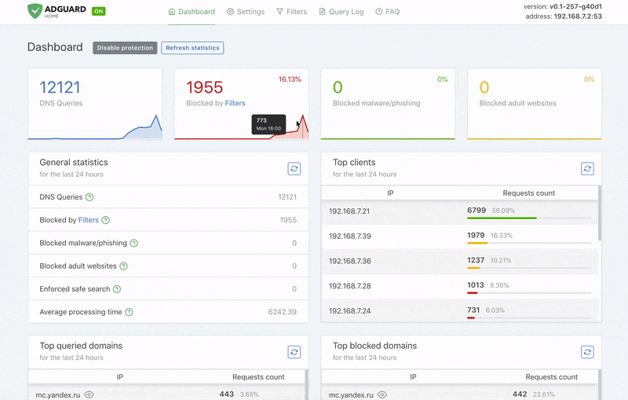
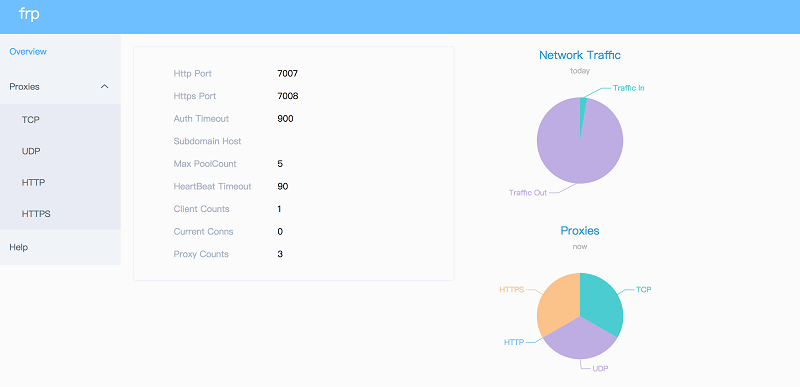
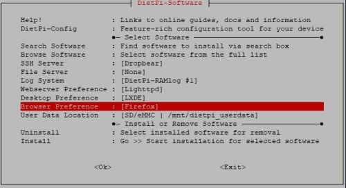
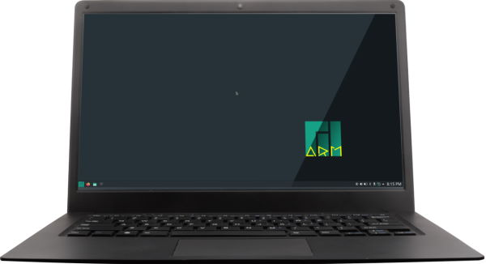
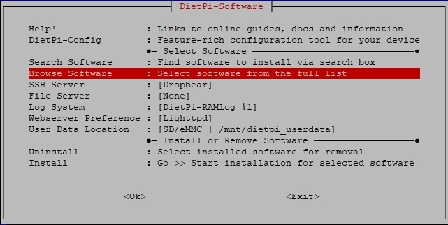
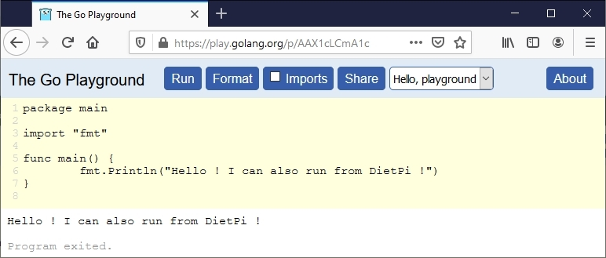
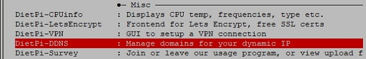
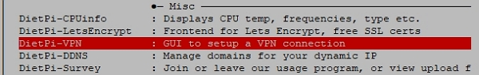
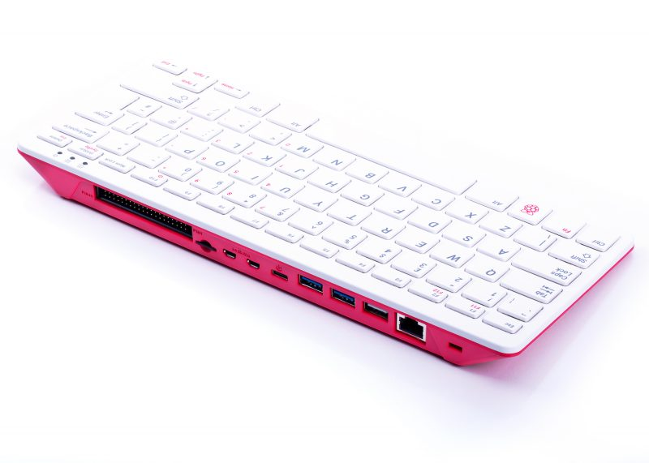
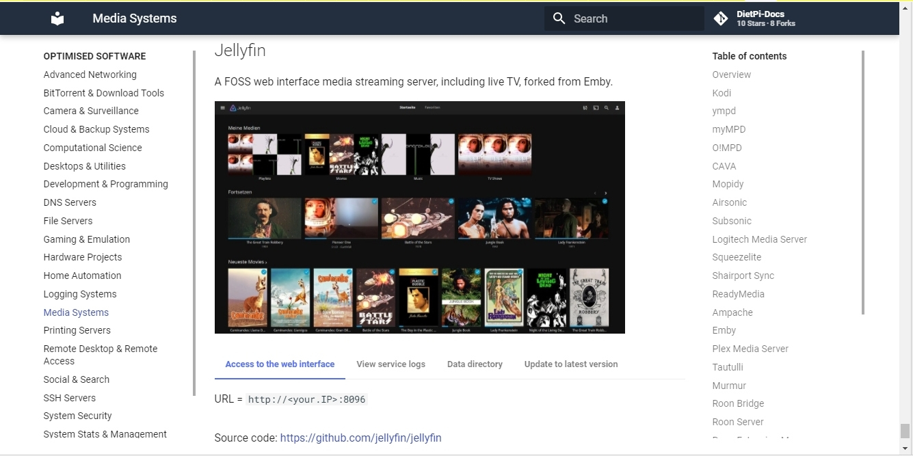

# DietPi Releases

## October 2021 (version 7.7) {: #october-2021-version-77 }

### Overview

Welcome to **October 2021 release** :octicons-heart-16: of **DietPi**. It's an incremental release focused on improvments to the scripts and software packages, improving the way you use **DietPi**.

If you have an **earlier DietPi version** and plan to migrate to **v7.7**, it's important to check also: [DietPi - How to Upgrade to "BULLSEYE"](https://dietpi.com/blog/?p=811). It is a _step by step_ article on how to achieve a successful migration !

{: width="320" height="427" loading="lazy"}

!!! cite ""

    _Photo by planet_fox, Pixabay_

### Improvements {: #improvements-77 }

**DietPi-Software** :

- [**DietPi-JustBoom**](../dietpi_tools/#dietpi-justboom) :octicons-arrow-right-16: Added the ability to enforce an output channel count, or to not enforce an audio format value to preserve the input stream format or leave conversion up to ALSA, which now is the default when resetting settings. Similarly, the audio output buffer can now be unset to keep the MPD default. Generally, if not required for a specific reason, it is recommended to not convert the audio stream and keep these settings unchanged/default.

- [**Deluge**](../software/bittorrent/#deluge) :

    - Logging is not done to `/var/log/deluged/` anymore but to journal instead, accessible via `journalctl -u deluged -u deluge-web`. This change only affects new installs and reinstalls of Deluge.
    - On fresh installs, the web interface is now accessible as expected with the chosen global software password, stored hashed with a fresh random salt. Previously the password was hardcoded to `dietpi`.
    - Resolved an issue on Bullseye where the web interface service did not start as a new command line flag `-d` is required to keep it in foreground. Many thanks to @quyentruong for reporting this issue: <https://github.com/MichaIng/DietPi/issues/4785>

- [**Kodi**](../software/media/#kodi) :

    - On Debian Bullseye, beginning with Kodi 19, GBM support is present by default, which means that [**Kodi**](../software/media/#kodi) can be started without a wrapping X server. This is now done by default when starting Kodi outside of a desktop session, including the dietpi-autostart option. This also means that an X server is not installed anymore as a dependency of Kodi, but only as a dependency of a deskop environment.
    - It can now be installed on all devices. In some cases, video playback performance may be bad, depending on the GPU, whether good drivers are available, and on the video quality, of course. However, it should be our users who evaluate whether it's sufficient or not, instead of us. With Debian Bullseye, new Mesa drivers and Kodi 19 started via GBM, performance should be much better than it was with older Debian/package versions.
    - Resolved an issue on RPi ARMv8/64-bit systems where Kodi fails to start when it was installed without a desktop. Many thanks to @Klola for reporting this issue: [see issue on the DietPi forum](https://dietpi.com/phpbb/viewtopic.php?p=38079#p38079)

- [File Browser](../software/cloud/#file-browser) :octicons-arrow-right-16: The default network port has been changed to `8084` to resolve a conflict with [HTPC Manager](../software/bittorrent/#htpc-manager). This only affects **new** [File Browser](../software/cloud/#file-browser) installations. Many thanks to @KamikazeePL for reporting this issue: [see issue on the DietPi forum](https://dietpi.com/phpbb/viewtopic.php?t=9507)

**Network & Printing interface** :

- **General** :octicons-arrow-right-16: The `/boot/dietpi/func/obtain_network_details` script has been removed, including the related `/run/dietpi/.network` file to obtain network details. All uses of these files have been replaced with the new DietPi-Globals `G_GET_NET` function (see below).
- **DietPi-Globals** :octicons-arrow-right-16: A new global function `G_GET_NET` has been added to print network interface details. Most importantly it prints info for the main interface, by following the priorities of `/boot/dietpi/func/obtain_network_details: default gateway => state UP => IP assigned`, but allows to additionally filter by IP family, type, interface name or print the default gateway explicitly. It aims to be a replacement for `/boot/dietpi/func/obtain_network_details` with more flexibility and to allow deriving always up-to-date interface info instead of depending on the correctness of a cache file.
- DietPi-Globals | `G_GET_WAN_IP` :octicons-arrow-right-16: We use our own GEO IP service now to show the systems WAN IP and location in the DietPi banner and DietPi-VPN. When Pi-hole was used, with a previous update, "freegeoip.app" was added to Pi-hole's whitelist, which is now not required anymore. You may hence remove that entry from the whitelist.
- DietPi-Boot :octicons-arrow-right-16: This script and service has been removed: Waiting for network is now done via `DietPi-PostBoot` `"After=network-online.target"`, time sync is done in `DietPi-PostBoot`, but in background (mostly not required for service starts) and pre-installed image stage handling is as well done in PostBoot now.
- DietPi-Update :octicons-arrow-right-16: A network connection and time sync check is now done before checking for updates, similar to how `DietPi-Software` does it on installs.

**Time syncronization** :

- Use the same flag file that `systemd-timesyncd` itself uses since Buster, to skip an additional service restart and sync when it was done already.
- When our oneshot modes (boot only, hourly, daily) are selected, `systemd-timesyncd` is now "enabled" to be started by systemd earlier at boot, instead of on our script call. Especially since both now share the same flag file (on Buster and above), this has a chance to prevent an additional service restart if the time sync has finished already when PostBoot is reached.

**DietPi Login** :

- The DietPi banner on login won't be shown anymore if `~/.hushlogin` exists, which is a common method to prevent the shell from printing `/etc/motd` on login and should hence be respected for the DietPi banner as well. Many thanks to @dnknth for doing this suggestion: <https://github.com/MichaIng/DietPi/issues/4786>

**Other changes** :

- **DietPi-Globals** :octicons-arrow-right-16: The global functions `G_DEV_1` and `G_DEV_BENCH` have been removed, which did exist for testing and development only but are not used in our current workflows.

### Bug Fixes {: #bug-fixes-77 }

**DietPi-Software Fixes** :

- [DietPi-Software | **DietPi-JustBoom**](../dietpi_tools/#dietpi-justboom) :octicons-arrow-right-16: Resolved an issue where applying some MPD settings did not work. Many thanks to @elevader for reporting this issue: [see issue on the DietPi forum](https://dietpi.com/phpbb/viewtopic.php?t=9426)
- **DietPi-Software** :octicons-arrow-right-16: Resolved an issue where software services failed with a cryptic error message, when an expected directory was not present. This was especially reported with [Sonarr](../software/bittorrent/#sonarr) and [Radarr](../software/bittorrent/#radarr), if their log directory was missing for some reason. When directories are missing, which are explicitly listed to be read-writeable within the systemd service, systemd prints `Failed at step NAMESPACE spawning`, while [Sonarr](../software/bittorrent/#sonarr) and [Radarr](../software/bittorrent/#radarr) themselves would print a clearer error message about the missing log directory. Many thanks to @stevewitz for reporting this issue: [see issue on the DietPi forum](https://dietpi.com/phpbb/viewtopic.php?t=9463)
- [DietPi-Software | **Lighttpd**](../software/webserver_stack/#lighttpd) :octicons-arrow-right-16: Resolved an issue where the upgrade from Buster to Bullseye, following our guide, fails if HTTPS was enabled via DietPi-LetsEncrypt before. Many thanks to @fhals for reporting this issue: [see issue on the DietPi forum](https://dietpi.com/phpbb/viewtopic.php?t=9477)
- [DietPi-Software | **Home Assistant**](../software/home_automation/#home-assistant) :octicons-arrow-right-16: The Python version compiled with Home Assistant has been bumped to v3.9.7, which resolves and issue with installs on 32-bit ARM systems. Many thanks to @Przemek for reporting this issue: [MichaIng/DietPi#4372](https://github.com/MichaIng/DietPi/issues/4372#issuecomment-936656595)
- [DietPi-Software | **Home Assistant**](../software/home_automation/#home-assistant) :octicons-arrow-right-16: Resolved an issue where Home Assistant did not start on ARM systems due to newly required runtime libraries.
- [DietPi-Software | **Chromium**](../software/desktop/#chromium) :octicons-arrow-right-16: Resolved an issue where the autostart option didn't work if Chromium was installed without a desktop. Many thanks to @jowelboy for reporting this issue: [see issue on the DietPi forum](https://dietpi.com/phpbb/viewtopic.php?t=9531)
- [DietPi-Software | **Chromium**](../software/desktop/#chromium) :octicons-arrow-right-16: Resolved an issue on RPi where starting Chromium failed if no desktop was installed, due to a missing dependency. Many thanks to @Loader23 for reporting this issue: <https://github.com/MichaIng/DietPi/issues/4782>
- DietPi-Software | X.Org X Server :octicons-arrow-right-16: Resolved an issue with Odroid N2 and C4 models where the installation failed because of a typo. Many thanks to @wiml for reporting this issue: <https://github.com/MichaIng/DietPi/issues/4830>
- [DietPi-Software | **Airsonic**](../software/media/#airsonic) :octicons-arrow-right-16: Since the project has been archived and does not support Java 17, it has been disabled on Bullseye. We're watching a fork (https://github.com/airsonic-advanced/airsonic-advanced) which is actively developed and where at least the web interface works with Java 17. Playing audio however failed on local tests, hence we'll wait until it becomes more stable to be a drop-in replacement for Airsonic in general and supported on Bullseye with Java 17 as well. Many thanks to @Andaloup for reporting this issue: <https://github.com/MichaIng/DietPi/issues/4847>
- [DietPi-Software | **FreshRSS**](../software/social/#freshrss) :octicons-arrow-right-16: Resolved an issue where on reinstalls nested /opt/FreshRSS/FreshRSS-master and /opt/FreshRSS/p/p were created. Since FreshRSS has an internal updater, reinstalls won't download and install the new version as long as /opt/FreshRSS is present already. The nested directory and link is removed on next DietPi update, when present. Many thanks to @kinoushe for reporting this issue: <https://github.com/MichaIng/DietPi/issues/4775>

**DietPi General and Configuration tools** :

- **General** :octicons-arrow-right-16: Since the Armbian repository router does not reliably preserves HTTPS on redirects yet, APT by times fails when detecting a downgrade from HTTPS to HTTP. We hence change the armbian.list to use plain HTTP until the issues with the router have been resolved.
- **General** :octicons-arrow-right-16: Worked around an issue on Debian Stretch where `systemctl enable/disable --now` does not start/stop the service in certain circumstances. This is solved within our error handler `G_EXEC`, hence when manually calling systemctl you may still face this: <https://github.com/MichaIng/DietPi/issues/4815>
- **General** :octicons-arrow-right-16: Applied a workaround on Bullseye systems with older Linux versions (v4.14 and below) which do not sufficiently support the new "unified cgroup hierarchy" (a.k.a. cgroups-v2). Since the newer systemd tries to use it automatically, Docker and similar software which make use of cgroups fail. For devices with known boot configuration file, the kernel command line arguments are applied to force the legacy cgroups hierarchy usage.
- [**DietPi-Backup**](../dietpi_tools/#dietpi-backup-backuprestore) :octicons-arrow-right-16: Resolved an issue where clearing the PATH cache via "hash" command did not work as of a wrong command line argument: <https://github.com/MichaIng/DietPi/issues/4800>
- [DietPi-LetsEncrypt](../dietpi_tools/#dietpi-letsencrypt) :octicons-arrow-right-16: Resolved an issue where the script failed when [ownCloud](../software/cloud/#owncloud) or [Nextcloud](../software/cloud/#nextcloud) were installed. Many thanks to @billouetaudrey for reporting this issue: <https://github.com/MichaIng/DietPi/issues/4752>
- [**DietPi-Config**](../dietpi_tools/#dietpi-configuration) :octicons-arrow-right-16: Resolved an issue where the WiFi connection state could have been obtained falsely as accidentally the Ethernet interface index was used to derive it.
- [**DietPi-Config**](../dietpi_tools/#dietpi-configuration) :octicons-arrow-right-16: Resolved an issue on [NanoPi NEO](../hardware/#nanopi-series-friendlyarm) (and likely other Allwinner H3 SBCs) where selecting a sound card failed as an invalid control was tried to be set. Many thanks to @VS-X for reporting this issue: <https://github.com/MichaIng/DietPi/issues/4833>

As always, many smaller code performance and stability improvements, visual and spelling fixes have been done, too much to list all of them here. Check out all code changes of this release on GitHub: <https://github.com/MichaIng/DietPi/pull/4840>.

### Removed Software {: #removed-software-77 }

- **CouchPotato** :octicons-arrow-right-16: Sadly, the CouchPotato project is not maintained anymore and has been abandoned. As a result we had to removed it from DietPi. The instance installed on your system will remain, but it will be not longer managed via DietPi configuration tools (it cannot longer be installed, reinstalled or uninstalled anymore). We recommend to migrate to an alternative project, like [**Radarr**](../software/bittorrent/#radarr), which can be found in **DietPi-Software** was well. Please find [here](https://github.com/MichaIng/DietPi/issues/4323#issuecomment-927128724) uninstall instructions for a manual removal of CouchPotato.

### Known/Outstanding Issues {: #known-issues-77 }

- DietPi-Config  :octicons-arrow-right-16: Enabling WiFi + Ethernet adapters, both on different subnets, breaks WiFi connection in some cases: <https://github.com/MichaIng/DietPi/issues/2103>

For all additional issues that may appear after release, please see the following link for active tickets: <https://github.com/MichaIng/DietPi/issues>

## September 2021 (version 7.6) {: #september-2021-version-76 }

### New Software {: #new-software-76 }

- [Box64](../software/gaming/#box64) :octicons-arrow-right-16: This x86_64 userspace emulator allows you to run x86_64 binaries on an ARMv8/arm64 system. It works very similar to Box86, hence is able to use arm64 shared libraries with the x86_64 binaries, so that often no additional libraries need to be installed. Thanks to binfmt, it is invoked automatically if an x86_64 binary is tried to be executed. Many thanks to @ravenclaw900 for implementing this software title: <https://github.com/MichaIng/DietPi/pull/4625>
- [File Browser](../software/cloud/#file-browser) :octicons-arrow-right-16: Access and manage your data from anywhere via browser with this lightweight remote file manager. Other than ownCloud and Nextcloud, it accesses the raw data on your filesystem, based on a chosen root directory, which makes it similar to Syncthing. You can setup multiple users with their own root directory and also sharing files and directories via password-protected link is possible.
- [Spotifyd](../software/media/#spotifyd) :octicons-arrow-right-16: Spotifyd streams music just like the official client, but is more lightweight. It also supports the Spotify Connect protocol, which makes it show up as a device that can be controlled from the official clients. Many thanks to @ressu for implementing this software title: <https://github.com/MichaIng/DietPi/pull/4713>

### Improvements {: #improvements-76 }

- **General** :octicons-arrow-right-16: Initial detection and support for Debian 12 Bookworm (the new "testing" version) has been added to DietPi. Everyone is invited to upgrade to Bookworm to stay on bleeding edge. Just note that due to continued breaking changes coming with package upgrades, some features and software installs are broken or will break. We are happy to receive your bug report then, to have necessary changes implemented in DietPi as fast as breaking changes in Bookworm happen, until it becomes the new stable Debian release, expected in summer 2023.
- **DietPi-FS_partition_resize** :octicons-arrow-right-16: On first boot, DietPi automatically expands the root partition and filesystem to cover the full disk size. In some circumstances, e.g. on older kernel versions, it may happen that the two used commands "partprobe" and "partx -u" fail to inform the kernel about the changed partition table and hence the filesystem is not expanded. In such case, the system is now rebooted automatically once to assure that the new partition table is loaded and the filesystem is then expanded. This change affects only new images with contain DietPi v7.6 already, since this expansion is done before DietPi updates itself. Many thanks to @Dtrieb for reporting a case where the filesystem expansion failed: <https://github.com/MichaIng/DietPi/issues/4582>
- [DietPi-Drive_Manager](../dietpi_tools/#dietpi-drive-manager) :octicons-arrow-right-16: Native Linux exFAT support is now detected and respected by skipping the obsolete FUSE driver install in case. Additionally the new "exfatprogs" are installed on Bullseye, written and implemented with Debian Bullseye along with the native Linux exFAT implementation.
- [DietPi-Drive_Manager](../dietpi_tools/#dietpi-drive-manager) :octicons-arrow-right-16: exFAT mounts now have 775 mode and are owned by the "dietpi" group, if it was not manually removed. By default, when the FUSE driver is used, mounts have 777 mode so that all users have full access, which isn't optimal for security reasons. With native Linux exFAT support mounts have 755 mode by default, so that DietPi-Software's download and media software implementations don't have write access. "775 root:dietpi" is a good compromise if the "dietpi" group exists, matching the permissions for content directories in /mnt/dietpi_userdata. Many thanks to @K92Pi for reporting a related issue: <https://github.com/MichaIng/DietPi/issues/4680>
- [DietPi-Drive_Manager](../dietpi_tools/#dietpi-drive-manager) :octicons-arrow-right-16: Added support for moving the root filesystem to a different drive on Odroid N2.
- [DietPi-AutoStart](../dietpi_tools/#dietpi-autostart) :octicons-arrow-right-16: A new autostart option "Custom script (foreground, with autologin)" has been added, which executes the custom script "/var/lib/dietpi/dietpi-autostart/custom.sh" after being logged in with the chosen user automatically, in foreground on the main screen. To have it more reasonably separated, the previous custom script option has been changed to "Custom script (background, no autologin)", which is executed via systemd service, independantly of any login state like before, but does not print to foreground console anymore. Instead output goes to journal (journalctl -u dietpi-autostart_custom) like most other systemd services do. The foreground mode now behaves like most other foreground/GUI autostart options, launches after autologin at the main screen (TTY1) and, if it's a long running process, it can be cancelled via CTRL+C, just like CAVA or DietPi-CloudShell. If one wants to run a custom script in foreground on the main screen before/independant of a login, placing it into /var/lib/dietpi/postboot.d/ is another option. All contained scripts are executed at the end of the boot sequence as root user on the main screen, without any manual login required. Many thanks to @scorgn for implementing this feature: <https://github.com/MichaIng/DietPi/pull/4634>
- [DietPi-Software | **TigerVNC**](../software/remote_desktop/#tigervnc-server) :octicons-arrow-right-16: Instead of x11vnc, TigerVNC's own scraping server is now used for shared desktop mode, which is a bit lighter and shares a lot of libraries with the TigerVNC standaline server package.
- [DietPi-Software | **RealVNC**](../software/remote_desktop/#realvnc-server) :octicons-arrow-right-16: Having desktop autologin enabled does not force the shared desktop VNC mode anymore. Furthermore our "vncserver.service" does not call RealVNC's "vncserver-x11-serviced.service" for the shared desktop mode, but instead the actual vncserver-x11 executable is called directly. This has some benefits, e.g. it allows to use our service for a virtual desktop while using RealVNC's service to allow connections to the shared local desktop independently. Many thanks to @K92Pi for bringing this idea to us: <https://github.com/MichaIng/DietPi/issues/4672>
- [DietPi-Software | **RealVNC**](../software/remote_desktop/#realvnc-server) :octicons-arrow-right-16: The VNC server is now started with "VncAuth" authentication by default, which allows any VNC viewer to connect, not just RealVNC's ones. Use "vncpasswd" to change the password, which is now independent of the UNIX user passwords. It defaults to the global software password on a fresh install.
- [DietPi-Software | **Amiberry**](../software/gaming/#amiberry) :octicons-arrow-right-16: Due to changes in DietPi v7.5, enabling Amiberry fast boot won't change the TTY for boot/kernel on Raspberry Pi anymore, as they do not directly interfere with Amiberry screen output anymore. But due to this change, during screen mode changes, the raw console output is visible for a short time, which breaks the Amiga feeling. To address the issue, instead of changing the kernel command line (cmdline), Amiberry will now switch to a different expectedly empty TTY on startup and switch back to the main TTY when being stopped, including the case of failure. As this is achieved with the Amiberry service itself, the Amiberry standard boot option benefits from it as well, as well as manual "systemctl start amiberry" calls, all the same way, and it is not limited to the Raspberry Pi, as the previous TTY change was. Many thanks to @zompiexx for reporting this issue: <https://github.com/MichaIng/DietPi/issues/4692>
- **DietPi-Software | MPD** :octicons-arrow-right-16: The service file and default mpd.conf are not overwritten anymore (from Buster on), but instead the required changes are added to the default, shipped with the Debian package. This resolves some error messages on MPD startup on Bullseye and leaves most custom changes untouched on a reinstall. Furthermore, by default MPD now logs to journal, accessible via "journalctl -u mpd". Many thanks to @maartenlangeveld for reporting the MPD startup errors: <https://github.com/MichaIng/DietPi/issues/4690>
- [DietPi-Software | **Kodi**](../software/media/#kodi) :octicons-arrow-right-16: Our Raspberry Pi accelerated Kodi package is now installed on ARMv7 RPi systems as well.

### Bug Fixes {: #bug-fixes-76 }

- **General** :octicons-arrow-right-16: Resolved an issue on ARMv7 Buster and Bullseye system, where the haveged entropy daemon crashes due to limited syscall permissions. This can lead to several issues, like hanging boot, hanging installs or services starts. Many thanks to @jg777 for reporting this issue: <https://github.com/MichaIng/DietPi/issues/4710>
- [DietPi-Drive_Manager](../dietpi_tools/#dietpi-drive-manager) :octicons-arrow-right-16: Corrected false information when doing an exFAT filesystem check & repair: Until Stretch, only checking for exFAT errors is supported but not repairing them. From Buster on, both is fully supported.
- [DietPi-Drive_Manager](../dietpi_tools/#dietpi-drive-manager) :octicons-arrow-right-16: Resolved an issue where on Odroid C2 moving the root filesystem to a different drive failed. Many thanks to @yandritos for reporting this issue: <https://github.com/MichaIng/DietPi/issues/4733>
- [DietPi-LetsEncrypt](../dietpi_tools/#dietpi-letsencrypt) :octicons-arrow-right-16: When enabling HTTPS redirect or HSTS and ownCloud or Nextcloud are installed, the "overwrite.cli.url" setting in the config.php is updated accordingly to contain the primary HTTPS domain. This is required for cron jobs and the occ/ncc commands to access ownCloud/Nextcloud through the webserver, as the Let's Encrypt certificate is only valid for the external domain name and not "localhost". Many thanks to @droogi for reporting a possibly related issue: <https://github.com/MichaIng/DietPi/issues/4353>
- [DietPi-Software | **TigerVNC**](../software/remote_desktop/#tigervnc-server) :octicons-arrow-right-16: Resolved an issue where remote connections didn't work by default on Bullseye systems, as a different configuration file is used.
- [DietPi-Software | **LXDE**](../software/desktop/#lxde) :octicons-arrow-right-16: Resolved an issue on Raspberry Pi where calling lxappearance (Customize Look and Feel) failed due to incompatible RPi desktop packages. Many thanks to @pinipon for reporting this issue: <https://github.com/MichaIng/DietPi/issues/4687>
- [DietPi-Software | **LXDE**](../software/desktop/#lxde) :octicons-arrow-right-16: Resolved an issue on Bullseye where some icon themes could not be applied due to a missing SVG library. Many thanks to @pinipon for reporting the issue and solution: <https://github.com/MichaIng/DietPi/issues/4687>
- [DietPi-Software | **LXDE**](../software/desktop/#lxde) :octicons-arrow-right-16: Resolved an issue where the hotkey setup didn't work because of a missing openbox plugin. Many thanks to @pinipon for reporting the issue and solution: <https://github.com/MichaIng/DietPi/issues/4687>
- [DietPi-Software | **Blynk**](../software/hardware_projects/#blynk-server): Resolved an issue where the log directory may be missing, which breaks the service start, when the userdata were migrated from one system to a new one. Many thanks to @Phil1988 for reporting this issue: <https://github.com/MichaIng/DietPi/issues/4721>
- [DietPi-Software | **qBittorrent**](../software/bittorrent/#qbittorrent) :octicons-arrow-right-16: Resolved an issue on Bullseye systems where login to the web interface was not possible with the global software password since the required hash algorithm has changed. Many thanks to [phpBB:robex](https://dietpi.com/phpbb/memberlist.php?username=aftensleuk) for reporting this issue: <https://dietpi.com/phpbb/viewtopic.php?p=22564#p22564>
- [DietPi-Software | **ReadyMedia**](../software/media/#readymedia) :octicons-arrow-right-16: Resolved an issue on Bullseye where the service does not start unless the log directory is manually created. Due to a Debian package patch, on Bullseye logs are forced to file logging again, so that /var/log/minidlna again needs to exist. Many thanks to @AnzoP for reporting this issue: <https://github.com/MichaIng/DietPi/issues/4745>

As always, many smaller code performance and stability improvements, visual and spelling fixes have been done, too much to list all of them here. Check out all code changes of this release on GitHub: <https://github.com/MichaIng/DietPi/pull/4747>

### Known/Outstanding Issues {: #known-issues-76 }

- [DietPi-Config](../dietpi_tools/#dietpi-configuration) :octicons-arrow-right-16: Enabling WiFi + Ethernet adapters, both on different subnets, breaks WiFi connection in some cases: <https://github.com/MichaIng/DietPi/issues/2103>

For all additional issues that may appear after release, please see the following link for active tickets: <https://github.com/MichaIng/DietPi/issues>

## August 2021 (version 7.5) {: #august-2021-version-75 }

### Overview

Welcome to **August 2021 release** :octicons-heart-16: of **DietPi**. This release had a focus on aligining with the latest release of the Debian OS.

{: width="600" height="343" loading="lazy"}

### Debian 11 (codename _Bullseye_)

The new version Debian 11, codenamed 'Bullseye', was released on August 14th, 2021. Every Debian release is a big deal, with support coming from its large user community. Debian is also the core operating system for other Linux distributions such as Canonical's Ubuntu, DietPi, Raspberry Pi OS or Armbian.

DietPi images for Raspberry Pi (based on Debian 11 release) and native PCs are already available for download. All other DietPi images will be migrated to Bullsye soon. Read our blog post about what benefits Bullseye brings and how to upgrade your system: <https://dietpi.com/blog/?p=811>

### New software title {: #new-software-75 }

- **Java JRE** :octicons-arrow-right-16: The OpenJDK JRE (Java Runtime Environment) has been made available as dedicated software option. Now available to install using [`dietpi-software`](../dietpi_tools/#dietpi-software) or directly using the software ID `196`.

### DietPi Tools (new / notable updates) {: #dietpi-tools-75 }

- **DietPi-Globals** :octicons-arrow-right-16: A new global function G_GET_WAN_IP has been added to print the public IP and location info. This function is now used by DietPi-Banner and DietPi-VPN to show the public IP. It makes use of the public API at freegeoip.app, which may also be used by malware, like all public APIs, and may hence be present in public blocklists. The function checks, whether this is the case, via curl's exit code, and in case prints a meaningful error message. Many thanks to @cocoflan for reporting the a related case: <https://github.com/MichaIng/DietPi/issues/4445>
- **DietPi-FirstBoot** :octicons-arrow-right-16: On our x86_64 BIOS images, the GRUB bootloader is configured to install itself on upgrade to the `/dev/sda` drive, which is the most commonly used system drive path and there is no way to configure a unique identifier that is assured to match the later actual system drive. When GRUB is upgraded, and the configured drive path does not exist, or GRUB has doubts that it is the correct system drive, the upgrade will fail. If GRUB installs itself to the wrong drive, the actually booted GRUB version won't match the GRUB files on the root filesystem, which can make the system unbootable. To enhance the situation, on first boot, DietPi detects the apparent system drive and changes the GRUB configuration accordingly. This will work on all our images, but note that on custom images it might be wrong: Generally it is possible to have the bootloader installed on one drive, but the root filesystem stored on a different physical drive, and we have no possibility to reliable detect this case. Many thanks to @brianbloom for reporting the issue: <https://github.com/MichaIng/DietPi/issues/4542>
- DietPi-Software | **Java** :octicons-arrow-right-16: This install option has now been split into the **JRE (Java Runtime Environment)** and the **JDK (Java Development Kit)**. Our Java-written software options require only JRE installation. By making this selection, we save over 200 Mb of additional JDK-related disk space. For developers, the JDK install option remains available, with the same software ID.
- [DietPi-Software | Cuberite](../software/gaming/#cuberite) :octicons-arrow-right-16: Re-applied the official binary on ARMv6 systems (Raspberry Pi 1 and Zero). Since those did not support ARMv6 in the past, we installed an old self-hosted binary, but now the latest official one can be used. Many thanks to @tigerw for letting us know about the change: <https://github.com/MichaIng/DietPi/issues/3664#issuecomment-901261614>
- [DietPi-Software | Lidarr](../software/bittorrent/#lidarr) :octicons-arrow-right-16: Where supported (on all platforms but Raspberry Pi 1/Zero), the .NET core build build is now installed, which makes the dedicated Mono runtime obsolete and should generally perform better. This migration is applied automatically during the DietPi update, your settings and data remain untouched. Many thanks for informing us about this possible enhancement: <https://github.com/MichaIng/DietPi/issues/4607>
- [DietPi-Software | PaperMC](../software/gaming/#papermc) :octicons-arrow-right-16: Since Minecraft 1.17 requires Java 16 or newer, it does not work anymore on Debian versions below Bullseye and not on ARMv6, with the Java builds we ship, and has hence been disabled for those systems. AdoptOpenJDK is currently in the process of becoming "Adoptium" and creating a new APT repository, after which we can migrate to re-enable support on older Debian versions. On ARMv6 however I most likely won't work and the newest found Java build above version 8, running on ARMv6, is a single Zulu Java 11 build.

### Bug Fixes {: #fixes-75 }

- [DietPi-Software | **Blynk Server**](../software/hardware_projects/#blynk-server) :octicons-arrow-right-16: Resolved an issue where the install failed as the previous official repository has been removed by Blynk Inc. We switched to a fork, created hours before the repository removal, to preserve the install option and save users from being forced to use the commercial cloud servers. But note that there is no guarantee that the official apps will keep supporting it for long. In case older versions of the apps might need to be used.
- [DietPi-Software | **Roon Extension Manager**](../software/media/#roon-extension-manager) :octicons-arrow-right-16: Resolved an issue where the installer failed when dietpi-software was executed with sudo as unprivileged user. The installer internally uses the SUDO_USER variable to perform some tasks, which fails to download the container startup shell script, as only root can write to the download location. Many thanks to @Esad-np for reporting this issue: <https://github.com/MichaIng/DietPi/issues/4462>
- DietPi-Software | **Java JRE** :octicons-arrow-right-16: Resolved an issue where the install failed on ARMv6: <https://github.com/MichaIng/DietPi/issues/4509#issuecomment-876413815>
- DietPi-Software | **Java JRE** :octicons-arrow-right-16: Resolved an issue where the install failed on Raspbian Bullseye systems, since Raspbian has no compiled Java 17 packages yet.
- [DietPi-Software | **VSCodium**](../software/programming/#vscodium) :octicons-arrow-right-16: Added the missing dependency on ALSA for cases where no desktop is installed and VSCodium is started as standalone X server session. Many thanks to @Gill-Bates for reporting this issue: <https://github.com/MichaIng/DietPi/issues/4610>
- [DietPi-Software | Bazarr](../software/bittorrent/#bazarr) :octicons-arrow-right-16: Resolved an issue where the install failed, as assets have been moved into an own repository, bundled with now release downloads. Many thanks to @psi5asp for reporting this issue: <https://github.com/MichaIng/DietPi/issues/4615>
- [DietPi-Software | phpSysInfo](../software/system_stats/#phpsysinfo) :octicons-arrow-right-16: Resolved an issue where the install failed because of a changed download URL. Many thanks to [phpBB:robex](https://dietpi.com/phpbb/memberlist.php?username=robex) for reporting this issue: <https://dietpi.com/phpbb/viewtopic.php?t=9278>
- [DietPi-Software | LXDE](../software/desktop/#lxde) :octicons-arrow-right-16: Resolved an issue on Raspberry Pi Bullseye systems, where the install failed. Many thanks to @ravenclaw900 for reporting this issue: <https://github.com/MichaIng/DietPi/issues/4555#issuecomment-898780672>
- [DietPi-Software | PiJuice](../software/hardware_projects/#pijuice) :octicons-arrow-right-16: Resolved an issue where the install failed on Bullseye systems. Many thanks for reporting this issue: <https://github.com/MichaIng/DietPi/issues/4643>
- [DietPi-Software | LXQt](../software/desktop/#lxqt) :octicons-arrow-right-16: Resolved an issue where the install failed on Bullseye systems. Many thanks to @LieDanG for reporting this issue: <https://github.com/MichaIng/DietPi/issues/4656>
- [DietPi-Software | PaperMC](../software/gaming/#papermc) :octicons-arrow-right-16: Resolved an issue where the install failed due to missing build dependencies.
- [DietPi-Software | ProFTPD](../software/file_servers/#proftpd) :octicons-arrow-right-16: Resolved an issue where the service start failed on Bullseye systems due to an invalid config entry. Many thanks to @twikedk for reporting this issue: <https://github.com/MichaIng/DietPi/issues/4666>
- [DietPi-Software | Kodi](../software/media/#kodi) :octicons-arrow-right-16: Resolved an issue where the install failed on ARMv6 Bullseye images, as neither Raspbian nor the Raspberry Pi repository contain a Kodi package yet. We ship now an own package. Many thanks to @sibofax for reporting this issue: <https://github.com/MichaIng/DietPi/issues/4650>

As always, many smaller code performance and stability improvements, visual and spelling fixes have been done, too much to list all of them here. Check out all code changes of this release on GitHub: <https://github.com/MichaIng/DietPi/pull/4668>

## July 2021 (version 7.4) {: #juli-2021-version-74 }

Welcome to **July 2021 release** :octicons-heart-16: of **DietPi**.

### New software titles {: #new-software-74 }

- [**Synapse**](../software/social/#synapse)

    Synapse is a reference homeserver implementation written in Python/Twisted by the core team over at Matrix.org
    It enables decentralized communication, storing all user personal info, chat history, create the room for own use and many other options.

    Matrix Synapse is a great alternative for applications like Slack, Discord, Rocket.chat and others.

    Now available to install using [`dietpi-software`](../dietpi_tools/#dietpi-software) or directly using the software ID `125`.

- [**PostgreSQL**](../software/databases/#postgresql)

    A persistent advanced object-relational database server has been added. Now available to install using [`dietpi-software`](../dietpi_tools/#dietpi-software) or directly using the software ID `194`.

- [**youtube-dl**](../software/bittorrent/#youtube-dl)

    The famous command-line program to download videos from YouTube and other video platforms has been added.

    Now available to install using [`dietpi-software`](../dietpi_tools/#dietpi-software) or directly using the software ID `195`.

### DietPi Tools (new / notable updates) {: #dietpi-tools-74 }

- [DietPi-Update](../dietpi_tools/#dietpi-update) :octicons-arrow-right-16: A new live patching system has been implemented. This allows us to ship little fixes and updates, that are safe to apply with a one-line command, until the next DietPi version is released. Live patches are checked for together with DietPi updates and a notification is shown in the login banner as well, when new live patches have been found. When available, each patch can be individually applied or dismissed and the login banner won't bother you again about patches that you have seen in the dietpi-update menu already, regardless whether you applied them or not.
- [DietPi-Globals | **G_AGUP**](../dietpi_tools/#useful-dietpi-shell-functions) :octicons-arrow-right-16: Our `apt-get update` wrapper will now throw an error, when some index files couldn't be downloaded, e.g. due to DNS failure. Currently `apt-get update` prints a warning but does not return an error code. It is better to have an error handler prompt here, where we have an associated command output, than later when package installs or upgrades fail because of outdated information or missing list files.
- **DietPi-Set_swapfile** :octicons-arrow-right-16: Resolved an issue where remounting the /tmp tmpfs filesystem failed, if another filesystem type was mounted at /tmp. This could be especially the case during DietPi-PREP image creation. Many thanks to @timocapa for reporting this issue: <https://github.com/MichaIng/DietPi/issues/4573#issuecomment-884993352>

### Debian OS & Armbian OS updates {: #change-74-bullseye }

- **Armbian-based Stretch systems** :octicons-arrow-right-16: [Armbian](https://www.armbian.com/) dropped support for Debian 9 (Stretch) from their APT repository. As a result, Armbian-based Stretch systems will have their APT sources adjusted to pull kernel, device tree, bootloader and firmware packages from the Armbian Buster suite. These are compatible with all Debian versions and have no dependencies or depandants which could cause conflicts.

- Upcoming **Debian 11 (Bullseye)** release :octicons-arrow-right-16: DietPi installation and DietPi Tools have been throughly tested to be fully compatible with the upcoming release - Debian 11 Bullseye. Read more about this release [here](https://www.debian.org/releases/bullseye/releasenotes).

### Improvements {: #changes-74 }

- [DietPi-Software | **Home Assistant**](../software/home_automation/#home-assistant) :octicons-arrow-right-16: On ARMv6/7, piwheels.org is now used within pyenv, which ships pre-compiled wheels for many Python modules and by this speeds up the installation, first service start and install of new integrations.
- [DietPi-Software | **myMPD**](../software/media/#mympd) :octicons-arrow-right-16: Updated config steps to work with the new myMPD v8.0.0. Many thanks to @jcorporation for informing us about this major update and how to adjust our config steps: <https://github.com/MichaIng/DietPi/issues/4562>
- [DietPi-Software | **Komga**](../software/media/#komga) :octicons-arrow-right-16: Obsolete entries have been removed from the default config and file hashing will be disabled on new installs. Many thanks to @quyentruong for contributing this change: <https://github.com/MichaIng/DietPi/pull/4570>

### Bug Fixes {: #fixes-74 }

- [DietPi-Software](../software/) | **X.Org X Server** :octicons-arrow-right-16: Resolved an issue where the X server failed on PINE A64 as the wrong DDX driver packages were installed. Many thanks to @exadeci for reporting this issue: <https://github.com/MichaIng/DietPi/issues/4541>
- [DietPi-Software | **PaperMC**](../software/gaming/#papermc) :octicons-arrow-right-16: Resolved an issue where the install of Geyser and Floodgate plugins failed as the download link changed.
- [DietPi-Software | **Home Assistant**](../software/home_automation/#home-assistant) :octicons-arrow-right-16: Resolved an issue where install on ARMv6/7 failed if g++ was not installed.
- [DietPi-Software | **Pi-hole**](../software/dns_servers/#pi-hole) :octicons-arrow-right-16: Resolved an issue where local/LAN access via IPv6 was blocked, when the option to block public access to the admin panel was selected. This does not work when global unicast IPv6 addresses (GLA) are used within the LAN, hence unique local addresses (ULA) needs to be enabled and used to access the Pi-hole admin panel. Many thanks to @dunxd for reporting this issue: <https://github.com/MichaIng/DietPi/issues/4575>

As always, many smaller code performance and stability improvements, visual and spelling fixes have been done, too much to list all of them here. Check out all code changes of this release on GitHub: <https://github.com/MichaIng/DietPi/pull/4584>

## June 2021 (version 7.3) {: #june-2021-version-73 }

### Overview

Welcome to **June 2021 release** :octicons-heart-16: of **DietPi**. It brings 6 new software titles covering different areas, like security, media management, multiroom audio solution, or a lightweight Kubernetes distribution built specifically for IoT & Edge computing.

### New software titles {: #new-software-in-73 }

- [**AdGuard Home**](../software/dns_servers/#adguard-home)

    AdGuard Home is a network-wide software for blocking ads & tracking, similar to [Pi-hole](../software/dns_servers/#pi-hole), already supported by DietPi.

    It covers all your devices, and you don't need any client-side software for that. Especially with the rise of Internet-Of-Things and connected devices, it becomes more and more important to be able to control your whole network.

    {: width="500" loading="lazy"}

    Now available to install using [`dietpi-software`](../dietpi_tools/#dietpi-software) or directly using the software ID `126`.

- [**Beets**](../software/media/#beets)

    {: width="144" height="144" loading="lazy"}

    **Beets** is a command line media library management system for music geeks. It is designed as a library, it can do almost anything you can imagine for your music collection.

    As stated on the official website, _the purpose of **Beets** is to get your music collection right once and for all_.

    Now available to install using [`dietpi-software`](../dietpi_tools/#dietpi-software) or directly using the software ID `190`.

- [**frp**](../software/advanced_networking/#frp)

    {: width="500" loading="lazy"}

    **frp** is a fast reverse proxy helping you to expose a local server behind a NAT or firewall to the Internet.

    Now available to install using [`dietpi-software`](../dietpi_tools/#dietpi-software) or directly using the software ID `171`.

- [**Snapcast Server**](../software/media/#snapcast-server) & [**Snapcast Client**](../software/media/#snapcast-client)

    {: width="300" height="48" loading="lazy"}

    **Snapcast** centralizes broadcasting of audio streams and it handles sending audio streams to wireless receivers creating a **multiroom wireless speaker system**.

    With Snapcast, many different clients can connect to the same server in order to stream the same audio. It allows you to group speakers together, as well as adjust latency on each speaker.

    Now available to install using [`dietpi-software`](../dietpi_tools/#dietpi-software) or directly using the software IDs `191` and `192`. Many thanks to @foxy82 for implementing these software titles: <https://github.com/MichaIng/DietPi/pull/4465>

- [**K3s**](../software/system_stats/#k3s)

    {: width="300" height="116" loading="lazy"}

    **K3s** has composed all the required Kubernetes parts, including dependencies, into a single binary. While there are tools and distributions to help install the Kubernetes specific components of a cluster, the value of a single binary for edge use cases is clear: simplifies both the ease of installation, runtime operations, and maintenance of Kubernetes.

    **K3s** is Kubernetes wrapped in simple launcher that handles a lot of the complexity of TLS and options for the embedded binaries. It esentially makes the container orchestration simpler to install, run, or operate.

    Now available to install using [`dietpi-software`](../dietpi_tools/#dietpi-software) or directly using the software IDs `193`. Many thanks to @mortenlj for implementing this software title: <https://github.com/MichaIng/DietPi/pull/4476>

### DietPi Tools (new / notable updates) {: #dietpi-tools-73 }

- **DietPi-Automation** :octicons-arrow-right-16: A new `dietpi.txt` setting has been added - `AUTO_SETUP_DHCP_TO_STATIC`. When it is enabled

    ```sh
    AUTO_SETUP_DHCP_TO_STATIC=1
    ```

    DHCP leased network settings will be applied as static network settings automatically during first run setup. This works as well with older images, by adding the above setting to `dietpi.txt`.

- [**DietPi-Drive_Manager**](../dietpi_tools/#dietpi-drive-manager) :octicons-arrow-right-16: Resolved an issue where network drives were detected as physical drives (v7.2 regression). Many thanks to @maartenlangeveld for reporting this issue: <https://github.com/MichaIng/DietPi/issues/4479>

- [**DietPi-Software**](../dietpi_tools/#dietpi-software) :octicons-arrow-right-16: Resolved an issue where with

    ```sh
    AUTO_SETUP_AUTOMATED=1
    ```

    the OpenSSH client was always installed on first boot, even if it was not requested.

- [**DietPi-Backup**](../dietpi_tools/#dietpi-backup-backuprestore) :octicons-arrow-right-16: The include/exclude filter handling has been reworked. `/mnt` (`dietpi_userdata`) and `/media` related rules are added now via the editable custom filter file, which gives users more control over these. Especially it allows to include other mount points below `/mnt`, hence external `dietpi_userdata`, which was previously impossible due to the order in which those filter rules are applied.

- [**DietPi-JustBoom**](../dietpi_tools/#dietpi-justboom) :octicons-arrow-right-16: Resolved an issue where the equalizer was always shown as "Off" even when it was just or previously enabled (v7.2 regression). Many thanks to [phpBB:shao](https://dietpi.com/phpbb/memberlist.php?username=shao) for reporting this issue: [ALSA equalizer not working](https://dietpi.com/phpbb/viewtopic.php?p=35072#p35072)

- [**DietPi-VPN**](../dietpi_tools/#dietpi-vpn) :octicons-arrow-right-16: The killswitch has been adjusted to allow incoming SSH connections. Many thanks to @yslupdates for doing this request: <https://github.com/MichaIng/DietPi/issues/4447>

- [**DietPi-Config**](../dietpi_tools/#dietpi-configuration) :octicons-arrow-right-16: Support for the Allo Boss2 DAC OLED display has been added to the **Display Options** > **LCD/OLED Panel addon** menu. When selecting the Allo Boss2 DAC as sound card, you will be asked whether to enable the OLED display as well.

### Improvements {: #changes-73 }

- [DietPi-Software | **Cuberite**](../software/gaming/#cuberite) :octicons-arrow-right-16: This has been enabled for ARMv8 systems, where the available ARMv7 binaries work just fine.
- [DietPi-Software | **Allo web UI**](https://dietpi.com/phpbb/viewtopic.php?t=2317) :octicons-arrow-right-16: Updated to v13.3 which adds support for the Allo Boss2 DAC and resolves an issue where the Squeezelite service could not be controlled as the service path has changed. All credits go to Allo for implementing these changes.

### Bug Fixes {: #bug-fixes-73 }

- [DietPi-Software | **Node-RED**](../software/hardware_projects/#node-red) :octicons-arrow-right-16: Resolved an issue where the Python 3 RPi.GPIO module was tried to be installed as dependency on non-RPi devices (v7.2 regression). Many thanks to @TheAdminFrmoHell for reporting this issue: <https://github.com/MichaIng/DietPi/issues/4478>
- [DietPi-Software | **PI-SPC**](../software/hardware_projects/#audiophonics-pi-spc) :octicons-arrow-right-16: Resolved a syntax error in the shutdown script loop. Many thanks to @renaudlarzilliere for reporting this issue: <https://github.com/MichaIng/DietPi/issues/4488>

### Removed Software {: #removed-software-73 }

- **Tomcat 8** :octicons-arrow-right-16: Tomcat version 8 is available until Debian Stretch only, from Buster and newer versions it will be [**Tomcat 9**](../software/webserver_stack/#tomcat). There is no reasonable configuration that `DietPi-Software` can do on top of installing the APT package, which can be easily done manually, running next command:

    ```sh
    apt install tomcat9
    ```

    The software option `Tomcat` is hence removed from `DietPi-Software`, in favour of a manual package install.

As always, many smaller code performance and stability improvements, visual and spelling fixes have been done, too much to list all of them here. Check out all code changes of this release on GitHub: <https://github.com/MichaIng/DietPi/pull/4515>

## May 2021 (version 7.2) {: #may-2021-version-72 }

### Overview

Welcome to **May 2021 release** :octicons-heart-16: of **DietPi**.

With this release we bring more details on things which will be delivered within current iteration. Check always the iteration planning page in [DietPi Wiki](https://github.com/MichaIng/DietPi/wiki/Iteration-plans) to see what will be delivered next!  

This release extend the support for new SBCs, add new providers for `DietPi-DDNS` and `DietPi-VPN`, and also brings a new configuration option for browser selection.

Plus, more enhancements & bug fixes!

{: width="320" height="427" loading="lazy"}

### Browser preference option {: #new-software-72 }

- [Firefox](../software/desktop/#firefox) :octicons-arrow-right-16: The Mozilla Firefox browser has now become an independent software option with the ID **67**. A browser preference option has been added to [DietPi-Software](../dietpi_tools/#dietpi-software).

    {: width="500" height="272" loading="lazy"}

    This can be set prior to first boot, using the new setting available in `dietpi.txt` file:

    !!! hint "Configuration options"

        There are available next options: `0` = None | `-1` = [Firefox](../software/desktop/#firefox) | `-2` = [Chromium](../software/desktop/#chromium)

        **Note:** This option defines the browser to be installed **only** when a [desktop](../software/#desktops) is installed. It won't be installed if no desktop is installed and a manual browser selection will override it.

        ```sh
        AUTO_SETUP_BROWSER_INDEX=-1
        ```

    Web browser will be installed _only_ when a [desktop](../software/#desktops) is installed. It's similar to the webserver preference where an webserver will ONLY be installed when another software title requires it.

    **Why this change?** Instead of having **always** Firefox installed when a desktop got selected (or pulled as dependency e.g. a VNC server), now you can choose whether Firefox, Chromium or _no browser_ will be installed.

    It is not an _"install this browser now"_ selection, like for file server, SSH server or logging system, it's a preference selection.

### New supported SBCs {: #new-sbc-72 }

- Pinebook Pro | Initial hardware identifier (ID: 46) :octicons-arrow-right-16: Support for this device has been added to DietPi. DietPi image will be available for download starting with `30.05.2021`.

{: width="600" height="326" loading="lazy"}

- NanoPi R4S | Initial hardware identifier (ID: 47) :octicons-arrow-right-16: Support for this device has been added to DietPi. DietPi image will be available for download starting with `30.05.2021`.

{: width="472" height="401" loading="lazy"}

- NanoPi R1 | Initial hardware identifier (ID: 48) :octicons-arrow-right-16: Support for this device has been added to DietPi. DietPi image will be available for download starting with `30.05.2021`.

{: width="540" height="500" loading="lazy"}

### DietPi Tools (new / notable updates) {: #dietpi-tools-72 }

- [**DietPi-DDNS**](../dietpi_tools/#dietpi-ddns)

    It has now a native support for [FreeDNS](https://freedns.afraid.org) and [OVH](https://docs.ovh.com/gb/en/domains/hosting_dynhost/), extending the list of existent options in `DietPi-DDNS` tool.

- [**DietPi-VPN**](../dietpi_tools/#dietpi-vpn)

    It includes now native support for [IPVanish](https://www.ipvanish.com) and [Private Internet access (PIA)](https://www.privateinternetaccess.com).

    When "Reset" is selected, you're now offered to purge the OpenVPN package, as long as neither the OpenVPN (server) install option nor PiVPN is installed. Many thanks to @maartenlangeveld for doing this suggestion: <https://github.com/MichaIng/DietPi/issues/4346>.

    Allow inbound packets from the loopback interface. It is required to communicate with local servers (e.g. Pi-hole) running on the same machine, as the connection doesn't count as established yet when the packets haven't been accepted by the server yet.

- [**DietPi-AutoStart**](../dietpi_tools/#dietpi-autostart)

    It enables desktop autologin for non-root users more reliabe. Earlier the X server itself was started by the login user, which often required additional permissions and sometimes, based on GPU and driver, was not possible at all (without further customisation).
    The method has been changed so that LightDM is used for non-root autologins, just like it is for manual desktop logins, but logging into the desktop automatically with the chosen user.

- [**DietPi-Software**](../dietpi_tools/#dietpi-software)

    Along with the browser preference, a desktop preference option has been added to chose which desktop to install (only) when another software selection requires one, especially remote desktop solutions. This can be set prior to first boot, using the new setting available in `dietpi.txt` file:

    !!! hint "Configuration options"

        There are available next options: `0` = [LXDE](../software/desktop/#lxde) | `-1` = [Xfce](../software/desktop/#xfce) | `-2` = [MATE](../software/desktop/#mate) | `-3` = [LXQt](../software/desktop/#lxqt) | `-4` = [GNUstep](../software/desktop/#gnustep)

        **Note:** This option defines the desktop to be installed **only** when another selected software requires one. It won't be installed if no other software requires a desktop and a manual desktop selection will override it.

        ```sh
        AUTO_SETUP_DESKTOP_INDEX=0
        ```

or with the new menu entry. It works like the webserver preference, so it only play a role when a desktop is installed as dependency and a manually selected desktop from the full software list or software search list will override the preference.

### Changes / Improvements / Optimisations {: #changes-72 }

- [DietPi-Config](../dietpi_tools/#dietpi-configuration) | On [Raspberry Pi](../hardware/#raspberry-pi), the Allo Boss2 DAC can now be selected from the sound card list. The OLED display that comes with this product currently needs to be installed manually by following Allo's instructions, but will be natively integrated into DietPi with the next release v7.3.
- [DietPi-Software | **WiringPi**](../software/hardware_projects/#wiringpi) :octicons-arrow-right-16: On Raspberry Pi, a new updated fork of the deprecated original project is now used, which enables support for [Raspberry Pi 4, Raspberry Pi 400 and Raspberry Compute Module (CM) 4](../hardware/#raspberry-pi) - see <https://github.com/WiringPi/WiringPi>.
- [DietPi-Software | **WiringPi**](../software/hardware_projects/#wiringpi) :octicons-arrow-right-16: On new installs and reinstalls, the source/examples directory is now installed to `/mnt/dietpi_userdata/WiringPi` instead of `/root/wiringPi`, to enable general access to non-root users.
- [DietPi-Software | **Node.js**](../software/webserver_stack/#nodejs) :octicons-arrow-right-16: On ARMv6, new Node.js versions are now installed via unofficial builds. Official builds for ARMv6 are provided up to Node v11 only. Many thanks to @ollliegits for adding support for this builds to our Node.js installer fork: <https://github.com/MichaIng/nodejs-linux-installer/pull/2>.
- [DietPi-Software | **EmonPi**](../software/home_automation/#emonhub) :octicons-arrow-right-16: This software option has been renamed to `emonHub`, the name of the data collector for the "emonPi" RPi energy monitor addon board. A much newer Python 3 compatible version form the official OpenEnergyMonitor repository is installed from now on, providing additional features and fixes.
- [DietPi-Software | **RPi Cam Control**](../software/camera/#rpi-cam-control) :octicons-arrow-right-16: This install option has been disabled for 64-bit systems. It uses a 32-bit/armhf raspimjpeg binary that depends in 32-bit/armhf C library. It will be re-enabled once the project maintainer or we provide a native 64-bit/arm64 raspimjpeg binary.
- [DietPi-Software | **Roon Extension Manager**](../software/media/#roon-extension-manager) :octicons-arrow-right-16: After a major upgrade to v1.0, it is now implemented as Docker container, rather than as Node.js module. The upgrade can be applied by manually running next:

    ```sh
    dietpi-software reinstall 86
    ```

    Many thanks to @JanKoudijs for developing Roon Extension Manager and implementing the required changes into `DietPi-Software`: <https://github.com/MichaIng/DietPi/pull/4399>.
- [DietPi-Software | **Pi-hole**](../software/dns_servers/#pi-hole) :octicons-arrow-right-16: New installs and reinstall will have the DNS query logging duration reduced to 2 days. An internal discussion revealed that no-one of us uses logs old than a few hours, while those are kept for a year by default, leading to database sizes from hundreds of MiBs to GiBs. We leave it at 2 days so that dashboard graphs/diagrams are not empty on Pi-hole (re)start. Users who require long-term DNS query data for statistics or similar, can easily increase the TTL, shown as well in our docs.

### Bug Fixes {: #bug-fixes-72 }

- [Odroid XU4](../hardware/#odroid) :octicons-arrow-right-16: Resolved an issue where installs and possibly other tasks hang, because the device ran out of entropy. [Odroid XU4](../hardware/#odroid) system will have the unsupported hardware random generator daemon removed and the software HAVEGE daemon installed instead for entropy generation. Many thanks to @Speeedfire for reporting this issue: <https://github.com/MichaIng/DietPi/issues/4318>
- [DietPi-Banner](../dietpi_tools/#dietpi-banner) :octicons-arrow-right-16: Resolved an issue where the MOTD was not updated via daily cron job, if the banner settings have not been changed yet, hence no config file exists. Since the MOTD is enabled by default, it needs to be updated as well if the config file does not exist. Many thanks to @gorby-pranata for helping us discovering this issue: [MichaIng/DietPi#4292](https://github.com/MichaIng/DietPi/pull/4292#issuecomment-830787256).
- [DietPi-Banner](../dietpi_tools/#dietpi-banner) :octicons-arrow-right-16: Resolved an issue where DietPi-VPN stats could not be shown due to a false file path. Many thanks to @sl002 for reporting this issue: <https://github.com/MichaIng/DietPi/issues/4354>.
- [DietPi-Banner](../dietpi_tools/#dietpi-banner) and [DietPi-VPN](../dietpi_tools/#dietpi-vpn) :octicons-arrow-right-16: Resolved an issue where the WAN IP could not be derived, as the external API service we used has server issues by times. We switched to a (hopefully) more reliable one with higher rate limit as well, until we find time to host an own GeoIP API. Many thanks to @maartenlangeveld for reporting this issue: <https://github.com/MichaIng/DietPi/issues/4393>.
- [DietPi-Update](../dietpi_tools/#dietpi-update) :octicons-arrow-right-16: Resolved an issue where updating from DietPi v6.16 or older did not complete as intended. Many thanks to @orotarobas for reporting this issue: <https://github.com/MichaIng/DietPi/issues/4385>.
- [DietPi-Drive_Manager](../dietpi_tools/#dietpi-drive-manager) :octicons-arrow-right-16: Resolved an issue where NTFS (and potentially other) filesystems were not detected correctly, leading to failing mount attempts at boot. Many thanks to [phpBB:NoLifer](https://dietpi.com/phpbb/memberlist.php?username=NoLifer) for reporting this issue: [External Hard Drive not mounted on reboot](https://dietpi.com/phpbb/viewtopic.php?t=8971)
- [DietPi-Drive_Manager](../dietpi_tools/#dietpi-drive-manager) :octicons-arrow-right-16: Resolved an issue where info for drives with a systemd.automount unit was not detected correctly, leading to invalid fstab entries. Many thanks to @cocoflan and @BillyCorgan1 for reporting this issue: <https://github.com/MichaIng/DietPi/issues/4339>.
- [DietPi-JustBoom](../dietpi_tools/#dietpi-justboom) :octicons-arrow-right-16: Resolved an issue where the equalizer had no effect in some cases. Many thanks to [phpBB:zackdvd](https://dietpi.com/phpbb/memberlist.php?username=zackdvd) for reporting this issue: <https://dietpi.com/phpbb/viewtopic.php?t=8992>.
- [DietPi-LetsEncrypt](../dietpi_tools/#dietpi-letsencrypt) :octicons-arrow-right-16: Resolved an issue with Lighttpd, where lighty-enable-mod or lighty-disable-mod failed, if the related config was already enabled or disabled, respectively. Many thanks to @staxfax for reporting this issue: <https://github.com/MichaIng/DietPi/issues/4336>.
- [DietPi-Config](../dietpi_tools/#dietpi-configuration) :octicons-arrow-right-16: Resolved an issue where changing the locale generated it but did not apply it as new system default. Many thanks to @bamyasi for reporting the issue: [MichaIng/DietPi#3515](https://github.com/MichaIng/DietPi/issues/3515#issuecomment-840751875)
- [DietPi-Software | Python 3](../software/programming/#python-3) :octicons-arrow-right-16: Resolved an issue where installing pip on Stretch systems failed, due to a changed download URL. Many thanks to @tfmeier for reporting this issue: [docker-compose fails to install on Pine A64 on DietPi 7.1.2](https://dietpi.com/phpbb/viewtopic.php?t=8968)
- [DietPi-Software | Webmin](../software/system_stats/#webmin) :octicons-arrow-right-16: Resolved an issue where restarts from the web interface only stopped the service. Many thanks to @Burgess85 and [phpBB:Keridos](https://dietpi.com/phpbb/memberlist.php?username=Keridos) for reporting this issue: [Webmin](https://dietpi.com/phpbb/viewtopic.php?t=8839), <https://github.com/MichaIng/DietPi/pull/4331>.
- [DietPi-Software | Docker Compose](../software/programming/#docker-compose) :octicons-arrow-right-16: Resolved an issue on ARMv8 Debian Stretch systems, where the install failed because of missing development headers. Many thanks to [phpBB:tfmeier](https://dietpi.com/phpbb/memberlist.php?username=tfmeier) for reporting this issue: [docker-compose fails to install on Pine A64 on DietPi 7.1.2](https://dietpi.com/phpbb/viewtopic.php?p=34293#p34293)
- [DietPi-Software | rTorrent](../software/bittorrent/#rtorrent) :octicons-arrow-right-16: Resolved an issue where pre-v7.1 reinstalls with Lighttpd did not update the webserver configuration to provide the new RPC socket proxy. Many thanks to @bbsixzz for reporting this issue: <https://github.com/MichaIng/DietPi/issues/4330>.
- [DietPi-Software | rTorrent](../software/bittorrent/#rtorrent) :octicons-arrow-right-16: Resolved an issue where v7.1 reinstalls failed. Many thanks to @Joulinar for fixing it.
- [DietPi-Software | Radarr](../software/bittorrent/#radarr) :octicons-arrow-right-16: Resolved an issue where an older fallback version was installed, rather than the latest one. Many thanks to @Takerman for reporting this issue: <https://github.com/MichaIng/DietPi/issues/4350>.
- [DietPi-Software | Node.js](../software/webserver_stack/#nodejs) :octicons-arrow-right-16: Resolved an issue on ARMv6 where installing further modules via web interface failed, as an incompatible Node.js version was installed. The latest Node.js version is now installed via unofficial builds (see changes above). Many thanks to [phpBB:torwan](https://dietpi.com/phpbb/memberlist.php?username=torwan) for reporting this issue: [Node Red update and add-ons fail @ DietPi @ Raspberry Pi Zero W](https://dietpi.com/phpbb/viewtopic.php?t=8944).
- [DietPi-Software | RPi Cam Control](../software/camera/#rpi-cam-control) :octicons-arrow-right-16: Resolved two issues: Reinstalls failed when certain files in the web interface existed already and the shutdown and reboot buttons from the web interface failed due to insufficient webserver permissions.
- [DietPi-Software | Kodi](../software/media/#kodi) :octicons-arrow-right-16: Resolved an issue where an attempt was made during install to create a desktop entry, even if no desktop environment was installed. Many thanks to [phpBB:sidgeg](https://dietpi.com/phpbb/memberlist.php?username=sidgeg) for reporting this issue: [Kodi Install Issues](https://dietpi.com/phpbb/viewtopic.php?t=8995).
- [DietPi-Software | Bitwarden_RS](../software/cloud/#bitwarden_rs) :octicons-arrow-right-16: This project has been renamed by its author into "vaultwarden", to avoid confusion and potential legal issues with original Bitwarden software. This caused our install option to fail. To apply this important change to all Bitwarden_RS instances, it will be migrated via reinstall during DietPi update. As compiling can take up to several hours, users are informed at the beginning of the DietPi update, with the option to cancel and apply it at a later time. All data and configs will be preserved during the reinstall. Many thanks to @math-gout for informing us about this change: <https://github.com/MichaIng/DietPi/issues/4325>.
- [DietPi-Software | Home Assistant](../software/home_automation/#home-assistant) :octicons-arrow-right-16: Resolved an issue where the install failed, as running `pyenv init -` does not complement the PATH variable anymore.
- [DietPi-Software | Mosquitto](../software/hardware_projects/#mosquitto) :octicons-arrow-right-16: Resolved an issue where the install failed on ARMv8 systems. Many thanks to @fra87 for reporting this issue: <https://github.com/MichaIng/DietPi/issues/4424>
- [DietPi-Software | Kodi](../software/media/#kodi) :octicons-arrow-right-16: Resolved an issue on 64-bit RPi systems, where starting Kodi outside of a desktop session (e.g. using the Kodi [dietpi-autostart](../dietpi_tools/#dietpi-autostart) option) failed, as our script tried to start it without X server (intended on 32-bit RPi systems). Many thanks to [phpBB:Milemar](https://dietpi.com/phpbb/memberlist.php?username=Milemar) for reporting this issue: <https://dietpi.com/phpbb/viewtopic.php?t=9030>

### Removed Software {: #removed-software-72 }

- LibSSL1.0.0 :octicons-arrow-right-16: This old library was kept for backwards-compatibility with old binaries but is not required anymore for any binary installed by DietPi-Software. It has hence been removed from the software list.

## April 2021 (version 7.1)

### Overview

Welcome to **April 2021 release** :octicons-heart-16: of **DietPi**. It's an incremental release focused to simplify the software selection and improve things you can do with **DietPi**. It's now easier to connect (DDNS), secure (VPN, LetsEncrypt), share files or data (IPFS), print (CUPS) and configure.

:octicons-paper-airplane-16: If you have not tried yet DietPi 7, this is an excellent upgrade!

{: width="320" height="427" loading="lazy"}

!!! cite ""

    _Photo by [David Pisnoy](https://unsplash.com/@davidpisnoy) on [Unsplash](https://unsplash.com)_

!!! hint "Highlights"

    - [**Merged software list**](#select-software-from-a-merged-list)

        The software selection is now simplified! You have a single list to choose from, with over 190 software options!

    - [**New software**](#new-optimised-software-in-71)

        IPFS Nodes, Common UNIX Printing System (CUPS), and more in programming (Go language, and an excellent IDE: VSCodium).

    - [**DietPi tools**: Additions & Major updates](#dietpi-tools-in-71-new-notable-updates)

        DietPi supports more VPN clients and it has more Dynamic DNS options. Enabling SSL/TLS certificates is easier now using the updates brought to `DietPi-LetsEncrypt` tool. You can find more enhancements brought to: `DietPi-Drive_Manager`, `DietPi-Config`.

    - [**Improvements**](#changes-improvements-optimisations-in-71)

        More improvements to different software titles.

    - [**Bug fixes**](#bug-fixes-in-71) & updates to [**supported SBC**](#supported-sbc-updates-in-71) list

Many thanks to all contributors and beta testers :octicons-heart-16: :octicons-heart-16:.  
With your help we could achieve all of these updates! Install or upgrade to this latest update - it has more things we hope you would enjoy!  
Share your feedback on [Twitter](https://twitter.com/DietPi_), [DietPi Forum](https://dietpi.com/phpbb/), and report any issue to [GitHub](https://github.com/MichaIng/DietPi/issues)!

!!! check "Next DietPi release"

    As a new feature, we will introduce shorter release cycles and a fixed schedule. The next update is already planned: ***DietPi 7.2 will be launched on 2021-05-29***.

### Select software from a merged list

The _optimised_ and _additional_ software menus have been merged within the `dietpi-software` tool. The earlier split did not follow consistent rules. The merge allows development tools and platforms a more prominent position. It also simplifies the software selection and it addresses a possible confusion about that separation among the community.

{: width="641" height="322" loading="lazy" }

_Note:_ Since multiple software titles were listening on the ports `5000` and `8000`, the default ports of those titles have been changed to avoid conflicts on concurrent installs. No change is done during the DietPi update, even a software title reinstall won't change it, in most cases. For details see the individual software changes below.

### New software titles {: #new-optimised-software-in-71 }

- [**IPFS Node**](../software/distributed_projects/#ipfs-node)

    The **InterPlanetary File System** (IPFS) is a protocol and peer-to-peer network for storing and accessing files, applications, data in a distributed file system. It is now available to install using `dietpi-software` or directly using the software ID `186`.

    Once installed, you can access the Web UI using the link: `http://<your.IP>:5003/webui`

    {: width="983" height="549" loading="lazy"}

    Many thanks to @ravenclaw900 for implementing this software option: <https://github.com/MichaIng/DietPi/issues/4232>

- [**CUPS**](../software/printing/#cups)

    **Common UNIX Printing System** (CUPS) is a standard and modularized printing system that can process numerous data formats on the print server and also supports Internet Printing Protocol (IPP).

    It is now available as optimised install option using with the software ID `187`, including a web interface to manage & share local and network printers across your LAN.

    {: width="1727" height="573" loading="lazy"}

- [**VSCodium**](../software/programming/#vscodium)

    It is 100% Open Source Version of [Microsoft VS Code](https://code.visualstudio.com). Its identical to VS Code with the single biggest difference that unlike VS Code, VSCodium doesnt track your usage data (and it does not including Microsoft branding, telemetry and licensing).

    VSCodium is an excellent editor not only for web developers, but also for other programmers. Due to its features, its considered one of the best open source code editors, with full support for various programming languages, including Java, JavaScript, Go, Node.js, Python and C++.

    {: width="1028" height="799" loading="lazy"}

- [**Go** Programming Language](../software/programming/#go)

    **Go** <https://golang.org> is an open source programming language that makes it easy to build simple, reliable, and efficient software.

    Its installation was previously tied into the [OpenBazaar](../software/social/#openbazaar) installation. _Go_ programming language has now become a dedicated install option using `dietpi-software` or directly using the software ID `188`. The installation includes the runtime system, package installer and compiler tool chain, as found at <https://golang.org/dl/>.

    You can use an editor of your choice, or use [VSCodium](../software/programming/#vscodium). The _Go extension_ available in VSCodium provides rich language support for the Go programming language.

    Just to have a taste of it, you could run some commands in this [_Go playground_](https://play.golang.org/p/AAX1cLCmA1c)

    {: width="772" height="329" loading="lazy"}

### DietPi Tools (new / notable updates) {: #dietpi-tools-in-71-new-notable-updates }

- [**DietPi-DDNS**](../dietpi_tools/#dietpi-ddns)

    It is a new DietPi tool and it allows you to manage domains for your **dynamic IP address**.

    {: width="600" height="97" loading="lazy"}

    Select a Dynamic DNS (DDNS) provider or add a custom API URL, to have your DDNS entry updated regularly, via cURL and Cron job. Among others, it supports No-IP and replaces the No-IP client that DietPi supported until now.

    {: width="600" height="198" loading="lazy"}

- [**DietPi-VPN**](../dietpi_tools/#dietpi-vpn)

    It is a major upgrade of an already available tool `DietPi-NordVPN` which is now retired.

    {: width="600" height="95" loading="lazy"}

    It enables more VPN clients, and it comes with a ProtonVPN client, as well as with a custom OVPN config. The script has been moved to `/boot/dietpi/dietpi-vpn` and the console command alias changed to `dietpi-vpn` accordingly.

    {: width="600" height="186" loading="lazy"}

    Additionally a `killswitch` feature has been added. It forcefully drops all WAN packets not sent through the VPN, when the connection got lost, until the VPN is disconnected manually/intentionally. Furthermore, IPv6 is now automatically disabled when the VPN connection is established. This is required to prevent IPv6 leaks as most publish VPN providers/servers do not support IPv6. Earlier, IPv6 was automatically re-enabled once the VPN connection stopped.

    Many thanks to @ravenclaw900 for doing this major rework - see <https://github.com/MichaIng/DietPi/pull/4180>.

- [**DietPi-LetsEncrypt**](../dietpi_tools/#dietpi-letsencrypt) is easier to use and has multiple enhancements :octicons-arrow-right-16:

    !!! hint ""

        - It is now possible to obtain **certificates for multiple domains**. These should be provided as comma-separated list, with the first domain used as primary webserver name.
        - It becomes possible to obtain certificates **without having a webserver installed**. Certbot can start an own internal webserver for such case and the certificate can then be used to manually enable HTTPS for other web applications, running on other ports than 80/443.
        - It is possible to enable **Online Certificate Status Protocol** (OCSP) stapling for the obtained certificate. This allows clients to check if the certificate has been revoked, e.g. when the server has been compromised or the private key has been stolen.
        - When **Lighttpd** is used, HTTPS is now enabled also for IPv6 requests and the deprecated **TLSv1.0 and TLSv1.1** are disabled from Debian Buster. With the Lighttpd version shipped by Debian Stretch, those TLS versions cannot be disabled.

        For further information about TLSv1.0 and TLSv1.1 resp. testing it you could use an online TLS checker. One example could be: <https://www.ssllabs.com/ssltest/>.

        {: width="1102" height="404" loading="lazy"}

- [**DietPi-Drive_Manager**](../dietpi_tools/#dietpi-drive-manager) enhancements :octicons-arrow-right-16:

    !!! hint ""

        - The script supports resizing for **F2FS** and **Btrfs** filesystems. The **XFS** filesystem type is now fully supported to format drives with and have them checked for filesystem errors.
        - When adding **Samba mounts**, credentials are not added in plain text to /etc/fstab anymore, but stored instead in a separate per-mount credential file with strict root-only read permissions.
        Many thanks to @TheOriginalMrWolf for doing this suggestion: <https://github.com/MichaIng/DietPi/issues/4082>

- [**DietPi-Config**](../dietpi_tools/#dietpi-configuration) enhancements :octicons-arrow-right-16:

    !!! hint ""

        - Added a **safe overclocking profile for RPi 3+ models**! Many thanks to @lone for doing long-term stability tests and reporting back the result. See the full conversation: [RPi 3 A+ DietPi-Config Performance Options](https://dietpi.com/phpbb/viewtopic.php?p=32285#p32285)

        - When **disabling the RPi camera feature**, the `bcm2835_isp` kernel module is now additionally blacklisted. Since kernel 5.X it is otherwise loaded automatically and pulls in the whole camera modules stack as dependency, adding some additional memory usage and boot overhead. Many thanks to @ferbar for making us aware of this: <https://github.com/MichaIng/DietPi/issues/4203>

        - DietPi-Config | Worked around an issue in RPi, where selecting a **sound card** ended with an error prompt in certain circumstances. Many thanks to @sturbs for reporting this issue: #4306

- **DietPi-FS_partition_resize** :octicons-arrow-right-16: Added support to automatically resize F2FS and Btrfs filesystems on first boot.

### Changes / Improvements / Optimisations {: #changes-improvements-optimisations-in-71 }

- **DietPi-Software** | [**Sonarr**](../software/bittorrent/#sonarr) / [**Radarr**](../software/bittorrent/#radarr) enhancements :octicons-arrow-right-16:

    !!! hint ""

        - **DietPi-Arr_to_RAM** :octicons-arrow-right-16: Support for [Sonarr](../software/bittorrent/#sonarr) v3 and [Radarr](../software/bittorrent/#radarr) v3 has been added. On first link to RAM, a script `/mnt/dietpi_userdata/(sonarr|radarr|lidarr)/dietpi-arr_to_RAM.sh` is created, which allows updating the linked database backups via the programs "Custom Script" feature. Since v3 it is no longer possible to pass arguments to user-defined scripts or to call scripts within the `boot` directory, which broke the previous `/boot/dietpi/misc/dietpi-arr_to_RAM 2 (sonarr|radarr|lidarr)` calls in two ways.
        - [**Sonarr**](../software/bittorrent/#sonarr) :octicons-arrow-right-16: Support for v3 and migration to v3 have been implemented. Existing installations won't be migrated automatically. To do this, run `dietpi-software reinstall 144` to upgrade your Sonarr to v3. On DietPi update, Sonarr v2 users will receive a notification.
        - Having both now installed as v3 or later, a long outstanding issue is resolved. Importing downloads to filesystems without native UNIX permissions support failed in the past, including Samba/CIFS mounts.

- **DietPi-Software** | [**Mosquitto**](../software/hardware_projects/#mosquitto) :octicons-arrow-right-16: Since v2, by default remote connections and no unauthenticated requests are possible anymore. On fresh installs and reinstalls, we'll enable remote connections, but create a password file, so that MQTT clients need to authenticate with username `mosquitto` and the global software password by default. Many thanks to @mattsmithuk for reporting this change: <https://github.com/MichaIng/DietPi/issues/4133>
- **DietPi-Software** | [**IceCast**](../software/media/#icecast) :octicons-arrow-right-16: The streaming server can now be installed on virtual machines as well and the default web UI password will now be the global software password instead of a random one. Since the DarkIce config file /etc/darkice.cfg contains the global software password in plain text, its permission mode is changed to 600 to limit read access to the root user only.
- **DietPi-Software** | [**OctoPrint**](../software/printing/#octoprint) :octicons-arrow-right-16: On fresh installs, the default listening port has been changed from 5000 to 5001 to avoid conflicts with Shairport Sync.
- **DietPi-Software** | [**Firefox Sync Server**](../software/cloud/#firefox-sync-server) :octicons-arrow-right-16: On fresh installs, the default listening port has been changed from 5000 to 5002 to avoid conflicts with Shairport Sync.
- **DietPi-Software** | [**rTorrent**](../software/bittorrent/#rtorrent) :octicons-arrow-right-16: For performance reasons, and to avoid conflicts with Shairport Sync, the default SCGI/RPC access has been changed from TCP port `5000` to UNIX socket. This change is applied on fresh installs and reinstalls of rTorrent, as it requires a change on both all sides, rTorrent, ruTorrent and the webserver. HTTP authentication is now enforced for the rTorrent RPC access with all webservers, using the global software password by default, and the password hash algorithm has been hardened with [Nginx](../software/webserver_stack/#nginx).
- **DietPi-Software** | [**WebIOPi**](../software/hardware_projects/#webiopi) :octicons-arrow-right-16: On fresh installs, the default listening port has been changed from 8000 to 8002 to avoid conflicts with [IceCast](../software/media/#icecast). Additionally the install process has been slightly sped up by skipping unnecessary installer-internal APT calls.
- **DietPi-Software** | [**Koel**](../software/media/#koel) enhancements :octicons-arrow-right-16:

    !!! hint ""

        - On fresh installs and reinstalls, the **listening port** has been changed from `8000` to `8003` to avoid conflicts with IceCast.
        - Additionally the install process has been simplified and dependencies reduces, since after Koel v5.0.0 pre-compiled frontend binaries are available. This also allows a completely unattended install now. As little **security hardening**, the Koel MariaDB database password has been changed to a long random character string and the config files permission mode has been changed to `600` to permit read access to the Koel service user only.
        - Resolved more issues which **caused the installation to fail**. These were caused by changed archive directory names and changed Laravel dependencies.
        - Finally as little **performance enhancement**, Koel now connects via UNIX socket to MariaDB instead of view TCP connection, which allows to disable TCP listening in [MariaDB](../software/databases/#mariadb).

- **DietPi-Software** | [**YaCy**](../software/social/#yacy) :octicons-arrow-right-16: New installs and reinstalls will now have the latest version detected and downloaded automatically. This enables an easy update method by simply reinstalling YaCy via `dietpi-software reinstall 133`, independent of the DietPi version.
- **DietPi-Software** | [**Remot3.it**](../software/remote_desktop/#remot3it) :octicons-arrow-right-16: After the install finished, it is now offered to do the interactive "connectd_installer" setup directly. Neither is a reboot required, nor does any service need to run to be registered. This is especially helpful for installs via `dietpi-software install 68`, where the hint about this required setup was not shown before.
- **DietPi-Software** | **RPi.GPIO** :octicons-arrow-right-16: This software option has been renamed to "Python 3 RPi.GPIO" to make clear that it is a Python package. In our efforts to migrate all software options to Python 3, only the Python 3 package is installed from now on. To install it for Python 2, one needs to run the following command manually form console: `apt install python-rpi.gpio`

### Supported SBC (updates) {: #supported-sbc-updates-in-71 }

- For historical reasons, DietPi had internal **hardware identifiers** for SBCs which are not officially supported anymore for a long time, namely variouos Orange Pi and Banana Pi models, BeagleBone Black and LeMaker Guitar. Since we do not provide a reference image and do not test features on those boards, we have no chance to reasonably use those hardware IDs code-wise to apply tweaks or enable features, which renders them meaningless. To avoid wrong assumptions, we hence removed the identifies for the named SBC models.

    As a replacement, we added a set of generic SoC identifiers, which can as well be selected from within the DietPi-PREP system converter script. This means that one is e.g. able to select "Generic Allwinner H3" and have an SoC identifier set by this, which is used within the code for conditionals based on the SoC, e.g. regarding GPU acceleration and other SoC-internal hardware features. The removed SBC models are converted automatically to those generic identifiers, so that e.g. after the update an OrangePi PC will be shown in our scripts and banner as "Generic Allwinner H3". While it looks like a degradation, it is a hardening, as it assures that no false assumptions and conditionals are triggered in our scripts but only those which we can know for sure being true, regardless of the initial Debian image you used.

- **Firefly RK3399 was removed** from the supported devices list, as not a single user is reported via DietPi-Survey (<https://dietpi.com/survey/#device>). If case there were actually Firefly RK3399 DietPi systems, not participating DietPi-Survey, those would be migrated to the "Generic Rockchip RK3399" identifier, which code-wise maintains the exact same support.

### Bug fixes {: #bug-fixes-in-71 }

- **DietPi-Config** / **DietPi-PREP** :octicons-arrow-right-16: Resolved an issue on Debian Bullseye, when toggling serial consoles, where `/etc/securetty` is attempted to be altered even that it is not used and does not exist anymore since Debian Bullseye. Many thanks to @NastyDesertFox for reporting this issue: <https://github.com/MichaIng/DietPi/issues/4205>
- **DietPi-Config** :octicons-arrow-right-16: Resolved an issue on Sparky SBC, where selecting the generic USB DAC sound card option failed, due to invalid amixer calls. Many thanks to @Balmoral86 for reporting this issue: <https://github.com/MichaIng/DietPi/issues/4249>
- **DietPi-Config** :octicons-arrow-right-16: Worked around an issue in RPi, where selecting a sound card ended with an error prompt in certain circumstances. Many thanks to @sturbs for reporting this issue: <https://github.com/MichaIng/DietPi/issues/4306>
- **DietPi-Drive_Manager** :octicons-arrow-right-16: Fixed detection and visualisation of loop devices in menu.
- **DietPi-Set_userdata** :octicons-arrow-right-16: When dietpi_userdata was moved to another drive, the intended dietpi:dietpi ownership was not applied to the target directory as intended. This is required by some software titles, like Syncthing and file servers, to permit the creation of files and directories. Many thanks to @redschumi for reporting this issue: <https://github.com/MichaIng/DietPi/issues/4228>
- **DietPi-Software** :octicons-arrow-right-16: Resolved an issue where the "uninstall" command did not work and the "reinstall" did not show the intended backup prompt. Many thanks to @Zeuskk for reporting this v7.0 regression: [MariaDB error](https://dietpi.com/phpbb/viewtopic.php?t=8729)
- **DietPi-Software** :octicons-arrow-right-16: Resolved an issue where directory permissions could be wrong because of 7zr overriding the default umask. This lead e.g. to 403 browser error on a fresh Single File PHP Gallery install. Many thanks to @Alexgolshtein for reporting this issue: <https://github.com/MichaIng/DietPi/issues/4251>
- **DietPi-Software** | **X.Org X Server** :octicons-arrow-right-16: Resolved an issue on RPi where the X server start failed when the KMS device tree overlay was not enabled. Many thanks to @xthedakmanx for reporting this issue: <https://github.com/MichaIng/DietPi/issues/4175>
- **DietPi-Software** | [**LXDE**](../software/desktop/#lxde) :octicons-arrow-right-16: Resolved an issue where after installing LXDE, the system booted into the LightDM desktop login mask automatically, even if desktop autologin was not chosen via dietpi-autostart. Many thanks to [phpBB:manilx](https://dietpi.com/phpbb/memberlist.php?username=manilx) for reporting this issue: [pie 4 hangs at empty screen](https://dietpi.com/phpbb/viewtopic.php?t=8766)
- **DietPi-Software** | [**Portainer**](../software/programming/#portainer) :octicons-arrow-right-16: Resolved an issue where the uninstall failed, if the container or image was removed manually before, or not found for a different reason. Many thanks to @redschumi for reporting this issue: <https://github.com/MichaIng/DietPi/issues/4224>
- **DietPi-Software** | [**IceCast**](../software/media/#icecast) :octicons-arrow-right-16: Resolved an issue where DarkIce fails to connect to IceCast by default, due to an invalid hostname in its config.
- **DietPi-Software** | [**myMPD**](../software/media/#mympd) :octicons-arrow-right-16: Resolved an issue where the service fails to start because of a renamed setting. Many thanks to @sofad for reporting this issue: <https://github.com/MichaIng/DietPi/issues/4256>
- **DietPi-Software** | [**O!MPD**](../software/media/#ompd) :octicons-arrow-right-16: Resolved an issue where browsing the media directory from the web UI failed because of a missing slash in the local config file. Many thanks to [phpBB:pinkdot](https://dietpi.com/phpbb/memberlist.php?username=pinkdot) for reporting this issue: [Small issue in O!MPD with missing slash](https://dietpi.com/phpbb/viewtopic.php?t=8904)
- **DietPi-Software** | [**Kodi**](../software/media/#kodi) :octicons-arrow-right-16: Worked around an issue on 64-bit RPi systems, where the wrong Kodi package is tried to be installed, causing an APT failure. Many thanks to @mmnpkf for reporting this issue: <https://github.com/MichaIng/DietPi/issues/4194>
- **DietPi-Software** | [**Chromium**](../software/desktop/#chromium) :octicons-arrow-right-16: Worked around an issue on 64-bit RPi systems, where the install failed, as The Raspberry Pi repository does not ship a 64-bit build yet. The Chromium package from the Debian repository is now installed instead.
- **DietPi-Software** | [**WebIOPi**](../software/hardware_projects/#): Resolved an issue where the GPIO pins could not be toggled via web interface by moving to a newer fork of this project. This additionally enabled us to run it with Python 3 and enable it on RPi 3 and RPi 4 models. Many thanks to [phpBB:torwan](https://dietpi.com/phpbb/viewtopic.php?t=8945) for reporting this issue.
- **DietPi-Software** | [**Plex Media Server**](../software/media/#plex) :octicons-arrow-right-16: Resolved an issue where secure remote access via app.plex.tv did not work if Unbound with DNS rebinding protection is installed. Many thanks to [phpBB:danmo117](https://dietpi.com/phpbb/viewtopic.php?t=8896) for reporting this issue.
- **DietPi-Software** | [**MATE**](../software/desktop/#mate) :octicons-arrow-right-16: Resolved an issue where DietPi menu and desktop shortcuts could not be started, as the MATE terminal emulator is not compatible with the "start in console" flag of desktop shortcuts. xterm is now installed together with MATE, to replace the default terminal emulator. Many thanks to [phpBB:maya95](https://dietpi.com/phpbb/viewtopic.php?t=8949) for reporting this issue.

As always, many smaller code performance and stability improvements, visual and spelling fixes have been done, too much to list all of them here. Check out all code changes of this release on GitHub: <https://github.com/MichaIng/DietPi/pull/4305>

### Removed software packages

- **DietPi-Software** | **DietPi-NordVPN** :octicons-arrow-right-16: As part of the major rework (see changes above), the dedicated install option has been removed. The script is available out of the box and will download, install or remove parts depending on your provider choice and menu selections.
- **DietPi-Software** | **No-IP** :octicons-arrow-right-16: As result of the new DietPi-DDNS tool (see new scripts above), the dedicated install option has been removed. `DietPi-DDNS` is always available and does not require any additional download or install of external files.

For all additional issues that may appear after release, please see the following link for active tickets: <https://github.com/MichaIng/DietPi/issues>.

## February 2021 (version 7.0)

### Overview

Welcome to **February 2021 release** :octicons-heart-16: of **DietPi**. With this release we changed the major version number, becoming **Version 7**! We expect a smooth upgrade :octicons-thumbsup-16:

{: width="300" loading="lazy"}

!!! info "Why this upgrade to version 7?"

    A new check of the system updates has been implemented. This checks for a minimum required Debian and DietPi version and migrates systems with either too old Debian version or too old DietPi version to a different Git branch automatically. This process smoothens the migration of our code base to newer Debian versions.

    The alternative branch can be used to inform and support Debian distribution upgrades and to upgrade the DietPi code to an intermediate version from where the system can be migrated back to the regular stable/master branch.

    Since this change required a new repository version file, we incremented the DietPi core version to v7.0. The change to version 7 is also motivated by the long list of improvments brought in 2020. All of these qualify the system to be upgraded to a new version.

    This change has NO side effects! We encourage you to do it. All previously supported DietPi and Debian versions remain supported! This change enables us to NOT require fresh image installs for major upgrades (like we did a few years ago when an upgrade from v159 to v6.0 was required).

This new version includes **4 new software titles** :octicons-paper-airplane-16:

### New optimised software packages

**[Docker Compose](../software/programming/#docker-compose)**

Docker Compose is a tool to define and run multi-container Docker applications. It can now be installed through our software selection. [Docker](../software/programming/#docker) will be pulled-in automatically (as dependency).

**What would Docker Compose bring to you?**

Whenever you have multiple containers :octicons-server-16: , there are many tasks you need to do: deploy and configure each individual container, and configure them to talk to each other as well. This will be tedious even with few containers.

[Docker Compose](../software/programming/#docker-compose) lets you automate the deployment of multiple containers using anYAMLfile. This file enable you to configure your applications services and create all the apps services from this configuration.

{: width="500" height="351" loading="lazy"}

Find sample applications using Docker Compose and more details in the [documentation page](../software/programming/#docker-compose).

**[Steam](../software/gaming/#steam)** & **[Box86](../software/gaming/#box86)**

[Steam](../software/gaming/#steam) for ARM processors has been a feature request for many years. Since it became possible to install on ARM boards, it's now available also on DietPi. [Box86](../software/gaming/#box86) is installed automatically, as dependency.

The Steam platform is one of the largest digital distribution platform for gaming. Still, on ARMv7 boards it has limited features and game support. Here are few sample games running with [Box86](../software/gaming/#box86):

<iframe src="https://www.youtube-nocookie.com/embed/z-4aGNqZ724?rel=0" frameborder="0" allow="fullscreen" width="560" height="315" loading="lazy"></iframe>

!!! info ""

    **Caution:** Steam may not run perfectly stable yet :octicons-beaker-16:. It could also crash when trying to allocate space for the games and it would resume the downloads once started again.

    We're optimistic that further improvements will address these issues and more enhancements will be available in the future :octicons-heart-16:

[Box86](../software/gaming/#box86) is a x86 wrapper/emulator for ARMv7 systems, and it is now available for install. Thanks to it's ability to wrap ARMv7 shared system libraries to be used with i386 binaries, often no additional libraries are needed to be installed.

!!! info ""

    Thanks to <https://github.com/tbinfm>, it will be invoked automatically when an i386 binary is executed.

**[mjpg-streamer](../software/camera/#mjpg-streamer)**

**mjpg-streamer** is a lightweight multi-source and multi-output plugin JPEG streamer and it is now available for install. It can be used to stream JPEG files over an IP-based network from a webcam to various types of viewers.

By default your attached camera capture will be streamed to a custom HTTP port. If [OctoPrint](../software/printing/#octoprint) is installed, mjpg-streamer will be automatically configured to work together. When installed on [Raspberry Pi](../hardware/#raspberry-pi), the Raspberry Pi camera module support will be enabled by default.

For more details check the documentation page: [mjpg-streamer](../software/camera/#mjpg-streamer).

### Changes / Improvements / Optimisations

- **Network** :octicons-arrow-right-16: A change has been implemented on the order in which network-related systemd service targets are reached. "`network.target`" and "`network-online.target`" are now reach after all network interfaces have been configured, rather then already after only the loopback interface "lo" has been configured. This affects only `systemd` services which are not started by [DietPi-Services](../dietpi_tools/#dietpi-services), e.g. SSH/DNS/VPN/VNC servers, with the effect that they are assured to be able to bind to interfaces/IPs, where currently they would fail. The downside is, if one has an Ethernet adapter configured via dietpi-config or /etc/network/interfaces (as allow-hotplug device), but the cable not connected, affected services may be delayed until the interface bring-up timed out.
- [DietPi-Backup](../dietpi_tools/#dietpi-backup-backuprestore) :octicons-arrow-right-16: A new feature has been added which allows to automatically restore a dietpi-backup on first boot.

    For this set the new `dietpi.txt` option

    ```sh
    AUTO_SETUP_BACKUP_RESTORE=1
    ```

    , to get a list of found backups to select from (this does not work in combination with `AUTO_SETUP_AUTOMATED=1`).

    All attached drives are mounted temporarily and seached automatically.
    Set

    ```sh
    AUTO_SETUP_BACKUP_RESTORE=2
    ```

    to have the first found backup restored non-interactively (this works in combination with `AUTO_SETUP_AUTOMATED=1`).

    The restore runs after the initial update, hence works with older images as well and can be done via SSH connection. Credits go to @ravenclaw900 for implementing this feature: <https://github.com/MichaIng/DietPi/pull/4112>.

- **DietPi-Backup** :octicons-arrow-right-16: Support for XFS and ZFS target file system types has been added, which fully support the required symlink and POSIX permissions capabilities.
- **DietPi-Config** | **RPi** :octicons-arrow-right-16: An option has been added to toggle the SPI interface. Many thanks to @incanus for resurrecting this old feature request: <https://github.com/MichaIng/DietPi/issues/98#issuecomment-783650204>.
- **DietPi-Software** :octicons-arrow-right-16: The mandatory reboot after installs has been removed. Installed services, which are not controlled by DietPi-Services, but would start automatically on reboot, are now started at the end of installs instead. A manual reboot is still a good idea, but strictly required only in rare cases. Many thanks to @Games-Crack for doing this suggesting: <https://github.com/MichaIng/DietPi/issues/4032>.
- **DietPi-Software** :octicons-arrow-right-16: Installs do not imply all APT package upgrades anymore. While we recommend to keep all APT packages upgraded regularly, the new daily APT check and info within the DietPi-Banner, helps to keep you informed to do the best decision youself whether and when to apply which package upgrade. On first run installs the full upgrade is however kept, to assure each image starts in fully upgraded state, and packages which are required for the actual software choices you're installing, are upgraded as well, when installed already.
- **DietPi-Software** :octicons-arrow-right-16: Uninstalls do not stop other services anymore. E.g. your webserver or media streaming server will stay active while you uninstall that other software that you don't require anymore. Since uninstalls do not require much RAM or CPU resources, this is perfectly fine. Many thanks to @mrgreaper giving the hint: <https://github.com/MichaIng/DietPi/issues/4116>.
- **DietPi-Software** - **[Unbound](../software/dns_servers/#unbound)** :octicons-arrow-right-16: On install in combination with Pi-hole, no additional configuration file will be created anymore but the adjusted interface binding and port will be applied to "/etc/unbound/unbound.conf.d/dietpi.conf". Declaring "interface" in two configuration files do not override each other but lead to two concurrent bindings, which is not intended. The two files, if present, will be merged as well on DietPi update. It is hence intended that admins change "dietpi.conf" directly, if required, and this file won't be overwritten on reinstalls to preserve local changes. Additionally, on new installs, the configuration file will be better sorted and contain comments to explain their purpose.
- **DietPi-Software** - **[Unbound](../software/dns_servers/#unbound)** :octicons-arrow-right-16: On new installs, by default access is now granted to all private IPv4 and IPv6 address ranges instead of to the 192.168.0.0/16 subnet only, which includes VPNs, containers and cases of multiple local networks the server is attached to.
- **DietPi-Software** - **[Unbound](../software/dns_servers/#unbound)** :octicons-arrow-right-16: A monthly cron job is now created to keep the root hints file updated. Many thanks to @APraxx for doing this suggestion: <https://github.com/MichaIng/DietPi/issues/4077>.
- **DietPi-Software** | **Python 3**: `pip` and pip-based installs on ARMv6 and ARMv7 boards will have the piwheels.org repository for pre-compiled wheels added automatically, which can reduce build dependencies and compile time dramatically.
- **DietPi-Software** | **[Node-RED](../software/hardware_projects/#node-red)**: New installs and reinstalls with setup [Node-RED](../software/hardware_projects/#node-red) as local module for the "nodered" service user, rather than as global system module/command. This allows upgrading and removing all related Node modules through the web interface, instead of just the ones which were installed via web interface. Additionally a console alias for the "node-red-admin" CLI command has been added so that running this command with any user will call the local Node-RED instance as "nodered" service user.
- **DietPi-Software** | **[Docker](../software/programming/#docker)**: The Docker APT repository is now installed manually instead of using the official Docker installer. This allows us to enable the Docker install option for Debian Bullseye systems, if only to allow widened testing of this upcoming Debian release with DietPi.

### Interface updates

- **DietPi-Banner** :octicons-arrow-right-16: Running the script without input argument will now open the menu instead of printing the banner. The console alias has been adjusted accordingly, so that it is now possible to run "dietpi-banner 0" and "dietpi-banner 1" from console to have full and short banner versions printed. The "dietpi-banner" console command remains opening the menu.

### Bug fixes

- **Audio** :octicons-arrow-right-16: Resolved a bug with Debian Buster, where the ALSA state daemon was always running, even when it was not configured.
- **DietPi-Globals** | `G_OBTAIN_CPU_TEMP` :octicons-arrow-right-16: Negative temperatures are not trusted anymore, "N/A" will be printed instead. This allows a generic approach to fix/allow temperature estimation on further SBC models. Many thanks to [phpBB:Thanapat](https://dietpi.com/phpbb/memberlist.php?username=Thanapat) for reporting a related issue on Roseapple Pi: [Editing dietpi-globals](https://dietpi.com/phpbb/viewtopic.php?t=8677)
- **DietPi-Set_swapfile** :octicons-arrow-right-16: Resolve an issue where "zram"/"zram0" dietpi.txt path entries were dropped, when running the script without input arguments. This especially broke applying zram-swap on first boot. Many thanks to @Dr0bac for reporting this issue: <https://github.com/MichaIng/DietPi/issues/4002>
- **DietPi-Software** | **[Bitwarden_RS](../software/cloud/#vaultwarden)** :octicons-arrow-right-16: Resolved an issue where the self-signed TLS certificate could not be imported on iOS. To apply this fix to an existing instance, the configuration file "/mnt/dietpi_userdata/bitwarden_rs/bitwarden_rs.env" needs to be removed or moved to a different location, so `dietpi-software reinstall 183` will re-create the configuration and TLS certificate.
- **DietPi-Software** | **[Unbound](../software/dns_servers/#unbound)** :octicons-arrow-right-16: Resolved an issue where during install in combination with Pi-hole the service restart could have failed. Many thanks to @Ernstian for reporting this issue: <https://github.com/MichaIng/DietPi/issues/2409#issuecomment-739154892>
- **DietPi-Software** | **[Unbound](../software/dns_servers/#unbound)** :octicons-arrow-right-16: Resolved an issue where the service start failed if the host system had a local IP address outside of the 192.168.0.0/16 subnet. Many thanks to @faxesystem for reporting this issue: <https://github.com/MichaIng/DietPi/issues/2409#issuecomment-749174984>
- **DietPi-Software** | **[ReadyMedia](../software/media/#readymedia)** :octicons-arrow-right-16: Resolved an issue where the media library was not rescanned on service start. Many thanks to @AdamFarnsworth0 for reporting this issue: <https://twitter.com/AdamFarnsworth0/status/1347977813635305475>
- **DietPi-Software** | **[WiFi Hotspot](../software/advanced_networking/#wifi-hotspot)** :octicons-arrow-right-16: Resolved an issue where the install on Armbian-based images with RTL8188C* WiFi chip failed. Many thanks to [phpBB:smogan71](https://dietpi.com/phpbb/memberlist.php?username=smogan71) for reporting this issue: [rock64 -> wifi-hotspot -> Unable to locate package hostapt-realtek](https://dietpi.com/phpbb/viewtopic.php?t=8523)
- **DietPi-Software** | **[Medusa](../software/bittorrent/#medusa)** :octicons-arrow-right-16: This software option has been disabled on Stretch systems, since it now requires Python >=3.6, which is not available in the Debian Stretch repository. If you run Medusa on a Stretch system, it will continue to work, but updating will either not be possible or break it. Many thanks to @aermak for reporting this issue: <https://github.com/MichaIng/DietPi/issues/3991>
- **DietPi-Software** | **[WiringPi](../software/hardware_projects/#wiringpi)** :octicons-arrow-right-16: Resolved an issue where the install failed, if the /usr/local/bin directory was not present. Many thanks to [phpBB:bruz](https://dietpi.com/phpbb/memberlist.php?username=bruz) for reporting this issue: <https://dietpi.com/phpbb/viewtopic.php?t=8609>
- **DietPi-Software** | **[PaperMC](../software/gaming/#papermc)** :octicons-arrow-right-16: Resolved an issue where the install failed due to changed download URLs and stabilised service start and config creation by setting the Java heap size and allowing more time for the startup on smaller SBCs. Many thanks to [phpBB:omavoss](https://dietpi.com/phpbb/memberlist.php?username=omavoss) for reporting this issue: <https://dietpi.com/phpbb/viewtopic.php?p=30191#p30191>
- **DietPi-Software** | **[OpenTyrian](../software/gaming/#opentyrian)** :octicons-arrow-right-16: The install option has been disabled on x86_64, since the Debian package comes with a different file structure and it has been disabled on 64-bit RPi systems, since the binary has been compiled for armhf.
- **DietPi-Software** | **[Domoticz](../software/home_automation/#domoticz)** :octicons-arrow-right-16: Resolved an issue where saving custom scripts and starting with a template did not work. Many thanks to [phpBB:tec13](https://dietpi.com/phpbb/memberlist.php?username=tec13) for reporting this issue: <https://dietpi.com/phpbb/viewtopic.php?t=8627>
- **DietPi-Software** :octicons-arrow-right-16: Resolved an issue where for [ruTorrent](../software/bittorrent/#rtorrent), [Koel](../software/media/#koel) and [Bitwarden_RS](../software/cloud/#vaultwarden) the automatic newest version detection failed and instead a possibly older fallback was used. Many thanks to @kelvmod for reporting this issue: <https://github.com/MichaIng/DietPi/issues/4105>
- **DietPi-Software** | **[LXQt](../software/desktop/#lxqt)** :octicons-arrow-right-16: Resolved visual issues with our default configuration of Debian Buster, drastically simplified and cleaned up the files we ship.
- **DietPi-Software** | **[SABnzbd](../software/bittorrent/#sabnzbd)**: Resolved an issue on Stretch where the install failed due to raised minimum [Python](../software/programming/#python-3) version with SABnzbd v3.2.0. If Python 3.5 is installed, SABnzbd v3.1.1 will be installed now to allow keeping the install option enabled for now. Many thanks to @19eighties for reporting this issue: <https://github.com/MichaIng/DietPi/issues/2762#issuecomment-787118995>

!!! hint ""

    As always, many smaller code performance and stability improvements, visual and spelling fixes have been done, too much to list all of them here. Check out all code changes of this release on GitHub: <https://github.com/MichaIng/DietPi/pull/4126>

## December 2020 (version 6.34)

### Overview

Welcome to **December 2020 release** :octicons-gift-16: of DietPi. This release includes **5 new software titles** :octicons-paper-airplane-16:, full support for newly launched **Raspberry Pi 400**, and more interesting features and bug fixes.

As a summary of 2020, DietPi had **8 releases** with over **175 000** downloads. It brought 128 :octicons-light-bulb-16: improvements and changes, as well as 119 :octicons-issue-closed-16: bug fixes.

{: width="447" loading="lazy"}

### New optimised software packages

**[Portainer - Docker container management](../software/programming/#portainer)**

It is a new software package included in the DietPi optimised list. Portainer simplifies your Docker container management via Portainer web interface. It enables faster deploy of the applications and it gives real time visibility.

For more details check the [documentation page](../software/programming/#portainer).

{: width="1159" loading="lazy"}

Many thanks to @Joulinar for implementing this software option - more details here: MichaIng/DietPi#3933

**[PaperMC - Highly optimised Minecraft server](../software/gaming/#papermc)**

PaperMC extends the list of Minecraft servers supported by DietPi. It is a high performance fork of the Spigot Minecraft Server that aims to fix gameplay and mechanics inconsistencies as well as to improve performance. It is written in Java, and it is extensible via plugins, now available for install.

For more details check the [documentation page](../software/gaming/#papermc).

{: width="606" loading="lazy"}

Many thanks to @ravenclaw900 for implementing this software option: MichaIng/DietPi#3828

**[Tor Relay - Become part of the Tor Project](../software/advanced_networking/#tor-relay)**

Become part of the Tor Project and turn your DietPi into a Tor relay to help others surf the Internet safely and privately.

For more details check the [documentation page](../software/advanced_networking/#tor-relay).

{: width="200" height="121" loading="lazy"}

Many thanks to @ravenclaw900 for implementing this software option: MichaIng/DietPi#3921.

**[Unbound - Open Source DNS resolver](../software/dns_servers/#unbound)**

Validating, recursive, caching DNS resolver is now available for install and integrate with [Pi-hole](../software/dns_servers/#pi-hole).

For more details check the [documentation page](../software/dns_servers/#unbound)

{: width="603" height="331" loading="lazy"}

Many thanks to @ravenclaw900 for implementing this software option: MichaIng/DietPi#3872

**[Bitwarden_RS - password manager server](../software/cloud/#vaultwarden)**

Bitwarden_RS is a an unofficial Bitwarden password manager server with web UI, written in Rust and it is perfect for self-hosted deployments.

For more details check the [documentation page](../software/cloud/#vaultwarden)

{: width="2000" height="823" loading="lazy"}

Many thanks to @CactiChameleon9 for implementing this software option (MichaIng/DietPi!3724).

### New supported SBC

New [Raspberry Pi 400](https://www.raspberrypi.org/blog/raspberry-pi-400-the-70-desktop-pc/) is now fully supported. Inspired by the home computers of the 1980s, Raspberry Pi 400 is a complete personal computer, built into a compact keyboard.

For more details on how to install DietPi, check the [documentation](../hardware/#raspberry-pi).

{: width="800" height="571" loading="lazy"}

### Changes / Improvements / Optimisations

- **Enable automated APT package update checks and even upgrade them on a daily bases**. By setting the new **dietpi.txt** setting

    ```sh
    CONFIG_CHECK_APT_UPDATES=1
    ```

    you can enable daily APT update checks (default value). The result is shown in the DietPi login banner, in a similar way an available DietPi update is presented.

    dietpi-automated_APT_package_update
    {: width="670" height="326" loading="lazy"}

    Set

    ```sh
    CONFIG_CHECK_APT_UPDATES=2
    ```

    to have _APT packages upgraded automatically_ on a daily basis with logs saved in next file `/var/tmp/dietpi/logs/dietpi-update_apt.log`. Cron is used for the schedule, which means that you can control the execution time via `dietpi-cron > "cron.daily"`.

    Many thanks to @ravenclaw900 for implementing this feature: <https://github.com/MichaIng/DietPi/pull/3899>

- **DietPi Documentation** has been extended. It covers now all the **[DietPi Optimised Software](../software/)** categories. Many thanks to @StephanStS for bringing all these updates.

    {: width="1335" height="667" loading="lazy"}

- **DietPi-Globals** :octicons-arrow-right-16: In DietPi scripts, the PATH variable is now overwritten with the Debian/bash system default to assure that no broken or manipulated PATH can be passed via e.g. "su" or "sudo -E". This means that overrides must be placed in `/usr/local/(s)bin` now, which as well was the only save location for system-wide overrides before. Many thanks to @tandy-1000 for reporting a related issue (MichaIng/DietPi!3873).
- **DietPi-Set_swapfile** :octicons-arrow-right-16: Hardened permissions of the /dev/zram0 zram-swap device to be only accessible by root user (mode 0600) and interpret input argument "/dev/zram0" and "zram0" as zram-swap as well, aside of "zram" only. Many thanks to @hansjuergenmay for reporting a related issue (MichaIng/DietPi!3869).
- **DietPi-NordVPN** :octicons-arrow-right-16: A function has been added update the NordVPN server list, e.g. when new servers are available that are closer to your location.
- **[DietPi-JustBoom](../dietpi_tools/#configuration)** :octicons-arrow-right-16: The ALSA equalizer settings are not stored to /var/lib/dietpi/dietpi-config/.alsaequal.bin where all users/services can read it and all members of the "dietpi" group (or root) can create and write to it. Many thanks to @wowcut for reporting this issue (MichaIng/DietPi!3950).
- **[DietPi-Config | Raspberry Pi](../dietpi_tools/#display-options)** :octicons-arrow-right-16: When applying less than 32 MiB GPU memory, the VCSM (VideoCore Shared Memory) device and kernel module are disabled now. The automatically loaded cut-down firmware files do not support it which leads to currently 5 expected kernel error messages. Disabling it in the first place might marginally speed up boot and reduce memory usage, but more importantly reduces confusion or worries induced by to the error messages.
- **[DietPi-Config | Audio Options](../dietpi_tools/#audio-options)** :octicons-arrow-right-16: Added an option to switch between direct audio output and automatic software conversions, for channels, format and rate via ALSA "plug" plugin. This may be required to play any raw wav file regardless of sound card capabilities and without defining supported values manually. Having automated software conversions enabled matches the Debian ALSA defaults but may increase CPU usage and decrease sound quality.
- **[DietPi-Config | Raspberry Pi](../dietpi_tools/#advanced-options)**: When enabling I2C support, the Python 3 SMbus module is now installed instead of the deprecated Python 2 version. This matches as well the dependency of PiJuice, which nowadays pulls Python 3 SMbus as package dependency, hence this change avoids the obsolete install of the whole Python 2 stack when PiJuice is installed through dietpi-software. Many thanks to @Trunkzeh for reporting this issue: <https://github.com/MichaIng/DietPi/issues/3963#issuecomment-748547394>
- **[DietPi-Software | OpenBazaar](../software/social/#openbazaar)** :octicons-arrow-right-16: Build is now done with the currently latest Go v1.15.3 and the service runs as unprivileged user `openbazaar` instead of `root`.
- **[DietPi-Software | XRDP](../software/remote_desktop/#xrdp)** :octicons-arrow-right-16: Remote desktop connections can now be done with the "Xorg" method and hence don't require an active VNC server anymore. New installes will not pull TigerVNC as dependency and if only RDP is required, TigerVNC can be uninstalled.
- **[DietPi-Software | Single File PHP Gallery](../software/social/#image-gallery)** :octicons-arrow-right-16: Updated new installs to latest v4.7.1. Run `dietpi-software reinstall 56` to upgrade your existing instance.
- **[DietPi-Software | MineOS](../software/gaming/#mineos)** :octicons-arrow-right-16: A systemd service is now used to run the daemon in favour of the previous supervisor, the obsolete `mineos` user is not created anymore, Node.js v11 is used to build MineOS, obsolete dependencies have been removed and a reinstall will now perform a MineOS upgrade and the existing `/etc/mineos.conf` is not replaced anymore.
- **[DietPi-Software | Mycroft AI](../software/hardware_projects/#mycroft-ai)** :octicons-arrow-right-16: By default, the ALSA automatic conversions plugin is enabled now on install, which enables OOTB compatibility with all wav sound formats and sound card. Additionally listener sampling rate override (48000 Hz) has been removed, reverting to Mycroft default (16000 Hz), which might solve an issue with hanging microphone level in CLI and related failing voice detection.
- **[DietPi-Software | Gogs](../software/cloud/#gogs)** :octicons-arrow-right-16: Has been enabled for ARMv8 boards and on ARMv7 boards the newest version is installed again, which was not the case since Gogs v0.12. due to changed download names. Many thanks to [phpBB:MadKernel](https://dietpi.com/phpbb/memberlist.php?username=MadKernel) for bringing ARMv8 support back to our attention: <https://dietpi.com/phpbb/viewtopic.php?t=8276>
- **[DietPi-Software | Folding@Home](../software/distributed_projects/#foldinghome)** :octicons-arrow-right-16: Is now available for ARMv8 (arm64) boards. Donate your idle CPU power to help researchers fighting against diseases like Cancer, Alzheimer, Ebola and COVID-19.
- **[DietPi-Software | Radarr](../software/bittorrent/#radarr)** :octicons-arrow-right-16: Has been upgraded to the newest major version 3, including the required branch migration (from "develop" to "master") and, for non-ARMv6 boards, a migration to the now available .NET-based build away from Mono. This change is applied to all DietPi systems via Radarr reinstall, preserving your data and configs of course.
- **[DietPi-Software | OctoPrint](../software/printing/#octoprint)** :octicons-arrow-right-16: Is now available via PyPI repository, hence can be installed and updated easier and faster without downloading and building from the sources. Git is not required anymore, as the internal updater as well uses Python pip only. We migrate all DietPi OctoPrint instances to the new version and new install method, so that the Git/install directory /opt/octoprint is obsolete and removed. All your data will be preserved, of course. Many thanks to @Stinocon for reporting issues related to our previous implementation: <https://github.com/MichaIng/DietPi/issues/3940>

### Removed Software Packages

- **DietPi-Software | CloudPrint** :octicons-arrow-right-16: This software option has been removed, since the Google Cloud Print service will be shut down at the end of 2020 and we don't want to offer software options which will work for at most two months. Please migrate to another printing solution in time. Already installed CloudPrint instances will remain installed and the system service remains functional until the end of the year. With the first DietPi release in 2021 we will remove service handling and offer the package removal during the update process. Further information can be found here: <https://www.google.com/cloudprint/learn/>
- **DietPi-Software | Tonido** :octicons-arrow-right-16: This software option has been removed, since it is not developed anymore fore three years, no sources have been found and the latest binaries require ancient library versions which fail to be easily installed on currently supported Debian versions.

### Bug Fixes

- **[DietPi-Config](../dietpi_tools/#configuration)** :octicons-arrow-right-16: Resolved an issue on RPi where the onboard 3.5mm jack selection did not work if an HDMI screen was attached. When selecting explicit either HDMI audio or onboard 3.5mm jack, the other one is now disabled on device tree level, which means it cannot be switched without reboot. This is currently the only known way to assure that 3.5mm jack is used for audio output regardless of now or later attached or detached HDMI screens. Many thanks to @corasaniti for reporting this issue: <https://github.com/MichaIng/DietPi/issues/3887>
- **[DietPi-Config](../dietpi_tools/#configuration)** :octicons-arrow-right-16: Resolved an issue on RPi where selecting the waveshare32 LCD panel installed an outdated device tree overlay, incompatible with the current Linux 5.4 kernel. Many thanks to @black00019 for reporting this issue: <https://github.com/MichaIng/DietPi/issues/3881>
- **[DietPi-Services](../dietpi_tools/#configuration)** :octicons-arrow-right-16: Resolved an issue where CPU affinity selection failed due to a syntax error.
- **[DietPi-Bugreport](../dietpi_tools/#dietpi-bug-report)** :octicons-arrow-right-16: Resolved an issue where bug report uploads were cancelled if connection test on port 80/443 failed even that uploads are done via SFTP on port 22.
- **DietPi-Cleaner** :octicons-arrow-right-16: Resolved an issue where cleaner selection failed with a syntax error.
- **DietPi-Sync** :octicons-arrow-right-16: Resolved an issue where setting the delete mode to "On" did not have any effect on it. Many thanks to [phpBB:mafioso12dk](https://dietpi.com/phpbb/memberlist.php?username=mafioso12dk) for reporting this issue: <https://dietpi.com/phpbb/viewtopic.php?t=8226>
- **DietPi-Banner** + **DietPi-NordVPN** :octicons-arrow-right-16: Resolved an issue where WAN IP changed to a multi-line output. Many thanks to @maartenlangeveld for reporting this issue: <https://github.com/MichaIng/DietPi/issues/3908>
- **[DietPi-CloudShell](../software/system_stats/#dietpi-cloudshell)** :octicons-arrow-right-16: Resolved an issue where scene selection failed with a syntax error. Many thanks to @ravenclaw900 for reporting this issue: <https://github.com/MichaIng/DietPi/issues/3880>
- **[DietPi-Software | PiVPN](../software/vpn/#pivpn)** :octicons-arrow-right-16: Resolved an issue where the installer hang since the interactive whiptail dialogues were not shown on console. Many thanks to @kelliegator for reporting this issue: <https://github.com/MichaIng/DietPi/issues/3844>
- **[DietPi-Software | Medusa](../software/bittorrent/#medusa)** :octicons-arrow-right-16: Resolved an issue where Medusa failed to start after install. Many thanks to @Luan7805 for reporting this issue: <https://github.com/MichaIng/DietPi/issues/3842>
- **[DietPi-Software | Webservers](../software/webserver_stack/#webservers)** :octicons-arrow-right-16: Resolved an issue where reinstall failed if `/var/www/html` did not exist.
- **[DietPi-Software | Lighttpd](../software/webserver_stack/#lighttpd)** :octicons-arrow-right-16: Resolved an issue where (re)install failed if the fastcgi or fastcgi-php module was enabled already.
- **DietPi-Software** | **O!MPD** :octicons-arrow-right-16: Resolved an issue where the URL check for youtube-dl failed.
- **[DietPi-Software | Single File PHP Gallery](../software/social/#image-gallery)** :octicons-arrow-right-16: Resolved an issue where directory previews were not shown due to missing permissions. Many thanks to [phpBB:tallbastard](https://dietpi.com/phpbb/memberlist.php?username=tallbastard) for reporting this issue: <https://dietpi.com/phpbb/viewtopic.php?p=28155#p28155>
- **[DietPi-Software | WebIOPi](../software/hardware_projects/#webiopi)** :octicons-arrow-right-16: Resolved an issue where the download and install failed.
- **[DietPi-Software | Nginx](../software/webserver_stack/#nginx)** :octicons-arrow-right-16: Resolved an issue where the amount of worker processes was not set to the amount of CPU threads as intended.
- **[DietPi-Software | MineOS](../software/gaming/#mineos)** :octicons-arrow-right-16: Resolved an issue where the Node.js downgrade an hence the web UI compiling failed. Many thanks to @CactiChameleon9 for reporting this issue: <https://github.com/MichaIng/DietPi/issues/3901>
- **[DietPi-Software | Mycroft AI](../software/hardware_projects/#mycroft-ai)** :octicons-arrow-right-16: Resolved an issue where skill installs failed due to missing permissions. Many thanks to [phpBB:GreenGentleman](https://dietpi.com/phpbb/memberlist.php?username=GreenGentleman) for reporting this issue: <https://dietpi.com/phpbb/viewtopic.php?p=28464#p28464>
- **[DietPi-Software | Jellyfin](../software/media/#jellyfin)** :octicons-arrow-right-16: Resolved an issue where Jellyfin did not run on ARMv6 (RPi 1 and Zero models). ARMv6/Raspbian-compatible binaries are now shipped via different APT repository. Many thanks to [phpBB:Shiivu](https://dietpi.com/phpbb/memberlist.php?username=Shiivu) for reporting this issue: <https://dietpi.com/phpbb/viewtopic.php?t=8263>
- **[DietPi-Software | WiFi Hotspot](../software/advanced_networking/#wifi-hotspot)** :octicons-arrow-right-16: Resolved an issue on RPi with WiFi adapters using an RTL8188C* chip, where the service failed to start due to an invalid driver. Many thanks to [phpBB:yerc](https://dietpi.com/phpbb/memberlist.php?username=yerc) for reporting this issue: <https://dietpi.com/phpbb/viewtopic.php?p=28984#p28984>
- **[DietPi-Software | OctoPrint](../software/printing/#octoprint)** :octicons-arrow-right-16: Resolved an issue where the service and system could not be restarted anymore via OctoPrint web UI and, on RPi, the CPU throttling state could not be derived.
- **[DietPi-Software | Ampache](../software/media/#ampache)** :octicons-arrow-right-16: Resolved an issue where the install failed due to an incompatible PHP composer version and it was not possible to update the configuration file to a new version through the web interface. Many thanks to [phpBB:kk345](https://dietpi.com/phpbb/memberlist.php?username=kk345) for reporting these issues: <https://dietpi.com/phpbb/viewtopic.php?t=8367>

As always, many smaller code performance and stability improvements, visual and spelling fixes have been done, too much to list all of them here. Check out all code changes of this release on GitHub.

## October 2020 (version 6.33)

### Highlights

- **Bazarr** is the latest application from DietPi optimised software portfolio. It is a companion application to Sonarr and Radarr, and manages and downloads subtitles based on defined requirements.

    {: width="1898" height="1080" loading="lazy"}

    For more details on installation and configuration open [DietPi Optimised Software - Bazarr](../software/bittorrent/#bazarr) page.

    Companion application to Sonarr and Radarr, which manages and downloads subtitles based on your requirements, now available for install. Open [Bazarr](../software/bittorrent/#bazarr) page in [Optimised software](../software/).
    Many thanks to @DiogoAbu for doing this suggestion [Issue #2045](https://github.com/MichaIng/DietPi/issues/2045)

- **Docker logging available in RAM/journald**

    This feature is now available to newly fresh Docker installs or reinstalls. Logs are now done with limited verbosity to systemd-journald (RAM). They could be accessible running next command:

    ```sh
    journalctl -u docker -u containerd
    ```

    This change brings the advantage of reduced disk writes, as well as makes logs accessible to system journal (external to containerised environment). To fully benefit from this improvement, Docker can be reinstalled using next command:

    ```sh
    dietpi-software reinstall 162
    ```

    Many thanks to @SaturnusDJ for doing this suggestion: [Issue #2388](https://github.com/MichaIng/DietPi/issues/2388)

### Improvements

- **DietPi-Login** :octicons-arrow-right-16: Logins do not wait for DietPi-PostBoot to finish anymore, as this is not strictly required. On local console, DietPi-PostBoot processing output practically blocks login until finished or timed out and logins on any other console like SSH or serial do not require it. DietPi-PostBoot only checks for DietPi updates, starts background services and prints the pre-login banner to local console, nothing that is required for console usage.
- **DietPi-Autostart** :octicons-arrow-right-16: Autostart programs with a foreground process are now started as replacement for the DietPi-Login process via "exec" which saves 3-4 MiB RAM usage.
- **DietPi-Software** :octicons-arrow-right-16: When using an invalid input argument, dietpi-software now prints usage info to the terminal.
- **DietPi-Software** :octicons-arrow-right-16: The `"dietpi"` UNIX group has been made the primary group for all services which ran with `"Group=dietpi"` before: Transmission, Mopidy, MiniDLNA, Airsonic, Plex Media Server, Emby Server, Medusa, Tonido, Blynk Server, SABnzbd, Koel, NZBGet. If the user (+group) is created by an external package or installer, the original primary group is kept as supplementary group to not possibly break access permissions to pre-created directories and files. Currently, only exception from these changes is _Deluge_ - we don't want to run the separate web UI service with `dietpi` group permissions. In case of _Tautulli_, the `dietpi` group permissions are remove, since _Tautulli_ does not require it.
- **DietPi-Software** :octicons-commit-24: **phpBB** :octicons-arrow-right-16: New phpBB installations will be done using version 3.3.1. Existing instances won't be touched, as updates need to be done manually through the internal update mechanism, which includes the mandatory database migration. New phpBB installations will now be placed in `/var/www/phpbb` folder. The earlier installation location `/var/www/phpBB3` will still be handled gracefully, if available.
- **DietPi-Software** :octicons-commit-24: **OctoPrint** :octicons-arrow-right-16: The service runs now as user `"octoprint"`, the Git branch directory has been moved to `/opt/octoprint` and `/mnt/dietpi_userdata/octoprint` is the run users home and hence config and data directory now. To apply these changes, OctoPrint is reinstalled with DietPi v6.33, which includes the Python 3 migration (see v6.32 changelog) on Buster and Bullseye systems. This implies that the CLI (`"octoprint"` command) needs to be executed as user `"octoprint"` to invoke the correct configuration. A bash shell alias solves this automatically for all users with sudo permissions, but if you use a custom shell, the CLI needs to be called like:

    ```sh
    sudo -u octoprint octoprint <command>
    ```

    Many thanks to @ModischFabrications for reporting an issue that is related to the fact that the service ran as root user before: [Issue #3315](https://github.com/MichaIng/DietPi/issues/3315)

- **DietPi-Software** :octicons-commit-24: **Tautulli** :octicons-arrow-right-16: Directories, user and service are renamed from `"plexpy"` to `"tautulli"`. Additionally it runs with Python 3 now instead of Python 2. These changes are applied as well during DietPi update.
- **DietPi-Software** :octicons-commit-24: **Bakal** :octicons-arrow-right-16: Update (re)install procedure to cover the new config directory and use the pre-packed release archives instead of raw source and composer. The webserver configurations have been added to harden access permissions.
- **DietPi-Software** :octicons-commit-24: **Mosquitto** :octicons-arrow-right-16: The official APT repository is now used where possible, which currently excludes ARMv8/arm64 and Raspbian/Debian Bullseye. This change is applied via reinstall during DietPi update. Many thanks to @marcobrianza for doing this suggestion: [Issue #3042](https://github.com/MichaIng/DietPi/issues/3042)
- **DietPi-Software** :octicons-commit-24: **Cuberite** :octicons-arrow-right-16: A wrong directory name based on a typo has been fixed. A reinstall updates Cuberite and moves its install directory to `/mnt/dietpi_userdata/cuberite` as intended. This is applied via DietPi update but a backup is created to cover issues due to potential structural changes, especially for older instances installed at /etc/cuberite.
- **DietPi-Software** :octicons-commit-24: **Amiberry** :octicons-arrow-right-16: An update to Amiberry v3.3 is applied during DietPi v6.33 update.
- **DietPi-Software** :octicons-commit-24: **LXDE** :octicons-arrow-right-16: By default, when double-clicking a desktop icon or executable file, it will be executed directly now, without being asked first what to do. This behaviour can be changed from within PCManFM file manager > "Edit" > "Preferences" > "General" > "Don't ask options to launch executable file".

### Documentation improvements

- **Installation guide** :octicons-arrow-right-16: It has been fully changed & simplified. There is a single page with more tabs. The page highlights different steps used for different platforms, while it keeps the common structure. Many thanks to @StephanStS for doing these updates.
- **Writing rules** :octicons-arrow-right-16: The documentation has evolved. It starts to have a file naming convention, more url updated and so on. Many thanks to @StephanStS for doing these updates.

### API Changes

- **DietPi-Globals** :octicons-arrow-right-16: The G_FP_DIETPI_USERDATA variable has been removed. Variables cannot be used in every context, e.g. not in config files stored on GitHub or dietpi.com for download, its value "/mnt/dietpi_userdata" does not change and using the path literally allows slightly simplified and hardened coding.

### Bug Fixes

- **General** :octicons-arrow-right-16: Resolved an issue where using `AUTO_UNMASK_LOGIND=1` or enabling Amiberry fastboot did not allow to start `systemd-logind` as intended if the required dbus package was not installed before. Many thanks to @razerbann for reporting this issue: [Issue #3770](https://github.com/MichaIng/DietPi/issues/3770)
- **RPi** :octicons-arrow-right-16: Resolved an issue where Allo USBridge Sig (ASIX AX88179) Ethernet fails due to non-matching driver. Many thanks to @dsnyder0pc for reporting this issue any many thanks to Allo for providing stable branch driver builds and a method to compare kernel module layouts: [Issue #3725](https://github.com/MichaIng/DietPi/issues/3725)
- **DietPi-Backup** :octicons-arrow-right-16: Resolved an issue where F2FS was not supported as target location. Since it has full UNIX permissions and symlinks support and can be used as rootfs file system, it can be used for OS backups as well. Many thanks to @Cjkeenan for reporting this issue: [Issue #606](https://github.com/MichaIng/DietPi/issues/606#issuecomment-695944450)
- **DietPi-Set_swapfile** :octicons-arrow-right-16: Resolved an issue where swapon failed on ext4 due to an external bug in Linux 5.7 and 5.8. The script now tries quick and less write-intense fallocate pre-allocation first, regardless of kernel version and file system type, and falls back to dd in case of failure. Many thanks to @auanasgheps for reporting this issue: [Issue #3756](https://github.com/MichaIng/DietPi/issues/3756)
- **DietPi-Config** :octicons-arrow-right-16: Resolved an issue where on devices with old Linux kernel versions (e.g. Sparky SBC with Linux 3.10.38) the Performance Options failed to open with a syntax error. Many thanks to @dsnyder0pc for reporting this issue: [Issue #3799](https://github.com/MichaIng/DietPi/issues/3799)
- **DietPi-Config** :octicons-arrow-right-16: Resolved an issue on RPi 2 where a wrong default SDRAM frequency was shown, which is 450 MHz instead of 400 MHz with current firmware.
- **DietPi-Software** :octicons-commit-24: **OpenTyrian** :octicons-arrow-right-16: The autostart option and run script have been fixed and slightly enhanced to lower RAM usage a bid.
- **DietPi-Software** :octicons-commit-24: **Firefox Sync Server** :octicons-arrow-right-16: Resolved an issue where the build failed due to missing MySQL/MariaDB headers, newly required. Many thanks to @kinoushe for reporting this issue: [Issue #3744](https://github.com/MichaIng/DietPi/issues/3774)
- **DietPi-Software** :octicons-commit-24: **Firefox Sync Server** :octicons-arrow-right-16: Resolved another issue where the build failed due to transition of the whole project from Python to Rust. We now stay on a fixed commit and won't ship newer Firefox Sync Server versions until this transition has been fully completed, as the install process and requirements will constantly change. Many thanks again to @kinoushe for reporting this issue.
- **DietPi-Software** :octicons-commit-24: **LXDE** :octicons-arrow-right-16: Resolved several issues due to conflicts between the RPi desktop LXDE packages with native LXDE.
- **DietPi-Software** :octicons-commit-24: **Webmin** :octicons-arrow-right-16: Worked around an issue where install failed. Webmin depends on `apt-show-versions` which does not support compressed APT list files, which has been implemented as default with DietPi v6.32.
- **DietPi-Software** :octicons-commit-24: **WebIOPi** :octicons-arrow-right-16: Resolved an issue where the download failed.
- **DietPi-Software** :octicons-commit-24: **Home Assistant** :octicons-arrow-right-16: Resolved an issue where install failed on ARM due to missing new build dependency. Many thanks to @pbutterworth for reporting and [phpBB:novitibo](https://dietpi.com/phpbb/memberlist.php?username=novitibo) for providing the solution: [Issue Forum](https://dietpi.com/phpbb/viewtopic.php?&t=8095)
- **DietPi-Software** :octicons-commit-24: **Kodi** :octicons-arrow-right-16: Resolved an issue on Odroid XU4 where install failed due to missing librockchip-mpp1 package which instead was aimed to be installed on Odroid N1 only.
- **DietPi-Software** :octicons-commit-24: **TigerVNC+LXDE** :octicons-arrow-right-16: Resolved an issue where `lxappearance` start ("Customize Look and Feel") hangs within TigerVNC sessions.
- **DietPi-Software** :octicons-commit-24: **Fail2Ban** :octicons-arrow-right-16: Resolved an issue where the service could have failed to start due to a missing variable declaration in our default config. Many thanks to [phpBB:mafioso12dk](https://dietpi.com/phpbb/memberlist.php?username=mafioso12dk) for reporting this issue: <https://dietpi.com/phpbb/viewtopic.php?t=8147>
- **DietPi-Software** :octicons-commit-24: **DietPi-RAMlog** :octicons-arrow-right-16: Resolved an issue where /var/log content was not restored when reinstalling DietPi-RAMlog, e.g. when swiching logging mode from #1 to #2. This could have led to service start issues, when those rely on log files or directories being present. Many thanks to [phpBB:djashdj](https://dietpi.com/phpbb/memberlist.php?username=djashdj) for reporting this issue: <https://dietpi.com/phpbb/viewtopic.php?t=8163>

As always, many smaller code performance and stability improvements, visual and spelling fixes have been done, too much to list all of them here. Check out all code changes of this release on GitHub: <https://github.com/MichaIng/DietPi/pull/3829>

## August 2020 (version 6.32)

### Improvements

- **New SBC cards supported:** **NanoPi NEO3**  **NanoPi R2S**  **NanoPi K2** :octicons-heart-16: [see NanoPi series](../hardware/#nanopi-series-friendlyarm)
- **DietPi-Set_swapfile** :octicons-arrow-right-16: Added support for zram-based swap space. Use "zram" as swap location to have a zram device created (persistently via udev rule) at /dev/zram0 and used for compressed in-memory swap space. The auto-size option "1" will result in a zram size of 50% of physical RAM size, else the MiB value will be used, as long as its smaller than physical RAM size. Many thanks to @rickalm for pushing this topic with an initial implementation: [#3705](https://github.com/MichaIng/DietPi/pull/3705)
- **DietPi-Drive_Manager** :octicons-arrow-right-16: For NTFS mounts, the "big_writes" mount option is now added by default, which reduces CPU load and by this may increase performance. Many thanks to @balexandrov for suggesting this enhancement: [#3330](https://github.com/MichaIng/DietPi/issues/3330#issuecomment-654072107)
- **DietPi-Config** :octicons-arrow-right-16: Added selection of schedutil and userspace CPU frequency governors. Schedutil is a modern dynmic governor which sets frequency tightly related and according to metrics of the CPU scheduling driver itself. Userspace is a no-op governor, i.e. it does not touch CPU frequencies at all which allows setting manual/custom frequencies according to own metrics or via scripts. Read more about native Linux CPU frequency scaling [kernel.org - Generic scaling](https://www.kernel.org/doc/html/latest/admin-guide/pm/cpufreq.html#generic-scaling-governors)
- **DietPi-Config** :octicons-commit-24: **RasperryPI** :octicons-arrow-right-16: Removed the option to switch the deprecated max_usb_current setting in config.txt. Max USB current is now enabled by default via firmware on all RPi models: [#1655](https://github.com/raspberrypi/documentation/issues/1655)
- **DietPi-LetsEncrypt** :octicons-commit-24: **Lighttpd** :octicons-arrow-right-16: Updated our default SSL cipher to match newer standards, still intermediate and compatible with Debian Stretch (Lighttpd v1.4.45). Additionally our config file names have been adjusted to use lighty-enable|disable-mod and priority prefixes to allow ordering own custom configs/vhosts more easily around them. Many thanks to @PanosssD for making us aware of this: [#3707](https://github.com/MichaIng/DietPi/issues/3707)
- **DietPi-Software** :octicons-commit-24: **Komga** :octicons-arrow-right-16: FOSS home server for comics and mangas, now available for install as ID 179. Many thanks to @himura95 for providing the implementation: [#3403](https://github.com/MichaIng/DietPi/issues/3403)
- **DietPi-Software** :octicons-commit-24: **Jellyfin** :octicons-arrow-right-16: A FOSS web interface media streaming server available for install. Many thanks to all who voted for it: <https://github.com/MichaIng/DietPi/issues/3152>
- **DietPi-Software** :octicons-commit-24: **Airsonic** :octicons-arrow-right-16: It is now available on Debian Buster systems since Java 11 support has been added. Many thanks to @linxiaopi for pointing us at the required re-evaluation: [#3732](https://github.com/MichaIng/DietPi/issues/3732)
- **DietPi-Software** :octicons-arrow-right-16: On the uninstall information prompt, the info has been added that uninstalling usually means that related userdata and configs are purged as well. Additionally `dietpi-software reinstall <ID>` is mentioned now as alternative to repair/update installed software. Many thanks to @kpine for doing this request: [#3550](https://github.com/MichaIng/DietPi/issues/3550)
- **DietPi-Software** :octicons-commit-24: **Python 3** :octicons-arrow-right-16: octicons-arrow-right-16: We migrated this software selection to a Python 3 / pip3 install only, due to Python 2 EOL in 2020/01. Where possible, dependant software selections have been migrated to Python 3 builds, where not possible, Python 2 / pip2 is installed separately for now. We hope that most affected software titles will do Python 3 releases soon, otherwise we will remove them form our portfolio, at latest in spring 2021. The strongest reason for this is that next Debian Bullseye (summer 2021) will not ship Python 2 packages anymore.
- **DietPi-Software** :octicons-commit-24: **SABnzbd** :octicons-arrow-right-16: Migrated to a Python 3 based install.
- **DietPi-Software** :octicons-commit-24: **OctoPrint** :octicons-arrow-right-16: On Debian Buster and up, migrated to a Python 3 based install.
- **DietPi-Software** :octicons-commit-24: **Wordpress** :octicons-arrow-right-16: Plugins can now be installed and the internal updater used OOTB without the need to manually apply correct file permissions first. Many thanks to @Joulinar for implementing this: [#3720](https://github.com/MichaIng/DietPi/pull/3720)
- **DietPi-Software** :octicons-commit-24: **ProFTPD** :octicons-arrow-right-16: On fresh installs, reverse DNS lookups are disabled by default now by adding "UseReverseDNS off" to /etc/proftpd/proftpd.conf. This increases login speeds, in case dramatically, depending on reverse DNS server. Additionally file uploads can now be resumed by default via "AllowStoreRestart On" and members of the "dietpi" group have write access to uploaded files ("Umask 002") to increase OOTB compatibility with media and file sharing software. Many thanks to @bbsixzz for doing these suggestions: [#3727](https://github.com/MichaIng/DietPi/issues/3727)
- **DietPi-Software** :octicons-commit-24: **HTPC Manager** :octicons-arrow-right-16: Migrated to a Python 3 compatibe fork initiated by @gmiranda (<https://github.com/HTPC-Manager/HTPC-Manager>), since the previous fork stopped development. Please help test, and when possible contribute to this project to keep it alive. We'll do minimal tests and assure the basic install and web interface works fine from Debian Stretch till Debian Bullseye.

### API Changes

- **DietPi-Set_swapfile** - Running the script without input arguments does not print the current swap file location and size anymore but will apply the settings stored in dietpi.txt, refresh the current swap file or apply defaults as fallback. Currently active swap files can be reliably checked via /proc/swaps or htop.

### Bug Fixes

- **General** :octicons-arrow-right-16: Resolved an issue where enabling or disabling IPv6 removed the expected symlink at /etc/sysctl.d/99-sysctl.conf with its actual target file. This happened when using dietpi-config network options and as well during firstrun setup when dietpi.txt choices are applied. The symlink is recreated, if missing, on all DietPi systems with next update.
- **General** :octicons-arrow-right-16: Resolved an external bug where the haveged entropy daemon failed to start on some ARM boards with the current version shipped with Debian Buster. On Buster ARMv7 and ARMv8 systems, a new package from Debian Bullseye is installed with this DietPi update, which contains the upstream fix: <https://github.com/jirka-h/haveged/pull/7>
- **DietPi-Benchmark** :octicons-arrow-right-16: Resolved an issue where file system benchmarks failed. Many thanks to @dbambus for reporting this issue: [#3672](https://github.com/MichaIng/DietPi/issues/3672)
- **DietPi-Config** :octicons-arrow-right-16: Resolved an issue where RPi onboard Bluetooth is attempted to be enabled on RPi models without onboard Bluetooth. On those models, now only the generic Bluetooth packages and services are installed and enabled. Many thanks to @TASSDevon for reporting this issue: [#3611](https://github.com/MichaIng/DietPi/issues/3611)
- **DietPi-Software** :octicons-commit-24: **Node.js** :octicons-arrow-right-16: Resolved an issue where the installer internet connection check fails due to new nodejs.org HTTPS redirection. For now we use our own fork.
- **DietPi-Software** :octicons-commit-24: **HTPC Manager** :octicons-arrow-right-16: Resolved an issue where install failed due to missing build-essential dependency.
- **DietPi-Software** :octicons-commit-24: **HTPC Manager** :octicons-arrow-right-16: Resolved an issue where the internal updater failed due to missing git meta files.
- **DietPi-Software** :octicons-commit-24: **EmonPi** :octicons-arrow-right-16: Resolved a failing primary UART activation on install.
- **DietPi-Software** :octicons-commit-24: **PHP** :octicons-arrow-right-16: Resolved an issue where on pre-v6.23 systems the PHP upgrade from v7.0/7.1 to v7.2/7.3 did not work as expected. Many thanks to @illusive-c for reporting this issue: [#3670](https://github.com/MichaIng/DietPi/issues/3670)
- **DietPi-Software** :octicons-commit-24: **Xfce** :octicons-arrow-right-16: Resolved an issue where the install and autostart of xcompmgr composition manager broke the xfwm4 internal one, leading to ineffective appearance settings and black borders around windows in certain cirumstances. Many thanks to @TamaTamaGoGo for reporting this issue: [#3665](https://github.com/MichaIng/DietPi/issues/3665)
- **DietPi-Software** :octicons-commit-24: **Pi-hole** :octicons-arrow-right-16: Resolved an issue with Apache webserver, where CORS check failed if the Referrer-Policy header has been set to "no-referrer". If this is the case, the Pi-hole Apache config now sets it to the second strict "same-origin", which does not break the Pi-hole admin panel. Many thanks to @Phil1988 for reporting this issue: [#3675](https://github.com/MichaIng/DietPi/issues/3675)
- **DietPi-Software** :octicons-commit-24: **qBittorrent** :octicons-arrow-right-16: Resolved an issue where setting the web UI port via config file or UI is overridden by the service file command option. Many thanks to @linxiaopi for reporting this issue: [#3660](https://github.com/MichaIng/DietPi/issues/3660)
- **DietPi-Software** :octicons-commit-24: **Fail2Ban** :octicons-arrow-right-16: Resolved an issue where sshd filter modes could not be set via jail config since the variable was not passed. Many thanks to @Darwolia for reporting this issue: [#3697](https://github.com/MichaIng/DietPi/issues/3697)
- **DietPi-Software** :octicons-commit-24: **Cuberite** :octicons-arrow-right-16: Resolved an install issue due to changed download URL and worked around a startup issue on RPi 1/Zero models since Cuberite dropped ARMv6 support. Many thanks to @CactiChameleon9 for providing compatible binaries: [#3664](https://github.com/MichaIng/DietPi/issues/3664)

As always, many smaller code performance and stability improvements, visual and spelling fixes have been done, too much to list all of them here. Check out all code changes of this release on [GitHub](https://github.com/MichaIng/DietPi/pull/3751).

## July 2020 (version 6.31)

Welcome to the July 2020 release of DietPi. There are a number of updates in this version that we hope you will like it.

### Improvements

- **Raspberry Pi** - Support for Raspberry Pi OS (64-bit) has been added, including any other Debian pre-image on RPi.
- **Odroid C4** - Support for this new Hardkernel SBC has been added to allow image creation based on Meveric's Odroid repository, including Kodi support.
- **Network "ping"** - it can now be used by all users without any file capabilities, sudo or setuid. For this we allow all users to create native ICMP sockets which are available since Linux 3.X but disabled by default on Debian. Other distributions and systemd (upstream) have this enabled by default and for security and usability reasons we follow them. Click [here](https://fedoraproject.org/wiki/Changes/EnableSysctlPingGroupRange) for more details
- **DietPi-Login** - A new setting has been added which allows to skip the interactive GPLv2 license agreement on first login. Add/set "AUTO_SETUP_ACCEPT_LICENSE=1" in (/boot/)dietpi.txt in which case we assume you read and agreed the license text at least once.
- **DietPi-Cleaner** - Enhanced performance of the files cleaner if /mnt is skipped, especially in combination with large drives or network mounts.
- **DietPi-Drive_Manager** - SSHFS entries in fstab are now detected and preserved.
- **DietPi-Config** - Added Ethernet link speed selection to Network>Ethernet menu. The function and dietpi.txt entry exists for a long time but it was only exposed as first run setup option.
- **DietPi-Software - WireGuard** - Added generic support for all SBCs where the WireGuard kernel module is shipped together with the kernel package. This applies to most current Armbian-based images at the time of writing and will be the more regular case since Linux 5.6 has WireGuard natively integrated.
- **DietPi-Software - Firefox Sync Server** - It has been added to our software list, which allows to sync your Firefox bookmarks, history, tabs and passwords via your self-hosted server.
- **DietPi-Software - Folding@Home** - Updated to latest v7.6.X, which includes an explicit option for prioritising COVID 19 projects [see link](https://foldingathome.org/2020/04/17/new-foldinghome-software-with-the-option-to-prioritize-covid-19-projects/). This update is applied to all systems with DietPi v6.31, existing config and data are preserved.
- **DietPi-Software - [**Sonarr**](../software/bittorrent/#sonarr)/[**Radarr**](../software/bittorrent/#radarr)/[**Lidarr**](../software/bittorrent/#lidarr) - The /media directory as second common mount point can now also be used as download/media directory without manually adding it to the systemd units ReadWritePaths list.
- **DietPi-Software - Samba Server** - Changed default server-side file permissions from 0775 to 0664, hence files on the server are by default created without execute permissions now, which suits usual standards.
- **DietPi-Software - QuiteRSS** - Re-added the years ago accidentally removed install code block. If you ever wondered why there was no QuiteRSS after selecting it for install, now there will be. If it is marked as installed already, run either `dietpi-software install 22` or simply `apt install quiterss` to (really) get it.
- **DietPi-Software - SqueezeLite** - Updated to v1.9.7 and the service runs now as own user "squeezelite".

### Notable fixes

- **System** - Resolved potential issues due to missing /media directory on DietPi images, which is not used by default but is part of FHS and can hence be expected by Linux software, e.g. htpdate.
- **DietPi-Login** - Resolved an issue where the script called itself from within the error handler subshell. Generally the error handler subshell must never call dietpi-login (and related autostart programs) and dietpi-login must never call itself from an interactive subshell.
- **DietPi-Drive_Manager** - Resolved an issue where moving the RootFS to an external drive did not include DietPi userdata.
- **DietPi-LED_control** - Resolved an issue where LED triggers fail to become boot persistent.
- **DietPi-Config** - Resolved an issue on RPi3+ models where RPi3 non-plus overclocking profiles were shown.
- **DietPi-Config** - Resolved an issue on RPi4 2/4/8 GiB RAM models where the current GPU memory split was not obtained correctly.
- **DietPi-Software - Logging choice** - Resolved an issue where manually choosing logging options "None" and "Full" during firstrun installs did not uninstall DietPi-RAMlog as intended.
- **DietPi-Software - GMediaRender + WireGuard** - Resolved an issue where service start could have failed due to invalid network information.
- **DietPi-Software - rTorrent** - Resolved an issue where startup fails because of invalid default config values.
- **DietPi-Software - Sonarr/Radarr/Lidarr** - Resolved an issue where those software services crashed once an hour due to faulty SQLite database log file clearing.
- **DietPi-Software - WireGuard** - Resolved an issue where WireGuard in client mode failed to start due to missing resolvconf. It is now installed together with WireGuard when choosing client setup.
- **DietPi-Software - WireGuard** - Worked around an issue where on some Odroids install failed due to missing symlinks to the Linux headers.
- **DietPi-Software - Ubooquity** - Updated the installer to pull the latest version from Vae Mendis Software directly and enhanced permissions to better integrate with other software.
- **DietPi-Software - Node.js** - Resolved an issue where Node failed to start due to missing new libatmoic1 dependency.
- **DietPi-Software - TigerVNC** - Worked around an external bug where the VNC server crashed after client logout or failed to start at all.
- **DietPi-Software - [XRDP](../software/remote_desktop/#xrdp)** - The above TigerVNC bug affected as well XRDP connections which have been resolved in the same turn: [Fix 3615](https://github.com/MichaIng/DietPi/issues/3615#issuecomment-650559035)

As always, many smaller code performance and stability improvements, visual and spelling fixes have been done, too much to list all of them here. Check out all code changes of this release on GitHub: <https://github.com/MichaIng/DietPi/pull/3640>

### Thank you

Last but certainly not least, a big **Thank You** to the following people who contributed this month to DietPi:

**Contributions to our issue tracking, reporting issues and providing insights:**

- [@Joulinar](https://github.com/Joulinar) - Many thanks for investigating this issue and providing the workaround: [RDP Black Screen](https://dietpi.com/phpbb/viewtopic.php?p=25285#p25285)
- @mrbluecoat: Many thanks for reporting the urgent use-case of Chromium kiosk mode autostart without keyboard attached - Fix [3326](https://github.com/MichaIng/DietPi/issues/3326)
- @maartenlangeveld: Many thanks for revealing the underlying issue - [Fix 3609](https://github.com/MichaIng/DietPi/issues/3609)
- @maartenlangeveld: Many thanks for making this suggestion - [Fix 3581](https://github.com/MichaIng/DietPi/issues/3581)
- @jokoren - Many thanks for reporting this issue - [Fix 3558](https://github.com/MichaIng/DietPi/issues/3558)
- @nosyaardvark - Many thanks for reporting this issue: [Fix 3583](https://github.com/MichaIng/DietPi/issues/3583#issuecomment-643583664)
- @sdomotica & @Joulinar - Many thanks for reporting this issue: [Fix 3600](https://github.com/MichaIng/DietPi/issues/3600#issuecomment-643261670)
- @FrostyMisa - Many thanks for reporting this issue: [Fix 3636](https://github.com/MichaIng/DietPi/issues/3636)
- [phpBB:lone](https://dietpi.com/phpbb/memberlist.php?username=lone) - Many thanks for reporting this issue: [RPi 3 A+ DietPi-Config Performance Options](https://dietpi.com/phpbb/viewtopic.php?t=7804)
- @Pain-Patate - Many thanks for reporting this issue: [Fix 3588](https://github.com/MichaIng/DietPi/issues/3588)
- @fnsnyc - Many thanks for reporting this issue: [Fix 3519](https://github.com/MichaIng/DietPi/issues/3519)
- [phpBB:yahoo456](https://dietpi.com/phpbb/memberlist.php?username=yahoo456) - Many thanks for reporting this issue: [Wireguard client not starting](https://dietpi.com/phpbb/viewtopic.php?t=7783)
- @repomanz - Many thanks for reporting this issue: [Fix 3577](https://github.com/MichaIng/DietPi/issues/3577)
- [phpBB:Mr.Roboto](https://dietpi.com/phpbb/memberlist.php?username=Mr.Roboto) - Many thanks for making this suggestion: [Ubooquity Update](https://dietpi.com/phpbb/viewtopic.php?t=7786)
- @larsno - Many thanks for reporting this issue: [Fix 3614](https://github.com/MichaIng/DietPi/issues/3614)

**Contributions to DietPi:**

- @FusionPlmH: [Fix 3570](https://github.com/MichaIng/DietPi/issues/3570) - many thanks for doing this request
- [phpBB:notwork](https://dietpi.com/phpbb/memberlist.php?username=notwork): Many thanks for doing this suggestion: [How to add manual entries for sshfs in fstab](https://dietpi.com/phpbb/viewtopic.php?t=7781)
- @CedArctic: Many thanks and all credits for implementing this software title - [Fix 3471](https://github.com/MichaIng/DietPi/pull/3471)
- @ricardoandren: Many thanks for doing this suggestion - [Fix 3561](https://github.com/MichaIng/DietPi/issues/3561)
- @volpone: Many thanks for doing the update request - [Fix 2386](https://github.com/MichaIng/DietPi/issues/2386)
- [phpBB:PiTech](https://dietpi.com/phpbb/memberlist.php?username=PiTech) and @vorrac: Many thanks for reporting and fixing this issue: [Fixing Rtorrent on latest dietpi version Pi4](https://dietpi.com/phpbb/viewtopic.php?t=7613), [Rtorrent not working](https://dietpi.com/phpbb/viewtopic.php?t=7607)
- @Taloth from Sonarr: Many thanks, including all the others who reported, investigated and finally solved the mystery: [Sonarr/Radarr services failed on v6.29.2](https://dietpi.com/phpbb/viewtopic.php?t=7598)

## May 2020 (version 6.30)

### Improvements

- DietPi-Software | qBittorrent: Changed default download file permissions so that Sonarr/Radarr/Lidarr/.. are able to manipulate the downloads after import (see [#3524](https://github.com/MichaIng/DietPi/issues/3524))

### Notable fixes

- DietPi-Config | Resolved an issue where on RPi3/4/Zero W onboard WiFi could not be enabled (see [#3510](https://github.com/MichaIng/DietPi/issues/3510))
- DietPi-Drive_Manager | Resolved an issue on Raspberry Pi where, after running DietPi-Drive_Manager, the root file system was mount read-only (see [#3511](https://github.com/MichaIng/DietPi/issues/3511)).
- DietPi-Banner | Resolved an issue where non-root users were unable to download a new MOTD (message of the day) (see [#3505](https://github.com/MichaIng/DietPi/issues/3505), [#3520](https://github.com/MichaIng/DietPi/issues/3520)).
- DietPi-Boot | Resolved an issue where non-root users were unable to read or update DietPi-internal network info, which lead to e.g. error messages on login (see [#3505](https://github.com/MichaIng/DietPi/issues/3505)).
- DietPi-Update | Resolved an issue where on DietPi pre-v6.16 system some DietPi scripts were accidentally removed during update (see [#3509](https://github.com/MichaIng/DietPi/issues/3509), [#3513](https://github.com/MichaIng/DietPi/issues/3513)).

### Thank you

Last but certainly not least, a big **Thank You** to the following people who contributed this month to DietPi:

**Contributions to our issue tracking, reporting issues and providing insights:**

- @compdealer: Many thanks for making this ([#3524](https://github.com/MichaIng/DietPi/issues/3524)) suggestion.
- @elitearmedforce: Many thanks for reporting this issue: [#3510](https://github.com/MichaIng/DietPi/issues/3510)
- @Adsouza98: Many thanks for reporting this issue: [#3511](https://github.com/MichaIng/DietPi/issues/3511)
- @PeterLacknase and @fnsnyc: Many thanks for reporting these issues: [#3505](https://github.com/MichaIng/DietPi/issues/3505), [#3520](https://github.com/MichaIng/DietPi/issues/3520)
- @Vec7or and @littis: Many thanks for reporting these issues: [#3509](https://github.com/MichaIng/DietPi/issues/3509), [#3513](https://github.com/MichaIng/DietPi/issues/3513).

## May 2020 (version 6.29)

### API Changes

- Hardware info | The hardware info file /DietPi/dietpi/.hw_model should be now accessed at /boot/dietpi/.hw_model (see DietPi-RAMdisk removal below) and contains info now as NAME=VALUE like lines, which can be sourced from shell scripts.
- Flag/Info files | /DietPi/dietpi/.update_available, /DietPi/dietpi/.timesync_exit_status, /DietPi/dietpi/.network and /tmp/.dietpi_motd have all been moved into a new runtime directory: /run/dietpi/
- DietPi-Globals | The global variables G_HW_ARCH_DESCRIPTION and G_HW_MODEL_DESCRIPTION have been renamed to G_HW_ARCH_NAME and G_HW_MODEL_NAME. The new variables G_HW_UUID (DietPi-internal device UUID) and G_ROOTFS_DEV (RootFS device path) are available. On RPi additionally G_HW_REVISION, G_HW_PCB_REVISION, G_HW_MEMORY_SIZE and G_HW_MANUFACTURER are available, the revision code and its decoded information: <https://www.raspberrypi.org/documentation> ... /README.md
- DietPi-Globals | G_RUN_CMD and G_ERROR_HANDLER have been removed and replaced with G_EXEC. Basically G_EXEC can be used the same way G_RUN_CMD was before and it is wider configurable to make manual G_ERROR_HANDLER usage obsolete where custom solution menu entries or command output parsing is required, e.g. to check for errors that do not produce exit codes. Visual change for regular DietPi users is that every error handled command can be retried, a subshell can be opened to investigate or fix the originating issue and, for experienced users, the command can be altered, e.g. if a download link has changed or an expected file has been moved manually to a new path. Further details can be found in the script: /boot/dietpi/func/dietpi-globals
- DietPi-Globals | G_FILE_EXISTS has been removed, as it was used only a single time in our code and usually it needs to be checked and handled explicitly, whether it is a file, directory, symlink with or without existing target.
- DietPi-Globals | The new global funktions G_CHECK_CON and G_CHECK_DNS have been added to test general network connectivity and DNS resolver based on dietpi.txt settings.

### Improvements

- NanoPi M4V2 | Initial hardware identifier (ID: 58) and support for this device has been added to DietPi. Many thanks to [phpBB:purist](https://dietpi.com/phpbb/memberlist.php?username=purist) doing this request: <https://dietpi.com/phpbb/viewtopic.php?t=6451>
- NanoPi NEO Plus2 | Initial hardware identifier (ID: 57) and support for this device has been added to DietPi. Many thanks to @StephanStS for doing this request and creating an image: <https://github.com/MichaIng/DietPi/issues/2979> (comment)
- PINE H64 | Initial hardware identifier (ID: 45) and support for this device has been added to DietPi. Many thanks to @unixino for doing this request: <https://github.com/MichaIng/DietPi/issues/3286>
- ROCK Pi S | Initial hardware identifier (ID: 73) and support for this device has been added to DietPi. Many thanks to @lwqcz for doing this request: <https://github.com/MichaIng/DietPi/issues/3365>
- Sparky SBC | Updated kernel drivers and SBC-specific service and config files
- General | Switched to C.UTF-8 as default locale and for DietPi scripts. It is shipped statically by APT package, international and more lightweight compared to en_GB.UTF-8.
- DietPi-RAMdisk | Removed from DietPi, which means that one can edit config files in /boot directory directly now. To keep performance for our scripts up, vmtouch is installed instead, which allows to lock files in native file system cache, configured to lock /boot/dietpi and /boot/dietpi.txt in cache by default. More info: <https://github.com/MichaIng/DietPi/issues/3288>
- DietPi-LED_control | LED trigger choices are now applied via udev rules, existing settings are migrated on DietPi-Update. This allows to skip running this script at boot and simplify the preboot script, which both reduces boot time a bid. Additionally, applied LED triggers can now be reset to system defaults, which removes related udev rules. Since the script is now for interactive usage only, it has been moved to /boot/dietpi/dietpi-led_control and an alias has been added to call it from console via "dietpi-led_control" command.
- DietPi-Update | The DietPi auto update feature has been removed. Our updates require users attention, they often contain deeper changes, interactive elements and important information. We'll instead add an auto APT upgrade feature at a later release, similar to "unattended-upgrades" but with the possibility to also upgrade non-security patches, right into dietpi-update. Checking for available updates is done as before on a daily basis if not disabled via dietpi.txt.
- DietPi-Cron | Allows now to set the cron job output mail recipient. Cron mails are disabled by default since no MTA is preconfigured on DietPi. Additionally the execution times are now shown more clearly in 24h format.
- DietPi-Autostart | When selecting a non-root autologin user, some required tasks, like permissions, are now applied automatically, based on autostart option. This especially allows non-root users to launch Kodi without applying permissions manually. Many thanks to @sbrl for requesting this feature: <https://github.com/MichaIng/DietPi/issues/3351>
- DietPi-Drive_Manager | GlusterFS fstab entries are now preserved. Many thanks to @Sudrien for implementing this addition: <https://github.com/MichaIng/DietPi/issues/3374>
- DietPi-Software | Domoticz: open-source home automation platform is now available for install. Many thanks to **AndyB** for doing this request a long time ago: <https://dietpi.com/phpbb/viewtopic.php?t=222>
- DietPi-Software | phpBB: Updated to v3.3.0 which has PHP7.3 support, hence can be installed on all hardware models and distro versions.
- DietPi-Software | Sonarr/Radarr/Lidarr: Enhanced install and uninstall steps. On reinstalls, the install dir is left unchanged now, suggesting to use the internal updater instead, which is generally safer and now does not require a manual service restart (see bug fix below). In case of a broken instance, the install dir /opt/ needs to be removed manually now, to have reinstalls downloading and installing the newest binaries.
- DietPi-Software | Sonarr/Radarr/Lidarr: The service now runs with hardened permissions, by default blocking access to directories outside of /opt/ /mnt /var/log/ and /tmp. If writing to other directories is wanted, the service file needs to be edited, easiest with "dietpi-services" > "" > "Edit" and adding an additional "ReadWritePaths=/path/to/custom/dir".
- DietPi-Software | Chromium: Unlocked install on ARMv6 RPi models: RPi1/Zero/Zero W. Browsing performance will not be perfect, but for kiosk mode or light usage there are use cases. Many thanks to @kmplngj for requesting and testing: <https://github.com/MichaIng/DietPi/issues/3364>
- DietPi-Software | myMPD: Updated installer according to next upstream release v6.2.0. Many thanks to @jcorporation for informing us about the new version: <https://github.com/MichaIng/DietPi/issues/3382>
- DietPi-Software | MPD: Assured that UNIX domain socket and systemd unit for socket activation is present on Stretch systems. As well the obsolete cache dir symlinks in "/var/lib/mpd" will not be present anymore. Any custom scripts must use the absolute paths in "/mnt/dietpi_userdata/.mpd_cache" from now on.
- DietPi-Software | Pi-hole: Enabled support for Pi-hole v5. Many thanks to @maartenlangeveld for reporting the required change: <https://github.com/MichaIng/DietPi/issues/3391>
- DietPi-Software | Shairport-Sync: Updated to new version 3.3.6, using self-compiled deb packages. Many thanks to @kmplngj for doing this request: <https://github.com/MichaIng/DietPi/issues/3216>
- DietPi-Software | HAProxy: Updated to newest stable upstream version 2.1.3 and the sysvinit service has been replaced with the officially provided systemd service. It will be reinstalled on all systems via - DietPi-Update, your config files will not be touched on any reinstall.
- DietPi-Software | rTorrent: Further rework and update of the default config file. Many thanks to @bbsixzz for this contribution: <https://github.com/MichaIng/DietPi/issues/3332>

### Notable fixes

- Raspberry Pi | Resolved an issue where RPi models could be incorrectly identified in case of warranty, overvoltage or OTP bits set in revision code. Many thanks to @LeeMenHin for reporting this issue: <https://github.com/MichaIng/DietPi/issues/2979> (comment)
- DietPi-Banner | Resolved an issue where clearing the screen fails due to missing G_TERM_CLEAR command. Many thanks to @Joulinar for reporting this issue: <https://github.com/MichaIng/DietPi/issues/3313>
- DietPi-Config | Resolved an issue where, on RPi with vc4-fkms-v3d overlay/driver enabled, soundcard selection went wrong. Many thanks to @Cybolic for reporting this issue: <https://github.com/MichaIng/DietPi/issues/3356>
- DietPi-Globals | CPU temperature readout on Intel Mini PCs has been fixed. Many thanks to @Iv711 and @kt1024 for reporting this issue: <https://github.com/MichaIng/DietPi/issues/3172>, <https://github.com/MichaIng/DietPi/issues/3412>
- DietPi-Drive_Manager | Resolved an issue where the chosen spindown timeout was not applied correctly on boot. Many thanks to @tesseract241 and @lukaszm89 for reporting this issue: <https://github.com/MichaIng/DietPi/issues/3309>, <https://github.com/MichaIng/DietPi/issues/3420>
- DietPi-Drive_Manager | Resolved an issue where NFS pre-v3 mounts could have failed on boot. They are now automounted on first mountpoint access, like NFSv3 and Samba shares do already. Many thanks to @Joulinar for reporting and debugging this issue: <https://github.com/MichaIng/DietPi/issues/1898> (comment)
- DietPi-Drive_Manager | Resolved an issue where Samba/SMB/CIFS mounts failed if the shares name contained white spaces. Many thanks to [phpBB:SNG](https://dietpi.com/phpbb/memberlist.php?username=SNG) for reporting this issue: <https://dietpi.com/phpbb/viewtopic.php?t=7518>
- DietPi-Software | Resolved an issue where extraction of zip archives to current directory failed. Many thanks to @ben0rism for reporting this issue: <https://github.com/MichaIng/DietPi/issues/3320>
- DietPi-Software | Redis: Resolved an issue where service start fails on Stretch systems. Many thanks to @drieksje for reporting this issue: <https://github.com/MichaIng/DietPi/issues/3314>
- DietPi-Software | Sonarr/Radarr/Lidarr: Resolved an issue where a manual service restart was required after the internal updater has been used.
- DietPi-Software | myMPD: Resolved MPD connection issues on Stetch systems. Many thanks to @jcorporation for informing us on upstream changes, helping with debug and fixing the issues: <https://github.com/MichaIng/DietPi/issues/3382>
- DietPi-Software | O!MPD: Resolved an issue where YouTube support was not functional by default due to missing youtube-dl execute permissions. Many thanks to @ArturSierzant for reporting this issue: <https://github.com/MichaIng/DietPi/issues/3413>
- DietPi-Software | GMediaRender: Resolved an issue where the wrong sound device could have been used. Many thanks to @kikigarel for reporting this issue: <https://github.com/MichaIng/DietPi/issues/3348>
- DietPi-Software | Chromium: Resolved an issue where non-root users were not able to use the Chromium autostart option due to wrong permissions. Many thanks to @lasers and @promofu for reporting this issue: <https://github.com/MichaIng/DietPi/issues/3322>
- DietPi-Software | RPi Cam Control: Resolved an issue where camera through the web UI failed because of missing permissions. Many thanks to @arkhub for reporting this issue: <https://github.com/MichaIng/DietPi/issues/3431>
- DietPi-Software | OctoPrint: Resolved an issue where install failed. Many thanks to @zell-mbc and @Joulinar for reporting the issue and providing the solution: <https://github.com/MichaIng/DietPi/issues/3474>
- DietPi-Software | Koel: Resolved an issue where download failed because of changed GitHub link. Many thanks to @C-Fu and @Joulinar for reporting and identifying the issue: <https://github.com/MichaIng/DietPi/issues/3482>
- DietPi-Software | Mopidy: Resolved an issue where installs on Debian Buster and above were not complete since Mopidy v3 uses Python 3. Many thanks to @lupa18 for reporting this issue: <https://github.com/MichaIng/DietPi/issues/3485>
- DietPi-Software | Nextcloud Talk: Worked around an external bug where Nextcloud Talk app failed to install. Many thanks to @harmlessdrudge for reporting this issue: <https://github.com/MichaIng/DietPi/issues/3499>

## January 2020 (version v6.28 - Hotfix)

### Improvements

- **DietPi-Software** :octicons-commit-24: **Home Assistant** :octicons-arrow-right-16: The new homeassistant-update.sh script, for quickly updating your Home Assistant version, now gets execute permissions on install.
Bug Fixes
- **System** :octicons-arrow-right-16: Resolved an issue were the chosen CPU governor was not applied correctly. Many thanks to @bbsixzz for reporting the issue and @Joulinar for providing the solution: <https://github.com/MichaIng/DietPi/issues/3299>
- **DietPi-Software** :octicons-arrow-right-16: Resolved an issue were zip archive extraction failed. Many thanks to @dcallen7 for reporting this issue: <https://github.com/MichaIng/DietPi/issues/3300>
- **DietPi-Software** | **phpMyAdmin** :octicons-arrow-right-16: Resolved an issue where reinstalls failed if phpMyAdmin was installed prior DietPi v6.27 with Lighttpd or Nginx as webserver. Many thanks to @Nightliss for reporting the issue and @Joulinar for providing the solution: <https://github.com/MichaIng/DietPi/issues/3304>
- **DietPi-Software** | **Home Assistant** :octicons-arrow-right-16: Resolved an issue where the service failed to start if prior to reinstall the data dir permissions were not set correctly. Many thanks to @huettenwirt for reporting this issue: <https://github.com/MichaIng/DietPi/issues/3219#issuecomment-570582486>

As always, many smaller code performance and stability improvements, visual and spelling fixes have been done, too much to list all of them here. Check out all code changes of this release on GitHub: <https://github.com/MichaIng/DietPi/pull/3310>

## January 2020 (version v6.27)

### Improvements

- **FriendlyARM ZeroPi** :octicons-arrow-right-16: Initial hardware identifier (ID: 59) and support for this device has been added to DietPi. Many thanks to @StephanStS for creating the related DietPi image: <https://github.com/MichaIng/DietPi/issues/3221>
- **RPi** :octicons-arrow-right-16: An updated USBridgeSig Ethernet driver, as provided by allo.com, will be applied via postinst kernel script, until it has been merged into official RPi kernel: <https://github.com/allocom/USBridgeSig/tree/master/ethernet>
- **RPi4** :octicons-arrow-right-16: Added generic RPi4 revision code detection to include the new revisions [abc]03112 and potential new PCB v1.3 til v1.9 once released. Many thanks to @Joulinar for reporting the missing new revision code: <https://github.com/MichaIng/DietPi/issues/3257#issuecomment-565370856>
- **RPi4** :octicons-arrow-right-16: Since RPi4, bootloader and USB firmware is stored on an internal EEPROM, which is not updated/flashed by the firmware APT package installs automatically. The additional "rpi-eeprom" package comes with an EEPROM update script and boot service, which will now be installed on DietPi update and firstrun setup automatically, if RPi4 is detected. Those firmware updates include power consumption (hence heat emission) optimisations and enable additional boot methods, currently network boot and USB boot is planned as well. This was reason enough for us to implement it automatically for all RPi4 systems. Additionally you can actively install/update the EEPROM manually via dietpi-config > Advanced Options > Update RPi4 EEPROM firmware. For additional information, read the official docs: <https://www.raspberrypi.org/documentation/hardware/raspberrypi/booteeprom.md>. Many thanks to @trueaspects for informing us about this important subject: <https://github.com/MichaIng/DietPi/issues/3217>
- **Virtual Machines** :octicons-arrow-right-16: Intel/AMD CPU microcode update packages are not installed/purged from virtual machines. The CPU is provided by the host, hypervisors do not allow to update microcode from within the guest, reasonably, and if they did, this would be serious security and stability issue.
- **DietPi-Globals** :octicons-arrow-right-16: A new function G_TERM_CLEAR has been added to clear a current terminal view by moving content into scrollback buffer. The previous method erased current visible content on some terminal types. Many thanks to @rdslw for reporting this issue: <https://github.com/MichaIng/DietPi/issues/1615#issuecomment-562928032>
- **DietPi-PREP** :octicons-arrow-right-16: New images will have all man pages and documentation files for installed packages available. Those were removed until now, but prevented users from simply installing man-db to view man pages on the system, without reinstalling packages to restore those first. Many thanks to @smudgered for doing this suggestion: <https://github.com/MichaIng/DietPi/issues/3259>
- **DietPi-Software** :octicons-arrow-right-16: The general network check against first sources.list entry has been replaced by a pure connectivity test and separate DNS resolver test via ping. This solves an issue where sources.list parsing failed when [arch=...] was specified and allows better debugging. The sources list entries themselves are checked and error-handled by G_AGUP already. Ping target IP for connection test and domain for DNS resolver test can be set via dietpi.txt, default is Cloudflare DNS IP and domain which should be very reliable and fast all over the world. Many thanks to @lwqcz for reporting the issue and providing a solution: <https://github.com/MichaIng/DietPi/pull/3243>
- **DietPi-Software** | **TasmoAdmin** :octicons-arrow-right-16: The administrative website to manage ESP8266 devices flashed with Tasmota for smart home systems is now available for install. Many thanks to @svh1985 for implementing this software title: <https://github.com/MichaIng/DietPi/issues/3103>
- **DietPi-Software** | **ownCloud** :octicons-arrow-right-16: Enabled install on Buster, Bullseye and ARMv6 RPi models (RPi1+Zero). ownCloud 10.3 has been release with PHP7.3 support, hence it can be used with native distro PHP7.3 and does not require Ondrej's PHP repo which does not support armv6hf.
- **DietPi-Software** | **Syncthing** :octicons-arrow-right-16: Enhanced service by security hardenings and to allow internal updates and auto updates without failing to restart. Moved binary from /etc/syncthing to /opt/syncthing to match FHS and disabled file logging, which is an unnecessary overhead, since logs can be easily viewed via "journalctl -u syncthing". Changes will be applied to all installs on v6.27 update, existing configs won't be touched by this.
- **DietPi-Software** | **NAA daemon** :octicons-arrow-right-16: Latest version is now scraped from base URL and installed automatically. Many thanks to @Heroldgray for doing this suggestion: <https://github.com/MichaIng/DietPi/issues/3191>
- **DietPi-Software** | **Home Assistant** :octicons-arrow-right-16: Python 3.8 will be installed for the pyenv from now on due to Python 3.6 deprecation. Many thanks to @sdomotica for providing this information: <https://github.com/MichaIng/DietPi/issues/3219>
- **DietPi-Software** | **Home Assistant** :octicons-arrow-right-16: When selecting for install, one will be informed about possibly long install/build times. Many thanks to @Gill-Bates for doing this suggestion to avoid users assuming their install process being stuck: <https://github.com/MichaIng/DietPi/issues/2897>
- **DietPi-Software** | **Home Assistant** :octicons-arrow-right-16: Vastly reduced Home Assistant dependencies and install complexity. It does not run inside a virtualenv of pyenv anymore, since it has already its unique pyenv Python instance. pyenv is still required due to the large amount of specific module versions, required for HA and its integrations. The alternative would be a venv from a globally installed Python instance, but this requires further thoughts and discussion. The amount of development libraries and tools, installed via APT, has been updated and reduced to a minimum to build Python and Home Assistant inside the pyenv without errors and warnings. There is a slightly increased chance that certain HA components need additional development packages. To cover this, two new settings have been added to dietpi.txt: "SOFTWARE_HOMEASSISTANT_APT_DEPS" and "SOFTWARE_HOMEASSISTANT_PIP_DEPS". Add a space-separated list of APT packages and pip modules respectively, to have those installed automatically with Home Assistant. As well activating the pyenv environment from console is now easier possible via "source /home/homeassistant/pyenv-activate.sh" as user "homeassistant". Additionally "/home/homeassistant/homeassistant-update.sh" has been added, which can be called by any sudo-capable user to update Home Assistant easily.
- **DietPi-Software** | **Node-RED** :octicons-arrow-right-16: Access permissions to I2C is now enabled by default on RPi and other SBCs which ship a configured "i2c" group by default. Many thanks to [phpBB:NastySpill](https://dietpi.com/phpbb/memberlist.php?username=NastySpill) for reporting an underlying issue: <https://dietpi.com/phpbb/viewtopic.php?t=6862>
- **DietPi-Software** | **Gitea** :octicons-arrow-right-16: The latest version will now be pulled from GitHub automatically.
- **DietPi-Software** | **Amiberry** :octicons-arrow-right-16: Updated to v3.0.9, a large update from v2.25 with many improvements, see: <https://github.com/midwan/amiberry/releases>
- **DietPi-Software** | **Amiberry** :octicons-arrow-right-16: Since we ship a tailored SDL2 version, this has now been merged right into the Amiberry download archive and install directory, to not interfere with other system-wide installed SDL2 instances.
- **DietPi-Software** | **Kodi** :octicons-arrow-right-16: Add GPU-accelerated support for Odroid N2 via fbdev driver and special Kodi build, provided by Meveric. Many thanks to @ernero93 for doing this request: <https://github.com/MichaIng/DietPi/issues/3255>
- **DietPi-Software** | **Koel** :octicons-arrow-right-16: The latest upstream release will be pulled automatically now, v4.2.2 at date of writing. Dependencies have been updated accordingly, e.g. latest Koel supports latest Node.js v13.5.0.
- **DietPi-Software** | **NoMachine** :octicons-arrow-right-16: Updated to latest version 6.9.2 and switched to URL with no version string, which allows us to update downloads on-the-fly without code changes. Download URLs from official website have been simplified and follow some logic, but there are no "latest" URLs available and older versions are not kept, hence we must go on hosting those packages on dietpi.com.
- **DietPi-Software** | **Allo web UI** :octicons-arrow-right-16: Updated to version 13.1, which mostly fixes some compatibility issues with DietPi v6.27 and Debian Buster systems. For details, see: /var/www/allo/CHANGELOG.txt
DietPi-Software | phpMyAdmin: The APT package install has been replaced by an upstream archive download. This allows us to ship the most current version on all distro versions and avoids incompatibility due to PHP meta packages being pulled as dependencies by the APT package. Install on Buster and Bullseye is possible now by this and incompatibility with concurrent ownCloud and phpBB has been resolved. On Stretch this resolves an issue due to new PHP7.4 being pulled by "php" meta package from Ondrejs repo. Many thanks to @symlagom for reporting this issue: <https://github.com/MichaIng/DietPi/issues/3284>

### Bug Fixes

- **DietPi-PREP** :octicons-arrow-right-16: Resolved an issue, where in rare cases a wrong $PATH variable could break command calls. Many thanks to @dtm2001 for reporting this issue: <https://github.com/MichaIng/DietPi/issues/3206>
- **DietPi-Explorer** :octicons-arrow-right-16: Resolved an issue where handling of file/directory paths with white spaces failed. Many thanks to [phpBB:gabboman](https://dietpi.com/phpbb/memberlist.php?username=gabboman) for reporting this issue: <https://dietpi.com/phpbb/viewtopic.php?t=7046>
- **DietPi-Drive_Manager** :octicons-arrow-right-16: Resolved an issue where, after transferring the root file system, the script itself could revert the fstab entry, since a reboot was not forced anymore since v6.22. This change has been reverted, hence a reboot cannot be skipped to avoid any fstab revert and inconsistency with cmdline. Many thanks to [phpBB:DutchFlash](https://dietpi.com/phpbb/memberlist.php?username=DutchFlash) for reporting this issue: <https://dietpi.com/phpbb/viewtopic.php?t=6645>
- **DietPi-Drive_Manager** :octicons-arrow-right-16: Resolved an issue where, in rare cases, all drives were mounted as R/O on boot. Many thanks to @samolego for reporting this issue: <https://github.com/MichaIng/DietPi/issues/3268>
- **DietPi-Autostart** :octicons-arrow-right-16: Resolved an issue where non-interactive script calls, e.g. done by dietpi-software installs, reset prior made auto login user choices. Many thanks to @zedrdave for reporting this issue: <https://github.com/MichaIng/DietPi/issues/3242>
- **DietPi-Config** | **RPi** :octicons-arrow-right-16: Resolved an issue where PSU noise reduction state always shows "[Off]". HDMI output will now be toggled immediately, hence no reboot is required for changes to take effect. Many thanks to @maartenlangeveld for reporting this issue: <https://github.com/MichaIng/DietPi/issues/3187>
- **DietPi-Software** | **ownCloud/Nextcloud** :octicons-arrow-right-16: An important security fix has been applied to our ownCloud/Nextcloud Nginx configs. This has been merged into our other GitHub branches as well, hence all fresh installs wont be affected. Read more about it: <https://nextcloud.com/blog/urgent-security-issue-in-nginx-php-fpm/>
- **DietPi-Software** | **WireGuard** :octicons-arrow-right-16: Resolved an issue where wg0 server fails to start if network has not yet fully initialised. Many thanks to @Joulinar for reporting this issue: <https://github.com/MichaIng/DietPi/issues/3175>
- **DietPi-Software** | **Syncthing** :octicons-arrow-right-16: Resolved an issue where fresh install failed to start due to missing permissions. Many thanks to @ralban, @mowestusa and @g7kse for reporting this issue: <https://github.com/MichaIng/DietPi/issues/3180>
- **DietPi-Software** | **Gitea** :octicons-arrow-right-16: Resolved an issue where fresh Gitea installs failed to start due to missing permissions. Many thanks to [phpBB:NZRob](https://dietpi.com/phpbb/memberlist.php?username=NZRob) for reporting this issue: <https://dietpi.com/phpbb/viewtopic.php?t=6550>
- **DietPi-Software** | **Home Assistant** :octicons-arrow-right-16: Resolved on issue where fresh install failed to started to start due to missing permissions. Many thanks to [phpBB:slopsjon](https://dietpi.com/phpbb/memberlist.php?username=slopsjon), [phpBB:tyjtyj](https://dietpi.com/phpbb/memberlist.php?username=tyjtyj) and [phpBB:pakikje](https://dietpi.com/phpbb/memberlist.php?username=pakikje) for reporting this issue: <https://dietpi.com/phpbb/viewtopic.php?t=6531>, <https://dietpi.com/phpbb/viewtopic.php?p=20408#p20408>
- **DietPi-Software** | **Google AIY** :octicons-arrow-right-16: Resolved an issue where fresh install failed to start due to missing permissions
- **DietPi-Software** | **Grafana** :octicons-arrow-right-16: Resolved an issue where install failed on RPi 1/Zero Buster systems. The fix includes an update of Grafana to the latest official version for those models. Many thanks to @TBail for reporting this issue: <https://github.com/MichaIng/DietPi/issues/3213>
- **DietPi-Software** | **Jackett** :octicons-arrow-right-16: Resolved an issue where the internal updater broke the Jackett instance. Automated updates can be safely enabled again. Many thanks to @ngosang for providing the workaround: <https://github.com/MichaIng/DietPi/issues/2593>
- **DietPi-Software** | **Pi-hole** :octicons-arrow-right-16: Resolved an issue where choosing to block public admin panel access on Nginx failed. Many thanks to @anubis-genix for reporting this issue: <https://github.com/MichaIng/DietPi/issues/3024#issuecomment-550342684>
- **DietPi-Software** | **Java** :octicons-arrow-right-16: Resolved an issue where install on ARMv6 RPis (1/Zero) on Buster system failed, since Java 11 is not ARMv6-compatible. On these system, Java 8 is now installed instead. Many thanks to @maartenlangeveld for reporting this issue: <https://github.com/MichaIng/DietPi/issues/3182>
- **DietPi-Software** | **rTorrent** :octicons-arrow-right-16: Resolved an issue where rTorrent and the webserver didn't have sufficient permissions to read and write ruTorrent web UI settings and data. Many thanks to @notDavid for reporting this issue: <https://github.com/MichaIng/DietPi/issues/3244>
- **DietPi-Software** | **rTorrent** :octicons-arrow-right-16: Updated deprecated commands and variables in our default config file. Many thanks to @bbsixzz for reporting this issue: <https://github.com/MichaIng/DietPi/issues/3273>
- **DietPi-Software** | **rTorrent** :octicons-arrow-right-16: Resolved an issue where ruTorrent DarkBetter theme was not installed. Many thanks to @bbsixzz for reporting this issue: <https://github.com/MichaIng/DietPi/issues/3271>
- **DietPi-Software** | **Amiberry** :octicons-arrow-right-16: Resolved an issue where the binary fails to execute on Odroid XU4. Many thanks to @wasu111 for reporting this issue: <https://github.com/MichaIng/DietPi/issues/3181>
- **DietPi-Software** | **Tor Hotspot** :octicons-arrow-right-16: Resolved an issue where, since Buster, Tor fails to start due to deprecated config file entries. Many thanks to @blizarazu for reporting this issue: <https://github.com/MichaIng/DietPi/issues/3261>
- **DietPi-Software** | **Allo web GUI** :octicons-arrow-right-16: Resolved an issue where web access fails due to wrong permissions. Many thanks to @Heroldgray for reporting this issue: <https://github.com/MichaIng/DietPi/issues/3264>
DietPi-Software | GMediaRender: Resolved an issue where service fails to start due to missing permissions. Many thanks to @fnsnyc for reporting this issue: <https://github.com/MichaIng/DietPi/issues/3263>
- **DietPi-Software** | **GMediaRender** :octicons-arrow-right-16: Resolved issues due to limited binary features by using new own compiled binaries, based on gmrender-resurrect v0.0.8. Many thanks to @fnsnyc and @hifitime for reporting this issue: <https://github.com/MichaIng/DietPi/issues/3263>, <https://github.com/MichaIng/DietPi/issues/3246>
- **DietPi-Software** | **Nextcloud** :octicons-arrow-right-16: Resolved an issue where install fails due to a bug in Nextcloud 17.0.2. DietPi will now install Nextcloud 17.0.1 until the bug has been fixed. Updates from web UI are still possible, this only affects the fresh install. Many thanks to @DevinCharles for reporting this issue: <https://github.com/MichaIng/DietPi/issues/3275>
- **DietPi-Software** | **Redis** :octicons-arrow-right-16: Resolved an issue where service start failed in some cases. File logging is now disabled and replaced by journal logging, hence all combined Redis logs are now available via: journalctl -u redis-server. Many thanks to @dankerthrone for reporting this issue: <https://github.com/MichaIng/DietPi/issues/3291>

As always, many smaller code performance and stability improvements, visual and spelling fixes have been done, too much to list all of them here. Check out all code changes of this release on GitHub: <https://github.com/MichaIng/DietPi/pull/3290>

## Earlier updates 2015 - 2019

For earlier updates check the **[Forum Archive](https://dietpi.com/phpbb/viewforum.php?f=10)**.
