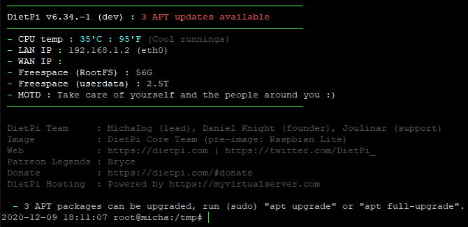

# DietPi Releases

## February 2021 (version 7.0) - Beta

### New optimised software packages

- **DietPi-Software** | **Docker Compose** :octicons-arrow-right-16:  A tool to define and run multi-container Docker applications can now be installed through our software selection. Docker will be pulled in as dependency automatically. For more details check the [documentation page](../software/programming/#docker-compose).
- **DietPi-Software** | **Box86** :octicons-arrow-right-16:  An x86 wrapper/emulator for ARMv7 systems is now available for install. Thanks to it's ability to wrap ARMv7 shared system libraries to be used with i386 binaries, often no additional libraries need to be installed. Thanks to binfmt, it will be invoked automatically when an i386 binary is executed. For more details check the [documentation page](../software/gaming/#box86).
- **DietPi-Software** | **Steam** :octicons-arrow-right-16:  By automatically pulling in Box86 as dependency, Steam can now be installed on ARMv7 boards. It won't run perfectly stable yet and has limited features and game support, but we're optimistic that further improvements will address this in the future. For more details check the [documentation page](../software/gaming/#steam).
- **DietPi-Software** | **mjpg-streamer** :octicons-arrow-right-16: Lightweight multi-source and multi-output plugin JPEG streamer, now available for install. By default your attached camera capture will be streamed to a custom HTTP port. When installed along with OctoPrint, both will be automatically configured to work together. The Raspberry Pi camera module support is enabled by default, when installed on Raspberry Pi.

### Changes / Improvements / Optimisations

- **DietPi-Update**  :octicons-arrow-right-16: A new update check system has been implemented, which checks for a minimum required Debian and DietPi version and migrates systems with either too old Debian version or too old DietPi version to a different Git branch automatically. This especially smoothens the migration of our code base to newer Debian versions and the alternative branch can be used to inform and support Debian distribution upgrades and to upgrade the DietPi code to an intermediate version from where the system can be migrated back to the regular stable/master branch. Since this change required a new repository version file, we took the chance and incremented the DietPi core version to v7.0. This however has no further meaning, all previously supported DietPi and Debian versions remain supported and the change enables us to not require fresh image installs for major upgrades, like the upgrade from v159 to v6.0 did a few years ago.
- **DietPi-Backup** :octicons-arrow-right-16: Support for XFS and ZFS target file system types has been added, which fully support the required symlink and POSIX permissions capabilities.
- **DietPi-Software**  :octicons-arrow-right-16: The mandatory reboot after installs has been removed. Installed services, which are not controlled by DietPi-Services, but would start automatically on reboot, are now started at the end of installs instead. A manual reboot is still a good idea, but strictly required only in rare cases. Many thanks to @Games-Crack for doing this suggesting: <https://github.com/MichaIng/DietPi/issues/4032>
- **DietPi-Software**  :octicons-arrow-right-16: Installs do not imply all APT package upgrades anymore. While we recommend to keep all APT packages upgraded regularly, the new daily APT check and info within the DietPi-Banner, helps to keep you informed to do the best decision youself whether and when to apply which package upgrade. On first run installs the full upgrade is however kept, to assure each image starts in fully upgraded state, and packages which are required for the actual software choices you're installing, are upgraded as well, when installed already.
- **DietPi-Software**  :octicons-arrow-right-16: Uninstalls do not stop other services anymore. E.g. your webserver or media streaming server will stay active while you uninstall that other software that you don't require anymore. Since uninstalls do not require much RAM or CPU resources, this is perfectly fine. Many thanks to @mrgreaper giving the hint: <https://github.com/MichaIng/DietPi/issues/4116>
- **DietPi-Software** - **Unbound** :octicons-arrow-right-16: On install in combination with Pi-hole, no additional configuration file will be created anymore but the adjusted interface binding and port will be applied to "/etc/unbound/unbound.conf.d/dietpi.conf". Declaring "interface" in two configuration files do not override each other but lead to two concurrent bindings, which is not intended. The two files, if present, will be merged as well on DietPi update. It is hence intended that admins change "dietpi.conf" directly, if required, and this file won't be overwritten on reinstalls to preserve local changes. Additionally, on new installs, the configuration file will be better sorted and contain comments to explain their purpose.
- **DietPi-Software** - **Unbound** :octicons-arrow-right-16:  On new installs, by default access is now granted to all private IPv4 and IPv6 address ranges instead of to the 192.168.0.0/16 subnet only, which includes VPNs, containers and cases of multiple local networks the server is attached to.
- **DietPi-Software** - **Unbound** :octicons-arrow-right-16: A monthly cron job is now created to keep the root hints file updated. Many thanks to @APraxx for doing this suggestion: <https://github.com/MichaIng/DietPi/issues/4077>

### Interface updates

- **DietPi-Banner**  :octicons-arrow-right-16: Running the script without input argument will now open the menu instead of printing the banner. The console alias has been adjusted accordingly, so that it is now possible to run "dietpi-banner 0" and "dietpi-banner 1" from console to have full and short banner versions printed. The "dietpi-banner" console command remains opening the menu.

### Fixes:

- **DietPi-Set_swapfile**  :octicons-arrow-right-16: Resolve an issue where "zram"/"zram0" dietpi.txt path entries were dropped, when running the script without input arguments. This especially broke applying zram-swap on first boot. Many thanks to @Dr0bac for reporting this issue: <https://github.com/MichaIng/DietPi/issues/4002>
- **DietPi-Software** | **Bitwarden_RS**  :octicons-arrow-right-16: Resolved an issue where the self-signed TLS certificate could not be imported on iOS. To apply this fix to an existing instance, the configuration file "/mnt/dietpi_userdata/bitwarden_rs/bitwarden_rs.env" needs to be removed or moved to a different location, so "dietpi-software reinstall 183" will re-create the configuration and TLS certificate.
- **DietPi-Software** | **Unbound** :octicons-arrow-right-16:  Resolved an issue where during install in combination with Pi-hole the service restart could have failed. Many thanks to @Ernstian for reporting this issue: <https://github.com/MichaIng/DietPi/issues/2409#issuecomment-739154892>
- **DietPi-Software** | **Unbound**  :octicons-arrow-right-16:  Resolved an issue where the service start failed if the host system had a local IP address outside of the 192.168.0.0/16 subnet. Many thanks to @faxesystem for reporting this issue: <https://github.com/MichaIng/DietPi/issues/2409#issuecomment-749174984>
- **DietPi-Software** | **ReadyMedia**  :octicons-arrow-right-16: Resolved an issue where the media library was not rescanned on service start. Many thanks to @AdamFarnsworth0 for reporting this issue: <https://twitter.com/AdamFarnsworth0/status/1347977813635305475>
- **DietPi-Software** | **WiFi Hotspot** :octicons-arrow-right-16:  Resolved an issue where the install on Armbian-based images with RTL8188C* WiFi chip failed. Many thanks to @smogan71 for reporting this issue: <https://dietpi.com/phpbb/viewtopic.php?t=8523>
- **DietPi-Software** | **Medusa** :octicons-arrow-right-16:  This software option has been disabled on Stretch systems, since it now requires Python >=3.6, which is not available in the Debian Stretch repository. If you run Medusa on a Stretch system, it will continue to work, but updating will either not be possible or break it. Many thanks to @aermak for reporting this issue: <https://github.com/MichaIng/DietPi/issues/3991>
- **DietPi-Software** | **WiringPi** :octicons-arrow-right-16:  Resolved an issue where the install failed, if the /usr/local/bin directory was not present. Many thanks to @bruz for reporting this issue: <https://dietpi.com/phpbb/viewtopic.php?t=8609>
- **DietPi-Software** | **PaperMC**  :octicons-arrow-right-16:  Resolved an issue where the install failed due to changed download URLs and stabilised service start and config creation by setting the Java heap size and allowing more time for the startup on smaller SBCs. Many thanks to @omavoss for reporting this issue: <https://dietpi.com/phpbb/viewtopic.php?p=30191#p30191>
- **DietPi-Software** | **OpenTyrian**  :octicons-arrow-right-16: The install option has been disabled on x86_64, since the Debian package comes with a different file structure and it has been disabled on 64-bit RPi systems, since the binary has been compiled for armhf.
- **DietPi-Software** | **Domoticz** :octicons-arrow-right-16: Resolved an issue where saving custom scripts and starting with a template did not work. Many thanks to @tec13 for reporting this issue: <https://dietpi.com/phpbb/viewtopic.php?t=8627>
- **DietPi-Software**  :octicons-arrow-right-16: Resolved an issue where for ruTorrent, Koel and Bitwarden_RS the automatic newest version detection failed and instead a possibly older fallback was used. Many thanks to @kelvmod for reporting this issue: <https://github.com/MichaIng/DietPi/issues/4105>
- **DietPi-Software** | **LXQt** :octicons-arrow-right-16: Resolved visual issues with our default configuration of Debian Buster, drastically simplified and cleaned up the files we ship.

!!! hint ""

    As always, many smaller code performance and stability improvements, visual and spelling fixes have been done, too much to list all of them here. Check out all code changes of this release on GitHub: <https://github.com/MichaIng/DietPi/pull/4126>

### Known/Outstanding Issues

- DietPi-Config  :octicons-arrow-right-16: Enabling WiFi + Ethernet adapters, both on different subnets, breaks WiFi connection in some cases: <https://github.com/MichaIng/DietPi/issues/2103>
- DietPi-Software | Node-RED  :octicons-arrow-right-16:  Pre-installed modules cannot be updated via web UI: <https://github.com/MichaIng/DietPi/issues/2073>
- DietPi-Software | Raspimjpeg  :octicons-arrow-right-16:  With Lighttpd, streaming mjpeg does not work: <https://github.com/MichaIng/DietPi/issues/1747>
- DietPi-Software | MATE desktop  :octicons-arrow-right-16:  When logging in as root, desktop items and right-click context menu is missing: <https://github.com/MichaIng/DietPi/issues/3160>
- DietPi-Software | Sonarr/Radarr/Mono: With current Mono version 6, import to a file system without UNIX permissions support (exFAT, FAT32/vfat, CIFS mounts and NTFS without "permissions" option) fails, regardless of user/umask mount options: <https://github.com/MichaIng/DietPi/issues/3179>

!!! hint ""

    For all additional issues that may appear after release, please see the following link for active tickets: <https://github.com/MichaIng/DietPi/issues>
  
## December 2020 (version 6.34)

### Overview

Welcome to **December 2020 release** :octicons-gift-16: of DietPi. This release includes **5 new software titles** :octicons-paper-airplane-16:, full support for newly launched **Raspberry Pi 400**, and more interesting features and bug fixes.

As a summary of 2020, DietPi had **8 releases** with over **175 000** downloads. It brought 128 :octicons-light-bulb-16: improvements and changes, as well as 119 :octicons-issue-closed-16: bug fixes.

{: width="447" height="298" loading="lazy"}

### New optimised software packages

**[Portainer - Docker container management](../software/programming/#portainer)**

It is a new software package included in the DietPi optimised list. Portainer simplifies your Docker container management via Portainer web interface. It enables faster deploy of the applications and it gives real time visibility.

For more details check the [documentation page](../software/programming/#portainer).

{: width="1159" height="636" loading="lazy"}

Many thanks to @Joulinar for implementing this software option - more details here: MichaIng/DietPi#3933

**[PaperMC - Highly optimised Minecraft server](../software/gaming/#papermc)**

PaperMC extends the list of Minecraft servers supported by DietPi. It is a high performance fork of the Spigot Minecraft Server that aims to fix gameplay and mechanics inconsistencies as well as to improve performance. It is written in Java, and it is extensible via plugins, now available for install.

For more details check the [documentation page](../software/gaming/#papermc).

{: width="606" height="363" loading="lazy"}

Many thanks to @ravenclaw900 for implementing this software option: MichaIng/DietPi#3828

**[Tor Relay - Become part of the Tor Project](../software/advanced_networking/#tor-relay)**

Become part of the Tor Project and turn your DietPi into a Tor relay to help others surf the Internet safely and privately.

For more details check the [documentation page](../software/advanced_networking/#tor-relay).

{: width="200" height="121" loading="lazy"}

Many thanks to @ravenclaw900 for implementing this software option: MichaIng/DietPi#3921.

**[Unbound - Open Source DNS resolver](../software/dns_servers/#unbound)**

Validating, recursive, caching DNS resolver is now available for install and integrate with [Pi-hole](../software/dns_servers/#pi-hole).

For more details check the [documentation page](../software/dns_servers/#unbound)

{: width="603" height="331" loading="lazy"}

Many thanks to @ravenclaw900 for implementing this software option: MichaIng/DietPi#3872

**[Bitwarden_RS - password manager server](../software/cloud/#bitwarden_rs)**

Bitwarden_RS is a an unofficial Bitwarden password manager server with web UI, written in Rust and it is perfect for self-hosted deployments.

For more details check the [documentation page](../software/cloud/#bitwarden_rs)

{: width="2000" height="823" loading="lazy"}

Many thanks to @CactiChameleon9 for implementing this software option (MichaIng/DietPi!3724).

### New supported SBC

 New [Raspberry Pi 400](https://www.raspberrypi.org/blog/raspberry-pi-400-the-70-desktop-pc/) is now fully supported. Inspired by the home computers of the 1980s, Raspberry Pi 400 is a complete personal computer, built into a compact keyboard.

 For more details on how to install DietPi, check the [documentation](../hardware/#raspberry-pi).

 {: width="800" height="571" loading="lazy"}

### Changes / Improvements / Optimisations

- **Enable automated APT package update checks and even upgrade them on a daily bases**. By setting the new **dietpi.txt** setting

    ```bash
    CONFIG_CHECK_APT_UPDATES = 1
    ```

    you can enable daily APT update checks (default value). The result is shown in the DietPi login banner, in a similar way an available DietPi update is presented.

    dietpi-automated_APT_package_update
    {: width="670" height="326" loading="lazy"}

    Set

    ```bash
    CONFIG_CHECK_APT_UPDATES = 2
    ```

    to have _APT packages upgraded automatically_ on a daily basis with logs saved in next file `/var/tmp/dietpi/logs/dietpi-update_apt.log`. Cron is used for the schedule, which means that you can control the execution time via `dietpi-cron > "cron.daily"`.

    Many thanks to @ravenclaw900 for implementing this feature: <https://github.com/MichaIng/DietPi/pull/3899>

- **DietPi Documentation** has been extended. It covers now all the **[DietPi Optimised Software](../software/)** categories. Many thanks to @StephanStS for bringing all these updates.

    {: width="1335" height="667" loading="lazy"}

- **DietPi-Globals** :octicons-arrow-right-16: In DietPi scripts, the PATH variable is now overwritten with the Debian/bash system default to assure that no broken or manipulated PATH can be passed via e.g. "su" or "sudo -E".

    This means that overrides must be placed in /usr/local/(s)bin now, which as well was the only save location for system-wide overrides before. Many thanks to @tandy-1000 for reporting a related issue (MichaIng/DietPi!3873).

- **DietPi-Set_swapfile** :octicons-arrow-right-16: Hardened permissions of the /dev/zram0 zram-swap device to be only accessible by root user (mode 0600) and interpret input argument "/dev/zram0" and "zram0" as zram-swap as well, aside of "zram" only. Many thanks to @hansjuergenmay for reporting a related issue (MichaIng/DietPi!3869).

- **[DietPi-NordVPN](../software/vpn/#dietpi-nordvpn)** :octicons-arrow-right-16: A function has been added update the NordVPN server list, e.g. when new servers are available that are closer to your location.

- **[DietPi-JustBoom](../dietpi_tools/#configuration)** :octicons-arrow-right-16: The ALSA equalizer settings are not stored to /var/lib/dietpi/dietpi-config/.alsaequal.bin where all users/services can read it and all members of the "dietpi" group (or root) can create and write to it. Many thanks to @wowcut for reporting this issue (MichaIng/DietPi!3950).

- **[DietPi-Config | Raspberry Pi](../dietpi_tools/#display-options)** :octicons-arrow-right-16: When applying less than 32 MiB GPU memory, the VCSM (VideoCore Shared Memory) device and kernel module are disabled now. The automatically loaded cut-down firmware files do not support it which leads to currently 5 expected kernel error messages. Disabling it in the first place might marginally speed up boot and reduce memory usage, but more importantly reduces confusion or worries induced by to the error messages.

- **[DietPi-Config | Audio Options](../dietpi_tools/#audio-options)** :octicons-arrow-right-16: Added an option to switch between direct audio output and automatic software conversions, for channels, format and rate via ALSA "plug" plugin. This may be required to play any raw wav file regardless of sound card capabilities and without defining supported values manually. Having automated software conversions enabled matches the Debian ALSA defaults but may increase CPU usage and decrease sound quality.

- **[DietPi-Config | Raspberry Pi](../dietpi_tools/#advanced-options)**: When enabling I2C support, the Python 3 SMbus module is now installed instead of the deprecated Python 2 version. This matches as well the dependency of PiJuice, which nowadays pulls Python 3 SMbus as package dependency, hence this change avoids the obsolete install of the whole Python 2 stack when PiJuice is installed through dietpi-software. Many thanks to @Trunkzeh for reporting this issue: <https://github.com/MichaIng/DietPi/issues/3963#issuecomment-748547394>

- **[DietPi-Software | OpenBazaar](../software/social/#openbazaar)** :octicons-arrow-right-16: Build is now done with the currently latest Go v1.15.3 and the service runs as unprivileged user `openbazaar` instead of `root`.

- **[DietPi-Software | XRDP](../software/remote_desktop/#xrdp)** :octicons-arrow-right-16: Remote desktop connections can now be done with the "Xorg" method and hence don't require an active VNC server anymore. New installes will not pull TigerVNC as dependency and if only RDP is required, TigerVNC can be uninstalled.

- **[DietPi-Software | Single File PHP Gallery](../software/social/#image-gallery)** :octicons-arrow-right-16: Updated new installs to latest v4.7.1. Run "dietpi-software reinstall 56" to upgrade your existing instance.

- **[DietPi-Software | MineOS](../software/gaming/#mineos)** :octicons-arrow-right-16: A systemd service is now used to run the daemon in favour of the previous supervisor, the obsolete `mineos` user is not created anymore, Node.js v11 is used to build MineOS, obsolete dependencies have been removed and a reinstall will now perform a MineOS upgrade and the existing `/etc/mineos.conf` is not replaced anymore.

- **[DietPi-Software | Mycroft AI](../software/hardware_projects/#mycroft-ai)** :octicons-arrow-right-16: By default, the ALSA automatic conversions plugin is enabled now on install, which enables OOTB compatibility with all wav sound formats and sound card. Additionally listener sampling rate override (48000 Hz) has been removed, reverting to Mycroft default (16000 Hz), which might solve an issue with hanging microphone level in CLI and related failing voice detection.

- **[DietPi-Software | Gogs](../software/cloud/#gogs)** :octicons-arrow-right-16: Has been enabled for ARMv8 boards and on ARMv7 boards the newest version is installed again, which was not the case since Gogs v0.12. due to changed download names. Many thanks to [phpBB:MadKernel](https://dietpi.com/phpbb/memberlist.php?username=MadKernel) for bringing ARMv8 support back to our attention: <https://dietpi.com/phpbb/viewtopic.php?t=8276>

- **[DietPi-Software | Folding@Home](../software/computational_science/#foldinghome)** :octicons-arrow-right-16: Is now available for ARMv8 (arm64) boards. Donate your idle CPU power to help researchers fighting against diseases like Cancer, Alzheimer, Ebola and COVID-19.

- **[DietPi-Software | Radarr](../software/bittorrent/#radarr)** :octicons-arrow-right-16: Has been upgraded to the newest major version 3, including the required branch migration (from "develop" to "master") and, for non-ARMv6 boards, a migration to the now available .NET-based build away from Mono. This change is applied to all DietPi systems via Radarr reinstall, preserving your data and configs of course.

- **[DietPi-Software | OctoPrint](../software/printing/#octoprint)** :octicons-arrow-right-16: Is now available via PyPI repository, hence can be installed and updated easier and faster without downloading and building from the sources. Git is not required anymore, as the internal updater as well uses Python pip only. We migrate all DietPi OctoPrint instances to the new version and new install method, so that the Git/install directory /opt/octoprint is obsolete and removed. All your data will be preserved, of course. Many thanks to @Stinocon for reporting issues related to our previous implementation: <https://github.com/MichaIng/DietPi/issues/3940>

### Removed Software Packages

- **DietPi-Software | CloudPrint** :octicons-arrow-right-16: This software option has been removed, since the Google Cloud Print service will be shut down at the end of 2020 and we don't want to offer software options which will work for at most two months. Please migrate to another printing solution in time. Already installed CloudPrint instances will remain installed and the system service remains functional until the end of the year. With the first DietPi release in 2021 we will remove service handling and offer the package removal during the update process. Further information can be found here: <https://www.google.com/cloudprint/learn/>

- **DietPi-Software | Tonido** :octicons-arrow-right-16: This software option has been removed, since it is not developed anymore fore three years, no sources have been found and the latest binaries require ancient library versions which fail to be easily installed on currently supported Debian versions.

### Bug Fixes

- **[DietPi-Config](../dietpi_tools/#configuration)** :octicons-arrow-right-16: Resolved an issue on RPi where the onboard 3.5mm jack selection did not work if an HDMI screen was attached. When selecting explicit either HDMI audio or onboard 3.5mm jack, the other one is now disabled on device tree level, which means it cannot be switched without reboot. This is currently the only known way to assure that 3.5mm jack is used for audio output regardless of now or later attached or detached HDMI screens. Many thanks to @corasaniti for reporting this issue: <https://github.com/MichaIng/DietPi/issues/3887>

- **[DietPi-Config](../dietpi_tools/#configuration)** :octicons-arrow-right-16: Resolved an issue on RPi where selecting the waveshare32 LCD panel installed an outdated device tree overlay, incompatible with the current Linux 5.4 kernel. Many thanks to @black00019 for reporting this issue: <https://github.com/MichaIng/DietPi/issues/3881>

- **[DietPi-Services](../dietpi_tools/#configuration)** :octicons-arrow-right-16: Resolved an issue where CPU affinity selection failed due to a syntax error.

- **DietPi-Bugreport** :octicons-arrow-right-16: Resolved an issue where bug report uploads were cancelled if connection test on port 80/443 failed even that uploads are done via SFTP on port 22.

- **DietPi-Cleaner** :octicons-arrow-right-16: Resolved an issue where cleaner selection failed with a syntax error.

- **DietPi-Sync** :octicons-arrow-right-16: Resolved an issue where setting the delete mode to "On" did not have any effect on it. Many thanks to [phpBB:mafioso12dk](https://dietpi.com/phpbb/memberlist.php?username=mafioso12dk) for reporting this issue: <https://dietpi.com/phpbb/viewtopic.php?t=8226>

- **DietPi-Banner** + **[DietPi-NordVPN](../software/vpn/#dietpi-nordvpn)** :octicons-arrow-right-16: Resolved an issue where WAN IP changed to a multi-line output. Many thanks to @maartenlangeveld for reporting this issue: <https://github.com/MichaIng/DietPi/issues/3908>

- **[DietPi-CloudShell](../software/system_stats/#dietpi-cloudshell)** :octicons-arrow-right-16: Resolved an issue where scene selection failed with a syntax error. Many thanks to @ravenclaw900 for reporting this issue: <https://github.com/MichaIng/DietPi/issues/3880>

- **[DietPi-Software | PiVPN](../software/vpn/#pivpn)** :octicons-arrow-right-16: Resolved an issue where the installer hang since the interactive whiptail dialogues were not shown on console. Many thanks to @kelliegator for reporting this issue: <https://github.com/MichaIng/DietPi/issues/3844>

- **[DietPi-Software | Medusa](../software/bittorrent/#medusa)** :octicons-arrow-right-16: Resolved an issue where Medusa failed to start after install. Many thanks to @Luan7805 for reporting this issue: <https://github.com/MichaIng/DietPi/issues/3842>

- **[DietPi-Software | Webservers](../software/webserver_stack/#webservers)** :octicons-arrow-right-16: Resolved an issue where reinstall failed if `/var/www/html` did not exist.

- **[DietPi-Software | Lighttpd](../software/webserver_stack/#lighttpd)** :octicons-arrow-right-16: Resolved an issue where (re)install failed if the fastcgi or fastcgi-php module was enabled already.

- **DietPi-Software** | **O!MPD** :octicons-arrow-right-16: Resolved an issue where the URL check for youtube-dl failed.

- **[DietPi-Software | Single File PHP Gallery](../software/social/#image-gallery)** :octicons-arrow-right-16: Resolved an issue where directory previews were not shown due to missing permissions. Many thanks to [phpBB:tallbastard](https://dietpi.com/phpbb/memberlist.php?username=tallbastard) for reporting this issue: <https://dietpi.com/phpbb/viewtopic.php?p=28155#p28155>

- **[DietPi-Software | WebIOPi](../software/hardware_projects/#webiopi)** :octicons-arrow-right-16: Resolved an issue where the download and install failed.

- **[DietPi-Software | Nginx](../software/webserver_stack/#nginx)** :octicons-arrow-right-16: Resolved an issue where the amount of worker processes was not set to the amount of CPU threads as intended.

- **[DietPi-Software | MineOS](../software/gaming/#mineos)** :octicons-arrow-right-16: Resolved an issue where the Node.js downgrade an hence the web UI compiling failed. Many thanks to @CactiChameleon9 for reporting this issue: <https://github.com/MichaIng/DietPi/issues/3901>

- **[DietPi-Software | Mycroft AI](../software/hardware_projects/#mycroft-ai)** :octicons-arrow-right-16: Resolved an issue where skill installs failed due to missing permissions. Many thanks to [phpBB:GreenGentleman](https://dietpi.com/phpbb/memberlist.php?username=GreenGentleman) for reporting this issue: <https://dietpi.com/phpbb/viewtopic.php?p=28464#p28464>

- **[DietPi-Software | Jellyfin](../software/media/#jellyfin)** :octicons-arrow-right-16: Resolved an issue where Jellyfin did not run on ARMv6 (RPi 1 and Zero models). ARMv6/Raspbian-compatible binaries are now shipped via different APT repository. Many thanks to [phpBB:Shiivu](https://dietpi.com/phpbb/memberlist.php?username=Shiivu) for reporting this issue: <https://dietpi.com/phpbb/viewtopic.php?t=8263>

- **[DietPi-Software | WiFi Hotspot](../software/advanced_networking/#wifi-hotspot)** :octicons-arrow-right-16: Resolved an issue on RPi with WiFi adapters using an RTL8188C* chip, where the service failed to start due to an invalid driver. Many thanks to [phpBB:yerc](https://dietpi.com/phpbb/memberlist.php?username=yerc) for reporting this issue: <https://dietpi.com/phpbb/viewtopic.php?p=28984#p28984>

- **[DietPi-Software | OctoPrint](../software/printing/#octoprint)** :octicons-arrow-right-16: Resolved an issue where the service and system could not be restarted anymore via OctoPrint web UI and, on RPi, the CPU throttling state could not be derived.

- **[DietPi-Software | Ampache](../software/media/#ampache)** :octicons-arrow-right-16: Resolved an issue where the install failed due to an incompatible PHP composer version and it was not possible to update the configuration file to a new version through the web interface. Many thanks to [phpBB:kk345](https://dietpi.com/phpbb/memberlist.php?username=kk345) for reporting these issues: <https://dietpi.com/phpbb/viewtopic.php?t=8367>

As always, many smaller code performance and stability improvements, visual and spelling fixes have been done, too much to list all of them here. Check out all code changes of this release on GitHub.

### Known/Outstanding Issues

- DietPi-Config :octicons-arrow-right-16: Enabling WiFi + Ethernet adapters, both on different subnets, breaks WiFi connection in some cases: <https://github.com/MichaIng/DietPi/issues/2103>

- [DietPi-Software | Node-RED](../software/hardware_projects/#node-red) :octicons-arrow-right-16: Pre-installed modules cannot be updated via web UI: <https://github.com/MichaIng/DietPi/issues/2073>

- DietPi-Software | Raspimjpeg :octicons-arrow-right-16: With Lighttpd, streaming mjpeg does not work: <https://github.com/MichaIng/DietPi/issues/1747>

- [DietPi-Software | MATE desktop](../software/desktop/#mate) :octicons-arrow-right-16: When logging in as root, desktop items and right-click context menu is missing: <https://github.com/MichaIng/DietPi/issues/3160>

- DietPi-Software | [Sonarr](../software/bittorrent/#sonarr) / [Radarr](../software/bittorrent/#radarr) / Mono :octicons-arrow-right-16: With current Mono version 6, import to a file system without UNIX permissions support (exFAT, FAT32/vfat, CIFS mounts and NTFS without "permissions" option) fails, regardless of user/umask mount options: <https://github.com/MichaIng/DietPi/issues/3179>.

For all additional issues that may appear after release, please see the following link for active tickets: <https://github.com/MichaIng/DietPi/issues>

## October 2020 (version 6.33)

### Highlights

- **Bazarr** is the latest application from DietPi optimised software portfolio. It is a companion application to Sonarr and Radarr, and manages and downloads subtitles based on defined requirements.

    {: width="1898" height="1080" loading="lazy"}

    For more details on installation and configuration open [DietPi Optimised Software - Bazarr](../software/bittorrent#bazarr) page.

    Companion application to Sonarr and Radarr, which manages and downloads subtitles based on your requirements, now available for install. Open [Bazarr](../software/bittorrent#bazarr) page in [Optimised software](../software/).
    Many thanks to @DiogoAbu for doing this suggestion [Issue #2045](https://github.com/MichaIng/DietPi/issues/2045)

- **Docker logging available in RAM/journald**

    This feature is now available to newly fresh Docker installs or reinstalls. Logs are now done with limited verbosity to systemd-journald (RAM). They could be accessible running next command:

    ```bash
    journalctl -u docker -u containerd
    ```

    This change brings the advantage of reduced disk writes, as well as makes logs accessible to system journal (external to containerised environment). To fully benefit from this improvement, Docker can be reinstalled using next command:

    ```bash
    dietpi-software reinstall 162
    ```

    Many thanks to @SaturnusDJ for doing this suggestion: [Issue #2388](https://github.com/MichaIng/DietPi/issues/2388)

### Improvements

- **DietPi-Login** :octicons-arrow-right-16: Logins do not wait for DietPi-PostBoot to finish anymore, as this is not strictly required. On local console, DietPi-PostBoot processing output practically blocks login until finished or timed out and logins on any other console like SSH or serial do not require it. DietPi-PostBoot only checks for DietPi updates, starts background services and prints the pre-login banner to local console, nothing that is required for console usage.
- **DietPi-Autostart**  :octicons-arrow-right-16: Autostart programs with a foreground process are now started as replacement for the DietPi-Login process via "exec" which saves 3-4 MiB RAM usage.
- **DietPi-Software**  :octicons-arrow-right-16: When using an invalid input argument, dietpi-software now prints usage info to the terminal.
- **DietPi-Software** :octicons-arrow-right-16: The `"dietpi"` UNIX group has been made the primary group for all services which ran with `"Group=dietpi"` before: Transmission, Mopidy, MiniDLNA, Airsonic, Plex Media Server, Emby Server, Medusa, Tonido, Blynk Server, SABnzbd, Koel, NZBGet.

    If the user (+group) is created by an external package or installer, the original primary group is kept as supplementary group to not possibly break access permissions to pre-created directories and files.
    Currently, only exception from these changes is _Deluge_ - we don't want to run the separate web UI service with `dietpi` group permissions. In case of _Tautulli_, the `dietpi` group permissions are remove, since _Tautulli_ does not require it.

- **DietPi-Software**  :octicons-commit-24:  **phpBB** :octicons-arrow-right-16: New phpBB installations will be done using version 3.3.1. Existing instances won't be touched, as updates need to be done manually through the internal update mechanism, which includes the mandatory database migration.

    New phpBB installations will now be placed in `/var/www/phpbb` folder. The earlier installation location `/var/www/phpBB3` will still be handled gracefully, if available.

- **DietPi-Software** :octicons-commit-24:  **OctoPrint** :octicons-arrow-right-16: The service runs now as user `"octoprint"`, the Git branch directory has been moved to `/opt/octoprint` and `/mnt/dietpi_userdata/octoprint` is the run users home and hence config and data directory now.

    To apply these changes, OctoPrint is reinstalled with DietPi v6.33, which includes the Python 3 migration (see v6.32 changelog) on Buster and Bullseye systems. This implies that the CLI (`"octoprint"` command) needs to be executed as user `"octoprint"` to invoke the correct configuration.

    A bash shell alias solves this automatically for all users with sudo permissions, but if you use a custom shell, the CLI needs to be called like:

    ```bash
    sudo -u octoprint octoprint <command>
    ```

    Many thanks to @ModischFabrications for reporting an issue that is related to the fact that the service ran as root user before: [Issue #3315](https://github.com/MichaIng/DietPi/issues/3315)

- **DietPi-Software** :octicons-commit-24: **Tautulli** :octicons-arrow-right-16: Directories, user and service are renamed from `"plexpy"` to `"tautulli"`.

    Additionally it runs with Python 3 now instead of Python 2. These changes are applied as well during DietPi update.

- **DietPi-Software** :octicons-commit-24: **Baïkal** :octicons-arrow-right-16: Update (re)install procedure to cover the new config directory and use the pre-packed release archives instead of raw source and composer.

    The webserver configurations have been added to harden access permissions.

- **DietPi-Software**  :octicons-commit-24: **Mosquitto** :octicons-arrow-right-16: The official APT repository is now used where possible, which currently excludes ARMv8/arm64 and Raspbian/Debian Bullseye. This change is applied via reinstall during DietPi update.

    Many thanks to @marcobrianza for doing this suggestion: [Issue #3042](https://github.com/MichaIng/DietPi/issues/3042)

- **DietPi-Software** :octicons-commit-24: **Cuberite** :octicons-arrow-right-16: A wrong directory name based on a typo has been fixed.

    A reinstall updates Cuberite and moves its install directory to `/mnt/dietpi_userdata/cuberite` as intended. This is applied via DietPi update but a backup is created to cover issues due to potential structural changes, especially for older instances installed at /etc/cuberite.

- **DietPi-Software** :octicons-commit-24: **Amiberry** :octicons-arrow-right-16: An update to Amiberry v3.3 is applied during DietPi v6.33 update.

- **DietPi-Software** :octicons-commit-24: **LXDE** :octicons-arrow-right-16: By default, when double-clicking a desktop icon or executable file, it will be executed directly now, without being asked first what to do. This behaviour can be changed from within PCManFM file manager > "Edit" > "Preferences" > "General" > "Don't ask options to launch executable file".

### Documentation improvements

- **Installation guide** :octicons-arrow-right-16: It has been fully changed & simplified. There is a single page with more tabs. The page highlights different steps used for different platforms, while it keeps the common structure. Many thanks to @StephanStS for doing these updates.

- **Writing rules** :octicons-arrow-right-16: The documentation has evolved. It starts to have a file naming convention, more url updated and so on. Many thanks to @StephanStS for doing these updates.

### API Changes

- **DietPi-Globals** :octicons-arrow-right-16: The G_FP_DIETPI_USERDATA variable has been removed. Variables cannot be used in every context, e.g. not in config files stored on GitHub or dietpi.com for download, its value "/mnt/dietpi_userdata" does not change and using the path literally allows slightly simplified and hardened coding.

### Bug Fixes

- **General** :octicons-arrow-right-16: Resolved an issue where using `AUTO_UNMASK_LOGIND=1` or enabling Amiberry fastboot did not allow to start `systemd-logind` as intended if the required dbus package was not installed before.

    Many thanks to @razerbann for reporting this issue: [Issue #3770](https://github.com/MichaIng/DietPi/issues/3770)

- **RPi** :octicons-arrow-right-16: Resolved an issue where Allo USBridge Sig (ASIX AX88179) Ethernet fails due to non-matching driver.

    Many thanks to @dsnyder0pc for reporting this issue any many thanks to Allo for providing stable branch driver builds and a method to compare kernel module layouts: [Issue #3725](https://github.com/MichaIng/DietPi/issues/3725)

- **DietPi-Backup** :octicons-arrow-right-16: Resolved an issue where F2FS was not supported as target location. Since it has full UNIX permissions and symlinks support and can be used as rootfs file system, it can be used for OS backups as well.

    Many thanks to @Cjkeenan for reporting this issue: [Issue #606](https://github.com/MichaIng/DietPi/issues/606#issuecomment-695944450)

- **DietPi-Set_swapfile** :octicons-arrow-right-16: Resolved an issue where swapon failed on ext4 due to an external bug in Linux 5.7 and 5.8. The script now tries quick and less write-intense fallocate pre-allocation first, regardless of kernel version and file system type, and falls back to dd in case of failure. Many thanks to @auanasgheps for reporting this issue: [Issue #3756](https://github.com/MichaIng/DietPi/issues/3756)

- **DietPi-Config** :octicons-arrow-right-16: Resolved an issue where on devices with old Linux kernel versions (e.g. Sparky SBC with Linux 3.10.38) the Performance Options failed to open with a syntax error. Many thanks to @dsnyder0pc for reporting this issue: [Issue #3799](https://github.com/MichaIng/DietPi/issues/3799)

- **DietPi-Config** :octicons-arrow-right-16: Resolved an issue on RPi 2 where a wrong default SDRAM frequency was shown, which is 450 MHz instead of 400 MHz with current firmware.

- **DietPi-Software**  :octicons-commit-24: **OpenTyrian** :octicons-arrow-right-16: The autostart option and run script have been fixed and slightly enhanced to lower RAM usage a bid.

- **DietPi-Software** :octicons-commit-24: **Firefox Sync Server** :octicons-arrow-right-16: Resolved an issue where the build failed due to missing MySQL/MariaDB headers, newly required. Many thanks to @kinoushe for reporting this issue: [Issue #3744](https://github.com/MichaIng/DietPi/issues/3774)

- **DietPi-Software** :octicons-commit-24: **Firefox Sync Server** :octicons-arrow-right-16: Resolved another issue where the build failed due to transition of the whole project from Python to Rust. We now stay on a fixed commit and won't ship newer Firefox Sync Server versions until this transition has been fully completed, as the install process and requirements will constantly change. Many thanks again to @kinoushe for reporting this issue.

- **DietPi-Software** :octicons-commit-24: **LXDE** :octicons-arrow-right-16: Resolved several issues due to conflicts between the RPi desktop LXDE packages with native LXDE.

- **DietPi-Software** :octicons-commit-24: **Webmin** :octicons-arrow-right-16: Worked around an issue where install failed. Webmin depends on `apt-show-versions` which does not support compressed APT list files, which has been implemented as default with DietPi v6.32.

- **DietPi-Software** :octicons-commit-24: **WebIOPi** :octicons-arrow-right-16: Resolved an issue where the download failed.

- **DietPi-Software** :octicons-commit-24: **Home Assistant** :octicons-arrow-right-16: Resolved an issue where install failed on ARM due to missing new build dependency.

    Many thanks to @pbutterworth for reporting and [phpBB:novitibo](https://dietpi.com/phpbb/memberlist.php?username=novitibo) for providing the solution: [Issue Forum](https://dietpi.com/phpbb/viewtopic.php?f=11&t=8095)

- **DietPi-Software** :octicons-commit-24: **Kodi** :octicons-arrow-right-16: Resolved an issue on Odroid XU4 where install failed due to missing librockchip-mpp1 package which instead was aimed to be installed on Odroid N1 only.

- **DietPi-Software** :octicons-commit-24: **TigerVNC+LXDE** :octicons-arrow-right-16: Resolved an issue where `lxappearance` start ("Customize Look and Feel") hangs within TigerVNC sessions.

- **DietPi-Software** :octicons-commit-24: **Fail2Ban** :octicons-arrow-right-16: Resolved an issue where the service could have failed to start due to a missing variable declaration in our default config. Many thanks to [phpBB:mafioso12dk](https://dietpi.com/phpbb/memberlist.php?username=mafioso12dk) for reporting this issue: <https://dietpi.com/phpbb/viewtopic.php?f=11&t=8147>

- **DietPi-Software** :octicons-commit-24: **DietPi-RAMlog** :octicons-arrow-right-16: Resolved an issue where /var/log content was not restored when reinstalling DietPi-RAMlog, e.g. when swiching logging mode from #1 to #2. This could have led to service start issues, when those rely on log files or directories being present.

    Many thanks to [phpBB:djashdj](https://dietpi.com/phpbb/memberlist.php?username=djashdj) for reporting this issue: <https://dietpi.com/phpbb/viewtopic.php?f=11&t=8163>

As always, many smaller code performance and stability improvements, visual and spelling fixes have been done, too much to list all of them here. Check out all code changes of this release on GitHub: <https://github.com/MichaIng/DietPi/pull/XXXX>

### Known/Outstanding Issues

- **DietPi-Config** :octicons-arrow-right-16: Enabling WiFi + Ethernet adapters, both on different subnets, breaks WiFi connection in some cases: [Issue #2103](https://github.com/MichaIng/DietPi/issues/2103)
- **Odroid C2** :octicons-arrow-right-16: Some WiFi adapters do no work as hotspot: [Issue #1955](https://github.com/MichaIng/DietPi/issues/1955)
- **DietPi-Software** :octicons-commit-24: **Node-RED** :octicons-arrow-right-16: Pre-installed modules cannot be updated via web UI: [Issue #2073](https://github.com/MichaIng/DietPi/issues/2073)
- **DietPi-Software** :octicons-commit-24: **Raspimjpeg** :octicons-arrow-right-16: With Lighttpd, streaming mjpeg does not work: [Issue #1747](https://github.com/MichaIng/DietPi/issues/1747)
- **DietPi-Software** :octicons-commit-24: **MATE desktop** :octicons-arrow-right-16: When logging in as root, desktop items and right-click context menu is missing: [Issue #3160](https://github.com/MichaIng/DietPi/issues/3160)
- **DietPi-Software** :octicons-commit-24: **Sonarr/Radarr/Mono** :octicons-arrow-right-16: With current Mono version 6, import to a file system without UNIX permissions support (exFAT, FAT32/vfat, CIFS mounts and NTFS without "permissions" option) fails, regardless of user/umask mount options: [Issue #3179](https://github.com/MichaIng/DietPi/issues/3179)
- **DietPi-Software** :octicons-commit-24: **Transmission** :octicons-arrow-right-16: On Raspbian/Debian Stretch, RAM usage raises unlimited over time: [Issue #2413](https://github.com/MichaIng/DietPi/issues/2413)

For all additional issues that may appear after release, please see the following link for active tickets: <https://github.com/MichaIng/DietPi/issues>

## August 2020 (version 6.32)

### Improvements

- **New SBC cards supported:** **NanoPi NEO3** · **NanoPi R2S** · **NanoPi K2** :octicons-heart-16: [see NanoPi series](../hardware/#nanopi-series-friendlyarm)
- **DietPi-Set_swapfile** :octicons-arrow-right-16: Added support for zram-based swap space. Use "zram" as swap location to have a zram device created (persistently via udev rule) at /dev/zram0 and used for compressed in-memory swap space. The auto-size option "1" will result in a zram size of 50% of physical RAM size, else the MiB value will be used, as long as its smaller than physical RAM size. Many thanks to @rickalm for pushing this topic with an initial implementation: [#3705](https://github.com/MichaIng/DietPi/pull/3705)
- **DietPi-Drive_Manager** :octicons-arrow-right-16: For NTFS mounts, the "big_writes" mount option is now added by default, which reduces CPU load and by this may increase performance. Many thanks to @balexandrov for suggesting this enhancement: [#3330](https://github.com/MichaIng/DietPi/issues/3330#issuecomment-654072107)
- **DietPi-Config** :octicons-arrow-right-16: Added selection of schedutil and userspace CPU frequency governors. Schedutil is a modern dynmic governor which sets frequency tightly related and according to metrics of the CPU scheduling driver itself. Userspace is a no-op governor, i.e. it does not touch CPU frequencies at all which allows setting manual/custom frequencies according to own metrics or via scripts. Read more about native Linux CPU frequency scaling [kernel.org - Generic scaling](https://www.kernel.org/doc/html/latest/admin-guide/pm/cpufreq.html#generic-scaling-governors)
- **DietPi-Config** :octicons-commit-24: **RasperryPI** :octicons-arrow-right-16: Removed the option to switch the deprecated max_usb_current setting in config.txt. Max USB current is now enabled by default via firmware on all RPi models: [#1655](https://github.com/raspberrypi/documentation/issues/1655)
- **DietPi-LetsEncrypt** :octicons-commit-24: **Lighttpd** :octicons-arrow-right-16: Updated our default SSL cipher to match newer standards, still intermediate and compatible with Debian Stretch (Lighttpd v1.4.45). Additionally our config file names have been adjusted to use lighty-enable|disable-mod and priority prefixes to allow ordering own custom configs/vhosts more easily around them. Many thanks to @PanosssD for making us aware of this: [#3707](https://github.com/MichaIng/DietPi/issues/3707)
- **DietPi-Software** :octicons-commit-24: **Komga** :octicons-arrow-right-16: FOSS home server for comics and mangas, now available for install as ID 179. Many thanks to @himura95 for providing the implementation: [#3403](https://github.com/MichaIng/DietPi/issues/3403)
- **DietPi-Software** :octicons-commit-24: **Jellyfin** :octicons-arrow-right-16: A FOSS web interface media streaming server available for install. Many thanks to all who voted for it: <https://feathub.com/MichaIng/DietPi/+63>
- **DietPi-Software** :octicons-commit-24: **Airsonic** :octicons-arrow-right-16: It is now available on Debian Buster systems since Java 11 support has been added. Many thanks to @linxiaopi for pointing us at the required re-evaluation: [#3732](https://github.com/MichaIng/DietPi/issues/3732)
- **DietPi-Software** :octicons-arrow-right-16: On the uninstall information prompt, the info has been added that uninstalling usually means that related userdata and configs are purged as well. Additionally "dietpi-software reinstall <ID>" is mentioned now as alternative to repair/update installed software. Many thanks to @kpine for doing this request: [#3550](https://github.com/MichaIng/DietPi/issues/3550)
- **DietPi-Software** :octicons-commit-24: **Python pip** :octicons-arrow-right-16: octicons-arrow-right-16: We migrated this software selection to a Python3/pip3 install only, due to Python2 EOL in 2020/01. Where possible, dependant software selections have been migrated to Python3 builds, where not possible, Python2/pip2 is installed separately for now. We hope that most affected software titles will do Python3 releases soon, otherwise we will remove them form our portfolio, at latest in spring 2021. The strongest reason for this is that next Debian Bullseye (summer 2021) will not ship Python2 packages anymore.
- **DietPi-Software** :octicons-commit-24: **SABnzbd** :octicons-arrow-right-16: Migrated to a Python3-based install.
- **DietPi-Software** :octicons-commit-24: **OctoPrint** :octicons-arrow-right-16: On Debian Buster and up, migrated to a Python3-based install.
- **DietPi-Software** :octicons-commit-24: **Wordpress** :octicons-arrow-right-16: Plugins can now be installed and the internal updater used OOTB without the need to manually apply correct file permissions first. Many thanks to @Joulinar for implementing this: [#3720](https://github.com/MichaIng/DietPi/pull/3720)
- **DietPi-Software** :octicons-commit-24: **ProFTPD** :octicons-arrow-right-16: On fresh installs, reverse DNS lookups are disabled by default now by adding "UseReverseDNS off" to /etc/proftpd/proftpd.conf. This increases login speeds, in case dramatically, depending on reverse DNS server. Additionally file uploads can now be resumed by default via "AllowStoreRestart On" and members of the "dietpi" group have write access to uploaded files ("Umask 002") to increase OOTB compatibility with media and file sharing software. Many thanks to @bbsixzz for doing these suggestions: [#3727](https://github.com/MichaIng/DietPi/issues/3727)
- **DietPi-Software** :octicons-commit-24: **HTPC Manager** :octicons-arrow-right-16: Migrated to a Python3-compatibe fork initiated by @gmiranda (<https://github.com/HTPC-Manager/HTPC-Manager>), since the previous fork stopped development. Please help test, and when possible contribute to this project to keep it alive. We'll do minimal tests and assure the basic install and web interface works fine from Debian Stretch till Debian Bullseye.

### API Changes

- **DietPi-Set_swapfile** - Running the script without input arguments does not print the current swap file location and size anymore but will apply the settings stored in dietpi.txt, refresh the current swap file or apply defaults as fallback. Currently active swap files can be reliably checked via /proc/swaps or htop.

### Bug Fixes

- **General** :octicons-arrow-right-16: Resolved an issue where enabling or disabling IPv6 removed the expected symlink at /etc/sysctl.d/99-sysctl.conf with its actual target file. This happened when using dietpi-config network options and as well during firstrun setup when dietpi.txt choices are applied. The symlink is recreated, if missing, on all DietPi systems with next update.
- **General** :octicons-arrow-right-16: Resolved an external bug where the haveged entropy daemon failed to start on some ARM boards with the current version shipped with Debian Buster. On Buster ARMv7 and ARMv8 systems, a new package from Debian Bullseye is installed with this DietPi update, which contains the upstream fix: <https://github.com/jirka-h/haveged/pull/7>
- **DietPi-Benchmark** :octicons-arrow-right-16: Resolved an issue where file system benchmarks failed. Many thanks to @dbambus for reporting this issue: [#3672](https://github.com/MichaIng/DietPi/issues/3672)
- **DietPi-Config** :octicons-arrow-right-16: Resolved an issue where RPi onboard Bluetooth is attempted to be enabled on RPi models without onboard Bluetooth. On those models, now only the generic Bluetooth packages and services are installed and enabled. Many thanks to @TASSDevon for reporting this issue: [#3611](https://github.com/MichaIng/DietPi/issues/3611)
- **DietPi-Software** :octicons-commit-24: **Node.js** :octicons-arrow-right-16: Resolved an issue where the installer internet connection check fails due to new nodejs.org HTTPS redirection. For now we use our own fork.
- **DietPi-Software** :octicons-commit-24: **HTPC Manager** :octicons-arrow-right-16: Resolved an issue where install failed due to missing build-essential dependency.
- **DietPi-Software** :octicons-commit-24: **HTPC Manager** :octicons-arrow-right-16: Resolved an issue where the internal updater failed due to missing git meta files.
- **DietPi-Software** :octicons-commit-24: **EmonPi** :octicons-arrow-right-16: Resolved a failing primary UART activation on install.
- **DietPi-Software** :octicons-commit-24: **PHP** :octicons-arrow-right-16: Resolved an issue where on pre-v6.23 systems the PHP upgrade from v7.0/7.1 to v7.2/7.3 did not work as expected. Many thanks to @illusive-c for reporting this issue: [#3670](https://github.com/MichaIng/DietPi/issues/3670)
- **DietPi-Software** :octicons-commit-24: **Xfce** :octicons-arrow-right-16: Resolved an issue where the install and autostart of xcompmgr composition manager broke the xfwm4 internal one, leading to ineffective appearance settings and black borders around windows in certain cirumstances. Many thanks to @TamaTamaGoGo for reporting this issue: [#3665](https://github.com/MichaIng/DietPi/issues/3665)
- **DietPi-Software** :octicons-commit-24: **Pi-hole** :octicons-arrow-right-16: Resolved an issue with Apache webserver, where CORS check failed if the Referrer-Policy header has been set to "no-referrer". If this is the case, the Pi-hole Apache config now sets it to the second strict "same-origin", which does not break the Pi-hole admin panel. Many thanks to @Phil1988 for reporting this issue: [#3675](https://github.com/MichaIng/DietPi/issues/3675)
- **DietPi-Software** :octicons-commit-24: **qBittorrent** :octicons-arrow-right-16: Resolved an issue where setting the web UI port via config file or UI is overridden by the service file command option. Many thanks to @linxiaopi for reporting this issue: [#3660](https://github.com/MichaIng/DietPi/issues/3660)
- **DietPi-Software** :octicons-commit-24: **Fail2Ban** :octicons-arrow-right-16: Resolved an issue where sshd filter modes could not be set via jail config since the variable was not passed. Many thanks to @Darwolia for reporting this issue: [#3697](https://github.com/MichaIng/DietPi/issues/3697)
- **DietPi-Software** :octicons-commit-24: **Cuberite** :octicons-arrow-right-16: Resolved an install issue due to changed download URL and worked around a startup issue on RPi 1/Zero models since Cuberite dropped ARMv6 support. Many thanks to @CactiChameleon9 for providing compatible binaries: [#3664](https://github.com/MichaIng/DietPi/issues/3664)

As always, many smaller code performance and stability improvements, visual and spelling fixes have been done, too much to list all of them here. Check out all code changes of this release on [GitHub](https://github.com/MichaIng/DietPi/pull/3751).

### Known/Outstanding Issues

- **DietPi-Config** :octicons-arrow-right-16: Enabling WiFi + Ethernet adapters, both on different subnets, breaks WiFi connection in some cases: [#2103](https://github.com/MichaIng/DietPi/issues/2103)
- **RPi** :octicons-arrow-right-16: On TigerVNC virtual desktop, LXAppearance hangs on dbus-launch: [#1791](https://github.com/MichaIng/DietPi/issues/1791)
- **Odroid C2** :octicons-arrow-right-16: Some WiFi adapters do no work as hotspot: [#1955](https://github.com/MichaIng/DietPi/issues/1955)
- **DietPi-Software** :octicons-commit-24: **Node-RED** :octicons-arrow-right-16: Pre-installed modules cannot be updated via web UI: [#2073](https://github.com/MichaIng/DietPi/issues/2073)
- **DietPi-Software** :octicons-commit-24: **Raspimjpeg** :octicons-arrow-right-16: With Lighttpd, streaming mjpeg does not work: [#1747](https://github.com/MichaIng/DietPi/issues/1747)
- **DietPi-Software** :octicons-commit-24: **MATE desktop** :octicons-arrow-right-16: When logging in as root, desktop items and right-click context menu is missing: [#3610](https://github.com/MichaIng/DietPi/issues/3160)
- **DietPi-Software** :octicons-commit-24: **Sonarr/Mono** :octicons-arrow-right-16: With current Mono version 6, import to a file system without UNIX permissions support (exFAT, FAT32/vfat, CIFS mounts and NTFS without "permissions" option) fails, regardless of user/umask mount options: [#3179](https://github.com/MichaIng/DietPi/issues/3179)
- **DietPi-Software** :octicons-commit-24: **Transmission** :octicons-arrow-right-16: On Raspbian/Debian Stretch, RAM usage raises unlimited over time: [#2413](https://github.com/MichaIng/DietPi/issues/2413)

For all additional issues that may appear after release, please see the following link for active tickets: <https://github.com/MichaIng/DietPi/issues>

## July 2020 (version 6.31)

Welcome to the July 2020 release of DietPi. There are a number of updates in this version that we hope you will like it.

### Improvements

- **Raspberry Pi** - Support for Raspberry Pi OS (64-bit) has been added, including any other Debian pre-image on RPi.
- **Odroid C4** - Support for this new Hardkernel SBC has been added to allow image creation based on Meveric's Odroid repository, including Kodi support.
- **Network "ping"** - it can now be used by all users without any file capabilities, sudo or setuid. For this we allow all users to create native ICMP sockets which are available since Linux 3.X but disabled by default on Debian. Other distributions and systemd (upstream) have this enabled by default and for security and usability reasons we follow them. Click [here](https://fedoraproject.org/wiki/Changes/EnableSysctlPingGroupRange) for more details
- **DietPi-Login** - A new setting has been added which allows to skip the interactive GPLv2 license agreement on first login. Add/set "AUTO_SETUP_ACCEPT_LICENSE=1" in (/boot/)dietpi.txt in which case we assume you read and agreed the license text at least once.
- **DietPi-Cleaner** - Enhanced performance of the files cleaner if /mnt is skipped, especially in combination with large drives or network mounts.
- **DietPi-Drive_Manager** - SSHFS entries in fstab are now detected and preserved.
- **DietPi-Config** - Added Ethernet link speed selection to Network>Ethernet menu. The function and dietpi.txt entry exists for a long time but it was only exposed as first run setup option.
- **DietPi-Software - WireGuard** - Added generic support for all SBCs where the WireGuard kernel module is shipped together with the kernel package. This applies to most current Armbian-based images at the time of writing and will be the more regular case since Linux 5.6 has WireGuard natively integrated.
- **DietPi-Software - Firefox Sync Server** - It has been added to our software list, which allows to sync your Firefox bookmarks, history, tabs and passwords via your self-hosted server.
- **DietPi-Software - Folding@Home** - Updated to latest v7.6.X, which includes an explicit option for prioritising COVID 19 projects [see link](https://foldingathome.org/2020/04/17/new-foldinghome-software-with-the-option-to-prioritize-covid-19-projects/). This update is applied to all systems with DietPi v6.31, existing config and data are preserved.
- **DietPi-Software - Sonarr/Radarr/Lidarr** - The /media directory as second common mount point can now also be used as download/media directory without manually adding it to the systemd units ReadWritePaths list.
- **DietPi-Software - Samba Server** - Changed default server-side file permissions from 0775 to 0664, hence files on the server are by default created without execute permissions now, which suits usual standards.
- **DietPi-Software - QuiteRSS** - Re-added the years ago accidentally removed install code block. If you ever wondered why there was no QuiteRSS after selecting it for install, now there will be. If it is marked as installed already, run either "dietpi-software install 22" or simply "apt install quiterss" to (really) get it.
- **DietPi-Software - SqueezeLite** - Updated to v1.9.7 and the service runs now as own user "squeezelite".

### Notable fixes

- **System** - Resolved potential issues due to missing /media directory on DietPi images, which is not used by default but is part of FHS and can hence be expected by Linux software, e.g. htpdate.
- **DietPi-Login** - Resolved an issue where the script called itself from within the error handler subshell. Generally the error handler subshell must never call dietpi-login (and related autostart programs) and dietpi-login must never call itself from an interactive subshell.
- **DietPi-Drive_Manager** - Resolved an issue where moving the RootFS to an external drive did not include DietPi userdata.
- **DietPi-LED_control** - Resolved an issue where LED triggers fail to become boot persistent.
- **DietPi-Config** - Resolved an issue on RPi3+ models where RPi3 non-plus overclocking profiles were shown.
- **DietPi-Config** - Resolved an issue on RPi4 2/4/8 GiB RAM models where the current GPU memory split was not obtained correctly.
- **DietPi-Software - Logging choice** - Resolved an issue where manually choosing logging options "None" and "Full" during firstrun installs did not uninstall DietPi-RAMlog as intended.
- **DietPi-Software - GMediaRender + WireGuard** - Resolved an issue where service start could have failed due to invalid network information.
- **DietPi-Software - rTorrent** - Resolved an issue where startup fails because of invalid default config values.
- **DietPi-Software - Sonarr/Radarr/Lidarr** - Resolved an issue where those software services crashed once an hour due to faulty SQLite database log file clearing.
- **DietPi-Software - WireGuard** - Resolved an issue where WireGuard in client mode failed to start due to missing resolvconf. It is now installed together with WireGuard when choosing client setup.
- **DietPi-Software - WireGuard** - Worked around an issue where on some Odroids install failed due to missing symlinks to the Linux headers.
- **DietPi-Software - Ubooquity** - Updated the installer to pull the latest version from Vae Mendis Software directly and enhanced permissions to better integrate with other software.
- **DietPi-Software - Node.js** - Resolved an issue where Node failed to start due to missing new libatmoic1 dependency.
- **DietPi-Software - TigerVNC** - Worked around an external bug where the VNC server crashed after client logout or failed to start at all.
- **DietPi-Software - [XRDP](../software/remote_desktop/#xrdp)** - The above TigerVNC bug affected as well XRDP connections which have been resolved in the same turn: [Fix 3615](https://github.com/MichaIng/DietPi/issues/3615#issuecomment-650559035)

As always, many smaller code performance and stability improvements, visual and spelling fixes have been done, too much to list all of them here. Check out all code changes of this release on GitHub: <https://github.com/MichaIng/DietPi/pull/3640>

### Known issues

- **DietPi-Config** - Enabling WiFi + Ethernet adapters, both on different subnets, breaks WiFi connection in some cases - [Issue 2103](https://github.com/MichaIng/DietPi/issues/2103)
- **Raspberry Pi** - On TigerVNC virtual desktop, LXAppearance hangs on dbus-launch - [Issue 1791](https://github.com/MichaIng/DietPi/issues/1791)
- **Odroid C2** - Some WiFi adapters do no work as hotspot -  [Issue 1955](https://github.com/MichaIng/DietPi/issues/1955)
- **DietPi-Software - Node-RED** - Pre-installed modules cannot be updated via web UI - [Issue 2073](https://github.com/MichaIng/DietPi/issues/2073)
- **DietPi-Software - Raspimjpeg** - With Lighttpd, streaming mjpeg does not work: [Issue 1747](https://github.com/MichaIng/DietPi/issues/1747)
- **DietPi-Software - MATE desktop** - When logging in as root, desktop items and right-click context menu is missing - [Issue 3160](https://github.com/MichaIng/DietPi/issues/3160)
- **DietPi-Software - Sonarr/Mono** - With current Mono version 6, import to a file system without UNIX permissions support (exFAT, FAT32/vfat, CIFS mounts and NTFS without "permissions" option) fails, regardless of user/umask mount options: [Issue 3179](https://github.com/MichaIng/DietPi/issues/3179)
- **DietPi-Software - Transmission** - On Raspbian/Debian Stretch, RAM usage raises unlimited over time: <https://github.com/MichaIng/DietPi/issues/2413>

For all additional issues that may appear after release, please see the following link for active tickets: <https://github.com/MichaIng/DietPi/issues>

### Thank you

Last but certainly not least, a big **Thank You** to the following people who contributed this month to DietPi:

**Contributions to our issue tracking, reporting issues and providing insights:**

- [@Joulinar](https://github.com/Joulinar) - Many thanks to  for investigating this issue and providing the workaround: [RDP Black Screen](https://dietpi.com/phpbb/viewtopic.php?p=25285#p25285)
- @mrbluecoat: Many thanks for reporting the urgent use-case of Chromium kiosk mode autostart without keyboard attached - Fix [3326](https://github.com/MichaIng/DietPi/issues/3326)
- @maartenlangeveld: Many thanks for revealing the underlying issue - [Fix 3609](https://github.com/MichaIng/DietPi/issues/3609)
- @maartenlangeveld: Many thanks for making this suggestion - [Fix 3581](https://github.com/MichaIng/DietPi/issues/3581)
- @jokoren - Many thanks for reporting this issue - [Fix 3558](https://github.com/MichaIng/DietPi/issues/3558)
- @nosyaardvark - Many thanks for reporting this issue: [Fix 3583](https://github.com/MichaIng/DietPi/issues/3583#issuecomment-643583664)
- @sdomotica & @Joulinar - Many thanks for reporting this issue: [Fix 3600](https://github.com/MichaIng/DietPi/issues/3600#issuecomment-643261670)
- @FrostyMisa - Many thanks for reporting this issue: [Fix 3636](https://github.com/MichaIng/DietPi/issues/3636)
- @lone - Many thanks for reporting this issue: [RPi 3 A+ DietPi-Config Performance Options](https://dietpi.com/phpbb/viewtopic.php?t=7804)
- @Pain-Patate - Many thanks to  for reporting this issue: [Fix 3588](https://github.com/MichaIng/DietPi/issues/3588)
- @fnsnyc - Many thanks for reporting this issue: [Fix 3519](https://github.com/MichaIng/DietPi/issues/3519)
- @yahoo456 - Many thanks for reporting this issue: [Wireguard client not starting](https://dietpi.com/phpbb/viewtopic.php?t=7783)
- @repomanz - Many thanks for reporting this issue: [Fix 3577](https://github.com/MichaIng/DietPi/issues/3577)
- @Mr.Roboto - Many thanks for making this suggestion: [Ubooquity Update](https://dietpi.com/phpbb/viewtopic.php?t=7786)
- @larsno - Many thanks for reporting this issue: [Fix 3614](https://github.com/MichaIng/DietPi/issues/3614)

**Contributions to DietPi:**

- @FusionPlmH: [Fix 3570](https://github.com/MichaIng/DietPi/issues/3570) - many thanks to  for doing this request
- @notwork: Many thanks for doing this suggestion: [How to add manual entries for sshfs in fstab](https://dietpi.com/phpbb/viewtopic.php?t=7781)
- @CedArctic: Many thanks and all credits for implementing this software title - [Fix 3471](https://github.com/MichaIng/DietPi/pull/3471)
- @ricardoandren: Many thanks for doing this suggestion - [Fix 3561](https://github.com/MichaIng/DietPi/issues/3561)
- @volpone: Many thanks for doing the update request - [Fix 2386](https://github.com/MichaIng/DietPi/issues/2386)
- @PiTech and @vorrac: Many thanks for reporting and fixing this issue: [Fixing Rtorrent on latest dietpi version Pi4](https://dietpi.com/phpbb/viewtopic.php?t=7613), [Rtorrent not working](https://dietpi.com/phpbb/viewtopic.php?t=7607)
- @Taloth from Sonarr: Many thanks, including all the others who reported, investigated and finally solved the mystery: [Sonarr/Radarr services failed on v6.29.2](https://dietpi.com/phpbb/viewtopic.php?t=7598)

## May 2020 (version 6.30)

### Improvements

- DietPi-Software | qBittorrent: Changed default download file permissions so that Sonarr/Radarr/Lidarr/.. are able to manipulate the downloads after import (see [#3524](https://github.com/MichaIng/DietPi/issues/3524))

### Notable fixes

- DietPi-Config | Resolved an issue where on RPi3/4/Zero W onboard WiFi could not be enabled (see [#3510](https://github.com/MichaIng/DietPi/issues/3510))
- DietPi-Drive_Manager | Resolved an issue on Raspberry Pi where, after running DietPi-Drive_Manager, the root file system was mount read-only (see [#3511](https://github.com/MichaIng/DietPi/issues/3511)).
- DietPi-Banner | Resolved an issue where non-root users were unable to download a new MOTD (message of the day) (see [#3505](https://github.com/MichaIng/DietPi/issues/3505), [#3520](https://github.com/MichaIng/DietPi/issues/3520)).
- DietPi-Boot | Resolved an issue where non-root users were unable to read or update DietPi-internal network info, which lead to e.g. error messages on login (see [#3505](https://github.com/MichaIng/DietPi/issues/3505)).
- DietPi-Update | Resolved an issue where on DietPi pre-v6.16 system some DietPi scripts were accidentally removed during update (see [#3509](https://github.com/MichaIng/DietPi/issues/3509), [#3513](https://github.com/MichaIng/DietPi/issues/3513)).

### Thank you

Last but certainly not least, a big **Thank You** to the following people who contributed this month to DietPi:

**Contributions to our issue tracking, reporting issues and providing insights:**

- @compdealer: Many thanks to  for making this ([#3524](https://github.com/MichaIng/DietPi/issues/3524)) suggestion.
- @elitearmedforce: Many thanks for reporting this issue: [#3510](https://github.com/MichaIng/DietPi/issues/3510)
- @Adsouza98: Many thanks for reporting this issue: [#3511](https://github.com/MichaIng/DietPi/issues/3511)
- @PeterLacknase and @fnsnyc: Many thanks for reporting these issues: [#3505](https://github.com/MichaIng/DietPi/issues/3505), [#3520](https://github.com/MichaIng/DietPi/issues/3520)
- @Vec7or and @littis: Many thanks for reporting these issues: [#3509](https://github.com/MichaIng/DietPi/issues/3509), [#3513](https://github.com/MichaIng/DietPi/issues/3513).

## May 2020 (version 6.29)

### API Changes

- Hardware info | The hardware info file /DietPi/dietpi/.hw_model should be now accessed at /boot/dietpi/.hw_model (see DietPi-RAMdisk removal below) and contains info now as NAME=VALUE like lines, which can be sourced from shell scripts.
- Flag/Info files | /DietPi/dietpi/.update_available, /DietPi/dietpi/.timesync_exit_status, /DietPi/dietpi/.network and /tmp/.dietpi_motd have all been moved into a new runtime directory: /run/dietpi/
- DietPi-Globals | The global variables G_HW_ARCH_DESCRIPTION and G_HW_MODEL_DESCRIPTION have been renamed to G_HW_ARCH_NAME and G_HW_MODEL_NAME. The new variables G_HW_UUID (DietPi-internal device UUID) and G_ROOTFS_DEV (RootFS device path) are available. On RPi additionally G_HW_REVISION, G_HW_PCB_REVISION, G_HW_MEMORY_SIZE and G_HW_MANUFACTURER are available, the revision code and its decoded information: <https://www.raspberrypi.org/documentation> ... /README.md
- DietPi-Globals | G_RUN_CMD and G_ERROR_HANDLER have been removed and replaced with G_EXEC. Basically G_EXEC can be used the same way G_RUN_CMD was before and it is wider configurable to make manual G_ERROR_HANDLER usage obsolete where custom solution menu entries or command output parsing is required, e.g. to check for errors that do not produce exit codes. Visual change for regular DietPi users is that every error handled command can be retried, a subshell can be opened to investigate or fix the originating issue and, for experienced users, the command can be altered, e.g. if a download link has changed or an expected file has been moved manually to a new path. Further details can be found in the script: /boot/dietpi/func/dietpi-globals
- DietPi-Globals | G_FILE_EXISTS has been removed, as it was used only a single time in our code and usually it needs to be checked and handled explicitly, whether it is a file, directory, symlink with or without existing target.
- DietPi-Globals | The new global funktions G_CHECK_CON and G_CHECK_DNS have been added to test general network connectivity and DNS resolver based on dietpi.txt settings.

### Improvements

- NanoPi M4V2 | Initial hardware identifier (ID: 58) and support for this device has been added to DietPi. Many thanks to @purist doing this request: viewtopic.php?f=12&t=6451
- NanoPi NEO Plus2 | Initial hardware identifier (ID: 57) and support for this device has been added to DietPi. Many thanks to @StephanStS for doing this request and creating an image: #2979 (comment)
- PINE H64 | Initial hardware identifier (ID: 45) and support for this device has been added to DietPi. Many thanks to @unixino for doing this request: #3286
- ROCK Pi S | Initial hardware identifier (ID: 73) and support for this device has been added to DietPi. Many thanks to @lwqcz for doing this request: #3365
- Sparky SBC | Updated kernel drivers and SBC-specific service and config files
- General | Switched to C.UTF-8 as default locale and for DietPi scripts. It is shipped statically by APT package, international and more lightweight compared to en_GB.UTF-8.
- DietPi-RAMdisk | Removed from DietPi, which means that one can edit config files in /boot directory directly now. To keep performance for our scripts up, vmtouch is installed instead, which allows to lock files in native file system cache, configured to lock /boot/dietpi and /boot/dietpi.txt in cache by default. More info: #3288
- DietPi-LED_control | LED trigger choices are now applied via udev rules, existing settings are migrated on DietPi-Update. This allows to skip running this script at boot and simplify the preboot script, which both reduces boot time a bid. Additionally, applied LED triggers can now be reset to system defaults, which removes related udev rules. Since the script is now for interactive usage only, it has been moved to /boot/dietpi/dietpi-led_control and an alias has been added to call it from console via "dietpi-led_control" command.
- DietPi-Update | The DietPi auto update feature has been removed. Our updates require users attention, they often contain deeper changes, interactive elements and important information. We'll instead add an auto APT upgrade feature at a later release, similar to "unattended-upgrades" but with the possibility to also upgrade non-security patches, right into dietpi-update. Checking for available updates is done as before on a daily basis if not disabled via dietpi.txt.
- DietPi-Cron | Allows now to set the cron job output mail recipient. Cron mails are disabled by default since no MTA is preconfigured on DietPi. Additionally the execution times are now shown more clearly in 24h format.
- DietPi-Autostart | When selecting a non-root autologin user, some required tasks, like permissions, are now applied automatically, based on autostart option. This especially allows non-root users to launch Kodi without applying permissions manually. Many thanks to @sbrl for requesting this feature: #3351
- DietPi-Drive_Manager | GlusterFS fstab entries are now preserved. Many thanks to @Sudrien for implementing this addition: #3374
- DietPi-Software | Domoticz: open-source home automation platform is now available for install. Many thanks to @andyb for doing this request a long time ago: viewtopic.php?f=12&t=222
- DietPi-Software | phpBB: Updated to v3.3.0 which has PHP7.3 support, hence can be installed on all hardware models and distro versions.
- DietPi-Software | Sonarr/Radarr/Lidarr: Enhanced install and uninstall steps. On reinstalls, the install dir is left unchanged now, suggesting to use the internal updater instead, which is generally safer and now does not require a manual service restart (see bug fix below). In case of a broken instance, the install dir /opt/ needs to be removed manually now, to have reinstalls downloading and installing the newest binaries.
- DietPi-Software | Sonarr/Radarr/Lidarr: The service now runs with hardened permissions, by default blocking access to directories outside of /opt/ /mnt /var/log/ and /tmp. If writing to other directories is wanted, the service file needs to be edited, easiest with "dietpi-services" > "" > "Edit" and adding an additional "ReadWritePaths=/path/to/custom/dir".
- DietPi-Software | Chromium: Unlocked install on ARMv6 RPi models: RPi1/Zero/Zero W. Browsing performance will not be perfect, but for kiosk mode or light usage there are use cases. Many thanks to @kmplngj for requesting and testing: #3364
- DietPi-Software | myMPD: Updated installer according to next upstream release v6.2.0. Many thanks to @jcorporation for informing us about the new version: #3382
- DietPi-Software | MPD: Assured that UNIX domain socket and systemd unit for socket activation is present on Stretch systems. As well the obsolete cache dir symlinks in "/var/lib/mpd" will not be present anymore. Any custom scripts must use the absolute paths in "/mnt/dietpi_userdata/.mpd_cache" from now on.
- DietPi-Software | Pi-hole: Enabled support for Pi-hole v5. Many thanks to @maartenlangeveld for reporting the required change: #3391
- DietPi-Software | Shairport-Sync: Updated to new version 3.3.6, using self-compiled deb packages. Many thanks to @kmplngj for doing this request: #3216
- DietPi-Software | HAProxy: Updated to newest stable upstream version 2.1.3 and the sysvinit service has been replaced with the officially provided systemd service. It will be reinstalled on all systems via - DietPi-Update, your config files will not be touched on any reinstall.
- DietPi-Software | rTorrent: Further rework and update of the default config file. Many thanks to @bbsixzz for this contribution: #3332

### Notable fixes

- Raspberry Pi | Resolved an issue where RPi models could be incorrectly identified in case of warranty, overvoltage or OTP bits set in revision code. Many thanks to @LeeMenHin for reporting this issue: #2979 (comment)
- DietPi-Banner | Resolved an issue where clearing the screen fails due to missing G_TERM_CLEAR command. Many thanks to @Joulinar for reporting this issue: #3313
- DietPi-Config | Resolved an issue where, on RPi with vc4-fkms-v3d overlay/driver enabled, soundcard selection went wrong. Many thanks to @Cybolic for reporting this issue: #3356
- DietPi-Globals | CPU temperature readout on Intel Mini PCs has been fixed. Many thanks to @Iv711 and @kt1024 for reporting this issue: #3172, #3412
- DietPi-Drive_Manager | Resolved an issue where the chosen spindown timeout was not applied correctly on boot. Many thanks to @tesseract241 and @lukaszm89 for reporting this issue: #3309, #3420
- DietPi-Drive_Manager | Resolved an issue where NFS pre-v3 mounts could have failed on boot. They are now automounted on first mountpoint access, like NFSv3 and Samba shares do already. Many thanks to @Joulinar for reporting and debugging this issue: #1898 (comment)
- DietPi-Drive_Manager | Resolved an issue where Samba/SMB/CIFS mounts failed if the shares name contained white spaces. Many thanks to @SNG for reporting this issue: viewtopic.php?f=11&t=7518
- DietPi-Software | Resolved an issue where extraction of zip archives to current directory failed. Many thanks to @en0rism for reporting this issue: #3320
- DietPi-Software | Redis: Resolved an issue where service start fails on Stretch systems. Many thanks to @drieksje for reporting this issue: #3314
- DietPi-Software | Sonarr/Radarr/Lidarr: Resolved an issue where a manual service restart was required after the internal updater has been used.
- DietPi-Software | myMPD: Resolved MPD connection issues on Stetch systems. Many thanks to @jcorporation for informing us on upstream changes, helping with debug and fixing the issues: #3382
- DietPi-Software | O!MPD: Resolved an issue where YouTube support was not functional by default due to missing youtube-dl execute permissions. Many thanks to @ArturSierzant for reporting this issue: #3413
- DietPi-Software | GMediaRender: Resolved an issue where the wrong sound device could have been used. Many thanks to @kikigarel for reporting this issue: #3348
- DietPi-Software | Chromium: Resolved an issue where non-root users were not able to use the Chromium autostart option due to wrong permissions. Many thanks to @lasers and @promofu for reporting this issue: #3322
- DietPi-Software | RPi Cam Control: Resolved an issue where camera through the web UI failed because of missing permissions. Many thanks to @arkhub for reporting this issue: #3431
- DietPi-Software | OctoPrint: Resolved an issue where install failed. Many thanks to @zell-mbc and @Joulinar for reporting the issue and providing the solution: #3474
- DietPi-Software | Koel: Resolved an issue where download failed because of changed GitHub link. Many thanks to @C-Fu and @Joulinar for reporting and identifying the issue: #3482
- DietPi-Software | Mopidy: Resolved an issue where installs on Debian Buster and above were not complete since Mopidy v3 uses Python3. Many thanks to @lupa18 for reporting this issue: #3485
- DietPi-Software | Nextcloud Talk: Worked around an external bug where Nextcloud Talk app failed to install. Many thanks to @harmlessdrudge for reporting this issue: #3499

## January 2020 (version v6.28 - Hotfix)

### Improvements

- **DietPi-Software**  :octicons-commit-24: **Home Assistant**  :octicons-arrow-right-16: The new homeassistant-update.sh script, for quickly updating your Home Assistant version, now gets execute permissions on install.
Bug Fixes
- **System** :octicons-arrow-right-16:  Resolved an issue were the chosen CPU governor was not applied correctly. Many thanks to @bbsixzz for reporting the issue and @Joulinar for providing the solution: <https://github.com/MichaIng/DietPi/issues/3299>
- **DietPi-Software** :octicons-arrow-right-16: Resolved an issue were zip archive extraction failed. Many thanks to @dcallen7 for reporting this issue: <https://github.com/MichaIng/DietPi/issues/3300>
- **DietPi-Software** | **phpMyAdmin** :octicons-arrow-right-16: Resolved an issue where reinstalls failed if phpMyAdmin was installed prior DietPi v6.27 with Lighttpd or Nginx as webserver. Many thanks to @Nightliss for reporting the issue and @Joulinar for providing the solution: <https://github.com/MichaIng/DietPi/issues/3304>
- **DietPi-Software** | **Home Assistant** :octicons-arrow-right-16: Resolved an issue where the service failed to start if prior to reinstall the data dir permissions were not set correctly. Many thanks to @huettenwirt for reporting this issue: <https://github.com/MichaIng/DietPi/issues/3219#issuecomment-570582486>

As always, many smaller code performance and stability improvements, visual and spelling fixes have been done, too much to list all of them here. Check out all code changes of this release on GitHub: <https://github.com/MichaIng/DietPi/pull/3310>

### Known/Outstanding Issues

- **DietPi-Config** :octicons-arrow-right-16: Enabling WiFi + Ethernet adapters, both on different subnets, breaks WiFi connection in some cases: <https://github.com/MichaIng/DietPi/issues/2103>
- **RPi** :octicons-arrow-right-16: On TigerVNC virtual desktop, LXAppearance hangs on dbus-launch: <https://github.com/MichaIng/DietPi/issues/1791>
- **Odroid C2** :octicons-arrow-right-16: Some WiFi adapters do no work as hotspot: <https://github.com/MichaIng/DietPi/issues/1955>
- **Odroid XU4** :octicons-arrow-right-16: Kodi freezes shortly on video playback: <https://github.com/MichaIng/DietPi/issues/2584>
- **Rock64** :octicons-arrow-right-16: 3.5mm A/V jack is currently not functional: <https://github.com/MichaIng/DietPi/issues/2522>
- **DietPi-Software**  :octicons-commit-24: **Node-RED** :octicons-arrow-right-16:  Pre-installed modules cannot be updated via web UI: <https://github.com/MichaIng/DietPi/issues/2073>
- **DietPi-Software**  :octicons-commit-24: **Raspimjpeg** :octicons-arrow-right-16: With Lighttpd, streaming mjpeg does not work: <https://github.com/MichaIng/DietPi/issues/1747>
- **DietPi-Software**  :octicons-commit-24: **MATE desktop** :octicons-arrow-right-16: When logging in as root, desktop items and right-clock context menu is missing: <https://github.com/MichaIng/DietPi/issues/3160>
- **DietPi-Software**  :octicons-commit-24:  **Sonarr/Mono** :octicons-arrow-right-16:  With current Mono version 6, import to a file system without UNIX permissions support (exFAT, FAT32/vfat and NTFS without "permissions" option) fails, regardless of user/umask mount options: <https://github.com/MichaIng/DietPi/issues/3179>
- **DietPi-Software**  :octicons-commit-24:  **Transmission** :octicons-arrow-right-16: On Raspbian/Debian Stretch, RAM usage raises unlimited over time: <https://github.com/MichaIng/DietPi/issues/2413>

For all additional issues that may appear after release, please see the following link for active tickets: <https://github.com/MichaIng/DietPi/issues>

## January 2020 (version v6.27)

### Improvements

- **FriendlyARM ZeroPi** :octicons-arrow-right-16: Initial hardware identifier (ID: 59) and support for this device has been added to DietPi. Many thanks to @StephanStS for creating the related DietPi image: <https://github.com/MichaIng/DietPi/issues/3221>
- **RPi** :octicons-arrow-right-16: An updated USBridgeSig Ethernet driver, as provided by allo.com, will be applied via postinst kernel script, until it has been merged into official RPi kernel: <https://github.com/allocom/USBridgeSig/tree/master/ethernet>
- **RPi4** :octicons-arrow-right-16: Added generic RPi4 revision code detection to include the new revisions [abc]03112 and potential new PCB v1.3 til v1.9 once released. Many thanks to @Joulinar for reporting the missing new revision code: <https://github.com/MichaIng/DietPi/issues/3257#issuecomment-565370856>
- **RPi4** :octicons-arrow-right-16: Since RPi4, bootloader and USB firmware is stored on an internal EEPROM, which is not updated/flashed by the firmware APT package installs automatically. The additional "rpi-eeprom" package comes with an EEPROM update script and boot service, which will now be installed on DietPi update and firstrun setup automatically, if RPi4 is detected. Those firmware updates include power consumption (hence heat emission) optimisations and enable additional boot methods, currently network boot and USB boot is planned as well. This was reason enough for us to implement it automatically for all RPi4 systems. Additionally you can actively install/update the EEPROM manually via dietpi-config > Advanced Options > Update RPi4 EEPROM firmware. For additional information, read the official docs: <https://www.raspberrypi.org/documentation/hardware/raspberrypi/booteeprom.md>. Many thanks to @trueaspects for informing us about this important subject: <https://github.com/MichaIng/DietPi/issues/3217>
- **Virtual Machines** :octicons-arrow-right-16: Intel/AMD CPU microcode update packages are not installed/purged from virtual machines. The CPU is provided by the host, hypervisors do not allow to update microcode from within the guest, reasonably, and if they did, this would be serious security and stability issue.
- **DietPi-Globals** :octicons-arrow-right-16: A new function G_TERM_CLEAR has been added to clear a current terminal view by moving content into scrollback buffer. The previous method erased current visible content on some terminal types. Many thanks to @rdslw for reporting this issue: <https://github.com/MichaIng/DietPi/issues/1615#issuecomment-562928032>
- **DietPi-PREP** :octicons-arrow-right-16: New images will have all man pages and documentation files for installed packages available. Those were removed until now, but prevented users from simply installing man-db to view man pages on the system, without reinstalling packages to restore those first. Many thanks to @smudgered for doing this suggestion: <https://github.com/MichaIng/DietPi/issues/3259>
- **DietPi-Software** :octicons-arrow-right-16: The general network check against first sources.list entry has been replaced by a pure connectivity test and separate DNS resolver test via ping. This solves an issue where sources.list parsing failed when [arch=...] was specified and allows better debugging. The sources list entries themselves are checked and error-handled by G_AGUP already. Ping target IP for connection test and domain for DNS resolver test can be set via dietpi.txt, default is Cloudflare DNS IP and domain which should be very reliable and fast all over the world. Many thanks to @lwqcz for reporting the issue and providing a solution: <https://github.com/MichaIng/DietPi/pull/3243>
- **DietPi-Software** | **TasmoAdmin** :octicons-arrow-right-16: The administrative website to manage ESP8266 devices flashed with Tasmota for smart home systems is now available for install. Many thanks to @svh1985 for implementing this software title: <https://github.com/MichaIng/DietPi/issues/3103>
- **DietPi-Software** | **ownCloud** :octicons-arrow-right-16: Enabled install on Buster, Bullseye and ARMv6 RPi models (RPi1+Zero). ownCloud 10.3 has been release with PHP7.3 support, hence it can be used with native distro PHP7.3 and does not require Ondrej's PHP repo which does not support armv6hf.
- **DietPi-Software** | **Syncthing** :octicons-arrow-right-16: Enhanced service by security hardenings and to allow internal updates and auto updates without failing to restart. Moved binary from /etc/syncthing to /opt/syncthing to match FHS and disabled file logging, which is an unnecessary overhead, since logs can be easily viewed via "journalctl -u syncthing". Changes will be applied to all installs on v6.27 update, existing configs won't be touched by this.
- **DietPi-Software** | **NAA daemon** :octicons-arrow-right-16: Latest version is now scraped from base URL and installed automatically. Many thanks to @Heroldgray for doing this suggestion: <https://github.com/MichaIng/DietPi/issues/3191>
- **DietPi-Software** | **Home Assistant** :octicons-arrow-right-16: Python3.8 will be installed for the pyenv from now on due to Python3.6 deprecation. Many thanks to @sdomotica for providing this information: <https://github.com/MichaIng/DietPi/issues/3219>
- **DietPi-Software** | **Home Assistant** :octicons-arrow-right-16: When selecting for install, one will be informed about possibly long install/build times. Many thanks to @Gill-Bates for doing this suggestion to avoid users assuming their install process being stuck: <https://github.com/MichaIng/DietPi/issues/2897>
- **DietPi-Software** | **Home Assistant** :octicons-arrow-right-16: Vastly reduced Home Assistant dependencies and install complexity. It does not run inside a virtualenv of pyenv anymore, since it has already its unique pyenv Python instance. pyenv is still required due to the large amount of specific module versions, required for HA and its integrations. The alternative would be a venv from a globally installed Python instance, but this requires further thoughts and discussion. The amount of development libraries and tools, installed via APT, has been updated and reduced to a minimum to build Python and Home Assistant inside the pyenv without errors and warnings. There is a slightly increased chance that certain HA components need additional development packages. To cover this, two new settings have been added to dietpi.txt: "SOFTWARE_HOMEASSISTANT_APT_DEPS" and "SOFTWARE_HOMEASSISTANT_PIP_DEPS". Add a space-separated list of APT packages and pip modules respectively, to have those installed automatically with Home Assistant. As well activating the pyenv environment from console is now easier possible via "source /home/homeassistant/pyenv-activate.sh" as user "homeassistant". Additionally "/home/homeassistant/homeassistant-update.sh" has been added, which can be called by any sudo-capable user to update Home Assistant easily.
- **DietPi-Software** | **Node-RED** :octicons-arrow-right-16: Access permissions to I2C is now enabled by default on RPi and other SBCs which ship a configured "i2c" group by default. Many thanks to @NastySpill for reporting an underlying issue: <https://dietpi.com/phpbb/viewtopic.php?t=6862>
- **DietPi-Software** | **Gitea** :octicons-arrow-right-16: The latest version will now be pulled from GitHub automatically.
- **DietPi-Software** | **Amiberry** :octicons-arrow-right-16: Updated to v3.0.9, a large update from v2.25 with many improvements, see: <https://github.com/midwan/amiberry/releases>
- **DietPi-Software** | **Amiberry** :octicons-arrow-right-16: Since we ship a tailored SDL2 version, this has now been merged right into the Amiberry download archive and install directory, to not interfere with other system-wide installed SDL2 instances.
- **DietPi-Software** | **Kodi** :octicons-arrow-right-16: Add GPU-accelerated support for Odroid N2 via fbdev driver and special Kodi build, provided by Meveric. Many thanks to @ernero93 for doing this request: <https://github.com/MichaIng/DietPi/issues/3255>
- **DietPi-Software** | **Koel** :octicons-arrow-right-16: The latest upstream release will be pulled automatically now, v4.2.2 at date of writing. Dependencies have been updated accordingly, e.g. latest Koel supports latest Node.js v13.5.0.
- **DietPi-Software** | **NoMachine** :octicons-arrow-right-16: Updated to latest version 6.9.2 and switched to URL with no version string, which allows us to update downloads on-the-fly without code changes. Download URLs from official website have been simplified and follow some logic, but there are no "latest" URLs available and older versions are not kept, hence we must go on hosting those packages on dietpi.com.
- **DietPi-Software** | **Allo web UI** :octicons-arrow-right-16: Updated to version 13.1, which mostly fixes some compatibility issues with DietPi v6.27 and Debian Buster systems. For details, see: /var/www/allo/CHANGELOG.txt
DietPi-Software | phpMyAdmin: The APT package install has been replaced by an upstream archive download. This allows us to ship the most current version on all distro versions and avoids incompatibility due to PHP meta packages being pulled as dependencies by the APT package. Install on Buster and Bullseye is possible now by this and incompatibility with concurrent ownCloud and phpBB has been resolved. On Stretch this resolves an issue due to new PHP7.4 being pulled by "php" meta package from Ondrejs repo. Many thanks to @symlagom for reporting this issue: <https://github.com/MichaIng/DietPi/issues/3284>

### Bug Fixes

- **DietPi-PREP** :octicons-arrow-right-16: Resolved an issue, where in rare cases a wrong $PATH variable could break command calls. Many thanks to @dtm2001 for reporting this issue: <https://github.com/MichaIng/DietPi/issues/3206>
- **DietPi-Explorer** :octicons-arrow-right-16: Resolved an issue where handling of file/directory paths with white spaces failed. Many thanks to @gabboman for reporting this issue: <https://dietpi.com/phpbb/viewtopic.php?t=7046>
- **DietPi-Drive_Manager** :octicons-arrow-right-16: Resolved an issue where, after transferring the root file system, the script itself could revert the fstab entry, since a reboot was not forced anymore since v6.22. This change has been reverted, hence a reboot cannot be skipped to avoid any fstab revert and inconsistency with cmdline. Many thanks to @DutchFlash for reporting this issue: <https://dietpi.com/phpbb/viewtopic.php?t=6645>
- **DietPi-Drive_Manager** :octicons-arrow-right-16: Resolved an issue where, in rare cases, all drives were mounted as R/O on boot. Many thanks to @samolego for reporting this issue: <https://github.com/MichaIng/DietPi/issues/3268>
- **DietPi-Autostart** :octicons-arrow-right-16: Resolved an issue where non-interactive script calls, e.g. done by dietpi-software installs, reset prior made auto login user choices. Many thanks to @zedrdave for reporting this issue: <https://github.com/MichaIng/DietPi/issues/3242>
- **DietPi-Config** | **RPi** :octicons-arrow-right-16:  Resolved an issue where PSU noise reduction state always shows "[Off]". HDMI output will now be toggled immediately, hence no reboot is required for changes to take effect. Many thanks to @maartenlangeveld for reporting this issue: <https://github.com/MichaIng/DietPi/issues/3187>
- **DietPi-Software** | **ownCloud/Nextcloud** :octicons-arrow-right-16:  An important security fix has been applied to our ownCloud/Nextcloud Nginx configs. This has been merged into our other GitHub branches as well, hence all fresh installs wont be affected. Read more about it: <https://nextcloud.com/blog/urgent-security-issue-in-nginx-php-fpm/>
- **DietPi-Software** | **WireGuard** :octicons-arrow-right-16: Resolved an issue where wg0 server fails to start if network has not yet fully initialised. Many thanks to @Joulinar for reporting this issue: <https://github.com/MichaIng/DietPi/issues/3175>
- **DietPi-Software** | **Syncthing** :octicons-arrow-right-16: Resolved an issue where fresh install failed to start due to missing permissions. Many thanks to @ralban, @mowestusa and @g7kse for reporting this issue: <https://github.com/MichaIng/DietPi/issues/3180>
- **DietPi-Software** | **Gitea** :octicons-arrow-right-16: Resolved an issue where fresh Gitea installs failed to start due to missing permissions. Many thanks to @NZRob for reporting this issue: <https://dietpi.com/phpbb/viewtopic.php?t=6550>
- **DietPi-Software** | **Home Assistant** :octicons-arrow-right-16: Resolved on issue where fresh install failed to started to start due to missing permissions. Many thanks to @slopsjon, @tyjtyj and @pakikje for reporting this issue: <https://dietpi.com/phpbb/viewtopic.php?t=6531>, <https://dietpi.com/phpbb/viewtopic.php?p=20408#p20408>
- **DietPi-Software** | **Google AIY** :octicons-arrow-right-16: Resolved an issue where fresh install failed to start due to missing permissions
- **DietPi-Software** | **Grafana** :octicons-arrow-right-16: Resolved an issue where install failed on RPi 1/Zero Buster systems. The fix includes an update of Grafana to the latest official version for those models. Many thanks to @TBail for reporting this issue: <https://github.com/MichaIng/DietPi/issues/3213>
- **DietPi-Software** | **Jackett** :octicons-arrow-right-16: Resolved an issue where the internal updater broke the Jackett instance. Automated updates can be safely enabled again. Many thanks to @ngosang for providing the workaround: <https://github.com/MichaIng/DietPi/issues/2593>
- **DietPi-Software** | **Pi-hole** :octicons-arrow-right-16: Resolved an issue where choosing to block public admin panel access on Nginx failed. Many thanks to @anubis-genix for reporting this issue: <https://github.com/MichaIng/DietPi/issues/3024#issuecomment-550342684>
- **DietPi-Software** | **Java** :octicons-arrow-right-16: Resolved an issue where install on ARMv6 RPis (1/Zero) on Buster system failed, since Java 11 is not ARMv6-compatible. On these system, Java 8 is now installed instead. Many thanks to @maartenlangeveld for reporting this issue: <https://github.com/MichaIng/DietPi/issues/3182>
- **DietPi-Software** | **rTorrent** :octicons-arrow-right-16: Resolved an issue where rTorrent and the webserver didn't have sufficient permissions to read and write ruTorrent web UI settings and data. Many thanks to @notDavid for reporting this issue: <https://github.com/MichaIng/DietPi/issues/3244>
- **DietPi-Software** | **rTorrent** :octicons-arrow-right-16: Updated deprecated commands and variables in our default config file. Many thanks to @bbsixzz for reporting this issue: <https://github.com/MichaIng/DietPi/issues/3273>
- **DietPi-Software** | **rTorrent** :octicons-arrow-right-16: Resolved an issue where ruTorrent DarkBetter theme was not installed. Many thanks to @bbsixzz for reporting this issue: <https://github.com/MichaIng/DietPi/issues/3271>
- **DietPi-Software** | **Amiberry** :octicons-arrow-right-16: Resolved an issue where the binary fails to execute on Odroid XU4. Many thanks to @wasu111 for reporting this issue: <https://github.com/MichaIng/DietPi/issues/3181>
- **DietPi-Software** | **Tor Hotspot** :octicons-arrow-right-16: Resolved an issue where, since Buster, Tor fails to start due to deprecated config file entries. Many thanks to @blizarazu for reporting this issue: <https://github.com/MichaIng/DietPi/issues/3261>
- **DietPi-Software** | **Allo web GUI** :octicons-arrow-right-16: Resolved an issue where web access fails due to wrong permissions. Many thanks to @Heroldgray for reporting this issue: <https://github.com/MichaIng/DietPi/issues/3264>
DietPi-Software | GMediaRender: Resolved an issue where service fails to start due to missing permissions. Many thanks to @fnsnyc for reporting this issue: <https://github.com/MichaIng/DietPi/issues/3263>
- **DietPi-Software** | **GMediaRender** :octicons-arrow-right-16: Resolved issues due to limited binary features by using new own compiled binaries, based on gmrender-resurrect v0.0.8. Many thanks to @fnsnyc and @hifitime for reporting this issue: <https://github.com/MichaIng/DietPi/issues/3263>, <https://github.com/MichaIng/DietPi/issues/3246>
- **DietPi-Software** | **Nextcloud** :octicons-arrow-right-16: Resolved an issue where install fails due to a bug in Nextcloud 17.0.2. DietPi will now install Nextcloud 17.0.1 until the bug has been fixed. Updates from web UI are still possible, this only affects the fresh install. Many thanks to @DevinCharles for reporting this issue: <https://github.com/MichaIng/DietPi/issues/3275>
- **DietPi-Software** | **Redis** :octicons-arrow-right-16: Resolved an issue where service start failed in some cases. File logging is now disabled and replaced by journal logging, hence all combined Redis logs are now available via: journalctl -u redis-server. Many thanks to @dankerthrone for reporting this issue: <https://github.com/MichaIng/DietPi/issues/3291>

As always, many smaller code performance and stability improvements, visual and spelling fixes have been done, too much to list all of them here. Check out all code changes of this release on GitHub: <https://github.com/MichaIng/DietPi/pull/3290>

### Known/Outstanding Issues

- **DietPi-Config** - Enabling WiFi + Ethernet adapters, both on different subnets, breaks WiFi connection in some cases: <https://github.com/MichaIng/DietPi/issues/2103>
- **RPi** - On TigerVNC virtual desktop, LXAppearance hangs on dbus-launch: <https://github.com/MichaIng/DietPi/issues/1791>
- **Odroid C2** - Some WiFi adapters do no work as hotspot: <https://github.com/MichaIng/DietPi/issues/1955>
- **Odroid XU4** - Kodi freezes shortly on video playback: <https://github.com/MichaIng/DietPi/issues/2584>
- **Rock64** - 3.5mm A/V jack is currently not functional: <https://github.com/MichaIng/DietPi/issues/2522>
- **DietPi-Software** | **Node-RED** :octicons-arrow-right-16: Pre-installed modules cannot be updated via web UI: <https://github.com/MichaIng/DietPi/issues/2073>
- **DietPi-Software** | **Raspimjpeg** :octicons-arrow-right-16: With Lighttpd, streaming mjpeg does not work: <https://github.com/MichaIng/DietPi/issues/1747>
- **DietPi-Software** | **MATE desktop** :octicons-arrow-right-16: When logging in as root, desktop items and right-clock context menu is missing: <https://github.com/MichaIng/DietPi/issues/3160>
- **DietPi-Software** | **Sonarr/Mono** :octicons-arrow-right-16: With current Mono version 6, import to a file system without UNIX permissions support (exFAT, FAT32/vfat and NTFS without "permissions" option) fails, regardless of user/umask mount options: <https://github.com/MichaIng/DietPi/issues/3179>
- **DietPi-Software** | **Transmission** :octicons-arrow-right-16: On Raspbian/Debian Stretch, RAM usage raises unlimited over time: <https://github.com/MichaIng/DietPi/issues/2413>

For all additional issues that may appear after release, please see the following link for active tickets: <https://github.com/MichaIng/DietPi/issues>

## Earlier updates 2015 - 2019

For earlier updates check the **[Forum Archive](https://dietpi.com/phpbb/viewforum.php?f=10)**.
