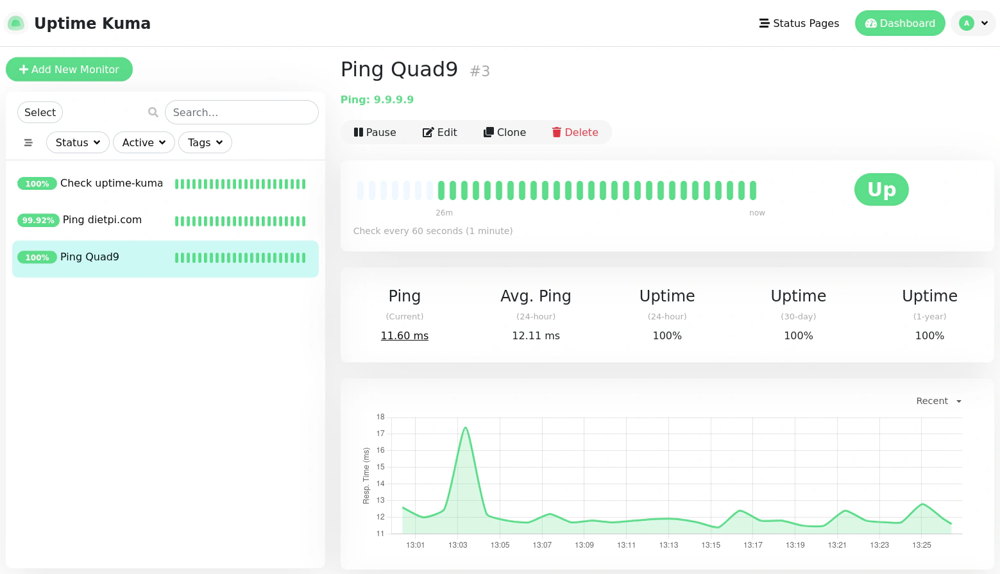

# Release Notes

## January 2026 (version 10.0)

### Overview

The **January 25th, 2026** release of **DietPi v10.0** comes with new software packages *Uptime-Kuma* and *ownCloud Infinite Scale*, it contains further enhancements and fixes.  
From this release on, at least **Debian 12 (Bookworm)** is required.

{: width="1559" height="895" loading="lazy"}

### Breaking

- The minimum Debian version supported by our scripts has been raised to Debian 12 Bookworm. Debian 11 Bullseye systems will be migrated to a dedicated branch automatically. We highly recommend to upgrade affected systems to Debian 12 Bookworm, following our guide: <https://dietpi.com/blog/?p=3128>. Once the upgrade has been done, the update to DietPi v10 will be offered on next update check or when running `dietpi-update`.
- The minimum DietPi version to support direct updates to DietPi v10 from has been raised to v8.0. Older systems will go through a two-stage process, being upgraded to DietPi v9.20 on a separate branch, and afterwards further to DietPi v10 via master branch, if the Debian version requirement is met as well.

### New software

- **ownCloud Infinite Scale** :octicons-arrow-right-16: This successor of the classic ownCloud file sync and share platform has been added to our software catalogue.
- [**DietPi-Software**](../dietpi_tools/software_installation.md#dietpi-software) | [**Uptime-Kuma**](../software/system_stats.md#uptime-kuma) :octicons-arrow-right-16: This self-hosted monitoring tool has been added to our software catalogue. Many thanks to @JappeHallunken for implementing this software option: <https://github.com/MichaIng/DietPi/pull/7888>

### Removed SBC support

- The removed of support for Debian 11 Bullseye implies the removal of support for the **Sparky SBC**, **NanoPi M2/T2/Fire2**, and **NanoPi M3/T3/Fire3** families. Images for those SBCs ship with very old vendor Linux versions, which cannot run Debian 13 Trixie. They already had issues which Debian 12 Bookworm, which is the reason we provided only Bullseye images for those. If anyone finds functional mainline-based Linux and U-Boot sources, or is able to rebase the needed drivers and device trees, we are happy to re-implement support.

### Removed software

- [**DietPi-Software**](../dietpi_tools/software_installation.md#dietpi-software) | **RPi Cam Web Interface** :octicons-arrow-right-16: The removal of support for Debian 11 Bullseye implies the removal of the RPi Cam Web Interface software option. It depends on the legacy `MMAL camera interface`, while the related userspace libraries have been removed from the Bookworm packages of the Raspberry Pi repository. Maintenance for this project stalled since several years, and there is no active fork. We are focusing on `motionEye` and `mjpg-streamer` as generic camera and motion detection web interfaces, which both support `libcamera` indirectly via `libcamerify`, and have native support in view. To uninstall RPi Cam Web Interface remains on DietPi v10.x, follow these steps: <https://github.com/MichaIng/DietPi/pull/7912>
- [**DietPi-Software**](../dietpi_tools/software_installation.md#dietpi-software) | **ownCloud** :octicons-arrow-right-16: The removal of support for Debian 11 Bullseye implies the removal of the classic ownCloud software option. It does not support PHP 8.x, and development stalled. Instead we integrated support for the actively developed `ownCloud Infinite Scale` (see above), and a migration to Nextcloud is alternatively possible: <https://github.com/MichaIng/DietPi/pull/7886>
- [**DietPi-Software**](../dietpi_tools/software_installation.md#dietpi-software) | **Pydio** :octicons-arrow-right-16: The removal of support for Debian 11 Bullseye implies the removal of the classic Pydio 8 software option. It does not support PHP 8.x, with Pydio Cells as its successor. We will add Pydio Cells with DietPi v10.1. A migration of data is possible, but has limitations and requires some preparation: <https://docs.pydio.com/cells-v4/admin-guide/advanced/migrate-pydio-8-to-cells/>. Please let us know if you require a possibility to migrate your Pydio 8 to Pydio Cells after reading the related docs. Depending on interest, we can backport Pydio Cells to a DietPi v9.20.x release on the dedicated compat branch, so that it can be installed alongside Pydio 8 to allow a direct migration. To uninstall Pydio 8 remains on DietPi v10.x, follow these steps: <https://github.com/MichaIng/DietPi/pull/7912>

### Enhancement

- [**Raspberry Pi**](../hardware.md#raspberry-pi) :octicons-arrow-right-16: DietPi can now be selected within the Raspberry Pi Imager below "Other general-purpose OS" for all Raspberry Pi models.
- [**Quartz64**](../hardware.md#pine64) :octicons-arrow-right-16: The new Linux Rocket NPU driver has been enabled for this SBC family.
- [**DietPi-Tools**](../dietpi_tools.md) | [**DietPi-LetsEncrypt**](../dietpi_tools/software_installation.md#dietpi-letsencrypt) :octicons-arrow-right-16: For Nginx from Debian Trixie on, the HTTP/2 syntax has been updated and HTTP/3 with `QUIC` is enabled. The change can be applied retrospectively by re-running `dietpi-letsencrypt`. Many thanks to @JappeHallunken for implementing this enhancement: <https://github.com/MichaIng/DietPi/pull/7860>

### Bug fixes

- [**Radxa ZERO 3**](../hardware.md#radxa) :octicons-arrow-right-16:  Resolved an issue where onboard WiFi on the 3W did not work with the new kernel. Many thanks to @lsx285 and others for reporting this issue and testing fixed kernel builds: <https://github.com/MichaIng/DietPi/issues/7867>. The kernel has been updated on our AP repository, hence the issue won't appear anymore when updating DietPi or the package.
- [**Orange Pi 3/3 LTS**](../hardware.md#orange-pi-series) :octicons-arrow-right-16: Resolved an issue where WiFi and Bluetooth did not work without manually loading the related UNISOC/Spreadtrum kernel modules `sprdwl_ng` and `sprdbt_tty` respectively. This is now done when toggling WiFi and Bluetooth via `dietpi-config` or `dietpi.txt`. Many thanks to @iMagz for reporting this issue: <https://github.com/MichaIng/DietPi/issues/7878>
- [**Orange Pi 3/3 LTS/3B**](../hardware.md#orange-pi-series) :octicons-arrow-right-16: Resolved an issue where loading the UNISOC/Spreadtrum WiFi driver at boot could cause a crash when the CPUFreq driver `cpufreq_dt` was loaded afterwards. The config `/etc/modules-load.d/dietpi-enable_wifi.conf` has been updated to load `cpufreq_dt` first explicitly. On Orange Pi 3B v2.1, the driver is not needed as the board uses a different chip, hence the config is removed. Many thanks to @techplayz32, @Girb826, and @iMagz for reporting this issue: <https://github.com/MichaIng/DietPi/issues/7728>, <https://github.com/MichaIng/DietPi/issues/7878>
- **RK3328** :octicons-arrow-right-16: Resolved an issue where Ethernet on **NanoPi R2S** and the USB3 port on **NanoPi NEO3** and **ROCK64** did not work, due to an experimental Innosilicon Rockchip USB3 PHY driver patched into the kernel, promising better transfer speeds. It might have worked before, but seems to be broken since Linux 6.18. Many thanks to [@GodChryz](https://dietpi.com/forum/u/GodChryz){: .nospellcheck } and @josemahj for reporting this issue: <https://dietpi.com/forum/t/24864/3>, <https://github.com/MichaIng/DietPi/issues/7908>
- [**DietPi-Software**](../dietpi_tools/software_installation.md#dietpi-software) | [**Home Assistant**](../software/home_automation.md#home-assistant) :octicons-arrow-right-16: Resolved an issue where the installation could have failed on RISC-V and ARMv6/7 Bookworm systems due to missing dependencies.
- [**DietPi-Software**](../dietpi_tools/software_installation.md#dietpi-software) | [**Home Assistant**](../software/home_automation.md#home-assistant) :octicons-arrow-right-16: Worked around an issue where the installation and service start failed due to a missing upper dependency declaration. The issue has been solved at Home Assistant for their upcoming release, which will make our workaround obsolete.
- [**DietPi-Software**](../dietpi_tools/software_installation.md#dietpi-software) | [**BirdNET-Go**](../software/camera.md#birdnet-go) :octicons-arrow-right-16: The latest (pre-)release will now be detected and installed instead of a hardcoded version, which solves an upstream bug where reviewing bird detections did not work. Many thanks to @Sonnenfleck and @oturn for reporting the issue and testing newer versions, as well as @JappeHallunken for implementing the dynamic release download: <https://github.com/MichaIng/DietPi/issues/7861>, <https://github.com/MichaIng/DietPi/pull/7889>
- [**DietPi-Software**](../dietpi_tools/software_installation.md#dietpi-software) | [**Mopidy**](../software/media.md#mopidy) :octicons-arrow-right-16: Resolved an issue where fetching remote streams failed due to an incompatibility between Mopidy and GStreamer on Debian Trixie. Many thanks to @miloit for reporting this issue: <https://github.com/MichaIng/DietPi/issues/7866>

As always, many smaller code performance and stability improvements, visual and spelling fixes have been done, too much to list all of them here. Check out all code changes of this release on GitHub: <https://github.com/MichaIng/DietPi/pull/7900>
