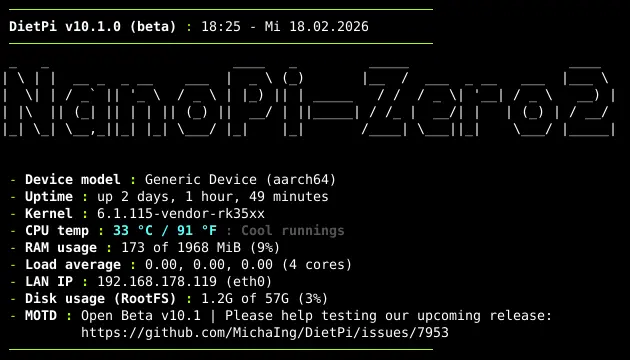

# Release Notes

## February 2026 (version 10.1)

### Overview

The **February 21th, 2026** release of **DietPi v10.1** comes with a new image for the NanoPi Zero2 and further enhancements and fixes.  

{: width="625" height="360" loading="lazy"}

!!! cite "DietPi-Banner output on NanoPi Zero2 screenshot by @StephanStS"

### New images

- [**NanoPi Zero2**](../hardware.md#nanopi-series-friendlyelec) :octicons-arrow-right-16: Support for this headless FriendlyELEC SBC with Rockchip RK3528 SoC has been added to DietPi.

### Enhancements

- [**NanoPi R5C**](../hardware.md#nanopi-series-friendlyelec) :octicons-arrow-right-16: Resolved an issue where the Ethernet network interface names could have swapped on reboots. They are now assigned with `eth0` as LAN port and `eth1` as WAN port. Many thanks to @firebox for reporting this issue: <https://dietpi.com/forum/t/24845/24>
- [**DietPi-Tools**](../dietpi_tools.md) | [**DietPi-Banner**](../dietpi_tools/misc_tools.md#dietpi-banner) :octicons-arrow-right-16: New option to output the Linux kernel version
- [**DietPi-Software**](../dietpi_tools/software_installation.md#dietpi-software) | [**Python 3**](../software/programming.md#python-3) :octicons-arrow-right-16: All Python software options make now use of `venvs`, instead of being installed to the system site `/usr/local/lib/python3.*/dist-packages`. Recent `pip` has increasing issues managing modules there on distributions which have own Python module packages. Modern setups almost require isolated environments like `venv`.  
`Synapse`, `motionEye`, and `OctoPrint` are reinstalled on DietPi update to perform the migration directly, preserving user data and plugins. The "break-system-packages" flag in `/etc/pip.conf` is consequently removed. If you need to manage packages via pip at the system site, add the `--break-system-packages` CLI flag to each call.
- [**DietPi-Software**](../dietpi_tools/software_installation.md#dietpi-software) | [**Navidrome**](../software/media.md#navidrome) :octicons-arrow-right-16: Support for RISC-V has been unlocked, as official builds have been added with the v0.60.0 release on GitHub.
- [**DietPi-Software**](../dietpi_tools/software_installation.md#dietpi-software) | [**MinIO**](../software/cloud.md#minio) :octicons-arrow-right-16: The console client `mc` is now installed along with the server, to make up with the lost administration functionalities of the community server web UI. A shell alias is generated to invoke it as `minio-user` user, using a pre-generated config file `/mnt/dietpi_userdata/minio-data/.mc/config.json`. It adds the local MinIO server instance as "local" alias. Additionally, the default credentials have been changed to username (access key) "dietpi" and the default software password as secret key. Since MinIO requires the password to be at least 8 characters long, the default software password is concatenated until 8 characters are reached. E.g. if `test` was used, it will be `testtest` for MinIO. However, don't try it and use a secure default software password of 12 characters or more on production systems ;). Change it afterwards for the MinIO server in `/etc/default/minio`, and for the console client `mc` accordingly in `/mnt/dietpi_userdata/minio-data/.mc/config.json`.
- [**DietPi-Software**](../dietpi_tools/software_installation.md#dietpi-software) | [**TigerVNC**](../software/remote_desktop.md#tigervnc-server)/[**RealVNC**](../software/remote_desktop.md#realvnc-server)/[**XRDP**](../software/remote_desktop.md#xrdp) :octicons-arrow-right-16: Those remote desktop servers do not actually require a desktop anymore, but just the X server. This allows lighter setups when using them to show an individual GUI application like Chromium only, instead of a full desktop. Many thanks to @fow0ryl for doing this suggestion: <https://github.com/MichaIng/DietPi/issues/7947>

### Bug fixes

- [**ZeroPi**](../hardware.md#nanopi-series-friendlyelec) :octicons-arrow-right-16: Resolved an issue where images failed to boot because of a faulty bootloader update. Many thanks to @TimoAbt and @dan-hughes for reporting this issue: <https://github.com/MichaIng/DietPi/issues/7715>
- [**DietPi-Software**](../dietpi_tools/software_installation.md#dietpi-software) | [**BirdNET-Go**](../software/camera.md#birdnet-go) :octicons-arrow-right-16: Resolved an issue where the install failed since the initial call tries to create the logs directory in the working directory as unprivileged user, rather than in its home directory. Many thanks to @shagr4th for implementing a fix: <https://github.com/MichaIng/DietPi/pull/7929>
- [**DietPi-Software**](../dietpi_tools/software_installation.md#dietpi-software) | [**Chromium**](../software/desktop.md#chromium) :octicons-arrow-right-16: Resolved a v10.0 regression where the kiosk mode `dietpi-autostart` option failed, since the script tried to call it with `xinit/startx chromium`, while it requires the full path `xinit/startx /usr/bin/chromium`. Many thanks to @PTXRM1980 and @binarypickle for reporting this issue: <https://github.com/MichaIng/DietPi/issues/7923>
- [**DietPi-Software**](../dietpi_tools/software_installation.md#dietpi-software) | [**ADS-B Feeder**](../software/distributed_projects.md#ads-b-feeder) :octicons-arrow-right-16: Resolved an issue where the setup could have failed on RISC-V and 32-bit ARM system due to missing dependencies for the Python cryptography module.
- [**DietPi-Software**](../dietpi_tools/software_installation.md#dietpi-software) | [**Gogs**](../software/cloud.md#gogs) :octicons-arrow-right-16: Resolved an issue where ARMv8 systems were not able to detect the latest version due to a changed asset name suffix in the GitHub releases for this architecture. Many thanks to @deeejas for reporting this issue: <https://github.com/MichaIng/DietPi/issues/7945>
- [**DietPi-Software**](../dietpi_tools/software_installation.md#dietpi-software) | | [**Plex Media Server**](../software/media.md#plex-media-server) :octicons-arrow-right-16: Resolved an issue where APT was throwing errors and package installs/upgrades failed because of a faulty key rotation done at the Plex APT repository. The old repository has been since shut down and a new one set up, which we use now. The migration is done automatically on DietPi update. Many thanks to @Krouwndouwn for reporting this issue: <https://github.com/MichaIng/DietPi/issues/7925>
- [**DietPi-Software**](../dietpi_tools/software_installation.md#dietpi-software) | [**microblog.pub**](../software/social.md#microblogpub) :octicons-arrow-right-16: Resolved an issue where the install failed since pyenv Python 3.11 or older builds require the "patch" package now. Many thanks to @gilou for reporting this issue: <https://dietpi.com/forum/t/24975/2>
- [**DietPi-Software**](../dietpi_tools/software_installation.md#dietpi-software) | [**Pi-hole**](../software/dns_servers.md#pi-hole) :octicons-arrow-right-16: Resolved an issue where Pi-hole's setup dialogs did print cryptic characters on input when selected for install during first run setup. "dialog" requires either STDOUT or STDOUT directly attached to a terminal, while `dietpi-login` calls `dietpi-software` with both streams piped into "tee" for login, on first login. Its STDOUT and STDERR are now redirected back to the parent shell file descriptors (terminal) via "dialog" wrapper function. Many thanks to @sheddyian for reporting this issue: <https://dietpi.com/forum/t/24889>

As always, many smaller code performance and stability improvements, visual and spelling fixes have been done, too much to list all of them here. Check out all code changes of this release on GitHub: <https://github.com/MichaIng/DietPi/pull/7954>
