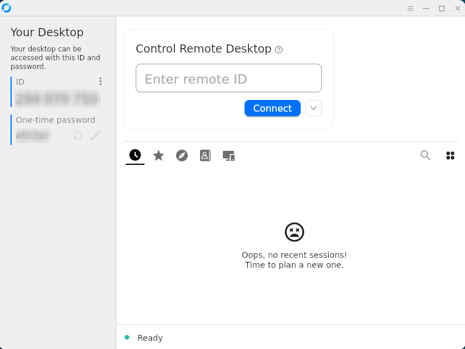

# Release Notes

## March 2026 (version 10.2)

### Overview

The **March 21st, 2026** release of **DietPi v10.2** comes with *Immich*, *Immich Machine Learning*, *uv* and *RustDesk Client* as new software options, further enhancements and fixes.

{: width="500" height="375" loading="lazy"}

!!! cite "RustDesk Client screenshot by @StephanStS"

### New software

- [**DietPi-Software**](../dietpi_tools/software_installation.md#dietpi-software) | [**Immich**](../software/cloud.md#immich) :octicons-arrow-right-16: This high performance self-hosted photo and video management solution has been added to our software catalogue. Available on x86_64 and ARMv8 only (ID 215).
- [**DietPi-Software**](../dietpi_tools/software_installation.md#dietpi-software) | [**Immich Machine Learning**](../software/cloud.md#immich) :octicons-arrow-right-16: The machine learning server for Immich, enabling facial recognition and smart search via CLIP embeddings, has been added as a separate software option. It can be installed on the same system as Immich or on a remote machine. Available on x86_64 and ARMv8 only (ID 216).
- [**DietPi-Software**](../dietpi_tools/software_installation.md#dietpi-software) | [**uv**](../software/programming.md#uv) :octicons-arrow-right-16: This extremely fast Python package and project manager, written in Rust, has been added as a standalone software option (ID 217).
- [**DietPi-Software**](../dietpi_tools/software_installation.md#dietpi-software) | [**RustDesk Client**](../software/remote_desktop.md#rustdesk-client) :octicons-arrow-right-16: Client software for the RustDesk desktop sharing platform (ID 13). Fits perfect to our software package [**RustDesk Server**](../software/remote_desktop.md#rustdesk-server). X11 needs to be installed or will be installed during the RustDesk Client installation process.

### Enhancements

- [**DietPi-Tools**](../dietpi_tools.md) | [**DietPi-Benchmark**](../dietpi_tools/misc_tools.md#dietpi-benchmark) :octicons-arrow-right-16: The benchmark script has been moved to `/boot/dietpi/dietpi-benchmark` and a shell alias has been added, so it can now be called directly from the console as `dietpi-benchmark` without having to browse through `dietpi-config` first.
- [**DietPi-Tools**](../dietpi_tools.md) | [**DietPi-Servarr_to_RAM**](../dietpi_tools/misc_tools.md#dietpi-servarr-to-ram) :octicons-arrow-right-16: The original script `dietpi-arr_to_RAM` was renamed to `dietpi-servarr_to_ram`, got Prowlarr support, and protection against malicious symlinks when creating files and directories.
- [**DietPi-Tools**](../dietpi_tools.md) | [**DietPi-Config**](../dietpi_tools/system_configuration.md#dietpi-config) :octicons-arrow-right-16: The performance options were expanded by a menu to select the CPU temperature sensor used across our scripts. It affects the CPU temperature shown in performance options, in `cpu` command output, the DietPi login banner, and elsewhere within our scripts and menus. Since the `sysfs` nodes for temperature sensors are not consistent across devices, the hardcoded logic we use does not always pick the right one. Now you can select from a list of detected sensor paths with their returned temperatures, or enter a custom path to read from. A related `dietpi.txt` setting `CONFIG_CPU_TEMP_PATH` has been added as well. Many thanks to @N7-BADA for adding this feature: <https://github.com/MichaIng/DietPi/pull/8012>
- [**DietPi-Tools**](../dietpi_tools.md) | [**DietPi-Software**](../dietpi_tools/software_installation.md#dietpi-software) :octicons-arrow-right-16: A desktop selection menu was added to make it clearer and easier to get started for those who require a graphical desktop environment. A new `dietpi.txt` setting `AUTO_SETUP_DESKTOP` allows to pre-select a desktop for first boot. It takes textual values like `lxde` and `xfce`, and serves as better accessible alternative to numerical software ID selections like `AUTO_SETUP_INSTALL_SOFTWARE_ID=23`.
- [**DietPi-Software**](../dietpi_tools/software_installation.md#dietpi-software) | [**Home Assistant**](../software/home_automation.md#home-assistant) :octicons-arrow-right-16: The Python version for the `pyenv` has been raised to latest 3.14, needed since Home Assistant v2026.3. Many thanks to @lukaszsobala for reporting the missing update: <https://github.com/MichaIng/DietPi/issues/8003>
- [**DietPi-Software**](../dietpi_tools/software_installation.md#dietpi-software) | [**myMPD**](../software/media.md#mympd) / [**UrBackup**](../software/cloud.md#urbackup) :octicons-arrow-right-16: Support for ARMv6 from Trixie on has been enabled. The openSUSE Build Service does now provide a Raspbian 13 suite, and respective myMPD and UrBackup packages, distributed via OBS, are available.
- [**DietPi-Software**](../dietpi_tools/software_installation.md#dietpi-software) | [**Amiberry**](../software/gaming.md#amiberry) :octicons-arrow-right-16: Packages for the new Amiberry v8.0.0 with embedded SDL3 v3.4.2 are available. Note that this includes a bunch of major changes in both: Amiberry and the SDL backend library, hence expect some bugs and glitches. We patched some known issues our end, and Amiberry v8.0.1 will contain another a large number of fixes and polishing as well. You can always downgrade the package, if needed: `apt install amiberry=7.1.1-dietpi1`

### Bug fixes

- **DietPi-Globals** | `G_AG_CHECK_INSTALL_PREREQ` :octicons-arrow-right-16: Resolved an issue where the package installation was skipped even if the package was removed with only config files left. Many thanks to @Sympatron for reporting this issue: <https://github.com/MichaIng/DietPi/issues/7772>
- [**DietPi-Tools**](../dietpi_tools.md) | [**DietPi-Software**](../dietpi_tools/software_installation.md#dietpi-software) :octicons-arrow-right-16: Resolved an issue where the check for the newest software version could have failed, since the GitHub API started to return the JSON response as a single line by times. We use now a parsing method that works for single-line and multi-line responses the same way. Many thanks to @luminosity-design for reporting this issue: <https://github.com/MichaIng/DietPi/issues/8009>
- [**DietPi-Software**](../dietpi_tools/software_installation.md#dietpi-software) | [**phpBB**](../software/social.md#phpbb) :octicons-arrow-right-16: Resolved a DietPi v9.17 regression where the download failed since the URL was not forged correctly. Many thanks to @yetanotherlurkeree for reporting this issue: <https://github.com/MichaIng/DietPi/issues/7971>
- [**DietPi-Software**](../dietpi_tools/software_installation.md#dietpi-software) | [**K3s**](../software/system_stats.md#k3s) :octicons-arrow-right-16: Resolved an issue there the the `dietpi-k3s.yaml` was not imported from the FAT partition of the image for an automated install on first boot. Many thanks to @grhawk for reporting this issue: <https://github.com/MichaIng/DietPi/issues/7985>
- [**DietPi-Software**](../dietpi_tools/software_installation.md#dietpi-software) | **MPD** :octicons-arrow-right-16: Resolved an issue where `systemctl restart mpd` lead to a lost UNIX domain socket, since an active `mpd.socket` prevents `mpd.service` from recreating the socket on its own. The activation socket is now disabled and untied from the service. It has no purpose if the service is anyway started at boot, but causes mentioned issue. Many thanks to @k3ninho for reporting this issue, and enabling compatibility of our `ympd` package with a setup, that starts the MPD service only on demand (frontend/client access) via activation socket: <https://github.com/MichaIng/DietPi/pull/7986>
- [**DietPi-Software**](../dietpi_tools/software_installation.md#dietpi-software) | [**LXQt**](../software/desktop.md#lxqt) :octicons-arrow-right-16: Resolved an issue where LXQt was installed without full icon theme (Adwaita is not accepted anymore), and an invisible panel start menu (the package default is now a `fancymenu`). Many thanks to @Redek for reporting this issue: <https://dietpi.com/blog/?p=4014#comment-6172>
- [**DietPi-Software**](../dietpi_tools/software_installation.md#dietpi-software) | [**PaperMC**](../software/gaming.md#papermc) :octicons-arrow-right-16: Resolved an issue where on old build was installed because an old API endpoint was used to detect the latest version and build.
- [**DietPi-Software**](../dietpi_tools/software_installation.md#dietpi-software) | [**Node-RED**](../software/hardware_projects.md#node-red) :octicons-arrow-right-16: Resolved an issue where the `node-red-node-pi-gpio` plugin failed to function with `python3-rpi-lgpio`, since the library tries to create a notification pipe file in the current directory. The `node-red.service` will now start in `/mnt/dietpi_userdata/node-red`, where it is write access. Many thanks to @devifast for reporting this issue: <https://discourse.nodered.org/t/100595/25>
- [**DietPi-Software**](../dietpi_tools/software_installation.md#dietpi-software) | [**Moonlight (GUI)**](../software/gaming.md#moonlight-gui) :octicons-arrow-right-16: Resolved an issue where streaming switched back to the loading stream if the `libgles2` was not installed. Many thanks to @daredevil2033 for reporting this issue: <https://github.com/MichaIng/DietPi/issues/7885>

As always, many smaller code performance and stability improvements, visual and spelling fixes have been done, too much to list all of them here. Check out all code changes of this release on GitHub: <https://github.com/MichaIng/DietPi/pull/8018>
