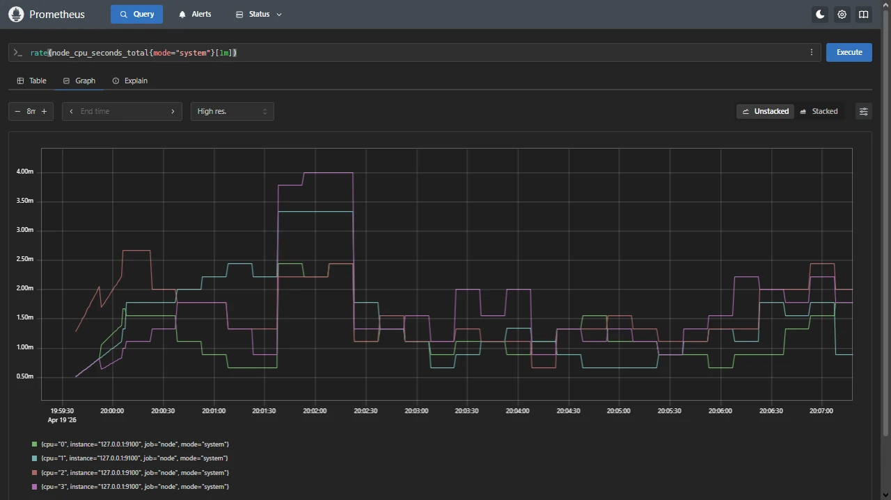

# Release Notes

## April 2026 (version 10.3)

### Overview

The **April 18th, 2026** release of **DietPi v10.3** comes with a new image for the **Orange Pi 4 LTS**, *Prometheus* as new software option, further enhancements and fixes.

{: width="1280" height="720" loading="lazy"}

### New images

- [**Orange Pi 4 LTS**](../hardware.md#orange-pi-series) :octicons-arrow-right-16: Support and images for the LTS variant of this Orange Pi SBC with Rockchip RK3399 SoC have been added. Many thanks to @Gibbz for implementing this: <https://github.com/MichaIng/DietPi/pull/8057>

### New software

- [**DietPi-Software**](../dietpi_tools/software_installation.md#dietpi-software) | [**Prometheus**](../software/system_stats.md#prometheus) :octicons-arrow-right-16: This open-source systems monitoring and alerting toolkit has been added to the DietPi software catalogue (ID 218).

### Removed software

- [**DietPi-Software**](../dietpi_tools/software_installation.md#dietpi-software) | [**QuiteRSS**](../software/desktop.md) :octicons-arrow-right-16: This package has been removed from Debian since Trixie, since it depends on an outdated library, and there was no development for over 5 years. We hence remove it as well from `dietpi-software`. It can be still installed manually on Bookworm systems with `apt install quiterss` (`dietpi-software` did nothing else), and similarly it can be removed with `apt autopurge quiterss`. Alternatively, [**RSS Guard**](https://github.com/martinrotter/rssguard) can be used by installing it via `apt install rssguard`.

### Enhancements

- [**DietPi-Tools**](../dietpi_tools.md) | [**DietPi-AutoStart**](../dietpi_tools/system_configuration.md#dietpi-autostart) :octicons-arrow-right-16: An Amiberry-Lite autostart option has been added as ID 3, which enables the `amiberry-lite.service` to start it early at boot. This works like the [Amiberry](../software/gaming.md#amiberry) fast boot option. A "standard boot" option has not been added, since there should be no reason to use it. Many thanks to [@thedaemon](https://dietpi.com/forum/u/thedaemon){: .nospellcheck } and @orbitalflower for opening the request: <https://dietpi.com/forum/t/25025>, <https://github.com/MichaIng/DietPi/issues/8061>
- [**DietPi-Tools**](../dietpi_tools.md) | [**DietPi-Drive_Manager**](../dietpi_tools/system_configuration.md#dietpi-drive-manager) :octicons-arrow-right-16: Using the drive manager no longer recreates `/etc/fstab` from scratch. Instead it will only change, add, or remove a particular entry when drives are mounted, unmounted, or options changed respectively. That way it is compatible with custom mount options or types manually added to `/etc/fstab`, and does not overwrite admin intentions.
- [**DietPi-Tools**](../dietpi_tools.md) | [**DietPi-Drive_Manager**](../dietpi_tools/system_configuration.md#dietpi-drive-manager) :octicons-arrow-right-16: A new USB auto-mount feature has been added. When enabled, a udev rule is installed that automatically mounts USB storage devices to `/media/<uuid>` when plugged in, and unmounts them on removal. Devices with an `/etc/fstab` entry are handled accordingly: entries with `x-systemd.automount` are left to systemd's lazy-mount mechanism, and entries with `noauto` are skipped entirely, respecting the admin's intention of manual-only mounting.
- [**DietPi-Tools**](../dietpi_tools.md) | [**DietPi-Display**](../dietpi_tools/system_configuration.md#dietpi-display) :octicons-arrow-right-16: Support for Odroid C1 and XU4 with `/boot/boot.ini` has been added.
- [**DietPi-Software**](../dietpi_tools/software_installation.md#dietpi-software) | [**Home Assistant**](../software/home_automation.md#home-assistant) :octicons-arrow-right-16: We migrated from `pyenv` to [uv](../software/programming.md#uv) for installing and managing the Home Assistant Python environment. Python no longer needs to be compiled from source, saving significant time and resources during (re)installs. Additionally, the existing Python environment is kept and updated as long as the Python version matches, so a reinstall does not necessarily reinstall all Python modules. The install directory has been moved from `/home/homeassistant` to `/opt/homeassistant`. The DietPi update does not enforce the migration automatically — you can do this at your convenience by running: `dietpi-software reinstall 157`. As a consequential downside, support for ARMv6 has been removed, since `uv`'s Python builds do not support this architecture and it cannot compile Python the way `pyenv` does.

### Bug fixes

- **Allwinner H5/H6** :octicons-arrow-right-16: Resolved a regression with a recent U-Boot build which caused only a single CPU core to be used on those SoCs. A fixed U-Boot build is flashed during this DietPi update. Many thanks to @eggypesela for reporting this issue, and credits to the Armbian team for the fix: <https://github.com/MichaIng/DietPi/issues/7974>
- **Rockchip RK356x** :octicons-arrow-right-16: Resolved an issue where PCIe devices were randomly not detected, like M.2 SSDs or 2.5 Gbit Ethernet adapters on NanoPi R5S/R5C. Many thanks to @InnovoDeveloper, @eggcllnt and others for reporting related issues: <https://github.com/MichaIng/DietPi/issues/7559>, <https://github.com/MichaIng/DietPi/issues/7517>
- **Orange Pi Zero 2W** :octicons-arrow-right-16: Resolved an issue where the Ethernet adapter of the extension board stopped working after the upgrade to Linux 6.18, due to a missing driver. Many thanks to [@Totof](https://dietpi.com/forum/u/Totof){: .nospellcheck } for reporting this issue: <https://dietpi.com/forum/t/25125>
- [**DietPi-Tools**](../dietpi_tools.md) | [**DietPi-AutoStart**](../dietpi_tools/system_configuration.md#dietpi-autostart) :octicons-arrow-right-16: Resolved an issue where switching away from the Amiberry fast boot option did not disable the service as intended. Many thanks to @orbitalflower for reporting this issue: <https://github.com/MichaIng/DietPi/issues/8059>
- [**DietPi-Tools**](../dietpi_tools.md) | [**DietPi-Config**](../dietpi_tools/system_configuration.md#dietpi-config) :octicons-arrow-right-16: Resolved a DietPi v10.1 regression where WiFi SSIDs with spaces were only partially shown and applied. Many thanks to @Persie0 for reporting this issue: <https://github.com/MichaIng/DietPi/issues/8076>
- [**DietPi-Software**](../dietpi_tools/software_installation.md#dietpi-software) | [**DietPi-Dashboard**](../software/system_stats.md#dietpi-dashboard) :octicons-arrow-right-16: Resolved an issue where the software install/uninstall pages were empty if non-English locales were used. The underlying reason was a bug in `dietpi-software`, which assumes English locales for parsing memory sizes. `dietpi-software list` calls however do not enforce English locales and do not require the memory size info either. Many thanks to @Colossus5000 and [@3rink](https://dietpi.com/forum/u/3rink){: .nospellcheck } for reporting this issue: <https://github.com/MichaIng/DietPi/issues/8044>, <https://dietpi.com/forum/t/25065>
- [**DietPi-Software**](../dietpi_tools/software_installation.md#dietpi-software) | [**Home Assistant**](../software/home_automation.md#home-assistant) :octicons-arrow-right-16: Resolved an issue where restoring backups failed, since `/mnt/dietpi_userdata/homeassistant/deps` was a symlink pointing to the `pyenv` Python environment to deduplicate module installs. With `uv` a `venv` is used directly, hence `/mnt/dietpi_userdata/homeassistant/deps` is not needed anymore. It is removed when (re)installing Home Assistant, allowing backups to be restored. Many thanks to @Dynamic5912 for reporting this issue: <https://github.com/MichaIng/DietPi/issues/7733>
- [**DietPi-Software**](../dietpi_tools/software_installation.md#dietpi-software) :octicons-arrow-right-16: Worked around an issue where some services with an `EnvironmentFile` below `/mnt/dietpi_userdata` may have failed to start if it has been moved to an external drive. Many thanks to @jcw for reporting this issue: <https://github.com/MichaIng/DietPi/issues/8070>

As always, many smaller code performance and stability improvements, visual and spelling fixes have been done, too much to list all of them here. Check out all code changes of this release on GitHub: <https://github.com/MichaIng/DietPi/pull/8080>
