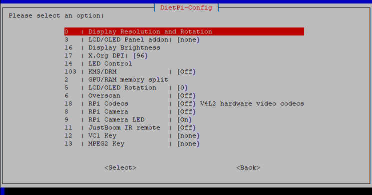

# Release Notes

## July 2026 (version 10.6)

### Overview

xxx

The **June 14th, 2026** release of **DietPi v10.6** is a minor release and comes with enhancements for Allwinner/Amlogic/Rockchip SBCs, BirdNET-Go and Kubo.

{: width="745" height="390" loading="lazy"}

### Enhancements

- **Allwinner/Amlogic/Rockchip SBCs** :octicons-arrow-right-16: A driver for certain ASUS USB keyboards has been added to all our kernel builds. Many thanks to @rouilj for reporting the issue with one of these: <https://dietpi.com/forum/t/25290>
- [**DietPi-Software**](../dietpi_tools/software_installation.md#dietpi-software) | [**BirdNET-Go**](../software/camera.md#birdnet-go) :octicons-arrow-right-16: The path to the ONNX runtime library is not set in (re)install to enable access to the additional bird classifier models. This can be also applied manually, following the instructions in the next link. Many thanks to @oradke for reporting this issue: <https://github.com/MichaIng/DietPi/issues/8196>
- [**DietPi-Software**](../dietpi_tools/software_installation.md#dietpi-software) | [**Kubo**](../software/distributed_projects.md#ipfs-node) :octicons-arrow-right-16: The IPFS Node install option has been enabled for RISC-V.

### Bug fixes

- [**Odroid N2/HC4**](../hardware.md#odroid) :octicons-arrow-right-16: Support for `petitboot` has been fixed. Changes in our base boot script caused some `petitboot` workarounds to not be applied as intended. Many thanks to @vlix and @tigersky for reporting this issue: <https://dietpi.com/forum/t/24902>, <https://dietpi.com/forum/t/25296>
- [**DietPi-Tools**](../dietpi_tools.md) | [**DietPi-Config**](../dietpi_tools/system_configuration.md#dietpi-config) :octicons-arrow-right-16: Resolved an issue where scanning for WiFi networks could result in an empty list, if a single hidden network (with an empty SSID) was in range. Many thanks to @miraz1300 for reporting this issue: <https://github.com/MichaIng/DietPi/issues/8199>
- [**DietPi-Tools**](../dietpi_tools.md) | [**DietPi-Config**](../dietpi_tools/system_configuration.md#dietpi-config) :octicons-arrow-right-16: Resolved a v10.5 regression where Bluetooth was always shown as enabled, hence could not be actually enabled anymore. Many thanks to @z3huti for reporting this issue: <https://github.com/MichaIng/DietPi/issues/8213>
- [**DietPi-Software**](../dietpi_tools/software_installation.md#dietpi-software) | [**Immich**](../software/cloud.md#immich) :octicons-arrow-right-16: Resolved an issue where the installation failed due to breaking changes in the recent Immich v3 release. Our code has been updated to support Immich v3. As always, existing instances can apply the update via `dietpi-software reinstall 215 216`, which includes Immich Machine Learning, (only) if installed.
- [**DietPi-Software**](../dietpi_tools/software_installation.md#dietpi-software) | [**BirdNET-Go**](../software/camera.md#birdnet-go) :octicons-arrow-right-16: Resolved an issue where the installer did not detect recent releases, since the URLs got an additional date suffix. Many thanks to @oradke for reporting this issue: <https://github.com/MichaIng/DietPi/discussions/8215>

xxx

As always, many smaller code performance and stability improvements, visual and spelling fixes have been done, too much to list all of them here. Check out all code changes of this release on GitHub: <https://github.com/MichaIng/DietPi/pull/8173>
