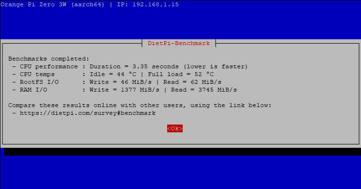

# Release Notes

## September 2026 (version 10.7)

### Overview

The **September 5th, 2026** release of **DietPi v10.7** comes with new `dietpi-network` script, `dietpi-banner` improvements and further fixes for Raspberry Pi, Orange Pi 5/5B, Ampache and WiringPi.

xxx

{: width="745" height="390" loading="lazy"}

### New images

- **Containers with network** :octicons-arrow-right-16: We added support for containers with virtual network, providing images with network stack and SSH server pre-installed, which configure the network on first boot based on `dietpi.txt` choices, using DHCP on any first detected `veth` or VLAN interface by default. These work all e.g. for LXC containers Many thanks to @mews-se for implementing this feature to our build scripts: <https://github.com/MichaIng/DietPi/pull/8238>

### New tools

- **dietpi-network** :octicons-arrow-right-16: The DietPi network configuration has gone through a rework. A new tool `dietpi-network` allows to configure multiple Ethernet(-like) and WiFi interfaces. This allows to e.g. configure one interface with gateway for Internet access, and another one with static IP and without gateway for LAN access.  
This works independently of the interface name, i.e. it does not need to be `eth[0-9]` or `wlan[0-9]`, but the type is detected in other ways, which adds support for systemd's "predictable interface names", as well as virtual interfaces as provided in container guests. A CLI has been added to add, remove, or adjust individual interfaces.  
Configurations are stored in per-interface `/etc/network/interfaces.d/<name>.conf` drop-in config files, and also automatically migrated from the previously used `/etc/network/interfaces` when applying changes. These changes are a basis to allow configuring more complex network setups, like bridges, NAT, and e.g. more flexible WiFi-to-WiFi hotspots.

### Enhancements

- [**DietPi-Tools**](../dietpi_tools.md) | [**DietPi-Banner**](../dietpi_tools/system_configuration.md#dietpi-banner) :octicons-arrow-right-16: The Fail2Ban status now also counts bans for whole subnets in CIDR notation, which can be applied manually via `fail2ban-client`. The banner message now accordingly refers to "ban(s)" instead of "banned IP(s)".
- **Dietpi-TimeSync** :octicons-arrow-right-16: `/boot/dietpi/func/run_ntpd` has been renamed to `/boot/dietpi/func/dietpi-timesync`, for consistency, and since it does not make use of the `nptd` tools anymore since years. When time is synced, it does now restart `systemd-timesyncd.service`, to force a fresh connection attempt to the time servers in any case. Especially when the service starts during boot, it has been observed to give up for a while, if network connectivity has not been fully established yet. `/boot/dietpi/func/dietpi-timesync` is called at a later boot stage, and in the context of the `dietpi-update` check preceded by a general network connectivity check, so that `systemd-timesyncd` is more likely able to connect to time servers immediately. This change may hence speed up, or even avoid the timeout abortion of the initial time sync at boot, and following DietPi and APT update checks, if enabled.
- [**DietPi-Software**](../dietpi_tools/software_installation.md#dietpi-software) | [**Chromium**](../software/desktop.md#chromium) :octicons-arrow-right-16: The low-end device mode flag and some other legacy flags, aiming to maximise Chromium performance at the cost of visual quality, have been removed from our config `/etc/chromium.d/dietpi`. These had some value at Raspberry Pi 1 times, but since some years, Chromium cannot be executed on ARMv6 SBCs anyway. For Chromium to be started as root, e.g. in some kind of minimal kiosk setup, the `--no-sandbox` flag is needed, and the `--test-type` flag hides a warning that skipping the sandbox is not recommended for security reasons. This is now applied only conditionally, if Chromium is really started as root user, otherwise sandboxing is used. Note that we generally do not recommend to start desktop sessions and GUI applications as root on a regular basis, and some, like Chromium and Mate, will throw respective warnings. Hence this is mainly aimed for direct Chromium starts from Linux console, where additional permissions are needed in any case, with trusted websites, like a fixed page in kiosk mode. Many thanks to @rmscode for making this a topic: <https://dietpi.com/forum/t/25394>

### Bug fixes

- [**Raspberry Pi**](../hardware.md#raspberry-pi) :octicons-arrow-right-16: Resolved an issue where `dtparam` entries in `config.txt` were ineffective, if DRM/KMS was enabled. Any `dtparam` entry sorted after any `dtoverlay` entry, is gets applied to the overlay, rather than the base device tree, that way becoming ineffective, or change/break the overlay. This particularly started to cause issues since DietPi v10.5, when we added `dtoverlay=vc4-kms-v3d` as commented line into the display section of our default `config.txt`, above all `dtparam` lines. As fast as KMS/DRM is enabled, which uncomments the line, all `dtparam` entries become ineffective. Onboard HDMI audio on the first port couldn't be enabled along with KMS/DRM, since `dtparam=audio=off` (intended to disable the Broadcom analogue 3.5mm driver) got applied to `dtoverlay=vc4-kms-v3d` to become `dtoverlay=vc4-kms-v3d,audio=off`, which disables HDMI audio on the first HDMI port. Many thanks to @camrossi and @Infiltraitor for reporting this issue: <https://github.com/MichaIng/DietPi/issues/8202>, <https://dietpi.com/forum/t/25411>
- [**Orange Pi 5/5B**](../hardware.md#orange-pi-series) :octicons-arrow-right-16: Resolved a v10.5 regression where the USB 2.0 and Type-C ports were not functional, since we moved to mainline Linux where the respective device tree overlay changed its name. Without the overlay, they are running in OTG mode.
- [**DietPi-Tools**](../dietpi_tools.md) | [**DietPi-Banner**](../dietpi_tools/system_configuration.md#dietpi-banner) :octicons-arrow-right-16: Resolved an issue where the number of failed systemd services could not be obtained when logging in as non-root user, if D-Bus was not installed. Many thanks to [@CA_Lobo](https://dietpi.com/forum/u/ca_lobo/summary){: .nospellcheck } for reporting this issue: <https://dietpi.com/forum/t/25413>
- [**DietPi-Software**](../dietpi_tools/software_installation.md#dietpi-software) | [**Ampache**](../software/media.md#ampache) :octicons-arrow-right-16: Resolved an issue where detecting the latest version failed, since Ampache 8 requires PHP 8.5+. The latest version is now searched among all releases, so that latest Ampache 7 is downloaded on all supported Debian versions at time of writing.
- [**DietPi-Software**](../dietpi_tools/software_installation.md#dietpi-software) | [**WiringPi**](../software/hardware_projects.md#wiringpi) :octicons-arrow-right-16: Resolved an issue where the installation failed on Odroid SBCs since Debian Trixie, since an outdated package was tried to be installed. Also, support for all recently added Orange Pi boards was added. Many thanks to @LJPCODESTUDIO for reporting this issue: <https://github.com/MichaIng/DietPi/issues/8266>

As always, many smaller code performance and stability improvements, visual and spelling fixes have been done, too much to list all of them here. Check out all code changes of this release on GitHub: <https://github.com/MichaIng/DietPi/pull/8265>
