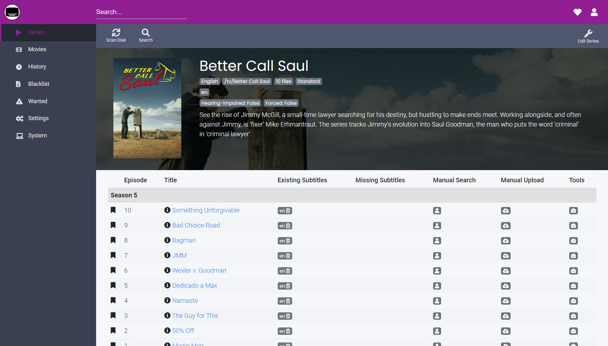

# Release Notes

## October 2020 (version 6.33)

### Highlights

- **Bazarr** is the latest application from DietPi optimised software portfolio. It is a companion application to Sonarr and Radarr, and manages and downloads subtitles based on defined requirements.

    {: width="1898" height="1080" loading="lazy"}

    For more details on installation and configuration open [DietPi Optimised Software - Bazarr](../../software/bittorrent/#bazarr) page.

    Companion application to Sonarr and Radarr, which manages and downloads subtitles based on your requirements, now available for install. Open [Bazarr](../../software/bittorrent/#bazarr) page in [Optimised software](../../software/).
    Many thanks to @DiogoAbu for doing this suggestion [Issue #2045](https://github.com/MichaIng/DietPi/issues/2045)

- **Docker logging available in RAM/journald**

    This feature is now available to newly fresh Docker installs or reinstalls. Logs are now done with limited verbosity to systemd-journald (RAM). They could be accessible running next command:

    ```sh
    journalctl -u docker -u containerd
    ```

    This change brings the advantage of reduced disk writes, as well as makes logs accessible to system journal (external to containerised environment). To fully benefit from this improvement, Docker can be reinstalled using next command:

    ```sh
    dietpi-software reinstall 162
    ```

    Many thanks to @SaturnusDJ for doing this suggestion: [Issue #2388](https://github.com/MichaIng/DietPi/issues/2388)

### Improvements

- **DietPi-Login** :octicons-arrow-right-16: Logins do not wait for DietPi-PostBoot to finish anymore, as this is not strictly required. On local console, DietPi-PostBoot processing output practically blocks login until finished or timed out and logins on any other console like SSH or serial do not require it. DietPi-PostBoot only checks for DietPi updates, starts background services and prints the pre-login banner to local console, nothing that is required for console usage.
- **DietPi-Autostart** :octicons-arrow-right-16: Autostart programs with a foreground process are now started as replacement for the DietPi-Login process via "exec" which saves 3-4 MiB RAM usage.
- **DietPi-Software** :octicons-arrow-right-16: When using an invalid input argument, dietpi-software now prints usage info to the terminal.
- **DietPi-Software** :octicons-arrow-right-16: The `"dietpi"` UNIX group has been made the primary group for all services which ran with `"Group=dietpi"` before: Transmission, Mopidy, MiniDLNA, Airsonic, Plex Media Server, Emby Server, Medusa, Tonido, Blynk Server, SABnzbd, Koel, NZBGet. If the user (+group) is created by an external package or installer, the original primary group is kept as supplementary group to not possibly break access permissions to pre-created directories and files. Currently, only exception from these changes is _Deluge_ - we don't want to run the separate web UI service with `dietpi` group permissions. In case of _Tautulli_, the `dietpi` group permissions are remove, since _Tautulli_ does not require it.
- **DietPi-Software** :octicons-commit-24: **phpBB** :octicons-arrow-right-16: New phpBB installations will be done using version 3.3.1. Existing instances won't be touched, as updates need to be done manually through the internal update mechanism, which includes the mandatory database migration. New phpBB installations will now be placed in `/var/www/phpbb` folder. The earlier installation location `/var/www/phpBB3` will still be handled gracefully, if available.
- **DietPi-Software** :octicons-commit-24: **OctoPrint** :octicons-arrow-right-16: The service runs now as user `octoprint`, the Git branch directory has been moved to `/opt/octoprint` and `/mnt/dietpi_userdata/octoprint` is the run users home and hence config and data directory now. To apply these changes, OctoPrint is reinstalled with DietPi v6.33, which includes the Python 3 migration (see v6.32 changelog) on Buster and Bullseye systems. This implies that the CLI (`octoprint` command) needs to be executed as user `octoprint` to invoke the correct configuration. A bash shell alias solves this automatically for all users with sudo permissions, but if you use a custom shell, the CLI needs to be called like:

    ```sh
    sudo -u octoprint octoprint <command>
    ```

    Many thanks to @ModischFabrications for reporting an issue that is related to the fact that the service ran as root user before: [Issue #3315](https://github.com/MichaIng/DietPi/issues/3315)

- **DietPi-Software** :octicons-commit-24: **Tautulli** :octicons-arrow-right-16: Directories, user and service are renamed from `"plexpy"` to `"tautulli"`. Additionally it runs with Python 3 now instead of Python 2. These changes are applied as well during DietPi update.
- **DietPi-Software** :octicons-commit-24: **Baïkal** :octicons-arrow-right-16: Update (re)install procedure to cover the new config directory and use the pre-packed release archives instead of raw source and composer. The webserver configurations have been added to harden access permissions.
- **DietPi-Software** :octicons-commit-24: **Mosquitto** :octicons-arrow-right-16: The official APT repository is now used where possible, which currently excludes ARMv8/arm64 and Raspbian/Debian Bullseye. This change is applied via reinstall during DietPi update. Many thanks to @marcobrianza for doing this suggestion: [Issue #3042](https://github.com/MichaIng/DietPi/issues/3042)
- **DietPi-Software** :octicons-commit-24: **Cuberite** :octicons-arrow-right-16: A wrong directory name based on a typo has been fixed. A reinstall updates Cuberite and moves its install directory to `/mnt/dietpi_userdata/cuberite` as intended. This is applied via DietPi update but a backup is created to cover issues due to potential structural changes, especially for older instances installed at `/etc/cuberite`.
- **DietPi-Software** :octicons-commit-24: **Amiberry** :octicons-arrow-right-16: An update to Amiberry v3.3 is applied during DietPi v6.33 update.
- **DietPi-Software** :octicons-commit-24: **LXDE** :octicons-arrow-right-16: By default, when double-clicking a desktop icon or executable file, it will be executed directly now, without being asked first what to do. This behaviour can be changed from within `PCManFM` file manager > "Edit" > "Preferences" > "General" > "Don't ask options to launch executable file".

### Documentation improvements

- **Installation guide** :octicons-arrow-right-16: It has been fully changed & simplified. There is a single page with more tabs. The page highlights different steps used for different platforms, while it keeps the common structure. Many thanks to @StephanStS for doing these updates.
- **Writing rules** :octicons-arrow-right-16: The documentation has evolved. It starts to have a file naming convention, more URLs updated and so on. Many thanks to @StephanStS for doing these updates.

### API Changes

- **DietPi-Globals** :octicons-arrow-right-16: The `G_FP_DIETPI_USERDATA` variable has been removed. Variables cannot be used in every context, e.g. not in config files stored on GitHub or dietpi.com for download, its value `/mnt/dietpi_userdata` does not change and using the path literally allows slightly simplified and hardened coding.

### Bug Fixes

- **General** :octicons-arrow-right-16: Resolved an issue where using `AUTO_UNMASK_LOGIND=1` or enabling Amiberry fast boot did not allow to start `systemd-logind` as intended if the required `dbus` package was not installed before. Many thanks to @razerbann for reporting this issue: [Issue #3770](https://github.com/MichaIng/DietPi/issues/3770)
- **RPi** :octicons-arrow-right-16: Resolved an issue where Allo USBridgeSig (`ASIX AX88179`) Ethernet fails due to non-matching driver. Many thanks to @dsnyder0pc for reporting this issue any many thanks to Allo for providing stable branch driver builds and a method to compare kernel module layouts: [Issue #3725](https://github.com/MichaIng/DietPi/issues/3725)
- **DietPi-Backup** :octicons-arrow-right-16: Resolved an issue where F2FS was not supported as target location. Since it has full UNIX permissions and `symlinks` support and can be used as rootfs file system, it can be used for OS backups as well. Many thanks to @Cjkeenan for reporting this issue: [Issue #606](https://github.com/MichaIng/DietPi/issues/606#issuecomment-695944450)
- **DietPi-Set_swapfile** :octicons-arrow-right-16: Resolved an issue where `swapon` failed on ext4 due to an external bug in Linux 5.7 and 5.8. The script now tries quick and less write-intense `fallocate` pre-allocation first, regardless of kernel version and file system type, and falls back to dd in case of failure. Many thanks to @auanasgheps for reporting this issue: [Issue #3756](https://github.com/MichaIng/DietPi/issues/3756)
- **DietPi-Config** :octicons-arrow-right-16: Resolved an issue where on devices with old Linux kernel versions (e.g. Sparky SBC with Linux 3.10.38) the Performance Options failed to open with a syntax error. Many thanks to @dsnyder0pc for reporting this issue: [Issue #3799](https://github.com/MichaIng/DietPi/issues/3799)
- **DietPi-Config** :octicons-arrow-right-16: Resolved an issue on RPi 2 where a wrong default SDRAM frequency was shown, which is 450 MHz instead of 400 MHz with current firmware.
- **DietPi-Software** :octicons-commit-24: **OpenTyrian** :octicons-arrow-right-16: The autostart option and run script have been fixed and slightly enhanced to lower RAM usage a bid.
- **DietPi-Software** :octicons-commit-24: **Firefox Sync Server** :octicons-arrow-right-16: Resolved an issue where the build failed due to missing MySQL/MariaDB headers, newly required. Many thanks to @kinoushe for reporting this issue: [Issue #3744](https://github.com/MichaIng/DietPi/issues/3774)
- **DietPi-Software** :octicons-commit-24: **Firefox Sync Server** :octicons-arrow-right-16: Resolved another issue where the build failed due to transition of the whole project from Python to Rust. We now stay on a fixed commit and won't ship newer Firefox Sync Server versions until this transition has been fully completed, as the install process and requirements will constantly change. Many thanks again to @kinoushe for reporting this issue.
- **DietPi-Software** :octicons-commit-24: **LXDE** :octicons-arrow-right-16: Resolved several issues due to conflicts between the RPi desktop LXDE packages with native LXDE.
- **DietPi-Software** :octicons-commit-24: **Webmin** :octicons-arrow-right-16: Worked around an issue where install failed. Webmin depends on `apt-show-versions` which does not support compressed APT list files, which has been implemented as default with DietPi v6.32.
- **DietPi-Software** :octicons-commit-24: **WebIOPi** :octicons-arrow-right-16: Resolved an issue where the download failed.
- **DietPi-Software** :octicons-commit-24: **Home Assistant** :octicons-arrow-right-16: Resolved an issue where install failed on ARM due to missing new build dependency. Many thanks to @pbutterworth for reporting and [phpBB:novitibo](https://dietpi.com/phpbb/memberlist.php?username=novitibo){: class="nospellcheck"} for providing the solution: [Issue Forum](https://dietpi.com/phpbb/viewtopic.php?&t=8095)
- **DietPi-Software** :octicons-commit-24: **Kodi** :octicons-arrow-right-16: Resolved an issue on Odroid XU4 where install failed due to missing `librockchip-mpp1` package which instead was aimed to be installed on Odroid N1 only.
- **DietPi-Software** :octicons-commit-24: **TigerVNC+LXDE** :octicons-arrow-right-16: Resolved an issue where `lxappearance` start ("Customize Look and Feel") hangs within TigerVNC sessions.
- **DietPi-Software** :octicons-commit-24: **Fail2Ban** :octicons-arrow-right-16: Resolved an issue where the service could have failed to start due to a missing variable declaration in our default config. Many thanks to [phpBB:mafioso12dk](https://dietpi.com/phpbb/memberlist.php?username=mafioso12dk){: class="nospellcheck"} for reporting this issue: <https://dietpi.com/phpbb/viewtopic.php?t=8147>
- **DietPi-Software** :octicons-commit-24: **DietPi-RAMlog** :octicons-arrow-right-16: Resolved an issue where /var/log content was not restored when reinstalling DietPi-RAMlog, e.g. when switching logging mode from #1 to #2. This could have led to service start issues, when those rely on log files or directories being present. Many thanks to [phpBB:djashdj](https://dietpi.com/phpbb/memberlist.php?username=djashdj){: class="nospellcheck"} for reporting this issue: <https://dietpi.com/phpbb/viewtopic.php?t=8163>

As always, many smaller code performance and stability improvements, visual and spelling fixes have been done, too much to list all of them here. Check out all code changes of this release on GitHub: <https://github.com/MichaIng/DietPi/pull/3829>
