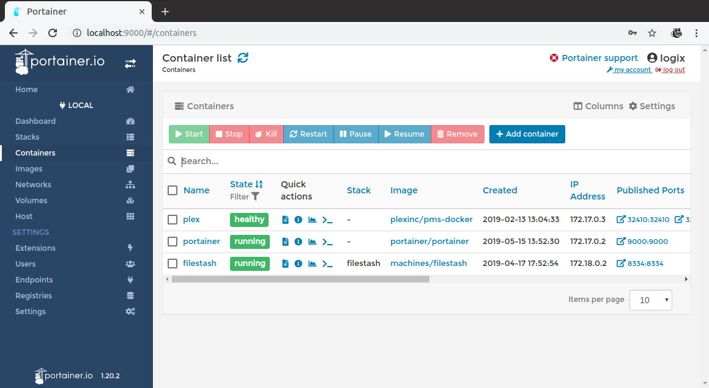
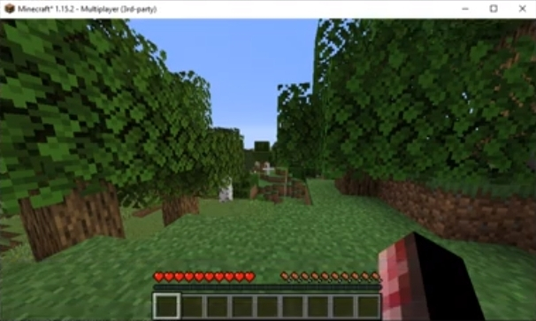
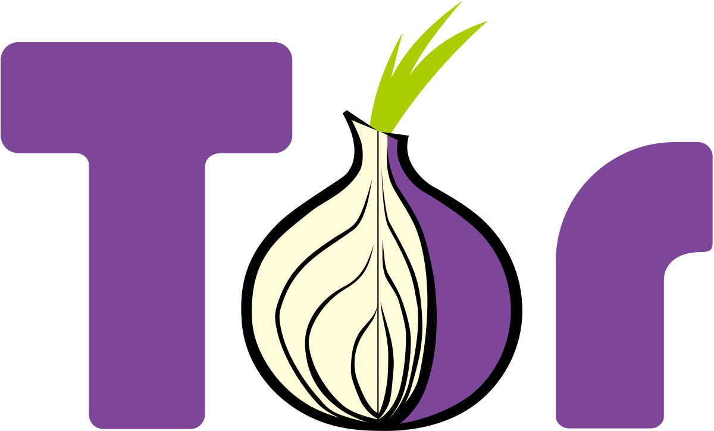
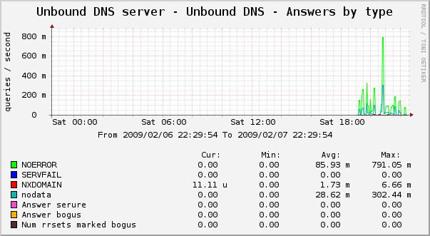
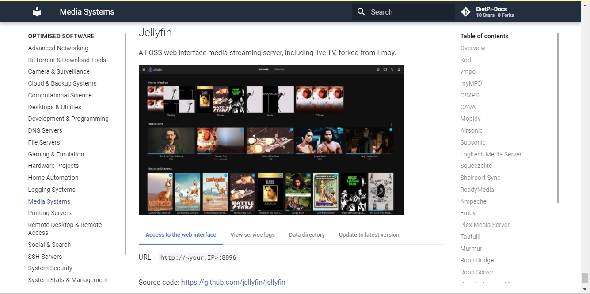

# Release Notes

## December 2020 (version 6.34)

### Overview

Welcome to **December 2020 release** :octicons-gift-16: of DietPi. This release includes **5 new software titles** :octicons-paper-airplane-16:, full support for newly launched **Raspberry Pi 400**, and more interesting features and bug fixes.

As a summary of 2020, DietPi had **8 releases** with over **175 000** downloads. It brought 128 :octicons-light-bulb-16: improvements and changes, as well as 119 :octicons-issue-closed-16: bug fixes.

{: width="447" loading="lazy"}

### New optimised software packages

**[Portainer - Docker container management](../../software/programming/#portainer)**

It is a new software package included in the DietPi optimised list. Portainer simplifies your Docker container management via Portainer web interface. It enables faster deploy of the applications and it gives real time visibility.

For more details check the [documentation page](../../software/programming/#portainer).

{: width="1159" loading="lazy"}

Many thanks to @Joulinar for implementing this software option - more details here: MichaIng/DietPi#3933

**[PaperMC - Highly optimised Minecraft server](../../software/gaming/#papermc)**

PaperMC extends the list of Minecraft servers supported by DietPi. It is a high performance fork of the Spigot Minecraft Server that aims to fix the game play and mechanics inconsistencies as well as to improve performance. It is written in Java, and it is extensible via plugins, now available for install.

For more details check the [documentation page](../../software/gaming/#papermc).

{: width="606" loading="lazy"}

Many thanks to @ravenclaw900 for implementing this software option: MichaIng/DietPi#3828

**[Tor Relay - Become part of the Tor Project](../../software/advanced_networking/#tor-relay)**

Become part of the Tor Project and turn your DietPi into a Tor relay to help others surf the Internet safely and privately.

For more details check the [documentation page](../../software/advanced_networking/#tor-relay).

{: width="200" height="121" loading="lazy"}

Many thanks to @ravenclaw900 for implementing this software option: MichaIng/DietPi#3921.

**[Unbound - Open Source DNS resolver](../../software/dns_servers/#unbound)**

Validating, recursive, caching DNS resolver is now available for install and integrate with [Pi-hole](../../software/dns_servers/#pi-hole).

For more details check the [documentation page](../../software/dns_servers/#unbound)

{: width="603" height="331" loading="lazy"}

Many thanks to @ravenclaw900 for implementing this software option: MichaIng/DietPi#3872

**[Bitwarden_RS - password manager server](../../software/cloud/#vaultwarden)**

Bitwarden_RS is a an unofficial Bitwarden password manager server with web UI, written in Rust and it is perfect for self-hosted deployments.

For more details check the [documentation page](../../software/cloud/#vaultwarden)

{: width="2000" height="823" loading="lazy"}

Many thanks to @CactiChameleon9 for implementing this software option (MichaIng/DietPi!3724).

### New supported SBC

New [Raspberry Pi 400](https://www.raspberrypi.org/blog/raspberry-pi-400-the-70-desktop-pc/) is now fully supported. Inspired by the home computers of the 1980s, Raspberry Pi 400 is a complete personal computer, built into a compact keyboard.

For more details on how to install DietPi, check the [documentation](../../hardware/#raspberry-pi).

{: width="800" height="571" loading="lazy"}

### Changes / Improvements / Optimisations

- **Enable automated APT package update checks and even upgrade them on a daily bases**. By setting the new `dietpi.txt` setting

    ```sh
    CONFIG_CHECK_APT_UPDATES=1
    ```

    you can enable daily APT update checks (default value). The result is shown in the DietPi login banner, in a similar way an available DietPi update is presented.

    dietpi-automated_APT_package_update
    {: width="670" height="326" loading="lazy"}

    Set

    ```sh
    CONFIG_CHECK_APT_UPDATES=2
    ```

    to have _APT packages upgraded automatically_ on a daily basis with logs saved in next file `/var/tmp/dietpi/logs/dietpi-update_apt.log`. Cron is used for the schedule, which means that you can control the execution time via `dietpi-cron > "cron.daily"`.

    Many thanks to @ravenclaw900 for implementing this feature: <https://github.com/MichaIng/DietPi/pull/3899>

- **DietPi Documentation** has been extended. It covers now all the **[DietPi Optimised Software](../../software/)** categories. Many thanks to @StephanStS for bringing all these updates.

    {: width="1335" height="667" loading="lazy"}

- **DietPi-Globals** :octicons-arrow-right-16: In DietPi scripts, the PATH variable is now overwritten with the Debian/bash system default to assure that no broken or manipulated PATH can be passed via e.g. `su` or `sudo -E`. This means that overrides must be placed in `/usr/local/(s)bin` now, which as well was the only save location for system-wide overrides before. Many thanks to @tandy-1000 for reporting a related issue (MichaIng/DietPi!3873).
- **DietPi-Set_swapfile** :octicons-arrow-right-16: Hardened permissions of the `/dev/zram0` zram-swap device to be only accessible by root user (mode 0600) and interpret input argument `/dev/zram0` and `zram0` as `zram-swap` as well, aside of `zram` only. Many thanks to @hansjuergenmay for reporting a related issue (MichaIng/DietPi!3869).
- **DietPi-NordVPN** :octicons-arrow-right-16: A function has been added update the NordVPN server list, e.g. when new servers are available that are closer to your location.
- **[DietPi-JustBoom](../../dietpi_tools/#configuration)** :octicons-arrow-right-16: The ALSA equalizer settings are not stored to `/var/lib/dietpi/dietpi-config/.alsaequal.bin` where all users/services can read it and all members of the `dietpi` group (or `root`) can create and write to it. Many thanks to @wowcut for reporting this issue (MichaIng/DietPi!3950).
- **[DietPi-Config | Raspberry Pi](../../dietpi_tools/#display-options)** :octicons-arrow-right-16: When applying less than 32 MiB GPU memory, the VCSM (VideoCore Shared Memory) device and kernel module are disabled now. The automatically loaded cut-down firmware files do not support it which leads to currently 5 expected kernel error messages. Disabling it in the first place might marginally speed up boot and reduce memory usage, but more importantly reduces confusion or worries induced by to the error messages.
- **[DietPi-Config | Audio Options](../../dietpi_tools/#audio-options)** :octicons-arrow-right-16: Added an option to switch between direct audio output and automatic software conversions, for channels, format and rate via ALSA "plug" plugin. This may be required to play any raw `.wav` file regardless of sound card capabilities and without defining supported values manually. Having automated software conversions enabled matches the Debian ALSA defaults but may increase CPU usage and decrease sound quality.
- **[DietPi-Config | Raspberry Pi](../../dietpi_tools/#advanced-options)**: When enabling I2C support, the Python 3 SMbus module is now installed instead of the deprecated Python 2 version. This matches as well the dependency of PiJuice, which nowadays pulls Python 3 SMbus as package dependency, hence this change avoids the obsolete install of the whole Python 2 stack when PiJuice is installed through dietpi-software. Many thanks to @Trunkzeh for reporting this issue: <https://github.com/MichaIng/DietPi/issues/3963#issuecomment-748547394>
- **[DietPi-Software | OpenBazaar](../../software/social/#openbazaar)** :octicons-arrow-right-16: Build is now done with the currently latest Go v1.15.3 and the service runs as unprivileged user `openbazaar` instead of `root`.
- **[DietPi-Software | XRDP](../../software/remote_desktop/#xrdp)** :octicons-arrow-right-16: Remote desktop connections can now be done with the `Xorg` method and hence don't require an active VNC server anymore. New installations will not pull TigerVNC as dependency and if only RDP is required, TigerVNC can be uninstalled.
- **[DietPi-Software | Single File PHP Gallery](../../software/social/#image-gallery)** :octicons-arrow-right-16: Updated new installs to latest v4.7.1. Run `dietpi-software reinstall 56` to upgrade your existing instance.
- **[DietPi-Software | MineOS](../../software/gaming/#mineos)** :octicons-arrow-right-16: A systemd service is now used to run the daemon in favour of the previous supervisor, the obsolete `mineos` user is not created anymore, Node.js v11 is used to build MineOS, obsolete dependencies have been removed and a reinstall will now perform a MineOS upgrade and the existing `/etc/mineos.conf` is not replaced anymore.
- **[DietPi-Software | Mycroft AI](../../software/hardware_projects/#mycroft-ai)** :octicons-arrow-right-16: By default, the ALSA automatic conversions plugin is enabled now on install, which enables OOTB compatibility with all `.wav` sound formats and sound card. Additionally listener sampling rate override (48000 Hz) has been removed, reverting to Mycroft default (16000 Hz), which might solve an issue with hanging microphone level in CLI and related failing voice detection.
- **[DietPi-Software | Gogs](../../software/cloud/#gogs)** :octicons-arrow-right-16: Has been enabled for ARMv8 boards and on ARMv7 boards the newest version is installed again, which was not the case since Gogs v0.12. due to changed download names. Many thanks to [phpBB:MadKernel](https://dietpi.com/phpbb/memberlist.php?username=MadKernel){: class="nospellcheck"} for bringing ARMv8 support back to our attention: <https://dietpi.com/phpbb/viewtopic.php?t=8276>
- **[DietPi-Software | Folding@Home](../../software/distributed_projects/#foldinghome)** :octicons-arrow-right-16: Is now available for ARMv8 (arm64) boards. Donate your idle CPU power to help researchers fighting against diseases like Cancer, Alzheimer, Ebola and COVID-19.
- **[DietPi-Software | Radarr](../../software/bittorrent/#radarr)** :octicons-arrow-right-16: Has been upgraded to the newest major version 3, including the required branch migration (from "develop" to "master") and, for non-ARMv6 boards, a migration to the now available .NET-based build away from Mono. This change is applied to all DietPi systems via Radarr reinstall, preserving your data and configs of course.
- **[DietPi-Software | OctoPrint](../../software/printing/#octoprint)** :octicons-arrow-right-16: Is now available via PyPI repository, hence can be installed and updated easier and faster without downloading and building from the sources. Git is not required anymore, as the internal updater as well uses Python pip only. We migrate all DietPi OctoPrint instances to the new version and new install method, so that the Git/install directory `/opt/octoprint` is obsolete and removed. All your data will be preserved, of course. Many thanks to @Stinocon for reporting issues related to our previous implementation: <https://github.com/MichaIng/DietPi/issues/3940>

### Removed Software Packages

- **DietPi-Software** | **CloudPrint** :octicons-arrow-right-16: This software option has been removed, since the Google Cloud Print service will be shut down at the end of 2020 and we don't want to offer software options which will work for at most two months. Please migrate to another printing solution in time. Already installed CloudPrint instances will remain installed and the system service remains functional until the end of the year. With the first DietPi release in 2021 we will remove service handling and offer the package removal during the update process. Further information can be found here: <https://www.google.com/cloudprint/learn/>
- **DietPi-Software** | **Tonido** :octicons-arrow-right-16: This software option has been removed, since it is not developed anymore fore three years, no sources have been found and the latest binaries require ancient library versions which fail to be easily installed on currently supported Debian versions.

### Bug Fixes

- **[DietPi-Config](../../dietpi_tools/#configuration)** :octicons-arrow-right-16: Resolved an issue on RPi where the onboard 3.5mm jack selection did not work if an HDMI screen was attached. When selecting explicit either HDMI audio or onboard 3.5mm jack, the other one is now disabled on device tree level, which means it cannot be switched without reboot. This is currently the only known way to assure that 3.5mm jack is used for audio output regardless of now or later attached or detached HDMI screens. Many thanks to @corasaniti for reporting this issue: <https://github.com/MichaIng/DietPi/issues/3887>
- **[DietPi-Config](../../dietpi_tools/#configuration)** :octicons-arrow-right-16: Resolved an issue on RPi where selecting the `waveshare32` LCD panel installed an outdated device tree overlay, incompatible with the current Linux 5.4 kernel. Many thanks to @black00019 for reporting this issue: <https://github.com/MichaIng/DietPi/issues/3881>
- **[DietPi-Services](../../dietpi_tools/#configuration)** :octicons-arrow-right-16: Resolved an issue where CPU affinity selection failed due to a syntax error.
- **[DietPi-Bugreport](../../dietpi_tools/#dietpi-bug-report)** :octicons-arrow-right-16: Resolved an issue where bug report uploads were cancelled if connection test on port 80/443 failed even that uploads are done via SFTP on port 22.
- **DietPi-Cleaner** :octicons-arrow-right-16: Resolved an issue where cleaner selection failed with a syntax error.
- **DietPi-Sync** :octicons-arrow-right-16: Resolved an issue where setting the delete mode to "On" did not have any effect on it. Many thanks to [phpBB:mafioso12dk](https://dietpi.com/phpbb/memberlist.php?username=mafioso12dk){: class="nospellcheck"} for reporting this issue: <https://dietpi.com/phpbb/viewtopic.php?t=8226>
- **DietPi-Banner** + **DietPi-NordVPN** :octicons-arrow-right-16: Resolved an issue where WAN IP changed to a multi-line output. Many thanks to @maartenlangeveld for reporting this issue: <https://github.com/MichaIng/DietPi/issues/3908>
- **[DietPi-CloudShell](../../software/system_stats/#dietpi-cloudshell)** :octicons-arrow-right-16: Resolved an issue where scene selection failed with a syntax error. Many thanks to @ravenclaw900 for reporting this issue: <https://github.com/MichaIng/DietPi/issues/3880>
- **[DietPi-Software | PiVPN](../../software/vpn/#pivpn)** :octicons-arrow-right-16: Resolved an issue where the installer hang since the interactive whiptail dialogues were not shown on console. Many thanks to @kelliegator for reporting this issue: <https://github.com/MichaIng/DietPi/issues/3844>
- **[DietPi-Software | Medusa](../../software/bittorrent/#medusa)** :octicons-arrow-right-16: Resolved an issue where Medusa failed to start after install. Many thanks to @Luan7805 for reporting this issue: <https://github.com/MichaIng/DietPi/issues/3842>
- **[DietPi-Software | Webservers](../../software/webserver_stack/#webservers)** :octicons-arrow-right-16: Resolved an issue where reinstall failed if `/var/www/html` did not exist.
- **[DietPi-Software | Lighttpd](../../software/webserver_stack/#lighttpd)** :octicons-arrow-right-16: Resolved an issue where (re)install failed if the `fastcgi` or `fastcgi-php` module was enabled already.
- **DietPi-Software** | **O!MPD** :octicons-arrow-right-16: Resolved an issue where the URL check for youtube-dl failed.
- **[DietPi-Software | Single File PHP Gallery](../../software/social/#image-gallery)** :octicons-arrow-right-16: Resolved an issue where directory previews were not shown due to missing permissions. Many thanks to [phpBB:tallbastard](https://dietpi.com/phpbb/memberlist.php?username=tallbastard){: class="nospellcheck"} for reporting this issue: <https://dietpi.com/phpbb/viewtopic.php?p=28155#p28155>
- **[DietPi-Software | WebIOPi](../../software/hardware_projects/#webiopi)** :octicons-arrow-right-16: Resolved an issue where the download and install failed.
- **[DietPi-Software | Nginx](../../software/webserver_stack/#nginx)** :octicons-arrow-right-16: Resolved an issue where the amount of worker processes was not set to the amount of CPU threads as intended.
- **[DietPi-Software | MineOS](../../software/gaming/#mineos)** :octicons-arrow-right-16: Resolved an issue where the Node.js downgrade an hence the web UI compiling failed. Many thanks to @CactiChameleon9 for reporting this issue: <https://github.com/MichaIng/DietPi/issues/3901>
- **[DietPi-Software | Mycroft AI](../../software/hardware_projects/#mycroft-ai)** :octicons-arrow-right-16: Resolved an issue where skill installs failed due to missing permissions. Many thanks to [phpBB:GreenGentleman](https://dietpi.com/phpbb/memberlist.php?username=GreenGentleman){: class="nospellcheck"} for reporting this issue: <https://dietpi.com/phpbb/viewtopic.php?p=28464#p28464>
- **[DietPi-Software | Jellyfin](../../software/media/#jellyfin)** :octicons-arrow-right-16: Resolved an issue where Jellyfin did not run on ARMv6 (RPi 1 and Zero models). ARMv6/Raspbian-compatible binaries are now shipped via different APT repository. Many thanks to [phpBB:Shiivu](https://dietpi.com/phpbb/memberlist.php?username=Shiivu){: class="nospellcheck"} for reporting this issue: <https://dietpi.com/phpbb/viewtopic.php?t=8263>
- **[DietPi-Software | WiFi Hotspot](../../software/advanced_networking/#wifi-hotspot)** :octicons-arrow-right-16: Resolved an issue on RPi with WiFi adapters using an `RTL8188C*` chip, where the service failed to start due to an invalid driver. Many thanks to [phpBB:yerc](https://dietpi.com/phpbb/memberlist.php?username=yerc){: class="nospellcheck"} for reporting this issue: <https://dietpi.com/phpbb/viewtopic.php?p=28984#p28984>
- **[DietPi-Software | OctoPrint](../../software/printing/#octoprint)** :octicons-arrow-right-16: Resolved an issue where the service and system could not be restarted anymore via OctoPrint web UI and, on RPi, the CPU throttling state could not be derived.
- **[DietPi-Software | Ampache](../../software/media/#ampache)** :octicons-arrow-right-16: Resolved an issue where the install failed due to an incompatible PHP composer version and it was not possible to update the configuration file to a new version through the web interface. Many thanks to [phpBB:kk345](https://dietpi.com/phpbb/memberlist.php?username=kk345){: class="nospellcheck"} for reporting these issues: <https://dietpi.com/phpbb/viewtopic.php?t=8367>

As always, many smaller code performance and stability improvements, visual and spelling fixes have been done, too much to list all of them here. Check out all code changes of this release on GitHub.
