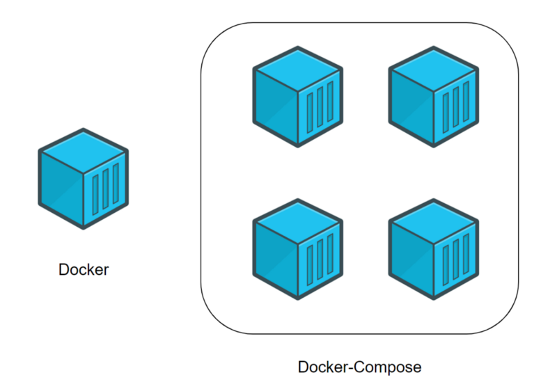

# Release Notes

## February 2021 (version 7.0)

### Overview

Welcome to **February 2021 release** :octicons-heart-16: of **DietPi**. With this release we changed the major version number, becoming **Version 7**! We expect a smooth upgrade :octicons-thumbsup-16:

{: width="300" loading="lazy"}

!!! info "Why this upgrade to version 7?"

    A new check of the system updates has been implemented. This checks for a minimum required Debian and DietPi version and migrates systems with either too old Debian version or too old DietPi version to a different Git branch automatically. This process smooths the migration of our code base to newer Debian versions.

    The alternative branch can be used to inform and support Debian distribution upgrades and to upgrade the DietPi code to an intermediate version from where the system can be migrated back to the regular stable/master branch.

    Since this change required a new repository version file, we incremented the DietPi core version to v7.0. The change to version 7 is also motivated by the long list of improvements brought in 2020. All of these qualify the system to be upgraded to a new version.

    This change has NO side effects! We encourage you to do it. All previously supported DietPi and Debian versions remain supported! This change enables us to NOT require fresh image installs for major upgrades (like we did a few years ago when an upgrade from v159 to v6.0 was required).

This new version includes **4 new software titles** :octicons-paper-airplane-16:

### New optimised software packages

**[Docker Compose](../../software/programming/#docker-compose)**

Docker Compose is a tool to define and run multi-container Docker applications. It can now be installed through our software selection. [Docker](../../software/programming/#docker) will be pulled-in automatically (as dependency).

**What would Docker Compose bring to you?**

Whenever you have multiple containers :octicons-server-16: , there are many tasks you need to do: deploy and configure each individual container, and configure them to talk to each other as well. This will be tedious even with few containers.

[Docker Compose](../../software/programming/#docker-compose) lets you automate the deployment of multiple containers using an YAML file. This file enable you to configure your application’s services and create all the app’s services from this configuration.

{: width="500" height="351" loading="lazy"}

Find sample applications using Docker Compose and more details in the [documentation page](../../software/programming/#docker-compose).

**[Steam](../../software/gaming/#steam)** & **[Box86](../../software/gaming/#box86)**

[Steam](../../software/gaming/#steam) for ARM processors has been a feature request for many years. Since it became possible to install on ARM boards, it's now available also on DietPi. [Box86](../../software/gaming/#box86) is installed automatically, as dependency.

The Steam platform is one of the largest digital distribution platform for gaming. Still, on ARMv7 boards it has limited features and game support. This YouTube video shows a few sample games running with [Box86](../../software/gaming/#box86): <https://www.youtube.com/watch?v=z-4aGNqZ724>

!!! info ""

    **Caution:** Steam may not run perfectly stable yet :octicons-beaker-16:. It could also crash when trying to allocate space for the games and it would resume the downloads once started again.

    We're optimistic that further improvements will address these issues and more enhancements will be available in the future :octicons-heart-16:

[Box86](../../software/gaming/#box86) is a x86 wrapper/emulator for ARMv7 systems, and it is now available for install. Thanks to it's ability to wrap ARMv7 shared system libraries to be used with i386 binaries, often no additional libraries are needed to be installed.

!!! info ""

    Thanks to <https://github.com/tbinfm>, it will be invoked automatically when an i386 binary is executed.

**[mjpg-streamer](../../software/camera/#mjpg-streamer)**

**mjpg-streamer** is a lightweight multi-source and multi-output plugin JPEG streamer and it is now available for install. It can be used to stream JPEG files over an IP-based network from a webcam to various types of viewers.

By default your attached camera capture will be streamed to a custom HTTP port. If [OctoPrint](../../software/printing/#octoprint) is installed, mjpg-streamer will be automatically configured to work together. When installed on [Raspberry Pi](../../hardware/#raspberry-pi), the Raspberry Pi camera module support will be enabled by default.

For more details check the documentation page: [mjpg-streamer](../../software/camera/#mjpg-streamer).

### Changes / Improvements / Optimisations

- **Network** :octicons-arrow-right-16: A change has been implemented on the order in which network-related systemd service targets are reached. "`network.target`" and "`network-online.target`" are now reach after all network interfaces have been configured, rather then already after only the loopback interface "lo" has been configured. This affects only `systemd` services which are not started by [DietPi-Services](../../dietpi_tools/#dietpi-services), e.g. SSH/DNS/VPN/VNC servers, with the effect that they are assured to be able to bind to interfaces/IPs, where currently they would fail. The downside is, if one has an Ethernet adapter configured via dietpi-config or /etc/network/interfaces (as `allow-hotplug` device), but the cable not connected, affected services may be delayed until the interface bring-up timed out.
- [DietPi-Backup](../../dietpi_tools/#dietpi-backup-backuprestore) :octicons-arrow-right-16: A new feature has been added which allows to automatically restore a dietpi-backup on first boot.

    For this set the new `dietpi.txt` option

    ```sh
    AUTO_SETUP_BACKUP_RESTORE=1
    ```

    , to get a list of found backups to select from (this does not work in combination with `AUTO_SETUP_AUTOMATED=1`).

    All attached drives are mounted temporarily and searched automatically.
    Set

    ```sh
    AUTO_SETUP_BACKUP_RESTORE=2
    ```

    to have the first found backup restored non-interactively (this works in combination with `AUTO_SETUP_AUTOMATED=1`).

    The restore runs after the initial update, hence works with older images as well and can be done via SSH connection. Credits go to @ravenclaw900 for implementing this feature: <https://github.com/MichaIng/DietPi/pull/4112>.

- **DietPi-Backup** :octicons-arrow-right-16: Support for XFS and ZFS target file system types has been added, which fully support the required symlink and POSIX permissions capabilities.
- **DietPi-Config** | **RPi** :octicons-arrow-right-16: An option has been added to toggle the SPI interface. Many thanks to @incanus for resurrecting this old feature request: <https://github.com/MichaIng/DietPi/issues/98#issuecomment-783650204>.
- **DietPi-Software** :octicons-arrow-right-16: The mandatory reboot after installs has been removed. Installed services, which are not controlled by DietPi-Services, but would start automatically on reboot, are now started at the end of installs instead. A manual reboot is still a good idea, but strictly required only in rare cases. Many thanks to @Games-Crack for doing this suggesting: <https://github.com/MichaIng/DietPi/issues/4032>.
- **DietPi-Software** :octicons-arrow-right-16: Installs do not imply all APT package upgrades anymore. While we recommend to keep all APT packages upgraded regularly, the new daily APT check and info within the DietPi-Banner, helps to keep you informed to do the best decision yourself whether and when to apply which package upgrade. On first run installs the full upgrade is however kept, to assure each image starts in fully upgraded state, and packages which are required for the actual software choices you're installing, are upgraded as well, when installed already.
- **DietPi-Software** :octicons-arrow-right-16: Uninstalls do not stop other services anymore. E.g. your webserver or media streaming server will stay active while you uninstall that other software that you don't require anymore. Since uninstalls do not require much RAM or CPU resources, this is perfectly fine. Many thanks to @mrgreaper giving the hint: <https://github.com/MichaIng/DietPi/issues/4116>.
- **DietPi-Software** - **[Unbound](../../software/dns_servers/#unbound)** :octicons-arrow-right-16: On install in combination with Pi-hole, no additional configuration file will be created anymore but the adjusted interface binding and port will be applied to "/etc/unbound/unbound.conf.d/dietpi.conf". Declaring "interface" in two configuration files do not override each other but lead to two concurrent bindings, which is not intended. The two files, if present, will be merged as well on DietPi update. It is hence intended that admins change "dietpi.conf" directly, if required, and this file won't be overwritten on reinstalls to preserve local changes. Additionally, on new installs, the configuration file will be better sorted and contain comments to explain their purpose.
- **DietPi-Software** - **[Unbound](../../software/dns_servers/#unbound)** :octicons-arrow-right-16: On new installs, by default access is now granted to all private IPv4 and IPv6 address ranges instead of to the `192.168.0.0/16` subnet only, which includes VPN interfaces, containers and cases of multiple local networks the server is attached to.
- **DietPi-Software** - **[Unbound](../../software/dns_servers/#unbound)** :octicons-arrow-right-16: A monthly cron job is now created to keep the root hints file updated. Many thanks to @APraxx for doing this suggestion: <https://github.com/MichaIng/DietPi/issues/4077>.
- **DietPi-Software** | **Python 3**: `pip` and pip-based installs on ARMv6 and ARMv7 boards will have the piwheels.org repository for pre-compiled wheels added automatically, which can reduce build dependencies and compile time dramatically.
- **DietPi-Software** | **[Node-RED](../../software/hardware_projects/#node-red)**: New installs and reinstalls will setup [Node-RED](../../software/hardware_projects/#node-red) as local module for the `nodered` service user, rather than as global system module/command. This allows upgrading and removing all related Node modules through the web interface, instead of just the ones which were installed via web interface. Additionally a console alias for the "node-red-admin" CLI command has been added so that running this command with any user will call the local Node-RED instance as `nodered` service user.
- **DietPi-Software** | **[Docker](../../software/programming/#docker)**: The Docker APT repository is now installed manually instead of using the official Docker installer. This allows us to enable the Docker install option for Debian Bullseye systems, if only to allow widened testing of this upcoming Debian release with DietPi.

### Interface updates

- **DietPi-Banner** :octicons-arrow-right-16: Running the script without input argument will now open the menu instead of printing the banner. The console alias has been adjusted accordingly, so that it is now possible to run "dietpi-banner 0" and "dietpi-banner 1" from console to have full and short banner versions printed. The "dietpi-banner" console command remains opening the menu.

### Bug fixes

- **Audio** :octicons-arrow-right-16: Resolved a bug with Debian Buster, where the ALSA state daemon was always running, even when it was not configured.
- **DietPi-Globals** | `G_OBTAIN_CPU_TEMP` :octicons-arrow-right-16: Negative temperatures are not trusted anymore, "N/A" will be printed instead. This allows a generic approach to fix/allow temperature estimation on further SBC models. Many thanks to [@Thanapat](https://dietpi.com/forum/u/Thanapat){: class="nospellcheck"} for reporting a related issue on Roseapple Pi: <https://dietpi.com/phpbb/viewtopic.php?t=8677>
- **DietPi-Set_swapfile** :octicons-arrow-right-16: Resolve an issue where `zram`/`zram0` `dietpi.txt` path entries were dropped, when running the script without input arguments. This especially broke applying `zram-swap` on first boot. Many thanks to @Dr0bac for reporting this issue: <https://github.com/MichaIng/DietPi/issues/4002>
- **DietPi-Software** | **[Bitwarden_RS](../../software/cloud/#vaultwarden)** :octicons-arrow-right-16: Resolved an issue where the self-signed TLS certificate could not be imported on iOS. To apply this fix to an existing instance, the configuration file `/mnt/dietpi_userdata/bitwarden_rs/bitwarden_rs.env` needs to be removed or moved to a different location, so `dietpi-software reinstall 183` will re-create the configuration and TLS certificate.
- **DietPi-Software** | **[Unbound](../../software/dns_servers/#unbound)** :octicons-arrow-right-16: Resolved an issue where during install in combination with Pi-hole the service restart could have failed. Many thanks to @Ernstian for reporting this issue: <https://github.com/MichaIng/DietPi/issues/2409#issuecomment-739154892>
- **DietPi-Software** | **[Unbound](../../software/dns_servers/#unbound)** :octicons-arrow-right-16: Resolved an issue where the service start failed if the host system had a local IP address outside of the 192.168.0.0/16 subnet. Many thanks to @faxesystem for reporting this issue: <https://github.com/MichaIng/DietPi/issues/2409#issuecomment-749174984>
- **DietPi-Software** | **[ReadyMedia](../../software/media/#readymedia)** :octicons-arrow-right-16: Resolved an issue where the media library was not re-scanned on service start.
- **DietPi-Software** | **[WiFi Hotspot](../../software/advanced_networking/#wifi-hotspot)** :octicons-arrow-right-16: Resolved an issue where the install on Armbian-based images with `RTL8188C*` WiFi chip failed. Many thanks to [@smogan71](https://dietpi.com/forum/u/smogan71){: class="nospellcheck"} for reporting this issue: <https://dietpi.com/phpbb/viewtopic.php?t=8523>
- **DietPi-Software** | **[Medusa](../../software/bittorrent/#medusa)** :octicons-arrow-right-16: This software option has been disabled on Stretch systems, since it now requires Python >=3.6, which is not available in the Debian Stretch repository. If you run Medusa on a Stretch system, it will continue to work, but updating will either not be possible or break it. Many thanks to @aermak for reporting this issue: <https://github.com/MichaIng/DietPi/issues/3991>
- **DietPi-Software** | **[WiringPi](../../software/hardware_projects/#wiringpi)** :octicons-arrow-right-16: Resolved an issue where the install failed, if the `/usr/local/bin` directory was not present. Many thanks to [@bruz](https://dietpi.com/forum/u/bruz){: class="nospellcheck"} for reporting this issue: <https://dietpi.com/phpbb/viewtopic.php?t=8609>
- **DietPi-Software** | **[PaperMC](../../software/gaming/#papermc)** :octicons-arrow-right-16: Resolved an issue where the install failed due to changed download URLs and stabilised service start and config creation by setting the Java heap size and allowing more time for the startup on smaller SBCs. Many thanks to [@omavoss](https://dietpi.com/forum/u/omavoss){: class="nospellcheck"} for reporting this issue: <https://dietpi.com/phpbb/viewtopic.php?p=30191#p30191>
- **DietPi-Software** | **[OpenTyrian](../../software/gaming/#opentyrian)** :octicons-arrow-right-16: The install option has been disabled on x86_64, since the Debian package comes with a different file structure and it has been disabled on 64-bit RPi systems, since the binary has been compiled for `armhf`.
- **DietPi-Software** | **[Domoticz](../../software/home_automation/#domoticz)** :octicons-arrow-right-16: Resolved an issue where saving custom scripts and starting with a template did not work. Many thanks to [@tec13](https://dietpi.com/forum/u/tec13){: class="nospellcheck"} for reporting this issue: <https://dietpi.com/phpbb/viewtopic.php?t=8627>
- **DietPi-Software** :octicons-arrow-right-16: Resolved an issue where for [ruTorrent](../../software/bittorrent/#rtorrent), [Koel](../../software/media/#koel) and [Bitwarden_RS](../../software/cloud/#vaultwarden) the automatic newest version detection failed and instead a possibly older fallback was used. Many thanks to @kelvmod for reporting this issue: <https://github.com/MichaIng/DietPi/issues/4105>
- **DietPi-Software** | **[LXQt](../../software/desktop/#lxqt)** :octicons-arrow-right-16: Resolved visual issues with our default configuration of Debian Buster, drastically simplified and cleaned up the files we ship.
- **DietPi-Software** | **[SABnzbd](../../software/bittorrent/#sabnzbd)** :octicons-arrow-right-16: Resolved an issue on Stretch where the install failed due to raised minimum [Python](../../software/programming/#python-3) version with SABnzbd v3.2.0. If Python 3.5 is installed, SABnzbd v3.1.1 will be installed now to allow keeping the install option enabled for now. Many thanks to @19eighties for reporting this issue: <https://github.com/MichaIng/DietPi/issues/2762#issuecomment-787118995>

!!! hint ""

    As always, many smaller code performance and stability improvements, visual and spelling fixes have been done, too much to list all of them here. Check out all code changes of this release on GitHub: <https://github.com/MichaIng/DietPi/pull/4126>
