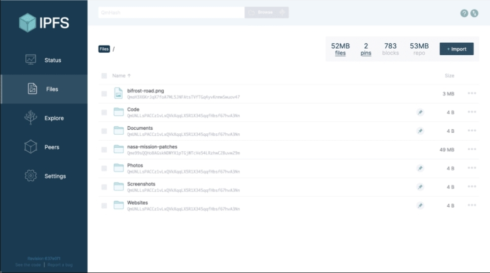
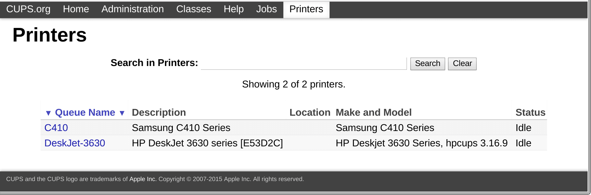
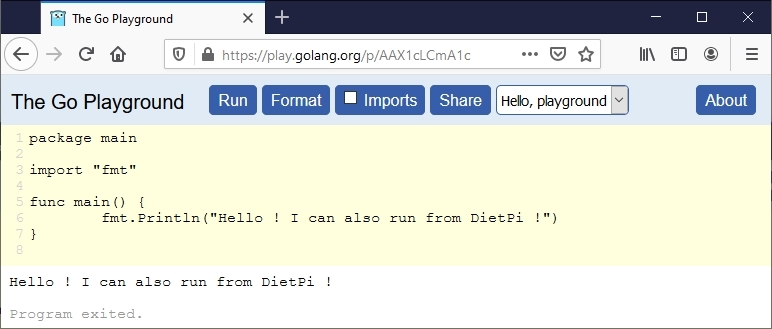
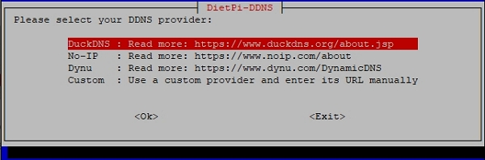
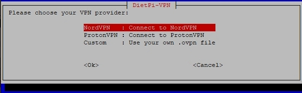
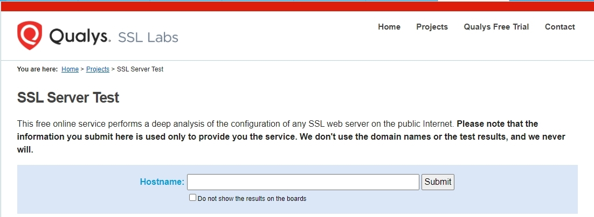

# Release Notes

## April 2021 (version 7.1)

### Overview

Welcome to **April 2021 release** :octicons-heart-16: of **DietPi**. It's an incremental release focused to simplify the software selection and improve things you can do with **DietPi**. It's now easier to connect (DDNS), secure (VPN, LetsEncrypt), share files or data (IPFS), print (CUPS) and configure.

:octicons-paper-airplane-16: If you have not tried yet DietPi 7, this is an excellent upgrade!

{: width="320" height="427" loading="lazy"}

!!! cite ""

    _Photo by [David Pisnoy](https://unsplash.com/@davidpisnoy){: class="nospellcheck"} on [Unsplash](https://unsplash.com)_{: class="nospellcheck"}

!!! hint "Highlights"

    - [**Merged software list**](#select-software-from-a-merged-list)

        The software selection is now simplified! You have a single list to choose from, with over 190 software options!

    - [**New software**](#new-optimised-software-in-71)

        IPFS Nodes, Common UNIX Printing System (CUPS), and more in programming (Go language, and an excellent IDE: VSCodium).

    - [**DietPi tools**: Additions & Major updates](#dietpi-tools-in-71-new-notable-updates)

        DietPi supports more VPN clients and it has more Dynamic DNS options. Enabling SSL/TLS certificates is easier now using the updates brought to `DietPi-LetsEncrypt` tool. You can find more enhancements brought to: `DietPi-Drive_Manager`, `DietPi-Config`.

    - [**Improvements**](#changes-improvements-optimisations-in-71)

        More improvements to different software titles.

    - [**Bug fixes**](#bug-fixes-in-71) & updates to [**supported SBC**](#supported-sbc-updates-in-71) list

Many thanks to all contributors and beta testers :octicons-heart-16: :octicons-heart-16:.  
With your help we could achieve all of these updates! Install or upgrade to this latest update - it has more things we hope you would enjoy!  
Share your feedback on [Twitter](https://twitter.com/DietPi_), [DietPi Forum](https://dietpi.com/phpbb/), and report any issue to [GitHub](https://github.com/MichaIng/DietPi/issues)!

!!! check "Next DietPi release"

    As a new feature, we will introduce shorter release cycles and a fixed schedule. The next update is already planned: ***DietPi 7.2 will be launched on 2021-05-29***.

### Select software from a merged list

The _optimised_ and _additional_ software menus have been merged within the `dietpi-software` tool. The earlier split did not follow consistent rules. The merge allows development tools and platforms a more prominent position. It also simplifies the software selection and it addresses a possible confusion about that separation among the community.

{: width="641" height="322" loading="lazy" }

_Note:_ Since multiple software titles were listening on the ports `5000` and `8000`, the default ports of those titles have been changed to avoid conflicts on concurrent installs. No change is done during the DietPi update, even a software title reinstall won't change it, in most cases. For details see the individual software changes below.

### New software titles

- [**IPFS Node**](../../software/distributed_projects/#ipfs-node)

    The **InterPlanetary File System** (IPFS) is a protocol and peer-to-peer network for storing and accessing files, applications, data in a distributed file system. It is now available to install using `dietpi-software` or directly using the software ID `186`.

    Once installed, you can access the Web UI using the link: `http://<your.IP>:5003/webui`

    {: width="983" height="549" loading="lazy"}

    Many thanks to @ravenclaw900 for implementing this software option: <https://github.com/MichaIng/DietPi/issues/4232>

- [**CUPS**](../../software/printing/#cups)

    **Common UNIX Printing System** (CUPS) is a standard and modular printing system that can process numerous data formats on the print server and also supports Internet Printing Protocol (IPP).

    It is now available as optimised install option using with the software ID `187`, including a web interface to manage & share local and network printers across your LAN.

    {: width="1727" height="573" loading="lazy"}

- [**VSCodium**](../../software/programming/#vscodium)

    It is 100% Open Source Version of [Microsoft VS Code](https://code.visualstudio.com). It’s identical to VS Code with the single biggest difference that unlike VS Code, VSCodium doesn’t track your usage data (and it does not including Microsoft branding, telemetry and licensing).

    VSCodium is an excellent editor not only for web developers, but also for other programmers. Due to its features, it’s considered one of the best open source code editors, with full support for various programming languages, including Java, JavaScript, Go, Node.js, Python and C++.

    {: width="1028" height="799" loading="lazy"}

- [**Go** Programming Language](../../software/programming/#go)

    **Go** <https://golang.org> is an open source programming language that makes it easy to build simple, reliable, and efficient software.

    Its installation was previously tied into the [OpenBazaar](../../software/social/#openbazaar) installation. _Go_ programming language has now become a dedicated install option using `dietpi-software` or directly using the software ID `188`. The installation includes the runtime system, package installer and compiler tool chain, as found at <https://golang.org/dl/>.

    You can use an editor of your choice, or use [VSCodium](../../software/programming/#vscodium). The _Go extension_ available in VSCodium provides rich language support for the Go programming language.

    Just to have a taste of it, you could run some commands in this [_Go playground_](https://play.golang.org/p/AAX1cLCmA1c)

    {: width="772" height="329" loading="lazy"}

### DietPi Tools (new / notable updates)

- [**DietPi-DDNS**](../../dietpi_tools/#dietpi-ddns)

    It is a new DietPi tool and it allows you to manage domains for your **dynamic IP address**.

    {: width="600" height="97" loading="lazy"}

    Select a Dynamic DNS (DDNS) provider or add a custom API URL, to have your DDNS entry updated regularly, via `cURL` and Cron job. Among others, it supports No-IP and replaces the No-IP client that DietPi supported until now.

    {: width="600" height="198" loading="lazy"}

- [**DietPi-VPN**](../../dietpi_tools/#dietpi-vpn)

    It is a major upgrade of an already available tool `DietPi-NordVPN` which is now retired.

    {: width="600" height="95" loading="lazy"}

    It enables more VPN clients, and it comes with a ProtonVPN client, as well as with a custom OVPN config. The script has been moved to `/boot/dietpi/dietpi-vpn` and the console command alias changed to `dietpi-vpn` accordingly.

    {: width="600" height="186" loading="lazy"}

    Additionally a `killswitch` feature has been added. It forcefully drops all WAN packets not sent through the VPN, when the connection got lost, until the VPN is disconnected manually/intentionally. Furthermore, IPv6 is now automatically disabled when the VPN connection is established. This is required to prevent IPv6 leaks as most publish VPN providers/servers do not support IPv6. Earlier, IPv6 was automatically re-enabled once the VPN connection stopped.

    Many thanks to @ravenclaw900 for doing this major rework - see <https://github.com/MichaIng/DietPi/pull/4180>.

- [**DietPi-LetsEncrypt**](../../dietpi_tools/#dietpi-letsencrypt) is easier to use and has multiple enhancements :octicons-arrow-right-16:

    !!! hint ""

        - It is now possible to obtain **certificates for multiple domains**. These should be provided as comma-separated list, with the first domain used as primary webserver name.
        - It becomes possible to obtain certificates **without having a webserver installed**. Certbot can start an own internal webserver for such case and the certificate can then be used to manually enable HTTPS for other web applications, running on other ports than 80/443.
        - It is possible to enable **Online Certificate Status Protocol** (OCSP) stapling for the obtained certificate. This allows clients to check if the certificate has been revoked, e.g. when the server has been compromised or the private key has been stolen.
        - When **Lighttpd** is used, HTTPS is now enabled also for IPv6 requests and the deprecated **TLSv1.0 and TLSv1.1** are disabled from Debian Buster. With the Lighttpd version shipped by Debian Stretch, those TLS versions cannot be disabled.

        For further information about TLSv1.0 and TLSv1.1 resp. testing it you could use an online TLS checker. One example could be: <https://www.ssllabs.com/ssltest/>.

        {: width="1102" height="404" loading="lazy"}

- [**DietPi-Drive_Manager**](../../dietpi_tools/#dietpi-drive-manager) enhancements :octicons-arrow-right-16:

    !!! hint ""

        - The script supports resizing for **F2FS** and **Btrfs** filesystems. The **XFS** filesystem type is now fully supported to format drives with and have them checked for filesystem errors.
        - When adding **Samba mounts**, credentials are not added in plain text to `/etc/fstab` anymore, but stored instead in a separate per-mount credential file with strict root-only read permissions.
        Many thanks to @TheOriginalMrWolf for doing this suggestion: <https://github.com/MichaIng/DietPi/issues/4082>

- [**DietPi-Config**](../../dietpi_tools/#dietpi-configuration) enhancements :octicons-arrow-right-16:

    !!! hint ""

        - Added a **safe overclocking profile for RPi 3+ models**! Many thanks to @lone for doing long-term stability tests and reporting back the result. See the full conversation: [RPi 3 A+ DietPi-Config Performance Options](https://dietpi.com/phpbb/viewtopic.php?p=32285#p32285)

        - When **disabling the RPi camera feature**, the `bcm2835_isp` kernel module is now additionally blacklisted. Since kernel 5.X it is otherwise loaded automatically and pulls in the whole camera modules stack as dependency, adding some additional memory usage and boot overhead. Many thanks to @ferbar for making us aware of this: <https://github.com/MichaIng/DietPi/issues/4203>

        - DietPi-Config | Worked around an issue in RPi, where selecting a **sound card** ended with an error prompt in certain circumstances. Many thanks to @sturbs for reporting this issue: #4306

- **DietPi-FS_partition_resize** :octicons-arrow-right-16: Added support to automatically resize F2FS and Btrfs filesystems on first boot.

### Changes / Improvements / Optimisations

- **DietPi-Software** | [**Sonarr**](../../software/bittorrent/#sonarr) / [**Radarr**](../../software/bittorrent/#radarr) enhancements :octicons-arrow-right-16:

    !!! hint ""

        - **DietPi-Arr_to_RAM** :octicons-arrow-right-16: Support for [Sonarr](../../software/bittorrent/#sonarr) v3 and [Radarr](../../software/bittorrent/#radarr) v3 has been added. On first link to RAM, a script `/mnt/dietpi_userdata/(sonarr|radarr|lidarr)/dietpi-arr_to_RAM.sh` is created, which allows updating the linked database backups via the programs "Custom Script" feature. Since v3 it is no longer possible to pass arguments to user-defined scripts or to call scripts within the `boot` directory, which broke the previous `/boot/dietpi/misc/dietpi-arr_to_RAM 2 (sonarr|radarr|lidarr)` calls in two ways.
        - [**Sonarr**](../../software/bittorrent/#sonarr) :octicons-arrow-right-16: Support for v3 and migration to v3 have been implemented. Existing installations won't be migrated automatically. To do this, run `dietpi-software reinstall 144` to upgrade your Sonarr to v3. On DietPi update, Sonarr v2 users will receive a notification.
        - Having both now installed as v3 or later, a long outstanding issue is resolved. Importing downloads to filesystems without native UNIX permissions support failed in the past, including Samba/CIFS mounts.

- **DietPi-Software** | [**Mosquitto**](../../software/hardware_projects/#mosquitto) :octicons-arrow-right-16: Since v2, by default remote connections and no unauthenticated requests are possible anymore. On fresh installs and reinstalls, we'll enable remote connections, but create a password file, so that MQTT clients need to authenticate with username `mosquitto` and the global software password by default. Many thanks to @mattsmithuk for reporting this change: <https://github.com/MichaIng/DietPi/issues/4133>
- **DietPi-Software** | [**IceCast**](../../software/media/#icecast) :octicons-arrow-right-16: The streaming server can now be installed on virtual machines as well and the default web UI password will now be the global software password instead of a random one. Since the DarkIce config file `/etc/darkice.cfg` contains the global software password in plain text, its permission mode is changed to 600 to limit read access to the root user only.
- **DietPi-Software** | [**OctoPrint**](../../software/printing/#octoprint) :octicons-arrow-right-16: On fresh installs, the default listening port has been changed from 5000 to 5001 to avoid conflicts with Shairport Sync.
- **DietPi-Software** | [**Firefox Sync Server**](../../software/cloud/#firefox-sync-server) :octicons-arrow-right-16: On fresh installs, the default listening port has been changed from 5000 to 5002 to avoid conflicts with Shairport Sync.
- **DietPi-Software** | [**rTorrent**](../../software/bittorrent/#rtorrent) :octicons-arrow-right-16: For performance reasons, and to avoid conflicts with Shairport Sync, the default SCGI/RPC access has been changed from TCP port `5000` to UNIX socket. This change is applied on fresh installs and reinstalls of rTorrent, as it requires a change on both all sides, rTorrent, ruTorrent and the webserver. HTTP authentication is now enforced for the rTorrent RPC access with all webservers, using the global software password by default, and the password hash algorithm has been hardened with [Nginx](../../software/webserver_stack/#nginx).
- **DietPi-Software** | [**WebIOPi**](../../software/hardware_projects/#webiopi) :octicons-arrow-right-16: On fresh installs, the default listening port has been changed from 8000 to 8002 to avoid conflicts with [IceCast](../../software/media/#icecast). Additionally the install process has been slightly sped up by skipping unnecessary installer-internal APT calls.
- **DietPi-Software** | [**Koel**](../../software/media/#koel) enhancements :octicons-arrow-right-16:

    !!! hint ""

        - On fresh installs and reinstalls, the **listening port** has been changed from `8000` to `8003` to avoid conflicts with IceCast.
        - Additionally the install process has been simplified and dependencies reduces, since after Koel v5.0.0 pre-compiled frontend binaries are available. This also allows a completely unattended install now. As little **security hardening**, the Koel MariaDB database password has been changed to a long random character string and the config files permission mode has been changed to `600` to permit read access to the Koel service user only.
        - Resolved more issues which **caused the installation to fail**. These were caused by changed archive directory names and changed Laravel dependencies.
        - Finally as little **performance enhancement**, Koel now connects via UNIX socket to MariaDB instead of view TCP connection, which allows to disable TCP listening in [MariaDB](../../software/databases/#mariadb).

- **DietPi-Software** | [**YaCy**](../../software/social/#yacy) :octicons-arrow-right-16: New installs and reinstalls will now have the latest version detected and downloaded automatically. This enables an easy update method by simply reinstalling YaCy via `dietpi-software reinstall 133`, independent of the DietPi version.
- **DietPi-Software** | [**Remot3.it**](../../software/remote_desktop/#remot3it) :octicons-arrow-right-16: After the install finished, it is now offered to do the interactive `connectd_installer` setup directly. Neither is a reboot required, nor does any service need to run to be registered. This is especially helpful for installs via `dietpi-software install 68`, where the hint about this required setup was not shown before.
- **DietPi-Software** | **RPi.GPIO** :octicons-arrow-right-16: This software option has been renamed to "Python 3 RPi.GPIO" to make clear that it is a Python package. In our efforts to migrate all software options to Python 3, only the Python 3 package is installed from now on. To install it for Python 2, one needs to run the following command manually form console: `apt install python-rpi.gpio`

### Supported SBC (updates)

- For historical reasons, DietPi had internal **hardware identifiers** for SBCs which are not officially supported anymore for a long time, namely various Orange Pi and Banana Pi models, BeagleBone Black and LeMaker Guitar. Since we do not provide a reference image and do not test features on those boards, we have no chance to reasonably use those hardware IDs code-wise to apply tweaks or enable features, which renders them meaningless. To avoid wrong assumptions, we hence removed the identifies for the named SBC models.

    As a replacement, we added a set of generic SoC identifiers, which can as well be selected from within the DietPi-PREP system converter script. This means that one is e.g. able to select "Generic Allwinner H3" and have an SoC identifier set by this, which is used within the code for conditionals based on the SoC, e.g. regarding GPU acceleration and other SoC-internal hardware features. The removed SBC models are converted automatically to those generic identifiers, so that e.g. after the update an OrangePi PC will be shown in our scripts and banner as "Generic Allwinner H3". While it looks like a degradation, it is a hardening, as it assures that no false assumptions and conditionals are triggered in our scripts but only those which we can know for sure being true, regardless of the initial Debian image you used.

- **Firefly RK3399 was removed** from the supported devices list, as not a single user is reported via DietPi-Survey (<https://dietpi.com/survey/#device>). If case there were actually Firefly RK3399 DietPi systems, not participating DietPi-Survey, those would be migrated to the "Generic Rockchip RK3399" identifier, which code-wise maintains the exact same support.

### Bug fixes

- **DietPi-Config** / **DietPi-PREP** :octicons-arrow-right-16: Resolved an issue on Debian Bullseye, when toggling serial consoles, where `/etc/securetty` is attempted to be altered even that it is not used and does not exist anymore since Debian Bullseye. Many thanks to @NastyDesertFox for reporting this issue: <https://github.com/MichaIng/DietPi/issues/4205>
- **DietPi-Config** :octicons-arrow-right-16: Resolved an issue on Sparky SBC, where selecting the generic USB DAC sound card option failed, due to invalid `amixer` calls. Many thanks to @Balmoral86 for reporting this issue: <https://github.com/MichaIng/DietPi/issues/4249>
- **DietPi-Config** :octicons-arrow-right-16: Worked around an issue in RPi, where selecting a sound card ended with an error prompt in certain circumstances. Many thanks to @sturbs for reporting this issue: <https://github.com/MichaIng/DietPi/issues/4306>
- **DietPi-Drive_Manager** :octicons-arrow-right-16: Fixed detection and visualisation of loop devices in menu.
- **DietPi-Set_userdata** :octicons-arrow-right-16: When dietpi_userdata was moved to another drive, the intended dietpi:dietpi ownership was not applied to the target directory as intended. This is required by some software titles, like Syncthing and file servers, to permit the creation of files and directories. Many thanks to @redschumi for reporting this issue: <https://github.com/MichaIng/DietPi/issues/4228>
- **DietPi-Software** :octicons-arrow-right-16: Resolved an issue where the "uninstall" command did not work and the "reinstall" did not show the intended backup prompt. Many thanks to @Zeuskk for reporting this v7.0 regression: [MariaDB error](https://dietpi.com/phpbb/viewtopic.php?t=8729)
- **DietPi-Software** :octicons-arrow-right-16: Resolved an issue where directory permissions could be wrong because of 7zr overriding the default umask. This lead e.g. to 403 browser error on a fresh Single File PHP Gallery install. Many thanks to @Alexgolshtein for reporting this issue: <https://github.com/MichaIng/DietPi/issues/4251>
- **DietPi-Software** | **X.Org X Server** :octicons-arrow-right-16: Resolved an issue on RPi where the X server start failed when the KMS device tree overlay was not enabled. Many thanks to @xthedakmanx for reporting this issue: <https://github.com/MichaIng/DietPi/issues/4175>
- **DietPi-Software** | [**LXDE**](../../software/desktop/#lxde) :octicons-arrow-right-16: Resolved an issue where after installing LXDE, the system booted into the LightDM desktop login mask automatically, even if desktop auto login was not chosen via dietpi-autostart. Many thanks to [phpBB:manilx](https://dietpi.com/phpbb/memberlist.php?username=manilx){: class="nospellcheck"} for reporting this issue: <https://dietpi.com/phpbb/viewtopic.php?t=8766>
- **DietPi-Software** | [**Portainer**](../../software/programming/#portainer) :octicons-arrow-right-16: Resolved an issue where the uninstall failed, if the container or image was removed manually before, or not found for a different reason. Many thanks to @redschumi for reporting this issue: <https://github.com/MichaIng/DietPi/issues/4224>
- **DietPi-Software** | [**IceCast**](../../software/media/#icecast) :octicons-arrow-right-16: Resolved an issue where DarkIce fails to connect to IceCast by default, due to an invalid hostname in its config.
- **DietPi-Software** | [**myMPD**](../../software/media/#mympd) :octicons-arrow-right-16: Resolved an issue where the service fails to start because of a renamed setting. Many thanks to @sofad for reporting this issue: <https://github.com/MichaIng/DietPi/issues/4256>
- **DietPi-Software** | [**O!MPD**](../../software/media/#ompd) :octicons-arrow-right-16: Resolved an issue where browsing the media directory from the web UI failed because of a missing slash in the local config file. Many thanks to [phpBB:pinkdot](https://dietpi.com/phpbb/memberlist.php?username=pinkdot){: class="nospellcheck"} for reporting this issue: [Small issue in O!MPD with missing slash](https://dietpi.com/phpbb/viewtopic.php?t=8904)
- **DietPi-Software** | [**Kodi**](../../software/media/#kodi) :octicons-arrow-right-16: Worked around an issue on 64-bit RPi systems, where the wrong Kodi package is tried to be installed, causing an APT failure. Many thanks to @mmnpkf for reporting this issue: <https://github.com/MichaIng/DietPi/issues/4194>
- **DietPi-Software** | [**Chromium**](../../software/desktop/#chromium) :octicons-arrow-right-16: Worked around an issue on 64-bit RPi systems, where the install failed, as The Raspberry Pi repository does not ship a 64-bit build yet. The Chromium package from the Debian repository is now installed instead.
- **DietPi-Software** | [**WebIOPi**](../../software/hardware_projects/#): Resolved an issue where the GPIO pins could not be toggled via web interface by moving to a newer fork of this project. This additionally enabled us to run it with Python 3 and enable it on RPi 3 and RPi 4 models. Many thanks to [phpBB:torwan](https://dietpi.com/phpbb/viewtopic.php?t=8945){: class="nospellcheck"} for reporting this issue.
- **DietPi-Software** | [**Plex Media Server**](../../software/media/#plex) :octicons-arrow-right-16: Resolved an issue where secure remote access via `app.plex.tv` did not work if Unbound with DNS rebinding protection is installed. Many thanks to [phpBB:danmo117](https://dietpi.com/phpbb/viewtopic.php?t=8896){: class="nospellcheck"} for reporting this issue.
- **DietPi-Software** | [**MATE**](../../software/desktop/#mate) :octicons-arrow-right-16: Resolved an issue where DietPi menu and desktop shortcuts could not be started, as the MATE terminal emulator is not compatible with the "start in console" flag of desktop shortcuts. xterm is now installed together with MATE, to replace the default terminal emulator. Many thanks to [phpBB:maya95](https://dietpi.com/phpbb/viewtopic.php?t=8949){: class="nospellcheck"} for reporting this issue.

As always, many smaller code performance and stability improvements, visual and spelling fixes have been done, too much to list all of them here. Check out all code changes of this release on GitHub: <https://github.com/MichaIng/DietPi/pull/4305>

### Removed software packages

- **DietPi-Software** | **DietPi-NordVPN** :octicons-arrow-right-16: As part of the major rework (see changes above), the dedicated install option has been removed. The script is available out of the box and will download, install or remove parts depending on your provider choice and menu selections.
- **DietPi-Software** | **No-IP** :octicons-arrow-right-16: As result of the new DietPi-DDNS tool (see new scripts above), the dedicated install option has been removed. `DietPi-DDNS` is always available and does not require any additional download or install of external files.

For all additional issues that may appear after release, please see the following link for active tickets: <https://github.com/MichaIng/DietPi/issues>.
