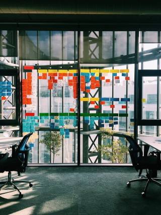
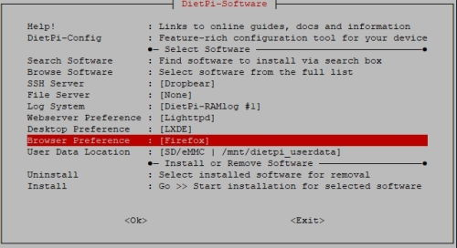
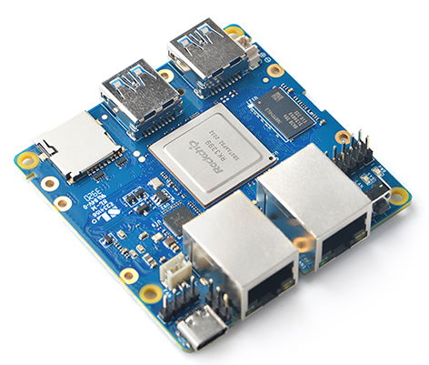
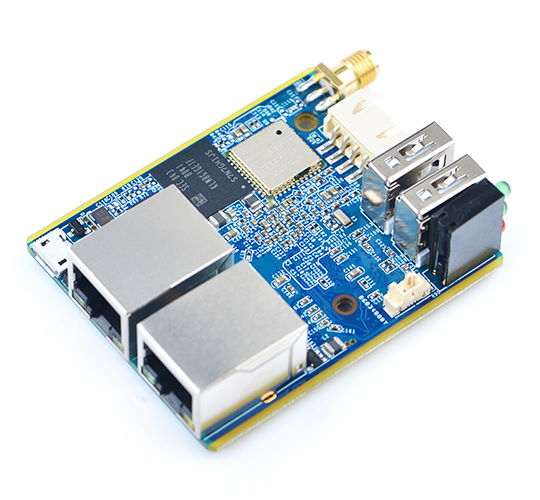

# Release Notes

## May 2021 (version 7.2)

### Overview

Welcome to **May 2021 release** :octicons-heart-16: of **DietPi**.

With this release we bring more details on things which will be delivered within current iteration. Check always the iteration planning page in [DietPi Wiki](https://github.com/MichaIng/DietPi/wiki/Iteration-plans) to see what will be delivered next!  

This release extend the support for new SBCs, add new providers for `DietPi-DDNS` and `DietPi-VPN`, and also brings a new configuration option for browser selection.

Plus, more enhancements & bug fixes!

{: width="320" height="427" loading="lazy"}

### Browser preference option

- [Firefox](../../software/desktop/#firefox) :octicons-arrow-right-16: The Mozilla Firefox browser has now become an independent software option with the ID **67**. A browser preference option has been added to [DietPi-Software](../../dietpi_tools/#dietpi-software).

    {: width="500" height="272" loading="lazy"}

    This can be set prior to first boot, using the new setting available in `dietpi.txt` file:

    !!! hint "Configuration options"

        There are available next options: `0` = None | `-1` = [Firefox](../../software/desktop/#firefox) | `-2` = [Chromium](../../software/desktop/#chromium)

        **Note:** This option defines the browser to be installed **only** when a [desktop](../../software/#desktops) is installed. It won't be installed if no desktop is installed and a manual browser selection will override it.

        ```sh
        AUTO_SETUP_BROWSER_INDEX=-1
        ```

    Web browser will be installed _only_ when a [desktop](../../software/#desktops) is installed. It's similar to the webserver preference where an webserver will ONLY be installed when another software title requires it.

    **Why this change?** Instead of having **always** Firefox installed when a desktop got selected (or pulled as dependency e.g. a VNC server), now you can choose whether Firefox, Chromium or _no browser_ will be installed.

    It is not an _"install this browser now"_ selection, like for file server, SSH server or logging system, it's a preference selection.

### New supported SBCs

- Pinebook Pro | Initial hardware identifier (ID: 46) :octicons-arrow-right-16: Support for this device has been added to DietPi. DietPi image will be available for download starting with `30.05.2021`.

{: width="600" height="326" loading="lazy"}

- NanoPi R4S | Initial hardware identifier (ID: 47) :octicons-arrow-right-16: Support for this device has been added to DietPi. DietPi image will be available for download starting with `30.05.2021`.

{: width="472" height="401" loading="lazy"}

- NanoPi R1 | Initial hardware identifier (ID: 48) :octicons-arrow-right-16: Support for this device has been added to DietPi. DietPi image will be available for download starting with `30.05.2021`.

{: width="540" height="500" loading="lazy"}

### DietPi Tools (new / notable updates)

- [**DietPi-DDNS**](../../dietpi_tools/#dietpi-ddns)

    It has now a native support for [FreeDNS](https://freedns.afraid.org) and [OVH](https://docs.ovh.com/gb/en/domains/hosting_dynhost/), extending the list of existent options in `DietPi-DDNS` tool.

- [**DietPi-VPN**](../../dietpi_tools/#dietpi-vpn)

    It includes now native support for [IPVanish](https://www.ipvanish.com) and [Private Internet access (PIA)](https://www.privateinternetaccess.com).

    When "Reset" is selected, you're now offered to purge the OpenVPN package, as long as neither the OpenVPN (server) install option nor PiVPN is installed. Many thanks to @maartenlangeveld for doing this suggestion: <https://github.com/MichaIng/DietPi/issues/4346>.

    Allow inbound packets from the loopback interface. It is required to communicate with local servers (e.g. Pi-hole) running on the same machine, as the connection doesn't count as established yet when the packets haven't been accepted by the server yet.

- [**DietPi-AutoStart**](../../dietpi_tools/#dietpi-autostart)

    It enables desktop auto login for non-root users more reliable. Earlier the X server itself was started by the login user, which often required additional permissions and sometimes, based on GPU and driver, was not possible at all (without further customisation).
    The method has been changed so that LightDM is used for non-root auto login, just like it is for manual desktop login, but logging into the desktop automatically with the chosen user.

- [**DietPi-Software**](../../dietpi_tools/#dietpi-software)

    Along with the browser preference, a desktop preference option has been added to chose which desktop to install (only) when another software selection requires one, especially remote desktop solutions. This can be set prior to first boot, using the new setting available in `dietpi.txt` file:

    !!! hint "Configuration options"

        There are available next options: `0` = [LXDE](../../software/desktop/#lxde) | `-1` = [Xfce](../../software/desktop/#xfce) | `-2` = [MATE](../../software/desktop/#mate) | `-3` = [LXQt](../../software/desktop/#lxqt) | `-4` = [GNUstep](../../software/desktop/#gnustep)

        **Note:** This option defines the desktop to be installed **only** when another selected software requires one. It won't be installed if no other software requires a desktop and a manual desktop selection will override it.

        ```sh
        AUTO_SETUP_DESKTOP_INDEX=0
        ```

or with the new menu entry. It works like the webserver preference, so it only play a role when a desktop is installed as dependency and a manually selected desktop from the full software list or software search list will override the preference.

### Changes / Improvements / Optimisations

- [DietPi-Config](../../dietpi_tools/#dietpi-configuration) | On [Raspberry Pi](../../hardware/#raspberry-pi), the Allo Boss2 DAC can now be selected from the sound card list. The OLED display that comes with this product currently needs to be installed manually by following Allo instructions, but will be natively integrated into DietPi with the next release v7.3.
- [DietPi-Software | **WiringPi**](../../software/hardware_projects/#wiringpi) :octicons-arrow-right-16: On Raspberry Pi, a new updated fork of the deprecated original project is now used, which enables support for [Raspberry Pi 4, Raspberry Pi 400 and Raspberry Compute Module (CM) 4](../../hardware/#raspberry-pi) - see <https://github.com/WiringPi/WiringPi>.
- [DietPi-Software | **WiringPi**](../../software/hardware_projects/#wiringpi) :octicons-arrow-right-16: On new installs and reinstalls, the source/examples directory is now installed to `/mnt/dietpi_userdata/WiringPi` instead of `/root/wiringPi`, to enable general access to non-root users.
- [DietPi-Software | **Node.js**](../../software/webserver_stack/#nodejs) :octicons-arrow-right-16: On ARMv6, new Node.js versions are now installed via unofficial builds. Official builds for ARMv6 are provided up to Node v11 only. Many thanks to @ollliegits for adding support for this builds to our Node.js installer fork: <https://github.com/MichaIng/nodejs-linux-installer/pull/2>.
- [DietPi-Software | **EmonPi**](../../software/home_automation/#emonhub) :octicons-arrow-right-16: This software option has been renamed to `emonHub`, the name of the data collector for the `emonPi` RPi energy monitor addon board. A much newer Python 3 compatible version form the official `OpenEnergyMonitor` repository is installed from now on, providing additional features and fixes.
- [DietPi-Software | **RPi Cam Control**](../../software/camera/#rpi-cam-control) :octicons-arrow-right-16: This install option has been disabled for 64-bit systems. It uses a `32-bit/armhf` `raspimjpeg` binary that depends in `32-bit/armhf` C library. It will be re-enabled once the project maintainer or we provide a native `64-bit/arm64` `raspimjpeg` binary.
- [DietPi-Software | **Roon Extension Manager**](../../software/media/#roon-extension-manager) :octicons-arrow-right-16: After a major upgrade to v1.0, it is now implemented as Docker container, rather than as Node.js module. The upgrade can be applied by manually running next:

    ```sh
    dietpi-software reinstall 86
    ```

    Many thanks to @JanKoudijs for developing Roon Extension Manager and implementing the required changes into `DietPi-Software`: <https://github.com/MichaIng/DietPi/pull/4399>.
- [DietPi-Software | **Pi-hole**](../../software/dns_servers/#pi-hole) :octicons-arrow-right-16: New installs and reinstall will have the DNS query logging duration reduced to 2 days. An internal discussion revealed that no-one of us uses logs old than a few hours, while those are kept for a year by default, leading to database sizes from hundreds of MiBs to GiBs. We leave it at 2 days so that dashboard graphs/diagrams are not empty on Pi-hole (re)start. Users who require long-term DNS query data for statistics or similar, can easily increase the TTL, shown as well in our docs.

### Bug Fixes

- [Odroid XU4](../../hardware/#odroid) :octicons-arrow-right-16: Resolved an issue where installs and possibly other tasks hang, because the device ran out of entropy. [Odroid XU4](../../hardware/#odroid) system will have the unsupported hardware random generator daemon removed and the software `HAVEGE` daemon installed instead for entropy generation. Many thanks to @Speeedfire for reporting this issue: <https://github.com/MichaIng/DietPi/issues/4318>
- [DietPi-Banner](../../dietpi_tools/#dietpi-banner) :octicons-arrow-right-16: Resolved an issue where the MOTD was not updated via daily cron job, if the banner settings have not been changed yet, hence no config file exists. Since the MOTD is enabled by default, it needs to be updated as well if the config file does not exist. Many thanks to @gorby-pranata for helping us discovering this issue: [MichaIng/DietPi#4292](https://github.com/MichaIng/DietPi/pull/4292#issuecomment-830787256).
- [DietPi-Banner](../../dietpi_tools/#dietpi-banner) :octicons-arrow-right-16: Resolved an issue where DietPi-VPN stats could not be shown due to a false file path. Many thanks to @sl002 for reporting this issue: <https://github.com/MichaIng/DietPi/issues/4354>.
- [DietPi-Banner](../../dietpi_tools/#dietpi-banner) and [DietPi-VPN](../../dietpi_tools/#dietpi-vpn) :octicons-arrow-right-16: Resolved an issue where the WAN IP could not be derived, as the external API service we used has server issues by times. We switched to a (hopefully) more reliable one with higher rate limit as well, until we find time to host an own `GeoIP API`. Many thanks to @maartenlangeveld for reporting this issue: <https://github.com/MichaIng/DietPi/issues/4393>.
- [DietPi-Update](../../dietpi_tools/#dietpi-update) :octicons-arrow-right-16: Resolved an issue where updating from DietPi v6.16 or older did not complete as intended. Many thanks to @orotarobas for reporting this issue: <https://github.com/MichaIng/DietPi/issues/4385>.
- [DietPi-Drive_Manager](../../dietpi_tools/#dietpi-drive-manager) :octicons-arrow-right-16: Resolved an issue where NTFS (and potentially other) filesystems were not detected correctly, leading to failing mount attempts at boot. Many thanks to [phpBB:NoLifer](https://dietpi.com/phpbb/memberlist.php?username=NoLifer){: class="nospellcheck"} for reporting this issue: [External Hard Drive not mounted on reboot](https://dietpi.com/phpbb/viewtopic.php?t=8971)
- [DietPi-Drive_Manager](../../dietpi_tools/#dietpi-drive-manager) :octicons-arrow-right-16: Resolved an issue where info for drives with a `systemd.automount` unit was not detected correctly, leading to invalid `fstab` entries. Many thanks to @cocoflan and @BillyCorgan1 for reporting this issue: <https://github.com/MichaIng/DietPi/issues/4339>.
- [DietPi-JustBoom](../../dietpi_tools/#dietpi-justboom) :octicons-arrow-right-16: Resolved an issue where the equalizer had no effect in some cases. Many thanks to [phpBB:zackdvd](https://dietpi.com/phpbb/memberlist.php?username=zackdvd){: class="nospellcheck"} for reporting this issue: <https://dietpi.com/phpbb/viewtopic.php?t=8992>.
- [DietPi-LetsEncrypt](../../dietpi_tools/#dietpi-letsencrypt) :octicons-arrow-right-16: Resolved an issue with Lighttpd, where `lighty-enable-mod` or `lighty-disable-mod` failed, if the related config was already enabled or disabled, respectively. Many thanks to @staxfax for reporting this issue: <https://github.com/MichaIng/DietPi/issues/4336>.
- [DietPi-Config](../../dietpi_tools/#dietpi-configuration) :octicons-arrow-right-16: Resolved an issue where changing the locale generated it but did not apply it as new system default. Many thanks to @bamyasi for reporting the issue: [MichaIng/DietPi#3515](https://github.com/MichaIng/DietPi/issues/3515#issuecomment-840751875)
- [DietPi-Software | Python 3](../../software/programming/#python-3) :octicons-arrow-right-16: Resolved an issue where installing pip on Stretch systems failed, due to a changed download URL. Many thanks to @tfmeier for reporting this issue: [docker-compose fails to install on Pine A64 on DietPi 7.1.2](https://dietpi.com/phpbb/viewtopic.php?t=8968)
- [DietPi-Software | Webmin](../../software/system_stats/#webmin) :octicons-arrow-right-16: Resolved an issue where restarts from the web interface only stopped the service. Many thanks to @Burgess85 and [phpBB:Keridos](https://dietpi.com/phpbb/memberlist.php?username=Keridos){: class="nospellcheck"} for reporting this issue: [Webmin](https://dietpi.com/phpbb/viewtopic.php?t=8839), <https://github.com/MichaIng/DietPi/pull/4331>.
- [DietPi-Software | Docker Compose](../../software/programming/#docker-compose) :octicons-arrow-right-16: Resolved an issue on ARMv8 Debian Stretch systems, where the install failed because of missing development headers. Many thanks to [phpBB:tfmeier](https://dietpi.com/phpbb/memberlist.php?username=tfmeier){: class="nospellcheck"} for reporting this issue: [docker-compose fails to install on Pine A64 on DietPi 7.1.2](https://dietpi.com/phpbb/viewtopic.php?p=34293#p34293)
- [DietPi-Software | rTorrent](../../software/bittorrent/#rtorrent) :octicons-arrow-right-16: Resolved an issue where pre-v7.1 reinstalls with Lighttpd did not update the webserver configuration to provide the new RPC socket proxy. Many thanks to @bbsixzz for reporting this issue: <https://github.com/MichaIng/DietPi/issues/4330>.
- [DietPi-Software | rTorrent](../../software/bittorrent/#rtorrent) :octicons-arrow-right-16: Resolved an issue where v7.1 reinstalls failed. Many thanks to @Joulinar for fixing it.
- [DietPi-Software | Radarr](../../software/bittorrent/#radarr) :octicons-arrow-right-16: Resolved an issue where an older fallback version was installed, rather than the latest one. Many thanks to @Takerman for reporting this issue: <https://github.com/MichaIng/DietPi/issues/4350>.
- [DietPi-Software | Node.js](../../software/webserver_stack/#nodejs) :octicons-arrow-right-16: Resolved an issue on ARMv6 where installing further modules via web interface failed, as an incompatible Node.js version was installed. The latest Node.js version is now installed via unofficial builds (see changes above). Many thanks to [phpBB:torwan](https://dietpi.com/phpbb/memberlist.php?username=torwan){: class="nospellcheck"} for reporting this issue: <https://dietpi.com/phpbb/viewtopic.php?t=8944>
- [DietPi-Software | RPi Cam Control](../../software/camera/#rpi-cam-control) :octicons-arrow-right-16: Resolved two issues: Reinstalls failed when certain files in the web interface existed already and the shutdown and reboot buttons from the web interface failed due to insufficient webserver permissions.
- [DietPi-Software | Kodi](../../software/media/#kodi) :octicons-arrow-right-16: Resolved an issue where an attempt was made during install to create a desktop entry, even if no desktop environment was installed. Many thanks to [phpBB:sidgeg](https://dietpi.com/phpbb/memberlist.php?username=sidgeg){: class="nospellcheck"} for reporting this issue: [Kodi Install Issues](https://dietpi.com/phpbb/viewtopic.php?t=8995).
- [DietPi-Software | Bitwarden_RS](../../software/cloud/#bitwarden_rs) :octicons-arrow-right-16: This project has been renamed by its author into "vaultwarden", to avoid confusion and potential legal issues with original Bitwarden software. This caused our install option to fail. To apply this important change to all Bitwarden_RS instances, it will be migrated via reinstall during DietPi update. As compiling can take up to several hours, users are informed at the beginning of the DietPi update, with the option to cancel and apply it at a later time. All data and configs will be preserved during the reinstall. Many thanks to @math-gout for informing us about this change: <https://github.com/MichaIng/DietPi/issues/4325>.
- [DietPi-Software | Home Assistant](../../software/home_automation/#home-assistant) :octicons-arrow-right-16: Resolved an issue where the install failed, as running `pyenv init -` does not complement the PATH variable anymore.
- [DietPi-Software | Mosquitto](../../software/hardware_projects/#mosquitto) :octicons-arrow-right-16: Resolved an issue where the install failed on ARMv8 systems. Many thanks to @fra87 for reporting this issue: <https://github.com/MichaIng/DietPi/issues/4424>
- [DietPi-Software | Kodi](../../software/media/#kodi) :octicons-arrow-right-16: Resolved an issue on 64-bit RPi systems, where starting Kodi outside of a desktop session (e.g. using the Kodi [dietpi-autostart](../../dietpi_tools/#dietpi-autostart) option) failed, as our script tried to start it without X server (intended on 32-bit RPi systems). Many thanks to [phpBB:Milemar](https://dietpi.com/phpbb/memberlist.php?username=Milemar){: class="nospellcheck"} for reporting this issue: <https://dietpi.com/phpbb/viewtopic.php?t=9030>

### Removed Software

- `LibSSL1.0.0` :octicons-arrow-right-16: This old library was kept for backwards-compatibility with old binaries but is not required anymore for any binary installed by DietPi-Software. It has hence been removed from the software list.
