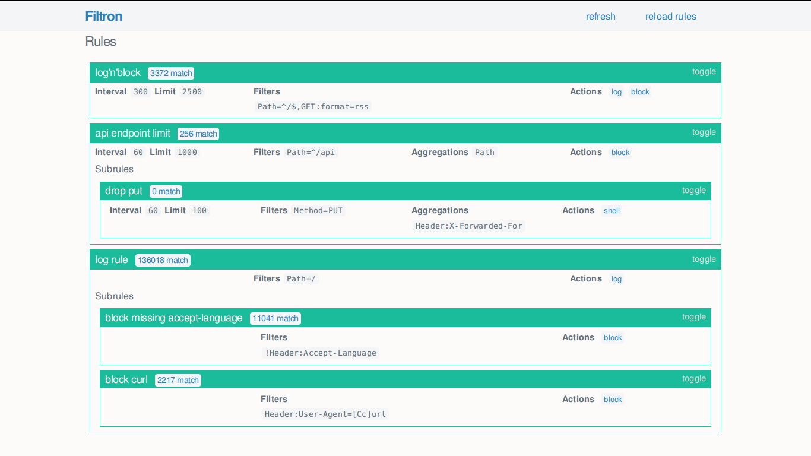

# Release Notes

## June 2021 (version 7.3)

### Overview

Welcome to **June 2021 release** :octicons-heart-16: of **DietPi**. It brings 6 new software titles covering different areas, like security, media management, multiroom audio solution, or a lightweight Kubernetes distribution built specifically for IoT & Edge computing.

### New software titles

- [**AdGuard Home**](../../software/dns_servers/#adguard-home)

    AdGuard Home is a network-wide software for blocking ads & tracking, similar to [Pi-hole](../../software/dns_servers/#pi-hole), already supported by DietPi.

    It covers all your devices, and you don't need any client-side software for that. Especially with the rise of Internet-Of-Things and connected devices, it becomes more and more important to be able to control your whole network.

    {: width="500" loading="lazy"}

    Now available to install using [`dietpi-software`](../../dietpi_tools/#dietpi-software) or directly using the software ID `126`.

- [**Beets**](../../software/media/#beets)

    {: width="144" height="144" loading="lazy"}

    **Beets** is a command line media library management system for music geeks. It is designed as a library, it can do almost anything you can imagine for your music collection.

    As stated on the official website, _the purpose of **Beets** is to get your music collection right once and for all_.

    Now available to install using [`dietpi-software`](../../dietpi_tools/#dietpi-software) or directly using the software ID `190`.

- [**frp**](../../software/advanced_networking/#frp)

    {: width="500" loading="lazy"}

    **frp** is a fast reverse proxy helping you to expose a local server behind a NAT or firewall to the Internet.

    Now available to install using [`dietpi-software`](../../dietpi_tools/#dietpi-software) or directly using the software ID `171`.

- [**Snapcast Server**](../../software/media/#snapcast-server) & [**Snapcast Client**](../../software/media/#snapcast-client)

    {: width="300" height="48" loading="lazy"}

    **Snapcast** centralizes broadcasting of audio streams and it handles sending audio streams to wireless receivers creating a **multiroom wireless speaker system**.

    With Snapcast, many different clients can connect to the same server in order to stream the same audio. It allows you to group speakers together, as well as adjust latency on each speaker.

    Now available to install using [`dietpi-software`](../../dietpi_tools/#dietpi-software) or directly using the software IDs `191` and `192`. Many thanks to @foxy82 for implementing these software titles: <https://github.com/MichaIng/DietPi/pull/4465>

- [**K3s**](../../software/system_stats/#k3s)

    {: width="300" height="116" loading="lazy"}

    **K3s** has composed all the required Kubernetes parts, including dependencies, into a single binary. While there are tools and distributions to help install the Kubernetes specific components of a cluster, the value of a single binary for edge use cases is clear: simplifies both the ease of installation, runtime operations, and maintenance of Kubernetes.

    **K3s** is Kubernetes wrapped in simple launcher that handles a lot of the complexity of TLS and options for the embedded binaries. It essentially makes the container orchestration simpler to install, run, or operate.

    Now available to install using [`dietpi-software`](../../dietpi_tools/#dietpi-software) or directly using the software IDs `193`. Many thanks to @mortenlj for implementing this software title: <https://github.com/MichaIng/DietPi/pull/4476>

### DietPi Tools (new / notable updates)

- **DietPi-Automation** :octicons-arrow-right-16: A new `dietpi.txt` setting has been added - `AUTO_SETUP_DHCP_TO_STATIC`. When it is enabled

    ```sh
    AUTO_SETUP_DHCP_TO_STATIC=1
    ```

    DHCP leased network settings will be applied as static network settings automatically during first run setup. This works as well with older images, by adding the above setting to `dietpi.txt`.

- [**DietPi-Drive_Manager**](../../dietpi_tools/#dietpi-drive-manager) :octicons-arrow-right-16: Resolved an issue where network drives were detected as physical drives (v7.2 regression). Many thanks to @maartenlangeveld for reporting this issue: <https://github.com/MichaIng/DietPi/issues/4479>

- [**DietPi-Software**](../../dietpi_tools/#dietpi-software) :octicons-arrow-right-16: Resolved an issue where with

    ```sh
    AUTO_SETUP_AUTOMATED=1
    ```

    the OpenSSH client was always installed on first boot, even if it was not requested.

- [**DietPi-Backup**](../../dietpi_tools/#dietpi-backup-backuprestore) :octicons-arrow-right-16: The include/exclude filter handling has been reworked. `/mnt` (`dietpi_userdata`) and `/media` related rules are added now via the editable custom filter file, which gives users more control over these. Especially it allows to include other mount points below `/mnt`, hence external `dietpi_userdata`, which was previously impossible due to the order in which those filter rules are applied.

- [**DietPi-JustBoom**](../../dietpi_tools/#dietpi-justboom) :octicons-arrow-right-16: Resolved an issue where the equalizer was always shown as "Off" even when it was just or previously enabled (v7.2 regression). Many thanks to [phpBB:shao](https://dietpi.com/phpbb/memberlist.php?username=shao){: class="nospellcheck"} for reporting this issue: [ALSA equalizer not working](https://dietpi.com/phpbb/viewtopic.php?p=35072#p35072)

- [**DietPi-VPN**](../../dietpi_tools/#dietpi-vpn) :octicons-arrow-right-16: The killswitch has been adjusted to allow incoming SSH connections. Many thanks to @yslupdates for doing this request: <https://github.com/MichaIng/DietPi/issues/4447>

- [**DietPi-Config**](../../dietpi_tools/#dietpi-configuration) :octicons-arrow-right-16: Support for the Allo Boss2 DAC OLED display has been added to the **Display Options** > **LCD/OLED Panel addon** menu. When selecting the Allo Boss2 DAC as sound card, you will be asked whether to enable the OLED display as well.

### Improvements

- [DietPi-Software | **Cuberite**](../../software/gaming/#cuberite) :octicons-arrow-right-16: This has been enabled for ARMv8 systems, where the available ARMv7 binaries work just fine.
- [DietPi-Software | **Allo web UI**](https://dietpi.com/phpbb/viewtopic.php?t=2317) :octicons-arrow-right-16: Updated to v13.3 which adds support for the Allo Boss2 DAC and resolves an issue where the Squeezelite service could not be controlled as the service path has changed. All credits go to Allo for implementing these changes.

### Bug Fixes

- [DietPi-Software | **Node-RED**](../../software/hardware_projects/#node-red) :octicons-arrow-right-16: Resolved an issue where the Python 3 RPi.GPIO module was tried to be installed as dependency on non-RPi devices (v7.2 regression). Many thanks to @TheAdminFrmoHell for reporting this issue: <https://github.com/MichaIng/DietPi/issues/4478>
- [DietPi-Software | **PI-SPC**](../../software/hardware_projects/#audiophonics-pi-spc) :octicons-arrow-right-16: Resolved a syntax error in the shutdown script loop. Many thanks to @renaudlarzilliere for reporting this issue: <https://github.com/MichaIng/DietPi/issues/4488>

### Removed Software

- **Tomcat 8** :octicons-arrow-right-16: Tomcat version 8 is available until Debian Stretch only, from Buster and newer versions it will be [**Tomcat 9**](../../software/webserver_stack/#tomcat). There is no reasonable configuration that `DietPi-Software` can do on top of installing the APT package, which can be easily done manually, running next command:

    ```sh
    apt install tomcat9
    ```

    The software option `Tomcat` is hence removed from `DietPi-Software`, in favour of a manual package install.

As always, many smaller code performance and stability improvements, visual and spelling fixes have been done, too much to list all of them here. Check out all code changes of this release on GitHub: <https://github.com/MichaIng/DietPi/pull/4515>
