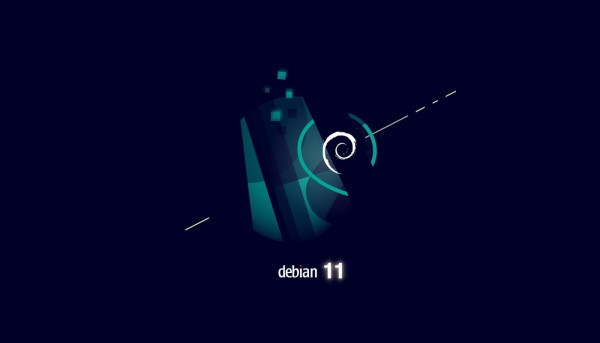

# Release Notes

## August 2021 (version 7.5)

### Overview

Welcome to **August 2021 release** :octicons-heart-16: of **DietPi**. This release had a focus on polishing support for the latest release of the Debian OS.

{: width="600" height="343" loading="lazy"}

### Debian 11 (code name _Bullseye_)

The new version Debian 11, code name `Bullseye`, was released on August 14th, 2021. Every Debian release is a big deal, with support coming from its large user community. Debian is also the core operating system for other Linux distributions such as Canonical's Ubuntu, DietPi, Raspberry Pi OS or Armbian.

DietPi images for Raspberry Pi (based on Debian 11 release) and native PCs are already available for download. All other DietPi images will be migrated to Bullseye soon. Read our blog post about what benefits Bullseye brings and how to upgrade your system: <https://dietpi.com/blog/?p=811>

### New software title {: #new-software-75 }

- **Java JRE** :octicons-arrow-right-16: The OpenJDK JRE (Java Runtime Environment) has been made available as dedicated software option. Now available to install using [`dietpi-software`](../../dietpi_tools/#dietpi-software) or directly using the software ID `196`.

### DietPi Tools (new / notable updates) {: #dietpi-tools-75 }

- **DietPi-Globals** :octicons-arrow-right-16: A new global function G_GET_WAN_IP has been added to print the public IP and location info. This function is now used by DietPi-Banner and DietPi-VPN to show the public IP. It makes use of the public API at `freegeoip.app`, which may also be used by malware, like all public APIs, and may hence be present in public blocklists. The function checks, whether this is the case, via curl's exit code, and in case prints a meaningful error message. Many thanks to @cocoflan for reporting the a related case: <https://github.com/MichaIng/DietPi/issues/4445>
- **DietPi-FirstBoot** :octicons-arrow-right-16: On our x86_64 BIOS images, the GRUB bootloader is configured to install itself on upgrade to the `/dev/sda` drive, which is the most commonly used system drive path and there is no way to configure a unique identifier that is assured to match the later actual system drive. When GRUB is upgraded, and the configured drive path does not exist, or GRUB has doubts that it is the correct system drive, the upgrade will fail. If GRUB installs itself to the wrong drive, the actually booted GRUB version won't match the GRUB files on the root filesystem, which can make the system unbootable. To enhance the situation, on first boot, DietPi detects the apparent system drive and changes the GRUB configuration accordingly. This will work on all our images, but note that on custom images it might be wrong: Generally it is possible to have the bootloader installed on one drive, but the root filesystem stored on a different physical drive, and we have no possibility to reliable detect this case. Many thanks to @brianbloom for reporting the issue: <https://github.com/MichaIng/DietPi/issues/4542>
- DietPi-Software | **Java** :octicons-arrow-right-16: This install option has now been split into the **JRE (Java Runtime Environment)** and the **JDK (Java Development Kit)**. Our Java-written software options require only JRE installation. By making this selection, we save over 200 Mb of additional JDK-related disk space. For developers, the JDK install option remains available, with the same software ID.
- [DietPi-Software | Cuberite](../../software/gaming/#cuberite) :octicons-arrow-right-16: Re-applied the official binary on ARMv6 systems (Raspberry Pi 1 and Zero). Since those did not support ARMv6 in the past, we installed an old self-hosted binary, but now the latest official one can be used. Many thanks to @tigerw for letting us know about the change: <https://github.com/MichaIng/DietPi/issues/3664#issuecomment-901261614>
- [DietPi-Software | Lidarr](../../software/bittorrent/#lidarr) :octicons-arrow-right-16: Where supported (on all platforms but Raspberry Pi 1/Zero), the .NET core build build is now installed, which makes the dedicated Mono runtime obsolete and should generally perform better. This migration is applied automatically during the DietPi update, your settings and data remain untouched. Many thanks for informing us about this possible enhancement: <https://github.com/MichaIng/DietPi/issues/4607>
- [DietPi-Software | PaperMC](../../software/gaming/#papermc) :octicons-arrow-right-16: Since Minecraft 1.17 requires Java 16 or newer, it does not work anymore on Debian versions below Bullseye and not on ARMv6, with the Java builds we ship, and has hence been disabled for those systems. AdoptOpenJDK is currently in the process of creating a new APT repository, after which we can migrate to re-enable support older Debian versions. On ARMv6 however I most likely won't work and the newest found Java build above version 8, running on ARMv6, is a single Zulu Java 11 build.

### Bug Fixes {: #fixes-75 }

- [DietPi-Software | **Blynk Server**](../../software/hardware_projects/#blynk-server) :octicons-arrow-right-16: Resolved an issue where the install failed as the previous official repository has been removed by Blynk Inc. We switched to a fork, created hours before the repository removal, to preserve the install option and save users from being forced to use the commercial cloud servers. But note that there is no guarantee that the official apps will keep supporting it for long. In case older versions of the apps might need to be used.
- [DietPi-Software | **Roon Extension Manager**](../../software/media/#roon-extension-manager) :octicons-arrow-right-16: Resolved an issue where the installer failed when dietpi-software was executed with sudo as unprivileged user. The installer internally uses the SUDO_USER variable to perform some tasks, which fails to download the container startup shell script, as only root can write to the download location. Many thanks to @Esad-np for reporting this issue: <https://github.com/MichaIng/DietPi/issues/4462>
- DietPi-Software | **Java JRE** :octicons-arrow-right-16: Resolved an issue where the install failed on ARMv6: <https://github.com/MichaIng/DietPi/issues/4509#issuecomment-876413815>
- DietPi-Software | **Java JRE** :octicons-arrow-right-16: Resolved an issue where the install failed on Raspbian Bullseye systems, since Raspbian has no compiled Java 17 packages yet.
- [DietPi-Software | **VSCodium**](../../software/programming/#vscodium) :octicons-arrow-right-16: Added the missing dependency on ALSA for cases where no desktop is installed and VSCodium is started as standalone X server session. Many thanks to @Gill-Bates for reporting this issue: <https://github.com/MichaIng/DietPi/issues/4610>
- [DietPi-Software | Bazarr](../../software/bittorrent/#bazarr) :octicons-arrow-right-16: Resolved an issue where the install failed, as assets have been moved into an own repository, bundled with now release downloads. Many thanks to @psi5asp for reporting this issue: <https://github.com/MichaIng/DietPi/issues/4615>
- [DietPi-Software | phpSysInfo](../../software/system_stats/#phpsysinfo) :octicons-arrow-right-16: Resolved an issue where the install failed because of a changed download URL. Many thanks to [phpBB:robex](https://dietpi.com/phpbb/memberlist.php?username=robex){: class="nospellcheck"} for reporting this issue: <https://dietpi.com/phpbb/viewtopic.php?t=9278>
- [DietPi-Software | LXDE](../../software/desktop/#lxde) :octicons-arrow-right-16: Resolved an issue on Raspberry Pi Bullseye systems, where the install failed. Many thanks to @ravenclaw900 for reporting this issue: <https://github.com/MichaIng/DietPi/issues/4555#issuecomment-898780672>
- [DietPi-Software | PiJuice](../../software/hardware_projects/#pijuice) :octicons-arrow-right-16: Resolved an issue where the install failed on Bullseye systems. Many thanks for reporting this issue: <https://github.com/MichaIng/DietPi/issues/4643>
- [DietPi-Software | LXQt](../../software/desktop/#lxqt) :octicons-arrow-right-16: Resolved an issue where the install failed on Bullseye systems. Many thanks to @LieDanG for reporting this issue: <https://github.com/MichaIng/DietPi/issues/4656>
- [DietPi-Software | PaperMC](../../software/gaming/#papermc) :octicons-arrow-right-16: Resolved an issue where the install failed due to missing build dependencies.
- [DietPi-Software | ProFTPD](../../software/file_servers/#proftpd) :octicons-arrow-right-16: Resolved an issue where the service start failed on Bullseye systems due to an invalid config entry. Many thanks to @twikedk for reporting this issue: <https://github.com/MichaIng/DietPi/issues/4666>
- [DietPi-Software | Kodi](../../software/media/#kodi) :octicons-arrow-right-16: Resolved an issue where the install failed on ARMv6 Bullseye images, as neither Raspbian nor the Raspberry Pi repository contain a Kodi package yet. We ship now an own package. Many thanks to @sibofax for reporting this issue: <https://github.com/MichaIng/DietPi/issues/4650>

As always, many smaller code performance and stability improvements, visual and spelling fixes have been done, too much to list all of them here. Check out all code changes of this release on GitHub: <https://github.com/MichaIng/DietPi/pull/4668>
