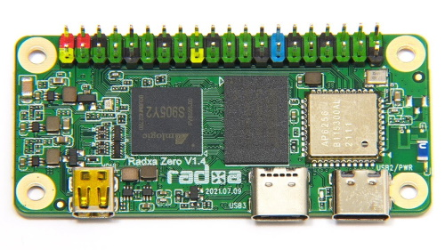
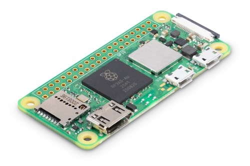
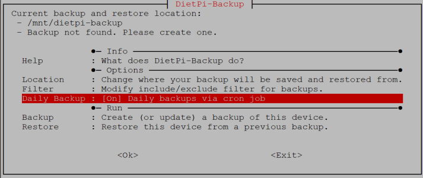
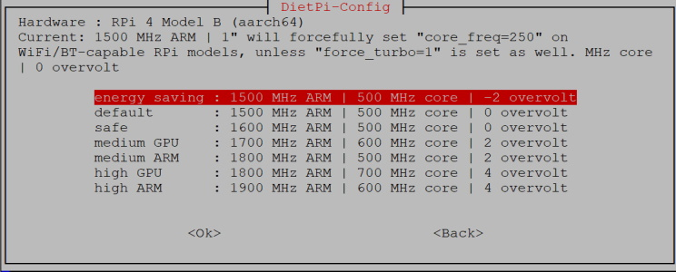

# Release Notes

## November 2021 (version 7.8)

### Overview

This release adds a major improvement to DietPi, providing our own official DietPi-Dashboard to both **monitor and manage** your DietPi installations. It also brings full support to latest launches: **Raspberry Pi Zero 2 W** and **Radxa Zero SBCs** - two powerful and ultra small SBC variants!

### New Software

- [**DietPi-Dashboard**](../../software/system_stats/#dietpi-dashboard)
    We are proud to announce official DietPi Web interface for monitoring and managing your DietPi system using your web browser :octicons-heart-16:! You can see various statistics, and even run commands in the  console embedded in the web page! Thanks to the great work of @ravenclaw900!

    {: width="700" height="346" loading="lazy"}

    !!! Warning "DietPi-Dashboard"

        **It is still in beta phase** as we test and gradually implement more features. We hence do not recommend yet to actively use in on sensitive production systems.

    We would be happy if you would try it to install, either using dietpi-software or running the command in the console:

    ```sh
    dietpi-software install 200
    ```

    Please share your feedback! You can find more details in the original GitHub issue: <https://github.com/MichaIng/DietPi/issues/448>

### New supported SBCs

- [**Radxa Zero**](../../hardware/#radxa)
    DietPi offers support for this tiny Quad Core SBC. It has the same form factored as Raspberry Pi Zero, but way more powerful. This SBC has been added to DietPi with the hardware ID `74`. Many thanks to @almirus and @dhry for helping with testing and debugging an early image: <https://github.com/MichaIng/DietPi/issues/4831>

    {: width="500"  height="281" loading="lazy"}

- [**Raspberry Pi Zero 2 W**](../../hardware/#raspberry-pi)
    The Raspberry Pi Zero 2 W brings increased processing power. According to Raspberry, multithreaded chores are up to five times faster, which is a significant boost, while keeping exactly the same form factor.

    {: width="500" height="333" loading="lazy"}

    With this release, the initial DietPi support for this Raspberry Pi Zero / Zero W successor has been added. It also comes with overclocking profiles, helpful to achieve even better performance. It uses hardware ID `3` (shared with RPi 3/3+, since this version has the same processor as the original Raspberry Pi 3).

    Many thanks to [phpBB:CassTG](https://dietpi.com/phpbb/memberlist.php?username=CassTG){: class="nospellcheck"} for providing the early hardware information and doing intensive overclocking tests: <https://dietpi.com/phpbb/viewtopic.php?t=9599>.

### Improvements

- [**DietPi-Backup**](../../dietpi_tools/#dietpi-backup-backuprestore)
    - A feature has been added to enable daily system backup via cron job. Many thanks to @Lycidias93 for suggesting this feature: <https://github.com/MichaIng/DietPi/issues/3871>
        {: width="713" height="300" loading="lazy"}

    - `Rsync` / Transfer logs are now done to `dietpi-backup.log` inside of the backup directory. This way they remain persistent even if `DietPi-RAMlog` is enabled and can be reviewed at a later time. This is helpful especially when daily backups via cron job are enabled, where the log obviously is not presented directly when the backup finished. A related option to review the last transfer log has been added to the dietpi-backup main menu. The old log file `/var/log/dietpi-backup.log` is moved to the new location, if any backup exists during next DietPi update.
    - When using an NFS mount as backup target, it is now verified that the NFS share supports UNIX permissions to prevent the creation of a broken system backup in the first place.

- [**DietPi-Config**](../../dietpi_tools/#dietpi-configuration)
    - Overclocking profiles for most Raspberry Pi models have been **updated** to match the effective 100 MHz ARM/CPU frequency steps used by current firmware.
    - An **energy saving profile** has been added to some models, which reduces minimum and maximum voltage a little, reducing energy consumption and heat emission a little on idle and on load.
        {: width="744" height="300" loading="lazy"}
    - The option to prefer IPv4 connections when IPv6 is enabled has been removed: This only worked for APT and `wget`, while e.g. `cURL` and ping were never affected by this setting, which meant an inconsistent behaviour. If one faces issues with IPv6 enabled, it should be simply disabled instead of preferring/forcing IPv4 only for specific tools.

- [**DietPi-Drive_Manager**](../../dietpi_tools/#dietpi-drive-manager)
    - When transferring the DietPi user data to a different drive, it is now checked whether the target location is located within a supported filesystem type, one with native symlink and UNIX permission support. The same is done when using the CLI script `/boot/dietpi/func/dietpi-set_userdata`.
    - Transferring the root filesystem is now supported on Odroid C4/HC4 models.
    - The option to transfer the root filesystem is now shown as well when the drive does not contain any filesystem. The process implies formatting with a supported filesystem anyway which makes the condition obsolete. Also it is not needed anymore to unmount the filesystem manually first, as this is done automatically before formatting. In the related format menu, only supported filesystems are listed, i.e. ext4 and additionally F2FS on Raspberry Pi. The input box to enter a custom mount point is omitted as it is only temporarily used until the root filesystem transfer has finished. The swap file is not disabled anymore as it can be copied and reused as is on the new root filesystem without issues.
    - When transferring the root filesystem, further checks are performed: There needs to be a dedicated boot partition (required on Raspberry Pi and default on our current Odroid images), as this is what the transfer steps expect and the only reason for moving only the root filesystem instead of cloning the whole drive or flashing the DietPi image to an external drive in the first place. The expected boot/kernel configuration files need to be present so that the kernel can be instructed to mount the new root filesystem. The DietPi user data must not currently be located at the target partition as it would be formatted and all data hence lost.
    - On ext4 filesystems, the reserved blocks percentage is now shown and can be changed as well if the drive is not currently mounted.

- [**DietPi-RAMlog**](../../software/log_system/#dietpi-ramlog) :octicons-arrow-right-16: The `/var/log` directory structure is now synced to the persistent disk storage after software installs and via daily cron job to prevent missing logs files or directories in case of unclean shutdowns, which usually lead to failing service startups.
- [DietPi-Software | **Roon Server**](../../software/media/#roon-server) :octicons-arrow-right-16: Added support for the new .NET core based version, released on November 3rd, which is expected to have improved performance compared to the old Mono based version. To resolve an old issue with our Roon Server implementation (see below), a reinstall is done during the DietPi update, which pulls in the .NET core dependencies as well. But this will NOT update the Roon Server version to prevent issues with potentially required migration steps. After updating DietPi, use Roon's internal updater to benefit from the new version.

### Bug Fixes

- [**Raspberry Pi**](../../hardware/#raspberry-pi) :octicons-arrow-right-16: Worked around an issue on Raspberry Pi ARMv6/7 Bullseye systems where some software failed to start, e.g. RealVNC, if binaries were compiled against an older `libraspberrypi0` version with different shared library names.
- [**DietPi-Drive_Manager**](../../dietpi_tools/#dietpi-drive-manager) :octicons-arrow-right-16: Resolved an issue where resizing F2FS filesystems failed when currently mounted. Contradicting the docs and error output, mounting the filesystem read-only is not sufficient, but it needs to be unmounted instead, which is now done automatically before the resize and remounted afterwards.
- [**DietPi-Drive_Manager**](../../dietpi_tools/#dietpi-drive-manager) :octicons-arrow-right-16: Resolved an issue where resizing ext4 filesystems could have failed when not currently mounted. Especially if the drive is newly attached, a full `fsck` needs to be done once before it can be resized. This is now done automatically, allowing to resolve filesystem errors interactively, before resizing an offline ext4 filesystem.
- [**DietPi-Config**](../../dietpi_tools/#dietpi-configuration) :octicons-arrow-right-16: Resolved an issue where Raspberry Pi 4 overclocking profiles were offered on Raspberry Pi 400. A new set of profiles have now been added dedicated for the Raspberry Pi 400.
- [DietPi-Software | **IceCast**](../../software/media/#icecast) :octicons-arrow-right-16: Resolved an issue where a new install failed due to an attempted operation on a non-existing file. Many thanks to @killtux for reporting this issue: <https://github.com/MichaIng/DietPi/issues/4858>
- [DietPi-Software | **Logitech Media Server**](../../software/media/#logitech-media-server) :octicons-arrow-right-16: Resolved an issue where the uninstall failed as the package `postinst` script tried to remove the service user before the service was stopped.
- [DietPi-Software | **Roon Server**](../../software/media/#roon-server) :octicons-arrow-right-16: Resolved an issue where the internal updater purged all Roon Server data and configs, since the data directory was located within the install directory. Roon Server will now be installed to `/opt/roonserver` while the data directory remains at `/mnt/dietpi_userdata/roonserver`. This change will be applied via DietPi update as well, your data and configs will remain untouched. Many thanks to @JanKoudijs for reporting this issue and providing a solution: <https://github.com/MichaIng/DietPi/pull/4897>
- [DietPi-Software | **LXDE**](../../software/desktop/#lxde) :octicons-arrow-right-16: Resolved an issue where on some cases on first desktop start, desktop icons were missing and another issue on Bullseye systems, where a `No session for pid` error message popped up on desktop start. Many thanks to @kerryland for reporting these issues: <https://github.com/MichaIng/DietPi/issues/4914>
- [DietPi-Software | **LXDE**](../../software/desktop/#lxde) :octicons-arrow-right-16: Resolved an issue where the Firefox browser panel icon was present even if no Firefox was installed. In this case now either Chromium or the text editor is added as replacement.
- [DietPi-Software | **Home Assistant**](../../software/home_automation/#home-assistant) :octicons-arrow-right-16: Resolved an issue where the install failed on ARMv6/ARMv7 Bullseye systems.
- [DietPi-Software | **Tor Relay**](../../software/distributed_projects/#tor-relay) :octicons-arrow-right-16: This software option has been disabled on Stretch. The Tor package shipped by the Debian Stretch repository is too old to support required protocols of the Tor network, when running a relay. Many thanks to @cptechnik for reporting this issue: <https://github.com/MichaIng/DietPi/issues/4925>
- [DietPi-Software | **Deluge**](../../software/bittorrent/#deluge) :octicons-arrow-right-16: Resolved an issue where on fresh installs the services failed due to an invalid config file syntax. Many thanks to [phpBB:bookedirl](https://dietpi.com/phpbb/memberlist.php?username=bookedirl){: class="nospellcheck"} for reporting this issue: <https://dietpi.com/phpbb/viewtopic.php?t=9553>
- [DietPi-Software | **Deluge**](../../software/bittorrent/#deluge) :octicons-arrow-right-16: As the package from Raspbian Bullseye currently fails, we needed to disable Deluge for Raspberry Pi systems with ARMv6 Bullseye image. The bug has been reported to the Raspbian maintainers and we hope for a fix until next DietPi release: <https://github.com/MichaIng/DietPi/issues/4944>
- [DietPi-Software | **Lighttpd**](../../software/webserver_stack/#lighttpd) :octicons-arrow-right-16: Resolved an issue where reinstalls on a Bullseye system with DietPi-LetsEncrypt used, erroneously enabled an SSL configuration which could prevent the service start.

As always, many smaller code performance and stability improvements, visual and spelling fixes have been done, too much to list all of them here. Check out all code changes of this release on GitHub: <https://github.com/MichaIng/DietPi/pull/4951>

### Removed Software

- **Subsonic** :octicons-arrow-right-16: Since it is not developed anymore and due to shared library dependencies only compatible with Debian Stretch, we removed Subsonic from DietPi-Software. With Airsonic-Advanced, we'll provide a well maintained and Bullseye-compatible alternative soon. If you currently have Subsonic installed, it will remain. If you want to uninstall it, follow the instructions here: <https://github.com/MichaIng/DietPi/pull/4895>
- **emonHub** :octicons-arrow-right-16: Since we do not have a single reported installation, we removed emonHub from DietPi-Software. If you currently have emonHub installed, it will remain. If you want to keep using and updating it, have a look at the official repository at <https://github.com/openenergymonitor/emonhub>. If you want to uninstall it, follow the instructions here: <https://github.com/MichaIng/DietPi/pull/4895>

### Removed Supported SBC

- **Odroid N1** :octicons-arrow-right-16: There is not a single reported DietPi Odroid N1 system, which makes sense as this model was never really released. Only a small number of developer samples are floating around, not worth to keep maintaining an image and dedicated code. If there are unreported Odroid N1 DietPi systems out there, they will be automatically migrated to the Generic Rockchip RK3399 device ID on DietPi update.
