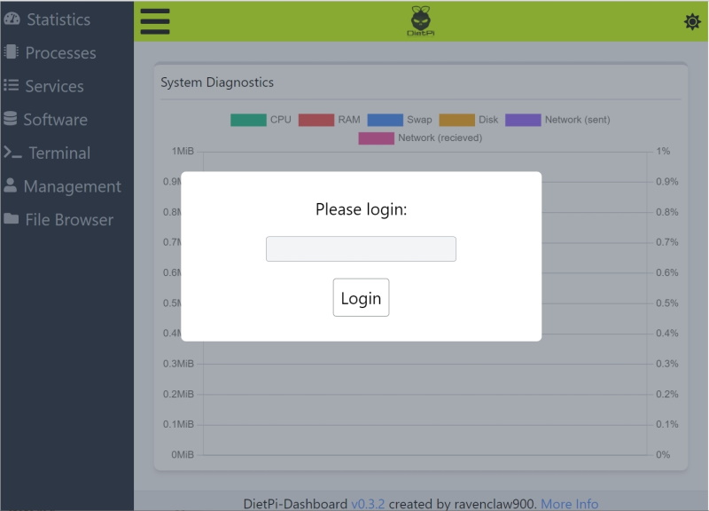
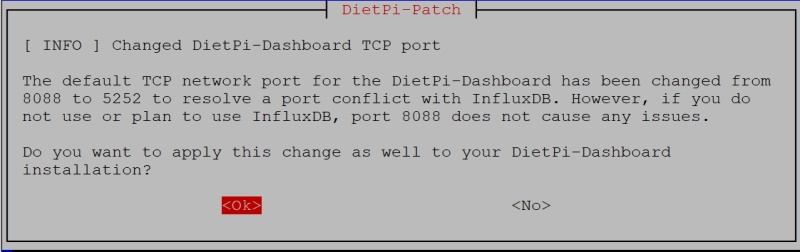
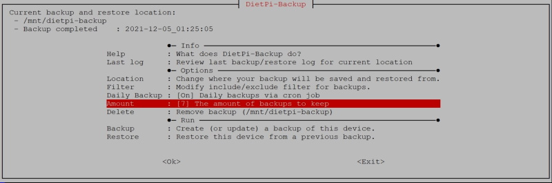

# Release Notes

## December 2021 (version 7.9)

### Overview

Welcome to **December 2021 release** :octicons-heart-16: of **DietPi**. It is enabling password protection for [**DietPi-Dashboard**](../../software/system_stats/#dietpi-dashboard), [**DietPi-Backup**](../../dietpi_tools/#dietpi-backup-backuprestore) starts to support multiple backups and the **[Apache](../../software/webserver_stack/#apache)** web server uses the dedicated `PHP-FPM` server improving the overall performance. And much more.

### Announcement

!!! Warning "**Debian "Stretch" support**"

    Debian 9 "Stretch" was released in 2017, and it has been initially superseded by Debian 10 "Buster", and then Debian 11 "Bullseye".

    **DietPi v7.9 will be the last release with support for Debian Stretch**. Next release will be **DietPi v8.0** and it will require Debian Buster or newer.

    Read our article [**Why you should upgrade your Stretch system now**](https://dietpi.com/blog/?p=1001) to learn more about the need to make this upgrade and you could do this easily to Debian Buster and even further to latest version (**Debian Bullseye**).

### Improvements {: #improvements-79 }

- [**DietPi-Dashboard**](../../software/system_stats/#dietpi-dashboard)
    - On fresh installs, password protection is now enabled by default, using the **global software password**.

        {: width="800" height="576" loading="lazy"}

        You can apply or change this manually by following the instructions in our [documentation](../../software/system_stats/#dietpi-dashboard).

    - The default TCP network port has been changed from `8088` to `5252` to resolve a port conflict with InfluxDB. If you have already installed DietPi-Dashboard, you will be asked whether you want to apply this change during the update.

        {: width="800" height="252" loading="lazy"}

        Many thanks to @blablazzz for reporting this issue: <https://github.com/MichaIng/DietPi/issues/4966>

- [**DietPi-Backup**](../../dietpi_tools/#dietpi-backup-backuprestore)
    - A backup archive with a selectable amount of backups to keep can be created now. Backups are rotated automatically and if the maximum amount has been reached, the oldest backup is used as basis for the incremental new backup sync, to reduce writes and increase speed.

        {: width="800" height="265" loading="lazy"}

        Many thanks to [phpBB:johnvick](https://dietpi.com/phpbb/memberlist.php?username=johnvick){: class="nospellcheck"} and many others for requesting this feature [on the DietPi forum](https://dietpi.com/phpbb/viewtopic.php?t=3593).

    - Backups can now be stored outside of `/mnt` into any directory or mount point as long as the filesystem supports `symlinks` and UNIX `permissions`.
    - Resolved an issue where backup and restore failed if a non-default backup location is used, as a wrong log file path was used. This is a v7.8 regression. Many thanks to [phpBB:Malinka](https://dietpi.com/phpbb/memberlist.php?username=Malinka){: class="nospellcheck"} for reporting this issue [on the DietPi forum](https://dietpi.com/phpbb/viewtopic.php?p=39909#p39909).

- [**Raspberry Pi**](../../hardware/#raspberry-pi)
    - Since Bullseye, some media software titles, most importantly `FFmpeg` and those which make use of `FFmpeg` libraries compiled for Raspberry Pi firmware (**Kodi**, **Jellyfin**, **Chromium**), utilise the Raspberry Pi V4L2 codecs drivers. Those were previously enabled/disabled with the RPi camera module switch in dietpi-config. The hardware codecs drivers have now become an own CLI command and menu switch in the dietpi-config display options and are enabled automatically when one of the mentioned software titles is installed or reinstalled on Bullseye (or above).

- **DietPi-Software** | **[SABnzbd](../../software/bittorrent/#sabnzbd)**
    - For fresh installs, file logging has been disabled in favour of journal logging. All service and process logs can hence now be reviewed via: `journalctl -u sabnzbd`
    - Resolved an issue where installs failed on ARMv6 and ARMv7 Stretch systems. Many thanks to @bensp for reporting this issue: <https://github.com/MichaIng/DietPi/issues/4997>.

- **DietPi-Software** | **[Apache](../../software/webserver_stack/#apache)**
    - Fresh installs and reinstalls will be configured with `PHP-FPM` instead of `mod_php`. As a requirement, the event `MPM` is used instead of prefork. This reduces memory usage and increases access performance significantly on concurrent requests, as the Apache parent process does not need to fork a new child process for every single process.
    - It is further optimised by spawning a single static child process only while handling concurrent requests by a sufficient amount of process threads. This allows Apache to share memory efficiently and makes it quite lightweight. There are no downsides known when using a single process only, compared to multiple processes with less threads each. For more information, see related StackExchange Q&A: [StackExchange - Apache2 MPM event: More threads vs more processes?](https://superuser.com/questions/1611015/apache2-mpm-event-more-threads-vs-more-processes)
    - Default/base configuration is now added as separate file, so that the main `apache2.conf` is not touched anymore. Furthermore the default `vhost` is now pre-created before the package install, so that it can be skipped on a reinstall to not overwrite user customised settings. These in combination allow for a safe and clean reinstall without breaking any changes done by the admin, with the little exception that the webroot is set to `/var/www` which is required for all our software options which make use of an external webserver.
    - The new default configuration provides maximum privacy settings and security headers. It is simple to override these with own configurations, on `vhost` or directory level.
    - Logging is now done to journal by default, and you can view them, running next command:

        ```sh
        journalctl -u apache2
        ```

    - The `ServerName` directive is added with the **local IP**, to mute related startup warnings.
    This may imply access and CORS failures when applications check for the server name as allowed hostname but a different external IPs/hostnames was used for access. In such case generally applications provide a way to define a list of permitted hostnames. Without a server name set, usually webserver simply apply the `HTTP_HOST` header, which bypasses every related check. Apache, according to the logged warning, seems to use `127.0.1.1` then.

- **DietPi-Software** | [**Kodi**](../../software/media/#kodi)
    - On **Raspberry Pi Bullseye** systems, the new official **Raspberry Pi** repository build for Kodi 19.3 is now installed. You can apply the upgrade manually by reinstalling Kodi.

        ```sh
        dietpi-software reinstall 31
        ```

    - The addon repository is now installed by default with all Kodi installs, which previously was the case only on RPi and Odroids. When currently missing, it can be manually installed

        ```sh
        apt install kodi-repository-kodi
        ```

- **DietPi-Software** | [**Gitea**](../../software/cloud/#gitea)
    - The service runs now as dedicated user `gitea` with its home directory `/mnt/dietpi_userdata/gitea` to allow easy transfer and usage of SSH keys for remote access. This applies to newly installed or reinstalled Gitea instances. Many thanks to @LilTrublMakr for reporting the related limitation with the previously used `dietpi` user: <https://github.com/MichaIng/DietPi/issues/4620>.
    - [**Gitea**](../../software/cloud/#gitea) and [**Gogs**](../../software/cloud/#gogs) conflict with each other as both use port `3000` by default. DietPi uses new conflict management system to prevent both being installed concurrently.

- **DietPi-Software** | [**Chromium**](../../software/desktop/#chromium) :octicons-arrow-right-16: On Raspberry Pi, the `chromium-codecs-ffmpeg-extra` package is now installed together with Chromium, which adds additional codecs for patented video/audio formats. Many thanks to @Krawei for identifying this Chromium video playback enhancement - see <https://github.com/MichaIng/DietPi/issues/5013>.

- **DietPi-Software** | [**rTorrent**](../../software/bittorrent/#rtorrent) :octicons-arrow-right-16: By default on fresh installs, rTorrent now listens on **TCP port 49164** for incoming BitTorrent connections. Aside of `DHT`, listening for incoming connections was completely disabled before, which lead to slow or no peer connections, depending on the tracker used. Many thanks to @Camry2731 for reporting this inconsistency with our other BitTorrent server options.

- **DietPi-Software** - **File server** :octicons-arrow-right-16: This choice menu has been removed from DietPi Software, most file servers being able to run concurrently. Hence it is not required anymore first to remove the existent file server (e.g. a Samba server) and then to install something new (e.g. a FTP server). As a result, it is not necessary a dedicated menu option in the DietPi-Software.

    File servers can be selected using "Browse Software" or "Search Software" menus in `dietpi-software` or via CLI. See the documentation for the available [DietPi File Servers](../../software/file_servers/).

    {: width="643" height="365" loading="lazy"}

    The related `dietpi.txt` setting has been removed for new images as well, but it will still be respected when present. For an automated install with new images, use the `AUTO_SETUP_INSTALL_SOFTWARE_ID` setting instead.

- **DietPi documentation** | [**How to**](../../usage/#how-to-do-an-automatic-base-installation-at-first-boot-dietpi-automation) :octicons-arrow-right-16: Added a section describing the **automatic base installation at first boot** via the file `/boot/dietpi.txt` (DietPi-Automation).

### Bug Fixes {: #bug-fixes-79 }

- [**Raspberry Pi**](../../hardware/#raspberry-pi) :octicons-arrow-right-16: Resolved an issue in the DietPi images where on first boot two serial login consoles on the generic `symlinked` and actual serial devices could have been started. This doubled inputs and in turn broke successful `username` and `password` login via serial console on first boot. Many thanks to @ad7718 for reporting this issue: <https://github.com/MichaIng/DietPi/issues/5014>.
- [**DietPi-Config**](../../dietpi_tools/#dietpi-configuration)
    - Resolved an issue where enabling the `odroid-lcd35` LCD panel on Odroids failed as SPI is enabled by default, blocking the same GPIO ports. Many thanks to @MarcProux for reporting this issue <https://github.com/MichaIng/DietPi/issues/4154>.
    - Resolved an issue where the network adapter menu did not show the static DNS server(s) effectively applied at first boot based on `dietpi.txt` settings. Many thanks to @nils-trubkin for reporting this issue <https://github.com/MichaIng/DietPi/issues/5054>.
- **DietPi-Software** :octicons-arrow-right-16: Resolved a DietPi v7.8 regression where [ReadyMedia](../../software/media/#readymedia), [Deluge](../../software/bittorrent/#deluge), [Sonarr](../../software/bittorrent/#sonarr) and [Jellyfin](../../software/media/#jellyfin) installs failed with an error on `usermod`, since the services were not stopped first. This has been loved via live patches for DietPi v7.8 as well.
- **DietPi-Software** | [**Transmission**](../../software/bittorrent/#transmission) :octicons-arrow-right-16: Resolved a v7.8 regression where on fresh installs the intended configuration was not deployed. Many thanks to [phpBB:kannz](https://dietpi.com/phpbb/memberlist.php?username=kannz){: class="nospellcheck"} and [phpBB:alessandro.psrt](https://dietpi.com/phpbb/memberlist.php?username=alessandro.psrt){: class="nospellcheck"} for reporting these issue on the DietPi forum: ["Transmission settings?"](https://dietpi.com/phpbb/viewtopic.php?t=9567) or ["Wrong `settings.json` in transmission-daemon"](https://dietpi.com/phpbb/viewtopic.php?t=9683).
- **DietPi-Software** | [**Deluge**](../../software/bittorrent/#deluge) :octicons-arrow-right-16: Worked around an issue on Raspberry Pi ARMv6 userland systems where the service failed to start. _Deluge_ has hence been re-enabled for these systems. Many thanks to @themagicbullet for providing the workaround: <https://github.com/MichaIng/DietPi/issues/4944>.
- **DietPi-Software** | **UnRAR** :octicons-arrow-right-16: Resolved an issue on Raspberry Pi 1 an Zero (1) where an incompatible `unrar` binary was installed. `unrar-free` from Raspbian is installed now on these models, but note that it does not provide full support for all RAR formats. As a result, it may fail to extract archives in some cases.
- **DietPi-Software** | [**rTorrent**](../../software/bittorrent/#rtorrent) :octicons-arrow-right-16: Resolved an issue where with Apache webserver the `/RPC2` proxy to the rTorrent UNIX socket did not work due to invalid syntax. Many thanks to @Camry2731 for reporting this issue.
- **DietPi-Software** | [**RealVNC**](../../software/remote_desktop/#realvnc-server) :octicons-arrow-right-16: Updated/fixed the workaround for a failing first start of RealVNC due to a cleared password file. Many thanks to @xmicky for reporting this issue <https://github.com/MichaIng/DietPi/issues/5050>.

As always, many smaller code performance and stability improvements, visual and spelling fixes have been done, too much to list all of them here. Check out all code changes of this release on GitHub: <https://github.com/MichaIng/DietPi/issues/5019>

For all additional issues that may appear after release, please see the following link for active tickets: <https://github.com/MichaIng/DietPi/issues>.
