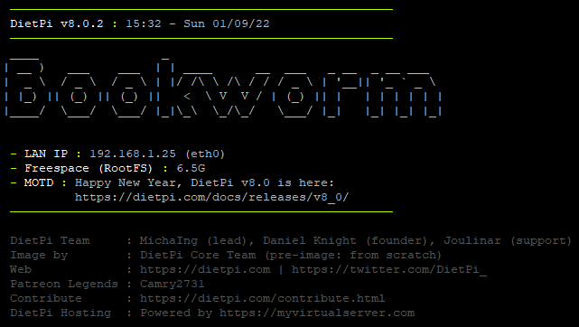
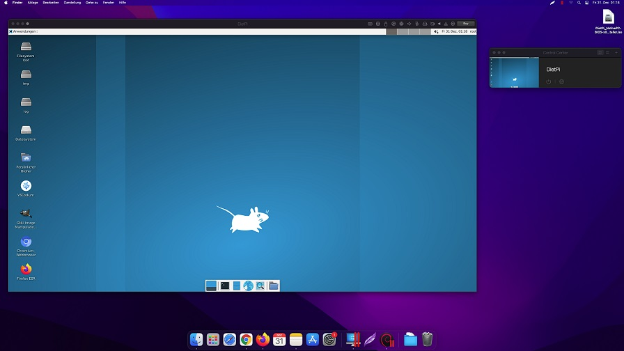

# Release Notes

## January 2022 (version 8.0)

### Overview

**January 2022 release of DietPi** removes support for Debian Stretch and brings an incremental improvement to the overall platform.

{: width="447" height="281" loading="lazy"}

!!! cite "_Photo by Alicja, Pixabay_"

### Debian Stretch support

Support for Debian Stretch has been removed starting with v8.0. This change allowed us to do a major code cleanup and migrate to some newer methods in different areas which are only available on Buster and above.

!!! Warning ""

    Debian 9 "Stretch" was released in 2017, and it has been initially superseded by Debian 10 "Buster", and then Debian 11 "Bullseye".

    DietPi v7.9 was the last release with support for Debian Stretch. **DietPi v8.0** and later require Debian Buster or newer.

    Read our article [**Why you should upgrade your Stretch system now**](https://dietpi.com/blog/?p=1001) to learn more about the need to make this upgrade and you could do this easily to Debian Buster and even further to latest version (**Debian Bullseye**).

### Improvements

- **Network** :octicons-arrow-right-16: For new images, the default DHCP timeout is not reduced to 10 seconds anymore. This could have been too short, in which case network targets of the boot sequence are reached before an IP has been actually assigned. Especially in case of `AUTO_SETUP_AUTOMATED=1` this could have lead to connection test timeouts and hence abortion of the automated first run setup. Many thanks to @jpeg2600 for reporting such a case: <https://github.com/MichaIng/DietPi/issues/5143>
- [**DietPi-Config**](../../dietpi_tools/#dietpi-configuration) :octicons-arrow-right-16: When configuring a first WiFi slot via scanning for SSIDs, the WiFi adapter is now not brought up via `ifup` but `ip l dev wlanX up`. This way no DHCP and WPA client starts are triggered, which are doomed to fail when the WiFi adapter is not connected to any access point yet. Especially in case of the default 60 seconds DHCP timeout, this would otherwise cause an unnecessary long delay.
- [**DietPi-Dashboard**](../../software/system_stats/#dietpi-dashboard) :octicons-arrow-right-16: Added an option to view multiple dashboard nodes from one frontend web interface. Related to this, the backend can now be installed only, reducing memory usage and making it impossible to manually access the node outside of the backend API.
- **DietPi-Print_large** :octicons-arrow-right-16: This new script has been added which can be executed or sourced from `/boot/dietpi/func/dietpi-print_large` to print the string passed via first argument in large `figlet` style fonts. It currently only supports the characters a-z, A-Z, 0-9, dot and dash, i.e. those commonly allowed in hostnames.
- [**DietPi-Banner**](../../dietpi_tools/#dietpi-banner) :octicons-arrow-right-16: Added an option to print the system's hostname in large `figlet` style fonts, right below the banner header. In case it is enabled as well, the regular/small hostname line will then be skipped. Many thanks to @matellis for implementing this feature: <https://github.com/MichaIng/DietPi/pull/5113>

    {: width="641" height="362" loading="lazy"}

- **DietPi-Software** | **Mono** :octicons-arrow-right-16:  `mono-complete` won't be installed anymore but only `mono-devel` instead. This skips the `XSP4` webserver service, which listens on port 8084 by default where it conflicts with File Browser. This only affects new installations. You can manually apply this change running next command:

    ```sh
    apt-mark manual mono-devel && apt --autoremove purge mono-complete
    ```

    Many thanks to @jaguar489 for reporting this issue: <https://github.com/MichaIng/DietPi/issues/5093>

- **DietPi-Software** | [**FuguHub**](../../software/cloud/#fuguhub) :octicons-arrow-right-16:  The outdated official installer has been replaced with a fully automated own setup, removing the obsolete or even harmful interactive dialogues. On fresh installs, an admin account `dietpi` with global software password is created as well.
- **DietPi-Software** | [**myMPD**](../../software/media/#mympd) :octicons-arrow-right-16: Installation is now done via official APT repository, which means quicker install compared to compiling from source, fewer dependencies and easier updates via `apt upgrade`: <https://github.com/MichaIng/DietPi/issues/5115>
- **DietPi-Software** | [**Airsonic**](../../software/media/#airsonic) :octicons-arrow-right-16: Since the project has been archived by its maintainer and suffers from the critical [Log4Shell](https://dietpi.com/blog/?p=1172) security vulnerability, we moved to the advertised fork "Airsonic-Advanced" which also enables compatibility with Java 17 and hence Debian Bullseye. Airsonic will be reinstalled as part of the DietPi update to apply the migration. All data and settings will be preserved and migrated automatically.
- **DietPi images** | [**Parallels Desktop (macOS)**](../../hardware/#parallels-desktop) :octicons-arrow-right-16: New Virtual Machine image for Parallels Desktop on macOS.

    {: width="640" height="360" loading="lazy"}

### Bug Fixes

- [**Raspberry Pi**](../../hardware/#raspberry-pi) :octicons-arrow-right-16: Resolved an issue where unintentionally the turbo mode was enabled. This got backported to v7.9, to our existing RPi images and via live patch. Many thanks to @ayo-x and @whyisthisbroken for reporting this issue: <https://github.com/MichaIng/DietPi/issues/5088>
- **DietPi-FS_partition_resize** :octicons-arrow-right-16: Resolved an issue where in some cases the boot partition failed to mount on first boot since after the partition resize the system in some cases didn't get sufficient time to fully apply the change before continuing with the boot mount attempt. Many thanks to @Mausy5043 and @sistemicorp for reporting this issue: <https://github.com/MichaIng/DietPi/issues/5006>
- [**DietPi-Config**](../../dietpi_tools/#dietpi-configuration) :octicons-arrow-right-16: Resolved an issue where on Raspberry Pi, when the full KMS display driver is used, the sound card selection could have been falsely applied. With full KMS enabled, for each HDMI port an additional HDMI sound card appears (replacing the regular firmware HDMI sound device), even when no HDMI device is attached and with onboard audio disabled. This lead to an increase of external sound card indices. The appearance of the KMS HDMI sound cards is now aligned with the onboard firmware HDMI sound cards, i.e. if not onboard `auto` or HDMI is selected in `dietpi-config`, now the KMS HDMI sound devices are disabled as well, making use of the `noaudio` device tree overlay parameter.
- **DietPi-Software**
    - Resolved an issue where on first boot, choice and preference menu selections triggered an error as the install state file did not exist yet. Many thanks to @bsheeres for reporting this issue: <https://github.com/MichaIng/DietPi/issues/5080>
    - Resolved an issue where the deprecated `AUTO_SETUP_FILE_SERVER_INDEX` option in `dietpi.txt` file was applied inverted. `-1` should have installed [ProFTPD](../../software/file_servers/#proftpd) and `-2` Samba, while it was done the opposite way. However, note that this setting is not present on current images and deprecated. Use `AUTO_SETUP_INSTALL_SOFTWARE_ID` instead to mark any one or multiple file servers for automatic install. Many thanks to @bsheeres for reporting this issue: <https://github.com/MichaIng/DietPi/issues/5081>
    - **Browsers** - On the ARMv6 Raspberry Pi models Raspberry Pi 1 and Zero (1) since Bullseye, [Chromium](../../software/desktop/#chromium) and [Firefox](../../software/desktop/#firefox) fail to start due to hardware and build limitations which are outside of our control. Since those are currently the only two browser available from `dietpi-software`, they have been disabled together with the browser preference menu for those systems, until we find and implement a good additional compatible browser. Further info: <https://github.com/RPi-Distro/chromium-browser/issues/21>.
- **DietPi-Software** | [**Kodi**](../../software/media/#kodi) :octicons-arrow-right-16: Resolved an issue where subsequent Kodi reinstalls created duplicates of the `CMA` parameter for the KMS overlay setting in `config.txt`. The duplicates are patched out during DietPi update.
- **DietPi-Software** | [**Docker**](../../software/programming/#docker) :octicons-arrow-right-16: Resolved an issue where the install was aborted due to an incorrect check for missing kernel modules. Many thanks to @dragonandy for reporting this issue: <https://github.com/MichaIng/DietPi/issues/5061>
- **DietPi-Software** | [**Pi-hole**](../../software/dns_servers/#pi-hole) :octicons-arrow-right-16: Resolved an issue where the teleporter import log was not shown but denied by the X-Frame-Options header: <https://discourse.pi-hole.net/t/unable-to-restore-teleporter-backup-fresh-install-no-funky-changes-made/51573>
- **DietPi-Software** | [**Blynk Server**](../../software/hardware_projects/#blynk-server) :octicons-arrow-right-16: Resolved an issue on ARMv6 RPi models where the install failed as the latest Blynk Server release does not contain a Java 8 build. Since the older Java 8 build does not contain a native Log4Shell vulnerability mitigation, it is added server-wise on these systems.
- **DietPi-Software** | [**Mycroft AI**](../../software/hardware_projects/#mycroft-ai) :octicons-arrow-right-16: Resolved an issue on Bullseye (and above) systems where `mycroft-cli-client` command fails with a permissions issue, even as root user. Many thanks to @berndverhofstadt for reporting this issue: <https://github.com/MichaIng/DietPi/issues/5100>
- **DietPi-Software** | [**Nukkit**](../../software/gaming/#nukkit) :octicons-arrow-right-16: Resolved an issue where the install failed due to a changed download URL. The Jenkins instance has moved to `ci.opencollab.dev`, where also the Geyser and Floodgate projects are hosted.
- **DietPi-Software** | [**FuguHub**](../../software/cloud/#fuguhub) :octicons-arrow-right-16: Resolved an issue where the uninstall failed as the process was not stopped as intended. Many thanks to @kd9352 for reporting this issue: <https://github.com/MichaIng/DietPi/issues/5058>
- **DietPi-Software** | [**myMPD**](../../software/media/#mympd) :octicons-arrow-right-16: Resolved an issue where the installation failed due to an updated dependency. Many thanks to @supersexy for reporting this issue: <https://github.com/MichaIng/DietPi/issues/5115>
- **DietPi-Software** | [**Python 3**](../../software/programming/#python-3) :octicons-arrow-right-16: Worked around an issue where the `pip` reinstall failed. Many thanks to @hueppinr for reporting this issue: <https://github.com/MichaIng/DietPi/issues/5117>
- **DietPi-Software** | [**Unbound**](../../software/dns_servers/#unbound) :octicons-arrow-right-16: Resolved an issue where the `unbound-resolvconf` service applied localhost automatically as local name server, if the `resolvconf` package was installed. Since often Unbound is installed in combination with Pi-hole or AdGuard Home, and those are usually used by network clients only, not the server itself, `unbound-resolvconf` is disabled now on Unbound installs. If Unbound is wanted as local resolver as well, it should be explicitly configured, e.g. via dietpi-config network options. Many thanks to @Ianszh for reporting this issue: <https://github.com/MichaIng/DietPi/issues/5133>
- **DietPi-Software** | [**Mosquitto**](../../software/hardware_projects/#mosquitto) :octicons-arrow-right-16: Applied a workaround on ARMv6 where the latest Mosquitto packages from the official APT repository are not ARMv6-compatible. Many thanks to @thomasmockridge for reporting this issue: <https://github.com/MichaIng/DietPi/issues/5140>

As always, many smaller code performance and stability improvements, visual and spelling fixes have been done, too much to list all of them here. Check out all code changes of this release on GitHub: <https://github.com/MichaIng/DietPi/issues/5137>

### Known/Outstanding Issues

- [**DietPi-Config**](../../dietpi_tools/#dietpi-configuration) :octicons-arrow-right-16: Enabling WiFi + Ethernet adapters, both on different subnets, breaks WiFi connection in some cases: <https://github.com/MichaIng/DietPi/issues/2103>

For all additional issues that may appear after release, please see the following link for active tickets: <https://github.com/MichaIng/DietPi/issues>
