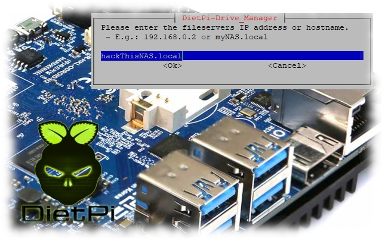

# Release Notes

## February 2022 (version 8.1)

### Overview

The **February 5th, 2022** release of **DietPi v8.1** comes together with a new image for [**Odroid N2(+)**](../../hardware/#odroid), some improvements to our drive manager and a number of enhancements and bug fixes for several software install options.

{: width="640" height="400" loading="lazy"}

### SBC support

- [**Odroid N2**](../../hardware/#odroid) :octicons-arrow-right-16: Support for Odroid N2(+) with modern mainline Linux images has been added, including proper boot configuration, serial console selection, HDMI and 3.5mm audio selection and more. Sadly existing images cannot be migrated, a new image is available for testing: <https://github.com/MichaIng/DietPi/issues/5039>

### Improvements

- **DietPi-Benchmark** :octicons-arrow-right-16: During RAM I/O benchmarks, the CPU governor is now changed to "performance" so that the result is not affected by possible CPU frequency scaling but the raw/max RAM I/O performance is measured. A significant effect of this has been recognised on Odroid N2 images with modern mainline kernel. Since the CPU benchmark is done first, this has no effect on its score and CPU temperature results.
- [**DietPi-Drive_Manager**](../../dietpi_tools/#dietpi-drive-manager)
    - Btrfs subvolume mounts are now preserved in `/etc/fstab`. Many thanks to @laddde for implementing this feature: <https://github.com/MichaIng/DietPi/pull/5176>
    - The Samba mount dialogues do now indicate that a hostname can be entered instead of a server IP and a shared folder path instead of a share name only.
- [**DietPi-Backup**](../../dietpi_tools/#dietpi-backup-backuprestore) :octicons-arrow-right-16: A notification is not printed when `rsync` dry-run to obtain required disk space is starting, since this can take a while. Many thanks to @whisdol for reporting the the impression of a hanging script: <https://github.com/MichaIng/DietPi/issues/5209>
- [**DietPi-Software**](../../software/)
    - `iptables` is now automatically configured to use either modern `nf_tables` API or legacy API, depending on whether `nf_tables` is supported by the kernel. This is helpful for Bullseye images with older kernel versions, where `iptables` is by default configured to use `nf_tables`, which fails.
    - `iptables` rules are now applied for IPv6 as well in all cases (for VPN servers, WiFi and Tor hotspots) via `ip6tables`. This does not depend on whether IPv6 is actually enabled for interfaces, but enables general IPv6 support for affected software options. Many thanks to @vielka442 for reporting missing IPv6 support for Tor Hotspot: <https://github.com/MichaIng/DietPi/issues/5038>
- **DietPi-Software** | [**Jellyfin**](../../software/media/#jellyfin) :octicons-arrow-right-16: For new installs, the default web interface port has been changed from 8096 to 8097 to resolve a port conflict with Emby.
- **DietPi-Software** | [**Docker**](../../software/programming/#docker)/[**K3s**](../../software/system_stats/#k3s) :octicons-arrow-right-16: The memory cgroup is now enabled as well on RPi and our new Odroid N2 image, when Docker or K3s is installed, to allow container memory usage monitoring. Many thanks to @isarrider for this request: <https://github.com/MichaIng/DietPi/issues/5225>
- **DietPi-Software** | [**Raspotify**](../../software/media/#raspotify) :octicons-arrow-right-16: This software option has been disabled on Debian Buster systems but enabled for ARMv8 and x86_64 systems, to match the current state of the official Raspotify APT repository.

### Bug Fixes

- [**DietPi-Services**](../../dietpi_tools/#dietpi-services) :octicons-arrow-right-16: Resolved an issue where service edits and process tool settings were not effective as they were stored to the wrong file path. Many thanks to [phpBB:TopFord](https://dietpi.com/phpbb/memberlist.php?username=TopFord){: class="nospellcheck"} and [phpBB:MicDG](https://dietpi.com/phpbb/memberlist.php?username=MicDG){: class="nospellcheck"} for reporting this issue: <https://dietpi.com/phpbb/viewtopic.php?p=41509#p41509>
- [**DietPi-LetsEncrypt**](../../dietpi_tools/#dietpi-letsencrypt) :octicons-arrow-right-16: Resolved an issue where Certbot failed on fresh Apache installs since the `000-default.conf` vhost by default does not contain any directive anymore. The `ServerName` directive with the entered domain name is now added to `000-default.conf` instead of `apache2.conf`, with the benefit that it overrides the global `ServerName` directive in `dietpi.conf`, which uses the local IP address only.
- **DietPi-Software**/[**DietPi-AutoStart**](../../dietpi_tools/#dietpi-autostart) | [**Chromium**](../../software/desktop/#chromium) :octicons-arrow-right-16: Resolved an issue where the Chromium kiosk autostart option failed on all non-RPi systems.
- **DietPi-Software** | [**Roon Extension Manager**](../../software/media/#roon-extension-manager) :octicons-arrow-right-16: It has been disabled for ARMv6 RPi systems where it cannot run currently. Many thanks to @JanKoudijs for applying this fix: <https://github.com/MichaIng/DietPi/pull/5231>
- **DietPi-Software** | [**FuguHub**](../../software/cloud/#fuguhub) :octicons-arrow-right-16: Resolved an issue where the uninstall failed as the service was not stopped and removed as expected, before attempting to remove the service user.
- **DietPi-Software** | [**PHP**](../../software/webserver_stack/#php) :octicons-arrow-right-16: Resolved an issue where the `PATH` variable was not available for PHP applications with [Lighttpd](../../software/webserver_stack/#lighttpd) and [Nginx](../../software/webserver_stack/#nginx) webservers. It is now set to the static value `/usr/local/bin:/usr/bin:/bin`, the default PATH excluding super user executables `sbin`. Many thanks to @shanew1694 for reporting a related issue with [rTorrent](../../software/bittorrent/#rtorrent): <https://github.com/MichaIng/DietPi/issues/5161#issuecomment-1013381362>
- **DietPi-Software** | [**MineOS**](../../software/gaming/#mineos) :octicons-arrow-right-16: Resolved an issue where the install failed on Bullseye: <https://github.com/MichaIng/DietPi/issues/5181>
- **DietPi-Software** | [**Cuberite**](../../software/gaming/#cuberite) :octicons-arrow-right-16: Resolved an issue where the server failed to start on ARMv8 systems: <https://github.com/MichaIng/DietPi/issues/5180>
- **DietPi-Software** | [**MATE**](../../software/desktop/#mate) :octicons-arrow-right-16: Resolved an issue where the install failed when LXDE is installed already. Many thanks to @n0valis for reporting this issue: <https://github.com/MichaIng/DietPi/issues/5214>
- **DietPi-Software** | [**Ampache**](../../software/media/#ampache) :octicons-arrow-right-16: Resolved an issue on Bullseye systems where Ampache v5 installs/reinstalls did not work because of a changed webroot directory: <https://github.com/MichaIng/DietPi/pull/5205>
- **DietPi-Software** | [**OpenBazaar**](../../software/social/#openbazaar) :octicons-arrow-right-16: Since the original project has been taken down, we migrated to a fork which keeps up the marketplace for the community: <https://github.com/MichaIng/DietPi/issues/5213>
- **DietPi-Software** | **X.Org X Server** :octicons-arrow-right-16: Resolved an issue where VMs without KMS/DRM support failed to start the X server, e.g. Hyper-V. The classic framebuffer DDX is now installed when no KMS/DRM support is detected on VMs.
- **DietPi-Software** | [**Box86**](../../software/gaming/#box86)/[**Box64**](../../software/gaming/#box64) :octicons-arrow-right-16: Resolved an issue where the install failed when a kernel upgrade has just been done so that the `binfmt_misc` kernel module cannot be found for the loaded kernel.
- **DietPi-Software** | [**RPi-Monitor**](../../software/system_stats/#rpi-monitor) :octicons-arrow-right-16: Resolved an issue where the CPU temperature was not shown. Many thanks to [phpBB:KamikazeePL](https://dietpi.com/phpbb/memberlist.php?username=KamikazeePL){: class="nospellcheck"} for reporting this issue: <https://dietpi.com/phpbb/viewtopic.php?t=10001>
- **DietPi-Software** | [**Home Assistant**](../../software/home_automation/#home-assistant) :octicons-arrow-right-16: Resolved an issue with the latest Home Assistant version where restarting it via web interface made it remaining stopped. The fix is applied to all instances on DietPi update. Many thanks to [phpBB:jchh](https://dietpi.com/phpbb/memberlist.php?username=jchh){: class="nospellcheck"} for reporting this issue: <https://dietpi.com/phpbb/viewtopic.php?t=10025>

As always, many smaller code performance and stability improvements, visual and spelling fixes have been done, too much to list all of them here. Check out all code changes of this release on GitHub: <https://github.com/MichaIng/DietPi/pull/5229>
