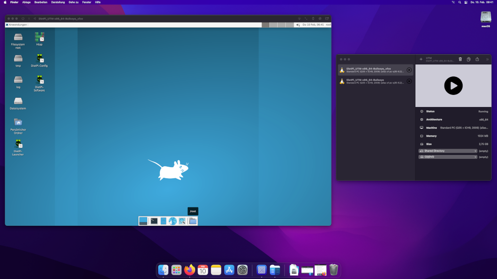

# Release Notes

## March 2022 (version 8.2)

### Overview

The **March 5th, 2022** release of **DietPi v8.2** comes together with a new image for [**UTM**](../../hardware/#utm), [**Proxmox**](../../hardware/#proxmox), [**VMware ESXi**](../../hardware/#vmware), [**Odroid C4**](../../hardware/#odroid), some improvements to **Roon** software packages, **Docker**, **Chromium**, **Deluge** and a number of enhancements and bug fixes for several software install options.

{: width="480" height="303" loading="lazy"}

!!! cite "_Photo by pasja1000, Pixabay_"

### New software

- [**MicroK8s**](../../software/system_stats/#microk8s) :octicons-arrow-right-16: The simplest production-grade upstream K8s. Lightweight and focused, added to DietPi as software option with ID 142. Many thanks to @silverraindog for the implementation: <https://github.com/MichaIng/DietPi/pull/5239>

### SBC/hardware support

- [**Odroid C4**](../../hardware/#odroid) | We replaced the legacy kernel image with a new mainline Linux image, built from scratch, using the methods used for the new Odroid N2(+) image.
- [**Virtual Machines**](../../hardware/#native-pc-virtual-machines) | A major enhancement was achieved. New images are available there: <https://dietpi.com/downloads/images/>  
  Now we support these VM options:

    | Virtual Machine | OS platform |
    | --------------- | ----------- |
    | VMware Workstation Player VMware Workstation Pro VMware Fusion | Linux Windows macOS |
    | VirtualBox | Linux Windows macOS |
    | Parallels Desktop | macOS |
    | UTM | macOS |
    | Hyper-V | Windows |
    | VMware vSphere | VMware Proprietary OS |
    | Proxmox | Debian Linux |

    - [**UTM**](../../hardware/#utm) :octicons-arrow-right-16: Support for the UTM virtualization software (available for macOS Big Sur or newer). This enhances the virtual machine support on macOS additional to VMware, VirtualBox and Parallels Desktop.

        {: width="640" height="400" loading="lazy"}

    - [**Proxmox**](../../hardware/#proxmox) :octicons-arrow-right-16: Support for the Proxmox virtual appliance server. This enhances the virtual machine support additional to VMware ESXi.

        {: width="640" height="350" loading="lazy"}

    - [**VMware ESXi**](../../hardware/#vmware) :octicons-arrow-right-16: Support for the VMware ESXi Hypervisor (e.g. within the VMware vSphere virtual appliance server). This enhances the virtual machine support additional to Proxmox.

        {: width="640" height="329" loading="lazy"}

### Improvements

- **Virtualization** | [VMware](../../hardware/#vmware), [VirtualBox](../../hardware/#virtualbox), [Parallels](../../hardware/#parallels), [Hyper-V](../../hardware/#hyper-v) :octicons-arrow-right-16: Improvement to allows using the VirtIO SCSI controller with virtualisers.

- **General** :octicons-arrow-right-16: It is now checked in various scripts whether kernel modules for the loaded kernel are available, i.e. the directory `/lib/modules/<version>` which matches the kernel version reported by `uname -r`, so that additional kernel modules can be loaded ondemand. This is not the case after kernel upgrades, when the previous kernel was replaced or auto-removed and a reboot outstanding to load the new kernel. In this transient situation, several system tasks and software installs can fail if they rely on loading additional kernel modules, which includes installs of container and emulation platforms, but also more trivial command calls like `ip`.
- [**DietPi-Banner**](../../dietpi_tools/#dietpi-banner) :octicons-arrow-right-16: If no DietPi or APT package update is available, the banner now informs you about an outstanding reboot to finalise a kernel upgrade.

    {: width="440" height="108" loading="lazy"}

- [**DietPi-Drive_Manager**](../../dietpi_tools/#dietpi-drive-manager) :octicons-arrow-right-16: Users will now face an additional prompt if a reboot is outstanding to finalise a kernel upgrade, with the offer to perform the reboot now. The drive manager relies on this when mounting new filesystems which require kernel drivers, and to correctly detect whether the `autofs4` module is available or not.
- [**DietPi-Drive_Manager**](../../dietpi_tools/#dietpi-drive-manager) :octicons-arrow-right-16: Reserved blocks on ext4 filesystem are now shown and can be set in MiB rather than in percent. This makes it easier to apply a reasonable value, which usually does not depend on the filesystem size but may be a fixed value to assure that root can perform maintenance or cleanup tasks.
- [**DietPi-Update**](../../dietpi_tools/#dietpi-update) :octicons-arrow-right-16: Users will now face an additional prompt after the update if a reboot is outstanding to finalise a kernel upgrade, with the offer to perform the reboot now. The reboot is done automatically on first boot of the DietPi system.
- [**DietPi-Software**](../../dietpi_tools/#dietpi-software) :octicons-arrow-right-16: The script cannot be used anymore if a reboot is outstanding to finalise a kernel upgrade. Users will face a prompt which offers to perform the reboot now. The reboot is done automatically on first boot of the DietPi system, when required, while usually this is covered by the proceeding DietPi update already.
- **DietPi-Software** | [**Roon Bridge**](../../software/media/#roon-bridge) :octicons-arrow-right-16: The service now runs as `roonbridge` service user instead of as `root`. The install directory has been moved to `/opt/roonbridge`, the data directory to `/mnt/dietpi_userdata/roonbridge` and the log directory to `/var/log/roonbridge`, for consistency. The DietPi update does not enforce the migration, but a manual reinstall via "dietpi-software reinstall 121" applies it, while preserving all data and configs.
- **DietPi-Software** | [**Roon Extension Manager**](../../software/media/#roon-extension-manager) :octicons-arrow-right-16: The service now runs as `roon-extension-manager` service user instead of as `root` and the data directory has been moved to `/mnt/dietpi_userdata/roon-extension-manager`. The DietPi update does not enforce the migration, but a manual reinstall via `dietpi-software reinstall 86` applies it, while preserving all extensions and configs.
- **DietPi-Software** | [**Roon Server**](../../software/media/#roon-server) :octicons-arrow-right-16: The service now runs as `roonserver` service user instead of as `root` and logs are now done to `/var/log/roonserver`, i.e. the DietPi-RAMlog by default, aligning with Roon Bridge. The DietPi update does not enforce the migration, but a manual reinstall via `dietpi-software reinstall 154` applies it, while preserving all data and configs. When you do the reinstall, note that Roon remote apps will ask you to login again and unauthorise the connected Roon Server. This is however just a formal step required as of the service user change, while all your settings and libraries appear just the same.
- **DietPi-Software** | [**Docker Compose**](../../software/programming/#docker-compose) :octicons-arrow-right-16: We migrated from the Python-based v1 to v2, written in Go. Existing installs can be migrated with a manual "dietpi-software reinstall 134". Many thanks to @CommandLineN00b for making us aware of this major Docker Compose upgrade: <https://github.com/MichaIng/DietPi/issues/5034>
- **DietPi-Software** | [**Chromium**](../../software/desktop/#chromium) :octicons-arrow-right-16: It is now easier to autostart Chromium as non-root user, making use of `systemd-logind` and `startx`. The related change requires a reinstall of Chromium: `dietpi-software reinstall 113`
- **DietPi-Software** | [**Deluge**](../../software/bittorrent/#deluge) :octicons-arrow-right-16: The web interface will now connect to the local Deluge server automatically. Many thanks to [phpBB:jonyskids](https://dietpi.com/phpbb/memberlist.php?username=jonyskids){: class="nospellcheck"} for doing this suggestion and [phpBB:Jappe](https://dietpi.com/phpbb/memberlist.php?username=Jappe){: class="nospellcheck"} for providing the solution: <https://dietpi.com/phpbb/viewtopic.php?t=10026>
- **DietPi-Software** | [**Allo GUI**](https://dietpi.com/phpbb/viewtopic.php?t=2317) :octicons-arrow-right-16: The Allo audiophile web interface received a major version update: It does caching and session storage via APCu memory cache, does not make use of the dedicated `allo` user anymore, and has undergone a bunch of updates, fixes, security hardenings and cleanups, including a database created from scratch. The migration will be done automatically with the DietPi update, which also provides further details. The source code is now hosted on GitHub: <https://github.com/MichaIng/DietPi-AlloGUI>
- **Documentation** :octicons-arrow-right-16: Extended/updated documentation for [MinIO](../../software/cloud/#minio), [Tautulli](../../software/media/#tautulli), [Docker-Compose](../../software/programming/#docker-compose), [Roon Server](../../software/media/#roon-server), [Roon Extension Manager](../../software/media/#roon-extension-manager).

### Bug Fixes

- **DietPi-TimeSync** :octicons-arrow-right-16: Resolved an issue where the `systemd-timesyncd` service was not stopped at boot as intended, when the time sync finished before DietPi-TimeSync started: <https://github.com/MichaIng/DietPi/issues/5256>
- [**DietPi-Config**](../../dietpi_tools/#dietpi-configuration) :octicons-arrow-right-16: Resolved an issue where the onboard audio selection for our new Odroid N2 image did not work. Many thanks to @Kreeblah for reporting this issue: <https://github.com/MichaIng/DietPi/issues/5039#issuecomment-1038326411>
- [**DietPi-Software**](../../dietpi_tools/#dietpi-software) :octicons-arrow-right-16: Resolved an issue where via `AUTO_SETUP_INSTALL_SOFTWARE_ID` `dietpi.txt` settings it was possible to install software on first boot which is actually not supported on the platform. Many thanks to @eyduh for reporting this issue: <https://github.com/MichaIng/DietPi/issues/5245>
- [**DietPi-Software**](../../dietpi_tools/#dietpi-software) :octicons-arrow-right-16: Resolved an issue on RPi where on repeating container platform installs, multiple `cgroup_enable=memory` entries were added to `/boot/cmdline.txt`. The duplicates are removed automatically on DietPi update, when present. Many thanks to @isarrider for reporting this issue: <https://github.com/MichaIng/DietPi/issues/5225>
- [**DietPi-Software**](../../dietpi_tools/#dietpi-software) :octicons-arrow-right-16: Apache: Resolved an issue on fresh installs where the service failed to start due to a config file syntax error. Many thanks to @Camry2731 for reporting this issue: <https://github.com/MichaIng/DietPi/issues/5248>
- **DietPi-Software** | [**Nextcloud**](../../software/cloud/#nextcloud) :octicons-arrow-right-16: Resolved an issue where the install on an over 2 GiB RAM system failed. Many thanks to @p4cm4n for reporting this issue: <https://github.com/MichaIng/DietPi/issues/5251>
- **DietPi-Software** | [**Folding@Home**](../../software/distributed_projects/#foldinghome) :octicons-arrow-right-16: Resolved an issue where reinstalls failed since a removed SysV service is tried to be stopped. Many thanks to @eyduh for reporting this issue: <https://github.com/MichaIng/DietPi/issues/5255>
- **DietPi-Software** | [**Bazarr**](../../software/social/#openbazaar) :octicons-arrow-right-16: Resolved an issue where the service entered an endless restart loop because of a missing dependency. Many thanks to [phpBB:alleyu2](https://dietpi.com/phpbb/memberlist.php?username=alleyu2){: class="nospellcheck"} for reporting this issue: <https://dietpi.com/phpbb/viewtopic.php?t=10050>
- **DietPi-Software** | [**Python 3**](../../software/programming/#python-3) :octicons-arrow-right-16: Worked around an issue on ARMv6/7 Buster systems where installing `numpy` or any module which depends on `numpy` failed: <https://github.com/piwheels/packages/issues/287>
- **DietPi-Software** | [**Pydio**](../../software/cloud/#pydio) :octicons-arrow-right-16: Resolved an issue where the data directory was not writeable. Many thanks @holocronology for reporting this issue: <https://github.com/MichaIng/DietPi/issues/5274>
- **DietPi-Software** | [**Jellyfin**](../../software/media/#jellyfin) :octicons-arrow-right-16: Resolved an issue where during install two settings failed to apply since the config file didn't exist yet. Many thanks to @echtfrank for reporting this issue: <https://github.com/MichaIng/DietPi/issues/5279>
- **DietPi-Software** | [**Firefox**](../../software/desktop/#firefox) :octicons-arrow-right-16: Resolved a warning on startup about the missing `libpci` library, used to detect GPU details. Many thanks to @MDAR for reporting this issue: <https://github.com/MichaIng/DietPi/issues/5278#issuecomment-1044381054>
- **DietPi-Software** | **X.Org X Server** :octicons-arrow-right-16: Resolved an issue on modern Odroid C2 and NanoPi K2 (Amlogic S905 SoC) images where the X server (desktop) failed to start. Many thanks to all users who reported and helped resolving this issue: <https://github.com/MichaIng/DietPi/issues/5234>, <https://dietpi.com/phpbb/viewtopic.php?t=10078>

As always, many smaller code performance and stability improvements, visual and spelling fixes have been done, too much to list all of them here. Check out all code changes of this release on GitHub: <https://github.com/MichaIng/DietPi/pull/5330>
