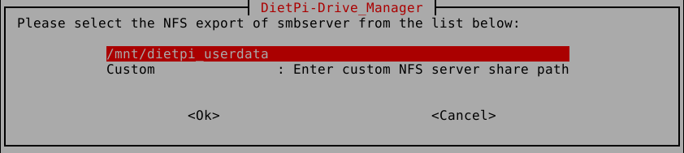

# Release Notes

## April 2022 (version 8.3)

### Overview

The **April 2nd, 2022** release of **DietPi v8.3** comes together with the new **PHP Composer** software option, **motionEye** now available on Bullseye, some improvements to the DietPi-Drive_Manager, and more.

{: width="480" height="320" loading="lazy"}

!!! cite "_Photo by congerdesign, Pixabay_"

### New software

- **PHP Composer** :octicons-arrow-right-16: The PHP package manager has been made a dedicated install option.  
    {: width="80" height="97" loading="lazy"}

    !!! cite "Source: [`WizardCat - getcomposer.org`](https://commons.wikimedia.org/w/index.php?curid=38131432) via Wikimedia tech blog, MIT"

### SBC/hardware support

- **Container** :octicons-arrow-right-16: Initial support for container systems has been added to DietPi, using hardware ID 75. For now it is assumed that the container guest does not require an own network stack, but uses the host network interface or one managed by the container engine. This works well with `systemd-nspawn` which we use for DietPi image generation and for testing DietPi features in CI/CD pipelines. Further support and images for specific container engines, like Docker or LXC with Proxmox and QEMU will follow.

### Improvements

- [**DietPi-Banner**](../../dietpi_tools/#dietpi-banner) :octicons-arrow-right-16: It is now possible to hide the credits section from the DietPi banner. Run `dietpi-banner` to configure its content. Many thanks to @math-gout for contributing this feature: <https://github.com/MichaIng/DietPi/pull/5355>

    {: width="410" height="210" loading="lazy"}

- [**DietPi-Drive_Manager**](../../dietpi_tools/#dietpi-drive-manager) :octicons-arrow-right-16: Adding an NFS drive now allows to select a specific export from an NFS server, detected via `showmount -e <IP/hostname>`. Entering a custom path is still possible, including the single slash `/` which was always used before. If the NFS server has no root export defined via `fsid=0`, this solves the issue that the full root directory structure is mounted and allows to mount multiple shares from the same server. Many thanks to [phpBB:bamyasi](https://dietpi.com/phpbb/memberlist.php?username=bamyasi){: class="nospellcheck"} for doing this suggestion: <https://dietpi.com/phpbb/viewtopic.php?t=5488>

    {: width="630" height="143" loading="lazy"}

- [**DietPi-Drive_Manager**](../../dietpi_tools/#dietpi-drive-manager) :octicons-arrow-right-16: NFS and Samba network drives can now be mounted to any directory on the server, not necessarily below `/mnt`.
- [**DietPi-DDNS**](../../dietpi_tools/#dietpi-ddns) :octicons-arrow-right-16: It is now possible to select the IP family to associate with your DDNS domain. For new setups, IPv4 is used by default for best compatibility. If you configured your DDNS domain already, no IP family is forced to not change existing behaviour, unless selected explicitly. We recommend to use IPv4 so that your server can be reached with any client from any network, regardless whether client and network support IPv6 or not. Many thanks to @TomBayne for suggesting this feature: <https://github.com/MichaIng/DietPi/issues/5354>
- **DietPi-Software** | [**motionEye**](../../software/camera/#motioneye) :octicons-arrow-right-16: We worked together with other contributors to revive motionEye and port it over to Python 3, which also allowed us to re-enable it on Debian Bullseye systems. It requires further careful testing before a stable release can be done, but common functionality works. We enabled it with a `beta` mark in DietPi-Software. Visit the new home of motionEye, and if you want, contribute or help testing: <https://github.com/motioneye-project/motioneye>
- **DietPi-Software** | [**Node-RED**](../../software/hardware_projects/#node-red) :octicons-arrow-right-16: The `nodered` service user is now added to the `spi` system group automatically, relevant on Raspberry Pi to grant it access to SPI-attached sensors and similar. Many thanks to [phpBB:devifast](https://dietpi.com/phpbb/memberlist.php?username=devifast){: class="nospellcheck"} for reporting a related issue: <https://dietpi.com/phpbb/viewtopic.php?t=10134>
- **DietPi-Software** | [**TasmoAdmin**](../../software/home_automation/#tasmoadmin) :octicons-arrow-right-16: Reduced the downloaded data size from ~150 MiB to ~4 MiB by downloading the runtime files of the latest release only instead of the whole GitHub repository archive.

### Bug Fixes

- [**NanoPi NEO3**](../../hardware/#nanopi-series-friendlyelec) :octicons-arrow-right-16: Resolved an issue where the board became unbootable after an `apt upgrade` because the latest version of the Armbian kernel does not ship a NEO3 device tree anymore. On DietPi upgrade, it is switched to the NanoPi R2 rev00 device tree, which works regarding Ethernet, USB and general GPIO interface: <https://forum.armbian.com/topic/20133-nanopi-neo3-dtb-gone-since-linux-dtb-current-rockchip64-22021/>
- [**Raspberry Pi**](../../hardware/#raspberry-pi) :octicons-arrow-right-16: Resolved an issue where enabling and using onboard WiFi during first run installs was failing if a reboot was done after first run update due to a kernel upgrade. Many thanks to @matteocarnelos for reporting this issue: <https://github.com/MichaIng/DietPi/issues/5391>
- **Network** :octicons-arrow-right-16: Resolved an issue where the systemd network targets could have been reached before the network adapter was even detected. Many thanks to [phpBB:Totila](https://dietpi.com/phpbb/memberlist.php?username=Totila){: class="nospellcheck"} for reporting this issue: <https://dietpi.com/phpbb/viewtopic.php?t=10167>
- **DietPi-WiFi-Monitor** :octicons-arrow-right-16: The first default gateway check is now done after the first tick rate interval instead of immediately after service start. This adds another grace period at boot to reduce the chance that the WiFi monitor reconfigures the interface which is just about to be configured for the first time. This should usually not be required, but may help with cases where the initial DHCP lease or WPA authentication time out or fail.
- **DietPi-TimeSync** :octicons-arrow-right-16: Resolved an issue where the script threw a syntax error where it shouldn't, which however didn't affect functionality. Many thanks to @adminy for reporting this issue: <https://github.com/MichaIng/DietPi/issues/5347>
- **DietPi-Login** :octicons-arrow-right-16: Resolved an issue where a prompt about an unsupported SSH client terminal was incorrectly shown. Many thanks to @jahway603 and @Dagon for reporting this issue: <https://github.com/MichaIng/DietPi/issues/5341>, <https://github.com/MichaIng/DietPi/issues/5366>
- [**DietPi-Drive_Manager**](../../dietpi_tools/#dietpi-drive-manager) :octicons-arrow-right-16: Worked around an issue on Bullseye with legacy Linux versions, where exFAT filesystems failed to mount since the exFAT driver for FUSE is not invoked automatically if the native kernel driver is missing. A symlink for `mount.exfat => mount.exfat-fuse` is now created in these cases to force this invocation, and it is removed as fast as due to a kernel upgrade, the native exFAT driver becomes available. Many thanks to @RunningUtes for reporting this issue: <https://github.com/MichaIng/DietPi/issues/5166>
- **DietPi-Software** | [**Kodi**](../../software/media/#kodi) :octicons-arrow-right-16: Resolved an issue on Raspberry Pi Bullseye systems where libraries were missing to run Kodi via KMS/DRM. Many thanks to [phpBB:derebo](https://dietpi.com/phpbb/memberlist.php?username=derebo){: class="nospellcheck"} for reporting this issue: <https://dietpi.com/phpbb/viewtopic.php?t=10161>
- **DietPi-Software** | [**Mopidy**](../../software/media/#mopidy) :octicons-arrow-right-16: Resolved an issue where there installation failed. Many thanks to [phpBB:amibumpin](https://dietpi.com/phpbb/memberlist.php?username=amibumpin){: class="nospellcheck"} for reporting this issue: <https://dietpi.com/phpbb/viewtopic.php?t=10188>
- **DietPi-Software** | [**rTorrent**](../../software/bittorrent/#rtorrent) :octicons-arrow-right-16: Resolved an issue where the web interface didn't work with Nginx because the PHP handler wasn't set. Many thanks to @vinhtq115 for providing the solution: <https://github.com/MichaIng/DietPi/pull/5375>
- **DietPi-Software** | [**Webmin**](../../software/system_stats/#webmin) :octicons-arrow-right-16: Worked around an issue where the install failed. Many thanks to @omavoss for reporting this issue: <https://github.com/MichaIng/DietPi/issues/5386>
- **DietPi-Software** | [**WireGuard**](../../software/vpn/#wireguard) :octicons-arrow-right-16: Resolved an issue where the WireGuard module shipped with the kernel was not detected if it is shipped xz-compressed. Many thanks to [phpBB:Carbonara](https://dietpi.com/phpbb/memberlist.php?username=Carbonara){: class="nospellcheck"} for reporting this issue: <https://dietpi.com/phpbb/viewtopic.php?t=10173>
- **DietPi-Software** | [**Chromium**](../../software/desktop/#chromium) :octicons-arrow-right-16: Resolved an issue on Raspberry Pi Bullseye systems where pages did not load but a "Page Unresponsive" error prompt was shown after a while instead, if KMS/DRM was not used. Many thanks to @pastaholic for reporting this issue: <https://github.com/MichaIng/DietPi/issues/5342>
- **DietPi-Software** | [**Nukkit**](../../software/gaming/#nukkit) :octicons-arrow-right-16: Resolved an issue where the service failed to start because of an unintended single quote character in the service file. Many thanks to @richardpdunngb for reporting this issue: <https://github.com/MichaIng/DietPi/issues/5396>

As always, many smaller code performance and stability improvements, visual and spelling fixes have been done, too much to list all of them here. Check out all code changes of this release on GitHub: <https://github.com/MichaIng/DietPi/pull/5397>
