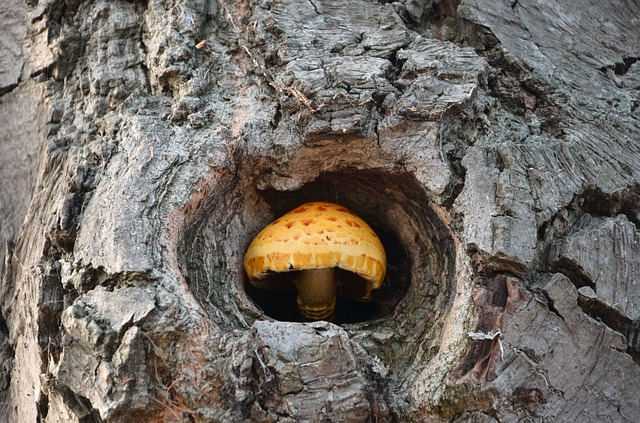

# Release Notes

***To do: Change actual pull request number v8.8***

## August 2022 (version 8.8)

### Overview

The **August 27th, 2022** release of **DietPi v8.8** comes with a couple of minor bug fixes.

{: width="480" height="317" loading="lazy"}

!!! cite "*Photo by KristinaStrapcova, Pixabay*"

### SBC/hardware support

### New software

### Improvements

### Bug Fixes

- **DietPi-Installer** :octicons-arrow-right-16: The common Debian images on Linode VPS (cloud computing server) can now be converted into DietPi. This was previously failing since these images intentionally do not contain a partition table, so that GRUB cannot be flashed. Many thanks to @mews-se for reporting this issue: <https://github.com/MichaIng/DietPi/issues/5691>
- **DietPi-Software** | [**vaultwarden**](../../software/cloud/#vaultwarden) :octicons-arrow-right-16: Resolved an issue where the installation failed on Buster systems. Many thanks to @anubis-genix for reporting this issue: <https://github.com/MichaIng/DietPi/issues/5681>
- **DietPi-Software** | [**vaultwarden**](../../software/cloud/#vaultwarden) :octicons-arrow-right-16: Resolved an issue where reinstalls onto existing pre-v1.25 vaultwarden installs lead to missing remote web vault access. Many thanks to @jetspeed for reporting this issue: <https://dietpi.com/forum/t/vaultwarden-update-command-fail-then-vaultwarden-not-start-even-after-reboot/13350/68>

As always, many smaller code performance and stability improvements, visual and spelling fixes have been done, too much to list all of them here. Check out all code changes of this release on GitHub: <https://github.com/MichaIng/DietPi/pull/5658>
