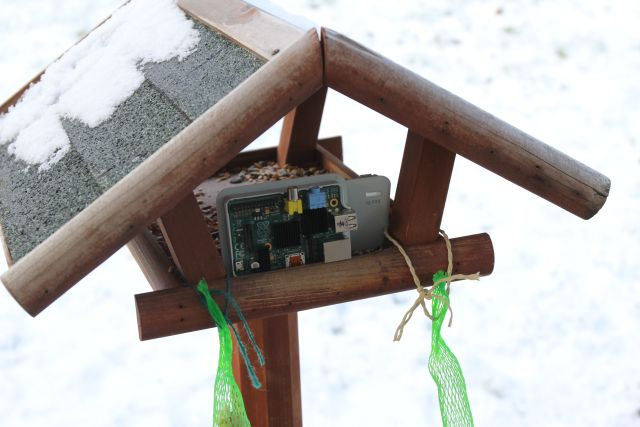

# Release Notes

## January 2024 (version 9.0)

### Overview

The **January 20th, 2024** release of **DietPi v9.0** comes with the drop of **Buster** support (["oldoldstable" Debian version 10](https://wikipedia.org/wiki/Debian_version_history)), new support for the **1,5 GB version of the Orange Pi Zero 3**, enhancements for other boards and bug fixes for several `dietpi-software` options.

{: width="480" height="320" loading="lazy"}

!!! cite "Pi 1B. *Photo by `StephanStS`, DietPi*"

### Breaking

- The minimum Debian version supported by our scripts has been raised to **Bullseye**.  
  **Buster** systems will be migrated to a dedicated branch automatically.  
  We highly recommend affected systems to either flash a new image or upgrade to Debian Bullseye, following our DietPi blog post [**DietPi – How to upgrade to “Bullseye”**](https://dietpi.com/blog/?p=811). Once the upgrade has been done, the update to DietPi v9.0 will be offered on next update check or when running `dietpi-update`.
- The minimum DietPi version to support direct updates to DietPi v9.0 from has been raised to v7.0. Older systems will go through a two-stage process, being upgraded to DietPi v8.25 with a separate branch, and afterwards further to DietPi v9.0 via master branch if the Debian version requirement is met as well.

### New images

- [**Orange Pi Zero 3**](../hardware.md#orange-pi-series) :octicons-arrow-right-16: New images for the 1.5 GB RAM variant are now available for testing, before they are added to our download page soon: <https://dietpi.com/downloads/images/testing/>

### Enhancements

- [**Raspberry Pi**](../hardware.md#raspberry-pi) :octicons-arrow-right-16: Further work has been done to better support the Raspberry Pi 5. Our firmware migration script to test it has been reworked to allow selecting/deselecting optional kernel packages, instead of always installing all of them: <https://github.com/MichaIng/DietPi/issues/6676>
- [**DietPi-Tools**](../dietpi_tools.md) | [**DietPi-Banner**](../dietpi_tools/misc_tools.md#dietpi-banner) :octicons-arrow-right-16: Instead of `Freespace`, the `Disk usage` is now shown, including the total disk size and used percent. Many thanks to @Andr3Carvalh0 for implementing this change: <https://github.com/MichaIng/DietPi/pull/6837>
- [**DietPi-Software**](../dietpi_tools/software_installation.md#dietpi-software) | [**motionEye**](../software/camera.md#motioneye) :octicons-arrow-right-16: Updated build dependencies for ARM and RISC-V, and switched to the recent pre-release from PyPI, instead of pulling from the repositories `dev branch`.
- [**DietPi-Software**](../dietpi_tools/software_installation.md#dietpi-software) | [**Moonlight (CLI)**](../software/gaming.md#moonlight-cli), [**Moonlight (GUI)**](../software/gaming.md#moonlight-gui) :octicons-arrow-right-16: Moonlight has been enabled on Bookworm, as packages are now available.
- [**DietPi-Software**](../dietpi_tools/software_installation.md#dietpi-software) | [**Logitech Media Server**](../software/media.md#logitech-media-server) :octicons-arrow-right-16: Re-enabled it for Bookworm and Trixie, now using the latest "stable nightly" builds instead of the "latest releases". Many thanks to @SteveInWA for informing us about the update: <https://github.com/MichaIng/DietPi/discussions/6847>

### Bug fixes

- [**Orange Pi 3B**](../hardware.md#orange-pi-series) :octicons-arrow-right-16: Resolved an issue where onboard WiFi and Bluetooth did not work because the related kernel module was not loaded. Many thanks to @jake5253 for reporting this: <https://github.com/MichaIng/DietPi/issues/6659#issuecomment-1887072641>

As always, many smaller code performance and stability improvements, visual and spelling fixes have been done, too much to list all of them here. Check out all code changes of this release on GitHub: <https://github.com/MichaIng/DietPi/pull/6860>
