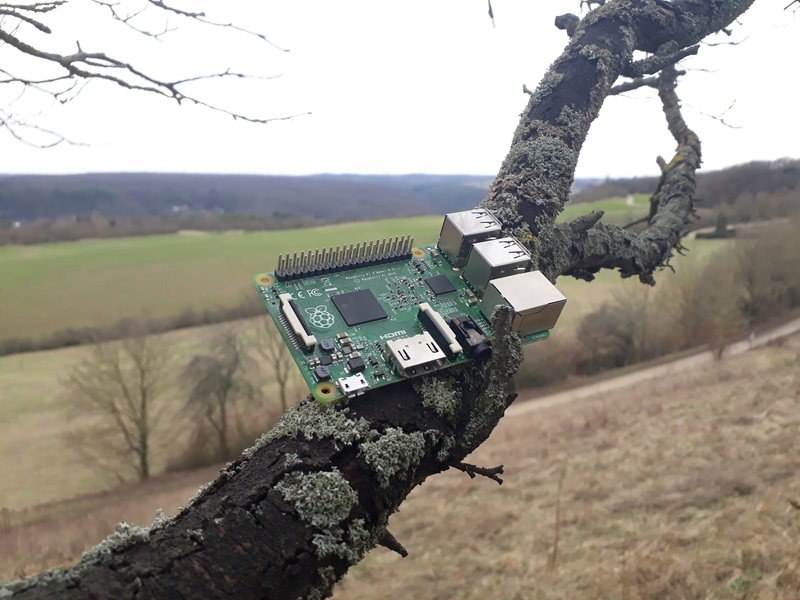

# Release Notes

## February 2024 (version 9.1)

### Overview

The **February 19th, 2024** release of **DietPi v9.1** comes with new support for the **Raspberry Pi 5**, enhancements for **ROCK 4 SE** and **NanoPi R5S/R5C/R6S/R6C/T6**. Additionally, enhancements and bug fixes for several `dietpi-software` options are included.

{: width="800" height="600" loading="lazy"}

!!! cite "Pi 2B v1.2. *Photo by `MichaIng`, DietPi*"

### New images

- [**Raspberry Pi 5**](../hardware.md#raspberry-pi) :octicons-arrow-right-16: Images for Raspberry Pi 5 and other Raspberry Pi models, based on the new Bookworm kernel and firmware package set from Raspberry Pi Ltd, are now available for testing. Note that some features, like changing screen resolution and camera module support, are not working yet: <https://dietpi.com/downloads/images/testing/>
- [**ROCK 4 SE**](../hardware.md#radxa) :octicons-arrow-right-16: Since our Radxa ROCK 4 image has become incompatible with the ROCK 4 SE variant, we provide a [new image for this particular variant](https://dietpi.com/downloads/binaries/testing/). Many thanks to [@janno](https://dietpi.com/forum/u/janno){: class="nospellcheck"} for reporting failing boot on this SBC: <https://dietpi.com/forum/t/radxa-rock-4-se-supported-not-booting/19263>
- [**NanoPi R5S/R5C/6 series**](../hardware.md#nanopi-series-friendlyelec) :octicons-arrow-right-16: Our [new images for these SBCs](https://dietpi.com/downloads/images/testing/) use kernel and bootloader builds generated with the Armbian build system. This means that they have a single ext4 partition with kernel image, overlays and boot configuration located below `/boot` as usual. The kernel command-line arguments can hence be adjusted, kernel headers installed for compiling modules, and the kernel features are more streamlined with other SBCs. The R5S/R5C images ship with a much newer mainline Linux build, which means more modern kernel features and better code quality. But some edge case hardware features which have not been upstreamed may not work, like support for Rockchip's Media Process Platform (`MPP`) module, used for hardware-accelerated video encoding/decoding by some media servers/players. We are also testing the migration from our old images to the new kernel and bootloader packages, and will likely offer this with next DietPi update.

### Enhancements

- [**DietPi-Tools**](../dietpi_tools.md) | [**DietPi-Backup**](../dietpi_tools/system_maintenance.md#dietpi-backup-backuprestore)/[**DietPi-Sync**](../dietpi_tools/system_maintenance.md#dietpi-sync) :octicons-arrow-right-16: Both scripts do now only error out when the `rsync` process is already running, rather than on any process which has the term `rsync` in its name. Many thanks to @zuble for implementing this enhancement: <https://github.com/MichaIng/DietPi/pull/6918>
- [**DietPi-Software**](../dietpi_tools/software_installation.md#dietpi-software) | [**Domoticz**](../software/home_automation.md#domoticz) :octicons-arrow-right-16: Enabled for x86_64 Bookworm and Trixie systems, since the latest x86_64 builds were compiled against `libssl3`.
- [**DietPi-Software**](../dietpi_tools/software_installation.md#dietpi-software) | [**vaultwarden**](../software/cloud.md#vaultwarden) :octicons-arrow-right-16: Along with a regular update, RISC-V support has been added.
- [**DietPi-Software**](../dietpi_tools/software_installation.md#dietpi-software) | [**Home Assistant**](../software/home_automation.md#home-assistant) :octicons-arrow-right-16: The Python version installed with Home Assistant has been raised to 3.12.1, to align with official appliances. Many thanks to @whyisthisbroken for making us aware if it: <https://github.com/MichaIng/DietPi/issues/6906>
- [**DietPi-Software**](../dietpi_tools/software_installation.md#dietpi-software) | [**Squeezelite**](../software/media.md#squeezelite) :octicons-arrow-right-16: An update to Squeezelite v2.0.0-1465 will be applied during the DietPi update.

### Bug fixes

- **DietPi-FS_partition_resize** :octicons-arrow-right-16: Resolved an issue where on Bullseye images, the root partition and filesystem was not expanded on first boot. Many thanks to [@naddel91](https://dietpi.com/forum/u/naddel91){: class="nospellcheck"} and others for reporting this issue: <https://dietpi.com/forum/t/increase-partition-size/19015>
- [**DietPi-Software**](../dietpi_tools/software_installation.md#dietpi-software) | [**Mosquitto**](../software/hardware_projects.md#mosquitto) :octicons-arrow-right-16: Resolved an issue where the global software password was accidentally applied as username instead of as password: <https://github.com/MichaIng/DietPi/issues/6886>
- [**DietPi-Software**](../dietpi_tools/software_installation.md#dietpi-software) | [**Amiberry**](../software/gaming.md#amiberry) :octicons-arrow-right-16: Resolved an issue where the installation failed on 64-bit RPi systems. Many thanks to @JerichoCross for reporting this issue: <https://github.com/MichaIng/DietPi/issues/6893>
- [**DietPi-Software**](../dietpi_tools/software_installation.md#dietpi-software) | [**GMediaRender**](../software/media.md#gmediarender) :octicons-arrow-right-16: Resolved an issue where the default command arguments were not set correctly on a fresh install. Many thanks to [@ransur0t](https://dietpi.com/forum/u/ransur0t){: class="nospellcheck"} for reporting this issue: <https://dietpi.com/forum/t/gmediarender-default-args-on-allo-image-for-raspberry-pi/19205>
- [**DietPi-Software**](../dietpi_tools/software_installation.md#dietpi-software) | [**Samba Server**](../software/file_servers.md#samba) :octicons-arrow-right-16: Resolved an issue where our configuration file was not installed if the Samba Client was installed as well, or an SMB/CIFS mount done. Many thanks to [@TheCrystalGipsy](https://dietpi.com/forum/u/TheCrystalGipsy){: class="nospellcheck"} for reporting this issue: <https://dietpi.com/forum/t/samba-share-issues-need-help/19224>
- [**DietPi-Software**](../dietpi_tools/software_installation.md#dietpi-software) | [**Pydio**](../software/cloud.md#pydio) :octicons-arrow-right-16: Resolved an issue where web access via Apache webserver did not work, due to an invalid config entry. However, Pydio 8 is not maintained since years, does not support PHP 8 and hence can only work on Bullseye systems. We will migrate to Pydio Cells, once someone finds time to work on this: <https://github.com/MichaIng/DietPi/issues/3469>
- [**DietPi-Software**](../dietpi_tools/software_installation.md#dietpi-software) | [**OctoPrint**](../software/printing.md#octoprint) :octicons-arrow-right-16: Resolved an issue where system restart and shutdown form the OctoPrint UI failed due to an invalid `sudoers` rule. Many thanks to @samjw-nz for reporting this issue: <https://github.com/MichaIng/DietPi/issues/6915>
- [**DietPi-Software**](../dietpi_tools/software_installation.md#dietpi-software) | [**Squeezelite**](../software/media.md#squeezelite) :octicons-arrow-right-16: Resolved an issue where in rare cases the service could have started before the network adapter was initialised, in which case it reports a MAC address of 00:00:00:00:00:00 to LMS servers. With multiple Squeezelite players, this could have lead to conflicts among them. Many thanks to [@willefg](https://dietpi.com/forum/u/willefg){: class="nospellcheck"} for reporting this issue: <https://dietpi.com/forum/t/dietpi-squeezelite-players-with-same-mac-address-000000-00/19312>
- [**DietPi-Software**](../dietpi_tools/software_installation.md#dietpi-software) | [**RealVNC Server**](../software/remote_desktop.md#realvnc-server) :octicons-arrow-right-16: Resolved an issue where the installation was throwing an error, as it was attempted to write to a config file shipped by TigerVNC only.

As always, many smaller code performance and stability improvements, visual and spelling fixes have been done, too much to list all of them here. Check out all code changes of this release on GitHub: <https://github.com/MichaIng/DietPi/pull/6921>
