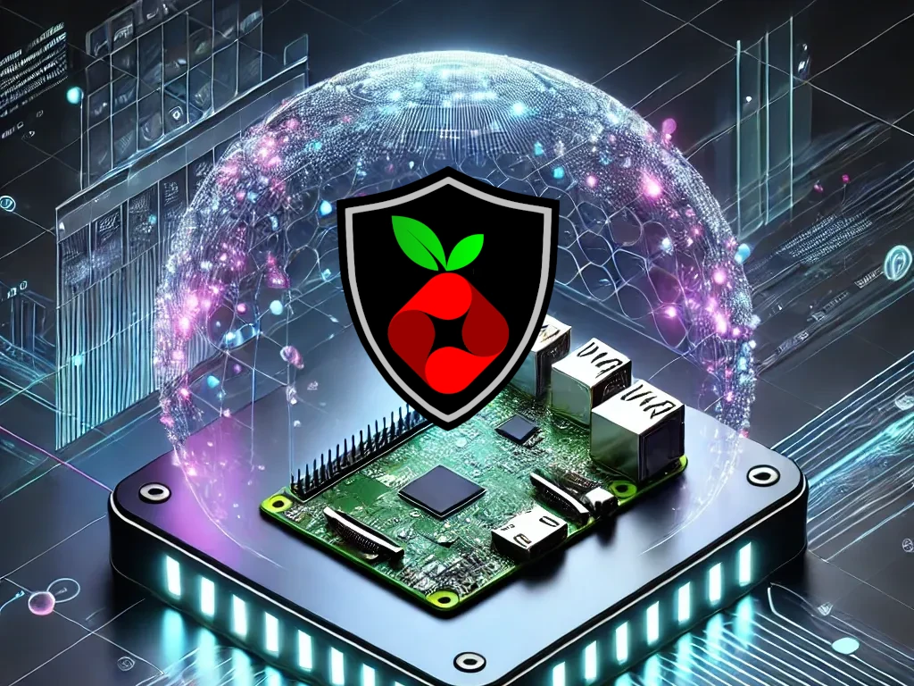

# Release Notes

## February 2025, vol 2 (version 9.11)

### Overview

The **February 23th, 2025** release of **DietPi v9.11** adds support for Pi-hole v6, and a few fixes.

{: width="640" height="366" loading="lazy"}

!!! cite "\"Futuristic SBC Hub\" by ChatGPT/DALL·E"

### Bug fixes

- [**Quartz64**](../hardware.md#pine64)/[**Star64**](../hardware.md#pine64_1)/[**VisionFive 2**](../hardware.md#starfive) :octicons-arrow-right-16: Resolves an issue where the import of config files from the setup FAT partition and root filesystem expansion on first boot could have failed. Many thanks to @disconn3ct for reporting this issue: <https://github.com/MichaIng/DietPi/issues/6838>
- **DietPi-FirstBoot** :octicons-arrow-right-16: Resolved an issue, where the automatic first run setup could have failed, if the network adapter, `wpa_supplicant` or DHCP client took a little longer to receive an IP address, without `ifup` further halting the script. In case of `AUTO_SETUP_AUTOMATED=1` in `dietpi.txt`, the very first network check is assured to try at least 4 times, with a 5 seconds delay between each attempt.
- [**DietPi-Tools**](../dietpi_tools.md) | [**DietPi-Config**](../dietpi_tools/system_configuration.md#dietpi-config) :octicons-arrow-right-16: Resolved an issue on Raspberry Pi where selecting the `linux-image-rpi-v8` kernel on 32-bit images failed. Many thanks to @SOULV1CE for reporting this issue: <https://github.com/MichaIng/DietPi/issues/7402>
- [**DietPi-Software**](../dietpi_tools/software_installation.md#dietpi-software) | [**Fail2Ban**](../software/system_security.md#fail2ban) :octicons-arrow-right-16: Resolved an issue where the install failed while downloading updated Dropbear filters. Many thanks to @Stream5710 for reporting this issue: <https://github.com/MichaIng/DietPi/issues/7413>
- [**DietPi-Software**](../dietpi_tools/software_installation.md#dietpi-software) | [**Pi-hole**](../software/dns_servers.md#pi-hole) :octicons-arrow-right-16: Support for Pi-hole v6 was added. During the DietPi update, we check whether your Pi-hole has been updated already, and in case perform some migration and cleanup of DietPi-specific configs. Also, since Pi-hole v6 ships with its internal webserver and PHP interpreter, if a webserver and PHP are installed without any dependant among `dietpi-software` options, it is offered to uninstall them.

As always, many smaller code performance and stability improvements, visual and spelling fixes have been done, too much to list all of them here. Check out all code changes of this release on GitHub: <https://github.com/MichaIng/DietPi/pull/7426>
