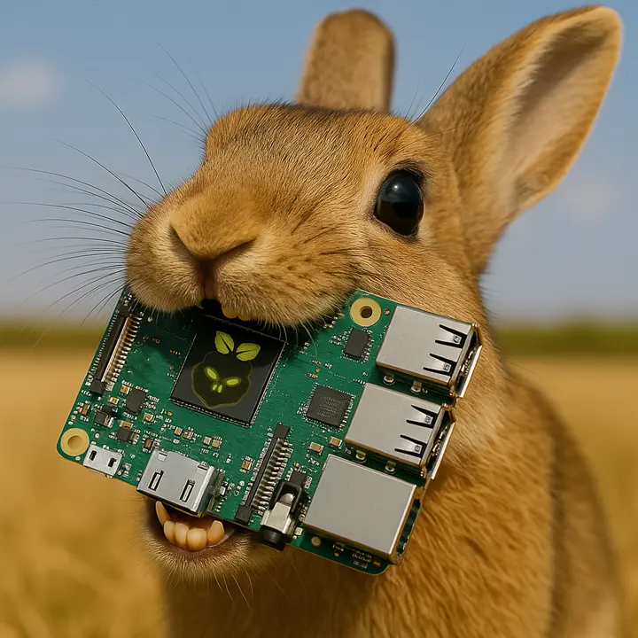

# Release Notes

## April 2025 (version 9.12)

### Overview

The **April 13th, 2025** release of **DietPi v9.12** adds support for fish (friendly interactive shell) and a few enhancements and fixes.

{: width="640" height="480" loading="lazy"}

!!! cite "\"A domedary in the desert holds a pi in its mouth\" by ChatGPT/DALL·E"

### New software

- [**DietPi-Software**](../dietpi_tools/software_installation.md#dietpi-software) | [**fish**](../software/system_software.md#fish) :octicons-arrow-right-16: A dietpi-software entry for this alternative shell has been added. Aside of installing the fish APT package, a DietPi-specific config script is added to enable dietpi-* aliases and load the `dietpi-login` script for first run setup and autostart options. Many thanks to @ndrew222 for implementing this software option: <https://github.com/MichaIng/DietPi/pull/7452>

### Enhancements

- [**DietPi-Tools**](../dietpi_tools.md) | [**DietPi-Backup**](../dietpi_tools/system_maintenance/#dietpi-backup-backuprestore.md#dietpi-backup-backuprestore) :octicons-arrow-right-16: Support for writing a backup into an SSHFS has been added.
- [**DietPi-Software**](../dietpi_tools/software_installation.md#dietpi-software) | [**WiringPi**](../software/hardware_projects.md#wiringpi) :octicons-arrow-right-16: Added support for Orange Pi boards, using the `wiringOP` sources from Xunlong: <https://github.com/orangepi-xunlong/wiringOP>
- [**DietPi-Software**](../dietpi_tools/software_installation.md#dietpi-software) | [**Spotifyd**](../software/media.md#spotifyd) :octicons-arrow-right-16: Added support for ARMv8 and x86_64 Bookworm/Trixie systems, supported with the latest Spotifyd release.
- [**DietPi-Software**](../dietpi_tools/software_installation.md#dietpi-software) | [**RPi.GPIO**](../software/hardware_projects.md#rpigpio) :octicons-arrow-right-16: Since the modern Raspberry Pi kernel removed support for the legacy GPIO API, `python3-rpi-lgpio` will now be installed instead, providing an RPi.GPIO compatibility layer for the modern `lgpio` library.

### Bug fixes

- [**DietPi-Config**](../dietpi_tools/system_configuration.md#dietpi-config) :octicons-arrow-right-16: Resolved an issue where enabling the `waveshare32` LCD panel failed on Raspberry Pi with new kernel/firmware stack. Many thanks to @guiksign for fixing this bug: <https://github.com/MichaIng/DietPi/pull/7462>
- [**DietPi-Software**](../dietpi_tools/software_installation.md#dietpi-software) | [**O!MPD**](../software/media.md#ompd) :octicons-arrow-right-16: Resolved an issue where changing the `config.php` from within the web UI and storing covers did not work due to missing permissions. Many thanks to @praveensg for reporting this issue: <https://dietpi.com/forum/t/22993>
- [**DietPi-Software**](../dietpi_tools/software_installation.md#dietpi-software) | [**FreshRSS**](../software/social.md#freshrss) :octicons-arrow-right-16: Resolved an issue where the website did not work properly on Bullseye systems, since FreshRSS v1.25.0 and later requires PHP 8.1+. On those systems, the latest v1.24.3 will be installed instead. Many thanks to @kaferenza for reporting this issue: <https://dietpi.com/forum/t/23129>

As always, many smaller code performance and stability improvements, visual and spelling fixes have been done, too much to list all of them here. Check out all code changes of this release on GitHub: <https://github.com/MichaIng/DietPi/pull/7480>
