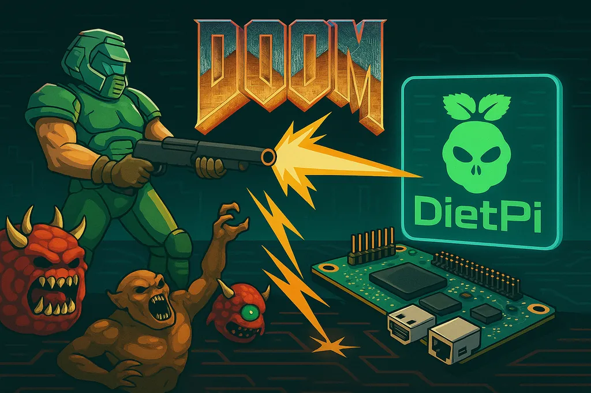

# Release Notes

## June 2025 (version 9.14)

### Overview

The **June 22th, 2025** release of **DietPi v9.14** comes with new images for the Orange Pi 5 Ultra and Orange Pi 5 Compute Module SBCs, the new software package GZDoom, improvements for NanoPi R4S/R5S/R6S/R6C, Orange Pi Zero 2W, SOQuartz, Odroid HC4 and additionally with several bug fixes.

{: width="1024" height="683" loading="lazy"}

!!! cite "\"DietPi: Hell Yeah, It Runs DOOM!\" by ChatGPT/DALL·E"

### New images

- [**Orange Pi 5 Ultra**](../hardware.md#orange-pi-series) :octicons-arrow-right-16: Support for the latest successor of the Orange Pi 5 family has been added to DietPi. Compared to the original Orange Pi 5, it features DDR5 RAM, onboard WiFi 6E, 2.5 Gbit Ethernet, an eMMC slot, an additional HDMI input port, and supports NVMe SSDs up to 2280 format. It is very similar to the Orange Pi 5 Max, but one of its HDMI port is an input port. It is disabled by default but can be enabled via device tree overlay by setting `overlays=hdmirx` in your `/boot/dietpiEnv.txt`.
- [**Orange Pi 5 Compute Module**](../hardware.md#orange-pi-series) :octicons-arrow-right-16: Support for the latest compute module from Xunlong/Orange Pi has been added to DietPi. It features an RK3588S SoC 2-16 GiB DDR4 RAM, 32-256 MiB onboard eMMC storage, other features depending on the used base board. It has been tested on the Tablet Base Board. If you have the other Base Board, please check the following discussion to check or report which features have been tested successfully: <https://github.com/MichaIng/DietPi/discussions/7574>

### New software

- [**DietPi-Software**](../dietpi_tools/software_installation.md#dietpi-software) | [**GZDoom**](../software/gaming.md#gzdoom) :octicons-arrow-right-16: This modder-friendly OpenGL and Vulkan source port based on the DOOM engine has been added to our software catalogue. Many thanks to @Captain-Beefheart for suggestion and supporting the implementation of this software option: <https://github.com/MichaIng/DietPi/discussions/7497>

### Enhancements

- **Container** :octicons-arrow-right-16: `sysctl` cannot change values from within containers, but it needs to be done on the host instead. When `dietpi-software` would apply `sysctl` settings for certain software options, on container systems, it instead shows a dialogue with additional information, and how to apply the suggested change on the host.
- [**NanoPi R4S/R5S/R6S/R6C**](../hardware.md#nanopi-series-friendlyelec) :octicons-arrow-right-16: All onboard Ethernet adapters are now assigned a static MAC address.
- [**NanoPi R4S/R5S**](../hardware.md#nanopi-series-friendlyelec) :octicons-arrow-right-16: A kernel patch was added which applies the native Ethernet driver LED triggers as default for their respective LEDs. In turn we remove the udev rules for the `netdev` trigger, which caused boot issues in rare cases, due to the needed interface up/down hack. The downside is that the native triggers do not indicate network activity, only a cable link as static light. Many thanks to @cxgth and @yjteng for reporting a related issue: <https://github.com/MichaIng/DietPi/issues/6951>
- [**Orange Pi Zero 2W**](../hardware.md#orange-pi-series) :octicons-arrow-right-16: Added `udev` rules to enable the Ethernet LEDs of the official Orange Pi Expansion Board. Many thanks to @ZjemCiKolege for the request: <https://github.com/MichaIng/DietPi/issues/6827#issuecomment-2776741253>
- [**SOQuartz**](../hardware.md#pine64) :octicons-arrow-right-16: The recent kernel upgrade ships device trees for the Blade and Model A base boards. Previously, only the C4 base board was included. For now, the device tree needs to be adjusted manually in `/boot/extlinux/extlinux.conf`. If you own a Blase base board, please reach out. So we can figure out a method to detect it, and apply the correct device tree automatically on first boot.
- [**Odroid HC4**](../hardware.md#odroid) :octicons-arrow-right-16: We created an own hardware ID and provide own images for this SBC from now on. Previously, Odroid C4 and HC4 shared the same hardware ID and bootloader. In recent versions, this caused issues with the USB ports on HC4, and it always had the issue that no SPI bootloader was shipped with the package. Many thanks to [@amibumpin](https://dietpi.com/forum/u/amibumpin){:class="nospellcheck"} and others for reporting this issue and testing the fix: <https://dietpi.com/forum/t/23524>
- **ARM SBCs** :octicons-arrow-right-16: New ARM images with U-Boot `/boot/boot.scr` script usage will not make use of the legacy `/boot/uInitrd` format `initramfs` image anymore, but will load raw `initrd` images instead. This makes one step during `initramfs` updates obsolete, where an additional script converts the raw image generated by `initramfs-tools` into an `uInitrd` format image. However, for this to work, there are changes at multiple lines needed in the boot script, which is not trivial to safely patch during DietPi update. We might do it with a later release, but until then, if you are interested in applying the change, just reach out, and we will provide instructions.
- **ARM SBCs** :octicons-arrow-right-16: Similarly to above change, the `/boot/boot.scr` script of new images supports multiple device tree overlay prefixes. The overlays shipped with the kernel device tree package have different by times overlapping prefixes, also depending on the kernel version/branch. Especially for RK35xx SBCs this made it unnecessarily difficult to deal with overlays. This also opens the door for implementing a fully functional device tree overlay selection menu into dietpi-config, but with a later release ;).
- **ARM SBCs** :octicons-arrow-right-16: Realtek WiFi drivers for Rockchip/Allwinner/Amlogic mainline Linux builds have been reviewed and aligned: Where available, the module of the mainline `RTW88` driver family has been enabled and respective 3rd party drivers disabled. If you have a WiFi adapter with `RTL8814AU` chip, and it is not working properly after the kernel upgrade, please inform us. It is the only missing dedicated driver module on Linux 6.12, compared to before the change. But another module from the `RTL88XXAU` family should work as fallback. Many thanks to @kartikynwa for reporting a related problem with an unnecessarily enabled and used 3rd party driver: <https://github.com/MichaIng/DietPi/issues/7151>

### Bug fixes

- **Allwinner H3** :octicons-arrow-right-16: Resolved an issue where boot could fail with the new Linux 6.12 kernel on old systems. Reason is a too low memory address used to load the environment variables and device tree overlays to, overlapping with the memory region used by the raised `initramfs` image. Many thanks to @mhjessen for reporting this issue: <https://github.com/MichaIng/DietPi/issues/7557>
- [**Raspberry Pi**](../hardware.md#raspberry-pi) :octicons-arrow-right-16: Resolved an issue where on older images, hardware accelerated video codecs could stay disabled, even when enabling them via `dietpi-config`. We split camera and codec toggles a while ago, but did not migrate the module blacklists accordingly. This is now done via DietPi update for affected systems. Many thanks to @danergo for reporting this issue: <https://github.com/MichaIng/DietPi/issues/7491>
- [**ROCK64**](../hardware.md#pine64) :octicons-arrow-right-16: Resolved an issue where boot could fail with Linux 6.12 if a too old U-Boot version is present on the SPI storage. In turn, our new U-Boot package contains an SPI image as well, which will be flashed on DietPi update to prevent issues with the kernel upgrade. Many thanks to [@usr_9](https://dietpi.com/forum/u/usr_9){:class="nospellcheck"} and others for reporting this issue: <https://dietpi.com/forum/t/23426>
- [**DietPi-Tools**](../dietpi_tools.md) | [**DietPi-Backup**](../dietpi_tools/system_maintenance.md#dietpi-backup-backuprestore) :octicons-arrow-right-16: Resolved an issue where white spaces and some other special characters in the backup directory path were not correctly handled, when the config file is read. If you were affected be regular resets to the default path, please set the path once more after this update, and it should stay persistent. Many thanks to @Krouwndouwn for reporting this issue: <https://github.com/MichaIng/DietPi/issues/7439>
- [**DietPi-Software**](../dietpi_tools/software_installation.md#dietpi-software) | [**X11**](../software/desktop.md#desktops) :octicons-arrow-right-16: Resolved a regression where X11 was not actually installed, but only configuration files. Many thanks to @oliverhbailey for reporting this issue: <https://github.com/MichaIng/DietPi/issues/7560>
- [**DietPi-Software**](../dietpi_tools/software_installation.md#dietpi-software) | [**Home Assistant**](../software/home_automation.md#home-assistant) :octicons-arrow-right-16: Resolve an issue where the service could have failed to start after a reinstall (HA update) if the Python version was updated as well, due to an obsolete config file pointing to the old Python version. Many thanks to @GrimXer0 for reporting this issue: <https://github.com/MichaIng/DietPi/issues/7525#issuecomment-2918176369>
- [**DietPi-Software**](../dietpi_tools/software_installation.md#dietpi-software) | [**Chromium**](../software/desktop.md#chromium) :octicons-arrow-right-16: Resolved an issue where hardware acceleration on ARM systems was mostly disabled due to a faulty flag. Many thanks to [@mjmo](https://dietpi.com/forum/u/mjmo){:class="nospellcheck"} for reporting this issue: <https://dietpi.com/forum/t/22518>
- [**DietPi-Software**](../dietpi_tools/software_installation.md#dietpi-software) | [**Deluge**](../software/bittorrent.md#deluge) :octicons-arrow-right-16: Resolved an issue where Deluge was not functional on Bookworm systems due to an unfixed incompatibility between the Deluge version and Python 3.11, shipped by Bookworm APT repositories. Many thanks to @shlatchz and @Arghh for reporting the issue and texting the fix: <https://github.com/MichaIng/DietPi/issues/6408>

As always, many smaller code performance and stability improvements, visual and spelling fixes have been done, too much to list all of them here. Check out all code changes of this release on GitHub: <https://github.com/MichaIng/DietPi/pull/7585>
