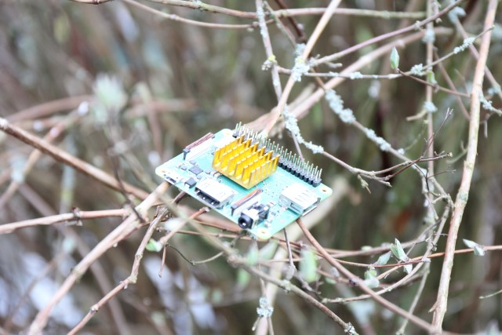

# Release Notes

## March 2024 (version 9.2)

### Overview

The **March 16th, 2024** release of **DietPi v9.2** comes with ... 

Additionally, enhancements and bug fixes for several `dietpi-software` options are included.

{: width="800" height="600" loading="lazy"}

!!! cite "*Photo by `StephanStS`, DietPi*"

### Enhancements

- [**DietPi-Software**](../dietpi_tools/software_installation.md#dietpi-software) :octicons-arrow-right-16: It is now possible to run `dietpi-software list` concurrent to other dietpi-software instances, and as non-root user. This avoids an issue in DietPi-Dashboard, where opening dietpi-software in the Terminal and switching to the Software page, caused an infinite hang.

### Bug fixes

- [**NanoPi R4S**](../hardware.md#nanopi-series-friendlyelec) :octicons-arrow-right-16: Resolved an issue where Ethernet adapter of the "LAN" port could disappear after a soft reboot. Many thanks to @idaanx for reporting this issue: <https://github.com/MichaIng/DietPi/issues/6342>
- **DietPi-Globals** :octicons-arrow-right-16: Resolved an issue where a concurrent DietPi script detection could have prevented the start of a script, if a previous instance was killed via SIGKILL.
- [**DietPi-Tools**](../dietpi_tools.md) | [**DietPi-Config**](../dietpi_tools/system_configuration.md#dietpi-config) :octicons-arrow-right-16: Resolved an issue where a WiFi connection, configured for the first time via dietpi-config from a local terminal session, was automatically stopped when exiting or logging out from the terminal session.

- DietPi-Software | PaperMC: Resolved an issue where installing the Geyser and Floodgate plugins failed due to changed download URLs, and a false syntax in the Geyser config file. Many thanks to @boterocamilo for reporting this issue: https://github.com/MichaIng/DietPi/issues/6898
- DietPi-Software | Nextcloud: Resolved an issue with the updated Nginx config where assets were served with the wrong MIME type. This fix was backported to v9.1 and a live patch offered. Many thanks to @howardroark for reporting this issue: https://dietpi.com/forum/t/nextcloud-theme-broken-after-upgrade-v9-1-1/19372
- DietPi-Software | Home Assistant: Resolved an issue on x86_64 and ARMv8 systems where some core integrations did not work if no C++ compiler was installed. If you are affected by this, "apt install g++ && systemctl restart home-assistant" will fix it. Many thanks to @pdsakurai for fixing this issue in our install code: https://github.com/MichaIng/DietPi/pull/6931
- DietPi-Software | DarkIce: Resolved an issue where the service failed to start due to false config file permissions.
- DietPi-Software | LXQt: Resolved an issue where the installation failed on Trixie and RISC-V systems, since we did not host a config archive for those Debian versions yet. Many thanks to @jtmoon79 for reporting this issue: https://github.com/MichaIng/DietPi/issues/6939

- [**DietPi-Tools**](../dietpi_tools.md) | [**DietPi-Backup**](../dietpi_tools/system_maintenance.md#dietpi-backup-backuprestore)/[**DietPi-Sync**](../dietpi_tools/system_maintenance.md#dietpi-sync) :octicons-arrow-right-16: Both scripts do now only error out when the `rsync` process is already running, rather than on any process which has the term `rsync` in its name. Many thanks to @zuble for implementing this enhancement: <https://github.com/MichaIng/DietPi/pull/6918>
- [**DietPi-Software**](../dietpi_tools/software_installation.md#dietpi-software) | [**Domoticz**](../software/home_automation.md#domoticz) :octicons-arrow-right-16: Enabled for x86_64 Bookworm and Trixie systems, since the latest x86_64 builds were compiled against `libssl3`.
- [**DietPi-Software**](../dietpi_tools/software_installation.md#dietpi-software) | [**vaultwarden**](../software/cloud.md#vaultwarden) :octicons-arrow-right-16: Along with a regular update, RISC-V support has been added.
- [**DietPi-Software**](../dietpi_tools/software_installation.md#dietpi-software) | [**Home Assistant**](../software/home_automation.md#home-assistant) :octicons-arrow-right-16: The Python version installed with Home Assistant has been raised to 3.12.1, to align with official appliances. Many thanks to @whyisthisbroken for making us aware if it: <https://github.com/MichaIng/DietPi/issues/6906>
- [**DietPi-Software**](../dietpi_tools/software_installation.md#dietpi-software) | [**Squeezelite**](../software/media.md#squeezelite) :octicons-arrow-right-16: An update to Squeezelite v2.0.0-1465 will be applied during the DietPi update.

### Bug fixes

- **DietPi-FS_partition_resize** :octicons-arrow-right-16: Resolved an issue where on Bullseye images, the root partition and filesystem was not expanded on first boot. Many thanks to [@naddel91](https://dietpi.com/forum/u/naddel91){: class="nospellcheck"} and others for reporting this issue: <https://dietpi.com/forum/t/increase-partition-size/19015>
- [**DietPi-Software**](../dietpi_tools/software_installation.md#dietpi-software) | [**Mosquitto**](../software/hardware_projects.md#mosquitto) :octicons-arrow-right-16: Resolved an issue where the global software password was accidentally applied as username instead of as password: <https://github.com/MichaIng/DietPi/issues/6886>
- [**DietPi-Software**](../dietpi_tools/software_installation.md#dietpi-software) | [**Amiberry**](../software/gaming.md#amiberry) :octicons-arrow-right-16: Resolved an issue where the installation failed on 64-bit RPi systems. Many thanks to @JerichoCross for reporting this issue: <https://github.com/MichaIng/DietPi/issues/6893>
- [**DietPi-Software**](../dietpi_tools/software_installation.md#dietpi-software) | [**GMediaRender**](../software/media.md#gmediarender) :octicons-arrow-right-16: Resolved an issue where the default command arguments were not set correctly on a fresh install. Many thanks to [@ransur0t](https://dietpi.com/forum/u/ransur0t){: class="nospellcheck"} for reporting this issue: <https://dietpi.com/forum/t/gmediarender-default-args-on-allo-image-for-raspberry-pi/19205>
- [**DietPi-Software**](../dietpi_tools/software_installation.md#dietpi-software) | [**Samba Server**](../software/file_servers.md#samba) :octicons-arrow-right-16: Resolved an issue where our configuration file was not installed if the Samba Client was installed as well, or an SMB/CIFS mount done. Many thanks to [@TheCrystalGipsy](https://dietpi.com/forum/u/TheCrystalGipsy){: class="nospellcheck"} for reporting this issue: <https://dietpi.com/forum/t/samba-share-issues-need-help/19224>
- [**DietPi-Software**](../dietpi_tools/software_installation.md#dietpi-software) | [**Pydio**](../software/cloud.md#pydio) :octicons-arrow-right-16: Resolved an issue where web access via Apache webserver did not work, due to an invalid config entry. However, Pydio 8 is not maintained since years, does not support PHP 8 and hence can only work on Bullseye systems. We will migrate to Pydio Cells, once someone finds time to work on this: <https://github.com/MichaIng/DietPi/issues/3469>
- [**DietPi-Software**](../dietpi_tools/software_installation.md#dietpi-software) | [**OctoPrint**](../software/printing.md#octoprint) :octicons-arrow-right-16: Resolved an issue where system restart and shutdown form the OctoPrint UI failed due to an invalid `sudoers` rule. Many thanks to @samjw-nz for reporting this issue: <https://github.com/MichaIng/DietPi/issues/6915>
- [**DietPi-Software**](../dietpi_tools/software_installation.md#dietpi-software) | [**Squeezelite**](../software/media.md#squeezelite) :octicons-arrow-right-16: Resolved an issue where in rare cases the service could have started before the network adapter was initialised, in which case it reports a MAC address of 00:00:00:00:00:00 to LMS servers. With multiple Squeezelite players, this could have lead to conflicts among them. Many thanks to [@willefg](https://dietpi.com/forum/u/willefg){: class="nospellcheck"} for reporting this issue: <https://dietpi.com/forum/t/dietpi-squeezelite-players-with-same-mac-address-000000-00/19312>
- [**DietPi-Software**](../dietpi_tools/software_installation.md#dietpi-software) | [**RealVNC Server**](../software/remote_desktop.md#realvnc-server) :octicons-arrow-right-16: Resolved an issue where the installation was throwing an error, as it was attempted to write to a config file shipped by TigerVNC only.

As always, many smaller code performance and stability improvements, visual and spelling fixes have been done, too much to list all of them here. Check out all code changes of this release on GitHub: <https://github.com/MichaIng/DietPi/pull/6955>
