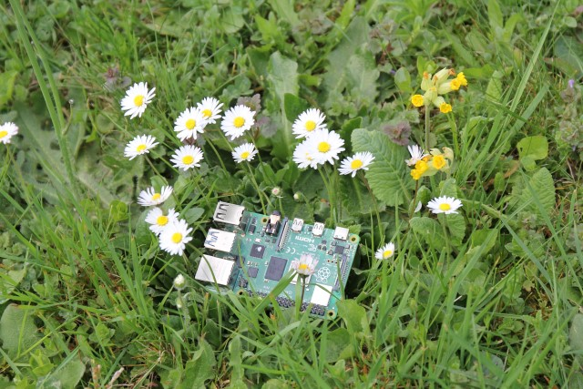

# Release Notes

## April 2024 (version 9.3)

### Overview

The **April 14th, 2024** release of **DietPi v9.3** comes with an own DietPi APT repository, hosted at <https://dietpi.com/apt/>.

{: width="800" height="600" loading="lazy"}

!!! cite "Pi 4B. *Photo by `StephanStS`, DietPi*"

### Enhancements

- **General** :octicons-arrow-right-16: We added an own APT repository at <https://dietpi.com/apt/> for own software and kernel/firmware builds. This simplifies updates for software packages like [Squeezelite](../software/media.md#squeezelite), [vaultwarden](../software/cloud.md#vaultwarden) and [Amiberry](../software/gaming.md#amiberry), and allows us to provide own up-to-date kernel and bootloader packages, applied via regular `apt upgrade`. A goal is also to become independent of some 3rd party repositories, which are regularly affected by network errors or provide package updates too infrequently.
- [**DietPi-Tools**](../dietpi_tools.md) | [**DietPi-Config**](../dietpi_tools/system_configuration.md#dietpi-config) :octicons-arrow-right-16: Removed the 3.5mm audio option on Raspberry Pi 5, as it does not have a 3.5mm jack. Additionally, the KMS graphics driver is enabled OOTB when HDMI audio is selected, as the `snd_bcm2835` driver does not work on Raspberry Pi 5. Many thanks to [@denguido](https://dietpi.com/forum/u/denguido){: class="nospellcheck"} for making us aware of this: <https://dietpi.com/forum/t/19760>
- [**DietPi-Software**](../dietpi_tools/software_installation.md#dietpi-software) | [**Mosquitto**](../software/hardware_projects.md#mosquitto) :octicons-arrow-right-16: The official APT repository added support for 64-bit ARM on Bookworm, which is now used for our installation.
- [**DietPi-Software**](../dietpi_tools/software_installation.md#dietpi-software) | **UnRAR** :octicons-arrow-right-16: Debian added `unrar` packages for RISC-V, which are now used for our installation.

### Bug fixes

- [**Raspberry Pi 5**](../hardware.md#raspberry-pi) :octicons-arrow-right-16: Fixed X11/desktop startup if KMS is enabled. Many thanks to [@denguido](https://dietpi.com/forum/u/denguido){: class="nospellcheck"} for reporting the issue and solution: <https://dietpi.com/forum/t/19760>
- [**DietPi-Software**](../dietpi_tools/software_installation.md#dietpi-software) | [**Logitech Media Server**](../software/media.md#logitech-media-server) :octicons-arrow-right-16: Resolved an issue where the install failed due to a changed download URL. Many thanks to @JRK0469 for reporting this issue: <https://github.com/MichaIng/DietPi/issues/6992>

As always, many smaller code performance and stability improvements, visual and spelling fixes have been done, too much to list all of them here. Check out all code changes of this release on GitHub: <https://github.com/MichaIng/DietPi/pull/7016>
