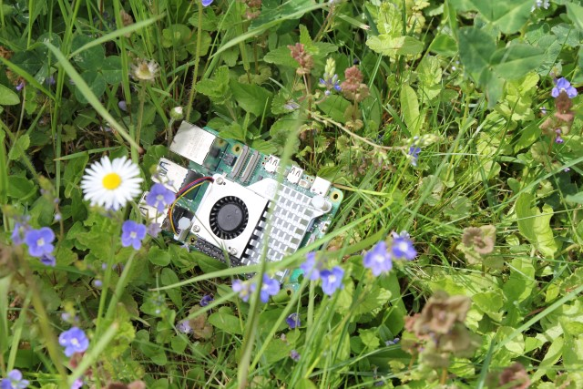

# Release Notes

## May 2024 (version 9.4)

### Overview

The **May 12th, 2024** release of **DietPi v9.4** comes with new images for the ROCK 4C Plus, Orange Pi 3 LTS, Radxa ZERO 3, Orange Pi Zero 2W.

{: width="800" height="600" loading="lazy"}

!!! cite "Pi 5. *Photo by `StephanStS`, DietPi*"

### New images

- [**ROCK 4C Plus**](../hardware.md#radxa) :octicons-arrow-right-16: Since our Radxa ROCK 4 image has become incompatible with the ROCK 4C Plus, we provide a new image for this particular variant. Many thanks to @lfiorini and @arpegius5555 for reporting this issue: <https://github.com/MichaIng/DietPi/issues/6593>, <https://github.com/MichaIng/DietPi/issues/6935>
- [**Orange Pi 3 LTS**](../hardware.md#orange-pi-series) :octicons-arrow-right-16: Added support for this Allwinner H6 based SBC.
- [**Radxa ZERO 3**](../hardware.md#radxa) :octicons-arrow-right-16: Added support for this Rockchip RK3566 based SBC, the 3E variant with Ethernet as well as the 3W variant with onboard WiFi.
- [**Orange Pi Zero 2W**](../hardware.md#orange-pi-series) :octicons-arrow-right-16: Support for this small form factor SBC with Allwinner H618 SoC was added.

### Enhancements

- **General** :octicons-arrow-right-16: Our scripts do now internally enforce the default umask 0022. Many config and install options rely on this, hence it can cause issues when e.g. 0027 (deny read access for "other" users) has been applied on the parent shell. This affects only the (sub)shell of our scripts, while the current and default umask of parent and of shells/consoles remains untouched.
- [**NanoPi R5C**](../hardware.md#nanopi-series-friendlyelec) :octicons-arrow-right-16: New images, or when flashing the new bootloader binary via `dietpi-config` -> `Advanced Options` -> `Update MMC bootloader`, support M.2 WiFi modules.
- [**Orange Pi 3B**](../hardware.md#orange-pi-series) :octicons-arrow-right-16: Added an option for updating the SPI bootloader via `dietpi-config` -> `Advanced Options` -> `Update SPI bootloader`.
- [**Odroid XU4**](../hardware.md#odroid) :octicons-arrow-right-16: The kernel will be upgraded to Linux 6.6.
- [**DietPi-CloudShell**](../software/system_stats.md#dietpi-cloudshell) enhancements :octicons-arrow-right-16: On Odroid XU4, when using the CloudShell 2 LCD, during configured auto screen off times, the backlight power of the LCD will be disabled as well, to safe energy and avoid still visible black display content. Many thanks to `@smac` for suggesting this enhancement: <https://dietpi.com/forum/t/15331/55>
- [**DietPi-Tools**](../dietpi_tools.md) | [**DietPi-Config**](../dietpi_tools/system_configuration.md/#dietpi-config) enhancements :octicons-arrow-right-16: Added an option to the LCD display menu to toggle the Odroid XU4 CloudShell 2 LCD.
- [**DietPi-Software**](../dietpi_tools/software_installation.md#dietpi-software) | [**Snapcast**](../software/media.md#snapcast-server) :octicons-arrow-right-16: 64-bit ARM and Debian Bookworm + Trixie will have the now available packages from Snapcast installed, instead of those from the Debian repository.

### Bug fixes

- [**NanoPi NEO3**](../hardware.md#nanopi-series-friendlyelec) :octicons-arrow-right-16: Resolved an issue where the Ethernet adapter was not available after reboots. Many thanks to @murraythegoz for reporting this issue: <https://github.com/MichaIng/DietPi/issues/6987>
- [**Orange Pi Zero 3**](../hardware.md#orange-pi-series) :octicons-arrow-right-16: Resolved an issue on the 1.5 GiB RAM variant, where the Ethernet adapter was not available anymore after soft/warm reboots.
- [**Orange Pi 5 Plus**](../hardware.md#orange-pi-series) :octicons-arrow-right-16: Resolved an issue where the Ethernet interface names `eth0`/`eth1` could swap on (re)boot. We add a udev rule which assures they are named persistently based on the PCI bus identifier. In case you created own udev rules to mitigate the issue, please check whether they conflict and decide whether to use ours or your solution. The DietPi update will also inform you about this change with a prompt. Many thanks to @dirkhh and many others for reporting this issue: <https://github.com/MichaIng/DietPi/issues/6592>
- [**DietPi-VPN**](../dietpi_tools/software_installation.md#dietpi-vpn) :octicons-arrow-right-16: Resolved an issue where installing the `IPVanish` config failed, due to a changed URL, and startup failed on Bookworm systems since their configs contain a deprecated option. Many thanks to @DreamPhreak and @Michael-Robson for reporting this issue: <https://github.com/MichaIng/DietPi/issues/7043>
- **DietPi-Imager** :octicons-arrow-right-16: Resolved an issue where `dietpi-imager` could have failed on GPT partitioned images, if either the source image size did not leave space for the GPT backup partition table, or the first usable LBA/sector was above 34. The GPT backup partition table is now created only at the end of the image generation, not anymore additionally at the start, and the required size it takes is correctly obtained. Many thanks to @SelfhostedPro and @disablewong for reporting this issue: <https://github.com/MichaIng/DietPi/issues/7024>, <https://dietpi.com/forum/t/18035>
- [**DietPi-Config**](../dietpi_tools/system_configuration.md/#dietpi-config) enhancements :octicons-arrow-right-16: Resolved a visual-only failure message on non-RPi systems, when enabling Bluetooth, and an actual failure doing so on Orange Pi Zero 3, Orange Pi 3B and Orange Pi Zero 2W, since the required kernel module `sprdbt_tty` was not loaded. Many thanks to @b9AcE for reporting this issue: <https://dietpi.com/forum/t/19929/45>
- [**DietPi-Software**](../dietpi_tools/software_installation.md#dietpi-software) | [**Snapcast**](../software/media.md#snapcast-server) :octicons-arrow-right-16: Resolved an issue where version 0.27.0 was installed, because since version 0.28.0, Snapcast is provided with client and server packages wrapped into one archive, instead having individual downloads for each package.
- [**DietPi-Software**](../dietpi_tools/software_installation.md#dietpi-software) | [**OctoPrint**](../software/printing.md#octoprint) :octicons-arrow-right-16: Resolved an issue where the installation failed on RISC-V and ARMv6/7 Bullseye systems, due to changed dependencies.
- [**DietPi-Software**](../dietpi_tools/software_installation.md#dietpi-software) | [**X.Org X Server**](../software/desktop.md#desktop-environments-utilities) :octicons-arrow-right-16: Resolved an issue where an important config file might have been missing on RPi 5 and potentially Amlogic S905 SBCs, if the config directory `/etc/X11/xorg.conf.d` did not exist and was not created as part of the related APT packages. Many thanks to @rmscode for reporting this issue: <https://dietpi.com/forum/t/19963>

As always, many smaller code performance and stability improvements, visual and spelling fixes have been done, too much to list all of them here. Check out all code changes of this release on GitHub: <https://github.com/MichaIng/DietPi/pull/7063>
