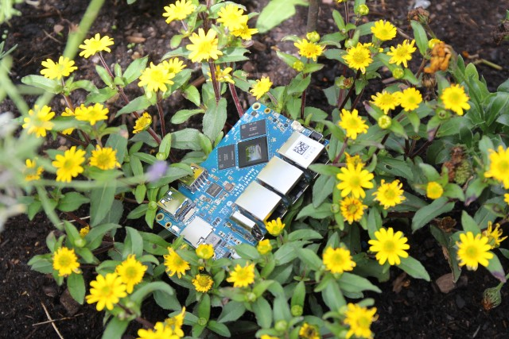

# Release Notes

## June 2024 (version 9.5)

### Overview

The **June 9th, 2024** release of **DietPi v9.5** comes with new the new software package Forgejo (a Gitea fork) and further enhancements resp. bug fixes.

{: width="800" height="600" loading="lazy"}

!!! cite "NanoPi R6S. *Photo by `StephanStS`, DietPi*"

### New software

- [**DietPi-Software**](../dietpi_tools/software_installation.md#dietpi-software) | [**Forgejo**](../software/cloud.md#forgejo) :octicons-arrow-right-16: This Gitea fork has been added to our software library. Read about the background of this fork here: <https://forgejo.org/2022-12-15-hello-forgejo/>. Many thanks to @Cs137 for requesting and @jcnils for implementing this software option: <https://github.com/MichaIng/DietPi/discussions/6133>, <https://github.com/MichaIng/DietPi/pull/7071>

### Enhancements

- **Images** :octicons-arrow-right-16: New DietPi images won't contain the `gnupg` package anymore, but `gpg` only, since other features of the suite are not required for our scripts anymore. E.g. `dirmngr` for interacting with key servers, and `gpg-agent` for key passphrase inputs are hence missing. `gpg` however prints very clear error messages about what is missing. Let us know whether you find one of those `GnuPG` features too essential to not be pre-installed.
- [**Radxa ZERO 3**](../hardware.md#radxa) :octicons-arrow-right-16:  Onboard WiFi does now work OOTB on early ZERO 3W revisions with AP6212 WiFi chip.
- [**Quartz64**](../hardware.md#pine64)/[**Star64**](../hardware.md#pine64_1)/[**VisionFive 2**](../hardware.md#starfive) :octicons-arrow-right-16: dm-crypt/LUCS support has been added to the kernel for those two SBCs. Many thanks to @gxsw for reporting this missing feature: <https://github.com/MichaIng/DietPi/issues/7091>
- [**DietPi-Software**](../dietpi_tools/software_installation.md#dietpi-software) | [**Jellyfin**](../software/media.md#jellyfin) :octicons-arrow-right-16: Since a while FFmpeg 6 is available for Jellyfin, but on old installs with the old FFmpeg 5 package, it is not upgraded automatically by APT. This DietPi update applies the FFmpeg upgrade to all affected systems. Many thanks to @gioxx and @WolfganP for reporting this issue: <https://github.com/MichaIng/DietPi/issues/7080>
- [**DietPi-Software**](../dietpi_tools/software_installation.md#dietpi-software) | [**MediaWiki**](../software/social.md#mediawiki) :octicons-arrow-right-16: Uploaded images are now preserved on reinstalls.

### Bug fixes

- **Hardware** | [**Odroid C1/C2**](../hardware.md#odroid) :octicons-arrow-right-16: Resolved an issue on both SBCs where reboots could hang and a power cycle was required to get the device back up. Many thanks to @yandritos, @gociii and others for reporting this issue, and @gitmeister for providing the fix for Odroid C2: <https://github.com/MichaIng/DietPi/issues/5414>, <https://github.com/MichaIng/DietPi/issues/6332>
- [**Orange Pi Zero 2W**](../hardware.md#orange-pi-series) :octicons-arrow-right-16: Resolved an issue where the onboard Ethernet adapter did not work.
- [**NanoPi NEO**](../hardware.md#nanopi-series-friendlyelec) :octicons-arrow-right-16: Resolved an issue where LEDs of this SBC could not be configured, due to a conflicting kernel patch. Many thanks to @mhjessen for reporting this issue: <https://github.com/MichaIng/DietPi/issues/5401>
- [**DietPi-Config**](../dietpi_tools/system_configuration.md/#dietpi-config) enhancements :octicons-arrow-right-16: Resolved an issue where Advanced Options were not accessible on some SBCs. Many thanks to @thuehlinger for reporting this issue: <https://github.com/MichaIng/DietPi/issues/6663#issuecomment-2108351878>
- [**DietPi-Software**](../dietpi_tools/software_installation.md#dietpi-software) | [**Snapcast Server**](../software/media.md#snapcast-server) :octicons-arrow-right-16: Resolved on issue where on RISC-V systems, the web interface was not available, since it is not included in the `snapserver` package from Debian. Many thanks to @hllhll for reporting this issue: <https://github.com/MichaIng/DietPi/issues/7073>
- [**DietPi-Software**](../dietpi_tools/software_installation.md#dietpi-software) | [**Snapcast Server**](../software/media.md#snapcast-server) :octicons-arrow-right-16: Resolved an issue where on Bookworm systems, which installed the Snapcast Server before DietPi v9.4 and reinstalled it afterwards, the server failed to start due to a permissions issue, since the services of both packages use different users. Many thanks to @hllhll for reporting this issue: <https://github.com/MichaIng/DietPi/issues/7073>
- [**DietPi-Software**](../dietpi_tools/software_installation.md#dietpi-software) | [**Shairport Sync**](../software/media.md#shairport-sync) :octicons-arrow-right-16: Resolved a DietPi v9.4 regression, where the AirPlay 2 choice did not have an effect, but the AirPlay 1 package was always installed. Additionally, uninstalling Shairport Sync will now also purge the AirPlay 2 package. Many thanks to @pulpe for fixing this bug: <https://github.com/MichaIng/DietPi/pull/7082>
- [**DietPi-Software**](../dietpi_tools/software_installation.md#dietpi-software) | [**Box64**](../software/gaming.md#box64) :octicons-arrow-right-16: Resolved an issue where an invalid build target was used on Raspberry Pi 5 with 16k page size kernel. This target was removed with latest Box64, as page size handling is now done at runtime.
- [**DietPi-Software**](../dietpi_tools/software_installation.md#dietpi-software) | [**Jellyfin**](../software/media.md#jellyfin) :octicons-arrow-right-16: Resolved an issue where the intended HTTP port change could not be applied, since the network config file is not created anymore at service start. We do now pre-create a minimal one, which is complemented with defaults automatically.

As always, many smaller code performance and stability improvements, visual and spelling fixes have been done, too much to list all of them here. Check out all code changes of this release on GitHub: <https://github.com/MichaIng/DietPi/pull/7098>
