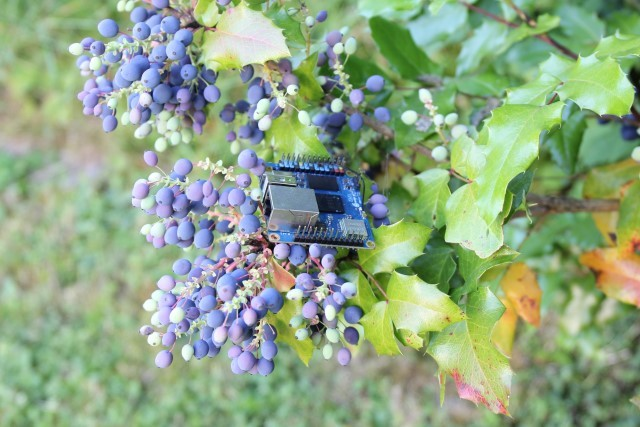

# Release Notes

## July 2024 (version 9.6)

### Overview

The **July 7th, 2024** release of **DietPi v9.6** comes with new the new software package soju (an IRC bouncer) and further enhancements resp. bug fixes.

{: width="800" height="600" loading="lazy"}

!!! cite "Orange Pi Zero 3. *Photo by `StephanStS`, DietPi*"

### New software

- [**DietPi-Software**](../dietpi_tools/software_installation.md#dietpi-software) | **soju** :octicons-arrow-right-16: <https://github.com/MichaIng/DietPi/pull/7124>

### Enhancements

- **General** :octicons-arrow-right-16: Since we provide all kernel, bootloader and firmware packages from our own APT repository now, the Armbian APT repository is removed from all systems. In case you use an SBC which is not officially supported by DietPi, as generic device, it is however preserved.
- [**Quartz64**](../hardware.md#pine64)/[**Star64**](../hardware.md#pine64_1)/[**VisionFive 2**](../hardware.md#starfive) :octicons-arrow-right-16: The extended attribute handler for ext4 security labels `CONFIG_EXT4_FS_SECURITY` has been enabled for these SBCs, required for some Docker containers. Many thanks to @gxsw for reporting this missing feature: <https://github.com/MichaIng/DietPi/issues/7102>
- [**Quartz64**](../hardware.md#pine64)/[**Star64**](../hardware.md#pine64_1)/[**VisionFive 2**](../hardware.md#starfive) :octicons-arrow-right-16: `eBPF` functionality for firewall and network monitoring software like Cilium has been added to our kernel builds for these SBCs. Many thanks to @kbrighton for reporting these missing features: <https://github.com/MichaIng/DietPi/issues/6834>
- [**Orange Pi 5**](../hardware.md#orange-pi-series) :octicons-arrow-right-16: Older U-Boot builds caused the Ethernet MAC address to be random and change on every boot. Recent U-Boot builds solve this, but they are not flashed automatically on package upgrades. We hence inform users and offer to flash the latest U-Boot image during the DietPi update. Many thanks to @thuehlinger for reporting and testing the case: <https://github.com/MichaIng/DietPi/issues/6663>
- [**DietPi-Config**](../dietpi_tools/system_configuration.md/#dietpi-config) enhancements :octicons-arrow-right-16: Legacy Odroid C2 resolution and GPU memory options have been removed.
- [**DietPi-Config**](../dietpi_tools/system_configuration.md/#dietpi-config) enhancements :octicons-arrow-right-16: The static DNS server menu now contains entries to select the default gateway/router or locally running DNS resolver (`Pi-hole`, `AdGuard Home`, `Unbound`, `systemd-resolvd`, ...), if detected.

### Bug fixes

- **Network** | Resolved a rare issue, where shutdowns could hang, when `networking.service` and `ifup@.service` instances try to bring down the same network interface concurrently. Many thanks to @ioctl2 for reporting this issue: <https://github.com/MichaIng/DietPi/issues/7104>
- [**Odroid C1**](../hardware.md#odroid) :octicons-arrow-right-16: Resolved an issue, where the kernel upgrade did not apply as intended. Many thanks to @th2j for reporting this issue: <https://github.com/MichaIng/DietPi/issues/6332#issuecomment-2162959873>
- [**VisionFive 2**](../hardware.md#starfive) :octicons-arrow-right-16: Resolved an issue where our new image did not boot, because of a false device tree name in `/boot/extlinux/extlinux.conf`.
- [**NanoPi R6C**](../hardware.md#nanopi-series-friendlyelec) :octicons-arrow-right-16: Resolved an issue where our new images did not boot, since the latest mainline U-Boot for R6S does not support the R6C anymore. Many thanks to @labmaster for reporting this issue: <https://github.com/MichaIng/DietPi/issues/7109>
- [**DietPi-Tools**](../dietpi_tools.md) | [**DietPi-Banner**](../dietpi_tools/misc_tools.md#dietpi-banner) :octicons-arrow-right-16: Resolved an issue where incorrect RAM usage was printed with German and potentially other locales. Many thanks to @jwgn for reporting this issue: <https://github.com/MichaIng/DietPi/issues/7107>
- [**DietPi-Tools**](../dietpi_tools.md) | [**DietPi-Banner**](../dietpi_tools/misc_tools.md#dietpi-banner) :octicons-arrow-right-16: Resolved an issue where logins as non-root user printed "No certificate found" if the Let's Encrypt cert status option was enabled, since non-root users have no permission to see the certificate files. In such cases, sudo is now used automatically, if the user has `NOPASSWD` permissions, else a meaningful info is shown. Many thanks to @FrapiFrance for implementing this fix: <https://github.com/MichaIng/DietPi/pull/7121>
- [**DietPi-Tools**](../dietpi_tools.md) | [**DietPi-Drive_Manager**](../dietpi_tools/system_configuration.md#dietpi-drive-manager) :octicons-arrow-right-16: Resolved an issue, where network drives and potentially mounts in general could be attempted to be unmounted on shutdown, before services which can access them are stopped, leading to hanging shutdown sequences and potentially even data loss. Many thanks to [@polite-garlic](https://dietpi.com/forum/u/polite-garlic){: class="nospellcheck"} for reporting this issue: <https://dietpi.com/forum/t/20542>
- [**DietPi-Software**](../dietpi_tools/software_installation.md#dietpi-software) | [**DietPi-Dashboard**](../software/system_stats.md#dietpi-dashboard) :octicons-arrow-right-16: Resolved an issue where the installation on RISC-V systems failed.
- [**DietPi-Software**](../dietpi_tools/software_installation.md#dietpi-software) | [**Node-RED**](../software/hardware_projects.md#node-red) :octicons-arrow-right-16: Resolved an issue where reinstalls/updates failed because of incompatibilities between latest Node.js or global modules with older local instances. Many thanks to @thinkbig1979 for reporting this issue: <https://github.com/MichaIng/DietPi/issues/7128>
- [**DietPi-Software**](../dietpi_tools/software_installation.md#dietpi-software) | [**Fail2Ban**](../software/system_security.md#fail2ban) :octicons-arrow-right-16: Resolved an issue on Debian Bookworm and above, where Dropbear login failures were not detected due to a non-matching default filter. Dropbear runs as native systemd unit since Bookworm, logging to the system journal via `STDOUT`, which results in a different log entry prefix. The default filter however has not been updated for this. The fix is as well applied to existing Fail2Ban installs, as long as no own override `/etc/fail2ban/filter.d/dropbear`.local has been created. Many thanks to @ThePlanplan for reporting this issue: <https://github.com/MichaIng/DietPi/issues/6665>

As always, many smaller code performance and stability improvements, visual and spelling fixes have been done, too much to list all of them here. Check out all code changes of this release on GitHub: <https://github.com/MichaIng/DietPi/pull/7142>
