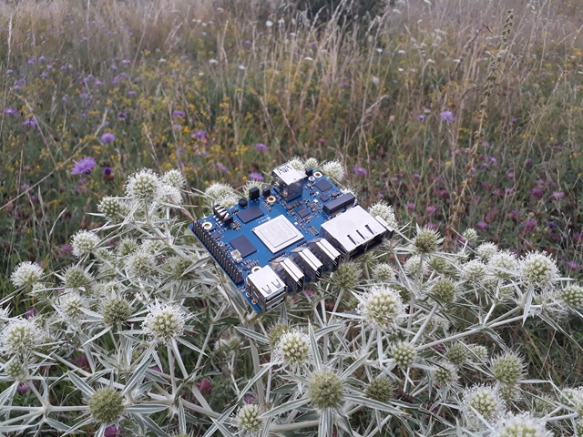

# Release Notes

## August 2024 (version 9.7)

### Overview

The **August 25th, 2024** release of **DietPi v9.7** is a minor update, which offers a major kernel upgrade for RK3588 SoC SBCs, improvements for the ODROID N2, ODROID C1, and some bug fixes.

{: width="640" height="480" loading="lazy"}

!!! cite "Orange Pi 5 Plus. *Photo by `MichaIng`, DietPi*"

### Enhancements

- [**Odroid N2**](../hardware.md#odroid) :octicons-arrow-right-16: Added an option to update (flash) the SPI bootloader to the dietpi-config "Advanced Options" menu.
- [**Odroid C1**](../hardware.md#odroid) :octicons-arrow-right-16: This DietPi update performs a migration of all Odroid C1 systems which run in "current" branch Linux 6.6 to edge branch kernel with Linux 6.9 or later. This solves non-functional USB ports: <https://github.com/MichaIng/DietPi/issues/7089>
- [**NanoPi R5S/R5C/R6S/R6C/T6**](../hardware.md#nanopi-series-friendlyelec), [**Orange Pi 5/5 Plus**](../hardware.md#orange-pi-series), [**ROCK 5**](../hardware.md#radxa) :octicons-arrow-right-16: New RK3588 images will be shipped with Linux 6.1 from now on. This DietPi update offers a migration from the legacy Linux 5.10 kernel to this "vendor" Linux 6.1 kernel, from newer and cleaner Rockchip kernel sources. Old NanoPi R5S/R5C images with 8 partitions setup will be migrated to mainline Linux 6.6. Aside of new kernel features, it provides cleaner higher quality code, so we generally recommend the upgrade. However, we do not enforce it, and it makes sense to have a backup in place, and you can do the migration any time later. Next DietPi update, unless there were serious issue reported with the migration, we will enforce it for everyone, to get all RK3588 and NanoPi R5S/R5C systems up to a further supported and updated kernel source.
- [**DietPi-Banner**](../dietpi_tools/misc_tools.md/#dietpi-banner) :octicons-arrow-right-16: An option has been added to show the CPU load as common 1/5/15 minutes averages. Many thanks to @rkok for implementing this feature: <https://github.com/MichaIng/DietPi/pull/7186>

### Bug fixes

- [**DietPi-Software**](../dietpi_tools/software_installation.md#dietpi-software) | [**Box64**](../software/gaming.md#box64) :octicons-arrow-right-16: Resolved an issue where the installation failed because of a false directory removal attempt. Many thanks to @lukaszsobala for fixing this issue: <https://github.com/MichaIng/DietPi/pull/7149>
- [**DietPi-Software**](../dietpi_tools/software_installation.md#dietpi-software) | [**Bazarr**](../software/bittorrent.md#bazarr) :octicons-arrow-right-16: Resolved an issue where service stops and restarts were hanging until timeout, leading also to hanging system shutdowns and restarts. Many thanks to [@clarky000](https://dietpi.com/forum/u/clarky000){: class="nospellcheck"} and [@blablazzz](https://dietpi.com/forum/u/blablazzz){: class="nospellcheck"} for reporting this issue, and [@gregordinary](https://dietpi.com/forum/u/gregordinary){: class="nospellcheck"} for pointing us to the solution: <https://dietpi.com/forum/t/19610>
- [**DietPi-Software**](../dietpi_tools/software_installation.md#dietpi-software) | [**WiFi HotSpot**](../software/advanced_networking.md#wifi-hotspot) :octicons-arrow-right-16: Resolved an issue where the hotspot failed because of an unintended character in the interface configuration. Many thanks to [@wimduk](https://dietpi.com/forum/u/wimduk){: class="nospellcheck"} for reporting this issue: <https://dietpi.com/forum/t/20744>

As always, many smaller code performance and stability improvements, visual and spelling fixes have been done, too much to list all of them here. Check out all code changes of this release on GitHub: <https://github.com/MichaIng/DietPi/pull/7193>
